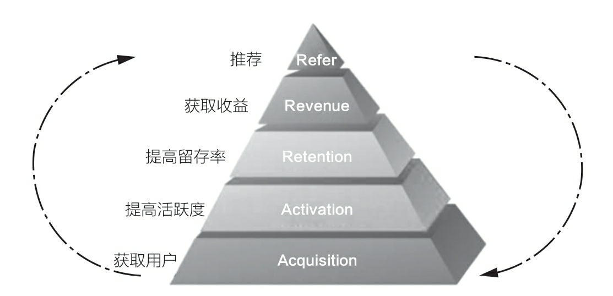
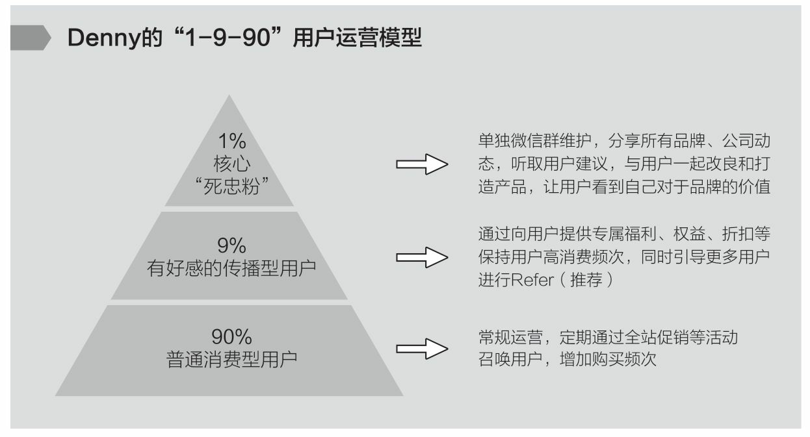
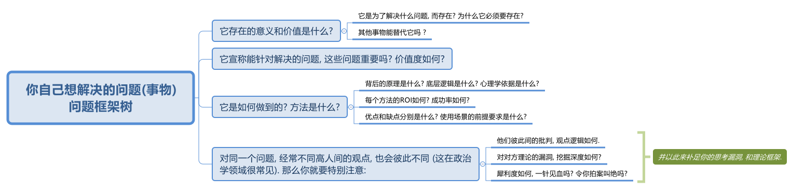

= 谋事者
:toc: left
:toclevels: 3
:sectnums:
:stylesheet: myAdocCss.css

'''

== 谋事者

.你一直考虑什么, 你就会成为什么
[%collapsible%open]
====
想把一件事做好，就只能把这个行业里所有的事情打通。即: 要像项目负责人一样思考。我哪怕只是为了写好当时的一条段子，我也得像这个节目的制片人一样思考。*事实是, 如果你一直像制片人这么思考的话，你最后就是会变成制片人。*

'''
====

.★ “单点收获”思维, 和”多点收获”思维
[%collapsible%open]
====
[.small]
[options="autowidth" cols="1a,1a"]
|===
|“单点收获”思维 |”多点收获”思维

|小A: +
找了几个产品卖点，按照以往的套路和模板写好一篇推广文案，大意就是我们上线了一个新产品，特别厉害，限时优惠，快来买吧。

|小B:

1. 这是一个全新创新意义的产品，也因为新，部分用户的接受度不好说，所以更建议通过“提供特殊折扣，限量邀请部分用户试用”的方式进行第一波推广。为了便于获得他们的反馈，可以直接拉一些首批特邀用户进微信群。

2. 在第一波推广过程及用户试用过程中，需要重点关注3类数据，依据这3类数据，决定接下来1～2周的工作如何开展。

3. 行业内，有3家公司过去一年内发布过类似但又不完全相同的产品，所以要尽快了解这3款产品在最近几个月以来的表现，以及主要的营销推广渠道和方式，以此指导新产品的后续营销工作。
|===

你会发现，面对同样一件事，小A与小B的思考和关注差别很大 ——*小A关注的只是如何写好一篇推广文案发出去，而小B关注的则是整个新产品的营销策略如何制定，如何利用当前这一次推广获取更多有效的信息 (获得更多成长)。*

'''
====

.掌握"通用能力”
[%collapsible%open]
====
- *我从没问过”我需要学习xxx吗?” 我需要什么(需要搞定什么)，就学习什么。*
- 开的公司成功需要什么，你就学习什么！ (懂产品、懂商业, 懂组织、懂战略, 学会了融资、会公开演讲、会社交... ) 你必须解决所有问题，让公司进入快速发展期.

'''
====

.你做生意, 所有的核心业务模块是关于"如何运转"的，有哪些关键节点，风险和机会往往来自哪里等。
[%collapsible%open]
====
任何一类商业组织，都是一个系统. 而一个系统，往往是由N个子系统（或称为业务模块）构成的。如果你想管理和操盘整个系统的运转，并重新定义和设计整个系统的结构，你得熟悉整个核心模块的逻辑、构成，知道它们是如何运转的。

要想成为一家公司的操盘者，你必须知晓这家公司**所有的核心业务模块是如何运转的，有哪些关键节点，风险和机会往往来自哪里等。** +
要知道模块间彼此的关系、**每个模块管理的要点和难点**，能够在每个模块出现问题时, 分析和提出解决方案. +

在对应问题面前，你要能够看到, 并深刻理解一类已经被验证行之有效的系统模型，并用它理解和思考部分问题。(模型思维)

[.small]
[options="autowidth" cols="1a,1a"]
|===
|Header 1 |Header 2

|很多硅谷创业公司采用的 AARRR的运营体系.
|

|用户运营的“1-9-90”模型
|你的受众目标, 最终可以被分成 1%、9%和90%这三个人群: +
-> 1%的“死忠粉” : +
-> 9%的人会经常分享 : 1. 将他们吸收为你的会员, 进行会员运营. 2. 开发"分享工具", 方便他们进行分享. +
-> 剩下90%的人, 为你贡献最多收入.

|要支撑起一个新商业模式的持续存在, 必须拥有: +
1.稳定的消费需求、 +
2.稳定的商家解决方案、 +
3.可预期的收益空间(ROI).
|用这三个要素, 来衡量一个”共享经济项目”能否成功.

|===

'''
====

.★★ *要掌握一系列技巧(工具包, 方法论, 理论模块, 模型思维)去解决问题。*
[%collapsible%open]
====
- 知道如何在这个世界上生存，**洞悉竞争中的各种规则和规律，并学会利用规则去赢得基本竞争。**
- **系统地研究和学习行业内的成熟高手，找到可遵循依赖的方法论.**
- 一个领域内, 方法论可能有很多流派. 重要的是，你选了一派自己认同的方法论后，要能够深入地研究它、了解它，并充分实践、内化、吃透，让自己做出足以胜过大多数人的东西。

'''
====

== 创建自己的 理论/方法论"架构大树"

.你被启发出来的思考, 价值要远远超过你看到的思想
[%collapsible%open]
====
- **看书最重要的收获,** 不是为了书上所写的内容，而**是你在看书时，被启发思考出来的你自己的观点。正是这些观点**, 才导致书上那些事情和研究的后来发生. 出发点是万物之源, 没有出发点，就不会发生之后的一切政治思想，思考，理论.

'''
====

.★★★ 对任何"事物"做出你自己的判断, 都要问4个问题
[%collapsible%open]
====
1. 它存在的意义和价值是什么? 即, *它是为了解决什么问题, 而存在?* 为什么它必须要存在? *它(该理论, 该方法)的同类竞争对手有哪些? 其他事物能替代它吗 ?*

2. *它宣称能针对解决的问题, 这些问题重要吗? 价值度如何?*

3. 它是如何做到的? 方法是什么? *背后的原理是什么?* 底层逻辑是什么? 心理学依据是什么? *每个方法的ROI如何? 成功率如何? 优点和缺点分别是什么?* 使用场景的前提要求是什么?

4. 没有一个理论是完美无缺的. 对同一个问题, 经常不同高人间的观点(所站角度), 也会彼此不同 (这在政治学领域很常见). 那么你就要特别注意**他们(即竞争性理论)彼此间的批判, 观点逻辑如何. 对对方理论的漏洞, 挖掘深度如何? 犀利度如何,** 一针见血吗? 令你拍案叫绝吗? 并以此来补足你的思考漏洞, 和理论框架.

理论的思想演变历史, 能让我们知道它一路在解决的缺点.  +
不迷信任何理论, 就去查看它一路演过来的思想史. (背后的逻辑演变链条, 前因后果, 渊源发展路径). *因为每一次发展更新, 都是它试图解决自己原先的缺陷.*

'''
====

.创建你自己的一颗大树, 建立你自己的"理论架构树"!
[%collapsible%open]
====
- 各科都有自己的理论框架模型，就像一棵棵不同长相的大树. 你不可能记住世上所有的树（各种学科的各种理论框架），而且未来还会永远有新树出来. 但你一定能记住你自己, 从零创造出来的这一棵树 (自己的框架)！ 即, 你能以你的“一”，来统其他的“万“。 +
将管理学的书,找出里面的所有模型, 把前人总结出来的模型， 用MECE法则, 来重新分析拆解,组装到你自己的"理论架构树"上. +
*每个阶段的问题, 有每个阶段的思维模型(解决方法).*

- 一棵树上的叶子万万千（各种规律现象发现），我们去单独直接记忆所有的叶子是错误的. 我们要理解弄懂的, 是更少的树干，树枝(即"本源出发点"). 正是树干, 推导出了树枝, 树枝又推导出了树叶.

- 只记底层的本质逻辑. 而不要抄别人的原话.

- 要翻译成自己的话, 你才能记得住.

- 做书籍笔记, 不要啰嗦, 只要提取出解决问题的"思维模型(模块)"即可. 并且画图出模块系统.

'''
====

.如果世上还没有我关心的主题的"方法论", 我就建立自己的"方法论".
[%collapsible%open]
====
我不能因为世上还没有某方法论，我就一直在等待. 别人没做方法论的，我就自己创建自己的方法论。这样我事事才不会停下脚步，停滞不前。

'''
====

.★ 很多事根本不存在所谓的“正确答案”，只有长期可依赖的答案。
[%collapsible%open]
====
- **很多时候，通过理性思考得出的答案也仍然会改变。但那无关紧要，因为你用来面对不确定性和寻求安全感的工具, 已经成为了“思考”这种方法，而不是通过思考得出的某个确定答案。** +
正如何帕斯卡所说：“人是有思想的芦苇，我们的全部尊严和最具有价值之处，就在于思想。”

- **很多事根本不存在所谓的“正确答案”，只有长期可依赖的答案。** 常常是那些拥有某种坚定不移的投资理念的人, 最终获得了巨大成功: 巴菲特的“价值投资”，索罗斯追求高风险高回报的“反身理论”，瑞·达里奥追求稳健资产组合的“恪守原则”。

'''
====

== 复盘 (实践是检验真理的唯一标准)

- 只有努力的人才会感到迷茫。（说得太对了） 所以"实践是检验真理的唯一标准".

.不复盘, 就意味着光采坑了, 而什么教训都没从里面学到
[%collapsible%open]
====
- 经历了文革，国人没有反思，就走不出食人部落，文革重演的所有元素都存在了下来.

'''
====

.*知识学而不用, 你就没用实践来检验它的真伪与否.*
[%collapsible%open]
====
- 知识如果学而不用, 不去用的知识, 你没有通过实践来检验它的正确程度, 及起作用的条件范围，那么你对这个知识的 (1)可置信, 和 (2)熟练掌握程度, 就只会处在肤浅的刚接触阶段。

'''
====

."因然" 与 "实然"的区分, "猜想"和"实际"的区别
[%collapsible%open]
====
- 你是处于"无根据的认为(Lip Service)", 还是"有根据的知道"?

- 人们习惯于把未验证的"假设", 粉饰成有理有据的"真知"，造成严重后果。  +
(1.老毛语录那一套, 就是反面典型. 实践才是检验某理论是否是“真理”的唯一标准.  +
2.中国古人那一套周易八卦, 阴阳风水, 中医理论, 都是最早的那批古人的想当然迷信, 后人还不去证伪, 反而去变着花样创造理由(理论)去维护老祖宗的迷信. 因为古人不相信后人会进步超越, 只相信前人是"经典宗师")

- “人性如何", 和“上帝的存在”一样，是个信仰(价值观)的问题，完全不是个科学真理的问题。

- 有些专家认为, 花呗在不逾期的情况下，对用户不会受任何影响。*然而, 花呗用户未来能否顺利拿到贷款，特别是金额较大房贷，不取决于专家的猜想. 银行自己的“态度”才是关键!*

'''
====

== 工具人

.工具人会得职业病.
[%collapsible%open]
====
- 做剪辑这种职业的人，要不就是得胃病（剪视频可以忘记吃饭），要不就是得失眠（睡觉脑里还在剪视频），要不耳朵痛（整天挂着耳机）。

'''
====

