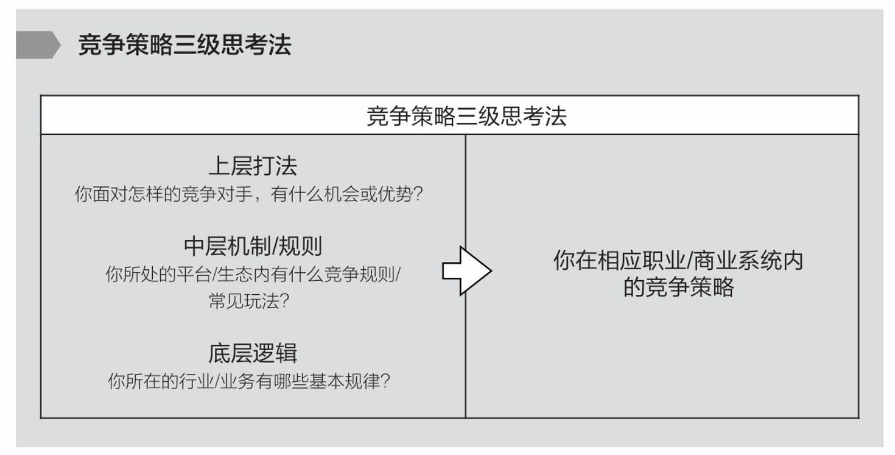
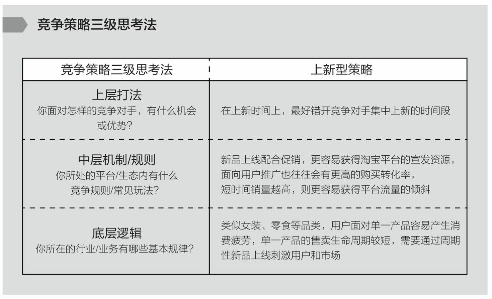

= 做事
:toc: left
:toclevels: 3
:sectnums:
:stylesheet: myAdocCss.css

'''

做事 (是"获得你的影响力", 或"展现你的影响力"的必经方式)

.*权力与责任必须对等*
[%collapsible%open]
====
- 消费者购买某产品, 必定要通过"用户之旅"的全过程. 所以不能让负责最前端内容推广的公关人, 直接承诺最后一个环节的销售成果.

'''
====

.做事不要怕! 你的态度应该是从"自我沉浸" 改为"自我抽离"
[%collapsible%open]
====
- 做事不要怕! 正确的做法是什么呢? 从"自我沉浸" 改为"自我抽离"(就像演员演戏一样). 不要把自己代入, 而是站在第三方角度, 来考虑你担心中会遇到的问题:

[.small]
[options="autowidth" cols="1a,1a"]
|===
|Header 1 |Header 2

|原因
|造成这些问题的原因是什么？包括表面原因, 和深层原因.  +
其中有哪些是由于我行动不当所导致的？有哪些是我无法控制、无法决定的？

|结果
|如果换了别人，他是否会跟我碰到一样的问题，会做得比我更好吗？

|带来的影响
|这个问题有哪些可能的结果？它们发生的可能性有多高？对我有多大的实质影响？ +
其实很多无论为何种结果，对你都没有实质性的影响。
|===

- 我经常劝年轻人，不要害怕，你的上级把任务交给你的时候，预期就是你会搞砸。你为什么觉得他会把一个绝对不能搞砸的事情, 交给你呢?

'''
====

."有用"比"绝对为真"更重要.
[%collapsible%open]
====
- **科学界一般公认，没有任何一种理论百分之百绝对正确。判断它真正价值的, 是它的实用性 (比如量子力学理论)。**即 : 对“某知识”的价值评判, 不在于其在哲学上是否绝对为真实，而在于它是否能让人得到力量。(即, 别本末倒置. “判断为真”只是手段, 不要把手段当目的.)

'''
====

.只要是人制定的、做出来的，就一定是有漏洞的（不完善的）
[%collapsible%open]
====
- 事情是人做出来的, 规则是人定出来的, 只要是人制定的、做出来的，就一定是有漏洞的（不完善的）、需要改进的, 创新的。(否则, 人类社会中的一切就不会再发展.)
- 重要的是，这些路不是用来局限住你的，而只意味着提供你一些选择的途径. *没有创新精神的人, 永远也只能是一个执行者。*
- “理在事中”，能成事就是有理。世事往往是“以迂为直”。如果两点之间的直线阻力却最大，那么这根直线，其实是最远的路径。
- 在“我是对的”和“有效果”之间，你必须做一个选择。你认为的好坏，和你的婚姻关系相比较，哪个更重要？

- *所有伟大的真理开始都离经叛道。权威的思想将它的某些力量赋予敢于向它挑战的人。没有创新精神的人永远也只能是一个执行者。* (就像郭德纲说的: 唱戏, 到七老八十了还亦步亦趋前人的做法? 你不可能永远是一个学徒!)

- 向那些疯狂的家伙们致敬，他们特立独行，他们桀骜不驯，他们惹事生非，他们格格不入，*他们用与众不同的眼光看待事物，他们不喜欢墨守成规，他们也不愿安于现状。你可以赞美他们，引用他们，反对他们，质疑他们，颂扬或是诋毁他们，但唯独不能漠视他们。因为他们改变了事物。*  — 乔布斯

'''
====

.人制定下的制度, 是很难延续下去的, 会经常变
[%collapsible%open]
====
[.small]
[options="autowidth" cols="1a,1a"]
|===
|Header 1 |Header 2

|每个人都有不同的想法, 就像每个领导都有不同的方向思路一样, 所以前人定的制度一定会被后人废弃掉.
|清朝的太子继承问题 (秘密立储制度), 实行了不过四代就废了。中国古代很多制度都是如此，因为它是要靠人来执行的.  +
(原因是: 1.人不做, 再好的制度就会被废弃掉. 2. *每个人都有不同的想法, 就像每个领导都有不同的方向思路一样, 对”采取哪种制度最好”的看法也是不一样的.*)

|很多时候，所谓的新官上任三把火，其实是服从性测试：我的决策对不对不重要，重要的是我的决策你能不能执行。
|我在互联网公司的时候，也遇到过空降上司。这位来自另一家竞品的领导，一上任就搞出了全新的「毫米级日报」项目：1.每天写日报, 而且要细化到每小时; 2.每天都要写业务感想，业务推进策略，单项目不得少于500字。 +
有一个小 Leader 觉得没意义。没法天天写感想，业务也不是按小时去推进的。于是，他顶着压力，和新上司沟通，要求给下面人减负。结果是他被当了典型，恭送出门……（时隔多年，我现在怀疑这个小Leader当时就想好了，找个机会拿大礼包）。

一些受不了的同事，自己就辞职了。但这个毫米级日报项目并没有活太久，大约在2个月左右的时候，这个项目就名存实亡了。下面人的对策就是瞎写，复制黏贴，赌你领导没空看。事实也是如此，100人的团队, 每人就算只写500字，每天也是一份5万字的论文，还有不断更新的业务数据，*新官上任即便干劲再足，他自己也不是超人啊。* +

*很多时候，所谓的新官上任三把火，其实是服从性测试：我的决策对不对不重要，重要的是我的决策你能不能执行。*

以史为鉴，我JD的朋友们，可能也得坚持2个月，之后可能恢复原状了。毕竟，当年李彦宏在百度发文要搞狼性文化，也没能坚持个把月，大家就重回过往的工作模式了。 因为一线员工一针见血地反驳到：*公司战略问题, 不可能通过让员工多干活来解决。* +

在人力资源行业，有一句德鲁克的名言：*Your culture eats your strategy for breakfast. 你的企业文化, 会像吃早饭一样吃掉你的战略。* +
想要改变这种企业文化，企业需要通过大量人员的更新换代。(所以只能通过"一朝天子一朝臣"来实现)

*对于公司老板来说，始终记住一点：如果有竞品干得比你好，最大的可能是，对方的老板比你优秀，无论是战略规划，方向制定，或者是团队搭建。而不是他手下的管理层或员工，比你的员工优秀。* 要做调整，首先从自己开始调整。不要以为搬来竞品一个高管，你原有的问题就解决了.

更何况，pdd是一家非常独特的公司。不是所有公司都能用pdd的高管的。 +
这家公司这么多年来通过反复洗人，大浪淘沙掏出来的人才。很多员工都是从校招入职开始，一毕业就享受超级996待遇，还有夜班的节奏。人天生就打地狱模式的仗。

我带过一个实习生，跟着我在我司（同为互联网行业），他每天朝九晚六，基本不太用加班. 毕业后，他拿到了pdd的offer，1万5的月薪，对于应届生来说，不低了，人还负责帮他搞定户口。*然而，干不到半年就辞职了。* +
**他的原话是：自己根本活得不像一个人，完全没有个人的时间，**春节就休了2-3天，平日都泡在公司仓库里，*就像被吸入了一个黑洞，完全丧失自己原有的社交关系。*

我之前公众号也有一位小伙伴，给我留言说：*他想转型，要赌一把，在pdd坚持两年，赚到钱就跑。结果，他也是1年不到就放弃了，给我说他想简单了，还是保命要紧。*

pdd 是人效高，人均撑起1000万的营收, 后发先至，超越猫狗两家. 但是哈，一家员工没有正常休假，没有正常隐私，发脉脉抱怨就被辞退，守边疆就猝死边疆，离职还得被HR追着上竞业，甚至陪同去下家入职的公司，人效再高，市值再高，我也不敢去。毕竟，*在这种不惜一切代价取得成功的公司里，我大概率是代价。*

所以话说回来, 这位空降到JD的新官，来自于市值更高的pdd，刚刚入职，*毕竟总是需要对上对下，证明一下自己过往管理上那套东西是有制度优越性的。* +
但企业文化这个东西，并不能因为一次整风运动而改变。 +
而在我那家互联网公司，这位新官上任的高管，没有坚持过半年的试用期。
|===

'''
====

.路径依赖, 是没有目标的表现
[%collapsible%open]
====
- "因为以前这样做，所以现在也这样做..." 这个思考是错的。这样的路径不是根据目标来的，是**根据以往习惯来的(即路径依赖)，这是没有目标的表现。 (必须倒过来想, 以终为始. )**

- 对用户来说，他关心的是速度, 比如"扫描速度从20秒提升到10秒". 这个目标实现了，留存率自然就上来了。而不是公司一开始就把目标设计成"留存率"或用户"使用次数"，因为这只是"公司角度"的目标和需要, 而不是"用户"的目标和需要. 所以一定要站在用户的角度来考虑问题. 在“速度”这个目标下, 又能分解出很多个子目标.

'''
====

.对事的管理 : “目标、路径、资源”三段论
[%collapsible%open]
====
[.small]
[options="autowidth" cols="1a,1a"]
|===
|Header 1 |Header 2

|目标
|- 关键目标的诞生，往往来自你对一件事物的重新定义, 或更为本质的认知。 +
如, snapchat 从来不认为自己是聊天工具，而是改变新一代美国年轻人的沟通方式。他们认为新一代年轻人的沟通方式，未必依赖于文字, 而是围绕摄像头建立内容. 于是形成了与 Facebook 显著的差异。

- 目标应该足够简单，足够聚焦。聚焦则意味着一段时间内，目标是单一的。*目标如果无法聚焦，路径和资源也很难聚焦.* +
如, “完成一个品类的全面建设”不算是一个足够简单的目标，而“做一堂半年内超过30000人付费报名的爆款课程出来”更像一个比较简单的目标。

|路径
|围绕一个目标，路径的拆解要足够细致，要知道大目标由哪几个子目标组成，这些子目标之间有无先后依赖关系，以及**每个子目标下的关键动作和手段是什么。** +
某app, 核心目标回归到“要让清理这个功能变得最好”上面。再往下拆解，分为3个子目标：清理垃圾大小、清理效率, 和内存占用, 3个指标都要显著领先其他同类竞品。

|资源
|
|===

'''
====

.竞争策略"三级思考法” :
[%collapsible%open]
====
1.你所在的行业/业务, 有哪些基本规律？ +
2.你所处的平台/生态内, 有什么竞争规则/常见玩法？ +
3.你面对怎样的竞争对手，有什么机会或优势（劣势）, SWOT ？

image:../img/0059.png[,60%]

'''
====

.各种文档模板(模板即你已经验证的有效的"做事流程思维模型")
[%collapsible%open]
====
我的公司有非常丰富的各种文档模板—— +

- 工作日报

- 不同部门的新人手册
- 跨部门协作流程
- 整个公司的OKR-KPI
- 项目管理、会议记录、每日工作计划、每周工作计划……

注意, 下表中列出的关键词: 用时纪录, 结果反馈, 遇到的问题(需要支持的内容), 及反思(踩到的坑, 及解决方式)

'''
====

