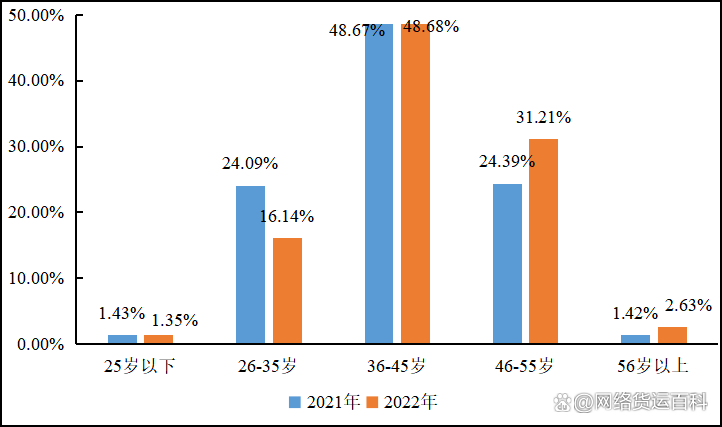

= 货车司机
:toc: left
:toclevels: 3
:sectnums:
:stylesheet: myAdocCss.css

'''

根据中国物流与采购联合会 http://www.chinawuliu.com.cn/lhhzq/202304/07/603134.shtml 公布的《2022年货车司机从业状况调查报告》：

[.small]
[options="autowidth" cols="1a,1a"]
|===
|Header 1 |Header 2

|司机年龄:
|
|===

[.small]
[options="autowidth" cols="1a,1a"]
|===
|肇事率 |事故率

|是指在特定的时间、地点或条件下，交通参与者（如⻋辆、行人等）制造违反交通规则的频率. 重点是: *肇事率可以明确地界定：谁该为这起事故负责，谁导致了这场交通事故。*
|是指在一定时间内，某个区域或道路上, 发生了交通事故的频率。*而不管这个事故的原因能不能查清.* 换言之, *你不一定知道谁是危险的制造者.*

|据”中国司法大数据研究院”统计:

- 货车"交通肇事率"为32.04%，
- 电动车"交通肇事率"为4.61%。

货车虽然占全部机动车保有量的10%，但导致一次死亡3人以上事故约占30%以上。
|
|===
