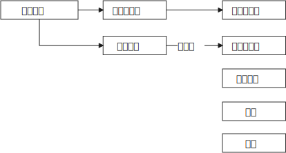

= 制度设计的目标, 和好坏评判标准
:toc: left
:toclevels: 3
:sectnums:
:stylesheet: myAdocCss.css

'''

- 好的制度，让人知道自我作为一个人应有的尊严. 专制的坏的制度，让人被贬低成奴隶意识，并创造出"阶层有高低"的意识！

.(母国的)文化基因, 决定(殖民地)长成什么大树果实.
[%collapsible%open]
====

[.small]
[options="autowidth" cols="1a,1a"]
|===
|Header 1 |Header 2

|英国(民主)
|- 基于英格兰自治传统，英王对殖民地的管理也是放羊式的。殖民地时代的美国并没有一个统一的政治规划。所以美洲殖民地一开始是一个又一个分散的殖民点，这些殖民点从一开始, 就是高度自治的。 乡镇政治, 因此成为美国政治的基础。
- 作为一个代议制国家，英国把"民选代议制", 也带到了殖民地。 +
托克维尔：“*在我们法国，是中央政府把它的官员借给了村镇 (对上负责)；而在美国，则是乡镇把它的官员借给了州政府 (对下负责)。*”
- （北美洲的殖民者）具有企业主的开拓和进取的精神……他们并不按照英国政府的意图行事，不愿意把自己生存的土地变成一个落后的原料供给地。

|西班牙(专制)
|- 西班牙把本国的封建专制制度, 直接移入殖民地，建立起与西班牙完全相同的集权体系。总督集民政、军政与司法大权于一身，只对国王负责，并不代表地方利益。西班牙殖民地政府, 具有其母国专制政体的一切缺点。

- 殖民地时期，拉丁美洲社会实行严格的等级划分: +
-> 第一等人是“半岛人”，即来自西班牙半岛的人，他们担任殖民地的高官. +
-> 第二等级是“克里奥尔人”，即美洲出生的纯种西班牙人。 +
-> 第三等级是“梅斯提索人”，也就是西班牙人同印第安人混血的后代. +
-> 第四等级是印第安人. +
-> 第五等级是黑人。 +
-> 第六个等级是黑奴。 +
 +
 +
 +
从殖民地时期开始，拉丁美洲就存在着北美没有的巨大阶级差别.

- 事实上，独立战争的结果“仅仅是一场政治权力的转移，除了由原来的二等公民克里奥尔人取代了西班牙人的政治位置” , 其他没有变化。   +
西班牙的政治遗产拖了拉美的后腿。“我们是独立的，但我们是不自由的；*西班牙的军队不再压迫我们，但她的传统却压得我们喘不过气来。*” +
文化缺乏民主的基因, 成为拉美现代化的重要障碍.

因此，以欧洲移民为主体的"英属"殖民地, 今天基本上都是发达国家。 +
而同样以欧洲移民为主体的"西班牙（包括葡萄牙）"殖民地, 今天则大都是发展中国家。西班牙对拉丁美洲的数百年旧式殖民统治，决定了拉丁美洲今天的落后面貌。 (种下民主的种子, 才能收获民主的大树)

李光耀说：“新加坡成功的关键，是英国人留下的法治制度，而不是什么儒家文化。”

|===

'''
====

.大乱带来大治
[%collapsible%open]
====
大乱带来大治. 把整层专制的土铲掉, 才能种下民主基因的种子, 才能生长出民主的大树. +
经过大规模农民起义后建立的王朝, 往往寿命更长. 因为这些农民起义把原来的社会破坏得很彻底。所以就有这种说法: “大乱达到大治”。

'''
====

