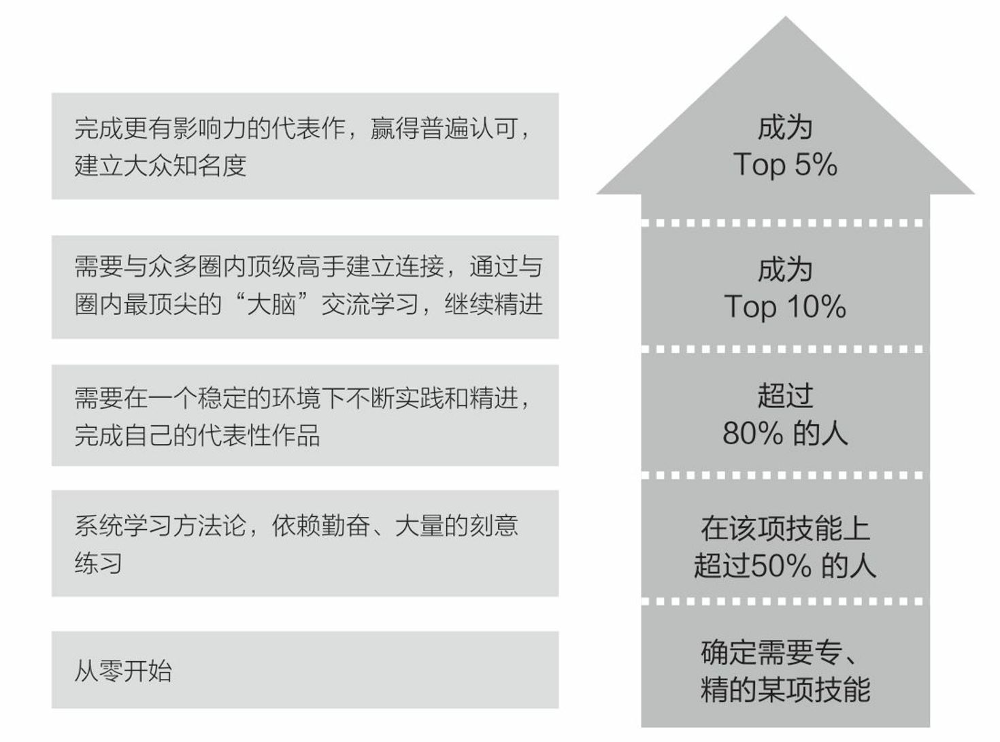

= (目标)如何一步步实现你的最终目标

.★★ 机会是稀缺品, 是人人争抢的. 你不抢, 就是别人的
[%collapsible%open]
====
- 你不上，别人就得上，而一旦别人上了，你搁在哪儿都是难处置的家伙. *你不上, 你的命运就是交给别人控制了. 你上, 你的命运才握在自己手里!* (卧榻之侧, 岂容他人鼾睡?)

- 对组织政治的"知觉"与"工作满意度"呈负相关。*一个人如果不参与到政治活动中，就会拱手把自己的应得利益与前途（成长）, 让位给那些积极的政治活动者。*(想想孙中山, 毛泽东, 李承晚)

- *你不能把这个世界，让给你所鄙视的人* (所以你要升职! 在其位谋其政, 行胸怀理念)。——安·兰德 You can’t leave this world to the people you despise.

- 他淡泊，那是他啥都有了，而我们有啥资本淡泊? 他会为这个部门去争取什么利益吗？*他真是一点都不争的。那他还占着这个位置干嘛? 我希望陈方明上，否则，我们这个部门会越来越边缘化的，我们会跟着吃亏的。*

'''
====

.行动是唯一能令你移动人生位置的
[%collapsible%open]
====
- 自己认为很重要(表现在头脑里), 和清晰认识到很重要(表现在行动上)，往往不是一回事。

- **预测未来最好的方法，就是去创造它。**—— 林肯

- **要是我不主动去做这件事，他们可能永远也不会给我这个机会。**

- **注意这种巧妙的说话方式，把公司的利益放在首位.** 你在讲出自己想要的工作调整的时候，无论是重新安排还是工作时间变动，都要强调这对你的雇主会有什么影响，而不是对你自己。不要说“我需要”，或者“我想”，要在老板还没有来得及说出他们关心的问题之前，就打消他们的顾虑：工作调整会损害到你的业绩吗？会给公司增加成本吗？你负责的客户和业务会受到损失吗？

- 每一份工作都有一个学习曲线。男人们深谙此道，他们自信地走上去，接受新的挑战。在边干边学的过程中, 对能力越来越有信心。 +
我在谷歌工作的6年半时间里，**我注意到，一般情况下，就积极争取机会而言，男性比女性行动得更快。当我们宣布有新的空缺职位或是开始新项目时，男员工们都一个个来敲我办公室的门，毛遂自荐，向我解释为什么他们是新的领导职位的最佳人选。** +
即使在一项新的空缺职位产生前，男性也更有可能去尝试获得成长的机会。 +
我已经和女性员工有过多次谈话，她们对我的鼓励通常作此回应：“我在这方面可能不是很擅长”，“这项新工作听上去很令人兴奋，但我没有类似的工作经验”，或“现在的工作中我还有许多要学习的”。**印象中我似乎从没与男员工有过这样的对话。**

'''
====

.不要站在原地哭，即使哭泣，也要在移动中哭泣。
[%collapsible%open]
====
- 不要站在原地哭，即使哭泣，也要在移动中哭泣。工作、吃饭、运动、休息、社交……再难过，这些该做的事情还是要做。因为秩序生活本身会帮你复原。*走着走着，你会发现，让你掉泪的事已经在你身后了。*

- 易中天: 面对一条大河，许多人都不敢过去。我却摸着石头一步步的走了过去，*当别人嘲讽我说，你看这人弄的是一身泥泞，满身臭水的时候，打不起！我已经在河对岸了！你们还在河那边！*

- 前进是一步步做出来的，那些身有多套房的人，是一套套投资买出来的！

- *力无所用, 与无力同，勇无所施, 与不勇同，计不能行, 与无计同。*---- 努力没有用到实处就跟没有努力一样，有勇却没有施展就跟没有勇一样，有计却没有施行就跟没有计一样。

'''
====

.★★★ 如果你能做到超出行业中的传统认知, 你就是开拓者了
[%collapsible%open]
====
- 在与日俱增的运营大军中，*更多人缺乏的是统观行业上下游的运营思维高度，以及跳出具体岗位外，对这个职业的想象力* (即: 这个职业的内涵, 其实也是个"筐", 它里面该包含什么内容, 它将来该怎么发展, 不是由别人定义的, 而是由你自己来定义的!)。

'''
====

.★ 在别人当家的地盘上, 你不可能"能够永远呆得住". 别人想踢你就踢走你
[%collapsible%open]
====
- 所以刘备必须创建自己的地盘才行, 而不可能一直在别人诸侯领地上寄人篱下
- 很多特斯拉中层在岗位上都待不满 2 年。他们要么是天才，2年不到就升职，要么就被开了。

- 离职在她看来是必然，“朝9晚12是常态，*我可以卷生卷死几年，但不可能永远卷下去。*”她说，“进厂前身体还很好，进厂后每年体检都比前一年发现更多问题。”

'''
====

.★ 战术的目标，就是赢。而战略的目的，是我推动当前的均衡向下一个均衡点转化，并使自己在下一个均衡点中，那个优势稍微大一点点。
[%collapsible%open]
====
- 毛泽东有句话 ： “谁是我们的朋友，谁是我们的敌人， 这是革命的首要问题 。朋友搞得多多的，把敌人搞得少少的， 革命就赢了。” 这是一种典型的战术思维。

- 梅特涅讲过一句名言，他说， *我控制欧洲局势的心法其实就是一条，就是确保所有国家之间的矛盾， 要大于他们和奥地利之间的矛盾。* +
就是敌人和朋友搞清楚有那么重要吗？ 大家都有矛盾，但是这个矛盾都有化解的可能，只要**我确保你们之间的矛盾，大于你们和我之间的矛盾，你们就会永远争取我的支持，** 所以我奥地利虽然国力不强，但是我就是控制欧洲的局势。这就叫战略思维。

- 中国人经营南海，主张”搁置争议，共同开发”。原来的均衡是， 我要在主权这个矛盾下, 和菲律宾这样的国家去谈什么国际法、海洋法，没准儿还把美国招进这个格局来，这个谈法我是吃亏的。 +
所以我搁置它，**我推动这个均衡往下一个均衡去转化，**转化矛盾到什么？——我们共同开发。 开发远洋海岛这个东西你以为容易啊，**这是比拼国力，所以就能导致我的优势扩大。矛盾就转化到对我有利的那个主场上来了。**你美国人总不能来共同开发吧，你根本不是南海的周边国家。

'''
====

.★★ 各个"点"必须能够串联起来, 形成累加势能.
[%collapsible%open]
====
- 所谓战略, 就是在你的大方向下, 各个"点"必须能够串联起来, 形成累加势能。 如果你在各种方向上布满了各种产品，*彼此却不能借力, 以至于每个单点都只能单独去与对手竞争, 你就会非常吃力.* (这和人生是一样的, 你在人生中所做的任何事情, 必须对你的最终目标有累加推动效果. 即, 不要去积累你不想积累的, 对你"上岸"没有用的经验!)

'''
====

.机会是留给有准备的人的
[%collapsible%open]
====
- 机会是留给有准备的人的，即，只要你平时每天做好了准备，就随时都有"走人"和"上位"的机会.  +
→ 你平时每天都在学习锻炼数学英语，就能随时去考研； +
→ 你平时每天都在针对性, 有意识的锻炼"考公"必需的能力，如演讲, 和待人接物，你就能随时去考公。

- 机会正是来自一个人对某件事的全情投入，而这件事随后就会成为他们的工作内容 (获得转行, 或阶层跃迁)。(星星之火, 可以燎原.)

- 在工作上积极主动一定会带来回报。**如果一个人总是等着别人告诉自己该做什么(缺乏主动性)，我们就很难设想他能成为领导别人的人。**   +
(想想孙中山, 毛泽东, 李承晚, 在追求自己理想, 想要通过建立自己的政党,来获得对国家改造目的, 几十年中的他们永不停止的主动性: 不断奔走, 游说重要国家的重要政要. 他们如果没有这种持之以恒的主动性性格, 自己找事, 做事, 他们能取得伟大的成就吗? )

'''
====

.上岸成功率99% = 上岸没成功.  学习不彻底, 半途而废, 就是99%=0
[%collapsible%open]
====
- 日本人向西方学习, 是一直老老实实地学，直到甲午海战时，那些英国教习官还在日本军舰上任职. *而我们一直嚷嚷要中国化、本土化，老早就把这些洋教习赶跑了, 所以都没学到位, 马马虎虎, 不认真 (天下凡事，就怕"认真"两个字)。*

'''
====

.你要成为Top 20%，才能拿到进入下一段的“入场券”. 二八定律, 头部赢家通吃.
[%collapsible%open]
====

'''
====

