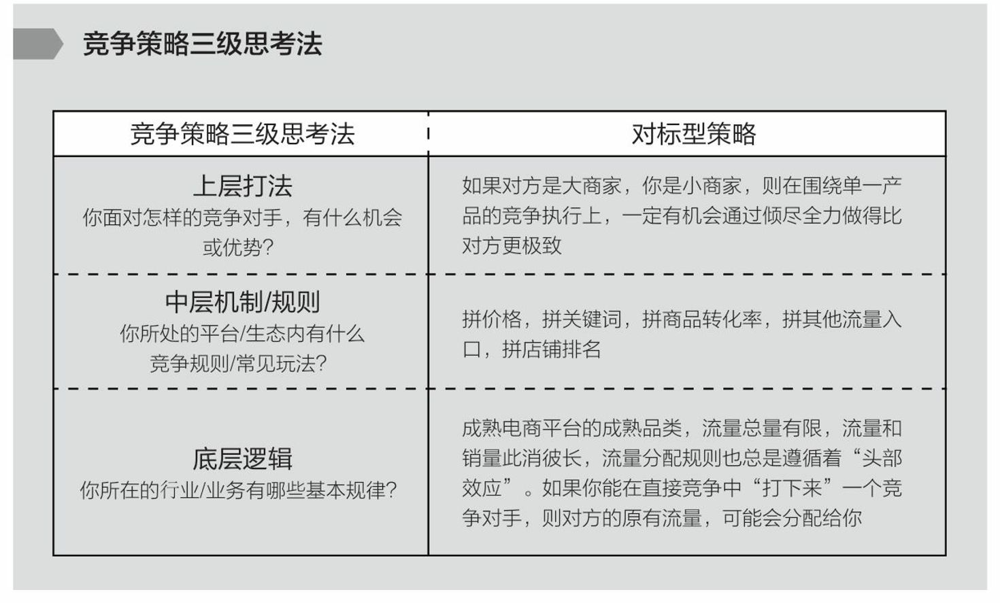

= (人生) 如何思考竞争策略(模型有哪些)

.竞争策略"三级思考法” :
[%collapsible%open]
====
1.你所在的行业/业务, 有哪些基本规律？ +
2.你所处的平台/生态内, 有什么竞争规则/常见玩法？ +
3.你面对怎样的竞争对手，有什么机会或优势（劣势）, SWOT ？

image:../img/0058.png[,60%]

image:../img/0060.png[,60%]

'''
====

