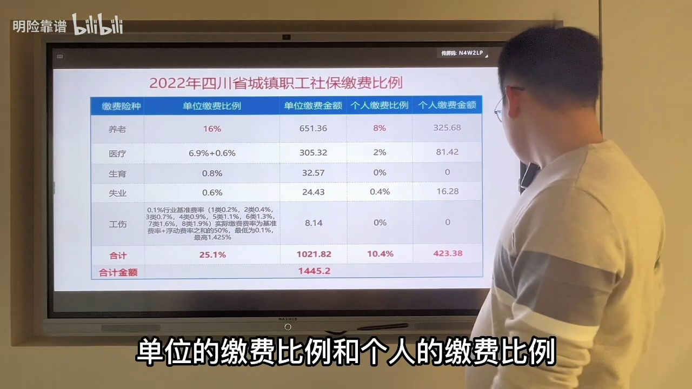

= 社保必知
:toc: left
:toclevels: 3
:sectnums:
:stylesheet: myAdocCss.css

'''

.什么"是社保的缴费基数"，怎么确定的？
[%collapsible%open]
====

为什么有些人交社保交的高, 有些人交的低呢? *社保缴费的高低的话, 主要取决于你的"缴费基数". "缴费基数"越高, 你所交的保费越高; "缴费基数"越低, 你缴的保费越低.*

"缴费基数"也叫"缴费工资", 以2022年四川省"社保缴费基数"为例,

[.small]
[options="autowidth"]
|===
|"缴费基数"一共分为三类 ↓ |2022年, 四川社保↓ |含义↓ |"缴费基数"的计算公式: ↓

|最低缴费基数:
|4071 元
|当你的月收入低于4071 的时候, 单位仍然按4071 作为基数, 给你缴纳社保.
|最低缴费基数 = 上一年的全省全口径"社会月平均工资" × 60% +

四川省2021年的"全年社会平均工资"是81420, 我们除以12个月, 得出每月的"月平均工资"等于6785. 6785的60%, 就等于4071, "最低缴费基数"就是这么得来的. +

latexmath:[ \frac{前一年的社会年平均工资 81420元} {12个月} = 6785元/每月] +
6785元/每月 × 60% = 4071元的月"最低缴费基数"

|最高缴费基数:
|20355 元
|当你的月收入高于 20355, 哪怕是10万, 20万, 单位也按20355为基数, 给你缴纳社保.
|同理: 最高缴费基数 = 上一年的全省全口径"社会月平均工资" × 3倍 +

即: latexmath:[ \frac{前一年的社会年平均工资 81420元} {12个月} = 6785元/每月] +
6785元/每月 × 300% = 20355元的月"最高缴费基数"

|实际缴费基数:
|你的实际工资收入
|当你的这个月收入是大于4071, 并且小于20355 的时候, 单位就按你的"实际工资", 为你缴纳社保.
|"实际缴费基数", 就是当你的实际工资比如是6000, 1万, 2万, 那单位就以你的"实际工资"作为基数, 为你缴纳社保.
|===

在缴费的过程当中, 大家可能会发现, *缴费每年都在递增, 原因是由于"社会平均工资"在递增.* "社保的缴费基数"它不是固定不变的, *因为今年的缴费基数, 是采用上年的社平工资, 只要"社会平均工资"在上涨, 就会导致"缴费基数"也逐年在递增.* +

*注意: 即使了解和"社保的缴费基数"后, 我们还不能完全确定每个月缴费多少, 还需要结合"缴费比例"才能够确定.*

'''
====

."社保缴费比例"是多少？
[%collapsible%open]
====
要能够准确地计算出自己的缴费金额, 我们需要先知道两个数据: "缴费基数"和"缴费比例".

以2022年四川省为例, 下图是"单位参保"的情况之下的缴费比例, 分为"单位的缴费比例"和"个人的缴费比例". +

[.small]
[options="autowidth" cols="1a,1a,1a,1a,1a"]
|===
|缴费险种 |单位缴费比例 |单位缴费金额| 个人缴费比例 | 个人缴费金额

|养老
|16%
|- 如果按"最低缴费基数"计算, 2022年, 四川省城镇职工社保的缴费基数, 最低是4071, 那我们用4071乘以16%, 得出来的"单位缴费金额"就是 651.36
- 如果按"最高缴费基数"计算, 单位缴费金额就是 = 最高缴费基数 20355 × 单位缴费比例 16%
- 如果你的收入介于4071-20355 中间, 比如是6000元, 就按"实际缴费基数"计算, 单位缴费金额就是 =  6000 × 单位缴费比例 16% = 960 元.

|8%
|- 如果按"最低缴费基数"计算, 个人的缴费金额, 就是 = 最低缴费基数 4071 × 个人缴费比例 8% = 325.68 元
- 如果按"最高缴费基数"计算, 个人的缴费金额, 就是 = 最低缴费基数 20335 × 个人缴费比例 8%
- 如果按"实际缴费基数"计算, 个人的缴费金额, 就是 = 6000 × 个人缴费比例 8% = 480元.

|医疗
|
|
|
|

|生育
|
|
|
|

|失业
|
|
|
|

|工伤
|
|
|
|

|合计
|
|
|
|
|===

"缴费比例"是固定不变的啊, 所以"缴费基数"上升, 那么每年的"缴费金额"也会上升.

'''
====

