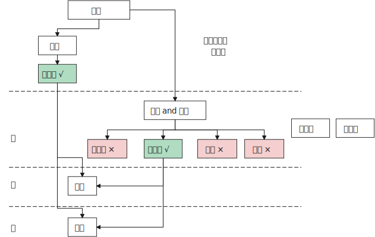

= 如何限制权力

==== 将权力蛋糕切成一块块分散开来, 谁都别想独大

.如何限制权力？最好的办法就是分散权力 -- 三权分立
[%collapsible%open]
====
- “三权分立”分为大中小三种：

[.small]
[options="autowidth" cols="1a,1a,1a"]
|===
|Header 1 |Header 2|

|大三权分立 :
|党、议、行

|中三权分立:
|立法权、行政权, 司法权

|小三权分立:
|把行政权划分为: 决策权、执行权、监督权
|===

'''
====

."三权分立": 西方的三权分立, 是为了制约最高权力. 而中国古代的三权分立，是强干弱枝, 是为了保护最高权力(皇帝)不受挑战。所以, 总的趋势是"皇权"越来越重，"相权"越来越轻.
[%collapsible%open]
====
image:../img/0046.svg[,]

'''
====

.清朝统治者对"督抚"(巡抚 & 总督) 权力的控制
[%collapsible%open]
====

[.small]
[options="autowidth" cols="1a,1a,1a"]
|===
||之前 |太平天国后

|人事权
|无"人事权”

- 地方州府的知州、知府乃至基层的县令，都是由中央任命，由吏部直接派遣，督抚没有什么干涉权.
- 他也无法辖制比他低一级的"按察使"和"布政使"。省一级的官吏有"布政使"和"按察使"等，他们都不是"督抚"的属员，只是比督抚的品级可能小一点。他们拥有不知会督抚、直接上达天听的权力。
- 他唯一的权力是，当这些地方官员做得不好的时候，他可以对其进行弹劾，但弹劾能否成功也不是督抚说了算。
|太平天国被平定后，主要汉人将领大多升任地方督抚, 带来督抚的权力就不一样了. 有了"自主权”. 地方官可以做很多事情，而不必在每件事情上都知会中央。

有"人事权”:

- 虽然派遣官吏的职权仍由吏部把持，但京城派来的官员能否到地方上任, 还是督抚说了算，督抚那边不挂牌，这些官员有了官衔也没用。
- 督抚还能以处理各种临时事宜为名，派遣自己人以"委员"的身份去地方担任"督办"。这种委员虽然不是官，但他的权力比正常的官员要大。
- "布政使"和"按察使"很难再绕过"督抚", 单独向皇帝上奏，他们的行为开始受到督抚的极大掣肘，这就是所谓的"督抚专权"。
**督抚之所以能够专权，很大原因就在于地方督抚之位落入湘淮军将领之手(枪杆子里面出政权, 财权, 人事权, 一切)。**他们通过这些资源扩大了自己对地方人事任免的干预。

|财权
|无"财权”. 花一分钱也得向户部报销。

- 清朝重满人, 防汉人. 如果如果一直不给曾国藩地方实职的话，就没法收钱来供应湘军. 因为开厘金、设厘卡, 必须得有行政权才可以. 曾国藩在没有职务的时候设厘卡，经常就被地方政府赶走.

|有"财权”:

- 最早征收的厘金(商税)，大多是地方官员自己征收截用的，后来虽然要上交一部分，但自己仍然可以留大头。
**有了财权，能收税，就能养人（有人事权）和养军（有军权）.**
- 比较强的人, 曾左李等人，他们甚至可以截留地方的"关税"。钱不够了，就先截留，花了再说，然后上报 (有几年，十分之九的海关收入, 都被地方截留去办洋务了). 中央一般不会对他们有什么太大的责难。因为当时的态势在那里放着呢. 他们不依靠朝廷发饷，可以自生自养。这样，权力的天平就很明显地偏向地方这一边。

|军权
|无"军权”
|有"军权”: 他们自己可以培植强大的直属军队，走到哪里就带到哪里，不受朝廷的干涉。

|
|
|image:../img/0053.svg[,]
|===

'''
====

==== 去其羽翼

.去你羽翼, 根除你的势力范围
[%collapsible%open]
====
- 让部落首领离开原领地(势力范围), 迁到中国城市甚至京城, 使之去势与汉化.

'''
====

==== 权力不继承给你后人, 只止于你本人这一代

.功绩不涉后, 一时功绩一时清零
[%collapsible%open]
====
- 这些品级由儿子继承后, 就要比父亲低一级, 以激励后代努力.

'''
====

==== 给敌人找敌人

.采用"势力均衡"政策, 互相牵制
[%collapsible%open]
====

[.small]
[options="autowidth" cols="1a,1a"]
|===
|Header 1 |Header 2

|
|- 正是由于看到中国在甲午战争(1895)中的惨败，西方感到不能任由日本吞并中国, 列强才真正动了"瓜分中国"的念头, 因为瓜分以后就可以防止日本坐大. +
不过, 到了义和团(1899)的时候，西方国家整体的文明水平已经相当进步了，第一国际和第二国际已经相继出现。这个时候，西方国家国内的许多政治家已经开始对以往的殖民政策进行反思和批判，处理国家间事务时的价值理念跟以往已经不一样了，赤裸裸地去殖民、去瓜分一个大国到这个时候并不时髦了。  +
+
另外, "瓜分中国"未能实现的部分原因, 是中国精英努力使帝国主义列强相互牵制, 以保持平衡。当然,这方面的研究还极为有限。

|利用列强间的矛盾, 来另他们互相制衡, 以让自己渔翁得利:
|- 在谈判的过程中，日本人曾警告陆征祥，这些谈判都是机密，不能透露给任何人，不能告诉别的国家。但**中国代表一边谈，一边又把谈判细节通报给英美各国的驻华使节(即激起"日本"和"西方国家"双方的焦虑感)，希望争取西方国家的支持**，所以很快《二十一条》的消息就走漏了，西方国家的媒体和政府都开始对日施加压力。
|===

'''
====

.以夷制夷, 分化敌人, 拉一踩一
[%collapsible%open]
====
- 用"内蒙古人"对抗"外蒙古人". 用结盟者对抗叛乱者. 以防止任何一个蒙古人领袖积聚起力量.

'''
====

==== 切断你经济上的来源和资源

.经济封锁
[%collapsible%open]
====
- 清朝对付台湾郑成功的方法: 迫使中国沿海居民迁到离海十英里或更远的内陆, 以便切断台湾取之于大陆的人力、食物和丝绸贸易的来源.

'''
====

==== 毁掉你的名望, 让你的追随者抛弃你

.捆绑"埋雷", 毁你名望
[%collapsible%open]
====
- 《二十一条》条约, 日本公使**还附加了(埋雷)一个第五号建议性条款在里面. 这就是"埋地雷". 如果中国签了《二十一条》, 那么在外界看来，中国就好像是也接受了第五号条款. 袁世凯的声望就会下跌.** 这正是日本人的图谋. 因为他们对袁世凯很头痛. 在和袁世凯的几次冲突中，日本人都没有占便宜. 因此日本要做的就是把袁世凯搞下去。

'''
====

