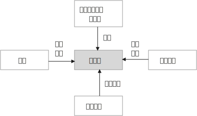

= 故事架构设计
:toc: left
:toclevels: 3
:sectnums:
:stylesheet: myAdocCss.css

'''

.三段式结构 -- 触发, 冲突, 解决
[%collapsible%open]
====

[.small]
[options="autowidth" cols="1a,1a"]
|===
|Header 1 |Header 2

|触发 (导火索/引子)
|例如: "2020 年 6 月 17 日，经过长达 16 个小时的庭上激辩，58 岁的原新城控股董事长王振华涉嫌猥亵 9 岁儿童一案, 最终宣判，王振华一审获刑 5 年。随着王振华案的宣判，备受关注的性侵猥亵未成年话题, 再次回归大众视野。"

这个引子，包含了 3 个基本问题： +
1. 事件的人物和背景(起源)是什么？ xx猥亵未成年； +
2. 事件的最新动态是什么？ 法院宣判了； +
3. 这个最新动态, 带来的”未来悬念”和”是否公正”的判断是什么？ 五年判刑合理吗？

一般来说，这 3 个基本问题，就是一个骨架里“触发”部分应包含的内容。

|冲突(即矛盾)
|人活着, 处处有矛盾.   +
人的内心与现实, 永远处于矛盾冲突中.     +
人与人之间有矛盾.     +
矛盾冲突, 是故事的核心.

以张前妻为夫伸冤故事为例, 这里的冲突就有：

|解决
|*从一个不稳定的状态结项, 推向另一个不稳定的状态阶段. (只要"不稳定"就能吸引你一直往后看. 这个"不稳定", 也正如人走路一样, 没一只脚都是不稳定的, 必须两只脚一直交替走下去, 即从"左脚的不稳定状态", 推向"右脚的不稳定状态", 如此一直循环下去)*
|===

'''
====

