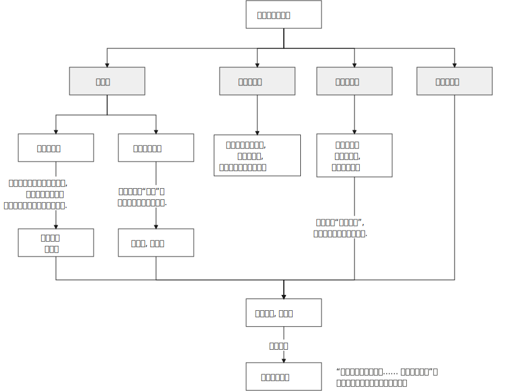
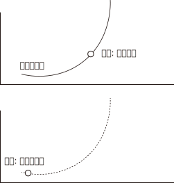

= (政治制度) 中国的专制集权化, 带来的恶劣负面后果是什么

== ▶ 人权上

.对官方"变法改革"中的弊端, 民间没有纠错能力
[%collapsible%open]
====
- (王安石变法) 青苗法的目的. 是为了打击民间的高利贷, 而采取了由国家垄断贷款市场的手法. 但结果依然变成: +
-> 官员强行摊派贷款。富户不愿借贷，当地官府便结罪申报，加害于人； +
-> 贫穷百姓还不上贷款, 只好卖田卖地，以致民不聊生。

'''
====

.抑制民间商业(民间能量), 以防威胁帝权
[%collapsible%open]
====

- 中国的统治者认识到: 民间的经济力量的强大, 会威胁帝权。 所以中国两手操作 -- 一方面抑制民间商业, 一方面用官营来垄断工商业. +
春秋战国时期，之所以会出现王权削弱、公卿大夫力量增强的局面，是因为公卿大夫掌握了“山泽之利”，开矿煮盐使他们有了强大的经济实力，能招兵买马, 最终独霸一方，架空了王权。

- 经济自由和思想自由一样，都会让人产生政治诉求. 经济自由化可能催生民主变革.

- 法家思想, 几乎无一例外地“抑商”.

[.small]
[options="autowidth" cols="1a,1a"]
|===
|Header 1 |Header 2

|管仲(法家代表人物), 他说："*夫民富 则不可以禄使也，贫 则不可以罚威也*。"
|有些人**变得太富，国君就没法用利禄驱使他。**有些人又太穷了，光脚的不怕穿鞋的，刑罚也威慑不住他。这样就会导致天下混乱。

|管仲提出“利出一孔”帝治理论 : “利出于一孔者，其国无敌。……*故予之在君，夺之在君，贫之在君，富之在君。*”
|即天下所有的好处，天底下所有的利益，都要从由权力这个“孔”出来，由君主来赐予。*国君用利益来决定百姓的贫富和生死，百姓就(不得不被逼着)拥戴国君如日月，亲近国君如父母了。* (想想朝鲜人民的现状就是如此)

|管仲提出“官山海”思路
|即由国家来垄断和经营自然资源（“山海之利”）。

|他开创了"盐铁专营"制度
|- 目的是:
1. “塞民之羡，隘其利途”，即通过垄断来堵塞民众致富之途。因此他规定，所有食盐都必须由政府统一收购，统一运输，统一定价销售，即“官收、官运、官销”。
2. 让政府获得更多的财政收入.
|===

导致的后果:

[.small]
[options="autowidth" cols="1a,1a"]
|===
|Header 1 |Header 2

|盐铁等官营, 阻断了中国民营工商业健康发展之路.
|*（国家）经营的目的, 并不是要发展这些工业，而是借以剥削消费者，以增加财政收入，同时达到重本抑末（即工商）的目的。*

韦森总结说，**自西汉以来，中国经济一直沿着一个封闭的圈子遵循：**新王朝建立，减轻税负，放松管制，商品经济获得一定恢复和发展，出现繁荣。*到了这个阶段，朝廷就害怕了，往往就要强制推行官营工商业制度，以“重本抑末”，导致工商业发展受到打击.* 政府财政也因此陷入困难，只好加重对农民的聚敛，于是农民起义，推翻王朝，从头再来……
|===

'''
====

.(方法论):  以“迁徙富豪”的方式来控制地方势力
[%collapsible%open]
====

秦汉以来，皇帝经常通过把富豪迁到首都的方式，让他们只能携带走自己所有的动产，而不能搬移土地。结果，他们在家乡所拥有的大量土地，便被政府没收.

'''
====

.没有法治保障, 所赚的钱就没有安全感, 抑制再投资. 钱会外流到国外
[%collapsible%open]
====
除非官商结合, 否则"资本积累"便靠不住(容易被统治者直接掠夺), 根本没有立法保障, 商人的再投资就没有安全感.

'''
====

== ▶ 思想进步上

.科举制度是一个维持单一思想的工具，它阻碍了其他思想的发展
[%collapsible%open]
====
- 为什么中国历史上没有这种思想转变的机会？一个原因就是科举制度。对比西方，虽然西方也曾有很多支持专制的思想，但民主思想却能够崛起并成为主流，正是因为“西方从来没有发明一种像科举这么强大的同化人的思想的工具”。

'''
====

.缺乏榜样, 就会陷入走老路的循环中 — 太平天国跳不出历史循环
[%collapsible%close]
====
由于<圣经>没有提供建立理想政权的详细蓝图, 所以太平天国的很多制度, 事实上来自中国的传统.

'''
====

.传统的灌输式历史教育, 给鸦片战争创造了两个神话 : 1.忠奸之分, 2.百姓怕官，官怕洋人，洋人怕百姓
[%collapsible%open]
====
[.small]
[options="autowidth" cols="1a,1a"]
|===
|Header 1 |Header 2

|神话1: 忠奸之分
|民间都喜欢这样说: 杨家将、岳飞故事, 忠于国家的将领在前线杀敌报国，胜券在握。但他们最后失败了，原因就是有奸臣在后方陷害。这种民间叙事的逻辑是：如果后方没有奸臣捣乱，中国人将每战必胜。 这种思维也被套用到了林则徐身上. 西方人怕林则徐吗？根本不怕. +

看材料就能发现，当时**多数中国老百姓在战争中其实没什么立场，因为兵和匪差不多。**中国历史上，兵的纪律一向很不好，每到一个地方都会抢劫老百姓. 俗语说，"**匪来如梳，兵来如篦bì**". (篦 : 是一种齿比梳子密的梳头用具. ) 所以老百姓见了兵是要躲的, 注意，这里躲的不是敌方的兵，而是自己的兵。

|神话2 : 百姓怕官，官怕洋人，洋人怕百姓
|
|===

'''
====

== ▶ 公民社会, 与社会健康, 民生上

.民众被原子化. 破坏了民间的自救能力, 不存在公民社会
[%collapsible%open]
====
- 中央集权制下, *社会的自治能力被取消，*“中央政权已成为社会机器的唯一动力”  ，什么事都要由它主导，*不许别人插手，不许民间自发解决问题。然而政府显然没有解决一切问题的能力.* +
中央集权化, 破坏了法国人的自治和自救能力，制造出一个原子化的脆弱社会, 缺乏抵御各种社会问题的能力。

- 剥夺民间参与感, 造成官民"心向分离".

- 除皇帝之外，其他所有人实际上都属于一个共同的阶层 (即使是高官贵族, 生死也是皇帝一句话的事. 因为他们拥有的权力也是皇帝赐予的, 而不是他们凭实力自己争取而拥有的. 正如老毛所说, 枪杆子里面出政权) -- 即 黑格尔所说的“普遍奴隶制”。 民众被原子化.

'''
====

.把所有鸡蛋都放在了一个篮子里, 一害俱害.
[%collapsible%open]
====
- 封建制下, 一两个小国出现问题，也不会蔓延到全天下，即使出现内乱，受害的只是局部。这是他们的世袭领地，他们要追求长远利益。不会像郡县制的地方官那样残暴. +
而**集权制下, 上为害(胡作非为, 瞎政策)，则天下全部受苦，无处能免。(把所有鸡蛋都放在了一个篮子里.)** 能席卷到全中国大陆的巨型农民起义, 正是郡县制下的独有现象。

'''
====

.权力大小(而不是法律规定)直接控制人的生死命运, 导致上行下效, 腐化全民道德
[%collapsible%open]
====
- 路易十四的君权强大蛮横，蔑视法律，政策朝三暮四，缺乏稳定性。“有什么样的政府就有什么样的民众”. 民众看穿政府的行为方式，内心深处不相信法律.

'''
====

.统治阶层不负担社会保障
[%collapsible%open]
====
- 现代国家权力和责任通常是对应的。国家多收税，就要给老百姓多做事(高福利保障)。 +
而中国古代, 政府收完税，并不负担老百姓的基本福利。黄宗羲说，这种制度就是“*利 不欲其遗于下，福 必欲其敛于上*”，任何好处也不想给下层的人剩下，所有的利益都要集中在上层。

'''
====

.民间资本弱, 即人均GDP弱, 则国力弱
[%collapsible%open]
====
- 第一次鸦片战争时: +
-> 英国的财政收入是中国的4倍. 而中国的人口数是英国的27倍左右, 这样算下来, 这就意味着，英国的人均财政收入是中国的109倍！ +
-> 1840年, 英国那一年的财政收入是15540万两。而清王朝的财政收入是3904万两. *鸦片战争的军费占中国全年收入的70%以上。而对英国来说，那场战争，只花掉它全年收入的8%。*

image:../img/0050.jpg[,60%]

'''
====

== ▶ 法律及政策上

.国家政策朝三暮四，政策环境和法律环境, 极不稳定。
[%collapsible%open]
====
- 汉武帝用反复无常的多变政策, 来收割民间财富, 搞商人的钱:

[.small]
[options="autowidth" cols="1a,1a"]
|===
|Header 1 |Header 2

|step 1 : 卖爵, 并**提供诱饵**. "诏令民得买爵及赎禁锢，免减罪。"
|买了爵位有什么好处呢？打仗不会征发你去当兵，也不再征用你当劳力，免除终身的徭役。买了武功爵的人，还可以当官，可以免罪。

|step 2 : *钓不出来，就直接加税。*
|并要求商人主动向政府呈报财产. 谁隐瞒不报，或呈报不实，其他人可以向官府告发. 告了以后，官府就查抄没收他的全部财产，分给告发者一半。这叫作“告缗”。

|step 3: *把价税范围扩大, 普通百姓也列入*"被告缗mín”范围。
|穷人通过告人得来的不义之财，转眼也因为被别人告而被剥夺。老百姓因为交不起钱, 土地、住宅就被没入官府.

|step 4 : 废除爵位能带来的权利. (*废除之前诱饵中的权力*. 相当于你办了vip会员, 官方再推出vvip会员, 废除原vip中给你的那些权力)
|百姓买了爵，可以不用服徭役，不用去沙场征战了。可征发的民众减少了。汉武帝又开始说话不算数了, 进行爵位贬值. 爵位低的，仍然要服劳役。

- 现在的网络视频平台的会员陷阱 (“套娃式”的收费模式), 也是同样的操作逻辑: +
-> 现在只要想看电视，就得先付费，不然什么都看不了。 +
-> 画很多圈圈(你的会员只在某个圈中生效) :  +
.. **在"视频内容"上**画圈圈 : 开通了小米电视会员后，只能观看部分影视剧，但要看其他剧和电影，还需再另外买会员。 +
.. **在"播放硬件"上**画圈圈 : 即便购买了视频网站的普通会员，手机端与电视端依旧无法通用，只能花更多的钱，购买更高级别的会员。(用“套娃会员”和"多终端不兼容"的霸王条款, 来向用户收费.)
.. **在"视频清晰度"上**画圈圈 : 如果只是爱奇艺的黄金VIP，可能连高清视频都看不了.

通过这样一次一次地收割财富，武帝末年，小农普遍破产，流民剧增。 +
中国自古没有真正确立起“私有财产神圣不可侵犯”的理念.

image:../img/0049.svg[,]

'''
====

== ▶ 社会发展与进步上

.抑商民间, 就扼杀了中国向"资本主义阶段"进化的发展
[%collapsible%open]
====
- 对民间资本的压制 (及官营垄断), 中国终于缺乏发展起"资本主义"的基因. +
资本主义是一种非常复杂的社会现象，不仅仅在于手工业工场数量的多少，*更关键的是与之配套的文化, 政治, 和社会, 是否存在。*

- 这种对民间经济的压制, 就带来了重大恶果. 这可以从西方"工业革命"是如何诞生的上面看出来: 科技进步不是一下子蹦出来的. +
**西方在"工业革命"(18世纪60年代起)之前, 已经经历了一场手工业革命**，之前就航海船只的建造已经很精致了，还有为造枪炮、火药而制作的一些加工机械。**所以工业革命不是一下子就蹦出来的。**以前教科书里说，瓦特看着烧水的壶盖儿被蒸汽顶起来，就发明了蒸汽机。从科技史就可以知道，*蒸汽机最早不是瓦特发明的，他只是把蒸汽机改进了而已。* +

'''
====

== ▶ 财政, 财税上

.中国传统的经典学说不重视经济的发展, 只强调"节约使用地税", 而不是"创造新财富".
[%collapsible%open]
====
即经济致策的重心, 不是放在"增加生产"和税收上, 而是放在"节俭"上.

'''
====

.缺乏财政控制观念, 浪费民脂民膏
[%collapsible%open]
====
- 汉武帝的一生, 是在一个又一个大事当中度过的，“征匈奴”, “征南越”, “征西南”, “开漕渠”... 每一个都耗资巨大. 汉武帝于在位53年间，共发动战争达26次之多。 +
吕思勉评价说：“应当花一个钱的事，他做起来总得花到十个八个；而且绝不考察事情的先后缓急，按照财政情形次第举办。” +
汉武一朝，花起钱来真是随心所欲，他自己倒是彪炳史册了, 但却是大大加重了民众的负担。

- 清政府税收, 也不按"预算"和"审计制度"来计算.

'''
====

.政府没有信用, 于是缺乏借债能力
[%collapsible%open]
====
虽然法国政府愿意付出更高的利息，然而，却没有人愿意买法国的国债。为什么法国借不到钱？*借钱能力最关键的是什么？是还款信用。法国实行君主集权制度, 信用度很差。法国王室借不到钱，只能靠不断增税.*

'''
====

