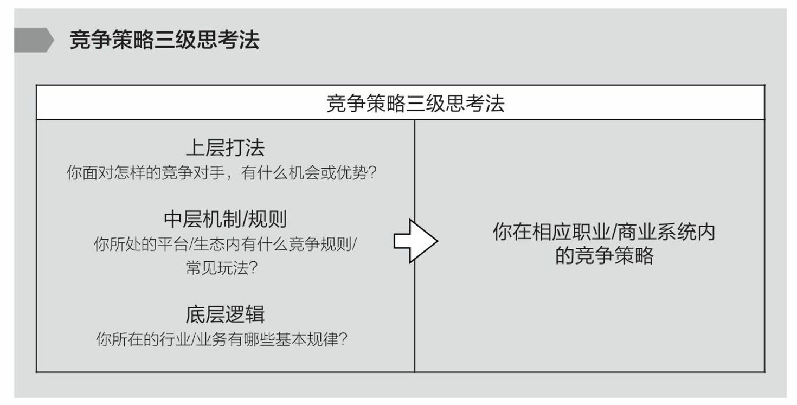
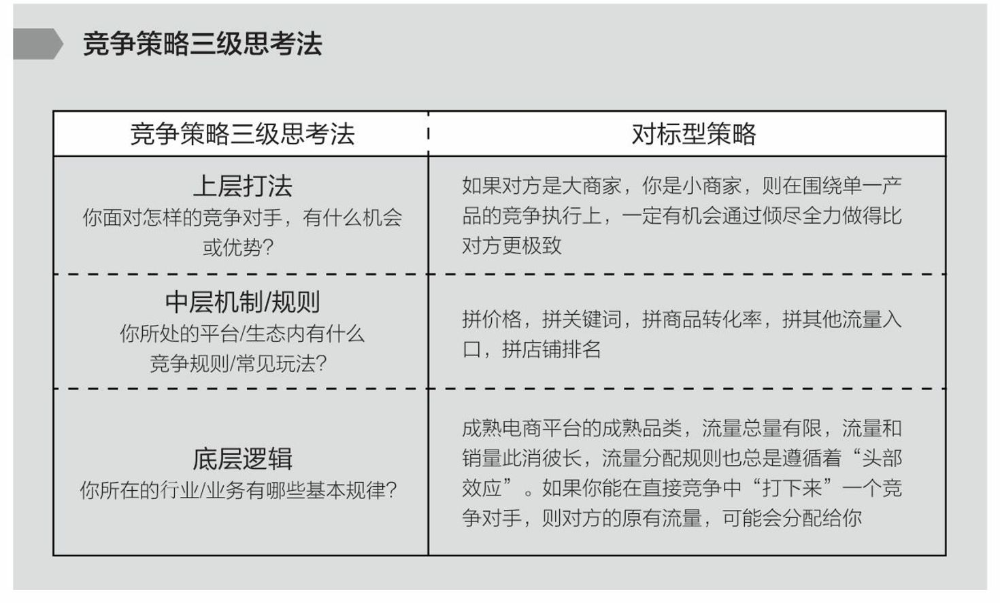
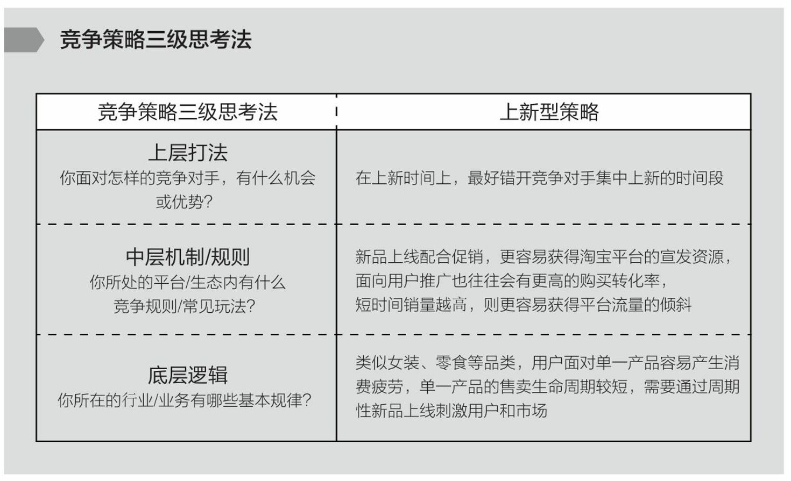

= (人生) 如何思考竞争策略(模型有哪些)

.快餐式调研的那类咨询师, 是给不出有价值的建议的
[%collapsible%open]
====
- 现在，各行各业的竞争白热化，竞争早就到了像素级别，大家高度同质化，越是成熟的行业，突破和创新越难，不存在说你一个外行咨询顾问跑过来就能给一个解决方案，那是打全行业的脸。 +
刘润经常喜欢找一些比较冷门的商业案例来论证自己的论点，对该行业不了解的人还能被哄哄，一旦碰上业内人士就很容易遭到挑战，毕竟刘润自己对于该行业的了解度并不够。

'''
====

.竞争策略"三级思考法” :
[%collapsible%open]
====
1.你所在的行业/业务, 有哪些基本规律？ +
2.你所处的平台/生态内, 有什么竞争规则/常见玩法？ +
3.你面对怎样的竞争对手，有什么机会或优势（劣势）, SWOT ？

'''
====

