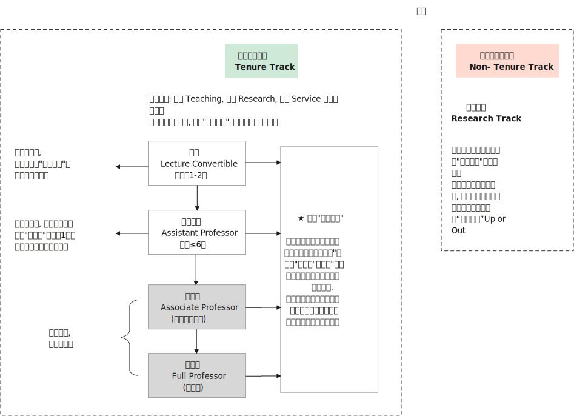
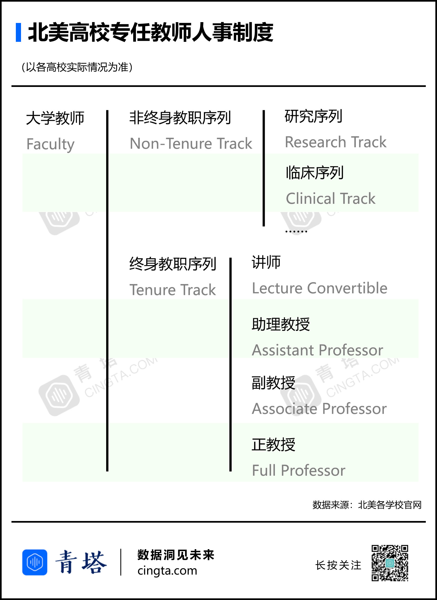
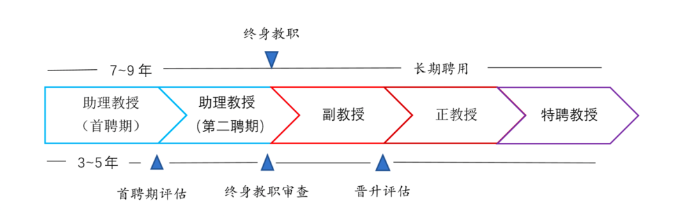
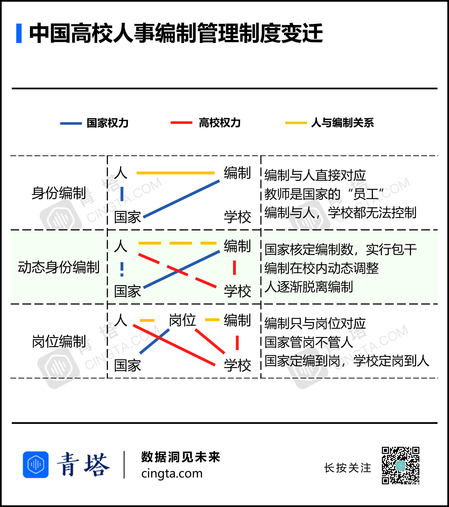
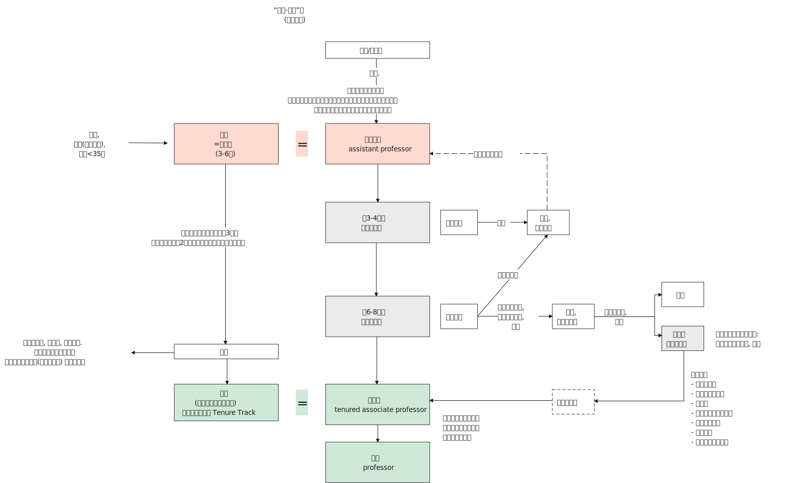
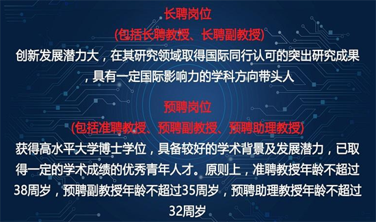
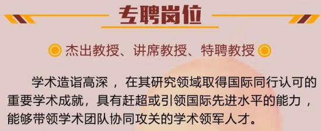

= (生态) 教育行业 中的生态是怎样的
:toc: left
:toclevels: 3
:sectnums:
//:stylesheet: myAdocCss.css

'''

== 现实

- "慷国家之慨"的领导, 远多于敢于"为国家发展而担当"的领导。

- 中国恐怕找不到一个校长是因为"人事体制改革"而升官的。一般校领导都懂得, 不要触碰"人事"等敏感的事情，不要有事，才是升官的必要条件之一。北大在任校长从来不做"委员会"成员，一票都没有. 院系普遍把可能"解聘"的责任推给学校的"委员会"。

- *打造好人脉关系是永远最重要的 (在求职中也是如此, 到最后就靠人脉来介绍工作的). 在"非升即走"制度中能待下去的有两种人，一种是埋头苦干脏活累活的，还有一种就是有人脉资源的。* +
.. 年轻教师要多参加学术会议，通过学术会议既能掌握学术前沿，同时还能够认识很多专家，这对于年轻教师日后的发展大有好处。
.. 某学院领导曾在全院大会上说:“平时让某些青年教师干事你不愿意干，你不听话，那评职称的时候我为什么要推荐你呢? ” 这体现了现实,即职称评审**不完全是**仅基于学术评价而作出的.

== 美国"终身教职 tenure-track"制度

虽然美国没有全国统一的大学教师晋升政策和要求，但共性也十分突出。 +
北美, 研究型大学的教师（Faculty）, 大致可分为"终身教职序列"（Tenure Track），和"非终身教职序列"（Non- Tenure Track）。

又如: 芬兰的学术职业流程: +

'''

==== 对 tenure 为何出现的本质探索

[.my1]
.案例
====
.tenure
/ˈtenjə(r)/  +
(n.) +
->  -ten-握,持有 + -ure名词词尾

1.the period of time when sb holds an important job, especially a political one; the act of holding an important job （尤指重要政治职务的）任期，任职 +
• his four-year tenure as President 他的四年总统任期 +
• She knew that tenure of high political office was beyond her. 她知道自己与显赫的政治职位无缘。

2.the right to stay permanently in your job, especially as a teacher at a university （尤指大学教师的）终身职位，长期聘用 +
• It's still extremely difficult to get tenure. 要取得"终身职位"仍然极其困难。

3.the legal right to live in a house or use a piece of land（房地产的）保有权，保有期
====

土地的持有权利，称 land tenure，有长期限.

[.small]
[options="autowidth" cols="1a,1a"]
|===
|Header 1 |Header 2

|律师行业, 也有 tenure 的安排。
|美国的律师行往往很大，动不动有几百个律师。不同的律师专于不同的法律，一件官司往往需要有几方面的法律专业知识，所以要多个律师的合作。 +
**一个新入行的律师，随时可以被该律师行解雇，但如果这个律师能成为该行的合伙人（称partner），则不能被解雇了。**这跟大学的 tenure制度是一样的。

琐碎的律师行工作是由还没有成为合伙人的小律师做的。他们其实是替合伙人打工的，对律师行的贡献比他们的薪酬高，可以看为被剥削了。 +
但过了若干年，如果他们能升为合伙人，他们的收入会急升，轮到他们“剥削”下面的还未成为合伙人的律师。

|会计师行业
|一家会计师事务所的合伙人，也是不能被解雇的。

|美国大学的 tenure 安排
|美国的大学制度, 是一个初进大学任教职的助理教授，工作了六年之后，如果升为副教授，就会获得一张有tenure的合约，即是可以永久性地留在该校，否则要离职。这就是“非升即走”了。这个获得tenure的副教授可以辞职，但只要没有极端违反校规的行为，学校不能解雇 (副教授相当于是"合伙人"了)，直到他退休为止。

一家私立大学，跟一家会计师事务所, 或律师行一样，都是以提供专业服务来获取收入，成为"合伙人"就升为"终身雇用"或有 "tenure合约" 的安排。

当年美国的大学制度搞得最好的时期，每个学系对学术优劣的衡量判断, 一般不是系主任。**系主任主要是管行政。**也不是由一组"委员"判断，而是由一个或两个系内的"教授"作主。

.张五常对 publish or perish 制度 的看法:
越南战争后, 就出现了 publish or perish(死亡,毁灭) 这个衡量准则. 一个大学教师要算"学报文章的多少"以及"发表的学报的高下"开始出现. **但不论内容, 只论"文章数量"与"学报高下"的衡量方法, 能炮制出有机会传世的重要文章么? 两者并无必然因果联系. **

但80年代后期, 这种衡量方式引进了香港。90年代后期，这个"数手指"的法门引进了大陆。今天，*中国大学教师的升职或获取tenure，全部是靠"数文章数量"与"论学报高下"为依归。*

|药物研发
|硅谷的某医药研发机构: +
研发的人士最低层是 Research Assistant (助理)， +
升一级是 Research Associate (合伙人; 同事,伙伴)， +
再升一级是 Medical Director (负责人)， +
跟着是 Senior Director， +
再升是Executive Director， +
再上去就是非研究的管理高层了。

这里，进入了Director (负责人)这个阶段，被公司解雇就不容易了。

|===

'''

== 中国教师"身份性质"的转变历史

[.small]
[options="autowidth" cols="1a,1a,1a,1a"]
|===
|Header 1 |"聘任制"以前 (1950 - 80年代) |"岗位责任制"和"聘任制" (90年代)|“预聘-长聘”制 (非升即走)

|
|
|1993年，为了扩大学校的人事自主权，国家首次提出要对教师实行"岗位责任制"和"聘任制".
|2018年, 《关于全面深化新时代教师队伍建设改革的意见》提出，推行高等学校教师职务"聘任制"改革，加强"聘期考核"，"准聘"与"长聘"相结合，做到人才能上能下、能进能出。

以“非升即走”为显著特征的"预聘-长聘制"，是当前各级各类高校普遍实行的青年人才聘用制度。

可以看出: *"预聘-长聘制"是一种"筛选机制"而非"淘汰机制".* (因为取得"终身教职"者, 依然没有被淘汰的可能性.)

|-> 身份上
|改革之前，教师属于身份编制，**编制直接与教师本人一一对应。**在这一阶段，*大学教师是国家的“员工”，而不是大学的。因此学校无权解聘教师。*
|*改革后，中国高校普遍实行"岗位编制"。教师不再是国家的员工，而是学校的雇员，"编制"只与"岗位"对应, 而与人无关。学校聘任谁、解雇谁，国家无权干涉。*

|直到今天，这项改革依旧在继续：一方面，部分地区已经开始**随自然减员, 逐步回收"编制"；**另一方面，高校教师的全员"聘用制" 得到贯彻。 即, *中国高校"事业编制"逐步缩减，取而代之的是"聘用制".* +
今天，即便有编制，一所大学也有权力对人员进行自由解聘。

|->招聘方面
|高校的职位，一般是"本科生"或"研究生"留校所产生，不是公开招聘。内部如何操作, 是不透明的.
|1990年代后期到2000年代中期，中国开始招聘从国外回来的留学人员。但一开始并不是"公开招聘"，各单位各行其是。 +
当时科学人才大量外流. **当时中国对国外回来的博士、博士后非常欢迎，一般是立即给予"正教授"职位，而且常常很快成为"行政领导"。**有些人很快就脱离研究专职去做了行政。
|年轻人靠竞争得到自己的职位、谈判自己的条件.

|->学术独立方面
|那时，高校普遍缺乏研究条件。留校后，一般加入某个原有教授的团队, 不存在学术独立.
|
|*立即成为独立的学者 (而不用担心与老教授、大教授的关系. 在校内攀高枝无助于得到国际学术界的肯定。).*  获得高于非预聘制人员的收入待遇, 和研究条件.  +
这样，一批年轻人得到了超出以往的支持, 而可以专心进行学术工作. **而且目标很明确 -- 他们知道6年后会有同行专家为主的学术评价, 来决定自己能否在大学继续待下去. **

实行"预聘制"后，以往的大教授、老教授带小教授的情况, 就大大减少。

|->带研究生方面
|留校后，一般不能带研究生，需要经过一些过程后才可以。
|启动经费有多有少、能否带博士生, 取决于单位或单位领导人，无一定规则。
|

|-> 晋升规则方面
|教授晋升规则, 也不是很确定.
|很多高校晋升是靠院系内部决定，经常出现非学术因素。
|

|===

'''

== 中国 “预聘-长聘”制 (非升即走)

终身教职的制度, 在北美已有了百年历史，正是这项制度成为了中国高校“非升即走”或“预聘-长聘”制的来源。 +
*目前高校常见的“非升即走”，一般都是面向讲师、助理教授等岗位。*

高校招聘公告里，常常能看见"预聘、长聘、专聘、特聘"等头衔:

[.small]
[options="autowidth" cols="1a,1a"]
|===
|Header 1 |Header 2

|预聘 (助理教授)
|- 所谓“非升即走”制度，又被称为“预聘制”，一般而言指**青年教师在入职高校的最初6~8年时间内，需要通过聘期考核, 拿到"终身副教授"或者"终身教授"教职，否则就要离职**的制度设定。

- 是取得"终身教职"前的试用期. 面临着"非升即走"的问题 (早年也有“非升即转(转岗)”的合同).

."助理教授"的权力 :
.. 享有独立学术待遇，不从属于特定老教授、大教授。
.. 而且**不再经过其他评审就可以招研究生**（北大清华是**自动成为博士生导师，而不需要入职后申请、评审再成为博士生导师**）、
.. 有研究空间（如一百到数百平方米的实验室面积）、
.. 研究条件（如共用实验仪器，实验科学助理教授所需要的启动经费，例如目前国内不同学校的生命科学助理教授的启动经费, 是一人百万到千万不等）。

|考核
|- 按照"学术评价"的层级划分，不仅有"国家级"的学术评价，还有"省区市级别"的学术评价，更微观的还有"学校学院层面"的学术评价。 +
不仅有围绕"项目评审"和"科研奖励"的学术评价，还有"职称评审"和"招聘考核"的学术评价。

- 考核标准: 发表更多的论文、拿到更多的项目. +
学校论文数多了，ESI、科技经费等指标被迅速堆高.

- *入职后的高校“青椒”(青年教师 ), 把评上"长聘副教授", 称为“上岸”。*

- 所谓华中某校一百多人只有十几人得到编制，那些不可能是"预聘制"，而正好是非预聘制才会出现的现象。*没有一个学校会愚蠢到给一百多人很好的条件之后，淘汰其中大部分，那不仅说明招聘环节有问题，而且大量浪费学校的资源 (因为预聘制的"助理教授"费用很高).*

|长聘 (副教授 / 教授)
|- 相当于"终身教职 Tenure Track"，只要不出违法违规的事情，基本是可以被聘用直至法定退休年龄的。 +
*即在获得"长聘副教授"后，正教授不是“非升即走”，只有"助理教授"成为副教授的长聘的评审, 是“非升即走”。*

- 注意: "长聘"不等同于"编制"，两者不是一个概念. "长聘制"和"编制"可以做到并行，获得"长聘"并不一定能获得"编制"。 +
- 高校实行全员聘用制后，学校所有教师都是“合同工”。即使"预聘期"结束后，教师与学校间的关系依旧是"合同聘用"关系。这就是说，尽管教师可能会在事实上达成“终身制”，但学校仍有权力因为绩效等原因解聘教师。
-  **预聘制的所有聘任人员，有明确的合同，**有明确的法律依据，如果用人单位不践行预聘制的合同，可以被法律管束。*中国高校（和研究机构）以前聘任没有合同，不过是一纸通知，其中各种待遇和条件的没有明确，被聘任的人只能接受或不接受（take it or leave it）而没有法律保障的依据。*

- 获得长聘，可以通过"预聘考核"晋升，也可以直接与用人单位确定。 +
当然，"直接聘用"为“长聘”级别，对人才的要求会更高.  +
如, 北京理工大学的要求是:  +
-> "预聘"岗位: 面向"优秀青年人才". +
-> "长聘"岗位: 面向"学科带头人". +

北京理工大学招聘公告: +

|
|除了"预聘-长聘"，一些高校还会打出“特聘”, “专聘”, “校聘”等头衔吸引人才，都是面向在学术上取得突出成就的学者，但**不同单位对于同一个叫法差别很大，要看学校怎么定义。**

|特聘
|以"特聘"为例:  +
-> **有些是因为高校需要"学术领军人才"坐镇，这类人本身就已功成名就，**一来可以为学校创造价值，二来方便对外宣传时说自己有多少院士、学者. +
-> **而有些"特聘", 是因为高校"招聘名额"有限，没法提供"职称"晋升了，为了留住人才就衍生出特聘这种说法，提供和xxx相同的待遇，**看似条件不错，但**身份比较像“临时工”。**

|专聘
|如北京理工大学招聘公告: +

|===

'''

== “非升即走”政策, 带来的问题

目前在高校自行设立的“非升即走”条款中，普遍存在**重科研轻教学、唯量化指标论、量化指标不尽合理**等问题。

导致教师过分追求"短期成果"，从而忽视了学术和教育的"长远影响"。在这种制度下，教师可能会更多地关注发表论文、取得项目等可以迅速提升自身学术地位的事务，而**忽视了教学质量、学生需求等更为重要的方面。**这样的短视行为，不仅**有损于学生的利益，**更是对学术和教育事业的损害。

[.small]
[options="autowidth" cols="1a,1a"]
|===
|Header 1 |Header 2

|-> 考评没有固定的达标标准, 达标线是浮动的
|- *非升即走”存在较大竞争性，是否能“升”, 不仅仅取决于自身能否达到基本条件，还取决于在同期申请者中, 自己是否存在"相对优势". 换言之, “升”不存在"稳定预期"的达标标准线. (如同高考分数线一样, 每年会浮动)*

- 当前各高校在"学校排名"和"学科评估"的大背景下，各项政策一年三变。相关的考核标准与要求, 也是急剧变动.

|-> 考评标准重科研、轻教学
|“非升即走”的考核内容, 更多聚焦"科研". 任务书中签订的具体待完成内容, 多为科研项目、课题、论文、专著等科研指标. 而较少关注"教学成果"的考核指标. +
者导致教师在课堂上下的功夫少了，对学生学习不利.

(*这个矛盾, 其实源于高校在同时追逐两个会"互相争夺资源"的目标 -- 科研, 与教学.*)

|-> 科研是有存在"失败"的风险的
|“升”所考察的要素中，**"国家级科研项目"和"顶级期刊论文"是硬通货，**但能否在聘期内获得, 则带有很大不确定性，既有来自"学术研究失败"的风险，也有来自"高竞争性"的挑战。

|-> 由于有时间现值, 就带来急功近利, 目光只能放在短浅上的研究.
|“短平快”研究频现，"风口跟风"研究频现,  科研“硬骨头”少有人啃. 不利于潜心“冷板凳”研究、基础研究.

|-> 青年教师承担着除了"非升即走"的考核外, 还有学校日常本身的考核压力
|这些都要满足:

- 聘期任务与合同规定
- 学校日常教学考核, 以及其他各种考核

|-> 学校掌握着岗位权力. 青年教师处于弱势地位.
|- 有教师在与学校签订劳动合同、任务书后，学校食言又出现了"增添更高要求、更高标准"等变更之前谈判内容的做法。
- 有地方高校规定, 博士五年未升"副教授", 需被调往后勤或保安等"非教学岗位"。

|===

目前的状态是: “非升即走”的制度安排, 并没有得到学术圈的完美接纳，也没有赢得高校青年教师的积极主动认可.

那么, 是否应该废除“非升即走”，直接采取“全员卧倒”、实行取消编制的"聘用制"？

'''

== “非升即走”，失败后"走"到哪里去?

- 所在单位也会在教师“走”之前，与其解除聘用合同，停发工资，并取消配套工作权限、子女上学等系列保障，加大了求职者压力。
- 而且, 许多高校招收教职一般有明确的年龄限制（大多为35-40岁），“升”不上去的年轻人，若年纪越过“门槛”，则难觅教职。

'''

从预聘到长聘，需要经历考核，但"考核"怎么考是个大问题.

一些高校存在不成文规定：想获得评院士的资格，35岁之前要拿下"国家自然科学基金"的青年课题，40岁要拿下一个“优青”，45岁之前要拿下一个“杰青”，导致许多学者不是在考核，就是在考核的路上.

