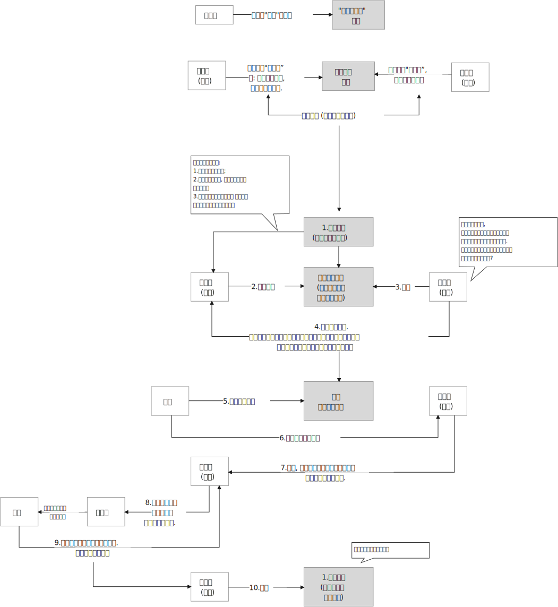

= 政治中,历史的规律
:toc: left
:toclevels: 3
:sectnums:
:stylesheet: myAdocCss.css

'''

== 帝制时代

.★ 王朝统治的衰败规律
[%collapsible%open]
====
[.small]
[options="autowidth" cols="1a,1a"]
|===
|Header 1 |Header 2

|1."明规则"阶段
|当新的王朝发展到一定时期，制度(明规则)就会开始懈怠. 该遵守的规则失去落实，该处理的政务没有人干。

|2.逐渐的，"潜规则"开始当家.
|其实有较为固定的"潜规则"，也能维持运转，大家实践几次也就都知道该怎样办事了。

|3."无规则"阶段
|再后来，潜规则也不管用了，它又被"无规则"取代。但等到"潜规则"都被破坏了，这个时候就会产生混乱，人们对该怎么办事就没有共同预期了。

|===

'''
====

== 清末

.英国把东印度公司这种专营公司取消了，目的是为了彻底地实行了自由贸易.
[%collapsible%open]
====
早期英国对远东的贸易, 是由"东印度公司"专营的，这是一个商人的联合组织。1832年，英国把东印度公司这种专营公司取消了，彻底地实行了自由贸易。 以前让专营公司主持的时候，专营公司是有私人武装的，他们不需要国家的保护。专营制度取消以后，国家的责任就变大了，导致政府必须直接地去军事保护对外商贸。

'''
====

.晚清历史的本质, 就是西方把中国拖入世界体系的过程。
[%collapsible%open]
====
中国近代史的本质, 就是西方迫使清朝接受西方有关"国际贸易"和"国际关系"的概念. +
晚清历史的本质, 就是西方把中国拖入世界体系的过程。中国传统是"朝贡体系". 朝贡体系就是国与国不平等关系.  如果我们不知道近代中国是怎样融入世界体系的，或者完全无视这个过程，结果就只会有人重新闭关锁国, 鼓噪排外。

'''
====

.为什么称为"不平等条约"?
[%collapsible%open]
====
为什么西方和清朝签订的条约, 是把中国带入了现代世界和开明进步, 却还被称作”不平等条约”? *因为条约主要是中国出让了一些主权, 所以它们就被称为"不平等的".*

'''
====

.最惠国条款, 继续将任何一个条约国所取得的所有特权, 给予每一个条约国。
[%collapsible%open]
====
始自19世纪40年代的这一体系 (最惠国条款), 在20世纪最终发展为: 大概控制包括约90个通商口岸和开放港口、约25个(轮船) 停靠港, 和约30多万外国侨民的体系。在通商口岸城市中, 西方人引进了西方都市化的市政设施 — 报纸、学校、图书馆, 医院、供水排水系统、铺石道路, 和照明系统。还有西方的更高的生活标准。

'''
====

.下一代的新式教育下的学生阶层, 很快就会开始成为社会的领导者.
[%collapsible%open]
====
教育体制和教育内容不改，就培养不出新思想下的下一代, 社会就缺乏”宪法文化”, 宪制的发展就缺乏发动机. 因为**下一代的新式教育下的学生阶层, 很快就会开始成为社会的领导者.**

洋务运动从整体上来说，还只是停留在少数开明官员的实践中，还没有成为整个社会的士大夫的集体自觉行为。因为科举还没有变. *科举不变，整个社会的评价体系就不会变, 士风也很难发生改变.* 士大夫的思想仍然活在中世纪，在儒家建构起的"天下秩序"里思考现实。 +
所以**没有用西式教育培养全新思想的人, 这就导致洋务运动的后续, 中坚人才长期匮乏 (没有接班人)。 导致整个洋务运动只是"变物, 没变思想和制度".**

为了同时利用儒学来支持变法思想, 康有为决定改造儒学、改造孔子, 将孔子打扮成一个支持变法的革新者. **最好的方式是找到原始儒学，然后直接往里面加东西，因为原始儒学写的很模糊(所谓微言大义), 本来就具有较大的解读开放性，可以添设许多新的理论思想**，靠这种方法来支持变法是可以的 (变"他驱"为"自驱")。

对于变法来说，启蒙只是一个方面，而文化的改造一直会是个难题。

'''
====

.外因里,有"益处"也有"弊处". 同样, 内因里也是既有"益处"也有"弊处". 所以不能把所有的"弊处"都归于"外因".
[%collapsible%open]
====
传统解释认为, 中国现代化过程的缓慢, 主要是因为(外因)西方“帝国主义"压迫的有害影响。但这种观点无法解释为什么势不可当的“帝国主义"影响, 在日本和中国却产生了如此不同的结果 (日本在"西方文明的外因"和"自身文化的内因"下, 通过明治维新, 逐渐进入了民主国家行列)。 +
事实上, (内因)儒家文化的某些特征, 阻碍了中国的变革. (中国的历史向来没有宪法文化, 没有宪政文化的土壤, 就很难实现”宪政果实的最终结出”. 因为文化就是发动机, 就是惯性.)

'''
====

.★ 关于清末新政, 凡是都一定要踏出开头第一步,才会有第二步. 不能因为第一步做的不够好, 就直接否定掉它. 否则就会犯“倒果为因”的认知错误.
[%collapsible%open]
====
我们至今在评述革命时，总是从正面对其进行评价, **我们惯常的逻辑总是误以为, 肯定是前代王朝事情做的不好，所以才导致了革命。但这种解释, 很多推论都是”倒果为因”.** 事实上, 清末新政还算搞得不错.

新政时, 朝廷中的官制改革、司法改革，废除科举，都在有序地进行。民营工业的增加, 国家财政好转, 吏治逐渐变好. 预备立宪以后，这方面的表现就更明显了。在新政期间，地方的自治团体确实也成了国家法律上承认的合法机构，不像以前，官方可以无视这些民意代表的意见.

**有些人批评说这些都是假的，清政府搞的不是真民主。但任何事情总是要有个起点，从这个起点坚持走下去，只要大方向不错，一般都会走到真民主的状态。(如台湾)**

有人批评当时的选举有财产限制，说朝廷对”选举人”和”被选举人”都设有很高的财产门槛，但你不能据此就说那是假民主。在那个时代，几乎所有国家的选举都有限制，都有财产和纳税的限制，而且妇女都没有选举权。若是以”普选”为标准来衡量当时的民主的话，直到二十世纪30年代以前，世界上都没有民主国家——一个国家一半的人口都没有选举权，那凭什么说它是民主国家啊。道理不能这么讲，清朝搞新政，本身就含有推进民主的意义。**民主的实现, 是一个逐渐完善的过程. 但首先它得有开端.**

1908年，光绪和西太后都死了, 让溥仪继位，溥仪的爹载沣为摄政王. 载沣开始收权, 开新政的倒车.

'''
====

.中国以往历史教育中的"革命线索" —— 强调从太平天国、义和团, 然后到辛亥革命. 这很容易使我们忽略历史的多线性.
[%collapsible%open]
====
今天我们关于戊戌变法的历史叙事，其实在很大程度上是沿袭了康梁对变法的描绘和记述。所以我们一提到戊戌维新，首先联想到的可能就是康梁主导下的变法. 但其实在当时，有许多人都在变法。所以，戊戌变法在当时是存在多个中心、多条路径的。

'''
====

== 北洋时代

.会党对历史的作用被长期夸大和高估了。因为**在中国，任何事情一旦发迹，就会有人给其写东西、编历史。**
[%collapsible%open]
====
现在关于会党的研究很多，最大的问题在于，**会党对历史的作用被长期夸大和高估了。因为在中国，任何事情一旦发迹，就会有人给其写东西、编历史。** +
编历史的会这样说，这些组织从一开始就是抱着反清复明这样的远大宗旨的. 其实帮会人士只是希望抵抗清政府对他们的敌视和压制。**至于反清复明什么的，都是后来人加上去的一些由头。** +
包括会党的历史，以及他们跟少林寺、南少林寺的关系，都是编的。其实少林寺和南少林寺的历史本身也是编的。民众就是需要一些神话，如果太真实了，就缺少吸引人的地方了。

革命党搞的起义，只要是有会党参与的，一般都没什么戏。因为兴中会钱多，所以总是用钱去收买土匪或者三合会去发动起义。一旦钱没了, 大家就都散了。 +
如果革命党笼络的会党稍微多一点，他们可能就会自己先掐起来，因为他们从来都不是一个团体. 帮会并没有真正的谱系，这些谱系什么的都是后来建的。洪门，尤其是青帮，都是组织完善以后, 自己建起的谱系发展脉络(就跟建家谱一样)。*什么辈分啊，排序啊，都是后来人弄出的名堂.* 最初就是一盘散沙，山头林立。

而这些帮会又自认为是革命党。很多地方的帮会都没怎么打过仗，但他们都自认为是革命元勋。**这些混吃混喝的人就这么起来了，虽然无甚功劳，但已经成为革命元勋了，就要分享革命成果。**所以帮会开始各占一摊，进了城之后秩序大乱，他们觉得轮到帮会来坐天下，他们该做皇帝了，就为所欲为，比如公开地包娼包赌，公然地在大街上抢劫。 +
*所以到了后来，跟帮会沾边的革命党人都遭到了排挤.* 比如湖南的焦达峰、陈作新先后被杀，显然是跟他们的帮会背景有关系。当时的帮会太猖狂了，焦达峰在都督府里每天都要摆流水席，天天接待各种江湖人士。**这些人来了，不仅要吃饭，还要封官，还要给钱，**湖南在新政期间攒了几百万两的银子，都让这帮人花光了，而且之后整个长沙城秩序还是一直混乱。

*在当时，革命党若是不镇压帮会，就根本处理不了混乱的局势。如果革命党想赢得民众的支持，塑造合法性，就必须镇压昔日的盟友。*

就孙中山的个人想法而言，他未必想真正地动员帮会，他做的只是对他们进行收买和利用. 在同盟会中，孙中山是最大的金主，**因为两广人士中的海外华侨比较多，**所以能从海外筹到钱的只有孙中山，他可以收买大批帮会参与起事。**而江浙和两湖地区出外谋生的海外华侨, 则少很多，**所以光复会以及两湖的革命党没法从海外筹钱，只能依靠当地的富人捐一点钱。没钱怎么动员帮会呢？只有靠拉感情了，就是跟人套关系、戴高帽。 +
**革命党人对这些帮会分子从一定意义上讲就是利用，他们并不会真的想要跟帮会共天下，或者起事成功后平分国家权力。**

'''
====

.如果没有外国的中立, 没有各省份的独立, 而没有去军事武力镇压起义者, 辛亥革命是不可能成功的.
[%collapsible%open]
====
武昌落入起义者的手中后 (10月10日), 外国领事宣布中立。它促使另外约二十个重要城巿或地区宣布反满. 到12月初, 所有南部和中部省份, 甚至包括西北部省份都宣告独立。

'''
====

.北洋时期 (共 4×4=16年) : [民国后 ←→  国民革命军北伐胜利前] 包括四个阶段: 袁世凯+玩只凤
[%collapsible%open]
====
- 袁世凯 (4年) : 1912-1916
- 皖系 (4年) : 1916-1920 /段祺瑞
- 直系 (4年) : 1920-1924 /
- 奉系 (4年) : 1924-1928  ← 奉系不能算是北洋军阀, 只是北洋军阀的一个支。张作霖等人根本就是土匪，后来才跟北洋系统搭上了关系。所以他不是北洋出身, 非”正统北洋嫡系部队”.
- 国民党 : 1928-

以皖系和直系这种地域取向划分两大派系, 并不是绝对的，只是说两派的首脑是安徽人和直隶人。

'''
====

.*袁世凯和其后继者, 都缺乏革命派所企望的那种"建立 Anglo-Saxon 盎格鲁–撤克逊式政府"所必备的法理依据, 而不得不依赖于武力维持统治。 共和制, 就变蜕变为军阀政府.*
[%collapsible%open]
====
辛亥革命后, 袁世凯与革命党人和清皇室, 都进行了公开或秘密的谈判, 并达成一项总的解决办法. +
清帝溥仪退位(1912.2.12)之后, 孙中山随即辞去临时总统的职务, 袁世凯被南京选为孙的继承人 (因为孙中山和同僚, 既没有掌握武装力量, 在各省又没有大批的支持者). 不过, 袁借口北京发生兵变, 不南下就职, 而在自己的势力范围北京就职, 按照《临时约法》进行统治, 直到选出国会, 和建立完全的立宪政府时为止.

但是, **袁世凯和其后继者, 都缺乏革命派所企望的那种"建立 Anglo-Saxon 盎格鲁–撤克逊式政府"所必备的法理依据, 而不得不依赖于武力维持统治。 共和制, 变蜕变为军阀政府.**

孙中山, 黄兴等老一辈的革命领导人, 不谙(ān 熟悉；懂得)治国之术,无力实现政党统治,甚至连这个要求也提不出。他们在这个问题上思想不明、目标未定、意见不一. 而且**政党制度, 也尚未在中国的条件下经过考验.**

**当时的所有政党, 只不过是由一群靠个人关系聚集到一起的上层人物的团体. 这些人并非从民选种产生, 因此他们缺乏选民的拥护、政治上的显赫地位和经验.**

'''
====

.★ 美国共和制, 应用到中国时, 遇到的中国问题阻力
[%collapsible%open]
====
共和制度, 是一个模仿美国建立的当时最先进的制度. 但应用到中国时，遇到了一些问题阻碍:

[.small]
[options="autowidth" cols="1a,1a"]
|===
|Header 1 |Header 2

|1.一个就是: **原有的忠诚和服从意识丧失，属下总是发生叛乱。所以若是某人当了某省或地区的督军，一般都要兼任一个主力师的师长，不然就有被人架空的危险 (枪杆子里面出政权)。**这种模式会不断向下复制，一个师长要想控制住自己的军队，必须兼任一个主力旅的旅长，而旅长又要兼任一个主力团的团长，循次往下，否则就没戏。
|这个问题, 中山没有机会也没有能力解决. 袁世凯是个政治强人，他也解决不了这个问题. 很多军阀也都被这个问题所困扰。吴佩孚为了解决这个问题，他的办法是重建传统秩序. 冯玉祥则借助基督教. 后来蒋介石找到了一个主义和一个党, 来建构一个忠诚体系，但这个体系远不够牢靠。

袁世凯死于1916年6月. 1916-1928年这段时期, 是军阀混战. **只拥有政党, 而不拥有军队的革命派, 无法获取政权; 只拥有军队, 而不拥有政党的军阀, 也同样无法获取政权.**

|2.对共和制的运作, 学习不够，经验不足，还在试用期，需要长期摸熟
|**国会的运作，行政权、立法权、司法权的分立制衡等到底该如何实际运作，中国人也一直不是很清楚 (即中国历史上就缺乏宪政文化, 所以中国人对此的知识储备为零, 只能重复踩坑来积累经验, 导致社会就会处在持续循环的”民主化”倾向与”专制化”倾向的摇摆中, 就好像一个人在学会走路之前, 必定会先踉踉跄跄的左一步, 右一步积累经验一样, 直到他最终掌握了平衡杆, 并将这种平衡杆内化到肌肉记忆(即社会拥有了”宪政文化和经验”后), 社会才会实现并运行平稳的民主统治方式)。**此前虽然有预备立宪的尝试，但这种尝试很短暂, 经验积累不够。而且，清末预备立宪的准议会, 和后来的国会也不一样. 所以**中国一下子改成共和制以后，民众对这套全新的架构不熟悉, 不知道总统是个什么样的职务. 所以各种纷扰(即磨合期)先后出现。**

当时的选举, 是由地方士绅负责操办的. 投票只是个过程，事实上是没有投的。因为地方士绅并不确定共和制是什么，更不清楚共和制下的国会是怎么一回事儿，所以他们倾向于选那些出头露面的革命党人, 或者是与革命有关系的人。很多代表都回忆说，他们是在家乡被提名为国会议员的，但他们既没有去竞选，也没有去拉票，什么都没搞，坐在北京就当上了国会议员。

|3.当选人权威性没有大到, 让政府和国会信服, 一致行动. 造成施政推进困难.
|袁世凯死后, 各地割据军阀并起。袁世凯时代，各省的督军还多少对中央保持着一点服从，还能给中央上解一点钱粮税款，但是袁死后，这种事情就没了，**中央政府从此政令难出都门。**当然，也不是说中央完全控制不了地方，而是**要想控制，就得先给钱。往往地方从中央拿一万块钱，就给中央办一千块钱或者一百块钱的事儿 (严重缩水);** 要是中央不给钱，地方啥事也不办，中央政府对此毫无办法。整个体系，上下不服从的问题更为严重.

之前, 最牛的人是袁世凯，**其余所有人都是他提拔的，因此所有人都听命于他.  但在袁世凯死后，他的继承者就很难有这样的权威。**像北洋三杰龙虎狗，王士珍、冯国璋和段祺瑞，**大家平起平坐，而且跟他们资历基本相同的人还有很多，**比如张勋、陆建章、段芝贵等，其实有一大堆人，原来都是称兄道弟的，基本都差不多。这个时候要想从*矮*子里面拔将军，筷子里头挑旗杆, 谁能赶得上袁世凯的权威呢？

.五四运动的吊诡之处: 它是限制别人自由的.

由于巴黎和会中国外交失败的缘故，所有反皖系的人都找到了突破口。但巴黎和会上中国并非什么都没得到 :

- 德国、奥匈帝国的租界, 我们收回了. 它们份上的庚子赔款我们不用赔了.
- 战前西方是不跟中国谈关税自主、治外法权的，但是这个时候它也准备谈了。

五四运动时, 军阀政府也不镇压，他们自认为是民主政府。

新文化运动提倡个性解放，提倡个人的自由，但是这个**五四运动中经常是限制别人自由的。**只要民族主义起来了，说要抵制日货，买日货的在他们的眼里就变成了”卖国贼”，卖日货的更是”卖国贼”. **当时的学生去冲击赵家楼，把曹汝霖家烧了，把章宗祥打个半死。学生认为自己完全正当，但这种行为是违法的。**这一系列行为与原来主张的自由主义精神相背离，从原来的个性解放变成反政府，后来就从反政府走向政治了。

再后来，五四青年开始分化，什么国家主义派、自由派、无政府主义、布尔什维主义都出来了。

.五四运动获胜的背后, 是军政界的支持, 否则, 学生运动只会被镇压
五四学生运动, 很快得到了全国新闻界和商界、孙中山和广州政府, 及军阀派系中"安福系"(皖系下)的支持。 学生证明了他们是一支新的政治力量. 最终, 这场运动获得了胜利, 内阁辞职. 中国拒绝在《凡尔赛和约》上签字。

北洋军阀整个统治的结束，很大程度上源于它的分裂。帝制结束后，再没有一个东西能够统住这些人了。既然大家都不忠君了，我凭什么忠于你？(大家还没有都”忠于宪政”的理念.) 五代十国也是如此，藩镇也是如此. 第一代没有撕破脸皮，第二代就可能这样做。第二代跟第一代思路不一样，代与代之间很多东西是会发生转换的。

|4.缺乏养育宪政文化的耐心, 想直接竞争对手的宪政一套, 来搞自己的一套
|二次革命后, 孙中山在日本搞了一个中华革命党的小圈子，所有人都要按手印向孙中山宣誓，以表示个人效忠。国民党的大部分人都不干，一些有实力的大佬都纷纷抗议，像黄兴、李烈钧、陈炯明等人都不同意。**效忠个人显然不具有民主性.**

在讨袁革命的时候，孙中山基本没起多大的作用，风头都让进步党等人抢去了。等到段祺瑞当政时，孙中山又不甘心，就悄悄把中华革命党废了，重新回来当国民党的总理事长，但事实上，孙中山在国民党内部已经离心离德了。此时**孙中山既想抗衡北洋势力，又缺乏应有的本钱，于是只能依托西南军阀，然后举起”护法”的旗帜。但这个护法的理由是很牵强的，因为段祺瑞其实已经恢复了民元约法。**

若是按照年头来排，第一届国会的任期已经到了，应当改选议员代表。但由于各种原因，比如袁世凯和张勋的两次复辟，第一届国会的实际任期没有到，孙中山就拿这个说事儿。两个人各有各的道理，但**其实也是完全可以协商的(在法律内解决)，但孙中山就像宋案发生时那样，直接搞武装反抗(直接用武力内战夺权, 跟老毛一样)。**段祺瑞不可能容忍让中国存在两个中央政府，一个在北京，一个在广州. 所以从1917年下半年开始，南北就开始交战。

|5.赤色共产主义对民主宪政的冲击与破坏
|

|===

'''
====

.北洋政府(段祺瑞时)的财政问题, 导致政府(”内阁”. 内阁首相（总理）就是政府首脑) 和”国会”更加难合作
[%collapsible%open]
====
到了段祺瑞时代，没人给中央送钱了. 各省都有自己的借口，比如说，因为此前跟国民党打过一仗，所以地方不甚太平，**军饷也有欠发，只能把地方财政截留了，不然士兵就要哗变了。**中央若是想要我们上解税款，那就先帮我们把军饷发了吧，先把军费拨下来再说。然后各省就会开出一个天文数字般的军费，如果地方一共只能往中央上解一百万税款，那么它常常告诉中央需要一千万才能弥补军费损失。而且，中央根本没有能力对这些地方军头进行处罚.

所以，当时中央财政十分窘迫，财源寥寥无几. 只包括下面这几个来源:

- 关税和盐税扣除了庚子赔款后, 所剩余的那一点儿钱.
- 交通部掌管的几条铁路的收入
- 北京的关税

所以，自从段祺瑞以后，北洋政府里只有两个部门比较有钱，一是财政部，二是交通部。其余各部都是穷部，从袁世凯死后就开始欠薪。**政府老欠薪，议员焉有不闹之理? 所以，”内阁”跟”国会”之间的回旋余地也就很小了.** +
*手里头没有钱，段祺瑞主政时所能依凭的资源, 也就很少了.*

'''
====

.借助各种思想理论, 来作为思想武器, 来改造中国
[%collapsible%open]
====
在军阀时期, 政治的软弱, 使得蔡元培能有空间将北大变成"各种思想都能竞争"的学术中心. 蔡元培鼓励教师和学生以个人的身份, 进行政治活动。

蔡元培将陈独秀请到北大来出任文科学长。**陈独秀号召中国青年应是“自主的而非奴隶的**……, 进步的而非保守的……, **进取的而非隐退的……, 世界的而非锁国的……, 实利的而非虚文的……, 科学的而非仅仅是想象的。**" 在北大，陈独秀继续编辑《新青年》，这本杂志成为开放性的讨论论坛。

在由此而形成的热潮中，**当时所有在西方和日本流行的社会和哲学理论—-现实主义、功利主义、实用主义、自由主义、个人主义、社会主义、无政府主义、达尔文主义和唯物主义等, 都得到不同程度的反映。运用这些思想武器, **即陈独秀所称的“德先生”(民主)和“赛先生”(科学), 他们对旧社会进行了批评. 陈独秀写道: “只有这两位先生,可以救治中国政治上, 道德上, 学术上, 思想上 一切的黑暗。”

'''
====

."民族主义"就压倒了"个人自由主义", 社会民主改造之路夭折
[%collapsible%open]
====
新文化运动: 目的是为了就新的社会准则进行辩论. 西方著作在国内出版剧增. 第一流的外国学者来华讲学. 不过由于缺乏社会和政治行动，这场思想运动在1919年5月4日之后的一年或两年中停顿下来.

**关注的焦点一度曾是"如何使个人获得解放"(自由主义), 但在1921年之后,焦点又转到"如何使国家强大起来"(属于约束个人自由的专制主义)。结果, "民族主义"就压倒了"个人自由主义".** 试图"动员和控制个人及其文化活动"的政治运动, 不久便兴起。

'''
====

== 民国

.三民主义思想, 是个内涵比较模糊的概念
[%collapsible%open]
====

清末, "中国该走何种政治道路”, 有着不同的思想竞争

**面临着上述这些竞争和机会, 孙中山提出了他自己的思想 -- 三民主义**(民族, 民权, 民生)。 **这三个概念的具体含义, 能在特定情况下做较大的变更.**

**孙中山**是一个外国化的中国人, 而**不是一个著名学者,他以他的密谋和果敢的行动而著称，而不以他的文章而闻名: 他确实有理论, 却失之于肤浅. 因此，他不能充当指导同辈人思想的理论家角色。** +
而**关于”共和主义”的新思想体系**, 是孙中山的副手 — 同盟会刊物《民报》的撰稿人 — **汪精卫和胡汉民等来建立的,** 通过抨击梁启超的”渐进改良”和”君主立宪”的思想, 同盟会成功赢得中国学生对一个引人入胜的论点的支持, 即中国通过一场迅疾的革命, 就能够赶上和超过西方(如同日本一样)。(事后证明这种想法太乐观了.)

孙中山实现民主的三阶段计划是：  +
1."军政之治" (3年), 各县逐一建立起地方自治政府. +
2."约法之治" (6年)，这一阶段也被称为“训要”. +
3."宪政之治",选举产生总统和国会。

'''
====

