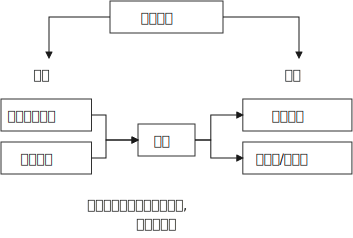
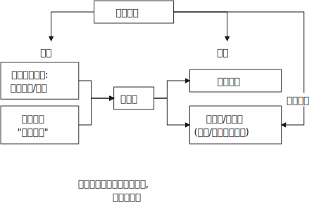
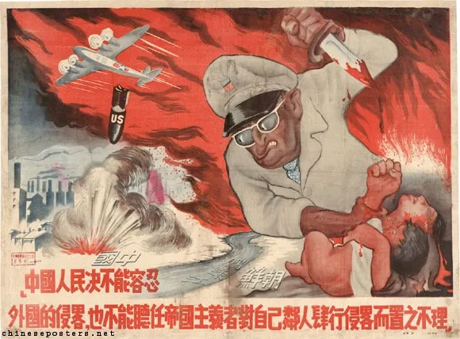
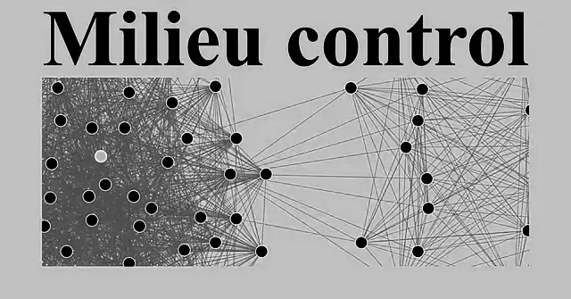

= 政治中,历史的规律
:toc: left
:toclevels: 3
:sectnums:
:stylesheet: myAdocCss.css

'''

== 帝制时代

.★ 王朝统治的衰败规律
[%collapsible%open]
====
[.small]
[options="autowidth" cols="1a,1a"]
|===
|Header 1 |Header 2

|1."明规则"阶段
|当新的王朝发展到一定时期，制度(明规则)就会开始懈怠. 该遵守的规则失去落实，该处理的政务没有人干。

|2.逐渐的，"潜规则"开始当家.
|其实有较为固定的"潜规则"，也能维持运转，大家实践几次也就都知道该怎样办事了。

|3."无规则"阶段
|再后来，潜规则也不管用了，它又被"无规则"取代。但等到"潜规则"都被破坏了，这个时候就会产生混乱，人们对该怎么办事就没有共同预期了。

|===

'''
====

== 清末

.英国把东印度公司这种专营公司取消了，目的是为了彻底地实行了自由贸易.
[%collapsible%open]
====
早期英国对远东的贸易, 是由"东印度公司"专营的，这是一个商人的联合组织。1832年，英国把东印度公司这种专营公司取消了，彻底地实行了自由贸易。 以前让专营公司主持的时候，专营公司是有私人武装的，他们不需要国家的保护。专营制度取消以后，国家的责任就变大了，导致政府必须直接地去军事保护对外商贸。

'''
====

.晚清历史的本质, 就是西方把中国拖入世界体系的过程。
[%collapsible%open]
====
中国近代史的本质, 就是西方迫使清朝接受西方有关"国际贸易"和"国际关系"的概念. +
晚清历史的本质, 就是西方把中国拖入世界体系的过程。中国传统是"朝贡体系". 朝贡体系就是国与国不平等关系.  如果我们不知道近代中国是怎样融入世界体系的，或者完全无视这个过程，结果就只会有人重新闭关锁国, 鼓噪排外。

'''
====

.最惠国条款, 继续将任何一个条约国所取得的所有特权, 给予每一个条约国。
[%collapsible%open]
====
始自19世纪40年代的这一体系 (最惠国条款), 在20世纪最终发展为: 大概控制包括约90个通商口岸和开放港口、约25个(轮船) 停靠港, 和约30多万外国侨民的体系。在通商口岸城市中, 西方人引进了西方都市化的市政设施 — 报纸、学校、图书馆, 医院、供水排水系统、铺石道路, 和照明系统。还有西方的更高的生活标准。

'''
====

.下一代的新式教育下的学生阶层, 很快就会开始成为社会的领导者.
[%collapsible%open]
====
教育体制和教育内容不改，就培养不出新思想下的下一代, 社会就缺乏”宪法文化”, 宪制的发展就缺乏发动机. 因为**下一代的新式教育下的学生阶层, 很快就会开始成为社会的领导者.**

洋务运动从整体上来说，还只是停留在少数开明官员的实践中，还没有成为整个社会的士大夫的集体自觉行为。因为科举还没有变. *科举不变，整个社会的评价体系就不会变, 士风也很难发生改变.* 士大夫的思想仍然活在中世纪，在儒家建构起的"天下秩序"里思考现实。 +
所以**没有用西式教育培养全新思想的人, 这就导致洋务运动的后续, 中坚人才长期匮乏 (没有接班人)。 导致整个洋务运动只是"变物, 没变思想和制度".**

为了同时利用儒学来支持变法思想, 康有为决定改造儒学、改造孔子, 将孔子打扮成一个支持变法的革新者. **最好的方式是找到原始儒学，然后直接往里面加东西，因为原始儒学写的很模糊(所谓微言大义), 本来就具有较大的解读开放性，可以添设许多新的理论思想**，靠这种方法来支持变法是可以的 (变"他驱"为"自驱")。

对于变法来说，启蒙只是一个方面，而文化的改造一直会是个难题。

'''
====

.外因里,有"益处"也有"弊处". 同样, 内因里也是既有"益处"也有"弊处". 所以不能把所有的"弊处"都归于"外因".
[%collapsible%open]
====
传统解释认为, 中国现代化过程的缓慢, 主要是因为(外因)西方“帝国主义"压迫的有害影响。但这种观点无法解释为什么势不可当的“帝国主义"影响, 在日本和中国却产生了如此不同的结果 (日本在"西方文明的外因"和"自身文化的内因"下, 通过明治维新, 逐渐进入了民主国家行列)。 +
事实上, (内因)儒家文化的某些特征, 阻碍了中国的变革. (中国的历史向来没有宪法文化, 没有宪政文化的土壤, 就很难实现”宪政果实的最终结出”. 因为文化就是发动机, 就是惯性.)

'''
====

.★ 关于清末新政, 凡是都一定要踏出开头第一步,才会有第二步. 不能因为第一步做的不够好, 就直接否定掉它. 否则就会犯“倒果为因”的认知错误.
[%collapsible%open]
====
我们至今在评述革命时，总是从正面对其进行评价, **我们惯常的逻辑总是误以为, 肯定是前代王朝事情做的不好，所以才导致了革命。但这种解释, 很多推论都是”倒果为因”.** 事实上, 清末新政还算搞得不错.

新政时, 朝廷中的官制改革、司法改革，废除科举，都在有序地进行。民营工业的增加, 国家财政好转, 吏治逐渐变好. 预备立宪以后，这方面的表现就更明显了。在新政期间，地方的自治团体确实也成了国家法律上承认的合法机构，不像以前，官方可以无视这些民意代表的意见.

**有些人批评说这些都是假的，清政府搞的不是真民主。但任何事情总是要有个起点，从这个起点坚持走下去，只要大方向不错，一般都会走到真民主的状态。(如台湾)**

有人批评当时的选举有财产限制，说朝廷对”选举人”和”被选举人”都设有很高的财产门槛，但你不能据此就说那是假民主。在那个时代，几乎所有国家的选举都有限制，都有财产和纳税的限制，而且妇女都没有选举权。若是以”普选”为标准来衡量当时的民主的话，直到二十世纪30年代以前，世界上都没有民主国家——一个国家一半的人口都没有选举权，那凭什么说它是民主国家啊。道理不能这么讲，清朝搞新政，本身就含有推进民主的意义。**民主的实现, 是一个逐渐完善的过程. 但首先它得有开端.**

1908年，光绪和西太后都死了, 让溥仪继位，溥仪的爹载沣为摄政王. 载沣开始收权, 开新政的倒车.

'''
====

.中国以往历史教育中的"革命线索" —— 强调从太平天国、义和团, 然后到辛亥革命. 这很容易使我们忽略历史的多线性.
[%collapsible%open]
====
今天我们关于戊戌变法的历史叙事，其实在很大程度上是沿袭了康梁对变法的描绘和记述。所以我们一提到戊戌维新，首先联想到的可能就是康梁主导下的变法. 但其实在当时，有许多人都在变法。所以，戊戌变法在当时是存在多个中心、多条路径的。

'''
====

== 北洋时代

.会党对历史的作用被长期夸大和高估了。因为**在中国，任何事情一旦发迹，就会有人给其写东西、编历史。**
[%collapsible%open]
====
现在关于会党的研究很多，最大的问题在于，**会党对历史的作用被长期夸大和高估了。因为在中国，任何事情一旦发迹，就会有人给其写东西、编历史。** +
编历史的会这样说，这些组织从一开始就是抱着反清复明这样的远大宗旨的. 其实帮会人士只是希望抵抗清政府对他们的敌视和压制。**至于反清复明什么的，都是后来人加上去的一些由头。** +
包括会党的历史，以及他们跟少林寺、南少林寺的关系，都是编的。其实少林寺和南少林寺的历史本身也是编的。民众就是需要一些神话，如果太真实了，就缺少吸引人的地方了。

革命党搞的起义，只要是有会党参与的，一般都没什么戏。因为兴中会钱多，所以总是用钱去收买土匪或者三合会去发动起义。一旦钱没了, 大家就都散了。 +
如果革命党笼络的会党稍微多一点，他们可能就会自己先掐起来，因为他们从来都不是一个团体. 帮会并没有真正的谱系，这些谱系什么的都是后来建的。洪门，尤其是青帮，都是组织完善以后, 自己建起的谱系发展脉络(就跟建家谱一样)。*什么辈分啊，排序啊，都是后来人弄出的名堂.* 最初就是一盘散沙，山头林立。

而这些帮会又自认为是革命党。很多地方的帮会都没怎么打过仗，但他们都自认为是革命元勋。**这些混吃混喝的人就这么起来了，虽然无甚功劳，但已经成为革命元勋了，就要分享革命成果。**所以帮会开始各占一摊，进了城之后秩序大乱，他们觉得轮到帮会来坐天下，他们该做皇帝了，就为所欲为，比如公开地包娼包赌，公然地在大街上抢劫。 +
*所以到了后来，跟帮会沾边的革命党人都遭到了排挤.* 比如湖南的焦达峰、陈作新先后被杀，显然是跟他们的帮会背景有关系。当时的帮会太猖狂了，焦达峰在都督府里每天都要摆流水席，天天接待各种江湖人士。**这些人来了，不仅要吃饭，还要封官，还要给钱，**湖南在新政期间攒了几百万两的银子，都让这帮人花光了，而且之后整个长沙城秩序还是一直混乱。

*在当时，革命党若是不镇压帮会，就根本处理不了混乱的局势。如果革命党想赢得民众的支持，塑造合法性，就必须镇压昔日的盟友。*

就孙中山的个人想法而言，他未必想真正地动员帮会，他做的只是对他们进行收买和利用. 在同盟会中，孙中山是最大的金主，**因为两广人士中的海外华侨比较多，**所以能从海外筹到钱的只有孙中山，他可以收买大批帮会参与起事。**而江浙和两湖地区出外谋生的海外华侨, 则少很多，**所以光复会以及两湖的革命党没法从海外筹钱，只能依靠当地的富人捐一点钱。没钱怎么动员帮会呢？只有靠拉感情了，就是跟人套关系、戴高帽。 +
**革命党人对这些帮会分子从一定意义上讲就是利用，他们并不会真的想要跟帮会共天下，或者起事成功后平分国家权力。**

'''
====

.如果没有外国的中立, 没有各省份的独立, 而没有去军事武力镇压起义者, 辛亥革命是不可能成功的.
[%collapsible%open]
====
武昌落入起义者的手中后 (10月10日), 外国领事宣布中立。它促使另外约二十个重要城巿或地区宣布反满. 到12月初, 所有南部和中部省份, 甚至包括西北部省份都宣告独立。

'''
====

.北洋时期 (共 4×4=16年) : [民国后 ←→  国民革命军北伐胜利前] 包括四个阶段: 袁世凯+玩只凤
[%collapsible%open]
====
- 袁世凯 (4年) : 1912-1916
- 皖系 (4年) : 1916-1920 /段祺瑞
- 直系 (4年) : 1920-1924 /
- 奉系 (4年) : 1924-1928  ← 奉系不能算是北洋军阀, 只是北洋军阀的一个支。张作霖等人根本就是土匪，后来才跟北洋系统搭上了关系。所以他不是北洋出身, 非”正统北洋嫡系部队”.
- 国民党 : 1928-

以皖系和直系这种地域取向划分两大派系, 并不是绝对的，只是说两派的首脑是安徽人和直隶人。

'''
====

.*袁世凯和其后继者, 都缺乏革命派所企望的那种"建立 Anglo-Saxon 盎格鲁–撤克逊式政府"所必备的法理依据, 而不得不依赖于武力维持统治。 共和制, 就变蜕变为军阀政府.*
[%collapsible%open]
====
辛亥革命后, 袁世凯与革命党人和清皇室, 都进行了公开或秘密的谈判, 并达成一项总的解决办法. +
清帝溥仪退位(1912.2.12)之后, 孙中山随即辞去临时总统的职务, 袁世凯被南京选为孙的继承人 (因为孙中山和同僚, 既没有掌握武装力量, 在各省又没有大批的支持者). 不过, 袁借口北京发生兵变, 不南下就职, 而在自己的势力范围北京就职, 按照《临时约法》进行统治, 直到选出国会, 和建立完全的立宪政府时为止.

但是, **袁世凯和其后继者, 都缺乏革命派所企望的那种"建立 Anglo-Saxon 盎格鲁–撤克逊式政府"所必备的法理依据, 而不得不依赖于武力维持统治。 共和制, 变蜕变为军阀政府.**

孙中山, 黄兴等老一辈的革命领导人, 不谙(ān 熟悉；懂得)治国之术,无力实现政党统治,甚至连这个要求也提不出。他们在这个问题上思想不明、目标未定、意见不一. 而且**政党制度, 也尚未在中国的条件下经过考验.**

**当时的所有政党, 只不过是由一群靠个人关系聚集到一起的上层人物的团体. 这些人并非从民选种产生, 因此他们缺乏选民的拥护、政治上的显赫地位和经验.**

'''
====

.★ 美国共和制, 应用到中国时, 遇到的中国问题阻力
[%collapsible%open]
====
共和制度, 是一个模仿美国建立的当时最先进的制度. 但应用到中国时，遇到了一些问题阻碍:

[.small]
[options="autowidth" cols="1a,1a"]
|===
|Header 1 |Header 2

|1.一个就是: **原有的忠诚和服从意识丧失，属下总是发生叛乱。所以若是某人当了某省或地区的督军，一般都要兼任一个主力师的师长，不然就有被人架空的危险 (枪杆子里面出政权)。**这种模式会不断向下复制，一个师长要想控制住自己的军队，必须兼任一个主力旅的旅长，而旅长又要兼任一个主力团的团长，循次往下，否则就没戏。
|这个问题, 中山没有机会也没有能力解决. 袁世凯是个政治强人，他也解决不了这个问题. 很多军阀也都被这个问题所困扰。吴佩孚为了解决这个问题，他的办法是重建传统秩序. 冯玉祥则借助基督教. 后来蒋介石找到了一个主义和一个党, 来建构一个忠诚体系，但这个体系远不够牢靠。

袁世凯死于1916年6月. 1916-1928年这段时期, 是军阀混战. **只拥有政党, 而不拥有军队的革命派, 无法获取政权; 只拥有军队, 而不拥有政党的军阀, 也同样无法获取政权.**

|2.对共和制的运作, 学习不够，经验不足，还在试用期，需要长期摸熟
|**国会的运作，行政权、立法权、司法权的分立制衡等到底该如何实际运作，中国人也一直不是很清楚 (即中国历史上就缺乏宪政文化, 所以中国人对此的知识储备为零, 只能重复踩坑来积累经验, 导致社会就会处在持续循环的”民主化”倾向与”专制化”倾向的摇摆中, 就好像一个人在学会走路之前, 必定会先踉踉跄跄的左一步, 右一步积累经验一样, 直到他最终掌握了平衡杆, 并将这种平衡杆内化到肌肉记忆(即社会拥有了”宪政文化和经验”后), 社会才会实现并运行平稳的民主统治方式)。**此前虽然有预备立宪的尝试，但这种尝试很短暂, 经验积累不够。而且，清末预备立宪的准议会, 和后来的国会也不一样. 所以**中国一下子改成共和制以后，民众对这套全新的架构不熟悉, 不知道总统是个什么样的职务. 所以各种纷扰(即磨合期)先后出现。**

当时的选举, 是由地方士绅负责操办的. 投票只是个过程，事实上是没有投的。因为地方士绅并不确定共和制是什么，更不清楚共和制下的国会是怎么一回事儿，所以他们倾向于选那些出头露面的革命党人, 或者是与革命有关系的人。很多代表都回忆说，他们是在家乡被提名为国会议员的，但他们既没有去竞选，也没有去拉票，什么都没搞，坐在北京就当上了国会议员。

|3.当选人权威性没有大到, 让政府和国会信服, 一致行动. 造成施政推进困难.
|袁世凯死后, 各地割据军阀并起。袁世凯时代，各省的督军还多少对中央保持着一点服从，还能给中央上解一点钱粮税款，但是袁死后，这种事情就没了，**中央政府从此政令难出都门。**当然，也不是说中央完全控制不了地方，而是**要想控制，就得先给钱。往往地方从中央拿一万块钱，就给中央办一千块钱或者一百块钱的事儿 (严重缩水);** 要是中央不给钱，地方啥事也不办，中央政府对此毫无办法。整个体系，上下不服从的问题更为严重.

之前, 最牛的人是袁世凯，**其余所有人都是他提拔的，因此所有人都听命于他.  但在袁世凯死后，他的继承者就很难有这样的权威。**像北洋三杰龙虎狗，王士珍、冯国璋和段祺瑞，**大家平起平坐，而且跟他们资历基本相同的人还有很多，**比如张勋、陆建章、段芝贵等，其实有一大堆人，原来都是称兄道弟的，基本都差不多。这个时候要想从*矮*子里面拔将军，筷子里头挑旗杆, 谁能赶得上袁世凯的权威呢？

image:../img/0065.svg[,]

.五四运动的吊诡之处: 它是限制别人自由的.

由于巴黎和会中国外交失败的缘故，所有反皖系的人都找到了突破口。但巴黎和会上中国并非什么都没得到 :

- 德国、奥匈帝国的租界, 我们收回了. 它们份上的庚子赔款我们不用赔了.
- 战前西方是不跟中国谈关税自主、治外法权的，但是这个时候它也准备谈了。

五四运动时, 军阀政府也不镇压，他们自认为是民主政府。

新文化运动提倡个性解放，提倡个人的自由，但是这个**五四运动中经常是限制别人自由的。**只要民族主义起来了，说要抵制日货，买日货的在他们的眼里就变成了”卖国贼”，卖日货的更是”卖国贼”. **当时的学生去冲击赵家楼，把曹汝霖家烧了，把章宗祥打个半死。学生认为自己完全正当，但这种行为是违法的。**这一系列行为与原来主张的自由主义精神相背离，从原来的个性解放变成反政府，后来就从反政府走向政治了。

再后来，五四青年开始分化，什么国家主义派、自由派、无政府主义、布尔什维主义都出来了。

.五四运动获胜的背后, 是军政界的支持, 否则, 学生运动只会被镇压
五四学生运动, 很快得到了全国新闻界和商界、孙中山和广州政府, 及军阀派系中"安福系"(皖系下)的支持。 学生证明了他们是一支新的政治力量. 最终, 这场运动获得了胜利, 内阁辞职. 中国拒绝在《凡尔赛和约》上签字。

北洋军阀整个统治的结束，很大程度上源于它的分裂。帝制结束后，再没有一个东西能够统住这些人了。既然大家都不忠君了，我凭什么忠于你？(大家还没有都”忠于宪政”的理念.) 五代十国也是如此，藩镇也是如此. 第一代没有撕破脸皮，第二代就可能这样做。第二代跟第一代思路不一样，代与代之间很多东西是会发生转换的。

|4.缺乏养育宪政文化的耐心, 想直接竞争对手的宪政一套, 来搞自己的一套
|二次革命后, 孙中山在日本搞了一个中华革命党的小圈子，所有人都要按手印向孙中山宣誓，以表示个人效忠。国民党的大部分人都不干，一些有实力的大佬都纷纷抗议，像黄兴、李烈钧、陈炯明等人都不同意。**效忠个人显然不具有民主性.**

在讨袁革命的时候，孙中山基本没起多大的作用，风头都让进步党等人抢去了。等到段祺瑞当政时，孙中山又不甘心，就悄悄把中华革命党废了，重新回来当国民党的总理事长，但事实上，孙中山在国民党内部已经离心离德了。此时**孙中山既想抗衡北洋势力，又缺乏应有的本钱，于是只能依托西南军阀，然后举起”护法”的旗帜。但这个护法的理由是很牵强的，因为段祺瑞其实已经恢复了民元约法。**

若是按照年头来排，第一届国会的任期已经到了，应当改选议员代表。但由于各种原因，比如袁世凯和张勋的两次复辟，第一届国会的实际任期没有到，孙中山就拿这个说事儿。两个人各有各的道理，但**其实也是完全可以协商的(在法律内解决)，但孙中山就像宋案发生时那样，直接搞武装反抗(直接用武力内战夺权, 跟老毛一样)。**段祺瑞不可能容忍让中国存在两个中央政府，一个在北京，一个在广州. 所以从1917年下半年开始，南北就开始交战。

|5.赤色共产主义对民主宪政的冲击与破坏
|

|===

'''
====

.北洋政府(段祺瑞时)的财政问题, 导致政府(”内阁”. 内阁首相（总理）就是政府首脑) 和”国会”更加难合作
[%collapsible%open]
====
到了段祺瑞时代，没人给中央送钱了. 各省都有自己的借口，比如说，因为此前跟国民党打过一仗，所以地方不甚太平，**军饷也有欠发，只能把地方财政截留了，不然士兵就要哗变了。**中央若是想要我们上解税款，那就先帮我们把军饷发了吧，先把军费拨下来再说。然后各省就会开出一个天文数字般的军费，如果地方一共只能往中央上解一百万税款，那么它常常告诉中央需要一千万才能弥补军费损失。而且，中央根本没有能力对这些地方军头进行处罚.

所以，当时中央财政十分窘迫，财源寥寥无几. 只包括下面这几个来源:

- 关税和盐税扣除了庚子赔款后, 所剩余的那一点儿钱.
- 交通部掌管的几条铁路的收入
- 北京的关税

所以，自从段祺瑞以后，北洋政府里只有两个部门比较有钱，一是财政部，二是交通部。其余各部都是穷部，从袁世凯死后就开始欠薪。**政府老欠薪，议员焉有不闹之理? 所以，”内阁”跟”国会”之间的回旋余地也就很小了.** +
*手里头没有钱，段祺瑞主政时所能依凭的资源, 也就很少了.*

'''
====

.借助各种思想理论, 来作为思想武器, 来改造中国
[%collapsible%open]
====
在军阀时期, 政治的软弱, 使得蔡元培能有空间将北大变成"各种思想都能竞争"的学术中心. 蔡元培鼓励教师和学生以个人的身份, 进行政治活动。

蔡元培将陈独秀请到北大来出任文科学长。**陈独秀号召中国青年应是“自主的而非奴隶的**……, 进步的而非保守的……, **进取的而非隐退的……, 世界的而非锁国的……, 实利的而非虚文的……, 科学的而非仅仅是想象的。**" 在北大，陈独秀继续编辑《新青年》，这本杂志成为开放性的讨论论坛。

在由此而形成的热潮中，**当时所有在西方和日本流行的社会和哲学理论—-现实主义、功利主义、实用主义、自由主义、个人主义、社会主义、无政府主义、达尔文主义和唯物主义等, 都得到不同程度的反映。运用这些思想武器, **即陈独秀所称的“德先生”(民主)和“赛先生”(科学), 他们对旧社会进行了批评. 陈独秀写道: “只有这两位先生,可以救治中国政治上, 道德上, 学术上, 思想上 一切的黑暗。”

'''
====

."民族主义"就压倒了"个人自由主义", 社会民主改造之路夭折
[%collapsible%open]
====
新文化运动: 目的是为了就新的社会准则进行辩论. 西方著作在国内出版剧增. 第一流的外国学者来华讲学. 不过由于缺乏社会和政治行动，这场思想运动在1919年5月4日之后的一年或两年中停顿下来.

**关注的焦点一度曾是"如何使个人获得解放"(自由主义), 但在1921年之后,焦点又转到"如何使国家强大起来"(属于约束个人自由的专制主义)。结果, "民族主义"就压倒了"个人自由主义".** 试图"动员和控制个人及其文化活动"的政治运动, 不久便兴起。

'''
====

== 民国

.三民主义思想, 是个内涵比较模糊的概念
[%collapsible%open]
====

清末, "中国该走何种政治道路”, 有着不同的思想竞争

**面临着上述这些竞争和机会, 孙中山提出了他自己的思想 -- 三民主义**(民族, 民权, 民生)。 **这三个概念的具体含义, 能在特定情况下做较大的变更.**

**孙中山**是一个外国化的中国人, 而**不是一个著名学者,他以他的密谋和果敢的行动而著称，而不以他的文章而闻名: 他确实有理论, 却失之于肤浅. 因此，他不能充当指导同辈人思想的理论家角色。** +
而**关于”共和主义”的新思想体系**, 是孙中山的副手 — 同盟会刊物《民报》的撰稿人 — **汪精卫和胡汉民等来建立的,** 通过抨击梁启超的”渐进改良”和”君主立宪”的思想, 同盟会成功赢得中国学生对一个引人入胜的论点的支持, 即中国通过一场迅疾的革命, 就能够赶上和超过西方(如同日本一样)。(事后证明这种想法太乐观了.)

孙中山实现民主的三阶段计划是：  +
1."军政之治" (3年), 各县逐一建立起地方自治政府. +
2."约法之治" (6年)，这一阶段也被称为“训要”. +
3."宪政之治",选举产生总统和国会。

'''
====

.中共的策略: 渗透到国民党核心, 进行头部控制
[%collapsible%open]
====
*共产党*(此时党员人数不到一千人), **策略是 : 在国民党外发展其中共组织, 并从国民党内控制该党 (成为核心部门的人员)。**共产党人曾不断渗入黄埔军校, 但最终未能成功. 事实上, 之后**随着国民党军队所起的作用越来越大, 共产党对国民党只进行纯政治控制, 就越来行不通了 (必须掌握军队). **同时, 国民党军队中占统治地位的反共力量, 也将中共最终踢出了国民党起了很大作用.

'''
====

.20年代, 中共还很难有夺权成功的机会, 原因是:
[%collapsible%open]
====
- 寄生上 : *中共无法从国民党的内部来稿垮该党，因为共产国际为国民党提供了一个苏联模式的集中的政党结构，所以难以颠覆 (不像美国的党非常松散, 不存在纪律性)。*
- 群众上 : 工会只能在少数几个港口城市中发展势力,而这里新的国民政府的领导力量和外国势力也最为集中。
- 军队上 : 由于没有本党的军队,共产党无法夺取城市。

'''
====

.国民党政府的性质问题: 党政不分
[%collapsible%open]
====

[.small]
[options="autowidth" cols="1a,1a"]
|===
|Header 1 |Header 2

|-> 党政不分
|国民党的一些部门, 会行使中央"行政系统"的部分职能。这样就是, 党和政府相互渗透, 实际上已无法区分开来(党政不分)。

|-> 蒋介石的集权, 使国民党军队变成了服从于蒋介石个人, 而不是服从于国民党. 更遑论服从于"非任何一个党派"的人民了.
|在蒋的领导下, 国民党的军队成为一个在"创建它的领袖"领导下的准政府, 而不是一支由国民党控制的苏式政党军队。 +
黄埔军校的毕业生, 把持了军事委员会的高级职位 (相当于他们都是蒋介石的门生). 国军不受文官政府节制。也不受立法机关的制约。(军队变成了蒋介石的私家军, 而非政党的军队.)
|===

- 如今中共中, 支持要"党政分开"的理由:
[.small]
[options="autowidth" cols="1a,1a"]
|===
|Header 1 |Header 2

|-> 让自己变成了对立矛盾中的其中一方(变成了运动员身份), 而不能跳脱成为裁判员角色
|社会中各群体都有自己的利益, *党政不分的话, 就使党委处于行政工作第一线，自身变成了矛盾(拥有"两个面")中的其中一个"面"了. 而党要做的其实本应该是站在更高的立场上, 来协调各种利益、各种矛盾, 而不能让自己变成矛盾(怒火)指向的直接对象.*  +
党委若自己包办了政府的工作，就使党委变成了当事人的一方，使自己丧失了本来具有的协调矛盾的资格 (即变成了"即当运动员, 又当裁判员")。 所以, *只有党政分开，才能使党处在超脱的地位, 从而发挥“协调各方”的领导作用。(即不要当运动员, 而要当裁判员.)*

|-> 让自己失去了监督资格
|党政不分, 也使党委失去了"监督"的职能. 因为**你自己不能监督自己。你自己包揽了行政工作，就失掉了监督行政的资格。**

|-> 被琐事包围, 让自己失去了"思考大局"的时间精力
|党政不分的话, 党委包揽政府事务，就把自己变成了政府(犹如变成了公司里的中层的执行者). **领导者直接包揽"被领导者"的事情，是把自己降低到"被领导者"的地位。领导(犹如公司里的CEO, 创始人)，是要高瞻远瞩的，而不能陷到事务堆里。**

|-> *老是在做别人的事, 而没做自己本身该做的事. 相当于CEO去干了底层执行者的工作. 提他人做嫁衣裳.*
|党政不分, 使党顾不上抓党的建设. “*种了别人的地，荒了自己的田*”。 别的方面的工作，有政府，有人大，有各种社会团体等组织在做, 要把他们的作用发挥出来 (不要让他们闲着)。而党的工作(思想建设等), 其他各种组织是无法替代的, 不能越俎代庖的。
|===

'''
====

.蒋介石的对日本的策略
[%collapsible%open]
====

'''
====

== 专题

.关于"不平等条约"的逐渐废除历程
[%collapsible%open]
====
- 为什么西方和清朝签订的条约, 是把中国带入了现代世界和开明进步, 却还被称作”不平等条约”? *因为条约主要是中国出让了一些主权, 所以它们就被称为"不平等的".*

- 北伐之后, 中国名义上完成统一, 国民党政府开始努力废除不平等条约. 但这个行动在1931年之后有所减弱. 因为日本对中国的新侵略, 及苏联共产主义的威胁, 使国民党需要同西方的合作. 所以南京政府降低了攻击外国特权的调门.

- 1941年珍珠港偷袭, 使美日交战后, 中国就成了美国的盟友. 在随后的1943年, 英美对和中国的条约进行了修订, 正式宣告了不平等条约体系的结束。

'''
====

.中国为什么失去了"民主化之路"的可能性
[%collapsible%open]
====
[.small]
[options="autowidth" cols="1a,1a"]
|===
|Header 1 |Header 2

|日本的影响:
|- *日本在1931年后的侵略, 转移了南京政府对许多建设性任务的注意力. 并使政府走上军事化道路。*

|美国的失策之处:
|- 美国政策的最初目标, 是帮助中国成为一个“大国”，从而有能力在日本战败后稳定东亚的局势。*假如盟国对日本的进攻果真从中国发起，那么战后的中国就会更具有活力，而且"共产党夺权成功"的可能性也会变小。但是事实上中国(蒋介石)被忽略了，只充当一个次要的角色。*

- *美国在1941年(即美日宣战)后对国民政府的援助来的太迟, 导致国军力量被日本严重削弱, 而留出大量真空, 让共产党的扩张有了机会. 如果美国在30年代前期就大量援助南京的话, (日本就不可能沉重打击国军, 共产党依然就会是像长征时一样的流寇性质, 甚至被赶到苏联,) 那么中国历史也许会改写。*

|蒋介石的失策之处:
|- 国民党没有能成功控制和利用农民的力量.
- 1946-1949年的国共内战时, 蒋介石不听从有经验人的忠告，坚持重占北部和东北部各省重要城市, 而这些城市不久便被共产党切断与外界的联系, 只能依赖空中补给。与此同时, 共产党的野战军在乡村机动迂回，摧毁国民党的铁路交通线, 避免在不利的情况下交战. 这支军队得到了数百万农民的流动后勤支援, 这些农民既能摧毁铁路，也能补充兵源.

|共产主义的影响:
|- 毛泽东不懂外语。当他学到马克思主义的思想时, 这一思想常常在翻译过程中已有所中国化了。(所以不要看二倒手的, 要看一手原著的)
|===

'''
====

.毛泽东如何掌握和控制权力(*太阳底下没有新鲜事, 就是老三套, 古人都做过这些, 前人都实践出有效的手段了, 你只要照搬来用就行了*) -- 改造思想, 清洗异己
[%collapsible%open]
====

[.small]
[options="autowidth" cols="1a,1a"]
|===
|Header 1 |Header 2

|-> 建立自己的王国, 作为实践自己政治思想的试验田
|- 1927-1928年, 朱德和毛泽东在井冈山地区(湘赣边界), 建立了一个根据地.
- 1931年底, 中共在江西瑞景开始建国, 称为"中华苏维埃共和国", 并确定其性质为"无产阶级和农民的民主专政". 土地被用暴力重新分配, 但集体化并未推行。

- 长征时, 只是在1935年1月当中国共产党与莫斯科脱离接触之时，党内莫斯科派才被迫承认毛泽东的领导地位。即便如此, 他们在此后的几年里然续在党的委员会中反对毛泽东的路线。
- 1936年, 中共将延安作为大本营, *十年延安时期为毛泽东提供了机会(苏联管不到, 蒋介石攻不到, 毛可以对内部进行清洗, 打击异己, 确立自己的权威, 并进行自己思想的政治实验, 改造领地).*

|-> 对异己者, 进行"思想改造"
|- 1942年,毛泽东发起了"思想改造"运动(对外宣称的名义是“整风”)，小组会上进行"反复批评"和"自我批评"、大会上的"坦白认罪"和"表示悔改", 成为标准的程序 (就像传销做的洗脑一样)。*这场整风运动, 还标志着从中央委员会中清除了莫斯科派 -- 他们曾反对毛泽东的领导.*

- *中共在夺取政权后, 还需要解决的问题是: 要将农村的意识形态也改造掉. 如果不能深入农村并改造的话, 村民们将会保留古老的"王朝轮流"思想, 古老的村庄将会时刻准备接受一个新的统治阶级。*

.一切邪恶的思想改造, 都具有共同的特征:
.. 对个人所身处的环境和可获取的信息, 进行严密控制. ← 制造人的失落感, 厌倦感, 逃离感.
.. 用"理想主义"的口号, 不断灌输洗脑 ← 制造人持久的疲劳, 听不到, 看不到新的思想理念, 价值观, 以此来泯灭人的内在价值倾向.
.. 不做的话, 就面临恐怖结果 ← 引发人的罪恶感和羞耻感, 制造人持续的不安全感和紧张感, 产生巨大压力.

这种"思想-情感"改造, 很大一部分是在教育体系(学校)中进行的。 +

.典型的为期六个月的"思想改造"过程, 可以包括三个阶段 :
.. 第一阶段: 小组(有6-10人)进行"统一认识". 学生学习毛泽东思想的主要观点, 交换看法.
.. 第二阶段: 随着批评和自我批评的深入, 以及被"清洗"的危险日趋明显, 个人开始感受到了压力。每一个人, 不论他是否具有抗拒情绪, 都感到彻底的孤独。
.. 第三阶段 : 服从和再生阶段. *思想改造的目的是使人民, 否认家庭和父亲的原有地位, 而用党和革命取而代之* (党是母亲)。 儒家教导人们忠于父权, 现代民主理念教导人们忠于自己的信念, 而毛泽东主义教导人民忠于党和领袖.

|-> 利用"临时的盟友"
|- 毛泽东一个未作宣扬的目标是: 建设一支百万大军。*并寻找尽可能多的盟友, 来与国民党人对抗.* 他们努力孤立敌人, 几乎像选区政治家那样, 区分出所有可能的盟友和中立者, *求助于他们的影响, 关心他们的特殊需求. 但从未在共产党的完全独占性的问题上让步。*

|-> 利用群众来斗群众
|- 中共夺权后, 任何个人都可以通过大笔一挥而被划入人民的敌人一类.

- 运动号召人们对亲威和邻居进行"爱国"的暗中监视、公开检举, 举报, 甚至对父母也不例外，并将这些人民的敌人送去“劳动改造”。

."三反", "五反"运动, 其中 "五反"是:
.. 1.反行贿,
.. 2.反偷税漏税,
.. 3.反盗窃国家财产, (*这三点其实就是反"私有制", 打击私有的商人和工厂主, 反资产阶级*),
.. 4.反偷工减料 *(这一点就是反人民具有的私心, 让人民多给国家干活, 自己则少拿*),
.. 5.反盗窃国家经济情报 (**捂盖子, 让民众不知道真相, 只能听到政府的宣传**谎言).  +
伴随着这些运动, 随之而来的便是坦白、认罪、改造; 或通过自杀、处决, 或劳改营等方式来消灭犯罪分子。

.借助群众(小粉红), 来对党内异己进行清洗
毛对军队进行思想灌输, (原国防部长彭德怀因反对毛的大跃进, 而被撤职,) 林彪继位, 并借其(军队+红卫兵)的力量来发动文革(1966.5-1969.4).  1956年百花齐放运动时, 给了党外的知识界能说出"批评声音"的空间. 但对文革的批评, 来自了党内. *毛决定先用党外的支持, 让群众来游行, 歌颂毛, 唱红太阳 (先形成对毛的个人崇拜). 借助"群众的呼声", 对党内进行大清洗.*  +
斯大林是秘密地、运用党的机构, 从党内清洗党; 而毛泽东则是公开地、运用诸如红卫兵这样的群众组织, 从党外清洗中共。

*毛先夺取传播工具(宣传部, 教育部).* 攻击文化和教育部长, 及北京市委.  +
然后抛开党组织, *发动红卫兵去"炮打司令部"*(红卫兵背后有军队的支持)(**即利用党外人士, 来清洗党内人士**. 有点类似拉宫廷外的董卓军, 来清除掉宫廷内的太监群.). 让十几岁的青少年们(手握《毛主席语录》作为思想理论武器), 去"在革命实践中学会革命". 并用他的妻子江青, 建立一个文革小组.

红卫兵先在北京聚会(1966秋), 然后分赴全国各地去串联, 行动. *他们猛烈抨击四旧 (旧思想、旧文化、旧习惯、旧风俗), (来为自己的行动先铺垫下思想支持) . 毛鼓动“革命群众"像巴黎公社(1870年)那样从下面夺取政权, 从而将革命矛头推向对党的组织机构进行攻击。*

*为了取代掉旧的(党的)政权机构, 毛号召在各个行政级别上, 建立"革命委员会"(另立一个新的自己的政府),* 成员由"革命群众"(新鲜血液), 军人, 和支持毛的党干部组成.  +
最终, *对党的攻击, 使越来越多的军人掌掘了地方上的权力 (军人干政),* 这些军人被指派担任重要的行政职务。

文革结束之后, 包括原先的红卫兵在内的数百万青年学生, 被下乡(1968年秋) (利用完了就被抛弃了. 类似于"杯酒释兵权", 或刘邦, 朱元璋杀功臣)。

第九次党的代表大会, 选出一个军人占优势的新中央委员会(1969年)。提名林彪为毛的接班人。 林彪死于1971年. 林彪死后, 军方在政府中的作用遭到削弱. +
毛晚年, 激进派曾一度控制了宣传工具, 而党内"务实派"则掌握了行政大权. 四人帮倒台后, 他们对北京电台和 <人民日报> 等宣传攻击的控制, 到此终结.

|-> 撕毁合约, 因为合约本身就是权宜之计
|- 人民代表大会, 为大众参与 “民主集中制"摄供了舞台, 但它没有实权。之后, *用新的宪法, 削弱党外人士的作用,* 并加强总理的作用.

|-> 没有法律, 我即法
|- 刑事案件中,被告通常在没有律师的情况下, 受到彻底的审问. 国家在司法中尽可能减少(能保障人权的)程序.
- *由于法律表达了党的革命政策, 因此它在很大程度上没有编集成法典, 而且变化不定。*

|-> 在经济上, 掌握别人的饭碗, 顺我者昌逆我者亡
|- *通过控制企业的信贷和原料(即上游部分), 以及垄断主要商品的销售渠道(即下游部分), 国家就控制了生产和商业.*

如: +

|-> 掠夺一部分人的财富, 来加强自己的统治力
|.强调"重工业"的苏联模式, 而牺牲掉农民为代价.

- 手段:
.. 实现工业化, 必须要从苏联买进一些资源, 用什么来付钱呢? 用农产品来偿还. 为了从农业经济中榨出更多的产品, 中共就要求农村多生产, 少消费(实行节俭), 并阻止"富农"阶层的出现.
.. 先让农民加入合作社, 很快再让他们放弃在合作社中的股份. 合作社向农民强制购买土地, 几乎没有关于反抗的报道.

- 结果:
.. "重工业"的苏联模式并不适用于中国。牺牲农业, 会令中国对粮食需求的压力大于俄国(最终饿死人)。因为中国虽然农民众多, 而可供开垦的新土地相对缺乏.
.. 农业集体化, 并没有使农产品有所增加, "靠对农业征税来建设工业"的苏联模式, 已经走进死胡同。毛想强行推进, 拍脑袋决定让农村仅靠自己(而无外援)来发展, 用"大跃进"的一鼓作气, 来提高农产量. *这些中国各地雄心勃勃的大跃进目标, 并不是由经济学家制定的. 因为经济学家与其他知识分子, 已经在之前的"百花齐放"运动中遭到了贬斥.*
.. 最终, 众多的党员已不再相信毛泽东的耽于幻想(拍脑袋的)、疾风骤雨式的解决中国问题的激进方法。

|===

-

'''
====

.中共的外交变化逻辑:
[%collapsible%open]
====
- 中共对国内一直采用的"革命"逻辑, 导致它对世界他国也采取了富有斗争性的态度(战狼), 表现出很强的民族主义.

'''
====

- *每一场革命, 每一个运动, 都要面临(思考)这个问题: 变革应在何时让位于稳定?*

== 1956年, 一篇关于"思想改造"论文的真实案例

.本文於1956年11月13日發表在"紐約神經病學協會".
[%collapsible%open]
====
我會見了25名來自歐洲和美國的平民，當時他們剛剛被中國驅逐出境，此前他們均被中方關押了2到4年。

在抵達監獄後，犯人馬上就會經歷一段時間的高強度審訊，審訊採用一種不間斷騷擾加恐嚇的方式進行。可能會有一台亮燈直射犯人雙眼。

審訊人員開始問話：「你來到這兒是因為你對人民犯下了罪行。」「政府對你的罪行了如指掌。所以我們才逮捕你。只要你坦白交代，就能很快結案，釋放出獄。」犯人的解释, 只会得到一句套话:「政府從不錯抓一個好人。」

審訊人員隨後讓犯人詳細描述自己過去的行為，從初次抵達中國開始－他的專業興趣是什麼，在什麼團體中就職，和哪些人共事，參加過哪些政治活動，社交生活的每一個細節是如何的，多年以來的經濟狀況又是怎樣。

審訊人員會詢問特定領域內的特殊細節：與美國領事官員或軍事官員、「反動」宗教團體、或前國民黨政權成員的友誼或同事關係。審訊人員還要求犯人提供其聯繫人, 以及與他人的對話的詳盡細節。

無論你說了什麼，審訊人員總會说：「還不夠。你沒有全部交代。你必須徹底坦白。」 無論犯人說了什麼，都無法讓盤問者滿意. 幾小時過後，他的疲憊和不適感強烈到了這麼一種程度，他開始不顧一切地想方設法擺脫這種無法忍受的處境。

當犯人瀕臨崩潰時，他可能會被押回牢房，讓他以為自己所受的磨難至少暫時告一段落了. 但在大約1小時的睡眠後，他就會被毫不客氣地突然叫醒，帶回審訊室。他拒絕認罪的態度很快招致了後果－手銬和腳鐐。

審訊在犯人被捕後的1到3個月期間不停進行. 犯人越來越感到，自己需要使用各種方式滿足審問人員的要求；他發現**自己供出了大量的信息。第一個字一旦出口，他們總會要求更多 (对每一个信息都顺藤摸瓜, 犹如一张无限扩张的蜘蛛网)**：’老實點！’ ’坦白！’ 他們每2分鐘就會重復說這些話。

審訊結束後，犯人回到8*12英尺大小的牢房，他會發現，他的噩夢還遠未結束。他馬上再次身陷重圍，包圍他的是他的中國同犯，這些同犯是由被任命的頭領所領導的，頭領要求犯人交代在審訊期間發生了什麼。他們會發起一個名為「鬥爭會」的活動，來「幫助」他認罪：受害的外國犯人坐在牢房正中，6到8個同犯在他身邊圍成一周，輪流對他破口大罵，譴責他是「拒不認罪的帝國主義頑固分子」。他們會指著他身上的鎖鏈，將此作為他頑固的象徵：「這是你自找的－你要是坦白交代，政府怎麼會用腳鐐拴你。」

**這些同犯是經過特別挑選的，屬於「改造」得比較「徹底」的人，他們都正在努力「好好表現」，爭取出獄。**每個人都特別擅長惡毒辱罵他人。*他們的「頭領」，急需「好好表現」的人－會每天向監獄檢查人員彙報牢房內的一切動向。他的上級會不斷向他指示，應該如何處理新來的人 -- 榨取出信息。*

在犯人入獄後的早期階段，「鬥爭會」可能是接連不斷的，受害者會發現自己毫無喘息之機－晚上受審，白天「鬥爭」。

當你帶著腳鐐回到牢房後，你的牢伴將你視為敵人。他們強迫你戴著腳鐐站立，將雙手背在身後。你像狗一樣吃東西，僅能用嘴巴和牙齒進食。你得用鼻子來推動杯子和碗，這樣才能喝上一口湯. 沒人在意你的衛生狀況。沒人幫你洗澡。蝨子越長越多. 他們不斷地告訴你，只要你全部交代，就能好受一點.

審訊和「鬥爭會」的效果是，刺激受害者產生自己有罪的想法.

有時，幫助你的是一個"富有同情心"的人，比如一個信教的同事，他被安排進這間牢房，共產黨當局清楚，即使是來自這樣一個人的幫助，也會有助於犯人認罪。

*"崩潰點" -- 監禁生活的方方面面, 都是為了促使犯人瓦解而設置的*:

- 食物雖然可以讓犯人存活，但品質通常十分低劣。犯人經常出現嚴重的腹瀉、痢疾等腸胃功能失調症狀，此外還嚴重缺乏維生素。
- 他每天只能上2次廁所，而且如廁經歷絕不輕鬆：犯人必須等待特定信號發出後，跑向廁所，那裡只有2個露天廁所，6到8個犯人，每人只給不多不少2分鐘的時間來完成整個過程。這意味著，每個人大約僅有30到45秒的時間來解決自己的需要，如果他所用時間超過規定時限，在返回時就會遭到嚴厲批評。
- 牢房極度擁擠，犯人在夜間無法獨自翻身，所有犯人需要在頭領的統一指令下同時翻身。
- *他所說的每一句話，每一個動作，每一個手勢都會被注意到，都有可能被上報給當局。*
- 他從未被人以自身姓名相稱，而是以犯人編號稱呼。
- 那間狹小的牢房，連同裡面裝著的七八名對他充滿敵視和輕蔑情緒的同犯，構成了他的全部世界。

他過去所做的一切都被否定了。

如此處理2到3個月後，犯人處於極度疲憊、營養匱乏、身體不適的狀態；或是瀕臨精神錯亂邊緣。

「寬大」－經過精心算計的好意

到了這個階段，犯人已經達到，或者說剛剛越過崩潰點，此時，他受到的對待會發生戲劇性的轉變：共產黨官員突然變得善解人意，向他承諾，他將來會受到更好的對待－只要他「配合」政府。

他們帶我去見法官。那是我第一次走進充滿陽光的房間。那裡沒有警衛，也沒有秘書。只有幾位面孔和善的法官，他們給我遞煙，幫我端茶。那情形與其說是問話，不如說是對話。他對我說：’你肯定已經習慣好飯好菜，全身乾乾淨淨了。只要認罪就好。不過要好好認罪，得讓我們滿意才行。這樣我們就能結案了。’ 犯人會將這一過程看作改善自己命運的潛在機會：他首次看到了一線希望. 為了讓自己的行為對應上他們的觀點，他無所不為。監獄官員會意識到這點，並開始高效地利用這些情緒，刺激犯人認罪，並開啓早已準備好的下一個「改造」階段－「再教育」。

犯人每次都會被告知，認罪的「態度」是最重要的－政府會如何處置他，主要就取決於此。

**他在審訊中說過的每一句話都會被記錄下來，**他要在牢房裡一遍遍地抄寫這些記錄。**隨後他必須進一步豐富這些文字材料，**將其組織成自己的最後認罪聲明文本。

獄方會發給犯人特別的表格來填寫，要求填寫過往同事的詳細信息。*最初，他的文字是純粹描述性的；但漸漸地，文字內容開始變成了揭露和控訴*，這讓他產生了極大的內心糾葛和負罪感。

審訊人員開始引導他「認清自己的罪行」。**犯人必須學著適應那種古怪的推理過程和態度，也就是所謂「人民的立場」，**這意味著犯人要接受共產黨人對「犯罪」的普遍定義，並且學著去感受－至少要用語言**來表達－自己的罪行**和應負的責任。

「舉個例子，我是一名家庭醫生，我有一名駐北京的美國記者朋友。我們談論很多事情，包括政治局勢…*法官反復詢問我和這個人的關係。他詢問我們交談過的所有事情的細節*…我供認說，在’解放’的時候，我看到了共產黨軍隊用馬拉著大炮，就把這個告訴了我的美國朋友…法官馬上大喊，這個美國人是個間諜，他為間諜組織蒐集間諜材料，向他人提供軍事情報，是有罪的…最初我不接受這種說法，不過後來我不得不把它加入了我的認罪書…這就叫做接受人民的立場…在那之後，你什麼都會接受…你被摧毀了。從那時開始，法官就成了你的主人…他隨後對你說：’你給S（就是那個美國記者）發過多少情報？’然後你就編出更多的情報來…在牢房裡，**每天12小時，你不停地講話，你必須參與這個過程，你一定要談論你自己，批評、審查你自己，譴責自己的思想。漸漸地，**你開始接受一些東西，開始站在’人民的立場’審視你自己…**你感覺自己是站在人民這一邊來看待你自己的，**感覺自己是個罪犯。雖然不是每時每刻，但是有些時候，你會覺得他們是對的。’這些事是我做的，我是罪犯。’ 如果你對此有所懷疑，最好什麼都別說。因為一旦你說出了自己的疑慮，你就會被’鬥爭’，會喪失你已經取得的’進步’。他們就是用這種手段慢慢製造出罪犯來的。」

認罪活動的逐層進展－*認罪過程是這樣設計的：首先從無可辯駁的事件開始，然後慢慢發展進入幻想的領域。共產黨的目的是構建一個基於"主動盲從"（credulity）的罪行聲討體系；整個過程始於那些確實發生過的事件，然後一步步進行「邏輯」推演，其間使用貌似可信的「證據」進行解釋。犯人認罪材料的完善化是一個持續不斷的過程*，在犯人被釋放之前不會停止.

你就會開始編造情報來滿足他們的需要，讓自己早點出獄。你編造一些他們會相信的東西，每一件你記得的毫無意義的小事，你都會把它當作情報寫進材料里去. 隨後，共產黨人會再次把關注的重點, 挪到認罪材料中那些至少部分真實的元素上來。

「學習」－也就是**「再教育」過程**, 從犯人被捕時就已經開始. *學習小組幾乎佔據了犯人所有的清醒時段－每天10到16小時。會有一個人朗讀刊登在共產黨報紙、小冊子或書籍上的材料；隨後每個小組成員都需要表達自己的看法，並批判其他人的觀點。每個人都必須積極參與，否則就會受到嚴厲批評。每個人都必須學著站在「正確的」或者說「人民的」立場來發言* -- 這個概念現在得到了延伸，被作為通用的共產黨解釋框架，擴展到各個思想領域。參與者的狂熱程度是毋庸置疑的，因為每個犯人都感覺到，自己的自由，甚至是生命，也許都繫於此上。犯人提出的問題越多，他的立場就越正.

(*面对颠倒黑白的政治宣传和教育欺骗, 你能教导子女的就是让他们远离政治第一线, 并活下去, 应该只有活下去了, 才能在未来, 看到可能的重获天日的真相.*)

他們迫使你產生壞的想法，他們總是講，如果你不把壞的想法說出來，就是不說實話，是不老實的表現. 因為作為反動分子，你们一定是有很多壞想法的。如果不把這些壞想法說出來，他們就無法醫治我們。

組內的批評與自我批評遵循固定的模式，並且擁有自己的一套話語體系。**每個犯人都必須剖析自己的「反動」傾向，隨後在自己早年的生活中尋找導致這種傾向的根源。**他必須揭露自己過去受到的「資產階級」和「帝國主義」影響，以及現在表現出來的「個人主義」或「主觀主義」特點。同犯們的批判套路千篇一律，*他們特別注意搜尋任何對全身心投入「改造」表現出抗拒的趨勢，比如「放煙霧彈」（採取特殊的辭令、行為和態度, 並以此掩飾內心真實想法），「粉飾太平」（只做必要的部分，得過且過，拒絕全身心配合）。他們還常常指責犯人「機會主義」、「愛鑽空子」、「裝腔作勢」、「沒有理論聯繫實際」、*「拉幫結派」、「官官相護」、*「收買人心」－這條的意思是，作出友好姿態，以此贏得對方的好感。*

**學習時間的一部分要用來進行高度道德化的日常生活批判。**做的不夠到位的犯人會被認為缺乏「勞動人民的正確觀念」；睡覺時佔據太多空間的犯人會感到一種「搞帝國主義擴張」的負罪感；掉落或打碎盤子是「浪費人民財富」，喝水太多是「吸食人民的鮮血」。**犯人必須「自覺」地檢討自己在牢房中的不當行為，**對同犯輕微動粗，大便用時過長，和同犯發生同性性行為都包括在內。表明自己「完全相信政府」的一個方式是，招供自己道德不檢點的例子，具體到最俗艷最聳人聽聞的細節，比如抽鴉片、淫亂、酗酒等等。

*專門負責某個案件的「教導員」會逐漸掌握其對應的犯人的相當大一部分心理弱點。他會利用這份知識來暗中侵蝕犯人的人格，並最終讓犯人的基本生活模式喪失聲譽。*

一名嚴守戒律的歐洲牧師，神父 A，這樣描述他和他的教導員的對話：
「你熟悉聖經上的這個說法嗎：’我來到世間是為了服務他人，而不是被他人服侍’？」
A:「是的，作為牧者，這是我的信條。」
「你在傳教活動中有僕人嗎？」
A:「是的，我有。」
「你沒有遵守你的信條啊，是不是，神父？」

神父 A 是這樣解釋教導員使用的技巧的：人都有主旨(即信条), 也有其對立物(即人性的弱點). 我作为传教士, 主旨就是对天主教的信仰, 和傳教工作。我的對立物就是一切不利於這一事業的我個人的缺陷。而共產黨人強调突出對立物，弱化主旨，試圖以此讓我的"對立物"来否定我的"主旨" (*走极端思想, 非黑即白, 即用"人无完人"来得出"人皆恶"的逻辑*).

再教育過程會持續數年，他的教導員也許會認為他已經「比較先進」了, 之後，犯人將會被調至一座特殊的附樓內，在那裡，他可以做一些非常奢侈的事情，比如在牢房裡放鬆一個小時. 犯人對這些特權視若珍寶，他會拼命努力保住它們。

終於，獄方允許罪犯正式起草自己的認罪書了. 犯人將在攝影師和攝像師面前簽署認罪書，並宣讀認罪書以便進行錄音。這份極具說服力的「證據」, 隨後將在中國內部以及另外一些國家廣為傳播.

在關押結束時，他會同時收到由官方出具的起訴書和判決書。在近來的案例中，*「辯護律師」為犯人提供支持，儘管這種支持不過是乞求法庭「寬大處理」而已。從來沒有律師在抗辯中提出過「被告無罪」，因為犯人已經承認了自己的「罪行」.*

犯人收到的量刑長短不一，有些長達10年，但大多數人被告知，根據「寬大政策」，他們將立即被驅逐出境。少數幾個西方人被遣送至另外的監獄服刑並接受「勞動改造」，這是一種和情感沒什麼關係的處理程序。不過，**決定西方犯人接受審判, 以及被釋放時間的，更大程度上是中共當局對泛政治－往往是國際局勢－因素的考量，而不是犯人在「改造」過程中所取得的「進步」的大小和快慢。**

思想改造, 被捕入獄的「反動間諜」必須滅亡，在過往人格和身份的廢墟上，一個符合共產黨人想法的「新人」將被復活，並冉冉升起。

隨著來自周邊環境的劇烈壓力不斷逼近，犯人會感到可供騰挪的空間不斷變小，這時，獄方就會使用一系列回饋機制。

「思想改造」四大階段中運用到的11種運作手段:

*身份的毀滅。一系列肉體和精神打擊，摧毀犯人深層人格內的一切情感。他不再認為自己與他人不同，也不再認為自己歸屬某個團體。受害者被降格為一種原始的非人狀態，僅殘存有基本的生理反應。這種狀態下的受害者極度脆弱，讓接下來的處理手段變得非常有效。* (相当于对html的默认代码整个删除, 然后再来在一片空白上搭建新的ui代码.)

罪惡感的構築。**他身邊的所有人都要求他認罪；他還必須幫助別人認罪。來自四面八方的負罪(自我编织), **對犯人形成了無孔不入的滲透態勢，*以至於犯人開始把來自外界的罪行指控, 混同於自己的主觀罪惡感, 开始混淆虚幻与真实* -- 自己一定是做錯了什麼。

*他開始將過去的經歷, 視為個人罪惡和消極人格的發展結果；他的負罪感開始與特定的行為產生聯繫，這些行為有些是真實的，有些是幻想的。*

在反復修訂認罪書的過程中，因為自身情感介入的緣故，犯人在內心深處開始愈發接受認罪材料的內容，不管這些內容是真是假.

處處碰壁的遭遇讓他產生了難以忍受的焦慮，催生出強烈的內心剖析傾向－這就是威廉·詹姆斯提出過的「自我分裂」現象。他不顧一切地想要找到解決方案，而解決方案只可能來自內心。

回报:
切斷犯人與其之前社會環境的心理聯繫的手段, 對犯人產生了極大的壓力，隨著這種壓力的減輕，僵局被打破了。犯人現在首次獲得了一個與外部世界達成某種程度的和諧的機會。從現實層面的標準來看，犯人的周邊環境絲毫未變，只是降低了打擊犯人的力度，這是為了讓他接受新環境奉行的原則，並主動適應這些原則。作出讓步的仍然是受害者，而不是加害者：他能在多大程度上適應新環境，取決於他自我轉變的幅度，也就是「交代」和「改造」的徹底程度。犯人傾向於不惜一切代價保住自己獲得的成果，他會積極地幫助獄方官員，在自己身上實現「交代」和「改造」這兩個目標。

**犯人取得的「進步」為他帶來了意義豐厚的心理報償。**在他的眼中，在經受了早期無法忍受的痛苦之後，這些報償的寶貴性可想而知。在隨後幾個月的監禁生活中，他已經適應了「再教育」活動的「學習規律」，他在密不透風的團體生活中，在難以忍受的煎熬中，在接受「改造」的過程中體會著「團結友愛」；**他體會到了拋棄自我，融入一個無所不能的團體並分享其力量的快樂；他體會到了問題已經得到解決的滿足感，**沒有什麼是無法解答的；還有發現新事物的快感－個人認罪的情感宣洩，「老實交代」帶來的滿足感；隨「進步」而來的與日俱增的特權和逐漸改善的待遇；最後，還有巨大的道德滿足感，因為他參與了一場偉大的運動，為自己和他人贖清了罪惡，**而且，從宏大而超凡的角度上看，他是在「為和平而鬥爭」，「為平等而鬥爭」，**是「全人類團結友愛大家庭」的一員，是為「共產主義美好未來」貢獻力量的一分子。(*给你一个有虚荣满足感的虚假的宏大目标*)

**犯人必須实地地来表達、實施，即在日常生活中貫徹「思想改造」的各項原則。即他必須「理論聯繫實際」。**可能最初他只是做做表面功夫，隨後就是在身體力行了－就像是背誦基督教教理問答一樣；經過沒完沒了的「群眾幫助」，他最終發現自己已經開始依照這些「真理」來思考和感受了。*他必須隨時隨地「分析」自己的「缺點」、「思想問題」和「抗拒情緒」。任何不配合獄方的行為都是可以「深挖思想根源」的(就像是曾国藩用儒家标准来要求自己生活中的任何事情一样)。所有事情最終都可以用馬克思學說中的「深刻思想」來解釋*；犯人就是這樣一步步「克服」阻礙「改造」的因素的。

最終，犯人達成了「改造」的最終成果－獲得了一種全新的世界觀，以及一種看待人與世界關係的全新方式。

思想改造整个过程中的有效手段, 在人类历史上早已发现, 并被运用着. 「思想改造」還包含了重要的心理暗示元素和催眠術元素. 但是有一種技法對心理學確有貢獻，這種技法讓「思想改造」成為了一種集宗教、醫療和催眠手段為一身的壓迫性強力流程。我們暫且將該技法命名為**「社會環境控制術（Milieu Control）」。中共的監獄可以說是把對群體環境的控制和操縱做到了極致。**由「官員－牢頭－同犯－犯人」組成的獄內溝通體系幾乎密不透風。在這種無與倫比的人工記錄和傳播機制的注視下，**犯人的每一句話、每一個動作、每一點情緒的表露都會迅速遞送到官員那裡；隨之而來的反饋措施將立即傳達給犯人 (即有高效的反馈机制和迭代操作)，**令人無法抗拒的群體施壓無疑會強化反饋措施的威力。

*「社會環境控制術（Milieu Control）」生效的前提是切斷犯人（黃點）與外界的聯繫，剝奪他的參照系，從而嚴重妨礙犯人的正常認知-糾錯過程。(获取不到其他的价值观. 变成了井底之蛙.)* 互聯網防火長城（GFW）是環境控制術的一個應用範例.

同時，*"社會環境控制術"完全消除了犯人進行現實檢驗和協商認可的機會。犯人無法接受任何不同觀點，也無法從同情他的聆聽者那裡確證信息的真偽*－除非他站在「正確的立場」上說話。他是一個無助的小卒，被一股無所不知、無所不能的力量玩弄於手掌之中。**漸漸地，外部的環境（milieu）開始取代他內部的環境（milieu），成为他价值挂钩的土壤, 讓「改造」由內而生。**

但"社會環境控制術"远非能做到成功. 思想改造的主要目的有兩個，第一個目的幾乎總能實現：榨取出俗艷而駭人聽聞的認罪材料；但第二個目的遠遠未能實現：「改造」西方犯人。

https://cathaysianculturesoc.medium.com/%E4%B8%AD%E5%85%B1%E7%9A%84-%E6%80%9D%E6%83%B3%E6%94%B9%E9%80%A0-%E8%A5%BF%E6%96%B9%E5%B9%B3%E6%B0%91%E7%9A%84%E8%AA%8D%E7%BD%AA%E8%88%87%E5%86%8D%E6%95%99%E8%82%B2-chinese-communist-thought-reform-confession-and-re-education-of-western-efdc6a2a6fb4

'''
====

