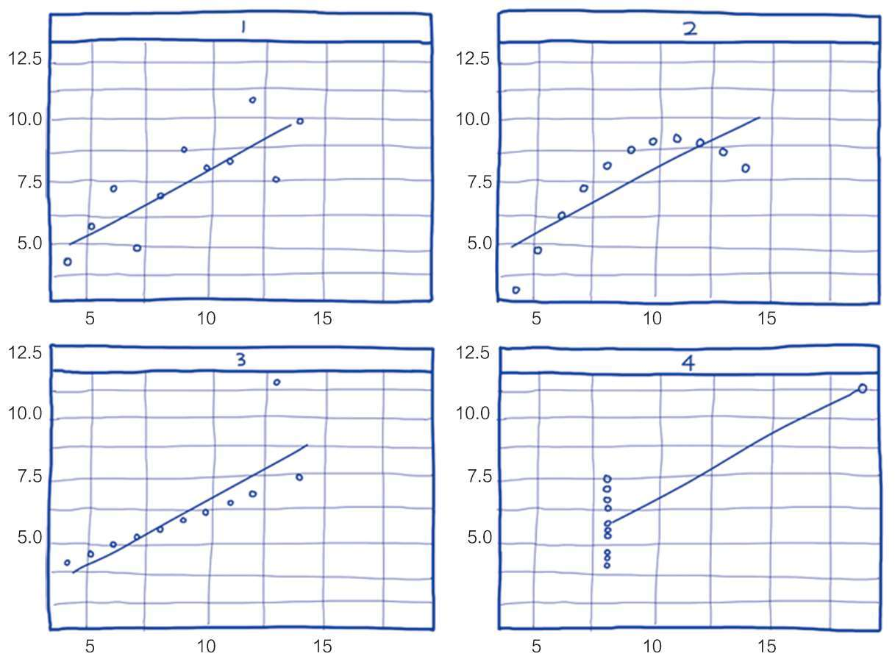

= (统计与概率) 人们在统计中会犯那些错误

.欺骗方法: 选择性挑选数据
[%collapsible%open]
====
1.没有经过验证的数字都是骗人的.  +
2.即使数字是客观的，但数字的产生、筛选和解读, 都能被人干预, 扭曲, 污染。

误导手段有 :

[.small]
[options="autowidth" cols="1a,1a"]
|===
|Header 1 |Header 2

|▶ 选择性提供数字，只选择对自己有利的数据点，误导人们推出与客观事实相反的结论。
|如, 在波动曲线中，如果有意只选择有利的数据点，就可以造出能符合任意"斜率"的上升趋势图.

|▶ 偷换概念:
|如, 某路演企业宣称 : “本公司营业收入连续三年增长20%以上，是健康且稳步增长的高科技企业。” +
这句话前半句是数字, 后半句是观点结论. 即使数字是真的, *但这个数字并不一定能推导出“健康且稳步增长”的结论。因为收入只代表当前的单一一个变量, 还有其它很多关键性变量要审查. 即要全面分析该企业的基本面情况* (犹如你是医生, 对病人做全面体检)(财务上的, 竞争战略上的, 未来威胁上的. 利用 swot, 波特五力模型, 波士顿框架等等). 战术上成功, 战略上失败的例子比比皆是.
|===

'''
====

- *统计学有一个概念: "只要定语够多，那么就一定能得出你想要的结果".*

.小数定律 Law of small numbers 是指：*人们倾向于将从大样本中得到的结论, 错误地移植到小样本中的倾向。*
[%collapsible%open]
====
比如, 人们知道掷硬币的概率是两面各50％ ，于是在连续掷出5个正面之后，就倾向于判断下一次出现反面的几率较大。*其实下一次出现反面的概率还是50%。因为每一次试验都是独立的.*  +
当样本较小的时候，试验间的数据波动性强是正常的，10个硬币出现9个正面向上是正常的。这一点已被大量的实验和证券市场上的错误预测所证实。

- 例如: 有两间医院，一间为大医院，一间为小医院，平时新生婴儿占比都为50%。*某天医院的新生婴儿中男婴占比为70%，请问更有可能是哪家医院？* +
回答：*小医院. 根据大数定律，样本多的情况下，随机变量对均值的偏离会下降，也就是说, 样本越大，男婴占比应该更接近50%. 由于小医院相较于大医院的婴儿出生数会较少，所以小数波动性更大，更有可能是小医院。*

'''
====

.函数近似误差
[%collapsible%open]
====
因为真实函数往往很复杂，实际运用中，经常使用"简化的函数"来近似"真实函数"，这就导致了误差。

'''
====

