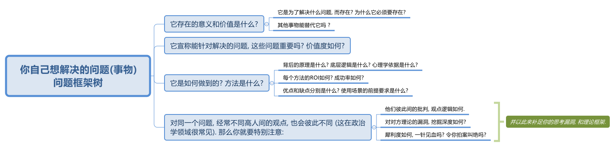

= 001 my core value
:toc: left
:toclevels: 3
:sectnums:
//:stylesheet: myAdocCss.css

'''

== ROI

==== 坑与坑是不一样的. 不是所有的失败都是成功之母.

坑与坑是不一样的. 有的坑(编程)你可以填平; 有的坑(设计)你只会陷死在里头, 并不会因你有多少决心和热情而能跨过.

不是所有的失败都是成功之母， 那些"有价值"的失败, 它们必须具备3个前提条件: +
[.small]
[options="autowidth" cols="1a,1a"]
|===
|Header 1 |Header 2

|1.必须**具有清晰的评判标准**, 而非像艺术那样玄学, "文无第一武无第二".
|可量化. +
"运营"本身不是个具有"标准化"的职业. 那你就很难总结成"课程". 因为个人理论色彩浓厚的课程, 很难普世. (这和"设计"这种工作是一样的)

|2.可重复, *可复现, 可复盘*
|投资（炒股）行为有一个特点，赚了钱常常不知道是怎么赚的，亏钱也不知道是怎么亏的，或者说**总结的那些原因, 没有可重复性。无法从成功中总结经验，也无法从失败中总结教训，这只能叫"经历", 而非"教训"。**

|3.损失是可控的
|能实施“快速失败”策略的前提, 是你对失败的亏损, 能拥有"可控性". 否则, 该策略就会变成一个黑洞: 一开始以为只是一个小小的投入，最后却变成“葫芦娃救爷爷"，全部搭进去了.
|===

'''

==== 付出了代价, 就要拿到相应回报 (贼不走空)

付出了代价, 就要拿到回报. 花了时间, 就要拿到收益 (ROI),(贼不走空). 反之, 如果不存在回报(或回报是虚拟的, 只会"转瞬即逝"), 就不要去投入.

- 思考「如何使工作对我有意义」，比死磕「我的工作有什么意义」更有意义。

- 学习中遇到的问题, 在你解决后, 必须将"解决过程中的思路, 和采坑教训"记录下来, 复盘. 即, *结果不重要, 如何想出"解决思路"的过程, 才是最有价值的! 如果没有复盘，你 90% 的功夫白费了 —— 你花了不少时间，读了不少代码，除了拿到一个结果外，并无太大的"掌握了解决问题的方式"收获。*

- 提高复盘频率: **在做事的当时，遇到各种问题，你做出过的各种失误, 就要立刻把"领悟"记录下来，**随遇随记，用最小迭代法，最高频率的提升自己。

'''

==== 做不同的事, 职业, 会带给你不同的投资回报率 ROI

- 两个骰子加起来:  +
→ 等于5点的概率, 是 1/9.  +
→ 等于2点和12点的概率最小, 是1/36.  +
→ 中间7点的概率最大, 是 1/6.  +
我们发现, *这11种情况并不是等概率的.*

- 好的, 成功概率更高的专业和职业, 就是比低的职业更能上岸！

- 男怕如错行. 越是吃人深坑的入口处，越是铺满了最迷惑人的鲜花, 来引诱你陷进去

[.my1]
.案例
====
画面设计这种工作, 是没有内涵的, 你被花花绿绿的画面吸引一天, 看过即忘, 头脑依然空空. 因为画面不像看书一样对你有思想收获 (有精神食粮感)!

设计上的画面，你看参考，比如花瓣，*每张花花绿绿的画面会吸引你一两秒中, 然后当你看下一张时, 上面那张就被你忘却, 你重新被新的一张所吸引一两秒钟. 然后一直循环这个过程. 所以你看一天时间，也不会记住任何内容. 因为画面本身是没有内涵的, 徒有漂亮的外观,* 会短暂吸引你. 广告画面就像糖精, 只有甜味(只愉悦你的眼球), 没有营养成分(不包含你的精神粮食).

画面甚至连短视频都不如, 短视频或许还有可怜的一点点信息含量的, 而广告平面画面上是完全没有任何"有价值的阅读内容"存在的, 只有广告信息! 本质上这张画面就是服务于垃圾信息的. +
所以很多4a广告会把画面故事化，就是为了让人看过后能记得点什么。而不像地产画面等都是抽象化，抽离故事，就只剩下视觉刺激，只能走眼睛，而不会走内心。（留不下任何记忆）。

*而你去看书，你看一天时间，是真的能有收获的，你能记得它里面讲的故事, 理论, 逻辑，因果，原理等。* +
 所以你看一天花瓣，就是浪费一天时间，看过即忘，而无所得。*而你看365天数学教材，你都学会了, 考研都考上了！而你看365天花瓣，你的脑袋依然空空如也！*
====

'''

==== *每一个赛场对于你是否'普通'或者'别致'的判断,都有不同的判定标准*

[.my1]
.案例
====
你小时候你手脚麻利勤快。街坊四邻看见你三五岁就开始帮你妈做家务，都觉得这不是个普通孩子。当时的你像极了内个下蛋勤快的鸡A。 +
上学以后你出落的蛮漂亮。不但仰慕者众多，历次做汇报演出你都是没有争议的舞台C位。校领导说你不是个普通孩子。当时你像极了内个毛色炫丽的鸡B。

你回忆起人生的各个阶段，你都曾经不普通过，因为每个阶段的大环境，他人都只关注到你与该环境相符的你的特质。 +
可是你后来走上社会了。你发现老板才不会关注你之前的那些人生阶段里是否有勤劳，是否有绚烂，是否有努力。他只关注肉质鲜美。你没有, 你在这就只适合当个螺丝钉。

人的一生，每个生命从生到死，都会经历若干个赛场. 每一个赛场对于你是否普通或者别致的判断，都有不同的判定标准。 +
如果你有本事，可以进入, 并在那个“可以证明你不普通”的赛场里浸淫一生，你就是成功的. 如果你没做到, 则泯然众人是每个人最终的归宿。
====

我见过一个人的简历, 上学时可谓出类拔萃, 中考在学校第一名, 拿过各种作文比赛一等, 二等奖项, 可谓人才. 但工作后, 十几年, 做的却是经营公司公众号. 我看得真是很感慨.

'''

==== 理科能润

'''

== 形象即资源

==== 你的形象举止, 只会产生两种影响：交往与回避。

- **你的形象举止, 只会产生两种影响：交往与回避。**而他人对你的隔离与封闭, 会对你的成长造成很大阻碍 -- 成长只有在具体的一件件事情中, 才能渐渐积累起来，而其他人不与你进行这些事情，你也就没有机会（机遇）来完成你的“进化”。(这也证明了公众人士"形象管理"的必需性和正确性)

- 人各方面的魅力(包括颜值)，所起的真正作用利益，不是引人喜欢，而是通过引人喜欢来带来“成长事件”的实现！吸引人不是最终目的，而是实现你进化目的的手段（诱饵、催化剂）。

- 女性应该利用自己的女性资本, 取得对自己有利的结果。 +
"露出你的大腿"（有目的的为了自身利益）和"张开你的腿"有很大的不同.

'''

== 眼不见, 就会心不想

==== 你被启发出来的思考, 价值要远远超过你看到的思想

- **看书最重要的收获,** 不是为了书上所写的内容，而**是你在看书时，被启发思考出来的你自己的观点。正是这些观点**, 才导致书上那些事情和研究的后来发生. 出发点是万物之源, 没有出发点，就不会发生之后的一切政治思想，思考，理论.

'''

== 谋事者

==== 对于真正做大事(做大家业)的人来说，难, 阻力大, 敌人多, 他就会不干了吗？ 真正的懒惰，是头脑懒惰。

- 长年累月的刷手机不但荒废了学业，更荒废了对人生的思考 (永恒的转移了对自己大事的注意力). 他们没有考虑过前途大事，他们什么都不想，也什么都没做，就稀里糊涂地几年刷手机过去了，一到毕业，才发现没了去路。  +
农村孩子的主要问题是“不想事”。能力低，学历低，还不想事，这是很多青年最糟糕的地方。“裸奔”着走出校门，却又经受不住社会的毒打，到最后败给生活，甚至放弃生命。

- 大部分生活中的困苦, 只是你长期脑懒累积下来的最终结果而已。脑懒毁全家。

'''

==== ★★ 人的一生, 你要考虑哪几种事情? -- 人(性), 事(道), 事(术)

- *人在一生中的核心认识, 归根结底只有三种: 1.对人类构成的社会的认识(人性). 2.对具体某个人的认识(观人, 识人), 3.对如何做事的认识(方法论, 及对未来走势的判断)*

'''

==== ★★★ 如果你能做到超出行业中的传统认知, 你就是开拓者了

- 在与日俱增的运营大军中，*更多人缺乏的是统观行业上下游的运营思维高度，以及跳出具体岗位外，对这个职业的想象力* (即: 这个职业的内涵, 其实也是个"筐", 它里面该包含什么内容, 它将来该怎么发展, 不是由别人定义的, 而是由你自己来定义的!)。

'''

==== 分娩通常不会跟着计划走，你自己要有所准备。(预则立, 不预则废)

- 关键是阶段式计划性。你有没有想过未来三年，你会如何度过？未来三年，有什么关键节点？这些关键节点上的变化，你都会如何应对？你有没有应对的招数？你有没有抗风险的安排？(可能发生的国家战争, 运动)

- 有plan B了，我就能安心执行plan A了。

- 从创业的第一天起，你作为创业者都要有这个心理准备，每天要思考自己未来的10年、20年要面对什么. 你现在碰到的倒霉的事情，在这几十年遇到的困难中，只会是小小的一部分。

'''

==== 你一直考虑什么, 你就会成为什么

- 想把一件事做好，就只能把这个行业里所有的事情打通。即: 要像项目负责人一样思考。我哪怕只是为了写好当时的一条段子，我也得像这个节目的制片人一样思考。*事实是, 如果你一直像制片人这么思考的话，你最后就是会变成制片人。*

'''

==== ★★★ 对任何"事物"做出你自己的判断, 都要问4个问题

1. 它存在的意义和价值是什么? 即, *它是为了解决什么问题, 而存在?* 为什么它必须要存在? *它(该理论, 该方法)的同类竞争对手有哪些? 其他事物能替代它吗 ?*

2. *它宣称能针对解决的问题, 这些问题重要吗? 价值度如何?*

3. 它是如何做到的? 方法是什么? *背后的原理是什么?* 底层逻辑是什么? 心理学依据是什么? *每个方法的ROI如何? 成功率如何? 优点和缺点分别是什么?* 使用场景的前提要求是什么?

4. 没有一个理论是完美无缺的. 对同一个问题, 经常不同高人间的观点(所站角度), 也会彼此不同 (这在政治学领域很常见). 那么你就要特别注意**他们(即竞争性理论)彼此间的批判, 观点逻辑如何. 对对方理论的漏洞, 挖掘深度如何? 犀利度如何,** 一针见血吗? 令你拍案叫绝吗? 并以此来补足你的思考漏洞, 和理论框架.

理论的思想演变历史, 能让我们知道它一路在解决的缺点.  +
不迷信任何理论, 就去查看它一路演过来的思想史. (背后的逻辑演变链条, 前因后果, 渊源发展路径). *因为每一次发展更新, 都是它试图解决自己原先的缺陷.*

'''

==== 创建你自己的一颗大树, 建立你自己的"理论架构树"!

- 各科都有自己的理论框架模型，就像一棵棵不同长相的大树. 你不可能记住世上所有的树（各种学科的各种理论框架），而且未来还会永远有新树出来. 但你一定能记住你自己, 从零创造出来的这一棵树 (自己的框架)！ 即, 你能以你的“一”，来统其他的“万“。 +
将管理学的书,找出里面的所有模型, 把前人总结出来的模型， 用MECE法则, 来重新分析拆解,组装到你自己的"理论架构树"上. +
*每个阶段的问题, 有每个阶段的思维模型(解决方法).*

- 一棵树上的叶子万万千（各种规律现象发现），我们去单独直接记忆所有的叶子是错误的. 我们要理解弄懂的, 是更少的树干，树枝(即"本源出发点"). 正是树干, 推导出了树枝, 树枝又推导出了树叶.

- 只记底层的本质逻辑. 而不要抄别人的原话.

- 要翻译成自己的话, 你才能记得住.

- 做书籍笔记, 不要啰嗦, 只要提取出解决问题的"思维模型(模块)"即可. 并且画图出模块系统.

'''

==== 如果世上还没有我关心的主题的"方法论", 我就建立自己的"方法论".

我不能因为世上还没有某方法论，我就一直在等待. 别人没做方法论的，我就自己创建自己的方法论。这样我事事才不会停下脚步，停滞不前。

'''

== 行动是唯一能令你移动人生位置的

==== 自己认为很重要(表现在头脑里), 和清晰认识到很重要(表现在行动上)，往往不是一回事。

'''

==== 不要站在原地哭，即使哭泣，也要在移动中哭泣。

- 不要站在原地哭，即使哭泣，也要在移动中哭泣。工作、吃饭、运动、休息、社交……再难过，这些该做的事情还是要做。因为秩序生活本身会帮你复原。*走着走着，你会发现，让你掉泪的事已经在你身后了。*

- 易中天: 面对一条大河，许多人都不敢过去。我却摸着石头一步步的走了过去，*当别人嘲讽我说，你看这人弄的是一身泥泞，满身臭水的时候，打不起！我已经在河对岸了！你们还在河那边！*

- 前进是一步步做出来的，那些身有多套房的人，是一套套投资买出来的！

- *力无所用, 与无力同，勇无所施, 与不勇同，计不能行, 与无计同。*---- 努力没有用到实处就跟没有努力一样，有勇却没有施展就跟没有勇一样，有计却没有施行就跟没有计一样。

'''

==== ★ 要做“难而正确的事”.

- 要做“难而正确的事”. *否则, 你有一万个理由说服自己不去做, 因为它不是你正确的路.*

- 你做某事, 自己得兴奋(有追求)。如果你自己都做得不兴奋，那成果也许还能看，但绝对不会成。

- 金钱不能使你快乐，不要认为你有钱后就一定会快乐。*如果你在致富的过程中没有感到快乐的话，就不要希望你富有之后会快乐起来。记住，不论你是穷人还是富人，首先要让自己快乐。*

- 能不曲线救国, 就不要绕着走. *如果你绕着走, 费的能量，远远超过你直接面对它耗费的能量，而且你的青春不就蹉跎了吗？*

'''

==== ★ "有意义的失败", 远比"无意义的成功"有价值

'''

==== ★★★ 能打败你敌人的不是你的说辞(你不要幻想能说服他人), 而是你永不停下的行动 (既成事实大于一切)

- 预测未来最好的方法，就是去创造它。—— 林肯

- 英雄是"正在形成的事物"的捍卫者，而不是"已经形成的事物"的捍卫者，因为他就是"正在形成的事物"。 ——约瑟夫·坎贝尔

- 战士死了的时候，苍蝇所首先发见的是他的缺点和伤痕，嘬，营营地叫，以为得意，以为比死了的战士更英雄。但是战士已经死了，不再来挥去它们。
的确的，谁也没有发见过苍蝇们的缺点和创伤。然而，有缺点的战士终竟是战士，完美的苍蝇也终竟不过是苍蝇。

'''

==== 人是不可能被说服的 (人只会被自己陷入的困境所打服). 屁股决定脑袋, 站位决定态度

'''

==== 世上没有不被攻击的人, 每个人是每个人的敌人

- *有不虞之誉，有求全之毁.*  +
虞：预料。有意料不到的赞誉，也有过分苛求的诋毁。所以毁誉不必太在意。

- *善操理者-不能有全功，善处身者-不能无过失。* +
善于处理事理, 尚且不能完全成功. 善于修身的人, 尚且不能没有过失。 +

- 百善孝为先，论心不论迹，论迹贫家无孝子；
万恶淫为首，论迹不论心，论心终古少完人。 +
真正孝顺与否, 这个主要看心，不是看表面行为，不是说锦衣玉食给父母就是孝顺，假如这样的话，那么清贫的人家就没有孝子了。  +
真正好色与否, 这个主要看行为，不是看心，假如按心念论，世人都免不了面对美色动心，这样的话，世上就没有一个完美无缺的人了。

- 一人难称百人心
- 人上一百，形形色色shai。 人上一万，无边无沿.
- 一路玩意 惊动一路主顾, 一路宴席 款待一路宾朋。

'''

==== 星星之火，可以燎原.

- 星星之火，可以燎原. 一个小想法只要你天天想着，就会越来越变成动力做它，然后跨出第一步, 就会跨第二步，越行越专业！ +
但前提条件是，你要心里要永远惦记着（荆轲刺秦里面，秦始皇说，“朕一刻也不敢忘 历代先君一统天下的大愿!”）。否则，你的注意力就会被拉离这一点上. 比如你心里如果想着别的非上岸的东西（比如视频编辑学习之类），就会把你的注意力拉离上岸。没有燃烧你的星星之火, 没有实际去行动, 你永远停留在原地, 所以你永远缺乏入职条件。

'''

==== 机会是留给有准备的人的

- 机会是留给有准备的人的，即，只要你平时每天做好了准备，就随时都有"走人"和"上位"的机会.  +
→ 你平时每天都在学习锻炼数学英语，就能随时去考研； +
→ 你平时每天都在针对性, 有意识的锻炼"考公"必需的能力，如演讲, 和待人接物，你就能随时去考公。

'''

== 过程和结果, 手段和目的, 战略和战术, 政治

==== ★★ 各个"点"必须能够串联起来, 形成累加势能.

- 所谓战略, 就是在你的大方向下, 各个"点"必须能够串联起来, 形成累加势能。 如果你在各种方向上布满了各种产品，*彼此却不能借力, 以至于每个单点都只能单独去与对手竞争, 你就会非常吃力.* (这和人生是一样的, 你在人生中所做的任何事情, 必须对你的最终目标有累加推动效果. 即, 不要去积累你不想积累的, 对你"上岸"没有用的经验!)

'''

==== ★ 战术的目标，就是赢。而战略的目的，是我推动当前的均衡向下一个均衡点转化，并使自己在下一个均衡点中，那个优势稍微大一点点。

- 毛泽东有句话 ： “谁是我们的朋友，谁是我们的敌人， 这是革命的首要问题 。朋友搞得多多的，把敌人搞得少少的， 革命就赢了。” 这是一种典型的战术思维。

- 梅特涅讲过一句名言，他说， *我控制欧洲局势的心法其实就是一条，就是确保所有国家之间的矛盾， 要大于他们和奥地利之间的矛盾。* +
就是敌人和朋友搞清楚有那么重要吗？ 大家都有矛盾，但是这个矛盾都有化解的可能，只要**我确保你们之间的矛盾，大于你们和我之间的矛盾，你们就会永远争取我的支持，** 所以我奥地利虽然国力不强，但是我就是控制欧洲的局势。这就叫战略思维。

- 中国人经营南海，主张”搁置争议，共同开发”。原来的均衡是， 我要在主权这个矛盾下, 和菲律宾这样的国家去谈什么国际法、海洋法，没准儿还把美国招进这个格局来，这个谈法我是吃亏的。 +
所以我搁置它，**我推动这个均衡往下一个均衡去转化，**转化矛盾到什么？——我们共同开发。 开发远洋海岛这个东西你以为容易啊，**这是比拼国力，所以就能导致我的优势扩大。矛盾就转化到对我有利的那个主场上来了。**你美国人总不能来共同开发吧，你根本不是南海的周边国家。

'''

== 学习

==== 不要把"方法"当做"目的"本身!

你要以这个目的来做: “我要写比以前更好的段子”, “不知道能不能行，但是我试试”。 我不会在乎这一场和那一场的观众的不一样. 我只会想今天哪里有问题，是不是可以更好。 +

你必须思考这个问题，我们上台演出的目的是什么？是为了伺候好哪一场，哪一天的观众吗？ 我们当然要为演出效果负责，但你上台的出发点不该是这个， 你的目的始终是 — 成为更强的脱口秀演员。  +
即, 最终目的是: 通过逗笑观众来磨砺自己，而不是逗笑观众。 "逗笑"只是你利用的工具而已. **不停演出的目的，是为了磨练自己，而不是为了炸场。**炸场只是副产品，名利也是副产品。

**人是目的，不是手段。**这不只是一种道德要求，也是很理性的结论。**如果你的表演是为了让观众笑的话，你就成了手段，你变成了工具。**拿自己当手段，你顶多掌握二流手段。拿自己当最终目的，你才有机会掌握一流手段。 你是你自己的目的。 +
*同样, 我也不会关心这家公司的死活. 人最终是要成就你自己这个人的。你不能把自己的命运和某个公司绑在一起。做大事的人，一定是要把自己和自己的伟大事业绑在一起去做的。*

- *你学习并使用各种思维模型, 来分析解决工作, 商业等问题, 也并不只是为了该问题本身, 而是为了借助它们来训练你的大脑思维方式!* +
*把案例研究当哑铃, 你的目的不是哑铃, 而是锻炼你肌肉* (大脑思维认知, 及建立你自己"方法论大树"的食材)

- 我是在学JavaScript吗？不, 我在学的是"函数式编程"的思想逻辑，单独为了学一门编程语言对我没用, 但编程思想却是相通的"底层逻辑思考方式".
- 你学的是背后的做菜方法，而不是去记那些做出来的菜本身！
- 你学的不是那几首歌, 而是发声技巧

'''

==== 实践是检验真理的唯一标准

