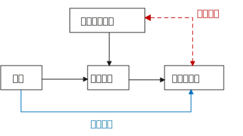
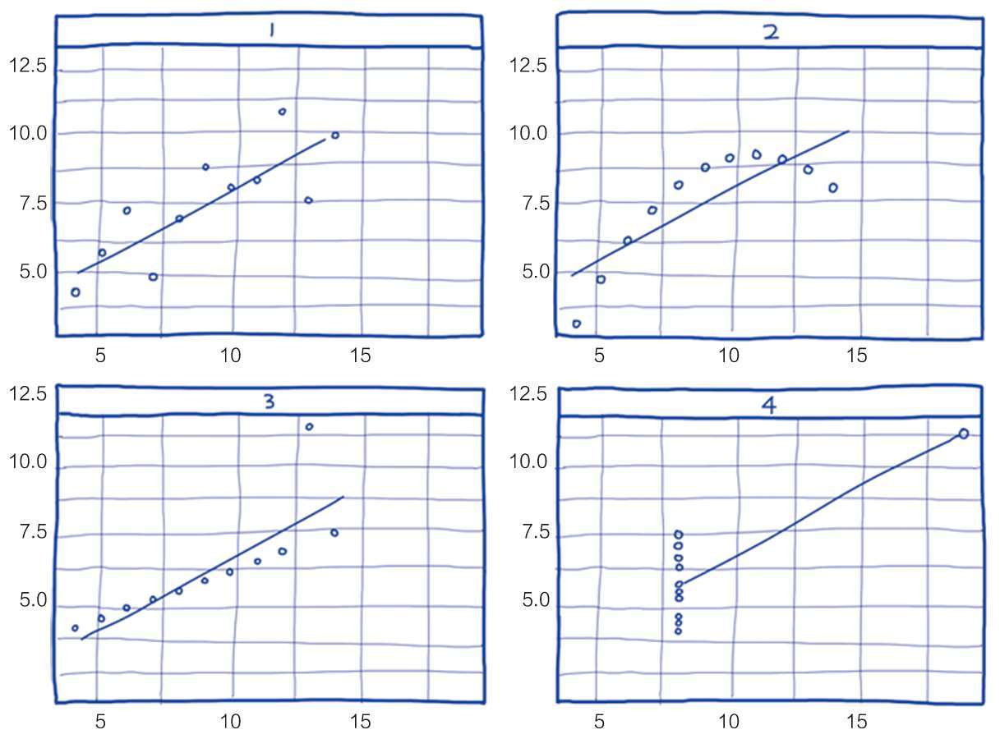

=  True and false 概念, 臆想, 与现实. 真与假. 分析与批判性思维
:toc: left
:toclevels: 3
:sectnums:
//:stylesheet: myAdocCss.css

'''

== #概念#(马甲)是个框, 什么都能往里装

==== 概念没有唯一的定义, 而是人赋予的

对任何一个概念, 世上没有绝对唯的一定义, 定义内容是人赋予的, 每个人都有自己的定义.

- 你要对它下一个明确的自己的定义 (而不是照搬别人的的定义. 因为别人的定义中打包的内核, 是别人想以的东西, 不一定是符合你所想要的). 别人的人生目标不是你的人生目标. 别人的 KPI 也不是你的 KPI,  如何找到你自己的正确的 KPI? 你要用你自己的指标(而非别人的), 你自己的营销目标的数据, 来进行解构分析.

- 对同一概念的多种定义, 即是一种更好的观察细微差别的方法. ( 不同的人为什么对同一概念会赋予不同的定义? 因为他们各自有想要"突出强调"的方面.)

'''

==== 给旧概念披一件马甲, 我就不认识你了?

.知识付费中诈骗的一种方式, 就是把很普通的"概念"包装成一种"新定理”. 如, 把"多元化经营"包装成"第二曲线"的概念.

'''

== --------- ---------

'''

== 语言即##思想方式##

==== *语言常常是困住思想的牢笼，改变语言的表达, 本身就会带来一种新的思考方式。*

'''

== 现代##科学##

==== 现代科学, 与先前的知识体系, 有三大不同之处:

1. 愿意承认自己的无知。**现代科学的基础就是拉丁文前缀“ignoramus-”，意为“我们不知道”。**我们承认了自己并非无所不知。 更重要的是，我们也愿意在知识进展之后，承认过去相信的可能是错的。*于是，再也没有什么概念、想法或理论是神圣不可挑战的。*
2. 以观察和数学为中心。现代科学如何获得新知? 通过收集各种观察值，再用数学, 逻辑，形成理论。
3. 取得新能力。光是创造理论，对现代科学来说还不够。它希望能够运用这些理论来取得新的能力，特别是发展出新的科技。

对于像是伊斯兰教、基督教、佛教、儒教这些前现代知识体系来说，它们假设世上所有重要的事情都已经为人（某些过去的智者）或为神所知。通过经典或口传，将这些智慧传给后人。而对于平民百姓而言，重点就是要钻研这些古籍和传统。 在当时，如果说《圣经》、《古兰经》或《吠陀经》居然漏了某些宇宙的重大秘密，而这个秘密又居然能被一般血肉之躯的人给发现，这简直是不可思议的事。

- *科学研究并不承认权威，而只承认可重复的、能被独立验证的证据。所有所谓的"信仰"(其实就是理论幻想, 猜想. 世上没有神!) 都必须能够接受质疑。* 所以科学不是另一种宗教. *宗教会维护权威; 而科学是喜欢自我革命, 打倒权威.*
- 在著名学术期刊上发表论文, 不等于成果就已经获得了承认，是不是真实可靠的, 还要看能否被别人重复出来。

'''

==== 相关关系 ≠ 因果关系

统计学教科书里教的第一件事就是: "相关关系"不是"因果关系"! +
*相关关系: 是指一个变量(var 1)变化的同时，另一个变量(var 2)也会随之发生变化，但不能确定var 1 变化是不是 var 2 变化的原因。*

- "大数据分析"可以在完全不考虑"因果关系"的情况下，通过数据点的"相关性"和其他规律，精准地给出对下一个购买行为的预测分析。商家不必纠结“因果”，仅用"相关关系", 就可预测大部分市场营销的需求。 (就好像你不需要知道量子物理学的具体原理，只需要知道它是有效的, 就能直接使用它.)

[.my1]
.案例
====
美国零售大户Target, 曾经利用消费者购买数据, 判断女性消费者的怀孕状态，并通过推送婴儿用品广告等方式, 进行精准市场营销。— 如果发现女性消费者突然改变自己的消费习惯, 并开始新的消费行为，如购买无香的身体乳液，购买一系列如钙、镁和碘等维生素，购买育儿图书或杂志，或者注册了孩子的礼物名单等，商家内部客户管理系统（CRM）就会提升所谓“怀孕预测指数”。一旦指数达到设定标准，公司就会为此类消费者打上标签，并向这类消费者按不同孕期阶段, 进行促销，一次推送多达20多种孕期产品的介绍或样品。
====

- 虽然"相关关系" 给我们提供了很多增加收益的方法。但成也萧何败萧何 : *"相关关系"也是相对不稳定的, 易变的. (因为你还是不知道背后真正起作用的变量(即真正的因果关系)是哪个)*

'''

==== 真正的"因果关系" 该如何验证?

最简单的"因果关系"验证实验, 需要以下4种可能性矩阵来收集数据:

[.small]
[options="autowidth" cols="1a,1a,1a"]
|===
|Header 1 |待证实的”结果”, 出现|待证实的”结果”, 未出现

|待证实的”原因”, 出现
|a 数量
|b 数量

|待证实的”原因”,未出现
|c 数量
|d 数量
|===

即: 只有在严格控制其他因素，去掉混淆变量，并在我们得到这四种数据下: +
原因出现，结果出现（a个案例）； +
原因出现，结果未出现（b个案例）； +
原因未出现，结果出现（c个案例）； +
原因未出现，结果未出现（d个案例）。

我们才能用以下的数学公式, 来验证"因果关系"是否真的成立: +
latexmath:[ \varDelta P =\dfrac{a}{a+b} - \dfrac{c}{c+d} ]

即: +
→ 如果ΔP的值是零，则完全无相关性； +
→ 如果ΔP的值是正数，则值越大（总实验次数为上限），因果关系越强； +
→ 如果ΔP的值是负值，则说明, 此"原因"有"抑制结果产生"的功效。

[.my1]
.案例
====
假设我们做了200次实验，其中100次有原因出现，这时有80次出现了期待的结果，20次没有出现。另外100次实验没有这种原因出现，有80次出现了期待的结果，20次没有出现。

现在套用公式： +
latexmath:[\varDelta P =\dfrac{a}{a+b} - \dfrac{c}{c+d} = \dfrac{80}{80+20} - \dfrac{80}{80+20} =0 ]

在200个实验基数上，ΔP=0, 说明这两个变量(待验证的原因, 和待验证的结果)之间, 并无真正的因果关系。
====

'''

==== 循环论证（Petitio Principii 或Begging the Question）

循环论证, 就是用问题的假设前提, 来回答问题本身，而没有给出真正的原因。

[.my1]
.案例
====

如 : 为什么超人能飞起来？因为他是超人啊！为什么他是超人呢？因为他能飞啊.  ← 论据只不过是在重复之前所做的假设，而完全没有提供支持的论点。
====

'''

== --------- ---------

'''

== ##统计学##中的陷阱与造假

==== 手段: 选择性挑选数据

1.没有经过验证的数字都是骗人的.  +
2.即使数字是客观的，但数字的产生、筛选和解读, 都能被人干预, 扭曲, 污染。

误导手段有 :

[.small]
[options="autowidth" cols="1a,1a"]
|===
|Header 1 |Header 2

|▶ 选择性提供数字，只选择对自己有利的数据点，误导人们推出与客观事实相反的结论。
|如, 在波动曲线中，如果有意只选择有利的数据点，就可以造出能符合任意"斜率"的上升趋势图.

|▶ 偷换概念:
|如, 某路演企业宣称 : “本公司营业收入连续三年增长20%以上，是健康且稳步增长的高科技企业。” +
这句话前半句是数字, 后半句是观点结论. 即使数字是真的, *但这个数字并不一定能推导出“健康且稳步增长”的结论。因为收入只代表当前的单一一个变量, 还有其它很多关键性变量要审查. 即要全面分析该企业的基本面情况* (犹如你是医生, 对病人做全面体检)(财务上的, 竞争战略上的, 未来威胁上的. 利用 swot, 波特五力模型, 波士顿框架等等). 战术上成功, 战略上失败的例子比比皆是.
|===

'''

== --------- ---------

'''

== 人们的##思想误区 (思维陷阱)##

==== 小数定律 Law of small numbers

小数定律 Law of small numbers 是指：*人们倾向于将从大样本中得到的结论, 错误地移植到小样本中的倾向。*

比如, 人们知道掷硬币的概率是两面各50％ ，于是在连续掷出5个正面之后，就倾向于判断下一次出现反面的几率较大。*其实下一次出现反面的概率还是50%。因为每一次试验都是独立的.*  +
当样本较小的时候，试验间的数据波动性强是正常的，10个硬币出现9个正面向上是正常的。这一点已被大量的实验和证券市场上的错误预测所证实。

[.my1]
.案例
====
例如: 有两间医院，一间为大医院，一间为小医院，平时新生婴儿占比都为50%。*某天医院的新生婴儿中男婴占比为70%，请问更有可能是哪家医院？* +
回答：*小医院. 根据大数定律，样本多的情况下，随机变量对均值的偏离会下降，也就是说, 样本越大，男婴占比应该更接近50%. 由于小医院相较于大医院的婴儿出生数会较少，所以小数波动性更大，更有可能是小医院。*
====

'''

