= 辩论
:toc: left
:toclevels: 3
:sectnums:
:stylesheet: myAdocCss.css

'''

== 辩论中的基本概念

.推定 presumption
[%collapsible%close]
====
推定（presumption）：是辩论开始前，我们在某项争议问题上的既定立场。如果此一立场没有被足够的证据与理由给驳倒，我们就会维持对此一立场的支持.

*注意: 推定某事实对的，与它是否真的是对的，并没有必然关系，我们之所以支持它，是因为迄今没有证据让我们不支持它。* (即, 我们认为外星人不存在, 与它是否真的不存在, 没有关系. 我们现在相信该观点, 是因为至今没有发现反例存在.)

对于未知的事物: +
→ 如果我们预先认定它不存在，要推翻这个认定，只要等以后发现了它就行了。 +
→ 但是，如果我们预先认定它存在，要推翻这个认定，却需要彻底查找所有的地方才行，这往往是不切实际的。

所以，在实际上（特别是在科学研究中），在没有确凿的证据表明某个事物存在以前，我们都是认定它不存在的。

“推定”的观念, 被纳入了许多制度化的真实辩论中: +
- 法庭辩论中有所谓“无罪推定”，意思是任何人都是无罪的，直到有人先证明其有罪； +
- 议事及竞选辩论则有所谓“现状推定”，在新政策或新人选证明其优于现状前，我们能可保持不变。

'''
====

.举证责任 burden of proof
[%collapsible%close]
====
举证责任（burden of proof）: 就是挑战“推定”的一方，所必须担负的证明责任。 +
既然“推定”在被成功挑战前，将继续维持现状，那么确认了“推定”，也就等于确认了要由谁来发动挑战。所谓的“举证责任”（burden of proof）指的就是挑战“推定”的一方，所必须担负的证明责任。

做到什么程度, 算满足推翻了“推定”呢？ — 至少反对“推定”的理由, 要胜过原本支持推定的理由。*如果举证完毕后仍是五五开，那么多数人仍会选维持推定（因为改变是要付出额外风险的）。* 挑战推定的一方要达成六四开，或至少是51对49，才能赢得这场“反推定战争”。

'''
====

.辩题可分为三大类：事实, 价值, 政策。
[%collapsible%close]
====

[.small]
[options="autowidth" cols="1a,1a"]
|===
|Header 1 |Header 2

|1.事实辩题（resolution of fact）: 探讨某种现象，是否存在或发生。
|如: +
- 温饱是/不是谈道德的必要条件? +
- 艾滋病是/不是医学问题，不是社会问题? +
- 真理越/不会越辩越明?

|2.价值辩题（resolution of value）: 探讨某种主观评价, 赞成还是不赞成. 或为两种认识，排定优劣或重要顺序。
|如: +
储蓄（事项/主词）是良好习惯（判断/正面评价） +
后冷战时期，美国以军事介入支持民主国家的做法，是适当的 +
经济（事项/主词）重于（判断/大于）环保（事项/受词）

当评价或比较的对象， 是某种行动或政策时，“价值辩题”将与“政策辩题”相当类似.

|3.政策辩题（resolution of policy）（即“行动辩题”resolution of action）： 探讨某个个人或团体，是否应该采取某种行动。
|如 : +
你应该念医学院 +
我国应继续兴建核能电厂

不过, 政策辩题也有两个缺点 :

1. 政策辩论涉及许多细节问题，需要大量的资料作证，往往造成参加者的沉重负担。
2. 政策辩题涉及政策主事者（政府）及特定政策法令系统，较不适合跨国性辩论大赛使用.

|*"事实"、"价值"及"政策"辩题间，存在着一种层级关系 ——1. 做出何种"政策", 需由"价值判断"来做支撑; 2. 而该"价值判断"从何产生，就由"事实依据"来证明.*
|

例如, 要证明“我国应全面禁烟”(政策)，支持者必须先证明“吸烟大幅度提高肺癌发生率”（事实辩题），再据以主张“吸烟是不良嗜好”（价值辩题），才能主张“我国应全面禁烟”（政策辩题）。

|===
'''
====

.民主制度中的辩论, 可分三类: 1.司法辩论, 2.议事辩论, 3.竞选辩论
[%collapsible%close]
====
民主制度中的辩论, 一般可分为三类：①司法辩论（judicial debates）、②议事辩论（parliamentary debates），以及③竞选辩论（campaign debates）。刚好对应于民主制度的三大部门(三权分立)——司法、立法, 行政。

[.small]
[options="autowidth" cols="1a,1a,1a"]
|===
|Header 1 |Header 2 |中立的裁决者

|议事辩论
|→ 立法
|保持中立的议员，或会场外的舆论。

|司法辩论
|→ 司法
|通常由一位法官、多位法官，或是陪审团来担任。

|竞选辩论
|→ 行政
|选民手中的一票
|===

这三类辩论的输赢, 都不是由辩论双方自己作出的, 而是由"第三方"来裁决的. 也就是说，无论是哪一种“正式辩论”，正反双方及其辩论的过程所扮演的，只是工具，目的在让"第三方裁决者"做出更好的裁决。

政治中 “正式辩论”的一项特色是，参加辩论的各方人马，通常不会以说服对方为目标。因为**他们知道，在制度设计上，对方是“不能也不会”被他们说服的** (人是不可能被说服的, 只能被社会打服)，他们要说服的是“中立的第三方”——观看仪式辩论的公众、欣赏竞选辩论的选民，以及聆听法庭辩词的法官或陪审团。

**而在生活中的“人际辩论”中，**辩论者中的一方往往也自认为是辩论胜负的裁决者，*“球员兼裁判”的情况很常见。*

'''
====

== 辩论带给人的益处

.锻炼人的“批判性思考能力"
[%collapsible%close]
====
多数辩题都是正反皆言之成理的, 目的就是为了达成训练“批判思考". 为了竞赛的公平性，多数辩题都是正反皆言之成理的。正因为辩论可以培养这两项基本态度，因此对达成训练“批判思考”（critical thinking）很有帮助。

- 能培养辩手“换位思考”（decentering）的态度，即: 即使不同意对方的立场，也要体验从对方的角度观察问题。
- 能培养辩手“延迟判断”（suspend judgment）的态度，即: 深入思考问题，再作出“明智”（informed）判断，不要遽下结论。

'''
====

.能令人获得六项重要能力
[%collapsible%close]
====
训练辩论, 可以得到六项重要能力：①提升民主参与的能力、②孕育社会的领导精英、③培养求知的能力与兴趣、④接触与整合多元知识、⑤提升批判思考的能力，⑥提升口语传播能力等。

[.small]
[options="autowidth" cols="1a,1a"]
|===
|Header 1 |Header 2

|1.接触与整合多元知识
|- 与通识课程比较起来，竞赛辩论是学生接触与整合多元知识的更佳途径。 +
台湾竞赛辩论的常见辩题，范围就广及法学、政治学、教育学、社会学、经济学、心理学与自然科学（例如核能辩论）。更重要的是，对多数辩题而言，单一领域的知识是不够的。辩论选手们必须将相关学科的知识整合起来，才能构筑出强而有力的论点，这等于是一种科技整合的训练。 +
+
以“安乐死应合法化”的辩论为例，虽然表面上这是一个“法律”题目，但一位法律系学生将很难只靠自己的本行应战。要想在竞赛辩论中取胜，除了法学以外，他可能还必须接触医学、社会学、心理学、哲学，甚至神学的知识， 并且将这些知识整合在一起。试问，有哪种通识课程可以达成这样的效果呢？

- 辩论选手们需要充分的证据与资料为后盾。在密集的准备过程中，许多辩论选手因此学会了搜集、分析与整理资料的技巧。

|2.提升批判思考的能力
|- 批判思考能力可以分为两大类： +
1.*判定"论证的性质"* : 判定证据的类型、*评估"论证的品质"*、判断**"证据与论点间, 是否有关联"**等 +
2.提出论证 : 选择有力证据, 来为个人立场辩护; 为问题拟出最佳解决方案; 预期对方的反对论证，提出高品质论证的能力等。

- 中国传统中, 不善于批判性思考. 古人怎么说，他便怎么信。造成这种习惯的原因主要有： +
→ 中国不讲究辩论术。 +
→ 事事主张退让, 和谐，因而真理泯没，是非颠倒.

|3.提升口语表达能力, 能建立参加者的勇气.
|
|===

根据辩论学者基利与特龙（Keele & Matlon，1984）对美国全国辩论锦标赛理念选手所进行的调查，发现其中有高达九成的人，后来至少获得硕士学位。

'''
====

== 辩论的实战方法论

.权力在他方(即第三方), 而非在对方
[%collapsible%close]
====
辩论是一种“权力在他方(而非对方)”的话语体系。辩论, 本质目的不是为了说服对方, 而是为了拉拢第三方听众的数量, 扩大自己的_盟友_. → 即, 将”中立者”转化为”支持者”; 将”反对者”转化为”中立者”.

即表面上看彼此都盯着对手，其实心里是在想着怎样得到旁观者的认同。**对手其实并不重要， 他们只是我们向第三方证明自己更优秀的一个工具。**辩论其实是辩给第三方(陪审团)听. **辩论是针对第三方的，那些游移不定、看哪边都觉得有道理的观众，才是我们真正要争取的对象。这是辩论的基本策略，**也是辩论者要"讲究风度"的根本原因。

'''
====

.能获得观众"共情"者, 为最终赢家
[%collapsible%close]
====
辩论总会遇到论点出尽的时候，*能讲的都讲了，利弊都摆在这里并且反复质询过了，可形势仍然不明朗。这个时候，观众看的是什么呢？看谁更能打动(共情)自己。*

演讲要先和自己的支持者, 建立语言和情绪上的默联结。 而那些表情漠不关心的人，既有可能是"中立者"，也有可能是"反对者". 你的策略就是: +
→ 要将"中立者"转化为"支持者"， +
→ 并将那些不那么坚定的"反对者"转化为"中立者"。 +
→ 那些主动打断我们，提出刁钻问题的人，则是活跃的反对者。我们的策略是良好的应对挑战, 来强化"支持者"的关注，并转化部分"中立者"加入"支持者"的行列。

'''
====

