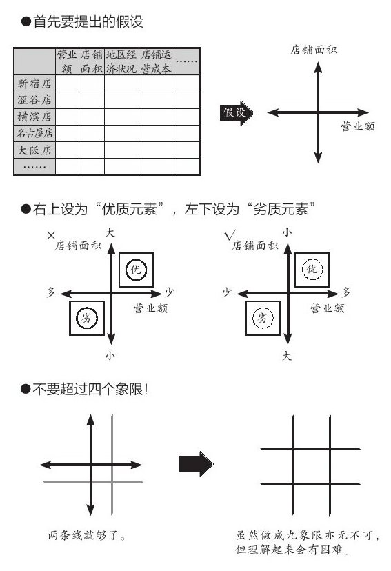

= 结构化思考思维
:toc: left
:toclevels: 3
:sectnums:
//:stylesheet: myAdocCss.css

'''

== '如何分析问题'的方法论

例如, 问题: "最近公司业绩一直在下滑，你下一步打算怎么办？”

[.small]
[options="autowidth" cols="1a,1a"]
|===
|Header 1 |Header 2

|第1步, *先对'关键词概念', 做定义的明确化. 即量化它, 来得到"定性"认识.*
|本例中的关键词就是"业绩下滑". **只说"业绩下滑"是个很模糊的概念. 你要先对它给出具体定义: 怎么算下滑？目标业绩是多少？现在业绩是多少？下滑的比例是多少？**过去几个月具体是什么情况？  +
差距 = 期望的目标值 - 现状值.

是原来做100万，现在变成30万？   +
还是原来做100万，现在下降到80万？  +
**这两种下降幅度, 显然是不同性质的问题。**一个是"断崖式下跌"性质，一个只是"业绩波动"性质. *问题性质不同, 解决方案当然也就截然不同。*

所以, 别急于给药方. 病重程度都没查清楚呢, 就开药. 不是所有的疼, 都是感冒, 或都是癌症. (类似"离开剂量谈毒性, 都是耍流氓"这句话)

|第2步: *对"性质严重与否"的判断, 达成共识.*
|*相同的数字, 在每个人眼里, 可能性质判断不同.* 比如, 20%的下跌，在他的眼里也许算正常波动，在你看来可能就认为比较严重。所以你们两个对同一个现象的性质判断, 没有共识.
|===

'''

==== "描述现状"的时候，应区分"事实"与"观点".

"今天好冷啊！" 是事实，还是观点？ -- 这句话是观点. "现在气温=0℃"，这个才是事实.

'''

==== 对于"目标"的设立, 里遵循SMART原则

[.small]
[options="autowidth" cols="1a,1a"]
|===
|Header 1 |Header 2

|S：Specific，明确的，具体的, 而非定义含混的
|

|M：Measurable，可衡量的. 可量化的.
|比如, *目标是"让客户满意". 怎样才算是"满意"? 必须有数据维度(考核指标)来衡量,* 比如总分在9.5分以上才算.

|A：Achievable，（自力）可达到的
|你选择哪个来作为你的目标, *它一定得是你能自己控制的事物. 如果这个目标的达成, 很大程度上不受你的控制, 那就不能把它作为目标.* +
(遗憾的是, 设计师的作品能否达到目标, 是不可控制的, 你本身无法控制最终效果, 最终能否通过也是客户控制的, 而不是你控制的.) +

我们做战略、做计划的时候, *就是要在众多变量当中, 找出相对不变的因素出来，根据这些不变的因素去设计战略.* 虽然“计划不如变化快”, 但跨国公司并没有因为中国市场变化快，就不做中国战略与计划了。

|R：Rewarding，完成后有满足感的
|太近、太容易的目标，即便完成，你也不会有愉悦感和满足感，那么这就不是一个好目标，会让你在过程中失去对它的渴求，也就没有了动力。 (设计这个工作是不会带给你满足感的, 太难的任务只会令你放弃)

|T：Time-bound，有时间限制的
|一定得有时间限制，不然任何目标都没有意义。 +
*不同的时间限制，会导致你思考的方式、制定的计划完全不同。*
|===

'''

==== 注意区分"目标"和"手段". -> 我们是使用方法A, 来达成目标B，而不要把A(方法)本身当成目标!

[.small]
[options="autowidth" cols="1a,1a"]
|===
|Header 1 |Header 2

|*目标不对，什么都不对！ 战略的失败, 无法通过战术的成功来弥补.*
|

|"方法"不是"目的"本身! 不要反客为主
|- 你读书的目的是什么? 不是为了读书而读书. 别忘了你是为了解决你遇到的问题的! -- 读书是手段，而不是你的目的本身。读书不是目的, 从书中获得解决方法才是目的!
- 谈判中, 双方的"讨价还价"到何种程度, 只是手段, 背后的"目的"是要达到彼此更高利润(双赢)。
- 在你项目的关键节点时, 有一个重要人提出离职. 你现在要解决的真正问题, 不是如何挽留他(这只是手段), 而是如何保障住项目的进度(这才是真正目的).
|===

'''

==== "实践"是检验"真理"(你采用的这个方法是否"真的有效")的唯一标准

你不能老是停留在"方法论"的学习上, 要下泳池直接游泳! 要去实践它们, 检验它们的对错真理性!

'''

==== 你的计划, 若实现不了你的目标, 原因可能出在解决过程的任何一个环节中

即:

[.small]
[options="autowidth" cols="1a,1a"]
|===
|Header 1 |Header 2

|1.实现的方法手段, 本身有错误.
|*重复原有的方法，只能得到同样的结果.* 想要有不同的结果，就需要用不同的方法。

|2.目标期望值, 设置不当.
|

|3.过程中出现的各种新的变量影响 (计划不如变化快).
|
|===

'''

==== 如何找到原因? : 发现了某个问题 → 就去找背后的相关的数据 → 寻找"导致数据变化"背后的原因.

**"寻找问题"的一个基本思考框架(思考模型):**
[.small]
[options="autowidth" cols="1a,1a"]
|===
|Header 1 |Header 2

|第一步思考: *任何一个"现象"背后一定有"数据", 任何一个"现象"背后一定有"数据"*
|当你发现某个现象后，你要赶紧去找相关的数据，然后**用数据来说明问题，这可以让你对事情从"感性认知"变成"理性分析"**  +
(用数据说话, *用数据来衡量问题的严重程度, 即得到"定性"(定量分析).* 正如医生用化验数据来衡量你的疾病程度)。

|第二步思考: *任何数据的变动，背后一定有"道理原因"。*
|
|===

[.my1]
.案例
====
**面对一个客观问题，要避免使用“我感觉”这样的表述方式，**比如：我感觉最近用户的投诉多了。这样的反馈没有任何意义，*这只是你的"观点"，不是"事实". 你要用数据来说明* -- 比如：

→ 上个月我们的销量是1000单，共接到2个投诉电话，投诉率为2‰； +
→ 这个月我们卖了3000单，却接到了20次投诉电话，投诉率为6.7‰，比上个月足足提高了3倍多，这个问题需要引起我们的重视。

**这个数据够不够呢？不够，你要继续挖掘更细的能"定性(性质)"的数据，**比如：这20个投诉电话，分别投诉了哪些内容？ 然后你发现，其中有19个投诉了产品质量问题，有1个投诉了物流问题。  +
你还可以继续不断地追问下去(进行多次回溯, 连续追问n个为什么. 因果链回溯法)，比如具体是哪些部位的质量问题？占比各是多少？这些产品分别是什么时间生产的？等等。
====

总之，把现象背后的数据分解的越细，看到的问题就会越精准。 +
有了明确的数据 (军事情报)，我们才能寻找"导致数据变化"背后的原因道理是什么 (分析敌人采用的战略与战术)。

'''

== 麦肯锡五步法 → 用来解决"战略"问题

常见的企业战略问题, 有: 企业发展战略、新产品战略、拓展战略, 和市场进入战略等. 每一个问题都会被麦肯锡视为一个战略项目.

麦肯锡五步法, 从"项目管理"的角度，串起战略项目解决, 从开始到交付的5个关键步骤：定义问题 -> 结构化分析 -> 提出假设 -> 验证假设 -> 交付.

该五步法, 你不会因缺乏相关的专业知识和经验而纠结，而是**直接从问题本身（“上”）着手: ① 用“切”的方法, 来分解问题. ② 并用严谨的逻辑, 全面地提出假设，③ 而后或通过对数据的采集与分析, 来证实假设，或证伪, 推翻已有假设, 并建立新的假设（“下”），如此循环, 而深入地验证假设。 ④ 不断探究深“挖”问题核心，以获取问题的最终解决方案。**

'''

==== ① 定义问题

*要掌握"为什么该问题必须要解决"的本质原因.* 背后的真实动因. 要一层层往前追溯. 而不要相信他人给出的表面(表层)借口.

.要解决的问题, 定义不要太宽泛, 必须符合 smart 原则 (SMART Goals). +

[.small]
[options="autowidth" cols="1a,1a"]
|===
|Header 1 |Header 2

|S = Specific 具体而不空泛
|Be as clear and specific as possible with what you want to achieve. *The more narrow your goal, the more you’ll understand the steps necessary to achieve it.* +
**必须明确问题的边界。因为在解决问题的过程中, 稍不留意，问题的范围就会悄然变化，也就是“范围蔓延”（Scope Creep）。问题或项目范围的经常变化, 会导致团队缺乏聚焦，**也会造成解决问题的周期超长，*资源管理失控。*

[.my1]
.案例
====
糟糕的例子如: "令华为手机的销量遥遥领先" , 什么叫"遥遥领先"? 这个就太模糊了. +
要按 SMART原则 改成: 在未来3年内(Time-bound 有时间限制), 实现以下3个目标(Measurable 可衡量):

- 季度销量变量 -> 连续2个季度(Time-bound), 在中国地区, 手机销量排名行业第一(Measurable) +
- 年利润变量 -> 最后一年, 全年利润, 比竞争对手A, 同期高 20% (Measurable) +
- 客户满意度变量 -> 权威第三方机构调研的客户满意度, 在国产品牌中, 位居行业第一. (Measurable)
====

|M = Measurable 可以被数据衡量的
|*What evidence will prove you’re making progress toward your goal?* +
*要对什么才算"成功解决问题"的验证标准, 有定义。验证的标准, 可以是财务上的指标，* 比如三年内收入增长100%；**也可以是非财务的，比如品牌市场影响力**一年内达到品类前三。

|A = Achievable 能落地, 可以被你实现的, 而非人力不可控的
|Setting goals *you can reasonably accomplish* within a certain timeframe. +

|R = Relevant 与你最终想实现的核心目的, 具有直接相关性.
|When setting goals for yourself, *consider whether or not they are relevant. Each of your goals should align (v.) with your values and larger, long-term goals. If a goal doesn’t contribute toward your broader objectives, you might rethink it.* Ask yourself *why the goal is important to you, how achieving it will help you and how it will contribute toward your long-term goals.* +
如何衡量是否“定义了正确的问题”？最直接的衡量标准就是，当这个正确的问题被解决后，相关的所有问题也会得到完全解决, 而没有后遗症。

|T = Time-based 有时限
|What is your goal time-frame? *An end-date can help provide motivation and help you prioritize* (v.)优先处理,按重要性排列；划分优先顺序.

|===

在定义问题时, 还需注意: 要明确问题解决的相关人员和责任人。利用项目管理的经典“责任矩阵RASCI”（Responsibility Matrix）

'''

==== ② 结构化分析 (MECE原则, 切)

就是在"自上而下"分析问题时，把问题逐层分解成更细节的部分，**每次拆分, 都遵循MECE原则。**最终得到一个树状的逻辑结构。**每个上层问题, 都会引出下一层更深的细节问题，都需要你去仔细思考。**

*将问题分解成"子问题" (按mese原则), 并按优先顺序排序 (找到主要"驱动因素"), 去除掉不重要的子问题. -> 对剩下的重要子问题, 考量出解决方案的"假设". -> 然后, 用调查数据, 来证明或推翻该假设.*

[.small]
[options="autowidth" cols="1a,1a"]
|===
|Header 1 |Header 2

|MECE原则:
|1.子分类相互独立, 无重叠； +
2.子分类加起来, 穷尽全部可能。

Mutually Exclusive Collectively Exhaustive :  +
-> 各部分之间, 相互独立（Mutually Exclusive）  +
-> 所有部分, 完全穷尽（Collectively Exhaustive）

比如,  可按数学公式来切. 数学公式法 (*财务学, 经济学, 金融学, 自然科学中, 有大量的人类发现的"能分解世事"的数学公式*)

[.my1]
.案例
====
如: 利润=收入-成本. +

继续往下分解公式: +
收入公式 = ... +
成本公式 = ..
====

[.my1]
.案例
====
例如：如何提高你公司的ROCE(Return on capital employed = ROI，Return on investment = RONA，Return on net assets)? +
用公式来分解, 一层层分解成子变量, 然后对每一个自变量, 进行改善或问题解决 :

====

*切后, 挑选出不同数量的变量，就可以产生不同的模型.*

|*切出来的每一块, 必须满足“具体可衡量”的客观标准。即: 用数字来说话 fact based*
|*否则, 对切出来的每个子类的价值判断, 比如对什么是 “好与坏”, “对与错”,“公正和不公正”, 大家就不会存在共识. 必然会陷入分裂的"价值判断"争论中。* +
*所以, 你必须要"明确量化", 什么是"好"? 什么是"坏"? 要把具体的评判标准, 清晰地列出来.*

[.my1]
.案例
====
如果"公益捐赠"是个好的行为，那么它的评判标准是什么?

- 是金额吗? 还是频率吗? 那么什么金额或频率才算达标？能"量化"的衡量标准是什么?
- 是否跟个人财富总额成比例？如果是，比例应该是多少？ 能"量化"的衡量标准是什么?
- 除了捐赠, 其他类似的行为也算吗? 能"量化"的衡量标准是什么?
====

要注意: 数字至关重要。*但数据本身并不能表达任何含义，只有数据与逻辑结合在一起时，我们才可能从中获得发现。*

|切出来的每一块, 彼此权重大小怎样? (28法则) . 各个因素彼此的重要性, 分别占多少比例？
|“切出的维度清单”, 和”可量化的评判标准”, 齐备之后，第三步是给每个维度赋予一定的”权重值”。

[.my1]
.案例
====
比如"员工考核"问题的结构树, 假设最终的核心维度有ABCD四项，每项的最高分都是100分。A项占整体决策权重的50%，B项占30%，C项和D项各占10%，总和应该永远是100%。
====

|要思考这两个变量间有什么关系存在？是"因果关系"，还是"相关关系"，还是"完全没有关系"?
|

|用"数据回归"等分析, 帮我们寻找相关的维度。
|所以你要学习"统计学"和"数据分析".
|===

MECE法是每个人的基本功.

- 在攻读MBA学位的时候，战略主修课教授, 会体系化地传授众多经典管理学理论。如"波特五力模型"等等. 但**在麦肯锡从事战略咨询工作，每个人都要根据实际情况，利用维度切分, 和MECE原则, 创造出多个用于解决实际问题的全新理论框架，并以此为整个项目的逻辑主线。**学习、*创造并超越经典模型框架, 已经成了麦肯锡人的家常便饭。*
- 每个经典的理论模型, 都是用来解决非常具体的商业问题的。
- 对谋事者而言，*经典管理学理论, 同样遵守着维度切分和MECE原则。掌握了结构化战略思维的基石，就可以复盘这些理论的生成过程，并创作出更符合时代要求的新框架.* “尽信书不如无书”, 对前人的成果, 我们都要持"批判性学习态度", 尊重前人, 挑战前人, 才能超越前人. (*王侯将相宁有种乎? 彼可取而代之.*)
- **只有你自己想出方法论，**你就能独立想出"任何世上还不存在的, 解决某个问题的方法论"，就好像印度数学家独立证明出"西方数学家证明过的数学原理"一样，*你就会对自己的思考分析，建模能力很自信，你就是一个真正的理论思想家，能创建出自己的理论体系, 和方法论架构.*

'''

==== ③ 提出假设

其目的是: 在项目初期还没有进行实地调研, 和缺少必要专业知识输入的大背景下，*用"假设"方式, 来准备可能的方案选项。* +
一般, 提出的假设, 只用于内部讨论，而杜绝向外透露。因为**此时假设, 是没有经过实地调研证实的"初期想法"而已；**为了激发创造性，鼓励头脑风暴，不管多么“反常规”. 产生的假设必然会有浓重的“拍脑袋”之嫌。

以假设为前提 hypothesis driven. 假设是有依据的猜测。*“以假设为前提”, 就是在决策过程中, 根据已有的有限数据, 先提出问题的动因, 或"解法"的假想，→ 然后以该假想为标靶, 去收集足够的数据, 来证实或证伪 (即: 大胆假设，仔细求证)；*→ 如果收集的数据, 并不能完全支持已提出的初步假想，就要及时调整假想, 或提出新的假想，然后再次收集足够的数据进行验证，*进而形成一个从"假设"到"验证"的循环，如此反复, 直至假想被数据支持, 成为洞见。*

“以假设为前提”, 是结构化战略思维方法论的核心原则，在流程上, 要形成从"提出假设"到"验证假设"的闭环.  +
*事实上, 人类科学的研究和进步, 也是遵循这这个方法. 比如对量子力学的研究.*

'''

==== ④ 验证假设

**你要想出, 通过何种方法，来验证这个观点? **为什么你的目标客户只能是年轻女性呢？这是由什么造成的？是你产品的"设计现状"决定的么？改一改能吸引到其他用户么？因此, *随着问题的逐步分解和分析的深入，越来越多的业务细节会浮出水面。*

[.small]
[options="autowidth" cols="1a,1a"]
|===
|Header 1 |Header 2

|搜集数据,来支撑或推翻你的假设(假设的解决方案), 或得出新的结论. 实地调研, 用数字说话, 得到洞见.
|

|对不同来源的数据进行, 进行 cross check
|原因:

- 监管机构所要求的的"会计准则", 或"信息披露要求"不同.
- 不同咨询公司, 在统计时, 所用的口径不同, 如对某一概念的定义不同 (如对"高净值人群"的定义不同).
- 对细分行业, 划分标准不同
- 前提假设不同. 即初始值参数不同.

|"访谈"中避免会掉入的坑
|访谈者要围绕核心假设，与被访者交流，努力将其"证真"或"证伪"。*访谈中要力争得出确切的结论；没有确切结论的访谈, 意味着在浪费时间和资源.*

.对于隐私问题, 用"转移焦点指向"的方法, 来"咨询"出对方价值态度.

- "你们公司的提奖政策是怎样的?" → 换种问法: "如果您来设计一个...的激励机制, 你会怎么设计?"
- "..公司的核心风控模型中, 有哪些核心变量, 占比多大?" → 换种问法:"如果您来设计这类大额信用贷的风险模型评分卡的话, 你会更加看重借款人的哪些方面的资质, 才能更好地控制风险?"

.问卷调查中, 重要的问题放在前面, 开放性问题也要放在前面.
原因是, 一开始时, 答题人精力最好, 能耐心做"开放性问题". 如果你放在最后面, 答题人几十道选择题做下来,已经耐心耗尽, 是不会认真来回答你的开放性问题的.

.要设置能"交叉验证"的问题
用来判别出"答题人"是否前后逻辑不一致, 在乱填.

.不要用预设的结果,来引导答题人
如, 错误的问法"大多数消费者觉得...更加安全, 你是否认同这个观点?" → 要改成 "你觉得 ... 安全与否?”

|不要用实习生的认知, 来取代你的认知.
|要对市场和产品的深入了解. 你真的要亲自去和市场上吃过猪肉的人多聊天, 看看别人在干什么，这很重要。切忌以听报告的方式建立认知。有些领导，派两个实习生做个调查报告，看一眼，得出一个结论。非常要命。这本质上是用实习生的认知取代了团队认知。

|===

'''

==== 要清楚分析的内容, 其实就是这三个: 1.游戏环境, 2.玩家, 3.游戏的未来. 可以把它们分成两个维度(2轴图)

[.small]
[options="autowidth" cols="1a,1a"]
|===
|Header 1 |Header 2

|(1).游戏环境
|- 行业中的细分市场情况
- *产业链各环节情况*

|(2).玩家
|- 竞争情况, *玩家分层情况,* 市场份额情况(三国志版图), *对头部玩家庖丁解牛, 它们的商业模式有哪些?(及各自利弊), 哪个商业模式更成功些?* 业务布局情况, 盈利情况, 营销情况, 消费者情况(用户画像), 产品研发情况.
- *你自己企业和竞争同行的对比情况(人才,财,货,技术壁垒... 曹操集团vs袁绍集团的分析)*

|(3).游戏的未来
|- 行业的市场规模预估, 行业增速怎样? *增长背后的促进性动因是什么?* 增长即增速可否持续? *行业的天花板预测*
- *行业当前处在它"发展阶段"上的哪个部位? 以先行者, 更成熟的发达国家市场为参照, 中国市场未来可能会走到何处?*
- 未来的游戏竞争格局, 会怎样变化? 会遭遇怎样的外部颠覆性威胁(或机遇)?
|===

'''

==== 数据来源

[.small]
[options="autowidth" cols="1a,1a"]
|===
|Header 1 |Header 2

|行业统计数据
|官方数据库:

- 中国证监会 http://www.csrc.gov.cn/csrc/tjsj/index.shtml
- 国家统计局 http://www.stats.gov.cn/tjsj/
- 工业和信息化部 https://www.miit.gov.cn/gxsj/index.html
- 中国人民银行 http://www.pbc.gov.cn/diaochatongjisi/116219/index.html
- 中国银行 保险监督管理委员会 http://www.cbirc.gov.cn/cn/view/pages/tongjishuju/tongjishuju.html
- 中国海关 http://www.customs.gov.cn/eportal/ui?pageId=302275

|财务数据, 经营数据
|公司年报,财报:

- 彭博 https://www.bloombergmedia.com/
- wind数据库(金融): https://www.wind.com.cn/ 中国超过90%的金融机构都将Wind的数据报告作为基础进行分析研究.
- 巨潮 http://www.cninfo.com.cn/new/index

|股东情况,市场竞争,发展战略
|招股说明书, 券商报告

|上市公司重要经营变动
|券商报告
|===

'''

==== ⑤ 交付结论

- *要清楚你做这个报告的目的是什么. 为什么要汇报这个，目的是什么？想得到什么样的资源支持？* 是为了展示阶段性的工作成果，还是为了讨论具体问题？
- *报告必须有"有价值的见解"产生。*
- 即使提出100个解决方法, 也不可能全部落实，而只能筛选出在有限的时间和预算之内, 能够落实的10个。
- 如果只凭本能和天分随意说话，是很难避免逻辑错误的。有价值的观点背后一定经过大量的、系统的信息因果逻辑处理.

[.small]
[options="autowidth" cols="1a,1a"]
|===
|Header 1 |Header 2

|获得洞见 insight driven
|可以通过以下几个简单步骤, 来练习寻找洞见：  +

(1) 寻找数字中的规律和趋势（Pattern） +
(2) 寻找极端的数字(极端的数据点包括: 最大值、最小值和数字0), 及其背后的涵义, 导致这些极端值的原因是什么?  +
(3) 对比参照数据(同比, 环比, 与竞争对手互比), 并分析差异, 为何两者会有差异?  +
(4) 寻求其他相关信息. 因为财务报表中的数据有限, 还需要其他市调, 访谈等来收集必需的数据.  +
(5) 推演并提炼洞见。→ 新麦肯锡五步法, 就是在解决这个问题.

|预测相关利益人的态度, 对可能受到的挑战和阻力, 提前作相应的准备，并制订应急备用B计划。
|你提出的相关解决方案, 通常都会触及公司的既有利益，所提出的变革会冲击相关方，有人甚至会为此失去工作。因此，参会者都是有备而来. 你也是有备而来. (预判别人的预判.) 此时咨询团队**面对的情形：像是被扔进了鲨鱼池里的游泳者，稍有犹豫、挣扎, 让鲨鱼闻到胆怯或血腥，后果就不会美妙。所以, 从来没有所谓的“过度的准备”.**

|有效的输出
|- 至简原则 -- Less is More. *“至简”, 就是在保证传达效果前提下, 将内容的复杂度降到最低.*
方法就是要做到:  +
1.换位思考 (如果你是听众, 他更喜欢的接收信息的方式是什么? 他听你这么讲述, 能理解清楚么?),  +
2.提炼 (说要点, 脱水存干),  +
3.清晰阐述 (郭德纲练的基本功)

- 在交流顺序上，开篇明义先说"洞见"，而不是铺垫太多, 絮叨很久，最后才说出结论。
- 融入个性化的情绪和情感, 洞见 -- 沟通永远是个人化的艺术.
- 突破对方的心理壁垒, *另其两害相权取其轻. (对方知道自己不做会有损失, 在行动上就有了促动力)*

|===

'''

==== 完整案例练习

[.small]
[cols="1a,2a"]
|===
|Header 1 |Header 2

|1.界定问题(也是一种假设), 并分析问题人"该问题为什么要被解决"他背后的动机是什么?
|任务: 要提升影院的月利润

|2.将问题分解成子问题 (按mese原则), 并按优先顺序排序, 去除掉不重要的子问题, 对剩下的重要子问题, 考量出解决方案的"假设". 然后, 用调查数据, 来证明或推翻该假设.
|那么, 利润来自何处? 可以细分成两个来源:

(1).增加收入 +
又可细分成:

- ① 增加票房收入 ← × 若不可行
- ② 增加贴片广告, 零食等收入 ← √ 若可行, 可引入新的业态, 如: 唱吧, 收费按摩椅等.

(2).减少成本 +
又可细分成:

- ③ 减少固定成本 ← × 若不可行, 房租, 水电, 硬件设备等, 都是长期成本, 难以降低.
- ④ 减少可变成本 ← √ 若可行, 可通过比如引进"自助取票机, 检票机", 能减少员工数量.

|3.搜集数据,来支撑或推翻你的假设(假设的解决方案), 或得出新的结论.
|现在, 通过排除法, 剩下 ②, ④ 子议题(假设)似乎可行. 那就要通过数据调查来证实它, 或证伪它.

→ 对②, 即对唱吧, 收费按摩椅等, 这些业务的市场营利度, 进行调研.  +
看看同行, 竞争对手, 这些业务的:

- 商业模式是怎样的?
- 投资回报率如何?
- 遇到哪些问题, 解决(或缓解)方案目前有哪些?
- 未来可能会有怎样的变化? +
- 当前若引入的话, 合作模式有哪些? 各自利弊如何.

**即, 把任何一个子业务, 都当做一个小行业去调查, 去"行业分析"查清楚该知道的一切. **

→ 对④ 做调研和评估, 看是否有证据能做到这一点. 若行, 就盘点现有人员绩效表现, 确定裁员名单.

|4.编排你的故事, 报告
|

|===

'''

== 二轴矩阵

任何领域(自然科学, 社会科学, 商科)中, 人们创造出的各种"思维模型框架", 都是多变量关系建模. *从这些"多变量"中, 抽取出两个变量, 来进行不同组合, 就能得到各种"二轴模型".* 你可以自由创造任意(两个变量)的二轴模型.  +
但是要判断: 这两个变量, 之间是什么关系? 是因果关系, 相关关系, 还是完全没有关系？

image:img/0010.jpg[,50%]

美资人士的口头禅是：“能不能用简图来表达？”

- 图中的说明性文字，只写单词，不写整句. 但凡还需要整句说明，就代表对元素的分解还不够彻底.
- 优秀的展示内容追求的, 并非是“一读(文字说明)就懂”，而是“一看(模型图)就懂”。

'''

==== 从不同的角度去切分(选出不同的二轴变量), 去是从不同视角去分析事物

*就算是同一组数据，用不同类型的图形展示出来, 给人的感受也会完全不同。因此，实践当中, 经常会将同一组数据套入多种图形之中，分别从不同角度(维度)进行分析。* (从不同的维度对同一个事物进行观察)

对于一个事物，只有从各种不同的角度进行研究分析，才能尽可能地接近事实真相。

- 视角，是指从什么"角度"去看待事物；
- 视野，是指所看到事物的"范围"；
- 立场，则是指看待事物时的"价值取向"。

'''

==== 进行优先排序(28原理), 根据你的目的, 抽取出相关变量, 来创建你自己的各种"二轴图”

[.small]
[options="autowidth" cols="1a,1a"]
|===
|Header 1 |Header 2

|以 1.重要程度,2.紧急程度,  这两个变量维度来划分.
|重要性低,但紧急的, 让他人帮你去做. +

|以 1.财务影响,2.可执行性,  这两个变量维度来划分
|
|===

'''

==== 二轴模型可分为三种

[.small]
[options="autowidth" cols="1a,1a"]
|===
|Header 1 |Header 2

|(1).表格式 (多变量)
|

|(2).笛卡尔xy坐标轴式 (可表时间动态)
|原则：横轴表示时间或流程，纵轴表示数额大小

image:img/0013.svg[,50%]

流程（时间、进程）用横轴展示，最多不超过7项. 请务必将横向的要素精简至不超过7项。**需要细化的时候, 也不要增加项目，而是应该将这部分单独拿出来，做另一张图进行分解。 **

选出来的那些 obj 或 var, 要进行价值度优先排序 (权重, 28法则).

例如: +

|(3).四象限式(两个变量) (可表空间上的分布)
|

[.my1]
.案例
====
案例: 对人员进行考评时, 如果只根据"总分"这个单一维度来进行排位，则每位成员的各项能力水平都被平均，无法看出其长处和短处. 所以要增加维度(如下图).

.四象限式的特点:
- 能对凌乱分散的数据, 进行定位, 就能一目了然各个数据是如何分布在各象限上的.
- 纵轴和横轴的交叉点, 是在正中间，所以它的上与下、左与右所展示的含义是相反的。

按心理习惯, 右上因设为“优质元素”，左下设为“劣质元素”. 即, 位于"右上"的是最好的，位于"左下"的最差的。

====

|切分地更细: 就是更多象限
|- 在四象限的基础上, 再多画一条横线和一条竖线，就能得到九个象限。
- 象限越多, 优点是: 对数据的性质, 划分地越精细. 但缺陷是: 理解起来难度会同比增长.

|四象限(中心内外布局法)
|就是依据坐标点到2轴的交叉点，即“到中心的距离”来划分区间。

|===

'''

==== 多维图谱, 每个域, 都对应着不同的策略.

可以从不同的维度(视角)来切.

[.my1]
.案例
====
比如, 对于”判断项目优先级”这个问题, 可切的维度有很多：项目规模（收入/投入, ROI）、项目战略重要性 .…
====

在众多维度中，要找出两个跟"项目优先级"最相关的维度或属性，其组合(二轴模型)就可以定义"项目优先级"。

[.my1]
.案例
====
如择偶判断. “切”男性, 维度就有 : 价值观, 事业能力, 情感能力(情商), 财富(财商), 智商, 工作职业, 年龄, 籍贯, 等等. 可以从中跳出2-3个变量, 来做成二轴图. 看潜在对象在四象限图上的分布位置, 就能一目了然好坏.
====

多维图谱, 有助于生成通俗易懂的分类, 和对待每种分类的应对战略或对策。

[.small]
[cols="1a,2a"]
|===
|Header 1 |Header 2

|两个维度, 就切分出4象限, 每个象限, 有各自的"可实施策略". (如BCG波士顿矩阵). 如:
|

|3个维度: 比如第三个变量是净利润, 可以用圆圈面积来表示它.
|
|===

'''

==== 变量, 可分为"时间"的和"非时间"的. "定量"的和"定性"的

[.small]
[options="autowidth" cols="1a,1a"]
|===
|Header 1 |Header 2

|静态/动态
|- "静态"的变量(参数),
- "动态"的变量(时间, 流程步骤, 工序)

|定量/定性
|- "定量"的信息(数字), 数字是最客观的, 能不掺杂主观倾向.
- "定性"的信息(非数字, 表价值观的, 好坏的). 定性, 也容易代入主观倾向, 而判断不客观
|===

'''

== 用MECE原则, 来审察那些老的经典模型

==== 五力模型

五力模型并不完美, 用MECE原则来审视它, 会发现, *它遗漏了很多对企业同样会有影响的要素.* 通过锲而不舍地“刨根问底”，你就能对波特五力模型的内容、功用, 和局限性, 都产生更深刻的认识。

'''

==== SWOT模型

SWOT模型只是用了最简单的单一维度逻辑法切分。只用了一个变量: “内部vs外部”, 然后把它拉伸成带有"有利vs不利"这个价值度量. +

从设计上看，SWOT分析是**粗线条**地初步梳理思路的工具，而不应该成为呈现思考结果和洞见的方法。**企业管理外部和内部, 都应该有更细节、更深入的切分方法，**如波特五力模型, 就在外部分析上, 比SWOT分析中的“机会”和“威胁”更有深度。 +
从内部分析角度看，*SWOT好坏两极的逻辑也过于粗糙，跟麦肯锡7S模型, 和比较通用的"企业战略画布"等模型, 在细节层次上有很大差距。*

'''

==== 麦肯锡7S模型 ← 主要用来诠释公司各内部模块是如何相互作用的

虽然它冠以“麦肯锡”的前缀，但**这7个要素却不止一处违反了MECE原则.** +
相对于麦肯锡7S模型，实操中有几个类似的模型框架更实用。比如传统管理理论的“人、系统、流程”, 和阿里系提出新零售的“人、货、场”，都是相对符合MECE原则的对企业运营的“切”法。 +
**实操中，会把元素两两配对进行分析，把图谱转化成"比较矩阵"(即二轴模型)。**

'''

==== BCG矩阵

即: “市场增长率 – 相对市场份额”矩阵. 是关于"企业产品战略"的评判框架. 诞生于1970年.

.BCG矩阵的内容:

[.small]
[options="autowidth" cols="1a,1a,1a"]
|===
|BCG矩阵 |评判指标|简版

|Y轴 : 市场吸引力
|市场"销售总额" 的增长率
|细分市场"销售总额" 的增长率

|X轴 : 企业实力
|"市场占有率", 技术, 设备, 资金利用能力等
|单一产品"相对市场份额”
|===

[.small]
[options="autowidth" cols="1a,1a,1a"]
|===
|BCG矩阵 |所处市场|战略方向

|现金牛产品
|处在"成熟市场"中, "产品市场占有率"高.  (如可口可乐)
|不需要太多投资了, 因为你已经是头部玩家了, 即使你投资了, 也增长不了多少市场份额了. 你现在的任务, 就是保持住这个大头市场份额, 从中赚到的钱, 用来给你公司的未来战略性产品, "明星产品", 去做它们的投资发展!

|明星产品
|处在在高速发展的增长市场，但你产品的当前的"市场占有率"低。
|你处在一个高增长的赛道，这就意味着资本和潜在玩家都会涌入。未来很美好, 现实很残酷. 你只有两种结果: 1.要么把你的"疑问产品"作为战略方向, 来加大投入, 转变成"明星产品". 2.要么放弃.

|瘦狗产品
|处在已经饱和, 或略萎缩的"成熟市场"中，你产品所占的"市场占有率"低。
|由于行业竞争大局已定, 头部玩家都跑出来了, 你处在长尾集团中. 行业的"生命周期"也过了增长阶段. 那么针对"瘦狗产品"，建议采用撤退战略，减少产能，逐渐撤退；对那些"销售增长率"和"市场占有率"均极低的产品，应适时淘汰。
|===

.BCG矩阵的问题:

BCG矩阵诞生较早, 现在来看只是个"产品战略"讨论的起点框架。*BCG矩阵的问题在于它存在着模糊性: 维度切分, 要求维度必须满足"具体可衡量"的客观标准。*

- 而以X轴为例，*瘦狗产品从哪一个具体数字点开始变成现金牛产品, 一直是争论的焦点。("定量"比"定性"更重要)*
- 如何确认产品在细分市场的份额, 也容易引发分歧。
- BCG矩阵近乎“一刀切”的产品战略, 非常武断 : 现实中产品战略的复杂度, 远远超越该框架的主要维度。就瘦狗产品这一品类而言，现实中大多数产品都会被划归到这个象限。然而，瘦狗产品有很多其他未被提及的维度功用，不能一概而论。比如在快消品行业里，瘦狗产品很可能是“多品牌战略”的一部分。在美国的早餐燕麦片市场， 头部企业如通用磨坊（ General Mills ） 和家乐氏（Kellogg's）, 就用大量瘦狗产品来占领货架空间，让其他中小竞争对手找不到货架而无处立身。

*对每一个理论模型框架，你要多了解对其后续的争议和发展。这和"政治学理论"是一样的，后人会不断完善前人理论的漏洞和不足, 并提出全新的更完善的理论. 同时, 实践是检验某理论是否是“真理”的唯一标准.*

'''

==== 消费者感知图

.“消费者感知图”的内容 :
"消费者感知图"的主要功能是: 细分消费者或购买者，并根据每个细分客户群体, 制定公司的产品战略。

消费者感知图也是由两个维度“切”分而成的：

[.small]
[options="autowidth" cols="1a,1a"]
|===
|Header 1 |Header 2

|X轴 : 是消费者对价值的追求，也称为“价值感知”。
|"价值感知"数值越大, 意味着产品的质量、原材料、技术和包装等因素越优秀。

|Y轴 : 是消费者对品牌的追求，也称为“形象感知”。
|"形象感知"的数值越大, 表明产品品牌在消费者的思维空间中占比越大。(营销的"定位"理论中, 占据消费者心智的前三格)
|===

这两个维度（变量，二轴）, 其实就是"表"和"里"，既要面子（品牌）, 又要里子（质量）. +

可将消费者, 划分到这四个象限中: +

[.small]
[options="autowidth" cols="1a,1a,1a,1a,1a"]
|===
|消费者的心理 |面子 (对品牌的要求) |里子 (对性价比, 质量, 价值的要求) |消费者类型 |企业的战略

|价格敏感型
|要求低
|要求低
|最主要的决策因素往往是"价格”
|企业要降低成本, 形成价格优势

|实用型
|要求低
|要求高
|这是一群懂行, 并追求"高性价比"的消费者。他们对于广告等营销方法相对不敏感，只看中物美价廉.
|

|追求极致型
|要求高
|要求高
|如, Apple用户
|广告投入和产品研发迭代, 缺一不可

|虚荣型
|要求高
|对产品价值要求相对不敏感
|如, 星巴克用户
|产品的品牌形象非常关键，厂家要重资布局市场及营销 (打造人设)。
|===

消费者感知图, 与BCG矩阵相似，都可以指导公司产品战略方向。**每一个产品, 只聚焦服务一个或多个消费群体，而不是全部消费者。**把"产品"和"相对的细分市场群体"做匹配后，就可以**根据每个细分客户群体不同的需求特色, 来指导产品战略。**

.“消费者感知图”的问题
"消费者感知图"的缺陷也比较明显 : 如“价格”这个维度, 没有被充分地量化体现。价格因素被包含在X轴和Y轴的因素中，如质量、原材料、技术、包装和品牌等，但比较难以量化。 +
要进一步精进这个图谱，可以将"价格因素"嵌入X轴，但会增加模型的复杂性；也可以把"价格"作为Z轴, 变成立体模型，但同样会增加展示复杂性.  +
你必须要在维度增多能带来好处(精确性增加), 和坏处(复杂性也同比增长)之间,做出权衡.

'''

==== 品类拓展可行性分析图谱

我们可以用两个指标(维度), 来画出这张二轴图. *选出的两个变量是: 1.新品类与你主营业务的相关性, 紧密程度如何? 2.你在新品类上, 拥有的"核心竞争优势"程度如何?*

X轴品类, 要符合MECE原则, 并按照与白电核心产品的相关性大小, 做降序排列。也就是说，新品类离白电越近, 意味着与白电相关性越强，反之相关性就越弱。

这些直线彼此交汇, **就构成了一个网状的方格矩阵。这时，每一个方格其实代表了一次判断：判断新品类与企业已有各核心竞争力, 能否匹配。**这个图谱是个不折不扣的关键图谱，以该框架为基础, 可以引导初期的"品类拓展战略"的讨论。

对每一个方格依次进行研讨。在图谱上用“√”, 来表示某个具体核心竞争力, 支持此新品类，而“╳”表示不支持，用“○”表示不确定。任何“√”多的品类, 都值得第一轮深入调研。你发现“黑电（电视）”“小家电”和“家具”, 与已有的核心竞争力比较匹配，值得第一轮深入调研。

下一步就聚**焦于这三个赛道市场有多大、竞争是否激烈、竞争对手是谁等问题，看一下已有市场状况, 并关注有无需求变化。**(煮酒论英雄，论天下大势，并制定出"制霸天下"战略的"隆中对"分析.) 如果决定做新品类，要考虑公司还不具备哪些新的核心能力，需要在短时间内建立等。

这个图谱还可以横向地进行观察，看看哪些能力, 可以作为单独的第三方服务输出。IT系统、物流和服务能力都是不错的候选项, 可深入探讨新业务拓展的可行性。

'''

== 金字塔原则

任何事情都可以归纳出一个中心论点，而此中心论点可由3-7个论据支持，这些一级论据本身也可以是个论点，被二级的3-7个论据支持，如此延伸，状如金字塔。

专业的沟通, 基本都是按照从上到下、即"论点先行"的沟通顺序：先说"要点"，再解释"支持的论点或论据"。

'''

== 商业计划书的架构(模型)

==== 故事线 (5W2H分析法)

5W2H包括：为什么（Why）、用什么（What）、何人做（Who）、何时（When）、何地（Where）、如何做（ How ） 、多少钱（ How much ） 。 +
商业计划书类, 都要遵守”故事线原则”。故事线就是5W2H分析法（又叫七问分析法）的简化版。把你提出的策略, *分成五个因素（为什么、用什么、怎么解决、为什么是你, 投入产出ROI如何）来讲述.*

[.my1]
.案例
====
假设我们要做一个线上少儿英语学习平台，需要融资。如何用故事线的5个元素, 制定商业计划书, 来引投资者呢？

- 为什么（Why）：为什么要做这样一个线上少儿英语学习**产品，有什么样的市场需求没有被满足？**
- 用什么（What）：*用什么样的产品(产品功能), 服务内容, 来满足这个需求？*
- 怎么做（How）：如何做这个线上产品，*商业模式(盈利模式)是什么？*(用mece来切“如何做”部分的思考,即分解做生意的整个流程阶段：前段（营销），中段（运营），后段（售后）等)
- 为什么是你（Who）：*凭什么由你来做的这个产品, 会优于其他已存在的竞品或潜在的进入者？你的竞争优势是什么？*(创始人能力, 技术壁垒, 团队人才, 等等)
- 多少钱（How much）：公司需要多少钱，**投资回报率（ROI）是多少？**从过往和预测的财务模型中, 告诉我们的盈利能力怎样? **提供财务模型，**并聚焦成本结构及其基本假设。
====

如果把“故事线”的核心元素，尤其是前4个元素串起来，就会发现它与口头陈述的“ 30秒电梯陈述方法” 的内容, 相辅相成。*事实上, 表达清楚了“ 为什么”, “ 用什么”, “ 怎么做”, 和“为什么是你”等问题，也就完成了电梯陈述的核心任务。* +
你会经常会拷问你的团队：在”现有假设都成立”的基础上，整个解决方案的逻辑是什么？故事线是这种交流的框架. 故事线会随着假设的被证实或证伪, 而变化.

其中， 何时（ When ） 、何地（Where）, 都可以包括在如何做（How）中，所以, 可以把5W2H, 简化成3W2H。

'''

==== SCP叙述框架

强烈建议故事线总始于“为什么?”。第一页的隐标题, 永远是“这是个糟糕透顶的世界”。因为如果这不是个“糟糕的世界”，所有需求都被完美地满足了，那么我们的新产品和新服务, 就完全没有存在的必要了！

要描述清楚行业现状, 使用SCP叙述框架, 可以帮助你. *SCP是 : “规则/结构”（Structure）, “行为”（Conduct）, 和“业绩”（Performance）的组合.* (隆中对) +

image:img/0037.jpg[,40%]

- 规则/结构(*即围棋的"游戏规则"*)：聚焦一个特定行业/赛道，简洁地**描述这个行业的整体"商业模式"，即规则。你可以利用各种战略模型来辅助你分析**, 如波特五力模型等.
- 行为(*即诸围棋高手的"博弈策略"*)：**有了主流商业模式后，那么各个头部或特色企业, 都用了什么样的管理战略, 来赢得或守住自己的市场份额的？**如，科技壁垒、IP品牌影响力、运营经验, 成本优势、规模化生产, 生态战术等。
- 业绩(*即围棋高手的"战绩成绩"*)：**由于这样的结构和相应的市场行为，那么带来了行业中主要玩家的财务和非财务的业绩如何？**非财务业绩包括: 流量、用户活跃度、品牌影响力等不能直接用金额匡算的价值。

'''

==== SCP + I (Impact)

SCP叙述框架, 描述了某个商业赛道的状况. 那么，如何在现状基础上, 引入“糟糕的世界”中“未被满足的刚需”呢？做法就是**在SCP叙述框架中, 加入“冲击”（Impact）(即围棋界被 人工智能 alphaGo杀入, 面临严重威胁)**，来讲述“为什么”的问题。

.冲击是指重大的变化，可来自不同的源头，但它们本质上都会影响甚至颠覆了原有的平衡。
冲击如: +
- 新的消费者/需求出现 +
- 已有消费者的消费习惯和品位, 发生变化 +
- 消费水平升级 +
- 政府政策的改变 +
- 宏观经济环境的变化 +
- 规模重大的突发事件 +
- (波特五力, 六力模型等, 可以描述这些变化)

.SCP+I的故事叙述顺序如下：

首先，把SCP按结构顺序讲明白，先讲”行业特色”, 和”商业模式”. 其次，讲主要的企业玩家是如何各显神通地, 在这个行业打拼. 最后，谈一下各企业的”成绩, 业绩”, 和企业表现如何。(即过去和现状) +
SCP讲完，”新的冲击”隆重登场。由于这个冲击的存在(alphaGo 杀入人类围棋界)，相关的供需平衡被打破：已有的产品无法满足冲击下的需求。新产品是为新需求而生的，就是来满足那个未被完美满足的刚需。(即现在的不足, 和未来)

SCP+I叙述框架: +

[.my1]
.案例
====
案例: 我们用SCP+I叙述框架, 来分析"音乐节"这个业务的生态. 音乐节这个行业赚钱吗？有什么新机会呢？该不该进入投资?

- 商业计划书, 必须先回答故事线的第一个问题，即“为什么”市场需要新的音乐节。
- 总结句：音乐节是个相对艰难的赛道，大多数现有玩家处于亏损或微利状态。
- 规则/结构 (游戏规则)：音乐节进入门槛相对较低，但音乐节对自身品牌、专业运营能力, 和成本控制, 要求较高。新品牌盈利需要3~5年以上的培育，周期较长。
- 行为 (高手间彼此施行的策略) ：头部企业如xxx, 生存策略和生存情况是怎样的. 其他同类企业, 生存状况又如何?
- 业绩 (高手采用各自策略,所取得的成果是否理想?)：音乐节赛道, 比其他娱乐形式（如影视）规模小，整个行业盈利状况一般。
- 冲击 (时代变了, 大人) ：当今市场发生了变化。“95后”甚至“00后”逐渐成为主流消费群体。更偏向 xx那些类风格的音乐. 而目前，音乐节主要服务于“70后”“80后”人群，完全不能满足新消费群体的需求。

经过对SCP+I叙述框架的描述，“糟糕的世界”跃然纸上！新的音乐节产品, 一定要扣住在“冲击”中提及的消费群体新的独特需求，应用故事线其他要素展开解释。用什么音乐节产品来迎战这个需求的变化？产品是如何满足这个需求的？为什么我们能做而别人不能做？最后才谈做这些产品需要多少资金, 以及投资回报率ROI之类的内容。

所以, 故事线5个因素, 是完整商业计划书必备的，进一步, SCP+I叙述框架, 可以帮助我们把第一个因素“为什么”讲得更透彻。

====

'''

==== 点线大纲

"点线大纲"是一个和“故事线”相辅相成的实用呈现工具. 点线大纲, 是战略咨询公司内部, 常用的交流形式. 是“故事线”梗概的一种呈现形式，就是2~3层的金字塔问题分解纲要. +

"点线大纲"无须绘制塔状/树状层级结构，书写起来更便捷些. +

[.small]
[options="autowidth" cols="1a,1a"]
|===
|Header 1 |Header 2

|**“点”是核心观点, 意味着它必须是一个洞见或判断。**前面要放置一个“点”符号来提引和间隔。
|**但注意, 核心观点, 必须是一句话(价值判断), 而不能只是一个名词. 名词词组作为“点”的问题在于它缺乏了“点”本应具备的"判断"，**由于缺少判断，读者就需要到下一层“线”的细节中去加以提炼和总结，这大大增加了沟通成本。

(这就是我做笔记的目录标题, 都是用一句话来表达的, 而不是用名词短语. 即, 你必须在一目了然的"简短名词"，和解释相详细的"一句话"之间, 来做权衡.)

|*“线”是“点”再下一层分解的"分论点"或"支持论据".* 用短横线来提引和间隔。
|分论点, 要遵守MECE原则 : 每个分论点之间相互独立不重叠，且加起来应该涵盖所有相关的观点。 +
**如果“线”后面承接的是论据，就要尽量将关键数字数据, 加入到论据中。**因为客观数字, 要比宽泛的主观判断, 更具有说服力。(定量大于定性)
|===

'''

== 做战略规划时，必须有标准化的流程和工具

- 投资回报如何？是否值得去做？
- 我们在未来3～5年的目标是什么？
- 实现这些目标的成功要素有哪些, 有哪些因素会影响我们达成目标？
- 有哪些关键的制约因素, 会影响我们的解决方案？我们如何解决这些问题？
- 我们如何保证战略得以实施？换言之, 有哪些问题出现的可能性比较大？应对计划是什么？
- 为了实现最终目标，第一年从哪里入手？要启动哪些项目？哪些是关键计划？我们最关注的业务基础数据是哪几个？如何衡量我们的业绩？

'''

== 在设定参照对象时, 要注意陷阱 -- 错误的参照物.

为了知道自己是否达成了进步, 是否实现了之前计划的目标, 你需要设定结果参照对象. 即将你的结果, 与该参照对象进行对比.

[.small]
[options="autowidth" cols="1a,1a"]
|===
|Header 1 |Header 2

|在设定参照对象时, 要注意陷阱: 错误的参照物.
|[.my1]
.案例
====
在美国和西班牙交战期间，美国海军的征兵广告是 : 美国海军的死亡率是9‰，而同时期纽约居民的死亡率是16‰，因此“来参军吧，参军更安全！" +
显然, 这是错误的对比. 9‰和16‰这两个数据并不存在”可对比性”：当兵人都是年轻小伙，死亡原因一般只是战死。纽约居民却是各个年龄层和身份的人都有, 死亡原因也多种多样(疾病, 非命, 自杀, 寿终等)
====

|所以, 寻找正确的参照物进行对比, 必须遵守条件:
|1.人群样本的组成一致:

- 针对小学生的调研数据, 就不能同针对年轻白领的数据来对比； +
- 某品牌19-24岁的用户数据, 就不能同竞品的16-22岁用户数据相比。

2.数据来源一致 +
微博平台的数据趋势, 不能跟百度平台的趋势对比

3.时间区间一致 +
某品牌的"年度"曝光量, 不能同竞品的"季度"曝光量对比

4.计算方法一致

- 某品牌500万预算下的活动曝光，不能同竞品3000万预算下的活动曝光对比； +
- 某品牌的活动页面的PV（Page View 页面浏览量或点击量. 用户每1次对网站中的每个网页访问均被记录1次。用户对同一页面的多次访问，访问量累计）, 不能同竞品活动页面的UV（Unique visitor 独立访客, 即访问您网站的一台电脑客户端为一个访客）对比.

|常用的"参照物选择"类型:
|- 企业历史数据
- 核心竞品数据
- 同一推广平台上、同一类型内容的某个数据指标的"均数".
如, 某企业在豆瓣上做同城活动，可以以同行业其他品牌, 在豆瓣上做同城活动的相关数据的"均数", 作为参照物.
- 基于同一个活动的相关品牌数据.
如, 在同一个赞助项目中，将其他同级别赞助品牌的相关数据, 作为参照物。
|===

'''

== 用常识进行"快速推理, 计算"能力 (Back-of-the-envelop-calculation)

直译“信封背面的计算”，也就是粗略的估计。 +
这类问题并不在于答案是什么, 而是重在训练你的推理逻辑 (自洽).

'''

== 世界顶尖咨询公司的排名

世界权威公司评测机构 Vault +
https://vault.com/best-companies-to-work-for/consulting

[.my1]
.案例
====

世界顶尖咨询公司的要求:

- 学历背景 : 从学历背景上看，最终拿到 offer 成功入职的人，大多有美国藤校、英国G5、国内顶尖商科学校背景学生.
- 经历 : 一大部分人都至少有一份以上咨询相关实习经历, 并参加过类似德勤digital挑战赛、贝恩杯咨询起航案例大赛, 这样的商赛。
- 注重的能力 : 沟通能力(逻辑能力)、领导能力, 抗压能力, 合作能力
- 录取率 : Goldman Sach (高盛集团) 每年的录取率大约在3％. +
PwC UK (英国普华永道) 1,500个工作岗位会收到将近40,000份申请，录取率也仅为3.8％。
====

'''

