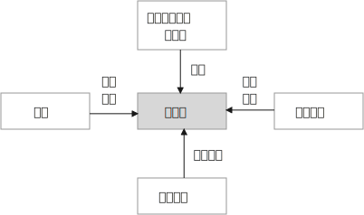

= 写作
:toc: left
:toclevels: 3
:sectnums:
//:stylesheet: myAdocCss.css

'''

== 如何选择主题

==== 把你的主题, 和人的生活中更有价值的东西(人生观,价值观, 世界观,人性矛盾)联系起来.

主线(是用一句话概括故事情节), 主题(一定是和一个"更大价值的加东西"联系在一起的. 即该故事表达出的一种人类可贵的精神,价值观.)

[.my1]
.案例
====
例如：某高考题: "齐桓公、管仲和鲍叔三人你对哪个感触最深？" +

该思考可以如下: 齐桓公任命管仲，起初遭到了拒绝，齐桓公把他追了回来，这才有了后来的拜相。诸葛亮也是刘备三顾茅庐而来。   +
管仲的传奇故事, 其实就是中国知识分子想要成为的人物, 他们也希望能被"明主识才". 那么从这一点上,  就可以来谈谈中国的“贤臣”梦。 这个平台, 就明显比单纯就管仲这个人"就事论事", 立意要高得多。
====

[.my1]
.案例
====
主线(情节): 服刑了 26 年的江西“杀人犯”张xx, 被xx省高级人民法院宣告无罪.

主题(价值观):

- **关键词: “污名” ** +
第一，因为她的前夫是一名“杀人犯”，一定会遭到当地人的说三道四；
第二，在张服刑期间，她改嫁了，这点在传统农村是很难被人接受的，同样会受到歧视。
- **关键词: “信念”. ** +
因为尽管自己被污名化，26 年来，张的前妻依然四处奔走，支撑她的一定有一种信念，而这个信念是可以打动人的。

综上分析，我们就可以确定文章的主线了：一名“杀人犯”的前妻，在流言蜚语之下，凭借着某种信念，在长达 26 年的时间里为前夫伸冤，最终成功。 +
总结来说，主线就是通过“一句话原则”，先确定价值（找关键词），再高度概括。
====

怎么从一个现象或者人物, 拎出来一个好主题, 或者找到一个好的角度呢？-- 你想表达的主题，一定要和某个更大价值的东西联系起来。

这个更大的东西, 可以是一种情感，比如爱、孤独.  +
可以是一种观念，比如自由、平等  +
可以是一种对做法的反思: 比如对公共安全的拷问等.

*这些, 都是对人活着, 具有重要意义的东西 （是人都会需要去追求的东西）.* -- 如同电影编剧一样, 创作的故事, 要反映人性和困境, 才具有现实性意义. 才会在受众中产生共情.

'''

==== 如何找到这个"更大价值"的东西呢？有两种方法

如何找到这个"更大价值"的东西呢？有两种方法:  +
1. 以专业研究中的各种关键词, 作为讨论主题.  +
2. *因果链追溯法, 一层层往上游追溯, 直到找到一个具有"高价值含金量"的问题点.*

[.small]
[options="autowidth" cols="1a,1a"]
|===
|Header 1 |Header 2

|1.以专业研究中的各种关键词, 作为讨论主题.
|比如, 谈“散装卫生巾”这个话题.

- 性别角度: 男性如何看待这个问题.

- 政治层面角度: *可以从"政策"的角度去分析问题点.* 地方政府都出台了一些政策，这些政策, 围绕"经期女性"都提供哪些政策支持? 共同点在哪里, 不同点在哪里? 不足在哪里, 执行难点在哪里?
由此，我们可以确定一个主题：地方政策当中经期女工的权利保护。

- 经济层面角度: **经济学上, 重点考察哪些变量因素呢? -- 价格、税收、贫困、经济福利等. ** +
我们先来思考, 为什么会有“散装卫生巾”出现? 对其原因一步步溯源:   +
是为了降低购买成本吗?  -> 为什么太贵? -> 原因之一: 税收高. 在中国, 卫生巾的征用税率是 13%，这是增值税里最高的一档。 -> 为什么税收高? -> 无法降低的原因是什么?     +
*这些溯源链条上的一个个问题, 其实就构成了一个明确的主题 : 女性摆脱“月经贫困”的阻力在哪？*

- 文化层面角度: 同样先思考, 文化研究中, 有哪些常见的关注点.   +
-> 比如"女性主义". 如果从这个点切入的话, 我们就可以从"父权制社会"的角度, 来讨论男权社会下的女性议题困境。   +
-> "文化禁忌"角度, 来讨论 "月经禁忌".  +

- 考察他人的关注点视角: 一个热点事件, 在翻看他人的评论之前, 先思考一下, 你自己能想到几个角度? 然后再去看评论, 看看人家想到了哪些你没想到的角度。这个方法对"扩充你视角范围", 帮助非常大.

|2.因果链追溯法, 一层层往上游追溯, 直到找到一个具有"高价值含金量"的问题点.
|比如, 某高速出口, 老是发生车祸事故.   +
我们来分析这个问题的原因 : 除了常见原因外. 有一个奇怪的现象 : 既然司机知道车辆失控了，为什么很少有车辆主动开进避险车道，避免事故的发生呢？不断去追溯因果链.
|===

'''

==== "独到的见解", 本身即是价值.

在如今这个人人都能成为自媒体的时代, 写作的主题越来越同质化，如果没有一个独到的主题，你写的东西就很难脱颖而出。  +
*所谓独到，就是指作者看到了一些读者没有注意到的东西(性质). 读者的视线需要经过作者引导, 才能看见。 即, 读者只能借着你(作者)的智慧和思考，犹如戴上神奇眼睛一样, 他们才能看到新的方面.*

'''

== --------- ---------

'''

== 建立你自己的资料(证据)库

建立起你自己的"价值观和方法论架构树” — 树(经典的大学专业教材), 树干(专业期刊,行业分析), 树叶(新闻资讯)

[.small]
[options="autowidth" cols="1a,1a"]
|===
|Header 1 |Header 2

|树根: 专业理论.
|经典作品, 就好比树根，它已经帮你筛选好了最佳的养分。你从它身上得到的投资回报率ROI, 是最高的. 它可以帮助你迅速建立起前人研究总结出的理论模型. 了解这个领域最基本的观点和概念是什么，你就能利用这些方法论, 去解读各种社会现象。

|树干(即理论动态, 数据, 画像) -> 专业期刊、行业分析报告、政府机构发布的统计数据, 政策信息等.
|要读与"你所写内容", 主题相关的内容 -- 专业期刊、行业新闻、分析报告、政府机构发布的信息等.  +
比如, 你想写一篇有关洪水治理的文章，那么你就得块速了解中国治理洪水的历史、手段，利弊, 以及治理过程中的争议。

|枝叶(即零散的故事) -> 主要由资讯,新闻组成。
|我主要关注时局、法治领域的题材，除了把涉及政治、法律的经典作品几乎全读了之外，还花了很多时间在对"枝干"和"枝叶"的了解上.
|===

树根, 要"深度学习"; 树干和树枝, 只需"快速浏览" (5W1H 法) +
先读基本原理
，再读通史.

'''

== 故事架构设计

==== 三段式结构 -- 触发, 冲突, 解决

[.small]
[options="autowidth" cols="1a,1a"]
|===
|Header 1 |Header 2

|触发 (导火索/引子)
|例如: "2020 年 6 月 17 日，经过长达 16 个小时的庭上激辩，58 岁的原新城控股董事长王振华涉嫌猥亵 9 岁儿童一案, 最终宣判，王振华一审获刑 5 年。随着王振华案的宣判，备受关注的性侵猥亵未成年话题, 再次回归大众视野。"

这个引子，包含了 3 个基本问题： +
1. 事件的人物和背景(起源)是什么？ xx猥亵未成年； +
2. 事件的最新动态是什么？ 法院宣判了； +
3. 这个最新动态, 带来的”未来悬念”和”是否公正”的判断是什么？ 五年判刑合理吗？

一般来说，这 3 个基本问题，就是一个骨架里“触发”部分应包含的内容。

|冲突(即矛盾)
|人活着, 处处有矛盾.   +
人的内心与现实, 永远处于矛盾冲突中.     +
人与人之间有矛盾.     +
矛盾冲突, 是故事的核心.

以张前妻为夫伸冤故事为例, 这里的冲突就有：

|解决
|*从一个不稳定的状态结项, 推向另一个不稳定的状态阶段. (只要"不稳定"就能吸引你一直往后看. 这个"不稳定", 也正如人走路一样, 没一只脚都是不稳定的, 必须两只脚一直交替走下去, 即从"左脚的不稳定状态", 推向"右脚的不稳定状态", 如此一直循环下去)*
|===

'''

== 讲故事(术)

==== "能掌控人心理"的手段(表达技巧), 都要掌握下来

对于"能激起你的某种感受"的写作技巧, 把这些感触, 和作者实现它的手段, 都记录下来.

== 遣词造句

==== 先确保用词准确(而非词不达意)，再去考率词藻问题

反例如: "**寓言**凝聚人类的智慧，闪烁着道义的光华，有聚瑰宝撒珠玑之美，能给人以顿悟般的针砭与启迪。" +
这句话的主语, 如果我换一个，比如勇敢: "**勇敢**凝聚人类的智慧，闪烁着道义的光华……"
发现了吗？完全可以套用。原因就在于**这段文字避实就虚, 似是而非, 空而无物, 华而不实 。**所以切忌内容空洞、用词浮夸.

'''

===== 滥用形容词和连词

- 不仅指使用的adj.不准确，还指堆砌adj.的现象。adj.用得不准确，就会让你觉得矫揉造作。

- 连词用得过多，会影响句子的节奏和美感。  +
如: "清风徐来，水波不兴"，就已经暗含了因果关系. 所以没必要写成"因为清风徐来，所以水波不兴".

'''

==== 要多用"主谓"句, 少用 adj.+n.形式

如: "被困在家的日子里，我想起了**去年樱花盛开、游客满园的(a.)那天。**" ← 改成"我想起去年**那天樱花盛开(v.)、游客满园(v.)**" 更好.

'''

==== 要多用强动词, 少用"弱动词”

弱动词（万能动词），是指如“造成”、”进行“这样的动词. +
如: 陈景润对数学问题**进行了**详细的研究. <- 不如直接写: 陈景润对数学问题**详加研究**.

'''

