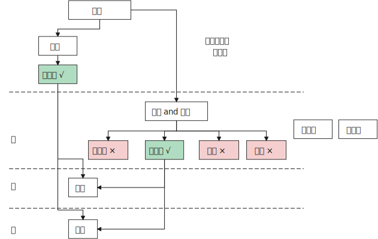

= 权力
:toc: left
:toclevels: 3
:sectnums:
:stylesheet: myAdocCss.css

'''

== 现实规律

.*★★ 话语权即政治， 表达出的话语即政治. 是你很重要的权力！*
[%collapsible%close]
====
- 每个人都偏爱自己的主张——不是因为这是他(她)想出来的，而是该主张与他(她)的潜在信仰和偏好(即价值观)相适应（相一致）。
- *我的看法未必对别人有影响, 但对自己却很重要。这表达了你自己的价值排序, 好恶、爱憎，等等。*
- “那是他的价值观，我说的是我的！”
- 这一类问题往往并没有谁对谁错，关键要逻辑自洽. (但**逻辑自洽, 不等于就是真相.** 柯南探案中逻辑是自洽的, 但作品故事依然是编的)

'''
====

.权力中被历史证明的规律: "监察官员"变"地方官"
[%collapsible%close]
====
在地方与中央的关系上，朝廷总信不过地方官，派出临时官员前去巡察。结果这些巡察的官员, 慢慢又变成固定的地方官，下一个朝代又要制定新的临时巡察制度，如此循环不已.

'''
====

== 如何确保权力

.一切问题的核心, 都可以归源于一个核心点: 如何控制人的人性和权力.
[%collapsible%close]
====
- 官员管理问题, 宦官问题, 外戚问题, 中朝外朝问题, 诸侯军阀问题, 党争问题, 人事斗争问题, 抗击与控制少数民族入侵问题. 本质都是"如何控制人"的问题

- 有贤而不知，知贤而不用，用贤而不委，委贤而不信，此四者古今之通患也。
有贤才, 却不知道他们的存在， +
知道了贤才的存在, 却不使用他们， +
即使用了, 却不委以重任， +
即使委以重任, 却不信任人家， +
这是很多人会犯的错误。

'''
====

.★ 身兼多职, 才能不被失业
[%collapsible%close]
====
- 和珅把持着掌管"财政"和"官员任命"的重要职位. 有时他兼任的官职多达20个.

'''
====

.将阶层固化住
[%collapsible%close]
====
- 他积极地让红色子弟去西方学习管理和技术，然后回国管理那些新型国企。企业将会由拥有高学历的红色后代们治理. 在今后的企业中，无论是董事，CEO，研发总监，还是会计和各类高管，都将是红色家族的子女。 +
这能无限拉开"统治者"和"被统治者"两个阶级的差距，塑造一种稳固的社会二元结构。**在这种模式下，官僚就是上层建筑，民众则充当生产资料。**

'''
====

.执行"情报网"
[%collapsible%close]
====
- 规定私企要建立党支部，让他们养一批官方眼线去监控自己。

'''
====

- 把个人目的裹上家国民族的外衣，来集权 (如曹操)。

.利益笼络
[%collapsible%close]
====
- 袁世凯习惯用传统政治的那些方式 (即权术+军权掌控) 来对政局进行控制。他相信对所有人都可以实行笼络. +
**在这一过程中，袁世凯不仅试探出了国民党的实力和能耐，**他也最大限度地使自己的能力和权限扩大化。 +

- 袁世凯还要依靠国会把他选成大总统。虽然国民党在国会占有多数，但袁世凯很清楚，国民党本来就是一盘散沙, *这些议员主要是想来北京当官的，他们不认为自己乃是民意代表，而自认为是国家的官.* 很多都是贪图个人享受。因此袁世凯在国会中的第一个议案，就是给议员加工资. 这样, 这些议员就会把他选出来(当总统).

'''
====

== 如何限制权力

==== 将权力蛋糕切成一块块分散开来, 谁都别想独大

.如何限制权力？最好的办法就是分散权力 -- 三权分立
[%collapsible%close]
====
- “三权分立”分为大中小三种：

[.small]
[options="autowidth" cols="1a,1a,1a"]
|===
|Header 1 |Header 2|

|大三权分立 :
|党、议、行

|中三权分立:
|立法权、行政权, 司法权

|小三权分立:
|把行政权划分为: 决策权、执行权、监督权
|===

'''
====

."三权分立": 西方的三权分立, 是为了制约最高权力. 而中国古代的三权分立，是强干弱枝, 是为了保护最高权力(皇帝)不受挑战。所以, 总的趋势是"皇权"越来越重，"相权"越来越轻.
[%collapsible%close]
====
image:../img/0046.svg[,]

'''
====

.清朝统治者对"督抚"(巡抚 & 总督) 权力的控制
[%collapsible%close]
====

[.small]
[options="autowidth" cols="1a,1a,1a"]
|===
||之前 |太平天国后

|人事权
|无"人事权”

- 地方州府的知州、知府乃至基层的县令，都是由中央任命，由吏部直接派遣，督抚没有什么干涉权.
- 他也无法辖制比他低一级的"按察使"和"布政使"。省一级的官吏有"布政使"和"按察使"等，他们都不是"督抚"的属员，只是比督抚的品级可能小一点。他们拥有不知会督抚、直接上达天听的权力。
- 他唯一的权力是，当这些地方官员做得不好的时候，他可以对其进行弹劾，但弹劾能否成功也不是督抚说了算。
|太平天国被平定后，主要汉人将领大多升任地方督抚, 带来督抚的权力就不一样了. 有了"自主权”. 地方官可以做很多事情，而不必在每件事情上都知会中央。

有"人事权”:

- 虽然派遣官吏的职权仍由吏部把持，但京城派来的官员能否到地方上任, 还是督抚说了算，督抚那边不挂牌，这些官员有了官衔也没用。
- 督抚还能以处理各种临时事宜为名，派遣自己人以"委员"的身份去地方担任"督办"。这种委员虽然不是官，但他的权力比正常的官员要大。
- "布政使"和"按察使"很难再绕过"督抚", 单独向皇帝上奏，他们的行为开始受到督抚的极大掣肘，这就是所谓的"督抚专权"。
**督抚之所以能够专权，很大原因就在于地方督抚之位落入湘淮军将领之手(枪杆子里面出政权, 财权, 人事权, 一切)。**他们通过这些资源扩大了自己对地方人事任免的干预。

|财权
|无"财权”. 花一分钱也得向户部报销。

- 清朝重满人, 防汉人. 如果如果一直不给曾国藩地方实职的话，就没法收钱来供应湘军. 因为开厘金、设厘卡, 必须得有行政权才可以. 曾国藩在没有职务的时候设厘卡，经常就被地方政府赶走.

|有"财权”:

- 最早征收的厘金(商税)，大多是地方官员自己征收截用的，后来虽然要上交一部分，但自己仍然可以留大头。
**有了财权，能收税，就能养人（有人事权）和养军（有军权）.**
- 比较强的人, 曾左李等人，他们甚至可以截留地方的"关税"。钱不够了，就先截留，花了再说，然后上报 (有几年，十分之九的海关收入, 都被地方截留去办洋务了). 中央一般不会对他们有什么太大的责难。因为当时的态势在那里放着呢. 他们不依靠朝廷发饷，可以自生自养。这样，权力的天平就很明显地偏向地方这一边。

|军权
|无"军权”
|有"军权”: 他们自己可以培植强大的直属军队，走到哪里就带到哪里，不受朝廷的干涉。

|
|
|
|===

'''
====

==== 去其羽翼

.去你羽翼, 根除你的势力范围
[%collapsible%close]
====
- 让部落首领离开原领地(势力范围), 迁到中国城市甚至京城, 使之去势与汉化.

'''
====

==== 权力不继承给你后人, 只止于你本人这一代

.功绩不涉后, 一时功绩一时清零
[%collapsible%close]
====
- 这些品级由儿子继承后, 就要比父亲低一级, 以激励后代努力.

'''
====

==== 给敌人找敌人

.采用"势力均衡"政策, 互相牵制
[%collapsible%close]
====

[.small]
[options="autowidth" cols="1a,1a"]
|===
|Header 1 |Header 2

|
|- 正是由于看到中国在甲午战争(1895)中的惨败，西方感到不能任由日本吞并中国, 列强才真正动了"瓜分中国"的念头, 因为瓜分以后就可以防止日本坐大. +
不过, 到了义和团(1899)的时候，西方国家整体的文明水平已经相当进步了，第一国际和第二国际已经相继出现。这个时候，西方国家国内的许多政治家已经开始对以往的殖民政策进行反思和批判，处理国家间事务时的价值理念跟以往已经不一样了，赤裸裸地去殖民、去瓜分一个大国到这个时候并不时髦了。  +
+
另外, "瓜分中国"未能实现的部分原因, 是中国精英努力使帝国主义列强相互牵制, 以保持平衡。当然,这方面的研究还极为有限。

|利用列强间的矛盾, 来另他们互相制衡, 以让自己渔翁得利:
|- 在谈判的过程中，日本人曾警告陆征祥，这些谈判都是机密，不能透露给任何人，不能告诉别的国家。但**中国代表一边谈，一边又把谈判细节通报给英美各国的驻华使节(即激起"日本"和"西方国家"双方的焦虑感)，希望争取西方国家的支持**，所以很快《二十一条》的消息就走漏了，西方国家的媒体和政府都开始对日施加压力。
|===

'''
====

.以夷制夷, 分化敌人, 拉一踩一
[%collapsible%close]
====
- 用"内蒙古人"对抗"外蒙古人". 用结盟者对抗叛乱者. 以防止任何一个蒙古人领袖积聚起力量.

'''
====

==== 切断你经济上的来源和资源

.经济封锁
[%collapsible%close]
====
- 清朝对付台湾郑成功的方法: 迫使中国沿海居民迁到离海十英里或更远的内陆, 以便切断台湾取之于大陆的人力、食物和丝绸贸易的来源.

'''
====

==== 毁掉你的名望, 让你的追随者抛弃你

.捆绑"埋雷", 毁你名望
[%collapsible%close]
====
- 《二十一条》条约, 日本公使**还附加了(埋雷)一个第五号建议性条款在里面. 这就是"埋地雷". 如果中国签了《二十一条》, 那么在外界看来，中国就好像是也接受了第五号条款. 袁世凯的声望就会下跌.** 这正是日本人的图谋. 因为他们对袁世凯很头痛. 在和袁世凯的几次冲突中，日本人都没有占便宜. 因此日本要做的就是把袁世凯搞下去。

'''
====

==== 禁锢住你的"思想与觉悟", 让你永远保持在"奴役思想"状态中, 保持你的"被统治意识"

.思想专政 -- 统治者垄断对经典的诠释, 民间新思想体系无法建立
[%collapsible%close]
====
以前的中国, 对儒家思想的解释, 主要是由士大夫来负责的.  +
但清朝更加集权, 乾隆剥夺了士大夫的这种权力, 自己来阐释经典. 清朝有很多皇帝, 都编有自己对经典的解释集. +
因此士大夫的精力, 就只能投向去搞"考据"了. 顾炎武帮助创立了"考据学", 用来判断古代文献的真伪.

但**中国文化之精髓不在于考据，而在于对经典思想的阐释, 并创造出新的思想体系。两汉的经学、宋代的理学, 明朝的心学, 均建构出了新的学术思想体系.** 但清朝，统治者禁止了士大夫去做这个, 学者的创造力被禁锢，一生都被消磨在琐碎的考据之中. +
而且**"考据学"只能用于文化研究的有限领域, 不能用于自然科学和技术.** +
事实上, 中国许多早期的科学发现和发明, 更多是与道教徒有关, 而不是与儒士有关. 中国对自然的研究, 也从来没有像西方那样, 将现代科学"系统化"和"理性化". +

*这导致, 清代的主要学术, 对如何解决清代晚期面临的紧迫问题, 几乎没有提供任何良策.* +
一直要到太平天国之后, 汉人士大夫(曾国藩, 李鸿章等)崛起, 清政府就再也没有能力搞文字狱了。汉族士大夫中, 不仅"实学"开始活跃，一些人也开始追求"西学" (洋务运动).

'''
====

.新教对”开放性诠释”的追求, 本身就是一种对”思想垄断”的打破
[%collapsible%close]
====
新教就是能让"西方文明理念"传入的的窗口与渠道. +
**中法《黄埔条约》(1844), 规定了"开放教禁". 西方的文明思想, 就能借着传教士渠道输入进来。**由新教教士创办的报纸, 如《万国公报》，对中国思想界起到了启蒙作用。

[.small]
[options="autowidth" cols="1a,1a"]
|===
|天主教 |新教

|天主教是本教，普通信徒对教义是不能随便解释的，《圣经》的解释权掌握在教皇手中。
|**"新教"不允许"垄断解释权"的人存在, 每人都能按自己的理解读《圣经》，**这样必然会产生对教义的不同解释。(*新教对”开放性诠释”的追求, 本身就是一种对”思想垄断”的打破.*) 因此新教有很多流派.

- 而洪秀全的"拜上帝教", 可不精确地看做是他自创的”新教”的一个分支. 但是, 这也造成士绅直接地把”拜上帝教”的罪过, 加到”天主教”的头上. 太平天国覆灭后，士绅们直接将天主教视作挑起农民造反的"恶势力”.

- *为了传播基督教教义, 传教士们发现, 向社会秩序提出质疑 — 至少通过暗示来做到这一点,是必要的.* 而这种秩序在地方上的中坚人物 — 是士绅。 *传教士们在诸如孤儿抚养、济贫, 和在灾荒年月提供赈济之类的事务中, 与士绅展开竞争. 这在传统势力看来, 基督教似乎一心在鼓动对现实不满的人。* (因为基督教在解决儒教无法解决的问题，反衬出儒教的无能，所以在儒教看来，基督教就是暴露自己无能的人, 是敌人.)

|罗马"天主教"的布道, 有单一的机构协调他们的活动.
|而新教则没有. 后者的活动几乎像西方商人的活动一样分散。
|===

'''
====

