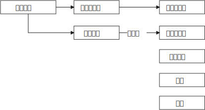

= 政治中,历史的规律
:toc: left
:toclevels: 3
:sectnums:
:stylesheet: myAdocCss.css

'''

.★ 王朝统治的衰败规律
[%collapsible%close]
====
[.small]
[options="autowidth" cols="1a,1a"]
|===
|Header 1 |Header 2

|1."明规则"阶段
|当新的王朝发展到一定时期，制度(明规则)就会开始懈怠. 该遵守的规则失去落实，该处理的政务没有人干。

|2.逐渐的，"潜规则"开始当家.
|其实有较为固定的"潜规则"，也能维持运转，大家实践几次也就都知道该怎样办事了。

|3."无规则"阶段
|再后来，潜规则也不管用了，它又被"无规则"取代。但等到"潜规则"都被破坏了，这个时候就会产生混乱，人们对该怎么办事就没有共同预期了。

|===

'''
====

.大乱带来大治
[%collapsible%close]
====
大乱带来大治. 把整层专制的土铲掉, 才能种下民主基因的种子, 才能生长出民主的大树. +
经过大规模农民起义后建立的王朝, 往往寿命更长. 因为这些农民起义把原来的社会破坏得很彻底。所以就有这种说法: “大乱达到大治”。

'''
====

.(母国的)文化基因, 决定(殖民地)长成什么大树果实.
[%collapsible%close]
====

[.small]
[options="autowidth" cols="1a,1a"]
|===
|Header 1 |Header 2

|英国(民主)
|- 基于英格兰自治传统，英王对殖民地的管理也是放羊式的。殖民地时代的美国并没有一个统一的政治规划。所以美洲殖民地一开始是一个又一个分散的殖民点，这些殖民点从一开始, 就是高度自治的。 乡镇政治, 因此成为美国政治的基础。
- 作为一个代议制国家，英国把"民选代议制", 也带到了殖民地。 +
托克维尔：“*在我们法国，是中央政府把它的官员借给了村镇 (对上负责)；而在美国，则是乡镇把它的官员借给了州政府 (对下负责)。*”
- （北美洲的殖民者）具有企业主的开拓和进取的精神……他们并不按照英国政府的意图行事，不愿意把自己生存的土地变成一个落后的原料供给地。

|西班牙(专制)
|- 西班牙把本国的封建专制制度, 直接移入殖民地，建立起与西班牙完全相同的集权体系。总督集民政、军政与司法大权于一身，只对国王负责，并不代表地方利益。西班牙殖民地政府, 具有其母国专制政体的一切缺点。

- 殖民地时期，拉丁美洲社会实行严格的等级划分: +
-> 第一等人是“半岛人”，即来自西班牙半岛的人，他们担任殖民地的高官. +
-> 第二等级是“克里奥尔人”，即美洲出生的纯种西班牙人。 +
-> 第三等级是“梅斯提索人”，也就是西班牙人同印第安人混血的后代. +
-> 第四等级是印第安人. +
-> 第五等级是黑人。 +
-> 第六个等级是黑奴。 +
 +
 +
 +
从殖民地时期开始，拉丁美洲就存在着北美没有的巨大阶级差别.

- 事实上，独立战争的结果“仅仅是一场政治权力的转移，除了由原来的二等公民克里奥尔人取代了西班牙人的政治位置” , 其他没有变化。   +
西班牙的政治遗产拖了拉美的后腿。“我们是独立的，但我们是不自由的；*西班牙的军队不再压迫我们，但她的传统却压得我们喘不过气来。*” +
文化缺乏民主的基因, 成为拉美现代化的重要障碍.

因此，以欧洲移民为主体的"英属"殖民地, 今天基本上都是发达国家。 +
而同样以欧洲移民为主体的"西班牙（包括葡萄牙）"殖民地, 今天则大都是发展中国家。西班牙对拉丁美洲的数百年旧式殖民统治，决定了拉丁美洲今天的落后面貌。 (种下民主的种子, 才能收获民主的大树)

李光耀说：“新加坡成功的关键，是英国人留下的法治制度，而不是什么儒家文化。”

|===

'''
====

.外因里,有"益处"也有"弊处". 同样, 内因里也是既有"益处"也有"弊处". 所以不能把所有的"弊处"都归于"外因".
[%collapsible%close]
====
传统解释认为, 中国现代化过程的缓慢, 主要是因为(外因)西方“帝国主义"压迫的有害影响。但这种观点无法解释为什么势不可当的“帝国主义"影响, 在日本和中国却产生了如此不同的结果 (日本在"西方文明的外因"和"自身文化的内因"下, 通过明治维新, 逐渐进入了民主国家行列)。 +
事实上, (内因)儒家文化的某些特征, 阻碍了中国的变革. (中国的历史向来没有宪法文化, 没有宪政文化的土壤, 就很难实现”宪政果实的最终结出”. 因为文化就是发动机, 就是惯性.)

'''
====

.用政治意识形态来教历史, 就是伪史
[%collapsible%close]
====
中国在历史教育上的问题 : *学校里的课, 名义上讲的是历史，实际上却不是在搞真正的历史研究，而是按政治课的性质开的. 其目的是想给学生灌输一种特定的意识形态.* 因此, 从"是非"和"真伪"角度来看，这样的历史就是伪史.

'''
====

.传统的灌输式历史教育, 给鸦片战争创造了两个神话 : 1.忠奸之分, 2.百姓怕官，官怕洋人，洋人怕百姓
[%collapsible%close]
====
[.small]
[options="autowidth" cols="1a,1a"]
|===
|Header 1 |Header 2

|神话1: 忠奸之分
|民间都喜欢这样说: 杨家将、岳飞故事, 忠于国家的将领在前线杀敌报国，胜券在握。但他们最后失败了，原因就是有奸臣在后方陷害。这种民间叙事的逻辑是：如果后方没有奸臣捣乱，中国人将每战必胜。 这种思维也被套用到了林则徐身上. 西方人怕林则徐吗？根本不怕. +

看材料就能发现，当时**多数中国老百姓在战争中其实没什么立场，因为兵和匪差不多。**中国历史上，兵的纪律一向很不好，每到一个地方都会抢劫老百姓. 俗语说，"**匪来如梳，兵来如篦bì**". (篦 : 是一种齿比梳子密的梳头用具. ) 所以老百姓见了兵是要躲的, 注意，这里躲的不是敌方的兵，而是自己的兵。

|神话2 : 百姓怕官，官怕洋人，洋人怕百姓
|
|===

'''
====

.晚清历史的本质, 就是西方把中国拖入世界体系的过程。
[%collapsible%close]
====
中国近代史的本质, 就是西方迫使清朝接受西方有关"国际贸易"和"国际关系"的概念. +
晚清历史的本质, 就是西方把中国拖入世界体系的过程。中国传统是"朝贡体系". 朝贡体系就是国与国不平等关系.  如果我们不知道近代中国是怎样融入世界体系的，或者完全无视这个过程，结果就只会有人重新闭关锁国, 鼓噪排外。

'''
====

.中国以往历史教育中的"革命线索" —— 强调从太平天国、义和团, 然后到辛亥革命. 这很容易使我们忽略历史的多线性.
[%collapsible%close]
====
今天我们关于戊戌变法的历史叙事，其实在很大程度上是沿袭了康梁对变法的描绘和记述。所以我们一提到戊戌维新，首先联想到的可能就是康梁主导下的变法. 但其实在当时，有许多人都在变法。所以，戊戌变法在当时是存在多个中心、多条路径的。

'''
====

.会党对历史的作用被长期夸大和高估了。因为**在中国，任何事情一旦发迹，就会有人给其写东西、编历史。**
[%collapsible%close]
====
现在关于会党的研究很多，最大的问题在于，**会党对历史的作用被长期夸大和高估了。因为在中国，任何事情一旦发迹，就会有人给其写东西、编历史。** +
编历史的会这样说，这些组织从一开始就是抱着反清复明这样的远大宗旨的. 其实帮会人士只是希望抵抗清政府对他们的敌视和压制。**至于反清复明什么的，都是后来人加上去的一些由头。** +
包括会党的历史，以及他们跟少林寺、南少林寺的关系，都是编的。其实少林寺和南少林寺的历史本身也是编的。民众就是需要一些神话，如果太真实了，就缺少吸引人的地方了。

革命党搞的起义，只要是有会党参与的，一般都没什么戏。因为兴中会钱多，所以总是用钱去收买土匪或者三合会去发动起义。一旦钱没了, 大家就都散了。 +
如果革命党笼络的会党稍微多一点，他们可能就会自己先掐起来，因为他们从来都不是一个团体. 帮会并没有真正的谱系，这些谱系什么的都是后来建的。洪门，尤其是青帮，都是组织完善以后, 自己建起的谱系发展脉络(就跟建家谱一样)。*什么辈分啊，排序啊，都是后来人弄出的名堂.* 最初就是一盘散沙，山头林立。

而这些帮会又自认为是革命党。很多地方的帮会都没怎么打过仗，但他们都自认为是革命元勋。**这些混吃混喝的人就这么起来了，虽然无甚功劳，但已经成为革命元勋了，就要分享革命成果。**所以帮会开始各占一摊，进了城之后秩序大乱，他们觉得轮到帮会来坐天下，他们该做皇帝了，就为所欲为，比如公开地包娼包赌，公然地在大街上抢劫。 +
*所以到了后来，跟帮会沾边的革命党人都遭到了排挤.* 比如湖南的焦达峰、陈作新先后被杀，显然是跟他们的帮会背景有关系。当时的帮会太猖狂了，焦达峰在都督府里每天都要摆流水席，天天接待各种江湖人士。**这些人来了，不仅要吃饭，还要封官，还要给钱，**湖南在新政期间攒了几百万两的银子，都让这帮人花光了，而且之后整个长沙城秩序还是一直混乱。

*在当时，革命党若是不镇压帮会，就根本处理不了混乱的局势。如果革命党想赢得民众的支持，塑造合法性，就必须镇压昔日的盟友。*

就孙中山的个人想法而言，他未必想真正地动员帮会，他做的只是对他们进行收买和利用. 在同盟会中，孙中山是最大的金主，**因为两广人士中的海外华侨比较多，**所以能从海外筹到钱的只有孙中山，他可以收买大批帮会参与起事。**而江浙和两湖地区出外谋生的海外华侨, 则少很多，**所以光复会以及两湖的革命党没法从海外筹钱，只能依靠当地的富人捐一点钱。没钱怎么动员帮会呢？只有靠拉感情了，就是跟人套关系、戴高帽。 +
**革命党人对这些帮会分子从一定意义上讲就是利用，他们并不会真的想要跟帮会共天下，或者起事成功后平分国家权力。**

'''
====

