= 傅世宁医学通识
:toc: left
:toclevels: 3
:sectnums:

'''

== 人会生病的原因

== 癌症

==== 癌症的链条

[.small]
[options="autowidth" cols="1a,1a,1a"]
|===
|链条环节 || ← 针对此环节的治癌方法

|DNA 错误的图纸
|正常的基因突变成癌基因.

正常细胞生长分裂, 需要"生长信号"，同时还有"抑制信号"防止过度生长。癌细胞一个最大的特点就是"生长信号"多，而且对"抑制信号"不敏感。所以，癌细胞长得快，不停地长。

|← 靶向药

|失效的自检体系
|人体有一种"细胞凋亡机制"，目的是让这些不合格细胞自我销毁。细胞的凋亡就是细胞的程序性死亡，它是人体防止细胞癌变的一种主要机制 -- 由抑癌基因（ tumor suppressor genes）控制。P53就是一种抑癌基因。 +
如果抑癌基因发生突变, 那本该自杀的细胞就会不死。
|←

|灵活的能量供应
|正常情况下，一个细胞和它最近的毛细血管的距离, 不能超过100微米，也就是0.1毫米。太远了营养够不着.

但是，癌细胞特别灵活。癌症的时候，促进血管形成的信号增多，而抑制血管形成的信号减少。这样，就有持续的新生血管形成，源源不断地给肿瘤组织供血。这就好比是，“癌症跑车”上路，既然找不到固定的加油站，那么就自带移动的加油枪，随时供应燃料.

所以在临床上，多数恶性肿瘤通常都是血流丰富。医生们甚至用这个特点区分良性和恶性。

|← 血管内皮生长因子抑制剂，就是针对癌症组织血管丰富的特点，抑制血管生长，也就抑制了肿瘤的生长。

|失明的警察
|正常情况下, 免疫细胞就是警察，它们会主动寻找和攻击癌细胞。但癌细胞会伪造一张“假身份证”，躲过警察的检查. 这种机制叫做免疫逃逸。
|← 免疫治疗药物PD-1抑制剂，就是恢复警察的火眼金睛和战斗力.

|篡改生死簿
|正常细胞的分裂次数是有极限的, 所以细胞是有寿命的。但癌细胞可以无限次分裂。
|←

|自由游移
|正常细胞就是按照基因编码，不会乱长。胃里的细胞永远也不会长到鼻子上去。 +
但是癌细胞不同，它们能在组织内部和组织间灵活移动，也就是癌症容易发生侵袭和转移的原因。
|←

|===

而所有的癌症治疗方法, 就是针对上述这6大环节的 (切断链条). 所有治疗的前提，都是基于医学对于这六大环节的认知越来越清晰。

==== 癌症发生的原因

人体的自我修复, 需要细胞分裂. 但细胞分裂也会带来随机错误。  +
人的基因组有31.6亿个碱基对，每次分裂这31.6亿个碱基对都要复制一次。工作量太大就难免出错. 每次细胞分裂都会带来随机错误。随着这些错误不断累积，犯的错就会越来越多，就有可能发生在关键点上, 变成癌基因。 +
所以，细胞分裂次数越多，癌基因发生的几率也就越大。

年龄越大，细胞分裂次数也就越多，癌症发生风险也就越来越高。 +
数据显示，40岁以上的人患癌症的风险, 呈指数倍增长。如果人的寿命达到85岁，累计癌症发生风险高达36%。

2017年《科学》（Science）杂志发表了一篇研究, 认为 : 引起癌症基因突变的因素中，最主要原因是染色体复制过程中发生的随机错误，这个因素占到了66%。而环境因素和遗传因素，加一起也只占34%。

为什么这些年，癌症突然就多了？主要原因是: 人的寿命延长了。

- 骨癌的基因突变：随机错误占了99.5%，遗传占0.5%，与环境因素完全无关。
- 甲状腺癌，随机错误占98%，遗传占1.5%，环境因素仅占微不足道的0.5%。
- 非何杰金氏淋巴瘤、脑部肿瘤、前列腺癌、睾丸癌，这些癌症的基因突变中，随机因素都占到了95%以上。

将癌症推迟的方法就是:
[.small]
[options="autowidth" cols="1a,1a"]
|===
|Header 1 |Header 2

|减少器官损伤, 即减少细胞修复次数 :
|- 戒烟、戒酒、减肥、多运动、多吃全谷物食品、蔬菜、水果、豆类，少吃糖、少吃红肉（比如猪肉、牛肉、羊肉）
- 避免乙肝病毒、丙肝病毒、幽门螺旋杆菌、HPV病毒感染。已经感染了，要治疗或者定期复查。

|定期进行疾病筛查。早期发现，早期治疗.
|避免这些良性的病变, 进一步发展成为恶性的癌症。 +
超过一定年龄之后定期进行科学的筛查，是发达国家总结出来的可行的癌症预防方法。

- 美国明尼苏达大学癌症检查中心，对45岁以上无症状的普通人, 每年做一次"乙状结肠镜"检查，见到"腺瘤"就切除。("腺瘤"就是一种癌前病变，长期发展就可以变成癌症。) 这样做的结果，就是结肠癌、直肠癌发病率比预期的减少了85%。

|===

== 疼痛：不仅是症，还可能是病

世界卫生组织认为，"疼痛"是除了"血压"、"呼吸"、"脉搏"、"体温"之外的第五大生命体征.

疼痛就是一种最常见的症状。60%以上的门诊病人，是因为疼痛就诊。30％以上的成人有慢性疼痛，而且随着年龄增长，这个比例还会逐年增加。

中国传统观念里, 会认为忍痛是一种英雄行为。比如关公刮骨疗伤. 但是国外则不这样看. 在中国，无痛分娩率不到10%，在美国这一数字是85%，在英国是90%。中国吗啡类的镇痛药物用量不到美国的1/10, 而中咱们的人口是人家的4倍多。

疼痛跟体温、血压、脉搏都不一样，疼痛没有一种客观的测量手段。 医学上有个疼痛标尺，用0-10分表示疼痛的级别。这种方法也只是相对准确。医院有句话：病人说疼就是疼，病人说有多疼，就有多疼。因为，你永远不知道别人有多疼。

研究表明，痛觉的产生, 有明确的神经传导通路。各种损伤会刺激人体组织，释放致痛物质，也就是导致疼痛的化学物质。接下来，这种化学物质会转化为生物电信号，然后由神经通过脊髓传给大脑。所以，这个通路上的任何一个点出问题，痛觉都会受影响。

- **经常会有糖尿病病人, 因为暖水袋烫伤。就是因为糖尿病损害了病人的末梢神经，**所以，这条通路也就受到了影响。痛觉降低了，感受不到疼，也就不知道躲，就这么生生地被烫伤了。
- 如果没有痛觉，是一件很可怕的事。医学上有一种罕见病——"先天性无痛症"。这些人生下来就不知道疼是什么感觉, 也就不知道躲。美国有个案例, 有个孩子她长牙以后，和别的小孩一样喜欢啃手指。但是，如果没有人阻止的话，她会把自己的手啃得血肉模糊，甚至露出骨头。

尼采说过：疾病损害人的机体，疼痛摧毁人的灵魂。 +
疼痛不仅能摧毁人的灵魂，疼久了，也会对身体带来巨大的伤害。

[.small]
[options="autowidth" cols="1a,1a"]
|===
|Header 1 |Header 2

|急性疼痛 :
|通常容易找到原发病。

|慢性疼痛 :
|是"持续时间大于三个月"的疼痛. +
很多慢性痛，找不到病因。慢性疼痛本身就是一种病。

持续的疼痛, 会影响病人的生理事实:

- 身体的多个系统，比如神经系统、消化系统，内分泌系统、循环系统、免疫系统, 都会相继出现功能紊乱。
- 疼久了，还会促进"神经系统"发生"病理性重构"。也就是说，痛觉通路异常了，疼痛的感觉乱了。没刺激，也会疼。 +
有些长期腿疼的病人，神经通路就会发生"病理性重构"。截肢以后，病人仍然会感觉到腿疼 -- 即"幻肢痛".

既然"慢性疼痛"是病，就必须治疗。 +
把"忍痛"认为是美德，非常不科学，更不人道。

- 一个肝癌晚期，已经全身转移的病人, 这个时候，止疼就成了她最重要的治疗。

有一种常见的错误观念，认为止疼药会上瘾. 其实，美国国立卫生研究院指出，癌症病人吗啡药物上瘾的比例低于1％。所以，世界卫生组织强调：对于医疗上需要使用吗啡的病人，应该满足需要。在这一点上，咱们远远没有达到世界水平。

当然，前提是必须首先确诊。在确诊之前，盲目用止疼药可能会掩盖病情。

|===

一旦明确病情之后，所有的疼都不需要忍。免除疼痛是人类的基本权利。 +
国际疼痛学会（ International Association for the Study of Pain）把每年的10月11日定为“全球征服疼痛日”。就是为了唤起全世界的人，对于"止疼"的重视。

**免除疼痛不只一种人道主义的关怀，止疼更是一门专业的学科。**这个学科专门研究疼痛的病理生理机制，还有科学止疼的方法。他们用药物、手术，可以有效地去除绝大部分的疼痛。

== 静脉输液：给药途径的新思路

*在医学上，药、液体、营养、电解质、白蛋白、氨基酸、葡萄糖，甚至血液等等，都是治病的"能量"。给药途径，本质上就是一种“能量投放系统”。*

.案例
====
霍乱是一种由"霍乱弧菌"引起的"烈性消化道传染病"。病人会出现剧烈恶心、呕吐、腹泻。严重的病例，几个小时就可能脱水而死。*病人无论吃进去啥，喝进去啥，立刻就会拉出来。腹泻又造成了严重脱水，体内电解质也会发生紊乱。*

这个时候，怎么通过"口服"这个原有的"能量投放系统"，补水、给药、给营养呢？ 这个系统失效，就会危及生命。

既然全身的血管是连在一起的，那么**把液体通过血管输进去，不就可以解决能量投送问题了吗？ 这就是"静脉输液技术".**

不过在早期, 盐水的浓度应该是多少？电解质是什么比例？如何正确消毒？所有这些关键因素在当时都没有得到解决。一直到当"电解质平衡理论"和"低血容量性休克"的病理生理机制, 得到阐释之后，静脉输液技术才得到迅速推广开。
====

1972年，美国成立"静脉输液护士协会"（INS）。INS标准成为了世界各地"静脉输液治疗"的指南。

医学的发展, 就是 *不断出现的新情况，让医生不断地开发出新的能量投送通道。* +
就是在治病过程中，若一条老路在新困难面前走不通了，那么，就必须开拓一条新路 (新方法)。

[.small]
[options="autowidth" cols="1a,1a"]
|===
|Header 1 |Header 2

|"深静脉穿刺"方法 :
|大面积烧伤的病人，怎么给药呢？这些**病人全身的皮肤都烧坏了，怎么找血管呢？这个时候，医生可以"深静脉穿刺"。**也就是从颈部，或者从大腿根，或者从锁骨下，*把一根无菌导管放到深部的、更粗大的血管里，输送药物。*

|“输液港”（implantable venous access port，PORT）方法:
|需要长期化疗的肿瘤病人，化疗药有刺激。*用表浅的血管就容易得静脉炎，就需要刚才说的这些深部大血管。* +
但是，化疗是个漫长的过程。如果每次都穿刺，病人太痛苦了，而且也不安全。那怎么办呢？医生又发明了一种叫做“输液港”的技术。

把这个"输液港"埋到病人皮下，输液港一头放到深部大血管里，另一头放在皮下，就像建造了一个临时“港口”。以后每次给药，把药直接打到这个“港口”里，然后药就能进入人体了。

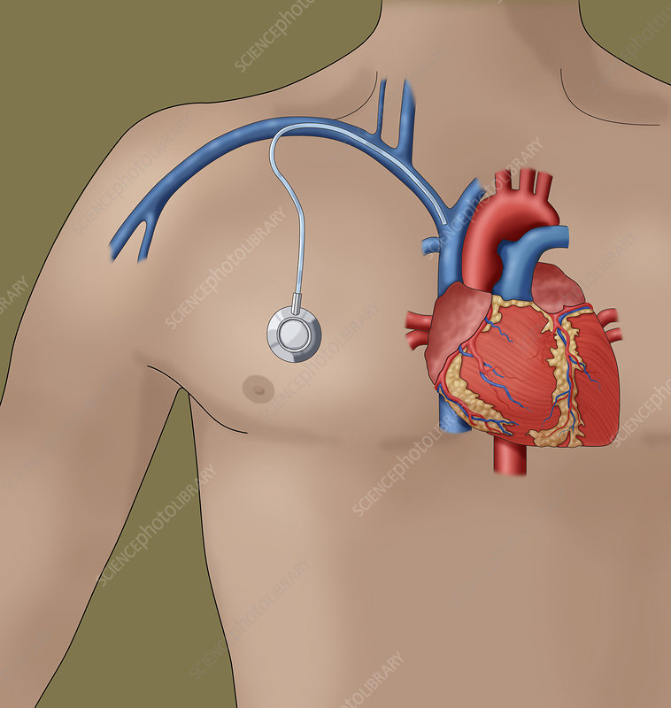

|"介入治疗 interventional therapy"方法 :
|肿瘤病人的用药，经过血液稀释，人体代谢之后，能达到癌症组织的药物浓度就低了很多。如果加大药量，药物浓度增加的同时，不良反应也会增加。 +
**肿瘤科的医生就开发出"介入治疗"。也就是把导管, 直接放置到供应肿瘤组织的那根血管里。局部给药，**既增加了药效，还降低了化疗药物的不良反应。

|透析技术
|*尿毒症病人的肾没办法工作了，体内的毒素也就清除不出去。必须寻找一条新的途径清除这些毒素。* 血液透析、腹膜透析技术，可以利用分子弥散原理，让这些毒素物质排到体外。

|口服补液
|研究发现，即便在腹泻的时候，肠道也并不是一点都不吸收。只要口服的液体成分中, 葡萄糖和氯化钠按照一定比例搭配，人喝下去，肠道还能吸收。而且效果和"静脉输液"差距不大。 +
今天，儿童腹泻，多数情况通过"口服补液"就可以解决了，只有严重病例, 才会需要"静脉补液"。静脉输液未必比口服来得更快。

|===

除了输液技术的提高，能输的液体种类, 也大大丰富了。 +
比如，静脉营养。营养主要是通过肠道吸收的, 病人没了肠子还怎么活呢？就是通过静脉把营养输进去。*把葡萄糖、氨基酸、脂肪乳、微量元素、电解质，这些生命必须的能量物质，按照合适的比例，计算好热卡混在一起，通过静脉血管, 输送
到她的身体里。*

今天的静脉输液技术, 已经成为了临床上最常见，也是最普通的治疗技术。

你能通过医生手里的“武器”，判断他是哪个科的吗？

- 手里拿着凿子、锤子的, -> 这是骨科医生。
- 手里端着显微镜的, -> 这是病理科医生
- 推着呼吸机的, -> 是ICU医生。

== X射线："用最小的干预, 来获得信息"的新起点

医学面临的一个困境就是, 如何在活体上获取信息。信息越准确，也就越接近疾病的真相。医生必须想方设法，尽量
小地干预病人的生理状态，来获取信息。

X射线第一次让医生能够不用手术，不用打开人体，就能在活人身上获取身体内部的信息。这是用最小的干预获取信息的开始。

咱们生活的环境本来就存在辐射，我们把这种辐射叫做"天然本底辐射"。它指的是宇宙射线和自然界中, "天然放射性核素"发出的射线。

- 拍一张普通的胸部X光片，病人接受的放射剂量, 大约相当于3天的"本底辐射"。
- 做一次低剂量肺部CT，放射剂量大约相当于150天的"天然本底辐射"。这种剂量比普通肺部CT照射剂量减少近90%，对于肺癌筛查，是非常安全和行之有效的手段。这种低剂量肺部CT，虽然不如普通肺部CT清晰，但它依然可以清晰地辨别直径小于5毫米的病灶。

== 抗生素

为什么真菌周围不长细菌呢？一定是真菌分泌的什么东西，抑制或者杀死了细菌。真菌分泌的物质，就是青霉素，可以杀死细菌。

青霉素是第一个抗生素。 *“抗生”的意思，就是一种微生物对另外一种微生物的生长繁殖, 有抑制或者杀灭作用。一种微生物分泌的，可以抑制或者杀死对方的物质，就是"抗生素"。*

**以青霉素为代表的"β-内酰xiān胺类"抗生素，作用机制就是干扰了细菌"细胞壁"的合成。咱们人体的细胞是没有细胞壁的，所以青霉素杀细菌效果好，同时对人体细胞伤害很小。**我们熟悉的头孢，就是β-内酰胺类抗生素。

人类又研发或者合成了其他种类的抗生素，作用原理也不再只是干扰细胞壁的合成。比如，有的是影响细菌蛋白的合成，有的是阻碍细菌DNA的合成。

以前很多治不了的病，今天能治了。比如"细菌性肺炎"、"细菌性尿路感染"等等。

但我们今天担心的所谓抗生素的耐药，以及二重感染等问题，从抗生素发现的那一天，就埋下了种子。

大量使用抗生素会带来的问题:
[.small]
[options="autowidth" cols="1a,1a"]
|===
|Header 1 |Header 2

|-> 有耐药性的细菌会活下来, 壮大 :
|抗生素是把物种天然的竞争关系，人为拿出来利用。 +
*长期使用的话，对抗生素敏感的细菌就杀光了，这时候，另一些不敏感的细菌就会过度繁殖，细菌也会演化出适应抗生素环境的生存方式。这就是"耐药"。* 这部分细菌会把耐药的遗传物质，通过接触传递给周围的细菌，也通过繁殖传递给它的后代。

人类研发一种新型抗生素，要用数年甚至十几年。但是，细菌只需几个小时就能完成一次进化和迭代。

|-> 打破肠道内细菌的"内共生关系" :
|大量应用抗生素，还会打破肠道内细菌的"内共生关系"。就会引起菌群紊乱。 +
*在医院，因为严重感染性疾病，需要大量使用抗生素的病人，会出现顽固的腹泻。就是因为抗生素打破了原本的菌群平衡，导致菌群紊乱。*

这种腹泻很难治，那怎么办呢？最好的办法就是恢复平衡。有一种办法，就是把健康人的粪便提取液，也就是健康人的肠道细
菌，打到病人的肠道里，很多病人的腹泻就能止住。

|-> 带来真菌感染 :
|大量广谱抗生素应用，还会带来真菌感染。 +
**真菌分泌的物质杀死了细菌. 真菌过度生长，也会带来真菌感染。**大量使用广谱抗生素的病人就会出现深部真菌感染，这类感染就更难治了。

很多女生受到广告误导，动不动就用含有杀菌剂的洗液冲洗阴道。阴道本身就是一个充满细菌的环境，用洗液就破坏了阴道本身的菌群平衡，反而会引起真菌感染。*很多阴道炎，尤其是"真菌性阴道炎", 都与阴道的微生态失调有关。*
|===

科学使用抗生素的三条建议 :
[.small]
[options="autowidth" cols="1a,1a"]
|===
|Header 1 |Header 2

|1.在严重感染的时候一定要用抗生素，不要排斥。
|

|2.任何感染都不能单纯地“杀”，*除了应用抗生素之外，应该鼓励人体的自我防御。*
|把痰咳出来，就是身体的一种自我防御。很多病情严重的病人没办法自主咳痰，这样就很危险。 +
对于严重的肺炎病人，医生和护士时刻都在鼓励病人咳痰。咳不出来的，医生还会用气管镜吸痰，这些都是在激励人体本来的自我防御机制。

|3.少备抗生素。
|
|===

== 临床诊治指南

[.small]
[options="autowidth" cols="1a,1a"]
|===
|Header 1 |Header 2

|临床诊治指南
|临床诊治指南，它的定义是：针对特定的临床情况，系统制订出的帮助临床医生和患者做出恰当处理的推荐意见。

指南,是一套标准化的方案，对医生治病的每一个环节都有建议。比如，怎么检查、怎么治疗、怎么手术、怎么用药、剂量多少、联合
用什么药。几乎所有的常见病都有这么细的指南。 +
同时，对于同一种病，不论这种病有多简单，都会用到多个不同的指南。

- 就拿"阑尾炎"这种外科医生入门级的手术来说，也至少要用到4个指南。麻醉有《麻醉学操作指南》；手术有《阑尾炎诊治指南》；术后要用到《抗菌药物在围手术期的预防应用指南》；如果感染严重，还会用到《抗菌药物临床应用指南》。
- 冠心病的病人，可能要用到至少10个指南。包括《高血压管理指南》、《中国心血管病预防指南》等等。

|指南用规范的流程, 解决水平差异问题。
|指南就是这么重要。它几乎涵盖到了临床上所有的常见病，以及常见病里所有的类型。指南对于每个环节都有清晰的指示。一个医生规范地应用指南，就可以保证病的基本治疗。*按照这个方案做，就可以避免不同操作者的水平差异带来的治疗差异，还能保证效果、降低风险。* +

- 遇到心脏骤停的病人，我们应该立刻心肺复苏，不能等。这个时候，无论是大医院的医生，还是卫生院的护士，只要掌握了这个指南，心肺复苏的操作手法就基本一致。
- 同样是心肺复苏，ICU的医生和急诊科的医生最有经验，因为抢救太多了。

在临床工作中，越是常见病，研究也就越透彻，它的指南就越规范、越厉害。不按指南操作的风险也就越高。

*指南的第一个特点，它是地板，保证了最基本、最规范的治疗。 但是，每个病人又是千差万别的个体，所以指南只是地板，它不是天花板。*

|循证医学
|制定指南用到的科学方法，叫做"循证医学"。循证，也就是让证据说话，把证据转化为最好的临床指导建议。所以，只要有关键的新证据出现，指南就要迭代升级。

- 《心肺复苏指南》，每年都会迭代一次。

|===

== 衰老：老不是问题，衰才是关键

人类寿命的极限, 可能是120岁。 推论有三 :

- 人类历史上有证可考的最长寿人士，享年122岁。
- 法国博物学家布丰（Georges Louis Leclere de Buffon）认为：物种寿命是生长期的5-7倍左右。人类的生长期基本就到18岁，按照最高7倍推算，18乘以7等于126岁，与120岁接近。
- 美国科学家海夫利克（Leonard Hayflick）发现，人类一生中细胞平均分裂次数为50次，每一次分裂产生的新细胞平均存活2.4年. 那么50乘以2.4, 也等于120岁。

一般来说，病的严重程度和年龄相关。75岁以上的老人治起来非常难。在病情这么重的情况下，几乎所有高龄病人的情况，都是一个器官还没治好，别的器官又出问题了。原因是: *人老了，器官的代偿能力差了。*

衰老的体现:
[.small]
[options="autowidth" cols="1a,1a"]
|===
|Header 1 |Header 2

|基因损伤 :
|细胞分裂, 带来基因突变. 基因损伤的累积越来越多，就会影响细胞的功能。

|细胞功能异常, 细胞功能下降 :
|- **内分泌腺体分泌激素, 越来越少。**女性雌激素水平下降，就会引起皮肤弹性下降、皮肤干燥、月经紊乱和骨质疏松。
- **细胞利用营养物质的能力, 会下降。**会出现糖尿病、高血脂。所以，这类病人并不完全是营养物质摄入过多，同时还有利用障碍。
- *人体还会产生很多衰老细胞和有害的蛋白质，短时间内清除不掉。* +
比如，阿尔茨海默症病人的大脑里面，会沉积很多淀粉样蛋白和衰老细胞。**这些物质不仅“占着地方不干活”，还会引发慢性炎症反应，**进一步加速阿尔茨海默症的发展。

|人体自我修复能力下降 :
|人体有自我修复能力。比如 :

- 细胞损伤或者死亡之后，人体的干细胞会加快分裂，补充坏死的细胞。
- 深度睡眠的时候，大脑神经胶质细胞的体积可以缩小60%, 就是为了给大脑内的液体留出空间，加快液体循环，清除衰老物质。这是自我修复。

只有自我修复能力下降了，它没办法修复基因损伤，没办法恢复细胞功能的时候，才是真的衰了。所以，衰老的本质不是年龄，而是自我修复能力的下降。

衰老带来了很多问题: 皮肤皱纹，行动能力下降，免疫力低，得了病很难痊愈，记忆力也会下降。
|===

心理学家把人的智力, 分成"晶体智力"和"流体智力"。

[.small]
[options="autowidth" cols="1a,1a"]
|===
|Header 1 |Header 2
|流体智力 :
|是一种先天的能力。比如记忆力、运算速度等。这种智力是有生理基础的，所以，它在30岁以后会逐步下降。 所以运动员职业, 艺术创作职业, 都是青春饭.

|晶体智力 :
|是后天获得的认知能力。 如学会的某种技能等等。晶体智力不会随着年龄下降。(其实也会用进废退, 不用就会遗忘.) 所以老师职业, 医生职业不是青春饭.
|===

== 疫苗

是否一定需要真的病原体, 或者病原体产生的毒素, 进入人体，才能产生激发特异的免疫力呢？不是。基因工程技术已经可以人工合成一种物质，相当于人工合成了病毒的特征, 再让这种物质再去诱导人体产生免疫力. 这样, 就可以不用“生小病来防大病”了.

*先找到可以诱发人体产生"抗体"的关键物质，再找到能够指挥这种关键物质生成的"基因片段"，然后再找一个“加工厂”，通常是其他物种的"细胞"，用别的生物, 替咱们加工这种关键物质。 最后再把这些关键物质收集起来，提纯加工，做成疫苗。*

一支合格的疫苗就绝对安全吗？不是。

比如，脊髓灰质炎疫苗。这种疫苗分为两种：
[.small]
[options="autowidth" cols="1a,1a"]
|===
|Header 1 |Header 2

|-> 口服减毒活疫苗（OPV） :
|口服疫苗里面有活病毒，接种后发生儿童残疾的概率, 大约为1/25万。

|-> 注射的灭活疫苗（IPV）:
|把第一次口服疫苗改成了注射IPV，后面3剂还用口服。国内有学者估计，这样做让伤害的比例, 降到低于1/2500万。
|===

== 脑死亡：重新定义生命终点

大多数人可能认为，生命的终点就是心脏停了，没有呼吸了。但是，这么想是混淆了"生命体征"和"生命"的关系。

人基本的生命体征包括： 呼吸、血压、脉搏、体温。医生在书写住院病历的时候，一定会首先记录这四个生命体征。无论什么品牌的"监护仪"，也一定会包括脉搏、血压、呼吸、心电波形。*大多数情况下，生命体征的正常与否，代表了病情的危急和严重程度。*

那么，有"生命体征"就一定代表着"生命"还在吗？

在美国，诊断"脑死亡", 就意味着宣告生命的终点。这个诊断标准通常包括：不可逆的深昏迷、无自主呼吸、脑干反射全
部消失和脑电波消失。符合全部以上标准，并在一定时间内反复测试，多次检查，结果无变化即可宣告脑死亡。

"脑死亡"比以前用到的"心跳、呼吸停止"作为死亡诊断标准，更科学。 原因是:

- 某些动物离体的心脏, 仍然可以继续跳动很长时间。但是，对于大脑这个器官来说, 一旦发生脑死亡，就永远没有逆转的可能了。*因为，神经细胞不可再生，作为呼吸心跳中枢的"脑干"一旦死亡，接下来心跳、呼吸的停止, 只是时间问题。*
- 如果一个人肾脏衰竭，得了尿毒症不可恢复了，通过移植一个肾脏，他还可以健康地生存。如果肝脏衰竭了，也可以移植一个肝脏。甚至，如果心脏不工作了，还可以移植一个心脏，这个人依然还是他本人。但是, 如果一个人的大脑死亡了，给他移植一个大脑, 还是他本人吗？所以大脑是不可替代的。用"脑死亡"标准更科学。

美国神经病学学会表示，一旦脑死亡被准确判定，迄今为止，从来没有重新获得脑活动的例子出现。之所以有“复活”的说法，是人们以讹传讹，或者把"植物人"说成了脑死亡。

从生理角度上看，"脑死亡"的时候，所有大脑功能都消失了，没有任何反射，没有自主呼吸，也没有瞳孔反射。脑电图是一条直线，也就是说没有任何大脑活动的痕迹了。 +
但是植物人不同，*植物人的脑干功能还在。脑干是负责心跳和呼吸的中枢，所以，植物人可以有自主呼吸、心跳和神经反射*，还会有无意识的睁眼；甚至可以有吸吮，躲避疼痛这些基础的反射。而且，植物人的脑电图也不是一条直线，会有一些杂乱波形，这说明大脑皮层仍然有一些凌乱的电活动。

== 避孕药

因为当时的社会不让谈避孕，所以，FDA把这个药审批成治疗月经不调。在药品说明书里注明，*副作用是阻止排卵。不排卵不就等于避孕吗？* 药一上市，几十万女性来开药，很多人都说自己月经不调。显然，她们是奔着这个药的副作用，也就是避孕来的。

**口服避孕药也有副作用，它最大的副作用是增加了"静脉血栓"的机会。**所以，35岁以上，吸烟或有心脑血管病的女性，不推荐用口服避孕药。

注意 : "口服避孕药"和"紧急避孕药"是不同的:

- 口服避孕药 : 主要是通过**抑制排卵，**防止怀孕，副作用很小。
- 而 紧急避孕药 : 是**阻止受精卵着床，**副作用远远大于口服避孕药。

即, 它们作用于"怀孕过程"这条链条的的不同节点环节上.

女性的生育力在35岁以后会迅速下降。冻卵技术就是一种“后悔药”。卵子取出来以后，放到保护液里，立刻投入零下196℃
的液氮里保存起来。但是当前的医疗技术，还没办法保证冷冻卵子100%能够复原、受孕。而且按照国际惯例，保存期也不超过5年。

美国冻卵受孕成功率最高的机构，根据那里的数据是:

- 35岁之前冷冻, 冻卵复原后成功怀孕的比例，最高可以达到61.3%。
- 如果超过40岁再冻卵，这个成功比例就会降低到44.6%。

== 癫痫

癫痫 : 它的病理基础是大脑的神经元突然异常放电，导致短暂的大脑功能异常。所以，病人会出现抽搐，意识丧失。等到神经元恢复正常放电了，病人也就好了。

在西方很多国家，医学生入学或者毕业即将开始职业生涯的时候，要宣读《希波克拉底誓言》。 +
中国没有照搬这个誓言，但是医生、护士都有着各自的誓言。

1948年，世界医学会在这个《希波克拉底誓言》的基础上进行了修改，制定了正式作为医生行业道德规范的《日内瓦宣言》。以后每隔10年重新评估、修改，以符合时代进步。

== 产褥热

产褥热，也就是生孩子期间的高热。**怀孕期间孕妇的子宫血流非常丰富，血管会扩张增粗，为的是给胎儿供给更多营养。但是，这种丰富的血流也给细菌提供了肥沃的土壤。产妇容易感染，**而且一旦感染很难控制。这就是产褥热。产妇会出现寒战、高热，然后呼吸困难，几天人就没了。

== 新生儿溶血病

这种病主要是母子血型不合引起的。孩子的红细胞破碎、溶血，导致黄疸dǎn，严重的病例很快就会死亡。 +
换血疗法, 是对于严重新生儿溶血病的一项关键的救治方法。

== 肺鼠疫

鼠疫主要通过老鼠传染给人。12月份的东北大地已经天寒地冻了，老鼠根本就很少活动，怎么可能疫情传播这么快？伍连徳认为，这是一种新型鼠疫，在人和人之间经过呼吸道传播。他给这个病起了一个名字——肺鼠疫。

鼠疫的特效药是在33 年之后的1943 年才有的， 叫做链霉素（streptomycin）。也就是说，伍连徳当时控制鼠疫根本没有药。伍连徳用了什么方法呢？-- 大规模传染病的控制原则：管理传染源，切断传播途径，保护易感人群。

[.small]
[options="autowidth" cols="1a,1a"]
|===
|Header 1 |Header 2

|-> 管理传染源 :
|- 焚烧尸体.
- 挨家挨户搜查，一旦发现病人，立刻送到防疫医院，房屋用生硫磺和石炭酸消毒。
- 按照病情, 分为疫症院、轻病院、疑似病院几种。为不同病情的病人进行治疗的同时，还防止了交叉感染。

|-> 切断传播途径 :
|- 进行交通管制，任何人都不可能穿越封锁线。日本控制的南满铁路，俄国控制的东清铁路相继停驶。
- 在关隘设立检疫所，凡是经此南下的旅客都要停留5天，观察有没有得病。

|-> 保护易感人群 :
|- 戴口罩

|===

事实上, 伍连徳能第一时间找到了鼠疫杆菌，是不幸中的万幸。

治疗普通疾病，首先要了解准确的病因、病原体、发病机制。但是，突如其来的烈性传染病不同。如果在瘟疫早期病原体不明，或者遇到一种前所未有的传染病怎么办？不能等。

防控的第一个层面：

- 应该迅速判断疾病的性质和导致的危害。**搞清楚病原体可能对什么敏感，对什么不敏感。**
- **迅速判断传播途径，**是飞沫传播，还是经过水系或者消化道传染。

== 急进性肾炎

注意: 下面这两种疾病, 虽然名字很相似, 但却是完全不同的疾病:

[.small]
[options="autowidth" cols="1a,1a"]
|===
|Header 1 |Header 2

|"急进性"肾炎 :
|是青年和中年发病。 +
如果治疗不及时，90%以上的"急进性肾炎"病人，会在6个月内死亡, 或依赖透析生存。

|"急性"肾炎 :
|多数是儿童发病，可以自愈。
|===

== 诺贝尔奖：所有的"科学奖"都是"医学奖"

最开始, 人为地把"自然科学"分成了不同学科。研究到最后才发现，大家都是在为生命服务。不论是什么学科，只要是科学的理论，都被医学借鉴了。100多年来，有近一半的医学奖都涉及到多个学科。

- 2018年的物理奖颁给了激光镊子和激光刀。乍一看属于物理领域，但其实，激光镊子就是用激光“捏住”病毒、细菌、
细胞、分子、原子这样的小东西，而且不损伤它们。这个技术给医学研究甚至治疗，打开了无限的空间。

很多化学家抱怨，得诺贝尔化学奖的研究都是跟医学相关的，干脆把化学和医学合并算了。

我统计了100多年来的医学奖，又发现了另一个特点 : 也就是**大部分获奖项目都是"基础研究"，很少有"临床项目"获奖。**只有在早期，有些临床项目还能获奖，但是越到后来越难。以"病因"和"机制研究"为主的基础医学，始终是医学研究的热点。因为**临床项目只是对"基础研究"的运用，没有一个临床项目会永垂不朽。** (正如拍电影, 故事内涵会长存, 而特效技术会过时.) 甚至，临床奖项还有可能发错。 但是，只要基础研究越来越深入，对生命的认识就会更透彻，医学这座大厦也就能越建越高。

== 医疗的禁区是如何一个一个被打破的？

人类探索禁区的过程中，有两个领域最特殊，同时具备三个共性：

1. 研究对象未知，过程充满风险。
2. 无论前期做过多少试验，得出多少数据，最终都要在真人身上验证。
3. 成功和失败具有巨大的不对称性。凯旋与悲剧同行，一旦成功，会给个人与人类带来巨大福利。但是一旦失败，受试者可能是名誉粉身碎骨。福斯曼的研究结果经过几十年才得到认可和应用。但他的冒险仍然是幸运的，而大多数的试验结果都没有这么幸运，很可能最后验证下来根本没有价值。

这两个领域一个是太空研究，另外一个就是医学探索。

用解剖动物或者尸体得来的粗浅认知, 给病人诊断或者治疗，是不可能获得突破性进展的。必须能够在人活着的时候，测量心
脏内部数据，这样才有可能更好地诊断和治疗。

医学探索的三个困境:
[.small]
[options="autowidth" cols="1a,1a"]
|===
|困境 |Header 2

|-> 缺乏技术规范
|在以前，医学缺乏技术规范。为了减少对病人的伤害，很多医生先做自体试验。在今天，这种"自体试验"已经不提倡了。医学领域已经制定出严格的技术流程和规范, 来保证受试者的安全。

- 比如，新药审批必须要有临床试验。药监部门制定出一整套流程，先要说清楚毒理，要有足够的动物实验证明安全，然后才能拿到健康志愿者身上验证，最后才会用到病人身上开展安全性和有效性的进一步验证。

|-> 伦理困境
|有些探索的困境来自于伦理，比如，性医学研究。 +
研究方法越科学，也就越有可能克服这种困境。否则真的可能成为不道德的研究。只有符合医学目的的人体试验才是正当的.

- 马斯特斯利认为，"阴道高潮"和"阴蒂高潮"产生的生理反应是一致的，也就是说两种高潮按照生理指标, 是无法区分的。

为了解决伦理问题，已经有了严谨的医学研究伦理规范。甚至在医院，都有各自的"医学研究伦理委员会"规范伦理问题。

|-> 特殊的现实困境
|新药审批, 要求必须完成足够的人体试验，充分验证安全性和有效性后才能上市。那么，罕见病的病人怎么办？本来患病人数就少，如果等到凑够了人体试验的人数，可能患病的人也就错过了最佳治疗时机。这就是医学探索面临的第三个困境：特殊的现实困境。 +
对于特殊的情况，监管部门又单独制定出特殊规范，鼓励医学探索。

- 中国就规定，对于罕见病病人开发的新药，临床试验可以适当放松，也可以申请减免临床试验，有条件批准上市。另外，加快罕见病治疗药物, 和医疗器械的审评审批。对于国外已经批准上市的罕见病治疗药物和医疗器械，可有条件批准上市，上市后在规定时间内“补”做相关研究。
|===

在未来，我们必然会遇到更多的禁区需要打破.

== 女性医生带来的好处

- 女性从医，支持了患者的选择权。 +
2016年，斯坦福大学的一项研究指出，50.2％的女性倾向于看女妇科医生，41％的女性没有选择倾向，8.3％的女性更希望选择男妇科医生。

- 有研究指出，女医生每次的问诊时间, 会比男医生高出10%左右。男医生一旦找到关键信息之后，就马上给出诊断治疗。女医生则更愿意从其他方面多聊几句。所以，病人的体验相对更好。

- 整体而言女性更谨慎，不盲目自信，表现为更遵从临床治疗指南。这个风格，在治疗"老年内科疾病"方面显示出了优势。 +
哈佛大学公共卫生学院做了这样一项研究。研究对象是在2011年1月-2014年12月期间，入院的150多万名65岁及以上的内科住院患者。结果发现，女医生治疗的病人入院30天死亡率和再入院率, 都低于男医生。

*女医生在"老年内科疾病"方面具有优势。但是，男医生的思维相对更活跃，勇于开拓。所以，在一些疑难病和需要冒险精神的疾病面前，具有优势。*

== 最后的告别：还有更好的选择

根据《经济学人》公布的《2015年度死亡质量指数》报告显示，在调查的全球80个国家中：死亡质量英国位居第1，中国台湾地区排名第6，中国大陆地区排名第71。

“死亡质量指数”是用善终及医疗保健环境、人力资源、人们对死亡提供服务的负担力、服务的质量、社会参与等因素来综合评分。"善终"是评价死亡质量最重要的指标。

在欧美国家，对"善终"提出了六个要求:

- 无痛苦的死亡（Pain-free death）: **当死亡来临的时候，人体的电解质、酸碱平衡都会发生紊乱，**癌症侵袭转移，*肌肉僵硬，长期卧床等等，各种因素都会引起病人剧烈难忍的疼痛。* 在痛苦中等待死亡，不仅会加速死亡，而且让这个过程非常不人道。
- 公开承认死亡即将到来（ Open acknowledgment of the imminence of death）
- 在家中去世，有家属和朋友陪伴（Death at home, surrounded by family and friends）: 死亡的过程同时也是一个告别的过程。
- “明明白白”地死亡，内心冲突和未尽事宜都得到了解决（An "aware" death—in which personal conflicts and unfinished business are resolved）。去世前，让这些未了的心愿得以实现，才可以做到安详。
- 认定死亡是个体的成长过程（Death as personal growth）。
- 与个人的爱好和与特征相符合的方式死亡（Death according to personal preference and in a manner that resonates with the person’s individuality）。根据个人的宗教和信仰，进行心理和灵性关怀。

"缓和医疗"(有着各种各样的叫法，比如，姑息治疗、安宁疗护、舒缓医疗等等) 的原则 :

- 不加速也不延后死亡；
- 提供解除临终痛苦和不适的办法。

缓和医疗, 既不让晚期病人等死，也不是给他们虚假的希望，而是让病人舒适和有尊严地死亡。

"缓和医疗"和"安乐死"的区别 :

[.small]
[options="autowidth" cols="1a,1a"]
|===
|Header 1 |Header 2

|缓和医疗 :
|不加速死亡，也不拖延死亡。

缓和医疗不仅是纯粹的医学干预，应该是身体、心理、精神三个层面的全方位干预。 +
缓和医疗不是“顺其自然”。多数死亡的自然过程是充满痛苦的，顺其自然不人道。缓和医疗是用积极的医学手段去干预痛苦，它最重要、最核心的一点，就是缓解痛苦，让病人有尊严地去世。

- 补水，不让病人脱水而死；
- *应用吗啡等镇痛药物，不让病人忍受疼痛的折磨；*
- *帮助病人活动肢体，减少肢体僵硬的痛苦；*
- *处理恶心呕吐，帮病人缓解焦虑、躁动、谵妄，使用利尿剂减轻病人水肿；*
- *给予吸氧、使用药物减少呼吸道分泌物，以改善病人呼吸困难。*

|安乐死 :
|是用一种相对激进的方法，为了减免病人的痛苦，加速死亡过程。
|===

如病人昏迷，或者其他情况失去选择的能力，这个时候如何保留生命的尊严呢？ -- 生前预嘱(遗嘱)是更好的选择.

生前预嘱的内容通过“我的五个愿望”来实现，包括：

- 我要或者不要什么医疗服务。
- 我希望使用或者不使用生命支持治疗。
- 我希望别人怎样对待我。
- 我想让我的家人和朋友知道什么。
- 我希望谁帮助我。

== 医学的未来：继承与叛逆

**我们无法真正预测未来，因为科技并不会带来确定的结果。我们的思想和行动通常会受限于当今的意识形态和社会制度，**要以新的方式来思考或行动并非易事。

牛顿在他对“上帝”的思考和求证过程中，反而带来了叛逆和发展 (历史学家在对党史的解读中, 也是如此, 会真正认清他们的本质, 并摆脱对党愚民宣传的说教). 同样, 医学永远都在继承与叛逆中成长。

== 疾病的来源

远古人类, 人口数量少、密度低，没有固定的居所, 以采集狩猎为生，不断迁徙。其好处有:

- 人口少且密度低，使人们不容易受到传染病的侵扰；
- 频繁的迁徙不会污染水源，也不会引来昆虫和疾病；
- 没有畜养牲畜，远离了人畜共患病的重要传染源；
- 年轻即死亡的死亡率比较高、远离了与衰老相关的疾病。

农业定居后, 在疾病上的坏处:

- 人类开始聚集之后，传染病就来了。
- 畜牧业的发展, 使许多微生物经过不断演化，转变成可以影响人类的重要病原。结核和天花是从牛身上来的，猪带来了流行性感冒（以下简称流感），马带来了鼻病毒，家禽带来了禽流感……动物不断丰富着人类的疾病库。
- 动物的卫生状况堪忧，随意排便，食用粪便. 微生物大量繁殖，于是，寄生虫来了.
- 人类饮食不经煮沸，肠道蛔虫开始在人体内长期寄生. 虫卵还伴随着粪便不断传播.
- 人们光脚下田干活，血吸虫钻进人体，进入肝脏和脾脏，引起了肝硬化和脾肿大.
- 人类创造的温暖、湿润的环境，是蚊子和昆虫滋生的温床, 蚊虫叮咬让疟原虫得以传播，造成了贫血和高热。
- 人类群居，共用水源，喝水、清洗和排泄都在一条河里。伤寒和霍乱发作.
- 定居还有一个副作用，就是人们营养摄入的失衡。种植小麦就只能吃小麦，种植水稻就只能吃水稻，种植土豆就只能吃
土豆，难以获取丰富的水果和蔬菜，也难以获得多种家禽和肉类。于是，人们就有了由缺少维生素C引起的坏血病和由缺少维生素B3引起的糙皮病。日本在近代还因为食物品种的不足，导致人们粗粮摄入少，引起了各种营养性的疾病。

- 远古时期，地理阻隔, 每个地区都有自己相对特定的疾病。随着文明的扩张, 也带来了瘟疫的扩张。 +

.. 西班牙人进攻阿兹特克帝国和印加帝国, 带来了天花。但欧洲人并不能全身而退, 他们也从美洲带回了梅毒。
.. 拿破仑入侵俄国，遭遇“斑疹伤寒 scrubtyphus”. 这是一种由"立克次体 Rickettsiatsutsugamushi"引起的急性传染病，老鼠是传染源，体虱是传播媒介。简单来说，这是一种人-虱-人传播的疾病。军队里所有战士吃住在一起，卫生条件又非常简陋，60万法军几乎全军覆没.

我们用药物治疗细菌感染; 局部感染严重的部分, 还可以通过外科手术切除。*从某种程度上讲，这个时代的"烈性疾病"变少了，"慢性疾病"却变多了。*

工业的发展催生了一些职业性疾病 :

- 长期吸入生产性粉尘，患上了难以治愈的"尘肺病"。
- 工业的废物排放污染导致了更多的疾病，如由重金属中毒引起的"肾衰竭"、由镉中毒引起的“痛病”等.
- 室内装修的甲醛污染, 让许多儿童患上了"白血病"。

生活方式的改变, 也导致了许多新型的疾病:

- 抽烟引起了肺气肿、肺癌，
- 喝酒引起了酒精中毒和肝硬化。

寿命的延长也让许多"退行性疾病"得以出现，如骨关节炎、腰椎间盘突出、阿尔茨海默病等。

人类的生活方式变得复杂，沉重的压力催生出许多心理疾病.

虽然人类的寿命延长了许多，但疾病并没有减少，反而增多了。

== 医院

如果一个人想用自己的名字命名医院，方法是：最好做总统，其次做老板，最后才是做医生。

[.small]
[options="autowidth" cols="1a,1a"]
|===
|Header 1 |Header 2

|协和  Union Medical College Hospital
|医院建成于1921年，由洛克菲勒基金会创办。建院之初，就志在“建成亚洲最好的医学中心”。同时，北京协和医院是洛克菲勒基金会在海外单项拨款数目最大、时间延续最长的慈善援助项目.

前卫生部认证的"协和医院"只有三家:

- 北京协和医院 (北京的协和医院毫无疑问是全国医院的No.1)
- 华中科技大学 同济医学院附属协和医院、
- 福建医科大学 附属协和医院

|同济
|1907年, 德国医生埃里希•宝隆 创办"同济德文医学堂"。1917年由华人接办，1923年定名为同济大学. 抗战后, 1946年回迁上海以后，发展成为以理、工、医、文、法五大学院著称的综合性大学。

前卫生部（现国家卫生健康委员会）注册的"同济医院"只有两家 :

- 上海同济大学 附属同济医院。
- 华中科技大学 同济医学院 附属同济医院

|中山
|
|===

邵逸夫奖:

邵逸夫（Run Run，1907年11月19日－2014年1月7日）, 香港电视广播有限公司（TVB）荣誉主席，邵氏兄弟电影公司创办人。 +
邵逸夫奖设有三个奖项 : 1.数学科学, 2.生命科学与医学, 3.天文学. 每年评选和颁发一次。每项奖金120万美元.

无论医院有几栋大楼，其实从功能上来说，医院大多分为4个部门 : 急诊部、门诊部、住院部、支持部门。

[.small]
[options="autowidth" cols="1a,1a"]
|===
|Header 1 |Header 2

|急诊部
|为情况紧急的患者提供服务的部门叫"急诊部"，现在一般称作“急救中心”。 +
急诊部一般处理危急重症患者，患者可以直接走进去，还有一条专门的通道是为急救车准备的。

|门诊部
|**负责治疗所患疾病并不紧急、不需要住院治疗的患者的部门, 叫门诊部。**门诊部会依照各种疾病分科室，一般负责疾病的初诊、复查。 +
门诊部也可以做手术，但一般都是小手术，患者做完之后观察一下即可离开。

|住院部
|需要住院治疗的患者所住的地方叫"住院部"。 +
住院部以病床为单位。床位的多少是衡量医院规模大小的重要指标之一。

|支持部门
|支持部门包括药房、手术室、影像科、检验科、病理科等，为以上三个部门提供医疗协助。
|===

== 医生这个职业, 就是生产力.

医疗行业是西方社会最赚钱的行业之一，这一点在欧美医护人员的收入上完全可以体现出来。*医生和科学家都是生产力. 职业没有高低贵贱，但是贡献有大小之分。*

中国古代, 为了与官名相区别，人们将称医生的“大夫”的“大”读成dài，而不读dà。 +
古代, 坐堂医除了每日坐诊，还需要上山采药，并且制作一些药品制剂。很多坐堂医也要定期出门云游一下，像我们现代医学的学术交流活动一样。

西方传统的医生, 被称作 physician，分为 : physician（内科医生）, 和 surgeon（外科医生）。医生被认为是最博学和慈爱的人，所以用doctor这个词来作为医生的统称。

过去，"外科医生"常常是学徒出身，比"内科医生"低一等。

并非所有的医疗工作者, 都穿白大褂，这一点在美国表现得尤其明显:

[.small]
[options="autowidth" cols="1a,1a"]
|===
|Header 1 |Header 2

|白色
|白大褂是跟着无菌术一起出现的。因为白色是最容易被弄脏的颜色，医生穿白大褂可以及时发现衣服的污染情况，及时清洗消毒，以减少自己和患者之间的细菌传播。

在美国，只有在医院注册的医生才可以穿白大褂，而访问交流、进修学习的医生都没有资格穿。这其实是对医生职责的尊重和对患者的保护。患者有权利获得更加专业、负责的建议，而不是东听一句西听一句。

|以美国某医院的制服为例：
|- 护士 : 穿海军蓝和白色制服，
- 护理员 : 穿炭灰色制服，
- 心肺科医生 : 穿浅灰色制服，
- 放射科技师 : 穿水蓝色制服，
- 实验人员 : 穿黑色制服，
- 药剂师 : 穿紫色制服，
- 治疗师 : 穿品蓝色制服，
- 手术室医护人员 : 穿天蓝色制服，
- 妇产科医生 : 穿宝石绿制服。

|===

不同颜色的制服，至少有以下几个好处：
[.small]
[options="autowidth" cols="1a,1a"]
|===
|Header 1 |Header 2

|-> 不同颜色的制服, 可以让患者更容易辨认出自己需要求助的对象。
|现在中国的很多患者都有这样一个错觉，认为所有穿白大褂的人都是一个人。主治医师张医生刚走，过一会儿患者就拉住王医生询问病情，但其实王医生对该患者的病情一无所知. +
可能过了一会儿患者又随便拉住一个护士询问。医护人员如果对其置之不理，可能会被认为高傲冷漠；但如果说上几句，那才是真的不负责任。 +
叫医生帮忙输液，让护士帮忙诊病，这样的情况屡见不鲜。

所有的人都穿着相近，尤其女医生常常被误认为是护士，而男护士则常常被误认为是医生。

这时候, 不同颜色的制服就可以让患者一目了然。

|-> 不同颜色的制服, 可以更好地区分职能。
|放射科技师不能做临床诊断，护理员不能做治疗操作. 用不同颜色的制服加以区分，就可以让医护人员更好地各司其职。*如果有人越权操作，或者出现在不应该出现的地方，那他将会十分显眼。*

|-> 不同颜色的制服, 也增加了医护人员自身的荣誉感和使命感。(犹如各具特色的名校校服一样)
|若医院所有的人都被叫作医生，这是对其他工种的忽视。
|===

中国的医生, 大部分没有西方医院里那么多五彩斑斓的制服，但在手术室里一定少不了洗手衣。**无论在国内还是国外，"洗手衣"大都选择蓝色或者绿色。这样的设计主要是为了避免医生产生视觉疲劳。**尤其是在手术过程中，医生长时间盯住红色的东西, 或者在一大堆红色的东西里寻找细小的神经和组织，大脑极易疲劳，从而导致视觉对红色产生模糊的感觉。长时间盯着一个颜色，对这个颜色的判断力也会下降。医生在手术中一晃神或者一花眼，都可能造成不可挽回的后果。*而绿色和蓝色作为红色的对比色在医院随处可见，可以让大脑更容易放松下来，重新获得对红色的辨认力。*

美国医院会根据不同的发型和要求，提供很多不同的手术帽。除了满足无菌的要求之外，有些宽松的帽子的设计目的是尽量不影响佩戴者的发型。外科医生不同花色的手术帽也代表着自己的个性，而且似乎只有"主治医师"才有资格佩戴不同花色的手术帽。 +
现在中国有些医院也引进了不同花色的手术帽。外科医生、麻醉师、护士把时间都献给了病房和手术室，理应有一些属于自己的工作标志和个性。

中国的军装做得很漂亮，这样比较容易吸引年轻人来参军。而医生的白大褂在制作上就感觉差了一些，大概跟被广泛调侃的学生校服一个水平。*对于一个20岁左右的年轻人来说，他们可能会因为某个职业在某方面的“酷炫”而被吸引，所以制服漂亮很重要！*

医护人员到底是"服务人员", 还是"专业技术人员"呢？*护士是一种专业性很强的技术人员。因此，制服的改良、各工种款式的统一，有利于改变人们的刻板印象，提高护理人员的地位。*

各个专业的医护人员也是普通人, 也爱漂亮，喜欢被称赞，讨厌做无意义的工作。

医院有那么多的科室，那么多的专业，你的医生朋友也只是对某个专业领域比较熟悉。其他的领域，他也要去请教他的朋友，麻烦他的同事。并且，这些都要利用私人的关系。医生们都很忙，很少有人愿意花费自己的时间和精力去给不认识的人做免费咨询。一家医院有成百上千名医生，谁能全部认识呢？

更不要动不动就告诉别人“我是××医生介绍来的”。记住，这句话只会让其他医生对你产生反感。

**认识医生朋友并不能成为你依赖别人和懒惰的原因。生病是自己的事，不是医生的事，**医生只是提供帮助的人。

== 体检

哪些体检项目应该避开

[.small]
[options="autowidth" cols="1a,1a"]
|===
|哪些体检项目应该避开 : |Header 2

|肿瘤标志物检测
|大多数肿瘤标志物, 检测的敏感性和特异性都不够高。*指标异常不代表一定有肿瘤，指标正常也不能肯定地说没有肿瘤。* +
肿瘤标志物检测, 通常是疑似癌症患者的检查项目之一，或者用来监测癌症患者的病情发展情况。对于常规体检来说，这项检测基本上没有什么意义。

|-> 基因筛查癌症
|市场上有一种针对普通人的基因检测，宣称“一滴唾液就能筛查出癌症”。强烈不建议把它作为常规体检项目。 +
*基因检测只能提示一个人是否具有与癌症相关的基因变异，但目前我们能够清晰确定与癌症相关的基因变异还不多。有，患癌风险不一定明确；没有，也不能排除患癌的可能。*

有家族遗传史的癌症高危人群，如安吉丽娜·朱莉，可以通过检测特定基因来判断患癌风险，从而请医生提供预防方
案。但**对于并不存在家族遗传史的朋友来说，这样的检测就纯粹是白花钱了。**

|-> 微量元素检测
|这项检测并不能准确地反映体内的微量元素水平。另外，只要饮食均衡、出现生病等特殊情况后注意补充，孩子一般也不会缺乏微量元素。 +
早在2013年，原国家卫生和计划生育委员会（现国家卫生健康委员会）就已经明确规定：不宜将微量元素检测作为体检等普查项目。 +
*而目前仍然提供这项检测的机构，目的就只有一个——多赚钱。*

|-> 用X线胸片排查癌症
|

|-> 正电子发射计算机断层显像
|“一个检查看到你全身的病灶”是体检机构在推荐正电子发射计算机断层显像（PET-CT）时经常使用的宣传语。

PET-CT可以说是目前世界上最高端的医学影像诊断设备之一，对癌症分期、转移复发的鉴别，肿瘤预后评估和治疗方案指导等意义重大。*但是，它在常规体检中的作用并不是很大。*

根据中国人民解放军总医院（301医院）的统计，PET-CT在健康人群中筛查出恶性肿瘤的比例仅为1.3%，概率很低。因此，专家普遍认为，PET-CT并不适合作为普通的体检项目。

至于为什么有很多机构会推荐这项检查，是因为做一次PET-CT常常要花费近万元。
|===

哪些体检项目应该选择

其实，现在许多完全标准化的单位体检套餐, 并不适合所有人。

1．10~18岁的青少年
总的来说，年轻人各项疾病的发病率都低于儿童和中老年人。如
果你有些肥胖，记得做肝胆胰脾的B超检查，看看有没有脂肪肝；如
果你身材矮小，可以检查内分泌激素，做一下垂体磁共振检查；如果
你长期伏案工作，同时有脖子酸痛或者手麻的症状，建议做一下颈椎
X线平片或者磁共振检查。
2．成年女性
20~39岁的女性，建议每3年由乳腺专科医生检查1次乳腺，包括
乳腺外部的观察与触摸；40岁以上的女性建议每年查1次乳腺钼靶；
有乳腺疾病家族史的高风险女性，则建议每年查1次乳腺B超。
另外，建议21~65岁的女性朋友每3年查一次针对子宫颈的液基
薄层细胞学检查（TCT），或者每5年做一次人乳头瘤病毒（HPV）
和TCT检测（30岁以前的女性可以只做TCT）。
3．肾脏病高危人群
直系亲属患肾脏病或者本人患过慢性肾炎、蛋白尿、高血压、糖
尿病、眼睑水肿、血尿、尿少、厌食恶心等的，这类人就属于肾脏病
高危人群。体检时建议监测血压、血肌酐、尿微量蛋白，以及做肾脏
超声检查等。
4．心脑血管疾病高危人群
这类人群的特点有：吸烟喝酒，吃东西口味重、爱放盐，时常头
晕、头痛，直系亲属患心血管疾病等。体检时建议增加颈动脉超声、
同型半胱氨酸检测等，来评估心脑血管疾病的发病风险。
5．糖尿病高危人群

6．肺癌高危人群
肺癌高危人群的特点有：年龄≥55岁，吸烟≥30包年(2)，且戒烟
未超过15年；年龄≥50岁，吸烟≥20包年，以及有额外的肺癌危险
因素，如家族史、职业接触史等。这类人群建议每年做一次低剂量胸
部CT检查，这比做普通胸片更安全有效。

到底应该多久体检一次
许多卫生政策专家都支持每年体检一次. 但是，通过对几项大型研究进行仔细回顾，人们又发现这些
年度体检对健康结果没有任何影响。换句话说就是，一年看一次医生
并不一定会让你不生病，甚至不会让你活得更长。

关于体检你需要知道的常识
1．虽然现在有一些号称服务特别好的私人体检机构，但是大
型公立医院还是体检的首选，毕竟那里的医生见多识广，经验丰
富。
2．体检前一天晚上不要吃得过于油腻，不要饮酒，不要剧烈
运动，如果准备做妇科检查要尽量避免夫妻生活。因为这些行为都
可能给体检结果带来误差，导致指标异常，

3．晚上10点之后不能吃东西，但是喝点水是可以的. 有些慢性疾病需要吃药，药可以继续吃；如果在
服用短效避孕药，也不用停。

4．体检当天早上要早点去，因为体检中心尤其是大型公立医
院，绝对人满为患。而像抽血这样的检查，到10点半就结束了，下
午也不能做，只能等到第二天。
5．到达体检中心的第一件事是去排B超检查的队，先去排个
号，后面等叫号就行了。B超检测是最慢的，一个人至少要做几分
钟。
6．第二件事就是把血抽了，这样就可以喝点水、吃点东西
了。虽然肝胆胰脾胃肠的B超检查原则上要求不吃不喝，但是稍微
吃一点东西是不会给B超医生造成太大影响的，他们分得清胃里的
东西是食物还是肿瘤。
7．虽然肛门指检可以发现许多早期的直肠疾病，不过大多数
人都会放弃检查。你不是唯一一个放弃检查的。如果你长期便秘、
腹泻、便血等，还是建议做一下这项检查。
8．未婚女性是不做妇科检查的，这里的未婚女性默认是没有
过性生活的女性。

9．对于医生提出的问题，不要有所隐瞒。医院里每天有那么
多患者，他们不会在意你的私生活，相反有些错误的信息会误导医
生。

11．血压、心率、身高、体重，在哪里都可以测；五官科和口
腔科的问题，大部分你自己心里已经有数了。
12．如果体检结果有异常，要记得去复查，或者进一步就诊。
如果你真的觉得自己有什么问题，记得要去专科就诊，不能完全依
赖体检。

目前的大型医院分科很细，不仅患者摸不清门道，有时候连医生都会被绕晕。根据传统说法，外科是手术科室，内科是非手术科室。但其实医学的分科, 是有序中透着无序，既有历史的沿革，又有时代的特点。

“内科”的英文是 Internal Medicine，internal有“内”的意思；“外科”来源于 surgery，这个英文单词本身没有“外”的意思，直译过来应该是“手术科室”。外科强调用"手"来解决问题，也就是我们常说的技术。

"普通外科"是外科学最重要的分支. 它的英文叫作 General Surgery，此“普通”非彼“普通”。*"普通外科"并不是说医生都很普通，而是基础外科的意思。*

*在心血管系统、神经系统、泌尿系统、消化系统的解剖, 都尚不清楚的时代，手术因疼痛、出血、感染风险高而未得到广泛的推广。在这样的条件下，唯独"骨折"的治疗比较直观。于是，骨科学率先发展，成为西方外科学的代表。*

orthopedics（骨科）的古希腊词根是orthopaedia，当时更多的是采用手法复位和夹板固定的方式，而真正通过手术来解决问题的并不多。

中国元代，骑术盛行，从马上摔下来导致骨折的大有人在，于是又出现了"正骨科".

当"解剖学"、"无菌术"和"麻醉"这三个必要条件逐步成熟之后，外科学才开始迎来真正的大发展，并且分出了更多、更细的专科。 +
-> 人们对人体解刨结构的认识不断加深，很多外科医生开始尝试在各个器官上进行手术； +
-> 无菌术和抗生素的发展，让手术的感染率大大降低； +
-> 麻醉技术的发展解除了患者的疼痛，让更复杂的手术成为可能。

外科手术已经遍布全身，直到人们一般认为的手术禁区——心脏和大脑也全面展开了手术，外科学又进入了一个新的时代。

心脏外科, 和神经外科的手术, 都是在近100年左右展开的。**复杂的心脏手术需要中断供血，随着"低温麻醉"和"体外循环技术"的发展，**外科医生开始将征服心脏禁区的梦想变为现实。

目前的外科, 主要根据解剖结构进行分科，比如"普通外科"主要负责腹部、乳腺和甲状腺。而最早的"普通外科", 就是综合外科，什么手术都可以做。 +
**后来一个个学科被独立出来，**如心胸外科、泌尿外科、骨外科、脑外科、烧伤整形科等。**没能独立出来的学科就继续由普通外科医生处理。**这也是目前应用最为广泛的分科方法。

还有一种按"疾病特点"和"处理方式", 进行分科的方法，外科可以分出肿瘤外科、显微外科、急诊外科、创伤外科等。因为需要应用显微器械，所以显微外科成立了；处理紧急情况的独特要求使急诊外科分了出来；由于受伤和生病在处理上也有很多区别，于是创伤外科也有了独立的需求。

以上两种分类方法相互重叠，目前依然没有统一的界限。

有人说"内科学"才是真正的医学，"外科学"是为了培养专业的手术技术人员才得以发展的。这句话确实有一定的道理。**内科学的确建立在诊断学、生理学、病理学、药理学等多个学科的基础上。它具有一整套完整的理论体系，并把人体当作一个独立的系统进行研究。"内科学"是研究人类和疾病的学科，**换句话说，**内科更符合医学科学的本质。**其实英文单词把这个问题说得很清楚。medicine 既指“医学”，又指“内科”，还能指“药物”。这个词把内科的范畴和方法说得清清楚楚：范畴是整个医学，方法则是用药物。

与"外科学"的跳跃式发展不同，"内科学"的发展缓慢而持续。*内科就是"处理疾病"，而如何"鉴别疾病"则离不开"诊断学"的发展；要了解正常人的生理功能和患病人群功能的区别，则需要依赖"生理学"和"病理学"；而内科的治疗方法在很长一段时间内, 主要依赖药物，于是"药理学"的发展成为内科学的独门武器。*

**与外科学在哪个器官上做手术多了就成立一个相应的学科不同，内科学更多的是按照系统分科。**一般小一点的医院仅有一个大内科，负责处理所有的内科疾病。大医院里因为患者很多，所以医生根据自己的专长和兴趣进行了分组。虽然内科涉及的系统错综复杂，但毕竟每个系统都有一些自己的特点。于是，内科根据人体的不同功能分为神经内科、心血管内科、呼吸内科、消化内科、内分泌科、风湿免疫科、肾脏内科，等等。

每个系统的疾病, 都是极其复杂的，比如"高血压"看上去是心血管系统的问题，但可能仔细检查后发现原因是肾功能不全、"肾上腺腺瘤"等；而"肾衰竭"看上去仅仅是肾脏内科的问题，但究其原因可能是"糖尿病"或者"红斑狼疮"，于是"内分泌科"和"风湿免疫科"又要被拉进来做进一步分析。人体本就是一个复杂的系统，任何疾病都不能独立于系统之外，甚至内科和外科的划分, 也只是为了相互区别，而非相互独立。

那么占据医疗极大比重的"妇产科"和"儿科"属于什么科呢？

如果说内科是从"系统功能"上分的，外科是从"解剖结构"上分的，那么妇产科和儿科, 就是从人群和疾病的特点上分的。

妇女在月经期、分娩期、哺乳期、绝经期等阶段, 都有特殊的需求，所以她们不仅有解剖结构上的不同，而且一旦怀孕生产，全身各个系统也会有巨大的变化。

许多人猜测, 最早的剖宫产手术主要用于孕妇已经死亡，但孩子还存活的情况. 由于古代当时的技术限制，医生甚至都不知道剖宫产之后的子宫需要缝合，也不知道子宫可以缝合，这就导致大量进行剖宫产手术的产妇很快死亡。

而儿科医生由于待遇差、工作强度大, 成了最短缺的医疗人才。

在两个世纪以前，儿童的健康根本不被重视。那时候成年劳动力的健康尚不能保证，儿童的健康更无从谈起。19世纪以前，婴儿的死亡率居然达到了25%。1888年，美国成立了儿科学会。于是，儿科医生才慢慢从内科医生中分出来。

**“儿童不是缩小版的成人”，**这句话是儿科医生在参加临床工作之初经常能听到的教诲。**因为它意义重大，**被许多血和泪的教训，以及无数医学前辈的研究结果反复印证。*儿童的生理结构和功能与成人的大有不同，许多疾病更是儿童所特有的。即使是儿童和成人共有的疾病，治疗方法也常常大相径庭。*

与妇科包含"内科"和"外科"两方面不同，**儿科是单纯的"内科"。需要做手术的儿童患者, 要交给从普通外科中分出来的"小儿外科"。**

其实疾病和医学本身, 并没有分科和分支，这些分科都是人为形成的。

如果医生在手术中遇到了超出自己学科范围的意外情况，他该如
何处理呢？比如，因糖尿病导致肾衰竭的患者，又出现了难以控制的
高血压，哪个学科的医生才是治疗这种疾病最合适的人呢？血管堵
塞，手术医生可能会建议做手术切除栓子，介入医生可能会建议放入
支架，到底什么治疗方式对患者而言才是最好的呢？

**治疗效果好的患者，各科医生都想收入囊中；但病情棘手复杂的患者，又成了各学科踢来踢去的“皮球”。虽然有许多医学准则可以作为处理疾病的标准，但是医学的"不确定性"和"局限性", 决定了这些准则不是非黑即白的，而更多的是模棱两可，**需要灵活掌握的。

有人提出综合诊疗，有人提出全科医生。现阶段，**国内成立了许多"综合治疗中心"，**如小儿心脏病诊疗中心、癫痫病中心、消化病中心、脑血管病中心、肿瘤中心等。*它们的共同特点是 : 汇集了传统意义上各种不同专科的医生.*

在更广泛的地区，全科医生的回归被再次提上日程。*"全科医生"在治疗任何疾病上都不够专业，最专业的是诊断和帮助患者找到最合适的医生和专科。*

医生从选择专业, 或者进入医院的那一刻起，就确定了自己的身份。各科医生之间还出现了“鄙视链”.

看病是否需要家人陪伴

生病了去医院最好找一个人陪着自己，这样在行动不便的时候可以有个人帮着跑前跑后。 +
如果是带孩子去看病，可能至少需要两个人。一个人看孩子，另一个人去排队取药或者做其他事情。
*也不要怕麻烦，因为在看病的时候一点小小的麻烦, 都会被身体和心理上的不适感进一步放大。*

如果需要报销，则不要忘记携带医保卡。现在大部分医院都采用医保卡和银行卡关联的收费方式。

患者是不是一定要来医院 ?

有一些患者家属带上患者的片子和化验单就来看病，希望医生给出诊断和建议，其实这是不合适的。医生诊断水平再高，也不能代替面诊患者，所以首诊一定要带患者来医院。 +
但是有些复诊或者转诊的患者，以及确实不方便前来的患者，可以让家属带着片子找医生看一下。医生通过片子了解初步情况后，会告诉患者家属是否需要患者前来治疗。

普通号、专家号、专科门诊，如何选择 ?

挂号要把握以下三个原则：

[.small]
[options="autowidth" cols="1a,1a"]
|===
|Header 1 |Header 2

|-> 初次就诊挂普通号
|**初次就诊不需要挂专家号。大多数情况下，西医是不会只凭主诉和症状就开始治疗的，基本都会参照生化指标和影像资料。"主任医师"和"主治医师"开的化验单没什么区别；**如果要做检查的话，正规医院的实验室结果都是互相承认的。*因此，患者可以先挂个普通号，做完检查后，再决定是否要到上级医院找专家诊疗。*

因此，*初次就诊时, 即便患者挂到知名专家的号，他能做的事情与一名主治医师（看普通号的医生）做的是一样的——为患者开具一系列化验检查申请单，嘱咐患者等检查结果出来以后再来复诊。*

|-> 看疑难杂症挂专家号
|**一些患者的病, 确属疑难杂症，在多家医院就诊后仍然不能确诊。**他们往往辗转多家医院，化验单、检查单、病历都是厚厚一叠，但病情仍然没有确诊。**这时，患者就需要找主任医师甚至知名专家来看病，以便尽快确诊.** 但初次就诊还是要看普通门诊。

|-> 有慢性病挂专科门诊号
|**一些患有常见病、慢性病的患者, 可以考虑看专科门诊。**现在很多医院都开设了专病专科门诊，如脂肪肝专病门诊、腹膜透析专病门诊、糖尿病门诊、盆底疾病门诊、高血压门诊等。患者可以根据自己确诊的疾病名称，对号入座来挂号。
|===

什么时段去看病比较便利?

周一至周三是每周门诊患者最多的日子，其中周一或者长假后第一天人最多，周六、周日患者相对较少。
每天上午就诊的患者比下午多，一般上午9~10点看病的人比较集中，这跟大家的作息习惯有关系。

如果患者要在网上预约挂号，注意查看每家医院各自起挂的时间。打听好各家医院各个科室的放号规律，提前算好时间.

如果是当天的化验单，医生都会帮忙解读；如果是隔日的检查结果，则需要再次挂号领取。

询问接诊医生在哪些网络平台上可以找到他，请他帮忙解读报告。那些收费的网络平台一般价格不贵，比起再挂一次号和坐车来回跑一趟医院，时间和金钱哪种划算，可自己评估选择。

== 看病时要跟医生说什么内容

- 主要症状是什么？
- 症状持续多长时间了？最近是加重了，还是减轻了？
- 做过什么检查？结果如何？
- 吃过什么药物？做过什么治疗？效果如何？

刚来到诊室时，请一定先给医生留一些时间来输入患者的卡号，不要一进来就滔滔不绝地讲病情。医生在最开始要做一些准备工作，等他提问以后，患者再开始讲。

关于收费、医疗保险的各项政策、各个化验场所和药房的位置，可以询问门诊护士，他们了解得更清楚，这样
也可以节约患者和医生沟通的时间。

把想要了解的问题提前想清楚，甚至写在纸上，避免回过头来再去问。

患者可以对照以下这些内容，来想一想自己的问题：

- 我得了什么病？病因是什么？
- 还需要做哪些检查？
- 是否需要手术？有什么风险？
- 除了吃药，还需要做什么治疗？
- 药吃多久，怎么吃，吃完之后怎么办？
- 一般多长时间后病情会有好转？如果吃药后没有好转，需要怎么办？
- 如果情况好转，需要来复查吗？多久复查一次？

== 再次就诊是否需要找同一个医生来看?

同一个医生对患者的病情更加了解，在治疗方案的制定上会有延续性，所以一般推荐固定找一个医生就诊。

第一次就诊的医生让拍片，拍完片子结果出来已经是第二天了，如果再等之前的医生可能要到下周了。这时候西医的优势就发挥出来了，那就是标准化。除非是疑难杂症，对于一般的检查结果，不同医生都会给出标准化的方案，所以不用担心。

== 动物实验

== 药

新闻报道科学家研究出了治疗某种疾病的新药，距离患者能吃上, 一般要至少10年。

为什么啮齿动物是最合适的实验动物呢？因为它们与人类同属于哺乳动物，基因相似度在70%以上，而且生存周期短，繁殖力极强。

据统计，每10只实验动物中, 就有9只是小白鼠。更准确地说，这类实验动物是啮齿动物，如大鼠、小鼠、豚鼠等。

每种啮齿动物都有自身的优势:

- 小鼠最适合拿来做人类"遗传病"的研究，
- 大鼠则适合"癌症"研究, 和"毒物学"实验。

抓各种老鼠的技能, 几乎成了医学院研究生的入门必修课。

不同种属的老鼠, 在"身体结构"和"对药物的反应上"差距很大。实验用的老鼠至少要有一致的种属、同样的年龄和性别，最好遗传基因也一致。

这时就需要用到"封闭群"。封闭群就是引种于某"亲本"或"同源亲本"的动物，让其不以"近交"形式，也不与群外动物"杂交", 而繁衍的动物群。简单地说，就是模拟正常野外动物的生存和交配模式，不要近亲结婚，也不要和外族通婚。

还有一种一致性更高的动物，叫作"纯系动物"。纯系动物就是"近交系"动物。20代全同胞兄妹, 单线连续繁殖，各条染色体上的基因趋于纯合，品系内个体差异趋于零。 +
这种动物在自然界里并不存在，是人工专门培育的实验动物。这样的动物个体之间极为一致，对实验反应一致，实验数据标准差很小，实验组和对照组, 都只需少量的动物就能看出差异。由于近交，"隐性基因纯合性状"得以暴露，许多先天性畸形及先天性疾病的动物模型, 也由此获得，如糖尿病、高血压等。

"封闭群"的动物, 在全世界各个实验室中大都有饲养，可以供大部分实验研究使用。而"纯系动物"的培养难度大，仅存在于某些大型实验室内。美国杰克逊实验室, 和美国国家卫生研究院, 拥有全世界最全的实验动物品系。 +
种系齐全的实验动物, 是实验室的重要资产，更成为世界著名大学、著名实验室, 吸引青年才俊的重要条件。这样的实验动物一般想买都买不到，即使市场上有出售，价格也极其昂贵。

这些动物本就是为了实验而出生的，它们没有接触过动物应该生存的环境，有点像动物版的“楚门的世界”。

果蝇甚至可以被称作一个小的遗传学实验场。找一个瓶子，往里面随便扔点什么水果，就可以养出成千上万只果蝇。因为它们寿命短，繁殖期非常紧凑，十天就能繁殖一代，所以科学家们能够在很短的时间内观察几代、十几代，甚至几十代动物的遗传特性。

Gregor Johann Mendel 孟德尔最开始用豌豆进行遗传学研究，豌豆一年生长一代。按我们现在的教学环境来说，研究生如果摊上了豌豆实验，三年的学习时间只能观察三代遗传，什么都看不出来，毕业堪忧。如果用啮齿动物做实验，则只需要几周或者几个月的时间, 就能观察一代。若换了用果蝇做实验，研究速度就可以用突飞猛进来形容了。

斑马鱼和人类的基因有着87%的高度同源性，不仅饲养周期短，而且有着与人类相似的免疫系统可供研究。另外，斑马鱼还有一个独一无二的特色，就是它的身体几乎是透明的，个体发育过程也几乎是在全透明状态下完成的。各个系统的发育情况一览无余，对科学家来说，这实在是太完美了。

猪、狗、兔子和羊也都是动物实验的常客。猪的心脏和人类的相似度极高，猪的心脏瓣膜可以代替人的瓣膜，兔子主要用来测试化妆品的安全性；而兔子和羊也是抗体制作的绝佳选择。

巴甫洛夫的狗, 条件反射一经提出，迅速震惊了学术圈。后来，关于"条件反射"的研究甚至占据了心理学研究的半壁江山 -- *如何建立条件反射，如何保留条件反射，不同条件反射对人的影响，如何利用条件反射在儿童教育、人际关系、社会协作上取得优势.*

Luigi Galvani 伽尔瓦尼 发现了"生物电"，也就是生物体中有电流的现象。这项发现引出了对"神经传导"的深入研究. 也就是说，*无论是大脑控制肢体运动，还是感觉器官把信号传递给大脑，都要通过"生物电流"。*

“3R原则”, 是国内外公认的实验动物准则，主要概念是: 减少、替代, 和优化。

[.small]
[options="autowidth" cols="1a,1a"]
|===
|Header 1 |Header 2

|减少 reduction :
|指的是在科学研究中，使用较少量的动物, 获取同样多的实验数据; 或者使用一定数量的动物, 获得更多实验数据的科学方法。

|替代 replacement :
|指的是使用其他方法, 而不用动物, 所进行的实验或其他研究课题，以达到某一实验目的；或者使用没有知觉的实验材料, 代替以往神志清醒的、活的脊椎动物, 来进行实验的一种科学方法。

|优化 refinement :
|指的是在符合科学原则的基础上，通过改进条件、善待动物、提高动物福利, 或完善实验程序和改进实验技术，来避免或减轻给动物造成的, 与实验目的无关的疼痛和紧张不安的科学方法。
|===

用动物做实验是残忍的，但如果真的废除了动物实验，摆在科学界面前的路似乎只有两条可走: +
1. 回归"用人来检测药品"的时代； +
2. 不做实验，少做研究，甚至不批准任何新药、新食品上市。

显然，这两种选择都是历史的倒退，对人类生存来说更是弊大于利。

我们是人类，所以只能优先保护人类。所以现阶段唯一可以实现的方法, 就是: 减少地来使用, 和科学使用实验动物.

目前，包括哈佛大学、斯坦福大学和耶鲁大学等在内的超过90%的美国医学院校，已经废除了将"活体动物"用于基本生理学、药理学, 或外科概念的教学。 +
2013年，欧盟就全面禁止了经过动物实验的化妆品的销售。凡是经过动物实验的化妆品，哪怕是在其他国家生产的，也 不能在欧盟销售。

但如何保护动物，依然存在许多争议。动物是否应该分贵贱，众生又是否应该完全平等？如果是比人类更高等的生物统治地球，我们是否也会像小白鼠一样成为实验动物呢？

== 药物上市的流程

"美国食品药品监督管理局"的药物审批上市流程:

[.small]
[options="autowidth" cols="1a,1a"]
|===
|Header 1 |Header 2

|1.临床前研究
|此阶段的研究对象, 从细胞到动物都有.

▶  研究开发（2~3年）： +
目标: **针对疾病的某个靶点，初步筛选出可能具有治疗价值的药物。** +
然后加入对于某个靶点有效, 但对于其他靶点有干扰的因素。 +
治好了白血病却导致了肝癌，这种药物肯定不能用。

▶ 临床前实验（一般2~4年）： +
目标: *评估药物的"药理"和"毒理"作用，以及药物的吸收、分布、代谢和排泄情况等。*

- 毒性太强不行: 有的药物虽然有效，但是治疗剂量容易使人中毒，稍微吃一点就肝衰竭、肾衰竭，那肯定不行；
- 达不到靶点不行 : 有的药物是治疗脑炎的，吃下去之后却主要在胃肠道聚集，无法突破血脑屏障，到达不了大脑，一样没有用；
- 人体对药物的"代谢速度"不理想不行 : 有的药物在人体内代谢速度非常快，吃下去一小时后就代谢光了，如果患者想要起到治疗的作用，就必须每小时吃一次药，这同样不可行。但是，这些问题, 很多都可以通过现代的制药工艺, 加以解决。

这一阶段, *还需要评估药物的"生产工艺"、"质量控制"、"稳定性"等研究。*

药物进展到这里，它才可以被称为一种药，之前的都是实验品。

|2.临床试验
|这个阶段大致需要3~7年，**这时候药物被允许进入人体。**

临床试验的阶段如下：

- I 期临床 : 20~100例，正常人，主要进行**"安全性"评价.**
- II 期临床 : 100~300例，病人，主要进行**"有效性"评价.**
- III 期临床 : 300~5000例，病人，扩大样本量，进一步评价.

|3.上市审批
|如果药物能够走到这一步，就暂时可以说是大功告成了，前面几个亿甚至几十个亿的科研经费, 就没有白花。

当然，对于患者来说，*既然它是一种新药，一定有老药没有的独到之处。*

|4.上市后研究
|这个阶段也叫作 Ⅳ期临床研究。此前研究的药物，患者服药的时间较短，一般只有3~5年。如果药物有长期的不良反应，则难以监控到。药物上市之后，还需要对其长期的不良反应进行考量。如果它有严重的不良反应，就需要退市！
|===

所以, 药物从“研制出”到“吃得到”, 还需要10年左右。中间任何一个环节出了问题，都要跟这种新药说再见了。

== 关于打针

皮内注射、指尖采血、粗针和刺激性药物，会让打针更疼。

让稍大的孩子自己去面对注射，会让他们更加勇敢。

输液时气泡输入体内不会造成空气栓塞，回血也不会造成失血过多。

注射器的意义在于 : 它创造了一种新的诊断方式和给药方式。 +
[.small]
[options="autowidth" cols="1a,1a"]
|===
|Header 1 |Header 2

|-> 诊断方式:
|曾经在体表摸到小泡和囊肿无法明确性质，现在穿刺一抽, 就可以明确病变性质，甚至可以完成治疗。不用切开、缝合，创伤小，效率高。

|-> 给药方式:
|曾经的药物, 大多需要吃到肚子里，不仅吸收效率差、作用缓慢，还会带来许多胃肠道反应。 +
如果是局部需要药物治疗，只能以"药膏"的形式涂抹在皮肤表面，用药麻烦和对皮肤的刺激都不说，人体究竟能吸收多少药量还是个未知数。 +
有了注射器，不仅可以局部给药，“指哪打哪”，甚至可以直接把药物注射到血管里，以最快的速度发挥药物的治疗效果。
|===

玻璃材质的注射器, 可以高温消毒，避免感染. 再之后, 一次性塑料注射器被发明出来。

老年人的神经敏感度有所下降，对痛觉不敏感.

常见的注射方法有四种：1.皮内注射、2.皮下注射、3.肌肉注射, 和4.静脉注射。

[.small]
[options="autowidth" cols="1a,1a,1a,1a"]
|===
|Header 1 |Header 2 |注射部位|相对而言的疼痛程度

|皮内注射 Intradermal injection :
|有时候打针要**把皮肤挑起来注射，其实是打在"真皮"和"表皮"之间，这是"皮内注射".** 如接种"卡介苗".

主要用于三种目的： +
①**为了预防过敏, 而进行的药物试验，**如青霉素皮试； +
②手术局部麻醉之前的准备工作，如普鲁卡因皮试； +
③疫苗接种，如卡介苗。

*进行"皮内注射"时有三小： 针头小，注射器小，进针角度小。另外，注射的药液一般也是少量的。*

**皮内注射常打在前臂内侧，因为那里皮肤薄，注射后的局部反应容易辨认。** +
皮内注射后，在皮肤表面会形成隆起，这是正常现象，多数会在半个小时内消失。

|"皮内注射"和"皮下注射"主要用于皮试，*常常打在前臂内侧，手腕的上方。*
|☆☆☆☆  +
单看注射方法，皮内注射可能会更疼，因为皮肤内的感受器最丰富。

|皮下注射 :
|*斜着进针，药物在皮下鼓起一个小包*，这种叫"皮下注射"，如接种麻疹和流脑疫苗。

"皮下注射"是将少量药液注入皮下组织。它与"皮内注射"的区别在于：*"皮内注射"是打在皮肤组织内；"皮下注射"是穿过皮肤，打在皮肤与肌肉之间。因而，皮下注射进针比皮内注射深，角度稍大，与皮肤表面约为45度角，针头也稍大一些。*

哪些情况需要"皮下注射"呢？ +
①*需要迅速达到药效, 或药物不能口服时使用，如胰岛素、肾上腺素等. 因为胰岛素若口服的话, 会在胃肠道内易被消化酶破坏，失去作用.* 而皮下注射才会被迅速被吸收。 +
②为手术进行局部麻醉； +
③疫苗接种，例如麻疹疫苗、水痘减毒疫苗、流脑多糖体菌苗、甲肝疫苗、乙脑疫苗、风疹疫苗、腮腺炎疫苗等。

|*"皮下注射"通常打在"上臂"，必要时也打"大腿外侧"或"腹部"*. 例如需要终生注射"胰岛素"的糖尿病患者，仅打在上臂是不够用的，因而增加大腿外侧或腹部的部位，轮流注射。
|☆☆☆

|肌肉注射 :
|接种过疫苗的人都会注意到，大部分时候, 注射针头似乎都是**直接戳到肉里的，也就是"肌肉注射".**

不是什么情况下都能进行肌肉注射的，如在注射部位有硬结、感染时就不宜做肌肉注射治疗。

*肌肉注射主要适用于：不宜或不能做"静脉注射"，要求比"皮下注射"更迅速发生疗效时，以及注射"刺激性较强"或"药量较大"的药物时。*

|通常，**肌肉注射的部位主要有两个： +
-> ①胳膊，**也就是三角肌.  +
-> **②屁股，**也就是臀大肌。

肌肉注射最常用的注射部分为臀大肌，其次为臀中肌、臀小肌、股外侧肌及三角肌。肌肉注射很重要的是对注射部分的精确定位。*注射臀大肌时, 应避免损伤"坐骨神经"。*

|☆☆  +
因为**肌肉里的"痛觉感受器"分布相对较少，感觉相对迟钝。**

|静脉注射 :
|在输液的时候，针头则**直接刺入患者手背的血管中，也就是"静脉注射"。**

目的 +
1．*药物不宜口服、皮下或肌内注射，需迅速发生药效时，可采用"静脉注射法"。* +
2．*药物因浓度高、刺激性大、量多而不宜采取其它注射方法。* +
3．作诊断、试验检查时，由静脉注入药物，如为肝、肾、胆囊等X线摄片。 +
4．输液和输血。 +
5．用于静脉营养治疗。

|-> **"静脉注射"一般选择"手背"或者"肘部".  +
-> **对于不需要经常走动的卧床患者，静脉针**也可以选择打在"脚"上.**  +
-> 小孩子的手和脚的血管都非常纤细，常常需要**在"头皮"上找血管进行注射。**
|☆  +
最不疼的应该是"静脉注射"，**因为血管本身没有痛觉，**所有的疼痛都来自针头刺破皮肤时。在输液的时候，只要扎上针，无论针头留置多久，人都不会有痛觉。
|===

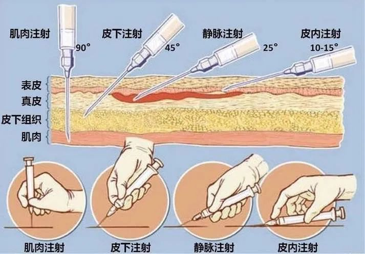
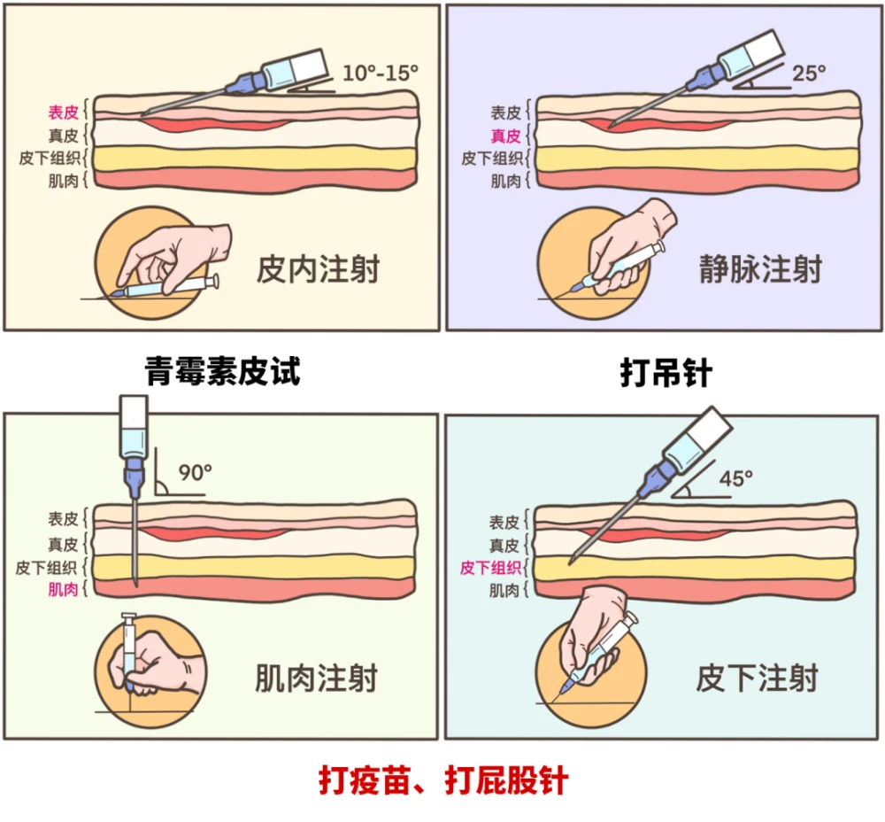

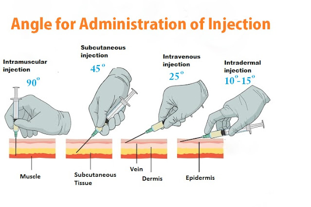

针头的粗细

国际上通用的针头标准单位, 是G. 针头内径一般是 22~31G. **数值越大, 针头越细。**  +
中国的针头标准单位是"号"，与国际相对应的针头一般是 4~7号. *号越大, 针头越粗。*

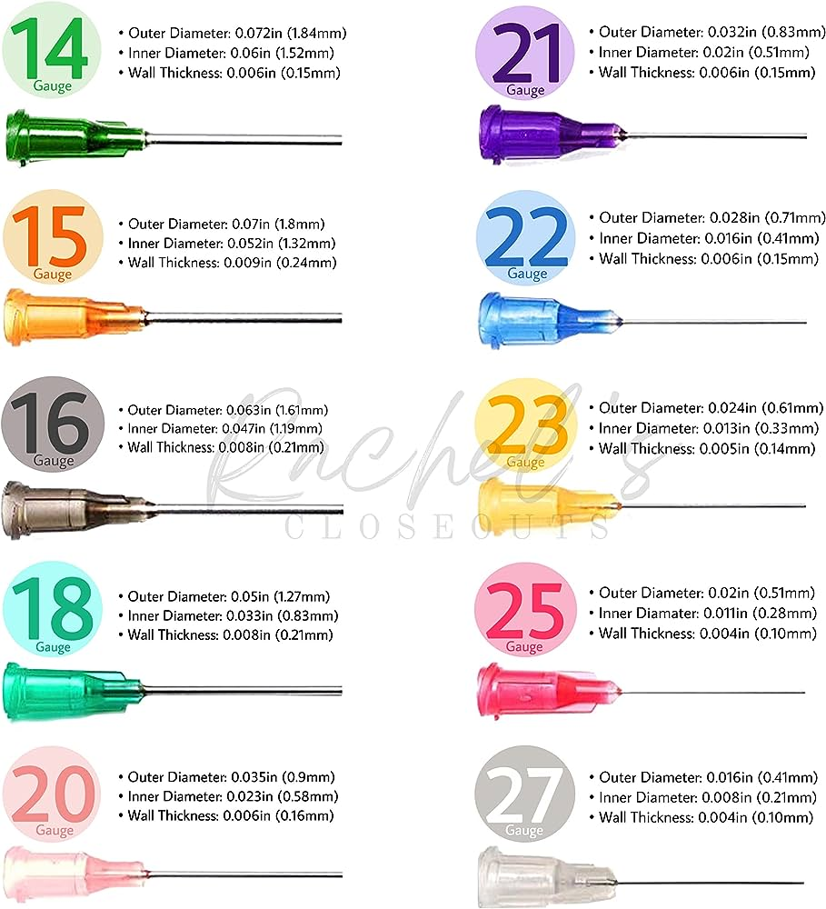

临床上常用的针头, 一般最粗的就是7号，也就是内径为0.5毫米。7号针头一般搭配20毫升以上的注射器。 +
而最小的针头, 一般就是注射"胰岛素"和某些"抗凝药物"的针头了，按照国际单位一般在
29~31G。

当然，不同的注射方法、注射部位, 和针头粗细一般都是相互对应的。**太细的针头打到肌肉里可能会被强烈的肌肉收缩掰断，太粗的针头则根本无法找到皮肤的间隙。**在临床上，腰穿、骨穿、胸穿等操作, 都有相应的专门针头。

不管针头有多粗、打在什么部位，疼的时候也只有进针的那一刹那。*一旦针头扎进去，影响疼痛的关键因素就变成了打的是什么药，以及打了多少药量。*

[.small]
[options="autowidth" cols="1a,1a"]
|===
|Header 1 |Header 2

|皮内注射
|拿"皮内注射"来说，两层皮肤之间只有那么点空间，如果大量注射药物，患者就只能承受皮肤被撑开的痛苦了。

|皮下注射
|

|肌肉注射
|肌肉的间隙比皮内要大些，但是大量注射药物也会造成疼痛。 +
还有许多药物不适合"肌肉注射"，如去甲肾上腺素、钙盐、钾盐、维生素C、各种酸制剂和碱制剂等。肌肉注射这些药物, 会引起局部强烈刺激性疼痛，超剂量注射甚至可能导致局部组织死。

|静脉注射
|静脉注射是否疼痛, 则不太考虑药量，很多住院患者都是从早到晚不间断地输液。这时候最重要的因素就是药物的刺激性了。**临床上最常见的引起疼痛的输液就是"补钾"。因为静脉输入"氯化钾", 会造成血管刺痛.**

很多肿瘤化疗药物, 也会刺激血管。血管被刺激后不仅会疼痛，它**经常痉挛收缩还会导致输液通道阻塞，**患者可能不得不重新再打一针。因此，需要长期输液的患者, 常常要进行PICC置管（Peripherally Inserted Central Venous Catheters，经外周静脉穿刺中心静脉置管）和**"深静脉置管"，也就是把液体输入更粗的大静脉里，这样就可以耐受更大量和更刺激的药物的输入了。**

image:/img/PICC.png[,50%]
|===

为了解决注射疼痛问题，70年代，人们就开始研制不疼的注射器。最早的"无针注射器"于1992年在美国上市，这是一种胰岛素注射器。**糖尿病患者需要长期注射胰岛素，**虽然用很细的针，但每天3次雷打不动，长年累月，还是让很多患者苦不堪言。他们的需求要最先得到解决。

**新型的无针注射器, 就是在进行药物注射时, 不借助针头，而是使用"高压射流"原理，使药液形成较细的液体流，瞬间穿透皮肤到达皮下。很可惜，"无针注射器"只适用于皮下注射，对于其他注射方式无法起到替代作用。** 而且"无针注射器"的价格相对昂贵，注射的效果也没有那么确切，所以它虽然已经上市了20多年，依然没有得到普及。

为了治病，医生发明了注射这种治疗方式。美国儿童医院有一句宣传语：*让孩子哭泣，并拯救他的生命！Make a child cry, save his life!*

.输完液, 没及时拔针，空气会不会输入体内?
"静脉输液"的原理是，通过液体重量产生的正压和大气压, 将液体输入人体周围静脉。因为**人体周围静脉的压力, 高于大气压，**所以输液瓶放得低一点，液体都输不进去了，更别说空气了。 +
只要不加压输液，比如用手挤，是不会发生空气栓塞的，也没有必要因为害怕空气进入身体而提前拔针。

.输液管中的气泡进入血管后, 会不会有危险?
一般小于0.02毫升／千克的空气进入体内，人是不会有任何感觉的。*超过2毫升／千克的空气进入体内，就会使人产生肺栓塞、脑栓塞或者猝死的风险。* +
让我们来计算一下：一个体重为50千克的成年人, 至少需要100毫升的空气，且必须在1分钟之内输完才会致命。因此，即使输液器的管壁上黏附的少量空气泡进入血管，也会被肺吸收，不必惊慌。

.出现回血怎么办?
其实输完液体之后，针头没有及时拔出所导致的回血现象才是问题。那么血会一直回下去，最后导致人失血过多吗？ +
静脉血回到输液管中以后，输液管中的血液就变成了之前的药液。*当大气压力加上输液管中血液的压力，与静脉血管中的血液压力一样的时候，回血就会停止了。* +
因此，输液结束后不及时拔针，确实会导致回血，但只有那么一点点而已。

.会不会形成血栓?
血块确实有可能凝集，但是不必紧张，因为人体有凝血系统和纤溶系统: +
-> *人体受伤出血的时候，"凝血因子"和"血小板", 会在伤口处聚集，形成血栓，止住出血.* +
-> *伤口愈合后，人体的"纤溶系统", 会把血液凝固过程中形成的"纤维蛋白", 分解液化.* +
所以，这么小的血栓，即使推进血管，也会很快被溶解。

.留置针 Indwelling needle 为什么能留置?
**留置针的使用, 能减少反复静脉穿刺所造成的痛苦。基本上，只要患者需要多次输液，就要使用留置针。**  +
中国规定: 外周静脉留置针, 应72~96小时更换一次。

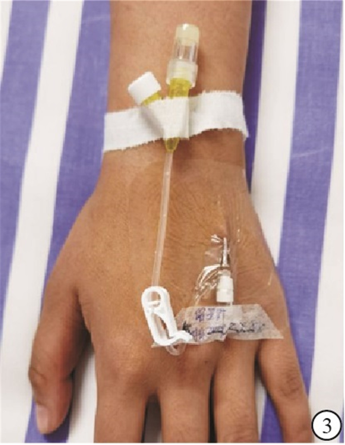
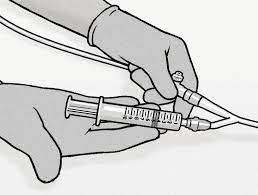

输注对血管有刺激性的药物，如造影剂、术中麻醉药物后，宜进行"留置针"更换； +
**出现"静脉炎"等并发症时, 应立即拔管，更换新的部位重新置管。 **

"留置针"虽然留置时间长，但是**每次使用结束之后都会用"肝素 Heparin"封管。"肝素"是最常见的"抗凝剂"，所以留置针里的血不会凝固，也不会产生血栓。**

.拔针之后需要按压多久?
输液完毕拔针后，护士都会给患者一根棉签来按压针眼。*一般建议，静脉输液拔针后至少要按压3分钟，最好能按压5分钟，这样才能有效防止针眼出血。对于老年患者和
小儿患者来说，按压时间更需延长。*

需要特别注意的是，按压的位置不仅要包含皮肤针眼处，还要覆盖针眼稍微往上一点的地方。这是因为扎针的时候针是斜向上进入皮肤的，刺破血管的位置比皮肤的穿刺点更往上一点。

== 感冒药

无论是否吃药，感冒都有一个自然病程，药物大多只能起到缓解症状的作用。

感冒时最重要的是休息，千万不要“硬扛”！

“*运气坏的医生治病头，运气好的医生治病尾*”，治好感冒并不能体现一个医生的水平高。

普通感冒的小病毒, 只能依靠人体的免疫系统来自然清除，没有什么特效药。

市面上大多数感冒药的成分, 主要有以下几种：

[.small]
[options="autowidth" cols="1a,1a"]
|===
|Header 1 |Header 2

|解热镇痛成分 :
|解热镇痛成分包括: 对乙酰氨基酚、布洛芬、阿司匹林等. 很多复方的感冒药中都会含有。而且它们还有中等强度的镇痛作用和抗炎、抗风湿作用。 +
但是，与此同时**它们也会使患者产生一些胃肠道的不良反应, 和凝血功能的问题。** 所以"解热镇痛药"不可以过量服用.

|抗过敏成分 :
|感冒的时候，我们的皮肤、眼睛、鼻子都处在充血和敏感的状态中。这时候，有一类药物可以对抗"组胺"引起的"毛细血管通透性增加"，阻止"组胺"及其他"过敏反应介质"的释放，缓解"平滑肌"痉挛。

这类药物成分包括: 苯海拉明、色甘酸钠、酮替芬、马来酸氯苯那敏等。 +
它们可以减轻局部充血水肿的症状，缓解鼻塞、流涕、流眼泪等让人感觉很不舒服的症状。*但是，这类药物成分会引起口干、嗜睡等问题。*

|维生素C :
|根据全球最权威的"循证医学"数据库 Cochrane Database 显示，很多研究对维生素C治疗普通感冒的问题进行了持续的关注。从2013年更新的内容来看，**补充维生素C不能减少感冒的发病率，但可能会缩短感冒的持续时间，只是这个作用的可复制性不高。** 所以维生素C到底对治疗感冒有没有用处，目前还没有有力的证据来证实。

|板蓝根 :
|板蓝根是一味中药材. *目前还没有足够的证据表明"板蓝根"能够预防感冒和缩短感冒的时间。*

|抗生素 :
|**"抗生素"对感冒并没有作用。因为感冒大多是由"病毒"感染引起的，而抗生素针对的是"细菌"。**那为什么有些人在因感冒去看病时，医生会给开抗生素呢？这是**为了预防感冒可能会诱发的"呼吸道炎症"。**

|抗病毒成分 :
|注意: 治疗"流感"的药, 对于"普通感冒"可能完全无效。

"流感"和"普通感冒"是不同的:

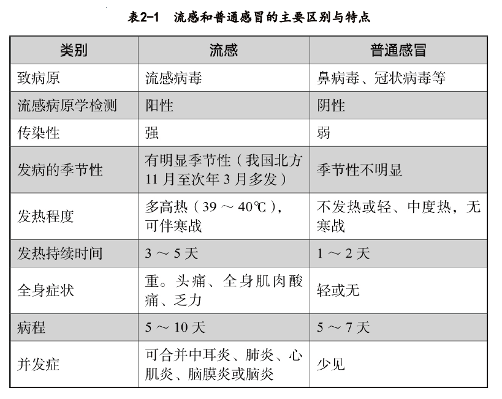

|===

*其实市面上的感冒药, 就是对以上几种有效成分进行"排列组合"。*

根据症状选择感冒药:
[.small]
[options="autowidth" cols="1a,1a"]
|===
|症状 |<- 药

|发热、头痛
|需要含有"解热镇痛"成分，如: *对乙酰氨基酚、阿司匹林、双氯芬酸等。*

|鼻塞
|感冒会鼻塞, 主要是因为鼻腔充血. 所以我们需要一些可以减轻此种症状的药物，比如"*伪麻黄碱*"等。

发热、头痛和鼻塞, 基本上是所有感冒的症状，也就是"上呼吸道感染"患者共有的症状，这也就是"对乙酰氨基酚"和"伪麻黄碱"会成为感冒药必备成分的原因。

|流鼻涕
|感冒时不停地流鼻涕，**需要使用"抗组胺"的药物来减少鼻涕的分泌，**同时也可以减少打喷嚏。**这类药物有一些镇静作用，**比如"*苯海拉明*"。在白天吃具有镇静作用的药物会使患者出现困倦、注意力难以集中等症状. 而这种镇静作用在晚上则表现为助眠.

*鼻塞和流鼻涕这两个症状, 还长期困扰着"慢性鼻炎"或"过敏性鼻炎患者"。很多患者会误以为自己得了感冒，就服用感冒药，但是你在不知不觉中也服用了很多不需要的药物成分。*

|咳嗽
|咳嗽是"上呼吸道感染"的后期症状。**"右美沙芬"是强效的镇咳药物，**也有很多药品生产商把镇咳成分混入感冒药物中.

**需要注意的是，咳嗽可能伴有"肺部炎症"，**如果再有发热的症状，患者可能就需要酌情增加抗生素。虽然官方一直在强调严格控制抗生素的应用，严格把握适应证.

虽然感冒引起"肺炎"的概率并不大，但是总会出现. 还有些感冒会导致"心肌炎".

|困倦
|*很多感冒药里含有"咖啡因"。咖啡因是一种"中枢兴奋剂"，一来可以帮助感冒患者对抗萎靡的精神状态，二来可以抵消许多抗过敏药物中的镇静成分。*
|===

以上感冒药并不能改变感冒的自然病程。即使你去打针、输液，也不能加快身体康复的速度。所有的药物仅仅是让你在感冒期间舒服一些而已。

很多疾病都像感冒一样，有自然的病程。学医的人都知道**“运气坏的医生治病头，运气好的医生治病尾”.** 很多患者都会有这样的经历: 去了医院后病反而越看越严重了，后来自己回家休息了一阵子或者找了个老中医后病就好了. 要知道，很多疾病就是如此，需要经历由轻到重，最后缓解的过程。大部分感冒不治疗也会自己缓解，所以**得到怎么样的治疗效果就看你在哪个阶段去看医生了。**

== 头痛

*头痛的原因, 就是头部疼痛敏感的组织纤维, 过度放电.*

**大脑本身是没有痛觉的，**这也是神经外科医生可以在患者清醒的情况下, 完成大脑手术的原因。*头骨也不会有痛觉。有的人说“头疼得快要裂了”，其实那不是骨头的疼痛，而是因为我们没办法找到准确定位；还有就是颅腔的体积有限，很多时候我们感受到的胀痛好像要胀裂头骨。*

2013年，国际头痛学会推出的最新指南把头痛分成14大类，每一大类中又有很多小类，加起来有100多种。

总的来说，头痛按性质不同, 可以分为两种: "器质性头痛"和"功能性头痛":

- 器质性头痛: 原因可查. 是由神经变性、血管损伤, 或者炎症、长了肿瘤等情况导致的。
- 功能性头痛 : 病因难解. 影像学、化验检查等都没法查出问题. 它通常症状相对轻微、不易致命，但是其中很多也难以缓解，患者不得不饱受煎熬。

头痛可见于多种疾病中，大部分没有特殊意义。比如，全身感染会头痛，精神紧张会头痛，过度疲劳也可能会头痛。但是，*反复发作或者持续的头痛, 可能是某些疾病的信号，需要引起重视。*

总结来说，头痛有以下几种病因：
[.small]
[options="autowidth" cols="1a,1a"]
|===
|Header 1 |Header 2

|血管的原因 :
|*血管是非常敏感的，血管里的血液多了或者少了，血管破了、痉挛了，大脑里长了东西牵拉或者压迫了血管，都会导致严重的疼痛。*

|脑膜 meninges 的原因 :
|*脑膜也是十分敏感的痛觉感受器。脑膜的炎症、肿瘤的挤压、外界的刺激都会导致剧烈的疼痛。*

*脑膜，指的是颅骨与脑间有三层膜，由外向内为"硬脑膜"、"蛛网膜"和"软脑膜"；三层膜合称"脑膜"。*

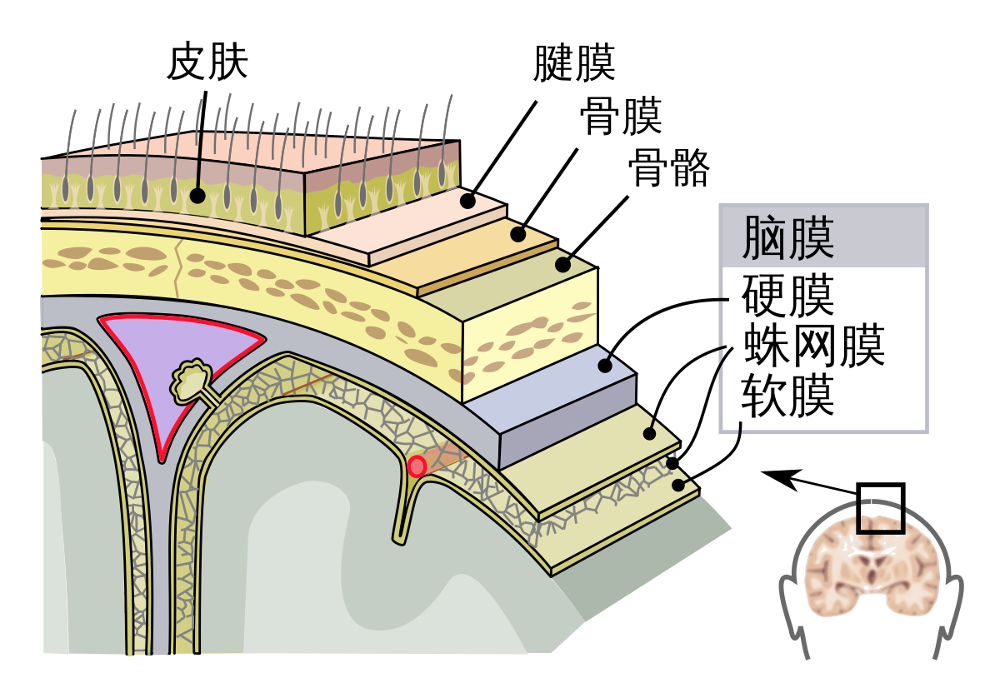
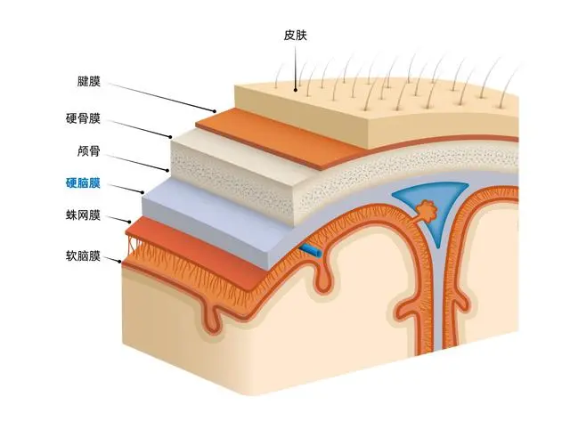
image:img/meninges2.jpg[,45%]

|神经的原因 :
|大脑共发出12对脑神经 Cranial nerve，其中一部分是感觉神经，一部分是运动神经，还有一部分两者皆有。*具备感觉功能的神经受到刺激、挤压和牵拉, 同样会导致头痛。*

脑神经（英语：cranial nerve），又称"颅神经"，属于周围神经系统，**它们是直接由脑发出的，区别于由脊髓发出的脊神经。** +
**脑神经在脑和身体各部分之间传递信息，主要是往返于头部和颈部的区域，**包括视觉、味觉、嗅觉和听觉等特殊感觉。 +
部分脑神经属于"传出神经"，部分为"传入神经"，其余的为"混合神经"（同时含有传出神经纤维, 和传入神经纤维）。

在人体中，传统上认为一共有12对脑神经，*其中有10对分布于头面部；除第1及第2对外，其余10对脑神经都是从"脑干"发出。*

"脑神经"有着重要的功能：视觉、嗅觉、听觉、味觉、平衡觉均由脑神经传递，人类丰富的面部表情也由脑神经控制。 +
脑神经中的"迷走神经", 参与构成"自主神经系统"。

.以下为几种背诵口诀：
- 嗅视动滑三外旋， 颜听舌迷副舌下。
- 一嗅二视三动眼， 四滑五叉六外旋， 七颜八听九舌咽， 十来迷走副舌下。
- 一嗅二视三动眼， 四滑五叉六外旋， 七颜八听九舌咽， 十迷走来十一副，十二舌下神经束。

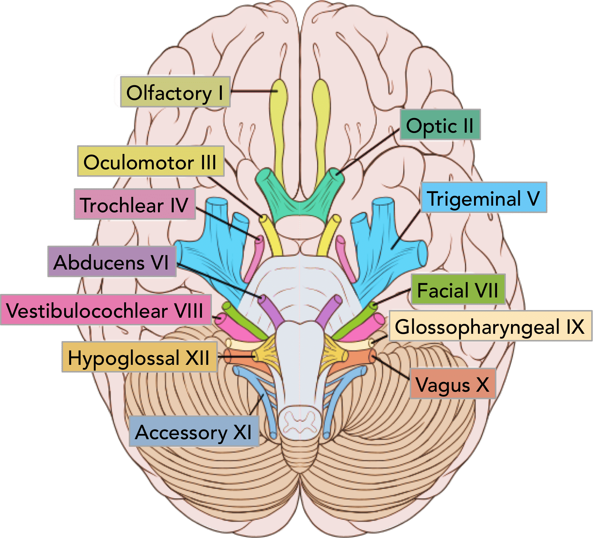
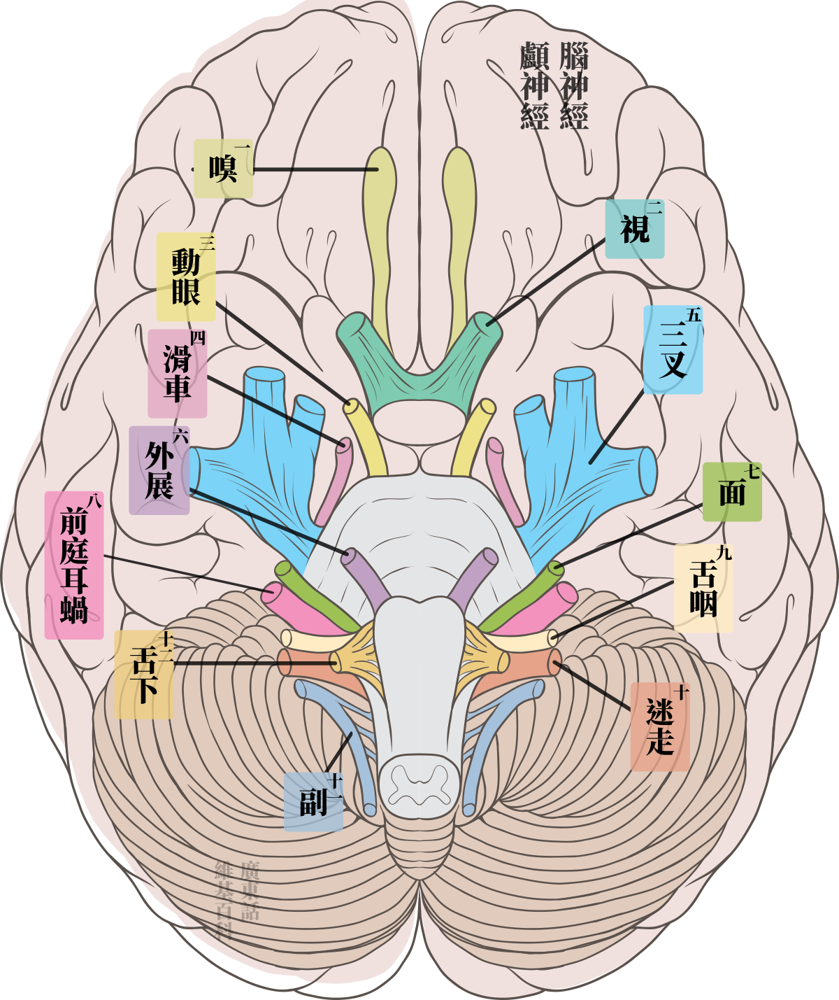
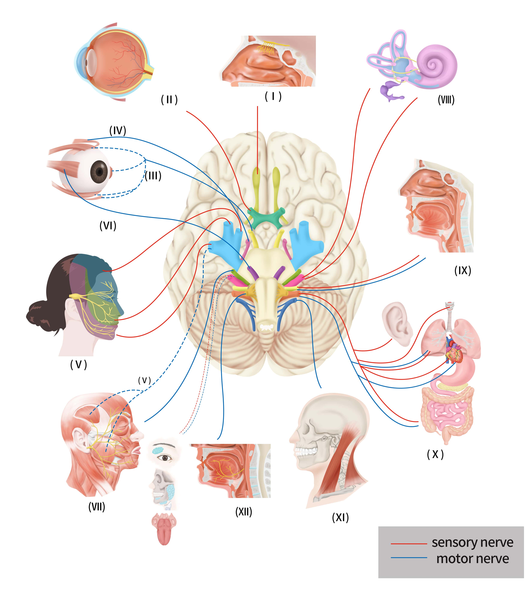

|眼耳鼻的原因 :
|眼睛、鼻子和耳朵的问题也会引起头痛，而且很多时候我们并不能辨别具体是哪里导致了头痛。有时候耳、鼻、眼出了问题导致的头痛，耳朵、鼻子和眼睛本身反而不会有疼痛感。

|全身的原因 :
|这里指的是由内分泌紊乱、全身疾病引起的头痛。*血液里的生化水平改变了，激素水平改变了，也可能引起头痛。*

|精神和心理的原因 :
|焦虑等心理问题也会引起头痛。
|===

头痛的类型:

[.small]
[options="autowidth" cols="1a,1a"]
|===
|Header 1 |Header 2

|突发的急剧头痛，持续不减
|**这种症状一看就非常严重，**相信大家都不会掉以轻心。**出现这种情况的最大可能性就是颅内的血管性疾病，血管突然破裂，出血刺激会引起头痛持续不减。如果出血继续的话，患者很可能很快出现意识障碍或者偏瘫、失语等。遇到这种情况，只有一句话——快速就医。** +
**而且这种情况中的很大一部分需要进行介入或者手术治疗，至少也要严密观察，所以尽可能去正规的大医院，**小诊所是解决不了问题的。

|长期反复发作的头痛
|临床最常见的原发性头痛类型，以发作性中重度、搏动样头痛为主要表现。头痛多为偏侧，一般持续4~72小时，伴有恶心、呕吐等症状，光、声刺激或日常活动均会加重头痛，安静的环境、休息则可缓解头痛。

大部分人在就诊之后都会得到"偏头痛"的诊断。**对于偏头痛，目前尚无特效治疗方法，只能预防和减轻症状，**也就是尽量改善生活方式、**避免诱发因素，**以及发作的时候减轻头痛症状。

|进行性加重的头痛
|*这是一种尤其需要引起重视的头痛。它一般表现为"全头痛"，疼痛越来越重，很多时候为胀痛。这种情况经常与颅内占位性病变有关，简单地说，就是大脑里可能长了东西，压迫到了神经和血管，由此引发了疼痛。也就是说，这种情况需要考虑是不是大脑里长了肿瘤。*

虽然脑肿瘤中有不少呈恶性表现，*但是肿瘤增加的速度一般还不足以让疼痛在几天内加重。那么疼痛的加重是由什么引起的呢？一般的原因是"脑水肿"和"脑积水"。"脑水肿"的原因有很多，比如压迫颅内的静脉回流, 导致血流不畅、细胞的炎症反应等。人的颅骨很硬，而且容纳量非常有限，里面的脑组织稍微有一点肿胀, 就会引起强烈的不适。*

**大脑是泡在液体里的，也就是"脑脊液"，它有一个循环系统。当这个循环系统受阻的时候，就可能引起严重的头痛。**人每天分泌的脑脊液有400~500毫升，差不多是一大瓶水的容量，但是人体脑脊液循环的容纳量只有100~150毫升。简单来说，如果下水道被完全堵塞，只需要几个小时上面就憋得受不了了。

*如果肿瘤导致了周围脑组织的肿胀和脑脊液循环的阻塞，头痛就会进行性地加重。这样的情况需要尤为重视，因为越早切除肿瘤，治愈的概率越大。*

*如果这样的头痛突然加重，患者甚至出现了意识障碍，则提示可能出现了"脑疝"。此时需要紧急送医进行手术，这种情况真的可以说是跟时间赛跑，时间就是生命。*

|头痛伴有其他症状
|伴有其他症状的头痛:

.伴高热：
一般是颅内感染的表现，

.伴头晕：
常常提示为小脑半球的问题，可能是肿瘤，也可能是轻微的梗死。但更多的是基底动脉的供血不足，可能是由颈椎问题引起的。

.伴视力障碍：
眼睛突然看不见或者视力突然下降，大多数是由青光眼或者颅内的肿瘤压迫了视觉的传导通路导致的。

.伴精神障碍：
额叶肿瘤的可能性非常大。

.伴癫痫发作：
*癫痫也就是我们常说的羊角风，可能由肿瘤、血管畸形或者寄生虫引起。出现癫痫不是小问题，每次发作都是对大脑功能的损害，需要尽快控制癫痫的发作。*

|偶然发作的轻度头痛，兴奋、劳累之后的头痛自行缓解
|没什么诱因出现的头痛只要能很快缓解，比如睡一觉之后就好了，一般问题也不大。
|===

== 传染病 : 流感

**"流感"不同于"普通感冒"，它的并发症较多，导致死亡的可能性也更大。**区别于普通感冒的是，在得了"流感"的人群中，年轻人和身体非常强壮的人死亡率较高。

流感最厉害的是, 有强大的变异能力。我们接种的流感疫苗, 只针对最近流行的主要亚型，对其他亚型无效，更不要说明年春天的新亚型流感。

[.small]
[options="autowidth" cols="1a,1a"]
|===
|Header 1 |Header 2

|西班牙流感
|流感中的一个亚型——西班牙流感.  第一次世界大战, 死亡超过1 000万人. 而战争后期暴发的西班牙流感, 则夺去了4 000万人的性命，导致了战争的提前结束。*西班牙流感在18个月内神秘地消失了，因此其病株从来没有被真正地确认过。* +
由于这场流感中死者的遗体都已经被焚毁，再加上重新合成病毒的危险性，人们对流感的研究一直举步维艰。

|疯牛病 Mad Cow Disease
|人一旦食用了被疯牛病污染的牛肉，就有可能染上致命的"克罗伊茨费尔德-雅各布氏症"，简称"克-雅氏症"。其典型临床症状为: 痴呆或神经错乱、视觉模糊、平衡障碍、肌肉收缩等。患者最后会因为大脑的损害而死亡。

其病源是"朊病毒 Prion". "朊"是蛋白质的旧称，**朊病毒意思就是蛋白质病毒，**朊病毒严格来说不是病毒，*是一类不含核酸, 而仅由"蛋白质"构成的具感染性的因子。* 朊病毒是空间构型改变了的正常蛋白质，是正常蛋白质"变性"所致。

目前针对疯牛病, 并没有什么治疗方式.

|禽流感
|它对人的致病性并不算太高，致死率也不高。但是禽流感病毒具有"血凝素 hemagglutinin"结构，所以虽然它一般只感染禽类，但当它在复制过程中发生基因重配，致使结构发生改变时，就会获得感染人的能力。

.血凝素 (血球凝集素) :
是指可使"红血球"凝集的抗体或其他物质。 在流感病毒、痳疹病毒（以及许多其他细菌和病毒）表面等均能找到，可附著于不同动物的红血球，而使红血球凝集。严重时可致死。

疯牛病的传播主要通过进口牛肉，所以其传播速度较慢，*毕竟牛的流动性比较低。但飞禽就具有极大的流动性了.*
|===

== 艾滋病

艾滋病的四大传播途径是: 性接触, 不洁注射, 血液, 母婴.

[.small]
[options="autowidth" cols="1a,1a"]
|===
|Header 1 |Header 2

|性接触
|- 男同性恋人群艾滋病抗体阳性率, 在近几年一直维持在8%以上，已经成为我国艾滋病感染的第一高危人群。

|不洁注射
|- 吸毒者共享针头或注射器, 是传播艾滋病的高危行为.
- 以前, 有些村子里因大批村民卖血，*因卖血贩子重复使用不经消毒杀菌的针头, 血袋, 导致全村感染艾滋病。* +
而且，血站还会对血液进行"单采"，即有的需要血浆，有的需要血小板等等。当村民们的血液被抽出来放入袋子(已被艾滋病病毒污染)后，“血站”利用离心机分离出来他们想要的东西，之后又将剩下的“血液”重新注入村民体内。 +
后来, 随着国家严禁非法卖血, 及对血制品统一管理后，艾滋病经血制品传播的报道就很少了。

|血液
|

|母婴
|

|===

艾滋病由感染"人类免疫缺陷病毒"（HIV，即"艾滋病病毒"）引起。HIV是一种能攻击人体免疫系统的病毒。**它把人体免疫系统中最重要的"T淋巴细胞"作为主要攻击目标，大量破坏该细胞。**它全面摧毁人类的免疫系统之后，微不足道的细菌病毒都能给身体带来毁灭性的后果。

**艾滋病病毒在人体内的平均潜伏期, 为 8~9年，**所以人在确诊艾滋病以前可以没有任何症状地生活和工作多年。患者可以通过药物控制病毒复制，使其在体内保持较低水平，从而使患者长期不发病。

艾滋病的特效疗法尚未找到。目前也尚无疫苗能够预防艾滋病.

**有一种鸡尾酒疗法，即“ 高效抗反转录病毒治疗”  Highly Active Antiretroviral Therapy，HAART, 是通过联合使用三种或三种以上的抗病毒药物, 来治疗艾滋病。这种疗法可以减少单一用药产生的抗药性，**最大限度地抑制病毒的复制，使被破坏的机体免疫功能部分甚至全部恢复。即, 它可以控制艾滋病病毒的数量，使人一直作为艾滋病的带菌者, 而不发病。

即使可控，艾滋病的治疗却远远没有达到理想的状态。**人类唯一能庆幸的是艾滋病传播能力不强，除了前面提到的四种传播方式，一般的接触并不会传播此病。但如果有一天艾滋病发生了变异，跟其他传染病一样可以通过飞沫传播, 或通过禽类携带，那时谁还敢保证人类能赢得此次战争？**

== 慢病毒 Lentivirus

"慢病毒"是逆转录病毒中的一类，一般潜伏期较长，因此得名慢病毒。*慢病毒感染的显著特点是: 感染个体在出现典型的临床症状之前，大多经历长达数年的潜伏期，之后缓慢发病，因此这些病原体被称为慢病毒。* 例如人类免疫缺陷病毒(HIV)、猴免疫缺陷病毒(SIV)、马传染性贫血(EIA)、猫免疫缺陷病毒(FIV)都是"慢病毒"属，慢病毒属的原文是 Lentivirus，其中 Lenti- 在拉丁文中有"慢"的意思。

慢病毒能够能够穿透"细胞核膜". 而大多数的"逆转录病毒"就没有穿透"核膜"的能力，只能等待"有丝分裂"时进入核中。

慢病毒对"分裂细胞"和"非分裂细胞"都能实现高效的感染。

.外源基因
外源基因: 是指来源于所关注或研究的生物体之外的基因。将"外源基因"导入生物体的过程(其实就是"基因改造"), 称为"转化"。导入的"外源基因", 可以导致被插入"内源基因"的突变或表达改变。

"慢病毒载体"可以将"外源基因"有效地整合到宿主染色体上, 达到基因治疗效果。

目前，最常用的慢病毒载体（Lentiviral Vectors, LV）是基于人类免疫缺陷病毒（HIV）而来。

== 针对"传染病"最重要的不是治疗，而是防控.

传染病促成了"公共卫生学"和"流行病学"的诞生。

中国把传染病分为甲、乙、丙三类。

甲类传染病, 也称为"强制管理传染病"，包括鼠疫和霍乱。防疫部门对此类传染病发生后, 报告疫情的时限，对患者、病原携带者的隔离、治疗方式，以及对疫点、疫区的处理等, 都有明确的规定。也就是说，人一旦发病，就会被强制隔离.  +
其余我们经常听说的疾病, 都属于乙类或丙类传染病。

三个重要的概念：消灭、消除, 和控制。

目前, 传染病中只有一种被人类消灭 -- 天花。 原因是:

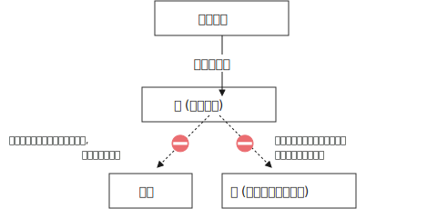

除此外, 很多疾病还是不能被人类"消灭"，只能被"消除"。消除是指在一个地区范围内(而非全球)，让某种传染病消失。*比如鼠疫，因为老鼠是重要的宿主，所以只要老鼠不灭绝，鼠疫就永远无法被消灭。*

== 急救

心脏按压、人工呼吸和电击除颤是抢救心跳呼吸骤停的最有效方法。

掐"人中"不仅没有用，还会错过心脏按压的重要时间。

烫伤抹牙膏、摔倒揉一揉、流鼻血仰头、骨折扳回来、癫痫发作时嘴巴塞筷子，都是错误的！

对于真正"心源性昏厥"和"心脏停搏"的患者来说，去"掐人中"肯定会错过最佳的救护时间。*现代医学已经证实，真正有用的方法是"心脏按压"*:

- *心脏按压不仅能刺激心脏再次跳动，还能代替心脏搏动的作用，保证大脑等重要器官不至于缺血坏死。如果没有及时按压，几分钟之后，即使患者心跳恢复了，大脑也会因为缺血而完全坏死，人也就成了我们所说的植物人。*
- *按压的时候, 还得进行"人工呼吸"，否则会没有氧气，不能保证大脑的供氧。*

急救医生拿两个熨斗一样的东西在患者身上电击 -- *"电击除颤"的确是终止心室颤动的最有效方法。患者晕倒并不一定是心跳停止，很多情况是心脏受到了打击而出现了活动紊乱。这种紊乱一般称为心室颤动，一旦出现，心脏就不能正常泵血，患者也会随之昏迷。* +
*电击除颤 : 是用外部的电流, 强行终止心脏所有的电活动，等待心脏重新开始电活动 (相当于重启电脑)。心脏必须在一定时间内重启，否则时间长了人脑就会因为缺血, 而形成不可逆的损伤。*

*心脏按压、人工呼吸, 和电击除颤, 是抢救"心跳呼吸骤停"的最有效方法。*

与外科学一样，急救医学的大规模发展, 也源于战争。军医们通常采用黑、红、黄、绿四色来评估伤员的情况。其中黑色代表死亡，红色代表重伤，黄色代表中度伤，而绿色代表轻伤。现场的救治原则是: 重伤员第一优先，中度伤员第二优先，轻伤员稍后处理，死亡遗体最后处理。

*学会急救，应该是人的常识. 平时没有遇到突发状况时，人们不去关注急救知识; 一旦遇到了状况，想要做些什么，就会手足无措。* 普及普通人的急救知识才是最有效的方式。因为专业的急救人员不可能随时随地出现，等他们到达时，很多患者都错过了最佳抢救时机。

每个国家都有自己的急救电话号码。美国是911，日本是119，英国是999.中国的全国统一急救号码是120. 北京红十字会还有个999急救电话。不同于120的是，999是民间急救组织电话。

.急救医生的前途生态

当前，急救人员供不应求。很少有人愿意做急救医生，归根结底还是因为工作太累、收入少、职业发展差、每天在路上不分寒暑地跑，所以能转行的差不多都转行了。 +
北京协和医院, 虽然是中国医疗的殿堂级医院，但依然留不住急诊医生。近几年在北京协和医院培训的120急诊医生大约有几十人，最后没有一个人能坚持留下来。

120急救中心的急救医生, 主要负责"院前急救"; 医院的急诊科医生, 则负责"院内急救"。**一般认为 120急救中心最苦，急诊科次之。** +
医院内的急诊科医生虽然不用东奔西跑，但也绝不轻松。都得24小时随时待命。**急救医生自己的休息时间都难以保证，更谈不上去照顾家庭。**因此，很多急救医生都是恨不得立刻转行。

请设想一下，在患者最危急的生死时刻，如果给予急救的医生心中带着怨气, 或者抱着当一天和尚撞一天钟的态度，你还能放心吗？(所以急救措施得靠普通人自己，你一定要学习掌握住!)

急救技术说起来不难，但是背后折射出许多社会问题。怎样才能让急救医生获得尊严和尊重？又怎样才能让每一个普通人在遇到突发状况时, 可以没有后顾之忧地第一时间去施以援手呢？(我们面对的是一个连老人都不敢扶的社会.)

普通人急救中的误区有 :

.误区1：烧、烫伤之后抹牙膏、酱油等

老人常在烧、烫伤伤口上涂抹牙膏. 殊不知**牙膏中的化学物质，包括氟化物，反而会造成伤口进一步侵蚀和疼痛。**

除了牙膏，酱油、凡士林、油性药膏等, 也是急诊室里经常碰见的涂抹物。其实**在烧、烫伤伤口上涂抹这些莫名其妙、 未经消毒杀菌的东西，只会徒增伤口感染的机会。涂抹油性的东西, 更是会把热隔绝在已受伤的皮肤里面，让热的伤 害持续更久。**

烧、烫伤后的正确做法应该是：

[.small]
[options="autowidth" cols="1a,1a"]
|===
|Header 1 |Header 2

|-> 远离热源
|小心地脱掉烧、烫伤处的衣物，让伤口裸露。 +
如果衣物粘在皮肤上不能脱下，可以用剪刀剪开，不要强行脱下，以免对伤口造成二次损伤。

|-> 降温散热
|刚被烧伤、烫伤的伤口处会有大量余热，所以**需要做降温散热处理，否则深层皮肤也会被烫伤。**常见的方法是马上用自来水冲。要注意，*冲的时间要比你感受到凉意的时间长，以帮助深层降温。*

|-> 水疱处理
|**烧、烫伤引起的水疱是需要挑破的，否则容易化脓感染，对伤口恢复不利。** +
- 小水疱用消毒针头低位挑破，把水放干； +
- 大水疱可用消毒剪刀剪开一个口，把水放干。 +

*水疱挑破后疱皮不要剪掉，更不能用手撕掉。疱皮能够保护创面，防止伤口感染发炎。*
|===

.误区2：流鼻血时仰头、举胳膊等

**流鼻血时仰头, 不仅对止血毫无帮助，还会使鼻血倒流回咽喉、食管、气管和胃，**引起我们身体上的不适和恶心。*若出血量很大，仰头还易把血呛入气管及肺内，造成"吸入性肺炎"，甚至有引起窒息的危险。*

况且，*鼻腔的黏膜血管收缩, 受"交感神经"控制，而"交感神经"属于自主神经，也就是不受人的意识控制。* 换句话说, 鼻腔的黏膜血管不是你想收缩就收缩的，也不是抬抬胳膊就能导致其收缩的。

冰敷, 在理论上可以促进血管收缩，但是临床验证的效果并不明显.

正确的做法应该是：**一旦发生鼻出血，要及时进行局部压迫，让患者低头、张口呼吸、用拇指和食指捏住双侧鼻翼，向后上方压迫，一般在数分钟后多可止住出血。**

有一些鼻出血是由全身性疾病导致的，所以在进行局部压迫的同时，还要进行全身性治疗。

**压迫应至少持续5分钟，然后检查出血是否停止。**通常鼻血在5~10分钟后停止。*如果压迫两次之后，出血仍止不住，应到医院进一步诊治。*

.误区3：崴脚扳一扳，摔伤揉一揉

殊不知，*小包会揉成大包，骨裂会扳成骨折。头皮的血肿揉一揉，不仅不能缓解疼痛，还会在刺激到伤处时加速血液循环，从而加重出血。摔到腿、扭伤、抽筋给扳成了骨裂，轻微的骨裂给扳成了错位，这样的情况屡见不鲜。全身任何部位受伤，揉都起不到任何作用。*

正确的做法应该是：

（1）四肢受伤: 早期最重要的是固定和保护，冰敷可以减少肿胀。

（2）**头部摔伤需要注意 : 除了头上的包不能揉之外，还要观察患者的精神状态和饮食情况。**换句话说，如果患者精神正常、吃喝正常，那问题应该不大；*如果患者精神不振、昏昏欲睡、胡言乱语、频繁呕吐，就需要及时送医了。*

.误区4：癫痫发作时往嘴里塞筷子

有人会问，如果不塞东西，患者不会咬伤舌头吗？答案是不用担心。现实中确实有人因为癫痫发作, 而咬伤自己舌头和嘴唇的情况，但这都是皮外伤，不会致命。*相比于在口腔内放入异物引起窒息，这点皮外伤根本不值一提。所以，两害相权取其轻。*

临床上有很多这样由于塞东西, 而导致患者反受其害的病例。**患者在处于抽搐状态时，不单单四肢的肌肉会抽搐，口腔的肌肉也是痉挛的，且上下颌牙齿紧咬。**因此，此时往患者嘴里强行塞东西，很可能会出现以下几种情况：

（1）*强行撬开患者的嘴巴，导致嘴唇撕裂。* +
（2）*尖锐的勺子、筷子末端插入口腔深部侧壁组织，造成口腔内持续性出血。* +
（3）*塞毛巾或者衣服，导致患者窒息。*

除此之外，*在患者四肢抽搐抖动时，多数人会习惯性地去按压，但这样有可能导致患者关节脱位、骨折, 或者施救者自己受伤。也不要喂水、药和食物，因为患者意识不清醒，所有进入口腔的东西都有导致窒息的风险。*

正确的做法应该是：

（1）为防止患者受伤，*可以扶住他缓慢躺下，并清除身旁的凳子及其他尖硬物品，防止患者肢体抽搐时被物品碰伤、划伤。* +
（2）*缓慢翻转患者，使其呈侧卧位，以方便口腔分泌物流出，避免窒息。该体位还可以防止舌头后坠、堵住呼吸道。* +
（3）*松解过紧的衣物，比如解开领带、领结，松开衣领等。* +
（4）*保护头部，用毛巾或厚衣服稍稍垫高头部。* +
（5）陪伴等待，记录时间。

.误区5：晕倒掐人中

有人晕倒了怎么办？也许很多人下意识地就要去"掐人中", 因为中医认为"掐人中"是一种强烈的疼痛刺激，会引起呼吸循环中枢的兴奋，对癔症性的意识障碍可以起到促醒的作用。但是，这种方式在临床上主要是针对晕厥的患者。*它不仅对大多数患者无效，甚至还会使患者产生生命危险。*

**人在仰面倒地的时候，大多数气道是开放的。而"掐人中"则时常要把患者的头抱起来，**抠住下巴的手往下用力按压，**这反而可能使患者的气道产生闭合。气道呈90°的夹角，若舌头把气道堵塞住，则会引起窒息。** +
*很多患者昏迷时，会同时伴有呕吐。如果按压不正确使气道闭合，则可能会使呕吐物周围的小空当也被堵住了，从而导致患者窒息缺氧死亡。*

还有一些老人认为，掐人中需要用很大的力气才有效。而**在施救时力度过大, 很容易造成牙齿松动, 或者戴假牙的老年人假牙脱落，并使其掉入气道中，导致患者窒息而死。**

正确的做法应该是：遇到晕厥的人，首先要判断其是否有心跳、呼吸停止。*如果患者生命体征消失，则需要立即实施心肺复苏。如果患者仅仅是晕厥，那施救者首先要做的事并不是把他叫醒，而是保证他的安全，这个安全包括环境安全和呼吸循环稳定，然后立刻拨打120，将其送医处理。*

== 献血

我国采取无偿献血制度。

服用药物后3天内不宜献血；献血当天可以按照往常的习惯进食，但不宜吃肥肉、鱼等高脂肪或高蛋白的食物；献血前不宜饮酒；保持睡眠充足，不宜做剧烈运动。

**人一共有多少血? 成人的平均血量是4升左右，**大概相当于全家装的可乐瓶2瓶，一斤装的白酒瓶4瓶，倒出来大概有一大盆，装到桶里有大半桶。

升 liter : 1L =1000mL(毫升) =0.001立方米 *=1立方分米* =1000立方厘米 +
1mL =1立方厘米 =1cc +
1立方米= 1000升

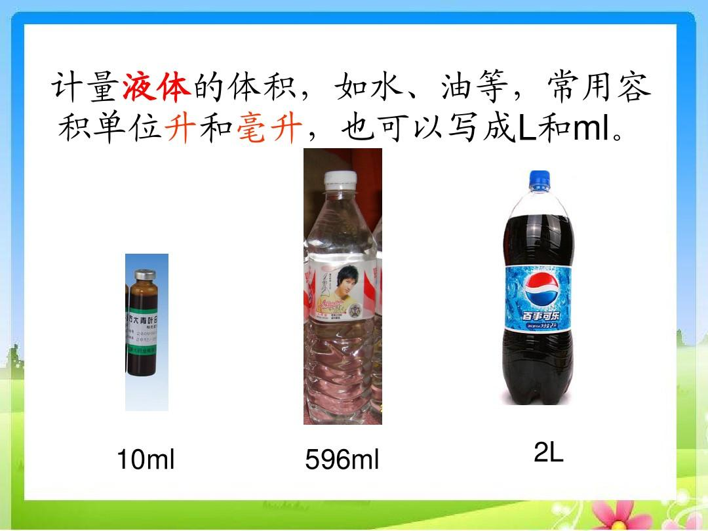
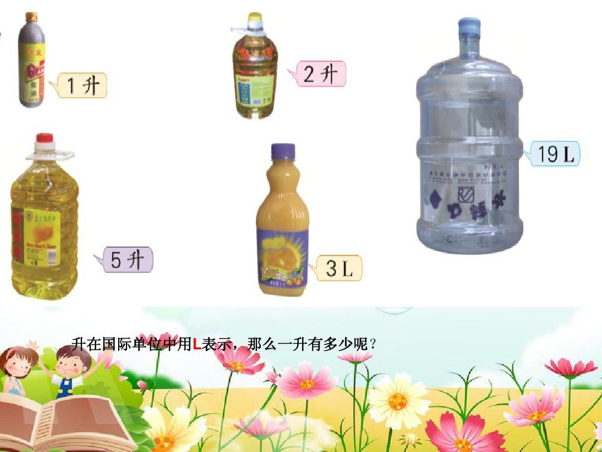

一个人的血量是4升，**失血超过30%就会出现严重的反应。** +
在外科学还没有高度发展的早期，长时间的复杂手术导致患者出血1~2升的情况较为常见。如果患者血流干了，就撑不到手术结束；但是如果能边出血边输血，情况就不一样了。

"自体血回输"技术, 大大地增加了患者自身血容量的库存。准备做手术的患者先把血抽出来，作为手术用血的储备；或者手术中出的血经过过滤后，再输回患者体内。这样做不仅不用担心血型、疾病传播等问题，还大大节约了血液资源。

**人类的"红细胞"中, 主要含有两种不同的"凝集原"，分别称为A和B。**根据红细胞所含"凝集原"的不同，Karl
Landsteiner 把人类的血液分为4种基本类型，即O、A、B、AB型。**红细胞中含A凝集原的, 为A型; 含B凝集原的为B型，含A和B两种凝集原的为AB型，两种凝集原都没有的为O型。** +
**血型相同的人之间输血，就不会发生"溶血"现象。**没有"凝集原"的人供血，有"凝集原"的人受血，一般也不会发生溶血现象。

溶血 Hemolysis: 即**红细胞破裂，血红蛋白逸出称红细胞溶解**，简称溶血。  +
有多种原因均可引起溶血 : 在体外，如低渗溶液、机械性强力振荡、突然低温冷冻（-20℃～—25℃）或突然化冻、过酸或过碱，以及酒精、乙醚、皂碱、胆碱盐等, 均可引起溶血。

人血浆的等渗溶液为0.9%NaCl溶液，**红细胞在低于0.45%NaCl溶液中，因水渗入，红细胞膨胀而破裂，血红蛋白逸出。**在体内，溶血可为溶血性细菌或某些蛇毒侵入、抗原-抗体反应（如输入配血不合的血液）、各种机械性损伤、红细胞内在（膜、酶）缺陷、某些药物等引起。溶血性细菌，如某些"溶血性链球菌"和"产气荚膜杆菌"可导致"败血症"。*疟nüè原虫破坏红细胞,* 和某些溶血性蛇毒含卵磷脂酶，使血浆或红细胞的卵磷脂转变为溶血卵磷脂，使红细胞膜分解。

**在ABO血型系统之外的新的人类血型系统，即Rh系统。**它不但与输血有关，还与新生儿的溶血症有关，尤其是白种人。 *在汉族人中，Rh阴性血只占1%，也就是我们常说的“熊猫血”。*

**人的血型, 通常是由红细胞表面某些可遗传的**糖蛋白及糖链构成的**抗原决定。**血型系统已经被发现有超过30种。"Rh血型系统"是已分类的红细胞血型系统中最复杂的一类.

人们大多知道血型有四种类型，即A型、B型、O型、AB型，它们都属于ABO血型系统。其实，血型不止这四种，而是有数十种类型或系统，庞大复杂。由于A型、B型、O型、AB型以外的血型抗原性大都不强，所以临床医学家认为，除上述四种血型外，再加上"Rh血型系统", 是临床上应用最广, 也最为重要的血型。

Rh是恒河猴（Rhesus Macacus）外文名称的头两个字母，人类红细胞血型由多达二十多种的血型系统组成，*ABO和Rh血型是与人类输血关系最为密切的两个血型系统。*

当一个人的红细胞上, 存在一种D血型物质（抗原）时，则称为Rh阳性，用Rh（+）表示；当缺乏"D抗原"时, 即为Rh阴性，用Rh（-）表示。

有Rh抗原的称为Rh阳性，反之则为阴性。Rh是一种血型系统，*中国99%以上的人为"Rh阳性"。*

如果Rh阴性血型的受血者, 输了Rh阳性血型的血液，就会引起免疫"溶血"反应。

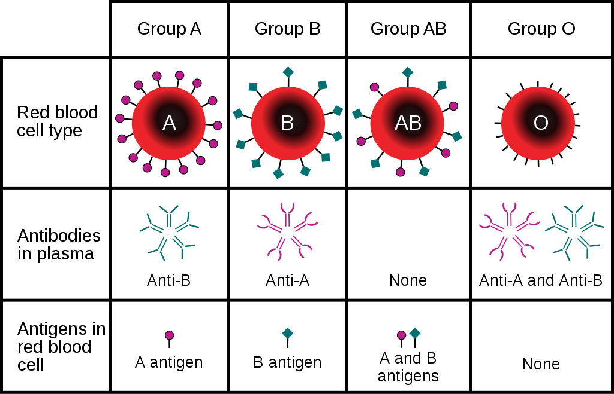

有了血型系统，输血的成功率就得到了保障。但是，其中有一个万万不能忽视的重要问题——"抗凝"。出血后，即使不管它，血也大都能自己止住. 是血凝住了还怎么输血呢？ 就要使用"抗凝剂", 如"枸橼 jǔ yuán 酸钠".

血液中的成分被进一步明确后。一份全血包括血浆、红细胞、白细胞和血小板。缺什么输什么，避免浪费，更避免给机体造成负担。

我国采取的是"无偿献血制度"。**患者急救时输的血, 都是血站根据需要分派给各医院的，**医院的血库会做一些统筹安排。如果出现大型事故或者特殊情况，导致血站的存血也告急，就会采取周边单位相互调度的方式. 所以血库的存量必须具备一定的预见性，"现抽现用"肯定无法满足需求。

一次性献血量符合最低标准200毫升，就可以获得中国国家颁发的无偿献血证。

什么人暂时不能献血?

- 口腔护理（包括洗牙等）后未满三天者；拔牙或其他小手术后未满半个月者；阑尾切除术、疝修补术及扁桃体手术痊愈后未满三个月者；较大手术痊愈后未满半年者。
- 妇女月经期及前后三天者，妊娠期及流产后未满六个月者，分娩及哺乳期未满一年者。
- 上呼吸道感染病愈未满一周者，肺炎病愈未满三个月者。
- 急性胃肠炎病愈未满一周者。
- 伤口愈合或感染痊愈未满一周者，皮肤局限性炎症愈合后未满一周者，皮肤广泛性炎症愈合后未满两周者。
- 一年内输注全血及血液成分者。

== 当医生说法不同时，你该听谁的

**医学上没有绝对的正确，只有证据的多寡。**断案需要证据，医学也是如此。*现代医学之所以先进，就在于它有一套严谨的诊断标准。大家都不能随便乱说，任何决策都需要找到证据。*

最基本的证据当然是教科书，但教科书更新得比较慢。更细致、更快速一些的证据, 是临床指南或者专家共识。某种治疗方法想要写入临床指南，需要有很强的证据支持！

什么样的证据最可信

动物实验、医生自己的临床经验、临床报道、病例对照研究、队列研究、随机对照研究、系统性综述，这些都是证据。不同级别的证据，可信度不一样。*证据级别不同，给出的推荐级别也不一样。*

证据级别高的，叫作“多中心随机对照研究”。

随机分配两组患
者，一组用新药，一组用老药（即随机对照研究）；**谁用什么药是保密的，医生和患者都不知道（即双盲. 否则, 无论是患者知道, 还是医生知道, 都会对他们造成"心理上的倾向", 就不客观了）。**治疗了一段时间后，医生根据患者的恢复情况给出评价。最后再揭开谜底，到底哪些患者用了哪些药。假如用药的患者生存期比另一方更长，就说明药物有效，并且在全世界很多所医院（即多中心）都得出了同样的研究结果。这样的研究结果叫作“A类证据”，是最可信的。

如果试验没有做到多中心、双盲、随机对照，那么可信度就要打一点折扣。**不过很多时候是无法做到"双盲"的。吃药可以双盲，开刀就不能双盲了。**医生不可能不知道开的是什么刀，更不可能在没有手术的患者身上假装划一道口子（但在动物身上可以这么做）。而**有些病例对照研究是回顾之前的治疗结果，发现A方法比B方法好。因为这都是已经完成的治疗，所以无法做到随机分组。**

在动物和细胞身上做的研究, 是证据等级中最低的。“某某研究饿死癌细胞”“某某团队根治糖尿病”，千万不要把这些在动物和细胞上做出来的试验结果当真了. 它们距离真的有效有多大距离呢？还差着十万八千里。

还有一种比这种证据等级更低的，叫作“经验”或者“推测”。比如，有的医生说喝醋能治百病，隔壁老头说每天吃红枣就能延年益寿，张大姐、李大妈每个人都有一套养生的哲学。*这些就属于个人经验和主观臆断，最大的特点就是不能重复。*

保健品的效果能信吗?

**如果号称能"降血脂"的保健品真的能降血脂，那它就已经不是保健品了，而是降脂药.** 如果号称能帮助睡眠的保健品真的能助眠，那它也不是保健品了，而是安眠药。 +
之所以它们只是保健品而不是药物，就是因为人们经过试验发现，它们没有可靠的效果。

如果所谓的效果, 完全靠的是古方、经验，那它其实只是商业宣传而已。*但是，许多保健品居然因为这个卖得比能真正解决问题的药贵得多。*

不可证伪，就是胡说！

我们现在坚持的所有健康观念, 都有可能是错的。只是现有的证据表明，这些方式相对于其他方式来说比较靠谱。

曾经人们认为，孩子发热焐一下就好了，甚至要去汗蒸。在付出过许多惨痛的代价之后，人们才知道这种做法的荒谬。现在还有许多类似的说法，比如输液通血管、以形补形、脚上什么位置按着疼就说明什么脏器不好，等等。甚至有的健康观念是不允许说不的，无论它们怎么没效果，拥趸们都能找到看似合理的解释，最后实在解释不了就来一句：你心不诚所以没有效果。

**既然这个药这么好，为什么正规药店买不到？既然这个方法这么好，为什么大医院的医生都不建议用？**

== 认识人体

人体的每个结构各有什么作用，人类到现在都还没有完全搞清楚。*我们对自身的认识依然非常有限。至今，科学还在不断发现着人体新的解剖结构。*

医学想要发展，只有一个办法，就是毫无保留地剖开人类自己的躯体 (查明地图)。没有解剖学就没有医学.

血液循环, 至少它是看得见摸得着的。而神经传导是真的看不到摸不着，就算找到一根根的神经，人们也不知道它们是如何发挥作用的。

华佗想给曹操做的开颅手术, 在那个时代想做出现在需要"影像学"技术支持的诊断, 是幻想.

"解剖学"和"外科学"紧密结合，要求外科医生掌握显微解剖学技术，在治疗疾病的基础上, 给患者带来最小的伤害。

== 手术麻醉

没有麻醉, 就没有现代外科学。

麻醉和毒品从来就不可分割，适量便可以用于医疗，过量就会成瘾。

毒品:

[.small]
[options="autowidth" cols="1a,1a"]
|===
|毒品 |Header 2

|鸦片
|鸦片是一种初级毒品. 现在许多麻醉药也来自鸦片——罂粟碱、吗啡、可待因等。

|大麻
|一种常见的麻醉剂是大麻。大麻的主要有效化学成分是"四氢大麻酚".

|可卡因
|可卡因被合成之后，被用作局部麻醉药, 或者血管收缩剂。它的麻醉效果好，穿透力强，很快让局部麻醉成为可能。但是，众所周知，可卡因也是极强的中枢兴奋剂，患者用了之后不仅不疼了，而且会飘飘欲仙，这也导致了成瘾和药物滥用。从1985年起，*可卡因就成了世界性的主要毒品之一, 不再用于麻醉.*

|古柯碱
|高纯度的可卡因，就是"古柯碱"，是一种被政府明令禁止的毒品。
|===

"口服的麻醉药物"有很大的安全隐患. 直到"气体麻醉"出现，这一情况才有了一点改观。

[.small]
[options="autowidth" cols="1a,1a"]
|===
|气体麻醉 |Header 2

|乙醚 mí
|乙醚被合成，人吸入之后会情绪快乐. 但吸入过多会导致人意识丧失.

|氧化亚氮 (笑气)
|这种气体带来的快乐感更强烈. 但笑气也具有让人丧失意识的作用。

|氯仿
|
|===

三大麻醉药物的诞生, 宣布了现代麻醉学的开始。麻醉药经过呼吸道吸入，产生中枢神经系统抑制，使患者暂时丧失意识。*吸入的麻醉药在体内代谢、分解后，大部分以原形从肺部排出体外，因此更容易控制，比较安全。*

气体麻醉最初的安全性, 远没有想象中高，*多少药量能充分发挥麻醉作用，多少药量会致死，这些数据都仅仅处于摸索阶段。*

此后，人们开始考虑是否能做到不全身麻醉，只要局部不疼就可以了。

1853年，注射器被发明出来，才让"局部麻醉"的应用成为可能。

1905年，"普鲁卡因"被合成；1943年，"利多卡因"问世，也就是现在临床上应用最多的"局部麻醉"药。

越来越多的手术可以在局部麻醉下进行。

后来随着外科学的发展，许多颅脑、心脏大手术的可能性被提出，小儿的手术也广泛开展。因为大手术需要更深入的麻醉.

**1862年，"氯仿麻醉机"问世，它可以精确地控制麻醉药的用量。此后各种现代仪器的诞生，如心电监护仪、呼吸机、有创血流动力学监护仪、麻醉深度监护仪、体外循环机等，进一步保障了患者的安全。**患者的一切数据都可以通过监护仪实时传输。 "气管插管"成功后，麻醉医生根据监护仪, 实时观察患者的生命体征和麻醉深度，按需精确调整满足手术需求的麻醉深度，维持患者的基本生命体征，保障患者术中安全，术毕及时让患者从麻醉中平稳安全地苏醒。

后来，**人们又发明了"硬脊膜外腔麻醉"和"蛛网膜下腔麻醉"，使麻醉药仅仅作用于相应的脊髓平面以下。**做过剖宫产的妈妈都深有体会，生孩子的时候肚子和双腿就像橡皮一样，摸上去一点感觉都没有，但是胸部以上的双手却运动自如，可以让你亲手抱起宝贝。

**还有一种麻醉叫"神经阻滞麻醉"，它可以仅仅麻醉相应神经干支配的区域，比如可以单纯麻醉手和脚，**让外科手术既不疼又安全。

这些新兴的麻醉方法, 和新型的麻醉药物协同使用，进一步提高了外科手术的安全性。

**目前医疗中使用的"全身麻醉", 基本上是"复合式麻醉"，即同时使用多种不同作用的药物。"镇静遗忘"、"镇痛"、"肌肉松弛"是这些药物的三个主要功能。**如果患者出现了"术中知晓"，就意味着"镇静遗忘"作用不足，而"肌肉松弛"、"镇痛"作用还存在。在这样的状况下，患者存在意识，可听见周边环境的声音。由于被应用了镇痛剂和肌肉松弛剂，他们可能感觉不到疼痛，身体无法动弹，也无法呐喊求救，只能在恐惧中煎熬。

全球每年有超过2 000万人接受全身麻醉手术，大多数患者对麻醉效果比较满意，也不会记得手术的过程。但是其中有几万人就没有这么幸运了，他们无法睡着，而是陷入了所谓的"术中知晓"状态。

在手术室中，麻醉医师大部分时间似乎都在无所事事地靠在椅子上盯着监护仪.

麻醉从一开始, 就是为了"止疼"而生.

医生不了解"疼痛医学"的现象也不少见，不少人还停留在“疼痛只是一种症状”的旧观念上。现代医学的理论是，不管是治个感冒、割个阑尾，还是肿瘤晚期的治疗，都要免除患者的疼痛。医学的发展以人为本，近代医学更强调舒适化医疗。**有时候虽然医生不能治愈所有的疾病，但可以尽可能地缓解患者的不适。**

术后的"镇痛泵"已经普及, 患者可以自主调节药物的用量，达到自我感觉无痛的程度。

.全身麻醉前的注意事项

- 训练在床上大小便及深呼吸。
- 进手术室前要去掉“身外之物”。戴有活动假牙、齿托等的患者，要取下假牙和齿托等，以防麻醉插管时其脱落，误入食管或呼吸道。
- 麻醉醒来之后，你会听到医生叫你的名字，身体却动弹不得。你嘴巴里会有一根管子，不舒服是肯定的，但是你需
要淡定、大口喘气。很快麻醉医师就会拔掉你口中的管子.

== 手术消毒

最原始的消毒办法，是把剪刀在火炉上烤一烤，也就是使用高温使菌体蛋白质变性，从而消灭细菌.

灭菌常用高温、高压. 而日常的无菌术，不管是用紫外线灯、酒精、碘酒还是其他消毒剂，大都只能做到消毒水平。

现代医学在做手术、外科换药、打针，甚至测血糖扎针时，都要先消毒。在医院用酒精、碘伏，在野外也至少会用打火机烧一下。

因为显微镜的发明，不仅是医学，物理学、化学等许多学科, 也都出现了翻天覆地的变化。

2017年的诺贝尔化学奖, 就颁给了"冷冻电子显微镜 cryo-EM"的发明者。利用冷冻电镜，人们已经可以看到埃（长度单位，1埃=10-10米）级物质，这是一种接近原子级别高分辨率的三维结构.

**仅仅发现微生物并没有什么价值，**同时代的很多学者也有类似的发现，*而阐述了微生物与疾病的关系, 才是巴斯德的最大贡献。*

细菌的生长速度快到什么程度？"结核杆菌"每18~20小时繁殖一代，"大肠埃希菌"每20~30分钟繁殖一代，"产气荚膜菌"只要9分钟就可以繁殖一代。

有研究表明，细菌每100万次分裂可能会产生一次基因突变，虽然这些突变没有确定的方向，但看看前文所说的细菌分裂的次数，可见突变的次数也非常可怕。最糟是，*耐药细菌居然可以从死亡细菌中释放到环境里，而不一定要从自己的母代释放。*

生活中的无菌术

.酒精

酒精是我们生活中最常见的消毒剂。*不同浓度的酒精有不同的消毒效果。我们日常喝的白酒大都是40%~60%的酒精度。而在医学上，75%的酒精用于灭菌消毒。*

在欧美的很多药店里，酒精可不容易买到，而是用"苯扎氯铵"代替，目的是防止饥不择食的酒鬼买酒精喝。

*酒精消毒的原理很简单，就是吸收"细菌蛋白"的水分，使其脱水、变性、凝固。*

**很多人认为酒精浓度越高杀菌效果越好，这是个错误的观点。**高浓度酒精会使细菌蛋白脱水过于迅速，从而使细菌表面的蛋白质首先变性、凝固，形成一层坚固的包膜，这样酒精反而不能很好地渗入细菌内部，从而影响其杀菌能力。

**而75%的酒精, 与细菌的渗透压相近，可以在细菌表面蛋白未变性前, 逐渐地向菌体内部渗入，**使细菌的所有蛋白脱水、变性、凝固，最终杀死细菌。

*但是，当酒精浓度低于75%时，由于渗透性降低，杀菌能力也会相应地降低。*

.碘剂
现在医学上消毒用的碘剂, 为"碘酊 dīng"和"碘伏"两种。*碘酒和碘伏的杀菌力, 强于酒精、红药水和紫药水。*

[.small]
[options="autowidth" cols="1a,1a"]
|===
|Header 1 |Header 2

|碘酊(即碘酒) :
|**其中含有的"单质碘", 会烧灼黏膜，所以碘酊不可以用来给黏膜消毒，只能用作皮肤的短时间消毒。** +
碘酒对皮肤黏膜的刺激性大，不宜直接涂在破损伤口及口腔、鼻腔等黏膜上。

消毒之后，**还需要用75%的酒精脱碘，防止碘长时间停留在皮肤上造成损伤。**

一般来说，**碘酒较酒精更为高效、广谱，甚至可以杀灭部分芽孢。** +
**碘酒中的酒精, 是用来做溶剂的，而不是用来消毒的。**

|碘伏 :
|**"碘伏"里面的碘, 处于"络合碘 Complexing iodine"状态，不会对皮肤和黏膜造成损伤，但是消毒作用也相对弱一些。**

碘剂的消毒原理, 是"氧化作用". 与之类似的消毒剂还有"双氧水"（过氧化氢）-- 接触伤口就会冒出大量泡泡。

- 医用"碘伏"常见的浓度是1%，用于皮肤的消毒治疗，可直接涂擦.  +
- 稀释两倍可用于口腔炎漱口.  +
- 0.3%~0.5%的碘伏, 用于外科手术中, 手和其他部位皮肤的消毒。

*由于与碘酒、酒精相比，碘伏对皮肤、黏膜、伤口没有刺激性，因此广泛用于皮肤、外科手术及口腔、腔等黏膜的消毒。*
|===

.红药水和紫药水

红药水和紫药水靠的是阳离子结合羧基杀菌。

[.small]
[options="autowidth" cols="1a,1a"]
|===
|Header 1 |Header 2

|红药水
|红药水是2%的"汞溴红"溶液。

- 其实**红药水的消毒作用很弱，只适用于皮肤或黏膜较小创面的消毒。**
- 而且**红药水含有汞，给大面积破损的伤口消毒, 可能会造成"汞中毒"。**有的小朋友满腿都涂满了红药水，其实是有风险的。

|紫药水
|紫药水是1%~2%的"龙胆紫"溶液，**杀菌效果比红药水强，对组织刺激性小. 且能在黏膜、皮肤表面凝结成保护膜而起到收敛作用，防止细菌感染和局部组织液的外渗。**

- 由于**紫药水对"革兰氏阴性杆菌"不敏感，**因而对深部感染就不太适用了。
- 另外，紫药水收敛性较强，*易使创面结硬痂从而影响渗出物的排出，同时还会使痂下细菌繁殖，反而会使病情加重，目前也已经较少使用。*

|===

.84消毒液
84消毒液是一种高效消毒剂，主要成分为"次氯酸钠"，*适用于一般物体表面、白色衣物、医院污染物品的消毒。* +
*84消毒液有一定的刺激性与腐蚀性，使用时应戴手套.*

.洗手液和洗洁精
**洗手液和洗洁精本身没有杀菌作用，但能做到"除菌"，即用流动的水把细菌带走，**洗手液的泡泡也能帮助更彻底地清洁手部。 +
目前市面上有一些洗手液、沐浴液等，由于添加了"对氯间二甲苯酚"、三氯生、季安盐、胍类等，也确实有一定的抑菌效果。但是它们针对的菌类不同，适用范围也不一样，安全性也有所区别。

.煮碗
热水消毒应该是追求高温，但是**从水瓶里倒出的“开水”的温度只能杀死极少数的细菌，不能起到消毒作用。真正想要消毒，需要将物品置于煮沸的水中，并且至少要煮30~60分钟。**

== 手术医生

医生做手术就是日常上班，可以听歌，可以聊天。

手术室是医院的核心区域，所有的设施都围绕着手术室设计，医院先不先进先看手术室。

手术室灯火通明，永不关门，是外科医生的圣地和归宿。

**从医学院毕业后，有些人选择了"内科"，便很少再有机会去手术室了；而有些人成了"外科"医生，成了出入手术室的常客；**还有一些人选择做了手术室护士、麻醉医师，也可以说是以手术室为家.

手术室里的护士有两种:
[.small]
[options="autowidth" cols="1a,1a"]
|===
|Header 1 |Header 2

|器械护士 (洗手护士)
|即在手术台上为手术医生传递器械的护士. +

"器械护士"必须全程配合一台手术，有些复杂的手术甚至需要两名器械护士同时上台。

|巡回护士
|主要负责手术室里所有有关手术的准备; 全面负责患者出入手术室的安全; 与手术组、麻醉人员密切配合。 +

一个"巡回护士"可以负责多个手术间.
|===

空调是在1902年才被发明出来的。想想此前的手术，无论是在炎热的夏天, 还是寒冷的冬天，对一丝不挂的患者和穿着长袍的医生来说, 都是极大的考验。

现代医院一般都拿出整整一层楼的房间, 作为手术室. 现代的手术室可不仅仅是一个提供手术的房间，里面还包括了一
整套的供应系统——水电暖、消毒、清洁、护理、麻醉、病理等。

手术室最重要的, 就是对污染的控制，以减少术后感染的概率。1966年，世界上第一间"层流手术室"在美国建立. 所谓的“层流”，就是采用空气洁净技术, 对微生物污染进行控制。层流手术室还可以提供适宜的温度、湿度，创造一个清新、洁净、舒适、细菌数低的手术空间环境.

不仅有"层流手术室"，还有"层流病房"，它们最大的目的只有一个——预防感染。

“千级”,“百级”,“万级” 代表了层流手术室的标准。

根据美国联邦标准 :
[.small]
[options="autowidth" cols="1a,1a,1a"]
|===
|层流手术室的标准 |每立方英尺空气中, 0.5微米以上的尘粒数 |或每升空气中

|1 000级
|≤1 000颗
|≤35颗

|10 000级
|≤10 000颗
|≤350颗
|===

大部分医院的手术室, 都设在4楼或5楼，这是为什么呢？

其实，对于手术室的位置和楼层, 并没有绝对的要求. 但是**手术室需要清洁卫生、远离危险、易于联络。这就要求药房、麻醉科、病理科、影像科、检验科、血库还有外科等都应该围绕在手术室的周围。此外，手术室还需要避免一些可能出现污染和危险的区域，如锅炉房、垃圾站、吵闹的街道等。**

手术室在医院中扮演了一个核心角色，**如果把医院比作一座剧场，手术室毫无疑问就是剧场的舞台中心。手术室也是最先进设备的展示场所，是整座医院中投入资金最多的地方。**在这里，各种设备应有尽有——内窥镜、显微镜、电生理标测仪、电刀、超声刀、手术机器人、B超机，甚至CT机和磁共振机, 都可以被推进手术室。*手术室的设备和应用这些设备的人, 也成为衡量医院水平的重要标准。*

在大部分的综合性医院里，急诊科是医疗的先头兵，占据了距离患者最近的1楼。由于大型设备不便搬动，拍片子的影像科一般也设在1楼。而门诊部、检验科、药房这些人流量比较大的科室则常常占据2、3楼，这是患者整个就诊过程的延伸。手术被安排在尽可能靠近这些科室的楼层。因此，4楼和5楼成了最合理的选择。楼层的布局甚至可以看出医院的发展重点，

== 洗手衣

手术室里有两种衣服:

[.small]
[options="autowidth" cols="1a,1a"]
|===
|Header 1 |Header 2

|洗手衣
|在进入手术室时就换上的衣服叫洗手衣，*一般是贴身穿着的.*

- **在中国，"洗手衣"只允许出现在手术室里。**偶尔麻醉医师、医生或者护士穿着"洗手衣"出入普通病房时，都会被要求卷起裤脚、外穿隔离衣等，尽量保证洗手衣的清洁。医生进入手术室后还要统一换鞋。人一多鞋子不够，对于来得迟的医生或者刚来没多久的实习医生，可能就要去穿其他医生刚脱下来、还来不及消毒的拖鞋。

- **而在欧美国家，"洗手衣"几乎等同于"工作制服"(可以上班下班都穿, 也不限地点)。**医生们不仅穿着洗手衣随意出入手术室，在医院周围的公园、餐厅、超市，也可以随时见到穿着洗手衣的医务人员，甚至有的医生就穿着洗手衣去跑步、爬山。 +
由于医院负责免费清洗、消毒"洗手衣"，工作繁忙的医务人员就完全省去了洗衣服的麻烦。 +
+
关于鞋子，欧美很多手术室也可以随意穿着自己的鞋子。不仅不用清洁换鞋，甚至连鞋套也可有可无。这样做最大的好处就是穿自己的鞋子更加舒适，而且在手术室里走动也比穿拖鞋更加安全方便。
+
80年代，就有美国学者提出，"洗手衣"应当在每次进入手术室的时候进行清洁更换，但是至今很多地方都没有真正实施。

|手术衣
|做手术时穿的衣服叫"手术衣"，**穿在洗手衣的外面，每场手术结束之后都需要更换。**"洗手衣"的消毒要求是清洁，而**"手术衣"的消毒要求是严格无菌。**
|===

== 一次性医疗用品

中国的手术衣大多是布制的，**反复清洗、消毒。新的和旧的"手术衣"完全呈现出两种颜色。**新的手术衣是深绿色的，旧的手术衣已经清洗成浅绿色甚至发白。

而美国很多手术室里除了机器和人，几乎所有东西都是一次性的。各种接触患者的被服、手术衣、部分手术器械，基本上都是用完就扔。而医生、护士也很少受到上下手术台的限制，只要有时间就脱去手术衣去吃点东西、喝杯咖啡，休息5分钟再上台，或者两个护士每一个小时替换一下。美国手术室里的一次性手术衣的消耗从来不用从经济方面考虑，这可能是中国医生可望而不可即的软性福利。*当然，这些一次性医疗用品的使用费都是记在患者头上的，再通过保险费来覆盖。*

此前说到手术服装、在手术室里播放音乐，以及一次性医疗产品的使用，你可能会发现欧美的手术室更在意每天在这里工作的医护人员的感受，想办法给医护人员提供便利；而中国的手术室则考虑到节约资源。

为什么做手术时不让患者穿衣服?

手术前一天晚上，护士都会通知患者空穿病号服, 里面一丝不挂. 在大多数手术中患者都是不穿衣服的。整个手术过程中，患者的全身都会盖着厚厚的布，只露出需要手术的一小块区域。全麻手术因为有器官插管，不怕影响呼吸，患者的整个脸、口、鼻都会被盖起来。

手术时要求患者脱衣服, 其实是为了快速给患者的手术部位消毒、插尿管、接上心电监护仪，以及打麻醉。

[.small]
[options="autowidth" cols="1a,1a"]
|===
|Header 1 |Header 2

|-> 麻醉监护
|**因为麻醉的需要，患者胸口必须要接上"心电监护仪"，就是那种贴片。**这和做心电图一样，穿着衣服是没办法贴的。

心电监护仪: 可以检测的参数有：心电、呼吸、血压（有无创和有创两种）、血氧饱和度、脉率、体温、呼吸末二氧化碳、呼吸力学、麻醉气体、心输出量（有创和无创）、脑电双频指数等。

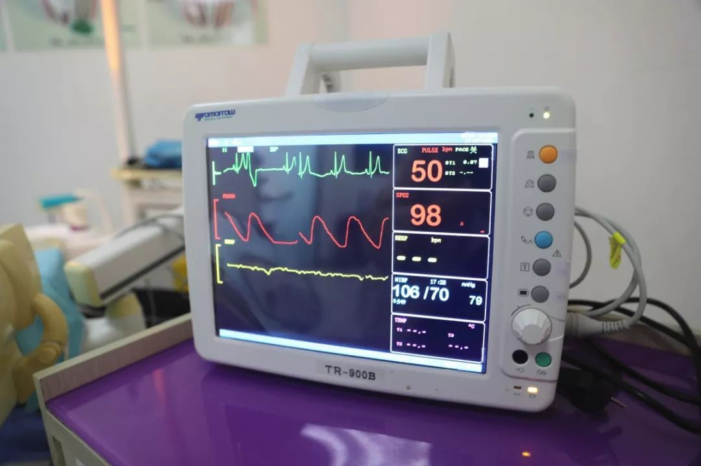
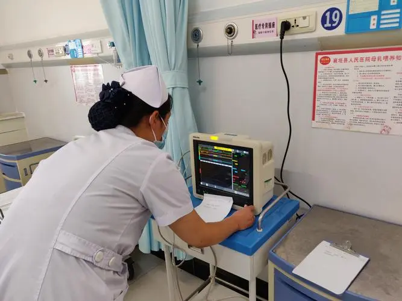
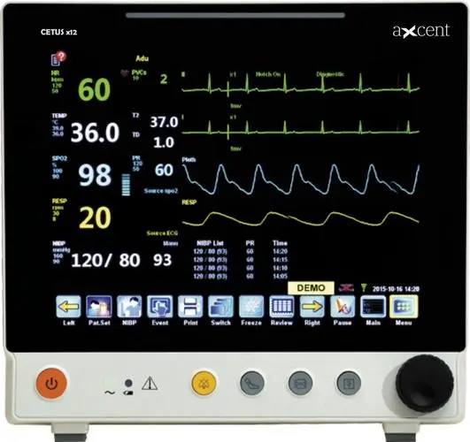

|-> 插尿管
|**手术时间超过3小时的，需要插尿管。**虽然有些手术可能不超过3小时，但是因为手术开始之前很难预计时间，所以也需要插尿管。因此，大部分手术都要先插尿管。 +
插尿管的作用有：第一，可以帮助排尿；第二，*可以监控尿量*；第三，*腹腔手术可以清空膀胱。*

尿管插好之后, 会用注射器打一个储水囊，防止其意外脱出，所以**手术之后千万不要自己拔尿管，否则强行拔除会引起尿道损伤。**

|-> 消毒需要
|为了防止感染，手术消毒范围要远远大于手术区域，所以需要患者脱掉衣服显露出更多的皮肤。比如胸部手术，消毒的范围是从颈部到腹部；腹部手术需要从"胸部"消毒到"会阴部"，甚至到大腿。
|===

**因为手术的需要，患者会被摆成不同的体位，比如趴着、斜靠、侧趴等。护士们最担心的是几个小时的手术, 让患者的身体部位被压坏。**比如眼睛被压久了，长期充血造成视力下降；手被别着了，造成神经损伤；皮肤被夹着了，最后皮肤坏死。*特别是对男性患者来说，插尿管的部位还需要特别戴着手套去检查一下，确定不要被压着了。*

当然，很多急诊患者穿着衣服就被送进了手术室，我们会帮他们一件一件脱掉，把所有的衣服装在一个袋子里，然后还给家属。但是**在患者失去意识的情况下，脱衣服是很困难的，再加上需要争分夺秒，我们常常会用剪刀把衣服直接剪掉。**

== 手术同意书

手术同意书不是医生的免责条款。

预期寿命法可以帮助患者做出选择。

在西方，患者自己去签手术同意书；在中国，患者家属签手术同意书。

美国的阿图医生曾经说过这样一句话：“行医有行医的医术，生病也有生病的艺术。”那么，患者的艺术是什么呢？

选择"积极治疗"还是"保守治疗"，就像是赌博.

[.small]
[options="autowidth" cols="1a,1a,1a"]
|===
| |手术的可能后果| 不手术的可能后果

|-> 外公得了食管癌，想让老人免受痛苦地延长一些生命。摆在面前的是一个两难的选择：手术还是不手术?
|按说这样的高龄患者，身体条件一般，肿瘤性质不良，手术治愈的效果也是微乎其微，人财两空的可能性很大。
|保守治疗, 就意味着放弃治愈的希望，**患者很快就会无法进食，靠静脉的营养液维持生命，**随着肿瘤的转移，每一天都有可能面临死亡。

|-> 下肢骨肉瘤
|失去双腿
|肿瘤的复发率就会提高.

|-> 大脑功能区肿瘤
|要切干净肿瘤就可能会牺牲一部分运动功能，简单来说就是瘫痪.
|如果切不干净，复发率就会提高.

|-> 妇产科肿瘤
|有时切除卵巢和子宫的疗效更加可靠，但是患者就永远失去了怀孕生子的权利。
|
|===

如果是你自己，来考虑下面两种选择, 你有勇气赌吗？

- 不做手术, 活1年
- 做手术, 活5年. 但是手术有50%的失败率, 会立刻死亡。

我可以告诉你，即使只有10%的失败率，大多数人都不敢用自己的生命去赌。即使你对自己敢赌, 但如果是你为别人做决定呢？

其实治疗方式的积极和保守, 在很大程度上反映了患者对生命的态度。这个问题就像不同的人在理财的时候, 各自会选择稳健的银行, 还是有一定风险的股市一样.

对于危及生命的病情，人们其实没有什么太多可以考虑的，只能背水一战。相反一些进展相对缓慢的疾病, 给了患者更多的选择，却也常常把选择变得更加困难。

**“预期寿命法”是许多医生给患者提出建议时的参考标准，即根据可能的预期寿命, 来选择治疗方法。**

- 60岁的时候得了良性的疾病，如生长缓慢的"良性脑肿瘤"，患者预期至少还可以活20年，到时候躲不过这一次手术，那还是尽早手术。
- 如果同样得了良性脑肿瘤，但患者已经90岁了，身体状况较差，被高血压、冠心病等折磨了多年，*预期寿命只有5年，那么完全可以采取保守观察。因为相比于这个良性脑肿瘤，心脑血管的问题更值得引起重视。*

家属是否应该把真实病情告诉患者?

隐瞒和不隐瞒各有自己的理由.

但隐瞒可能造成的后果有: *剥夺了患者的知情权。有些患者被推上手术台的时候，都不知道自己将要做一台什么样的手术，以及手术后将面临什么样的生活。甚至他们都不知道这台手术有多大的风险，自己能不能下得了手术台，有些话没有说可能就永远失去了说的机会。*

西方国家采取的对策是: 早早立下遗嘱.

为什么必须让患者签署"手术同意书"？这是按照法律规定, 履行患者的"知情同意权"。

只要你住院，各种"同意书"就会扑面而来。除了手术之外，许多侵袭性操作，如麻醉、插管、腰穿、骨穿、PICC置管等，甚至是治疗措施的改变，都需要签署同意书，还有病重通知书、病危通知书等。

签了同意书之后还能反悔吗？其实大部分时候, 患者在同意书面前并不是没有选择。除了紧急情况需要立即施救以外，其他情况下患者和家属都有大量的时间来考虑，并且**随时可以反悔。**本来做好了手术的准备，但看到手术同意书上一大堆风险后逃跑回家的大有人在。甚至当患者已经被推到了手术室，躺在了手术台上时，他只要说一句“我不想做手术了”，所有准备便立刻停止。

"手术同意书"上写了什么？列举了几乎所有可能出现的情况，出血、感染、昏迷，甚至死亡，往往最后还有一条：其他不可预料的情况。医生会用专门的时间来跟你解释手术的风险，哪些很常见，哪些很少见，哪些几乎难以避免。

例如:

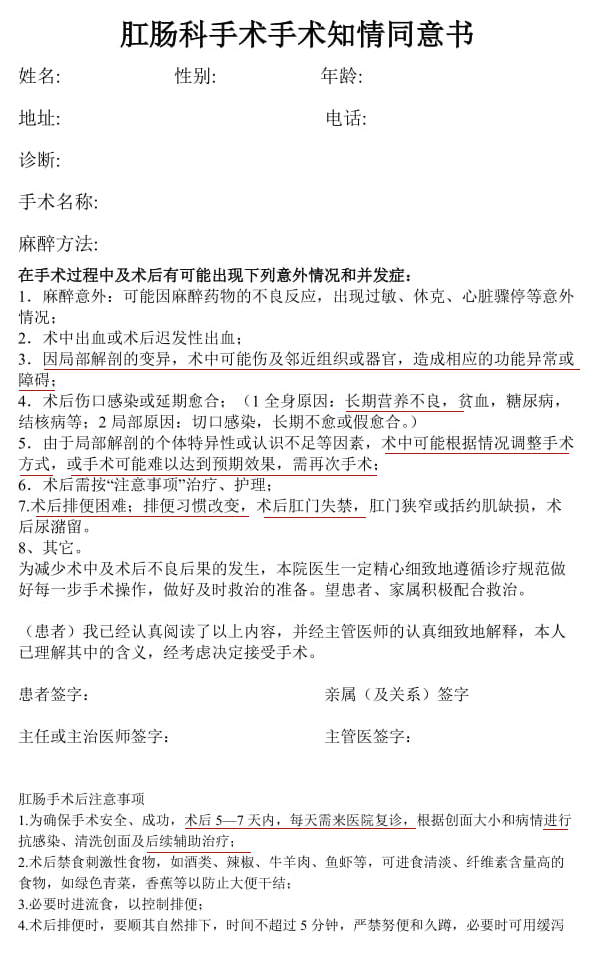
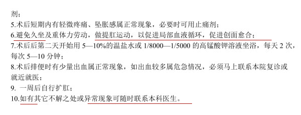

手术同意书的目的就是告知患者相关选择，你有权利做手术，也有权利不做手术。可以这么说，手术出现了并发症，如果医生的诊疗过程非常规范，那不管出现了什么情况，甚至患者在手术台上死亡，医生也不需要承担责任。但是**如果医生操作不当或者违背患者的意志进行了操作，导致患者遭到了严重的伤害，那么不管是否签署了手术同意书，医生都需要承担责任。即, 如果医院有责任，签了再多同意书也不能回避。**

**沟通，远比签字更加重要。很多人对于手术同意书最大的误区就是，签同意书就像签合同一样。**医生和患者都觉得签字是在走法律流程，却忽视了其中的沟通。医生觉得跟患者解释那么多没有意义，反正患者也听不懂；患者觉得我完全相信你，把字签了，对于同意书上的内容和风险则完全不了解。

每天跟患者交代病情和可能的治疗方式，不断重复同样的话语，没有引导性和倾向性的建议，把艰难的选择留给患者，这是医生的日常工作。但是如果换位思考一下，很多时候我自己其实也难以做出决定。

不得不承认，医生和患者之间的沟通还存在许多问题。就拿输血来说，*有一些通过血液传染的疾病，如艾滋病，都会有一个窗口期, 即如果患者刚刚患有艾滋病，在前几个月里, 现有的医学检测技术是无法发现的。那么在这一段时间内，受血者输入这样患者的血, 就会有罹患艾滋病的可能性。*

医生的选择

有的医生更积极，有的医生更保守。

甚至是同一个医生, 如果这个医生刚刚手术失败，甚至有私人生活的困扰，他们都更容易去
劝患者进行保守治疗。

有时候，即便别人有更好的治疗方法，医生也可能会倾向于用自己熟悉的老办法。

患者的抉择

“久病床前无孝子”，作为医护人员的我们能够深深体会到这句话的含义。

谁来掏这个手术费？手术之后又由谁来陪护？出了问题谁来负责？子女为了父母看病闹得不可开交的大有人在。“当初是你说做手术的，现在瘫了就得你来照顾！”

== 外科手术

手术显微镜, 让许多看似不可能的操作成为现实。比如断指再植术，医生要在显微镜下把断指的神经、血管、肌肉全部缝合。

医用显微镜, 主要应用于神经外科、眼科、五官科等这些更需要精细操作的学科。显微镜可以将人体组织，如神经血管等放大5~10倍，并且放大的范围可以根据手术医生的需求来调节。缝合像毛线针一样粗的血管.

**有些血管和病变生在一起，或者挡在医生的目标面前。想要前进，就必须切断这些血管。**血管一旦被切断，必然带来出血，视野里一片鲜红，手术也就无法继续了。

如何控制手术的出血情况呢？

[.small]
[options="autowidth" cols="1a,1a"]
|===
|Header 1 |Header 2

|-> 高频电刀 high frequency electrosurgical equipment
|"高频电刀"早已经在外科手术中普及。这是一种取代机械手术刀进行组织切割的电外科器械，它长得其实不像刀，更像一支笔。

高频电刀的电极尖端, 可以产生高频高压，电流与肌体接触时可以对组织进行加热，实现对肌体组织的分离和凝固，从而在切割的同时达到止血的目的。它就像一个精确的“电烙铁”，在分离组织和切割血管的时候，血还没来得及淌出来，血管的断段就被烧焦闭合了。

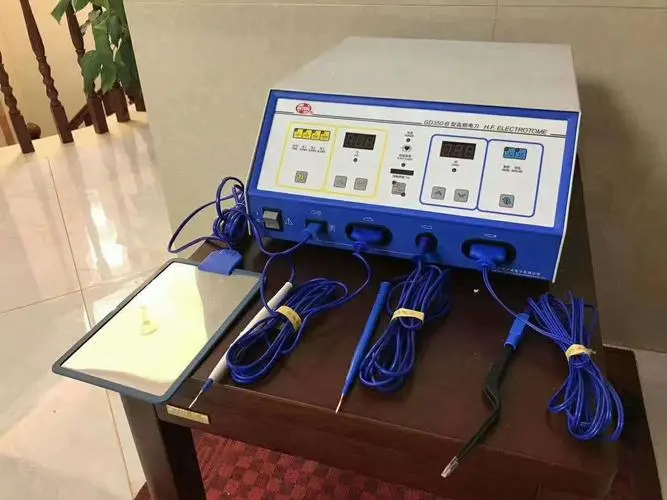

|-> 双极电凝器
|其实，高频电刀还不够精确，外科医生需要更精确的止血器械，于是"双极电凝器"出现了。它从表面上看像一个镊子，*电凝作用只产生于镊尖夹持的部位，而镊尖外的组织几乎不受影响，这样它就可以做到精确止血，并且保证其他的组织不会被烧焦。*

|-> 超声吸引刀
|*肿瘤内部血供丰富，很多时候就像一坨烂肉，正常组织和血管的结构完全被破坏，再厉害的外科医生也找不到下刀的位置，止血更是无从下手，直到"超声吸引刀"的诞生。*

"超声吸引刀"与太阳灶聚焦阳光在焦点处以产生巨大能量的原理类似，它将体外低能量超声波, 聚焦于体内靶区，在肿瘤内产生瞬态高温、空化、机械作用等生物学效应，从而杀死靶区内的肿瘤细胞。*肿瘤血管瞬间超声乳化，变成脓水，然后医生就可以用配有的吸引装置把这些脓水吸出来。*

|===

大脑是人体的“司令部”，而脊髓是信号的“高速公路”。*大脑和脊髓的手术一旦损伤到神经，就会造成患者运动功能受损（强直、痉挛或者瘫痪）, 或感觉功能受损（失去感觉或者疼痛难忍）。如何确保手术安全? 就是"神经电生理监控"。*

神经电生理监控, 就是将仪器的电极, 插入患者神经的支配区域。比如, 脊髓手术, 它可能损伤下肢运动和肛门排便，那么电极就插在下肢肌肉和肛门肌肉附近, **一旦神经受到影响，另外一边的电脑屏幕就会出现巨大的波形变化，并且伴随着报警，**监测人员就立刻提醒手术医生需要改变手术位置。 +
大脑的手术也是一样. **几乎所有的神经都可以监测。**这样的监测系统好比汽车的倒车雷达，在车辆快要撞墙的时候及时报警，让手术的安全性得到进一步加强。

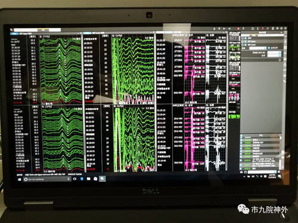

在大脑手术中，有一种更加精确的定位系统——"神经导航"。它以磁共振、CT等医学影像数据为基础，在电脑上显示出一个三维可视的“虚拟人脑”。医生手中的探针指向哪里，是否已经到达肿瘤边缘，前面是不是重要组织，都可以在显示器上看到。刚才说到的监测系统如同倒车雷达，那么神经导航系统就真的像行车导航一样。

手术前给患者拍的片子相当于离线地图，手术器械相当于我们驾驶的汽车。将GPS技术应用在三维空间，把手术器械放在患者大脑的任何位置，都可以像车载导航一样显示在离线地图上。

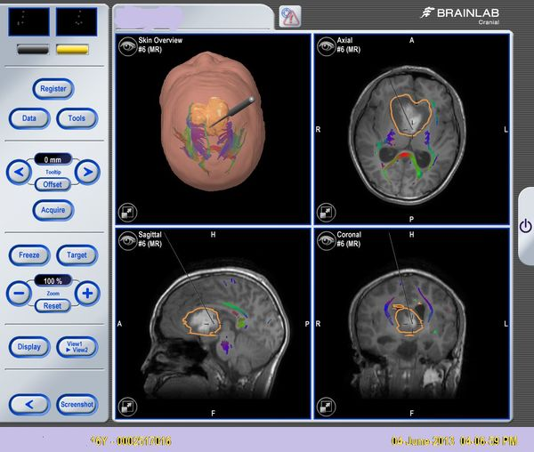
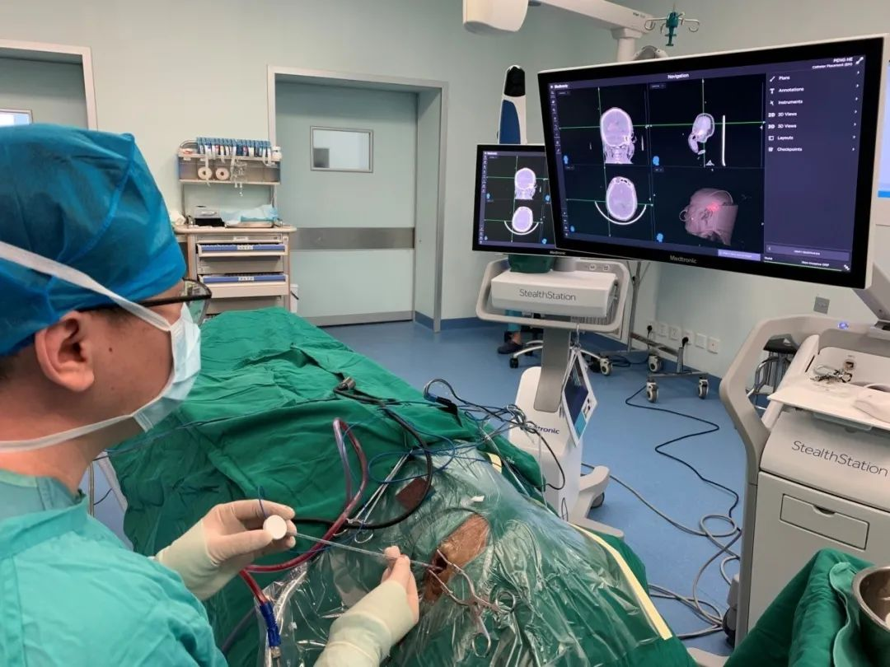

手术器械移动的每一步都有地图可循，你只需要准确地到达肿瘤部位，不要碰到重要的神经、血管，不要走错了地方。未来, 自动切除肿瘤其实也并非没有可能。

我们无法训练出更优秀的外科医生，因为一个人的时间和精力非常有限，超长的训练时间并不划算，况且外科医生的成长其实需要以许多患者的健康作为代价。但是，我们可以训练出更加先进的系统，让外科手术变得像开车一样简单。手术机器人是未来的发展方向. 当外科手术变得越来越安全，医生的工作也变得越来越简单。

== 住院手术全流程

住院后的第一件事就是记住自己的床位医生和护士，不是所有穿白大褂的人都了解你的病情。

住院之旅从一张"住院证"开始。医生给你开了住院证，也不一定就意味着你要立刻去住院. 因为**办理了住院手续之后，大部分医院规定不允许患者自行离院回家，**比如在等待手术的时候，患者想回家洗个澡、睡个觉、吃个饭，都是不允许的。*因此，你首先需要处理好手头的各种事情，再来办理住院手续。*

在住院前，你还可以根据自己的情况，打电话向当地医疗保险部门咨询一下。有些疾病属于当地医疗保险的重大疾病或者特殊病种，可以享受非常大的报销力度。

知名的大医院，床位可能会非常紧张，你有可能不能立刻住上院。**你需要先把信息登记在病区的护士那里，然后开始等床位。**特别是在北京、上海的大医院，人满为患，有些甚至要等上几周，甚至几个月。当然，如果等不及，你也可以选择去一家人少一些的医院。等护士通知你的时候，你就可以准备住院了。

住院第一天

办理住院手续的时间不要太早，到达病房的时间最好是当天下午3点。这和很多宾馆办理入住的时间是差不多的。*早上前面床位要出院的患者还在收拾东西，之后医务人员需要更换床单和消毒。如果你来得太早，也只能干等着。*

住院时需要带上你的身份证和医保卡。不过医保卡忘记带也没有关系，因为出院之前都是可以补办医保的.

生活用品也要带全，主要是洗漱用品、吃饭的餐具等。**一般医院都会允许有一名家属陪床，**根据手术情况不同，陪你住院的人也要带好这些东西。即使你做的不是大手术，能走能跑，但在住院期间你需要做各种检查，一个人还是很困难的。

有的医院提供"陪护床"，你可能只需要自带一些床上用品。*如果没有陪护床，你可能需要买或者租一张折叠床。陪护人员是不允许躺在病床上的。*

办理好住院手续后，你的床位护士会对你进行简单的评估，如测量身高、体重、血压等，如果你的指甲太长，还会让你剪指甲。然后你需要填写一些基本信息，护士也会告诉你病房打饭、接水、晾晒、洗澡的地方在哪里，还有一些住院的注意事项。

**之后会有一位医生和你见面。如果他详细询问你的情况，那他就是床位医生，你一定要认识他，因为未来和你打交道最多的就是这位医生。如果他只是简单地询问你的情况，那他可能就是当天的值班医生，一般只会针对你现有的情况做一些简单的处理。**无论是哪位医生接诊，**他们都会为你开具一些第二天需要做的常规检查。**这些检查一般包括胸片、心电图、血常规、血生化、尿常规、凝血象和免疫检查等。

[.small]
[options="autowidth" cols="1a,1a"]
|===
|常规检查 |Header 2

|胸片
|*检查你有没有肺部感染。如果有感冒、咳嗽的症状，你是不能做手术的。*

|心电图
|*检查你的心脏有没有明显的问题、心脏功能是否对手术耐受。*

|血常规和血生化
|反映你基本的血液指标。**血小板低或者严重贫血的患者不能手术。如果你有肝功能异常、电解质紊乱等问题，也需要在手术前处理解决。**

|凝血象
|*如果你的凝血功能不行，手术切开后出血会止不住，也不能做手术。*

|免疫检查
|包括乙肝五项检测，以及艾滋病、梅毒等检测，*如果你携带有这些疾病病毒，手术室的医生和其他患者都要采取一些防护措施。*
|===

住院的第一天，时间会过得非常快，你稍微熟悉一下病房的环境就到晚上了。建议你还是赶紧睡觉吧，因为住院的第二天将会忙碌起来。

住院后几天

**第二天早上大约6点多，**当你还在睡眼惺忪的时候，**护士就会来抽血。**然后你就可以起来吃早饭了。一般医院都有餐厅，但你也可以打听好医院附近有哪些外卖，因为手术之后的几天你可能胃口都不会很好。

这时候你的手上可能有几张昨天给你的检查单，如心电图、胸片等。但这时候千万不要着急去做检查，因为**在早上8点多的时候，你的床位医生会来查房。这是你看过门诊之后, 第一次和主任、各级医生见面。**也许门诊的医生看过太多患者，有点不记得你了。

**这时候主任会再次回顾你的病情，进一步开具一些必要的检查。后面有一个拿着小本子记录的人，这就是你的"床位医生"。查房的时候一定要认识自己的"床位医生"和"床位主任"，他们是对你病情最了解的人，也是你的治疗方案的制定者。如果你有什么问题，一定要在查房的时候提出来，**因为之后很可能就找不到医生了。

**医生查完房之后, 你就可以去做检查了。**记得要问一下检查的结果什么时候取, 及怎么取，是有人送到病房，还是需要自己去拿.

**后面几天**可能相对比较清闲，**一般是预约各种检查，等待检查结果出来。如果有不正常的检查结果，医生会根据情况对症下药，为你调理病情，之后再复查相关指标。**如果你的病情相对复杂，所在科室的医生还要根据这些资料, 进行全科室的讨论，最终得出一个最佳的治疗方案。

**如果你在知名的大医院住院，常常需要等到检查做完了才能住院。**但因为需要手术的患者太多，你还得再排队。在你已经等得百无聊赖的某一天早上，主任在无数次路过你病房的时候，突然说了一句“明天就排他吧”。恭喜你，明天你就要手术了。

这一天，你又开始变得忙碌起来。**医生会和家属谈话，请患者和家属签一大堆知情同意书。**在欧美国家，医生常常只与患者单独沟通，是否把病情透露给家属是患者自主选择的权利。但在中国，医生和家属的沟通常常超过了与患者本人的沟通。因此，**在手术前一天，患者最好有一两个直系亲属一直留在病房。**父母、子女、配偶为主，兄弟姐妹次之，至于其他亲属，我们一般不建议来。

术前谈话会告知家属手术的必要性、操作过程、术后的预期效果、手术风险等事项。**之后，麻醉医师也会到病房来进行术前访视，**与患者和家属见上一面，*和家属沟通麻醉的风险，并对患者进行术前评估。*

**还有一些更加具体的工作，常常交给护士。为了方便手术操作，护士会对患者进行必要的处理。比如备皮，就是把手术区域表皮的毛发剃掉，**脑部手术就剃头发，胸部手术就剃胸毛，下腹部手术就剃阴毛。

*有些腹部手术需要患者进行胃肠道准备，就是吃泻药拉肚子拉到都是清水为止。这是为了防止术中肠漏，粪便污染腹腔。*

**如果是全麻手术，在手术前一晚的10点之后，患者一般就不能再吃东西了。**如果你因为紧张开始失眠、焦虑，可以让值班医生给你一片安眠药。

手术当天

**如果你的手术是当天的首台手术，一般早上7点之前你就会被推入手术室，进行手术前最后的准备。**如果不是首台手术，你可能要在病房里继续等待。*这时候还不能吃东西，护士会给你输液，以维持身体的能量。*

等进手术室的过程中，家人会陪着你，但是一旦你进了手术室的大门，里面就只有穿着蓝色或者绿色手术衣的医生和护士了。你刚被推进手术室时，里面是护士和麻醉医师。麻醉医师你可能昨天见过，但是因为大家都戴着口罩和帽子，你可能已经认不出他了。

护士会让你躺在一张很窄的床上，这就是手术床了。为什么床不能设计得宽一点？因为如果手术床太宽，医生操作时就要探着身子，动作不方便。不过你也不用担心会摔下来，因为手术的时候你会被“五花大绑”。之后护士会脱光你的衣服，这个过程也可能在麻醉之后。

**比较常见的两种麻醉是"腰麻"和"全麻"。**腰部以下的手术，如剖宫产，可以用**"腰麻"，也就是"蛛网膜下腔"麻醉。这种麻醉只有腰部以下会失去知觉，意识还是清醒的。再往上就不能用这种麻醉了，因为它会抑制肺部的呼吸。**

**多数的大手术采取的是"全麻"。**刚开始，麻醉医师会说“给你打个小针”，其实就是**建立一条静脉通路，用来输液。然后他会罩一个氧气罩到你的口鼻部，**让你数10下。此时，麻醉医师已经悄悄地通过刚才的静脉通路注入了"静脉麻醉药"。你的意志再坚定，也抵抗不住麻醉药物的作用。大部分人还没数到10就会失去知觉。后面就是手术完成后, 有人喊名字叫醒你了，中间的记忆则“消失”了。

麻醉医师会进行气管插管。在"静脉麻醉"帮助你进入麻醉状态后，*之后的麻醉, 通过气管输入的麻醉气体, 与静脉麻醉, 共同配合完成。这是因为"静脉麻醉"有一定的风险，可能会抑制你的呼吸，"气管插管"会保证氧气和麻醉气体同时吸入，消除了这一风险。*

**在比较大的手术中，麻醉医师会进行"动脉穿刺"，这样可以更精确地测量血压。一般会有两条输液通道，以保证各种药物可以畅通地输入你的体内。**与此同时，*医护人员会给你插尿管，因为在麻醉状态下你无法控制自己的膀胱括约肌。*

手术医护人员的标准配置是：主刀医生1名、一助1名、二助1名、麻醉医师1名、器械护士1名、巡回护士1名。如果是更复杂的手术，助手和护士会更多一些。

手术快要结束的时候，麻醉医师就要开始缓慢停止麻醉药物的输入了。当手术结束后，你听到的第一句话一般会是“手术结束了，睁开眼睛，大口喘气”。然后麻醉医师会拔管撤监护，这时候他不会立即撤退，而是和医护人员一起把你送到"麻醉复苏室"。

手术结束

**在"麻醉复苏室"里待上一会儿，你的意识就基本上清醒了。**这时候你可以感觉到自己哪里做了手术，也**可以感觉到自己插着尿管，甚至还有手术的引流管，手上扎着针。**如果麻醉药物还在起作用，你依然感觉昏昏沉沉的，不妨就继续睡觉吧。

*复苏室护士确认无误后，就会把你推出手术室。家属会在手术室门口等你.*

*回到病房后，你一般要输很多液。有些是止疼的，有些是止血的，有些是预防感染的，更多的还是因为手术后不能立刻进食，你需要输液来补充一些能量。*

*负责任的手术医生，在当天手术结束之后，还会来查看一下你的情况。*

手术后的当天晚上其实是比较难熬的。**麻醉药物的效果已经退去，你开始感受到伤口的疼痛。**但是不用太担心，**这种疼痛会慢慢减轻的。**如果你觉得疼痛过于严重，可以请值班医生给你用一些止疼的药物。

这一天最大的问题是吃饭。如果你做的不是胃肠道手术，就可以开始吃东西了。但是由于胃肠道空虚，你又刚刚经过手术，一定不能进补，鸡汤、鱼汤都要等几天，刚开始稀饭、米汤是最好的选择。

**如果你做的是开腹或胃肠道手术，**就要更麻烦一些。*在开腹后几天，胃肠道不会像手术前那样正常蠕动，需要一个恢复过程，而排气正是恢复的表现。在排气之前，患者是不能吃东西的；如果是胃肠道手术，连水也不能喝。*

如果手术后没有异常，那恭喜你进入了恢复期。**根据恢复进度，医生会逐渐拔出你身上的各种管道，**你也可以根据查房医师的指导，开始逐步下床活动了。

住院多久, 一般是根据各医院和科室的习惯来决定的. 大部分手术患者拆线之后就可以出院了。

[.small]
[options="autowidth" cols="1a,1a"]
|===
|手术部位 |几天后可以出院

|头、面、颈部
|4~5天

|下腹部、会阴部
|6~7天

|胸部、上腹部、背部、臀部
|7~9天

|四肢
|10~12天
|===

出院当天

**出院的当天早上，医生查过房之后就会开始处理医嘱，书写你的“出院小结”，给你开具一些能带回家吃的药。**这时候千万不要催促，因为医生大都要先处理好在院的患者，再去处理出院的患者，而且出院的患者也不是只有你一个。你就在病房等通知就好。*大部分情况下，10点以后医生才能为你处理好出院手续，这时候你再拿好材料去结账即可。*

每个地方的医疗保险报销需要的材料可能会有些差异，这些都要提前咨询好。*有些保险公司需要住院病历来进行报销，你需要在出院后的1~2周，在病历归档了之后再去医院的病案室复印，这时一般只需要携带身份证即可。*

“出院小结”上的注意事项要认真看，开给你的药怎么吃、什么时候来复查等，都要做到心中有数。

*出院的时候, 你可以记下科室的电话, 或者医生在网上办公平台上的联系方式。这样下次再有疑问的时候，你就可以直接联系医院和你的主刀医生了。*

首台手术

每个医生每个手术间, 每天需要安排很多台手术。*第一台手术叫作“首台手术”，之后的都
叫作“接台手术”。*

对于时间比较长的手术，如颅脑手术，一天做3~4台算是比较多了；而普通外科手术、骨科手术、眼科手术，一天常常可以做10台以上。但是"首台手术"只有一台，其他的都是"接台手术"。那医院是如何安排"首台手术"和"接台手术"的呢？

[.small]
[options="autowidth" cols="1a,1a"]
|===
|Header 1 |Header 2

|-> 老人和小孩, 排在前面
|**对于大多数的手术，患者在做手术之前都需要禁食水至少6小时。一般无论你是第几台手术，医生都会要求你晚上10点之后不准吃东西。**一上午不吃不喝，对于老人和小孩来说太难以坚持，因此将老人、孩子排在前面。

|-> "清洁手术"排在前面
|手术切口分为一、二、三类： +
一类是清洁伤口，如甲状腺、乳腺、大脑、脊柱等手术的伤口都是相对无菌的； +
二类是可能污染的伤口，如胃肠道手术的伤口； +
三类是感染伤口，如脓肿的伤口等。 +

清洁的手术排在前面，污染的、脏的手术排在后面。 +
所有手术做完之后，手术室要进行消毒灭菌。

|-> 有传染病的患者, 排在后面
|如果患者患有乙肝、丙肝、梅毒或者艾滋病等传染病，手术需要排在最后面，因为这些患者的血液和体液中存在病原体，有可能导致疾病传播。
|===

那么首台手术到底好在哪里呢？

[.small]
[options="autowidth" cols="1a,1a"]
|===
|Header 1 |Header 2

|医生精力更充沛
|手术医生、麻醉医师、手术室护士都是在清晨时精力最充沛。如果中午或者晚上手术，医生相对会比较疲乏。尤其是在中午1-3点午睡时间开始的手术，或者是下午5-6点才开始的手术，医生做了一天手术，精力难免下降。在晚上结束的手术，夜间出现风险的概率更大。 +
手术的第一晚，陪护的家属也非常疲劳，患者如果有什么突发状况, 家属也不容易及时发现。

|人员配备更完整
|工作日的上午，一般科室领导、经验丰富的主任都在医院，可以保证患者得到最及时的救治。 +
**下午之后，麻醉医师和护士就会开始频繁地交接班，在交接班中也容易出现误差。**血库、药房的工作效率也会不断下降。如果患者需要特别用血、用药，可能会延误。 +

*患者在晚间回到病房，一般只有一个值班医生，主治医师、主任医师基本都不在。如果出现了严重的突发情况，他们必须从家里赶来，可能会延误最佳的救治时机。*

|患者身体更有保障
|中午和下午手术的患者, 需要从一早上就开始空腹。虽然会输入一些葡萄糖，但是整体来说，患者身体的代偿能力会下降。 +
手术的时间还会受到之前手术的影响，比如之前的手术不顺利，你的等待时间就可能会相应地延长。

|===

4个做手术的小建议：

[.small]
[options="autowidth" cols="1a,1a"]
|===
|Header 1 |Header 2

|不要等到受不了了再去做手术
|美国很早就有一项大规模多中心的研究，结论就是**非计划手术、夜间手术、急诊手术风险大。**

在生活中，很多人都存在许多健康隐患，比如龋齿、胆结石、疝气、椎间盘突出等问题。很多时候大家认为不着急，可以先拖一拖，等到犯病、忍不了了再去做手术。殊不知，这些急诊手术的效果和安全性都会大打折扣。

|谨慎选择节假日手术
|有的人觉得平时工作忙，就利用放假时间去就诊、做手术。殊不知，*医院的主任和教授们在周末和假期, 是不会来给你看病和做手术的，这时候大都是年轻医生在值班做手术。*

|医生“轻伤不下火线”并不是负责任的体现
|我们常常会看到这样的报道，医生发热了还在坚持上班，腿骨折了打着石膏坚持给你做手术。也许医生自己感觉不到，但其实**这些因素都有可能成为手术的安全隐患。** +
**医生也是人，也会疲劳，也会有情绪，这些都会影响判断力。**如果你的医生情绪很重，或者带病坚持工作，这时候你就需要考虑一下，这到底是不是好事了。

|太晚的手术, 可以主动要求停止
|特别小的手术和门诊手术, 一般不会有太大的风险，晚一点也无所谓。但是**比较大的肿瘤手术，如果到了下午4点还没有把你接去手术室，这时候你就可以考虑主动要求停止手术了。** +
当然，停止手术可能会让你多等待几天。但为了保障手术的安全，我觉得这个等待是可以接受的。

从单个患者的角度来说，早上还是下午做手术，安全性并没有什么明显的差距。但是，如果把每年全世界做的几百万台手术拿来统计分析，就会得出"首台手术的确更加安全"的结论。

|===

像小麦和水稻这样的食物更加受欢迎，是因为它们可以更快地升高"血糖"。它们不仅能更快地供给能量，还可以使能量更好地储存。

最被大众广泛认可的体重指标, 是"身体质量指数"（Body Mass Index，BMI），简称为"体质指数"。这是一个用体重千克数除以身高米数的平方得出的数值，是目前国际上常用的衡量人体胖瘦程度及是否健康的标准。它主要用于统计，*当我们需要比较和分析一个人的体重对于不同高度的人所带来的健康影响时，BMI值是一个简单而可靠的指标，而BMI的理想指数是18~24。*

*超重会引起一系列的健康问题。当体重过大的时候，体内脂肪囤积过多，首先受累的就是全身的血管，这些血管的内壁被脂肪覆盖，管腔变得僵硬和狭窄。于是，心脏就不得不增加收缩的力量，这样不仅容易造成高血压，而且提高了这些脆弱的血管破裂的风险。*

如果体重继续增长，心脏就会不堪重负。**其他器官由于得不到足够的供血, 也会逐渐地衰弱，最后各种并发症就会造成患者死亡。**心脑血管疾病是造成人类死亡的最重要因素之一

医学研究还发现，*如果女性从50岁时体重显著减轻，就很容易发生骨折，尤其是"髋关节"发生骨折的可能性大大提高。*

药物减肥

尽管市面上的**减肥药物**比比皆是，但是**大部分都是以促进肠蠕动和导泻为主的。**

美国食品药品监督管理局唯一批准的减肥药物, 叫作"奥利司他"。这是一种长效的特异性"胃肠道脂肪酶抑制剂"，能阻止"甘油三酯zhǐ (也叫三酰xiān甘油)"水解为可吸收的"游离脂肪酸"和"单酰基甘油"，使其不被吸收，从而减少热量摄入，控制体重。

植物性"三酰甘油"多为油，动物性"三酰甘油"多为脂。

简单来说，**奥利司他可以抑制人体消化脂肪，也就是说脂肪被吃进肚子后, 也不能被吸收。**但是奥利司他的药物说明书上也要求患者低脂饮食，因为**消化不掉的脂肪会直接被排泄出来，**那种每天拉肚子的感觉并不好受。而且**药物仅仅抑制了一部分的脂肪吸收，也就是抵消了你吃的几口肥肉而已。如果身体继续摄入其他高热量食物，依然可以导致发胖。**

**2型糖尿病 : 患者体内的胰岛素的水平并不低，却出现了“胰岛素抵抗”现象，也就是说机体对胰岛素的反应已经不敏感了，正常剂量的胰岛素已经起不到控制血糖的效果了。**这也是很多糖尿病多年患者需要超大剂量地注射胰岛素，同时还必须严格控制饮食才能稳定血糖的原因。

人们对外貌最关注的点是鼻子。美容医生认为鼻子的形状, 决定了一个人整体的面容。

避孕套还有一个重要的作用，就是预防"性传播疾病"。

**怀孕的基本要求, 就是需要女性排卵，**于是就有了安全期的避孕方法。*现在主流的避孕药物其实就是雌激素和孕激素，女性吃下这些激素后，身体以为体内含有这种激素的量已经足够了，于是就不再分泌，同时也不分泌受孕所需要的"促卵泡刺激素"和"促黄体生成素"了，因此卵泡不能成熟，也就不能怀孕。*

== 遗传病

"传男不传女"的遗传病有秃顶、血友病、红绿色盲等。

男性和其祖先, 拥有同一条Y染色体。 +

因为**Y染色体的单性别遗传，**作为拥有XY的男性来说，他们的Y染色体都毫无疑问地来自父亲，而父亲的Y染色体则来自爷爷。一个家族的所有男性，他们的Y染色体都有自己的共同祖先.

男性的X染色体一定来源于母亲，但是母亲的两条X染色体，就没法知道哪条遗传自外公，哪条遗传自外婆了。也就是说，X染色体只要传两次就无法溯源了。

线粒体的基因, 只能由母亲继承.

**"X染色体隐性遗传病"是一种只有当一个人"所有的X染色体"都有带病基因时, 才会发生的疾病。**因为男性只有一条X染色体，所以患上这些疾病的概率比女性高。**若女性两条X染色体中的一条有带病基因，另一条就可以发挥作用，但可能也会有较轻微的症状出现。**但男性的X染色体一旦出现问题，就一定会发病。

这些疾病也被认为是“传男不传女”的病，最有名的例子是"血友病"。血友病, 不但身体一碰就非常容易出血，而且出血后血液极不容易凝固，往往血流不止。

**血友病的原因是: 人的血液中缺乏一种重要的凝血因子——抗血友病球蛋白。**这种疾病属于遗传性的出血疾病，而且致病基因通常由母亲携带，但女性不会发病。这种疾病是典型的性联隐性遗传，男性会显性发病，成为血友病患者，而女性则为终身血友病基因的携带者，但不会出现出血症状。

从遗传学角度来看，血友病只会发生在男性身上，女性的发病率很低。只有在父亲为血友病患者、母亲为血友病基因携带者的情况下，他们所生的女儿才有可能是血友病患者

欧洲皇室历史上就遗传血友病. 皇储出门时，居然要套上沉重的铁支架来防止碰撞。即使这样，还是有许多皇室男性会因摔了膝盖而死亡、在家里待着就脑出血死亡。

类似于这种“传男不传女”的疾病还有不少，

红绿色盲

据调查，中国男性, 色盲的患病率在75/1 000，女性仅有0.5/1000。*红绿色盲是"X染色体隐性遗传疾病"，男性只有一条X染色体，若是携带色盲基因就会患色盲；而女性有两条X染色体，只有出现一对致病的等位基因时才会患病。*

蚕豆病

**这种疾病, 3岁以下的患者占70%，男性占90%，表现为患者在食用蚕豆及相关豆制品的时 候，会因为身体缺少酶, 而破坏体内"红细胞"的稳定性，导致急性血管内溶血性贫血。**如果不及时纠正贫血、缺氧和电解质平衡失调，这种病可以致死。

**其实蚕豆病是一种"6-磷酸葡萄糖脱氢酶"缺乏所导致的疾病，最明显的表现就是蚕豆过敏，包括蚕豆花粉等相关产品，患者终身都不能接触。**这也是遗传病，如果父母有，儿子患有这种疾病的风险就非常大。

秃顶

秃顶也是“传男不传女”的疾病，在男性身上是显性遗传，在女性身上是隐性遗传。秃顶的遗传基因很强大，如果你是男性，父亲是秃顶，那么你几乎一定会秃顶。如果你的外公是秃顶，那你也有1/4的概率会秃顶。但是对于女性来说，只有父母都有秃顶基因的时候，你才有可能秃顶。

《柳叶刀》上曾经发表了一篇关于全球自杀人数的大数据分析。每10万人中的自杀比例，男性自杀的概率远高于女性。然而这一点在中国是例外，中国男性和女性的自杀率几乎相当 (说明中国女性的压力比世界平均水平更大).

"产褥感染"是指分娩时及产褥期, 生殖道受病原体感染，引起局部和全身的炎性应化。这种病的发病率一度高达7%，至今仍然是导致产妇死亡的四大原因之一。

食物相克是谣言。迄今为止没有发现过任何真正因为食物相克导致食物中毒的案例和报道。有时人们吃完东西不舒服，往往是因为食物不干净、食用方式不当、过敏体质等。而网络上的传言却片面地夸大了食物间的相互作用，并且忽视了剂量的重要性。

**螃蟹本身是一种高致敏性的食物，非常容易引发腹泻和过敏。**它的烹饪方法又很简单，人们无法杀死螃蟹中的寄生虫.

**桃子和西瓜都属于含糖量较高的水果，高糖食物吃太多, 容易让肠胃不佳的人出现腹泻，这其实与糖的渗透性有关。**如果人们**吃了大量的西瓜或桃子，胃肠壁细胞吸收水分的能力就会小于肠胃里糖的渗透压，细胞中的水分就会渗出进入胃肠道。**西瓜和桃子本身含水量很高，再加上渗透作用，*的确容易腹泻。* 其实所有类似的大量食用高糖高水分水果都有这样的风险.

== 抑郁

有些人说，"生命掌握在自己手上，别人无权去做决定，他若一心求死，你又何苦阻拦呢？", 但事实上, 这些抑郁症患者在做出自杀这种不理性的行为时, 精神是处在疾病的状态中，这完全不同于那些因身体疾病原因, 或生活原因而需要安乐死的人。

== 脑死亡

1968年, 世界卫生组织建立的国际医学科学组织委员会规定的脑死亡的标准为：

- 对环境失去一切反应；
- 完全没有反射和肌张力；
- 停止自主呼吸；
- "动脉压"陡降；
- "脑电图"平直。

英国皇家医学会于1976年制定了自己的脑死亡标准，提出**"脑干 brainstem 死亡"为脑死亡，**这比脑死亡更进了一步。*脑干是更深层次的生命中枢，呼吸、心率、血压、体温都是由脑干决定的。因此，脑干死亡目前认为是不可逆的。*

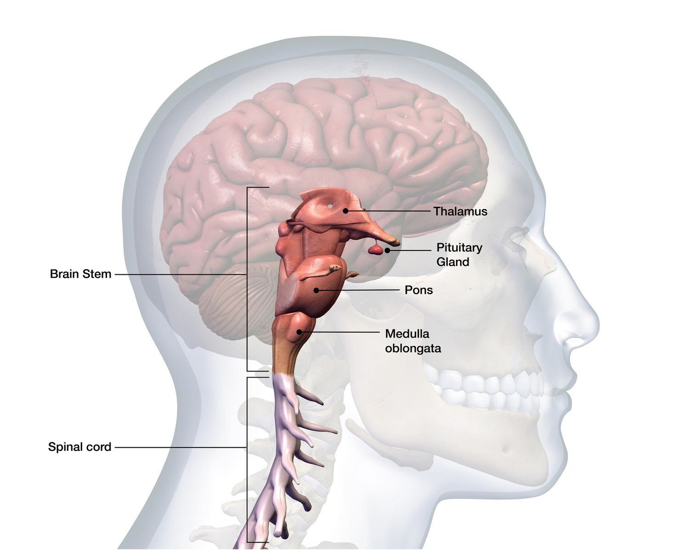
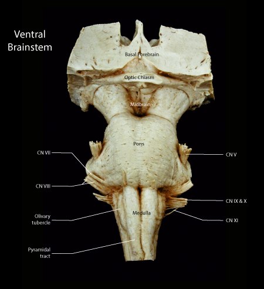
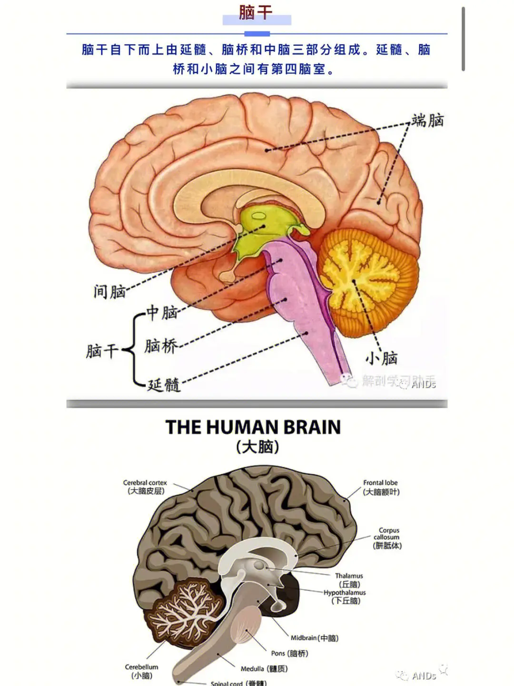

"脑死亡"和"植物人"的区别 :

[.small]
[options="autowidth" cols="1a,1a"]
|===
|Header 1 |Header 2

|脑死亡
|- *脑死亡患者只能依靠呼吸机, 才能维持活着的假象。*

|植物人
|- 患者对自身和周围的环境完全丧失意识，但还存在着部分觉醒状态，比如呼吸、咀嚼和吞咽等原始反射，或许你还可以看到患者睁眼、自哭自笑、躲避疼痛等基本反射。

- *植物人的脑干是活着的，他不需要呼吸机的维持.*

|===

但目前人类科学对"脑死亡"的判定还不够精确，毕竟人类对大脑的了解还知之甚少。有鉴于此，大多数承认脑死亡的国家还保留着传统的“自主呼吸停止、心脏停搏、瞳孔放大、血压为零”等标准，"脑干死亡"仅仅是辅助判定。

中国对于脑死亡还没有公开承认，也没有公开否定。中国的<脑死亡法>一直在起草阶段.

== 长生不死

人类关于长生不死的希望, 目前来源于: 端粒、肿瘤细胞, 干细胞。

[.small]
[options="autowidth" cols="1a,1a"]
|===
|Header 1 |Header 2

|端粒
|细胞的分裂次数是有限的，大部分细胞分裂50~60次后就会慢慢死亡。

染色体两端的"端粒"DNA，它可以随着细胞的有丝分裂而缩短。一旦端粒消耗殆尽，细胞就会立即激活凋亡机制，即走向凋亡。

|肿瘤细胞
|肿瘤细胞可以长生不死, 如 Henrietta Lacks 的宫颈癌细胞的细胞系 (取该患者姓名的两个首字母, 即 H,L, 海拉细胞 HeLa Cells)。

端粒酶，可以延长端粒。"端粒酶"在正常细胞中会被抑制，但在肿瘤细胞中却被激活了。如果调控"端粒酶"，细胞就可以不断分裂下去.

但人类对此的研究, 还有很长的路要走。不要说能否激活"端粒酶"，就算能够激活，我们又该如何调控其速度呢？让细胞无止境地分裂，岂不是把正常细胞都变成肿瘤细胞了？

|干细胞
|干细胞是一类具有多向分化潜能, 和自我复制能力的 原始的未分化细胞。

**干细胞就是全身其他细胞的“祖宗”，而干细胞的“祖宗”叫作"胚胎干细胞"。它一方面可以无限地自我更新，一方面可以分化为体内的各种组织细胞类型，也称作“万能细胞”。**

现在的干细胞技术, 主要用来治疗血液系统疾病。

- 5岁的女儿得了白血病，父母赶紧要了二胎，利用二胎的干细胞, 来治疗大女儿的血液病。
- 还有许多家庭在孩子出生的时候, 就保存了胎儿的"干细胞"，用来预防将来可能出现的意外情况。

|===

中国有一句老话叫“好死不如赖活着”。说这句话的人一定没有看过医院里那些肿瘤晚期, 或者颅脑严重损伤的患者的痛苦经历。

我在医院里常常会碰到疾病晚期的患者。

因胰腺肿瘤已经开了三刀，身上插满了管子，**有的管子不断给他灌入维持生命的药物、血 浆，有的管子则不断渗出肿瘤坏死所产生的液体、粪便、尿液。**每过几个小时，我就要给他更换覆盖在管口和手术伤口上的纱布，不分昼夜。患者意识清楚，**每次换药都痛苦异常，但是如果不换，他就要被泡在尿粪之中。这种痛苦没日没夜，**大剂量的止痛药物也毫无用处。他这种状态让我深深地理解了“生不如死”这个词。

**起源于"上皮细胞"的叫"癌"，起源于"间叶细胞"的叫"肉瘤"，**这两者都是广义上的癌症。

拉丁文cancer，也就是“螃蟹”的意思，中文翻译成“癌症”。有一种猜测是，肿瘤在向周围扩散时会伸出像手指一样的触角，形如螃蟹。 +
后来盖伦使用 oncos 来描述所有种类的肿瘤，这也是 oncology （肿瘤学）命名的由来。

美国癌症协会, 每年都会公布各种癌症的5年生存率。你会发现很多癌症的5年生存率, 都在持续升高。然而，临床医生却感觉到疾病治疗的发展速度并没有那么快。这是什么原因呢？其实这得益于人们的及早就医，及大部分的人会坚持每年体检. 更多早期的肿瘤被体检发现了，这些肿瘤患者的治疗效果也更好了。“患者池”里早期癌症的比例越来越高，虚假地提高了患者的生存期。

通过早期的干预，我们确实延长了癌症患者的生存期。**但其实很多时候我们并没有治好疾病，而只是用药物和器械帮助患者强行续命。**

*原来我们只会有病治病，现在学会了防患于未然，很多癌前病变、良性肿瘤都选择手术干预。我们还发明了许多肿瘤相关的疫苗，把所有可能出现的癌症都杀灭在萌芽之中。*

- 安吉丽娜·朱莉的检查结果, 提示自己携带BRCA1基因，这意味着她拥有87%和50%的概率罹患"乳腺癌"和"卵巢癌"。虽然她手术切除了乳腺，但2015年的进一步检查提示她身体中的肿瘤指标还是有所提升。虽然原发肿瘤并没有找到，但是朱莉还是选择了及时切除"卵巢"和"输卵管"。

很少有人在知道自己得了癌症之后还能坦然面对，尤其是患有乳腺癌、甲状腺癌的女性患者。*在肿瘤手术之后，虽然患者能生存很多年都不会复发，但是他们很难完全正常地生活.*

*随着交通工具带着人类飞速流动，疾病的基因谱, 也可以在短时间内在全球范围内得到进化。*

疾病也变得更聪明了，选择了更加温和的方式来危害人类的健康。这是传染病为了自己的生存和发展主动做出了改变。

个体可以看成基因制造出来的复制基因的工具，被基因利用之后可以抛弃。 +

疾病(病毒, 细菌等)的目的是让自己得以生存延续，如果它们越快地让患者死亡，而不再传播疾病, 病毒自己的生命也会越快地结束。所以病毒等为了生存，不得不做些改变.

- 澳洲为了控制野兔, 引入了"多发性黏液瘤病"病毒. 第一年效果很好，感染病毒的澳大利亚野兔的死亡率达到了99.8%。但第二年野兔的死亡率就下降到了90%，后来这个数字逐年下降，最后稳定在了25%左右。 +
*病毒为什么杀不死野兔了？因为病毒意识到，野兔全死了，自己也就没有存活的空间了，所以在自己还没能进化出感染其他物种的能力之前，它要让野兔死得慢一点。病毒是有意识的吗? 其实没有，这只是自然选择的结果而已-- 这种病毒中更强烈的部分随着宿主野兔的快速死亡也死了，只有那些更加“温柔”的病毒可以存活并且传播出去。* (刚则必折，所以工作与搞政治也是一样，被骂也不用在意，能不在乎的人才能在那里活下去.)

- 灭蚊工作也是一样的。*不管哪种有效的灭蚊药物，只要灭蚊率不是100%，时间久了效果都会慢慢下降，直到达到一个平衡。这也是自然选择的结果, 能活下来的基因, 其后代会繁殖壮大了. 这同时也预言了这个事实存在 -- 人类无论如何努力, 也不可能完全消灭蚊子。* +
其实，有一个思路可以解决这个问题。人们发现保证生活环境的清洁，蚊子的数量就会大幅减少。**蚊子在短时间内失去了生存环境，还无法进化出在其他环境生存的能力，许多野生动物灭绝的原因也是如此。**但是蚊子的生活环境过于广泛，现在人们还没有这个能力。

- 医生发现人类的梅毒似乎也慢慢地变弱了。*梅毒主要通过"性途径"进行传播。它的传播能力在众多的疾病中显得很弱，因为性接触比空气、飞沫这一类的传播途径效率低得多。因此，梅毒不能过快地杀死宿主，否则自己也无法存活。于是，梅毒表现出了非常缓慢的进展过程，不仅在临床上分为一期、二期、三期，很多患者的病情也只局限在一期和二期，并不会快速进展。有了更长的患病时间，它传播的概率就增大了。* +

- 艾滋病也是如此。*正因为它太厉害了，就需要有非常长的潜伏期，不然就无法把自己延续下去。*

也有人从这个角度, 来解释了女性长寿的一个原因 : 病原体之所以认男不认女，跟男女的体质差异无关，而是它们提高自身存活概率的策略。

血癌 Leukemia (即白血病)是一种由病毒性感染引发的癌症，从感染到发病是有一定概率的。研究者发现，这个发病概率在加勒比海地区的男性和女性身上, 没有什么差异; 但是在日本，男性比女性更容易从病毒性感染, 发展成癌症。这是为什么呢？

研究者认为的解释是:  这是因为, 与加勒比海地区的女性相比，日本女性的生育率更高，通过母乳哺育婴儿的比例更高，哺乳期也更长. 所以病原体就利用这一点, 先让自己在女性身上的致病变弱, 来让女性不仅可以跟男性一样将病原体传递给其他人群，还可以通过生孩子把病原体传播给子女.

为什么人类历史早期的传染病更加烈性呢？原因很简单。几百年前人类几乎没有细菌、消毒的概念，更不用说传染病的隔离了。患者用过的东西，甚至患者的尸体，都没有标准的处理方式。腐败的食物随处乱扔，屎尿直接排入河流。这些都大大方便了传染病的传播, 所以它们不需要在人类身上隐忍. 即使杀死了人, 也能快速传转到另一个人身上. (也就是说，古代，疾病感染人的难度很低，传播途径多，没有被人类封杀，病毒就能躺在温室里不需要拼搏，也就不需要太进化拼命，所以病毒不需要对人类太温和来增加传播的机会.)

癌症发病率最高的前三个国家, 是丹麦、法国、澳大利亚，这三个国家都是发达国家。这是因为导致癌症发病的最高危的因素是年龄！细胞每次分裂都有可能产生突变，人活得越长(即身体细胞分裂次数越多)，就越容易得癌症。换言之，只要你活着就一定会得癌症，一切只是时间问题。

癌症还有一个称号叫“万病之王”。**全世界有一半以上的实验室都在为攻克癌症而努力. 但是，往前回溯大约100年，癌症在医学界的地位比现在要小得多。当时的人们是被感染问题所困扰, **根本轮不到癌症。**因为天花、鼠疫、流感，甚至寄生虫，都可以让大多数人活不到得癌症的那一天。 **

美国科学家总结出了癌细胞在多年进化中, 所产生的10大特性：

- 自给自足的生长信号（ Self-Sufficiency in Growth Signals）；
- 抗生长信号的不敏感（ Insensitivity to Antigrowth Signals）；
- 抵抗细胞死亡（Resisting Cell Death）；
- 潜力无限的复制能力（ Limitless Replicative Potential）；
- 持续的血管生成（Sustained Angiogenesis）；
- 组织浸润和转移（Tissue Invasion and Metastasis）；
- 避免免疫摧毁（Avoiding Immune Destruction）；
- 促进肿瘤的炎症（Tumor Promotion Inflammation）；
- 细胞能量异常（Deregulating Cellular Energetics）；
- 基因组不稳定和突变（ Genome Instability and Mutation）。

癌细胞生存能力太强，远远超过了其他细胞。它们不仅不怕无氧的状态，还可以贪婪地抢走养分。为了生存下去，它们不仅在原发部位生长，还可以随着血液流向全身各处寻找更好的生长环境。*遇到一些强大的外敌，比如化疗，它们甚至会快速地突变来获得更大的生存概率。* +
好在癌细胞它本身没有传染的能力，也就不能在某个区域内暴发。

**感染是由微生物，**如细菌、真菌、支原体、衣原体等, *感染人体导致的，而这些微生物与人体细胞并不是一个物种，其生物学结构相差甚远。人类只需要针对微生物有而人体细胞没有的生物学性质, 去研发药物，就可以杀灭微生物了。* 比如青霉素，就是通过破坏细菌有而人类没有的"细胞壁"结构, 而发挥作用的。

**而癌症（恶性肿瘤）是由机体的正常细胞, 发生基因突变而发展来的，其生物学特性**与人类细胞固然有很大不同，但是**本质上都属于同一个个体。现有的手术、放疗、化疗都没有办法精确地将两者区分开来，**就带来“杀敌一千，自损八百”的后果。

当然，肿瘤细胞与正常组织细胞, 还是有很多差异的。目前，研究人员就利用这些差异, 研制了肿瘤"靶向治疗"药物，针对肿瘤细胞内异常激活的信号通路, 进行阻断。

随着免疫治疗的发展，人们已经可以通过药物, 对机体的免疫细胞进行修饰，使其对癌细胞的识别度提高，从而提升免疫细胞对癌细胞的杀灭作用。

动物也有癌症，但是其发病率要远低于人类.

人类还有什么器官不能换?

肝移植、肾移植、心脏移植技术, 都已经成熟。

移植最担心的是"排异反应". 免疫就是机体识别“自身”与“非己”的过程，对“非己”产生排斥.

排异反应分为两种:
[.small]
[options="autowidth" cols="1a,1a"]
|===
|Header 1 |Header 2

|"宿主"抵抗"移植物". *即人体免疫系统攻击外来的移植物，导致后者死亡。*
|- *在肾移植、肝移植等手术中，自身免疫系统对其发起攻击，导致移植的肾脏和肝脏不能存活。*

|"移植物"抵抗"宿主". 也就是外来的移植物攻击人体.
|- 血液移植中的移植物含有淋巴细胞，可能会攻击受移植者本人。
|===

免疫系统为什么能识别“自身”与“非己”呢？因为**每个人都有自己的“ 生物学身份证” ， 也就是"人类白细胞抗原" humanleukocyte antigen，HLA。**免疫系统就是靠检查每个细胞和组织的“生物学身份证”来区分是不是自己人的。一旦发现不是自己人，它就立刻展开攻击。因此，*受体和供体的 HLA 相似性越高，发生"排异反应"的概率就越低。*

“生物学身份证”只在一种情况下会重号，那就是"同卵双胞胎"。

父母和子女的HLA, 肯定有一半相同。因此，大部分时候我们看到的都是父母和子女之间的移植。而且在医院里，父母给子女捐赠器官的情况比比皆是，而子女捐赠给父母的却不多。

亲生兄弟间, 有1/4的概率完全相同，1/4的概率完全不同，1/2的概率一半HLA相同。

双胞胎的HLA 一定完全相同吗？答案是否定的，这还得区分"同卵双胞胎"和"异卵双胞胎"。

*"异卵双胞胎"是同时怀孕的两个不同个体，从遗传学上来说，他们和普通的兄弟姐妹没有什么区别。* +
而**"同卵双胞胎"是由同一个受精卵分裂而来的，他们拥有完全一致的HLA表型。**从遗传学角度来说，*"同卵双胞胎"是两个基因完全相同的备份。*

*也正因为"同卵双胞胎"有着相同的基因，只要有一人带有某种遗传病的基因，另一个人也很难幸免。*

据不完全统计，中国每年有150万人因为末期器官功能衰竭需要移植，但能够完成移植的人只有极少数。*由于目前国内器官移植的相关法律还不完善，中国的器官捐献率长期处于世界末位。合法通道的"低捐献率", 与非法地下器官买卖的猖獗, 构成了跷跷板的两端.*

1984年，美国通过了《国家器官移植法案》 National Organ Transplants Act  ， 并根据该法案成立了器官获取和移植网络 Organ Procurement and Transplantation Network ，OPTN。该法案规定，OPTN是唯一一个能够与所有器官捐献和移植系统中的专业人员相联系的组织，是公开独立的合作组织。这个组织在美国相关政府部门的授权监督下，由一家私人的、非营利机构来运行，颁布相关政策，开发检索查询系统，在美国全国范围内分配可用的器官。该法案还明令禁止出售和购买器官。1986年，美国非营利机构—— 器官共享联合网络（ United Network for OrganSharing）首次与美国卫生部签订合同，代表政府运行OPTN。经过30年的发展，全美各类移植中心已经达到上千家。

在美国，需要移植的患者由医生介绍到移植中心，是否需要移植, 由移植中心医生来评定。如果移植中心决定接受这个人作为移植候选人，便会将他的医疗档案, 加入美国器官移植名单。该候选人此时还未开始排名。而患者的信息会在数据库中保存，并且不断更新。

只有在确认死亡、确认捐献器官之后，负责收集器官的移植协调员, 才会进入数据库。计算机在数据库中, 把供体特征与每个患者配对，然后按照OPTN器官分配政策, 产生每个器官的受体候选人顺序的名单。

没有足够的器官可供移植怎么办

人造器官

**老年人摔倒之后特别容易发生骨折，最常见的就是"股骨颈骨折 femoral neck fractures"。由于这个部位血供很差，**老年人本身的恢复能力也不好，*手术复位后骨头很难再长好，于是很多老人只能在床上度过余生。*"股骨颈骨折"甚至被称为“人生中的最后一次骨折”，患者在这次骨折之后就再也无法起床.

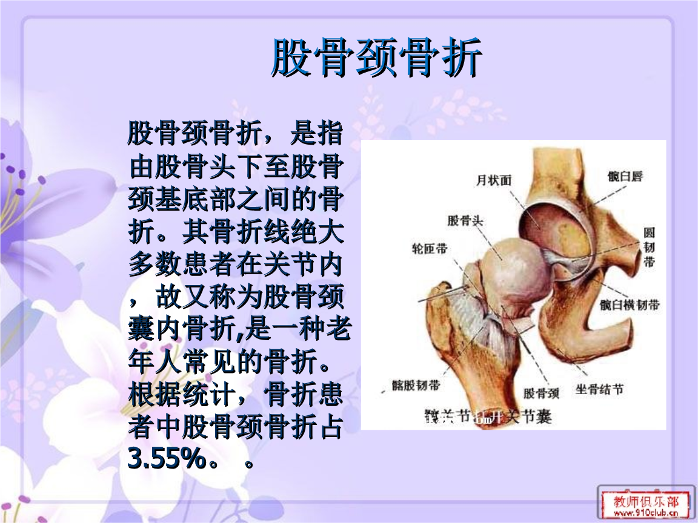
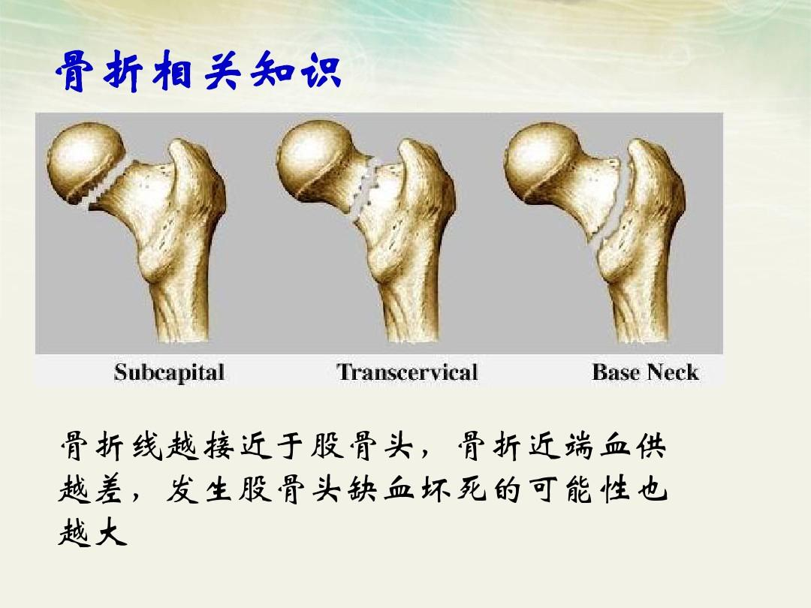
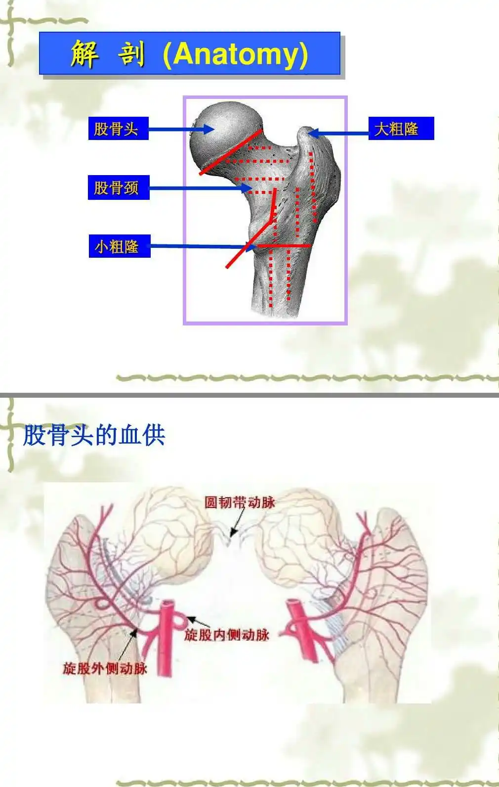

造成老年人发生骨折, 有两个基本因素:  +
1.**骨质疏松骨强度下降,**加之股骨颈上区滋养血管孔密布，均可使股骨颈生物力学结构削弱，使股骨颈脆弱。 +
2.另外，**因老年人髋周肌群退变，反应迟钝，不能有效地抵消髋部有害应力，**加之髋部受到应力较大（体重2～6倍），局部应力复杂多变，**因此不需要多大的暴力，如平地滑倒、由床上跌下或下肢突然扭转，甚至在无明显外伤的情况下都可以发生骨折。**

而青壮年股骨颈骨折，往往由于严重损伤如车祸或高处跌落致伤。因过度过久负重劳动或行走，逐渐发生骨折者，称之为"疲劳骨折"。

老年人跌倒后诉髋部疼痛，不能站立和走路，应想到"股骨颈骨折"的可能。

自从"人工关节"置换技术成熟之后，这样的老年患者完全可以更换关节。目前的髋关节置换手术, 对患者的年龄完全没有要求，百岁老人换关节的情况屡见不鲜。我80岁高龄的外婆也是经历了双侧的关节置换手术，才得以重新行走。

人工心脏、人工肺、人工皮肤和血管, 都早已成为现实，科学家们正尝试人工制造所有器官，甚至连人造神经元, 和人造大脑, 都已经有了雏形。

但是，**人造器官的生物相容性, 一直是技术上的一个难题。**人类之间的移植都面临着排异反应，*没有生命的人造零件, 更难以和有生命的人体完全融合。*

中枢神经系统（central nervous system=CNS）是神经系统的主要部分，*包括位于椎管内的脊髓, 和位于颅腔内的脑.*

image:img/Nervous_system_diagram-en.svg.png[,60%]

脊椎动物的"脑"位于颅腔内，"脊髓"位于椎管内。脊椎动物的**中枢神经系统,从胚胎时身体背侧的"神经管"发育而成。神经管的头端演变成脑，尾端成为脊髓。**神经管腔在脑内的部分发展演变成为"脑室"，在脊髓部分演变成为"中央管"。脑在开始时是3个脑：前脑泡、中脑和菱脑泡，以后又衍化成为端脑、间脑、中脑、小脑、脑桥和延髓。

**"中枢神经 Central Nervous System=CNS "和周围神经完全不同。**人脑与"脊髓"相连接，组成了人体的"中枢神经系统"，是整个神经系统的控制中心。**"中枢神经"一旦被切断，断端一般不能愈合，功能也得不到恢复，**此时患者已经没了心跳呼吸，更没有恢复的时间了。

中枢神经系统的功能极其复杂，**呼吸、血压、体温等基本生命状态的维持, 都靠"脑干"，它的位置在后脑勺，过去称之为“手术禁区”。这个部位只要有轻微的损伤，患者便九死一生。**现在外科学技术虽然进步飞速，但是**恢复"脑干"区域的神经连接, 依然让医生和科学家们望而却步。**

科学总在发展，所有人们认定的东西都有可能被推翻。现在许多技术的发展，诸如干细胞、电刺激、特殊的聚乙二醇等，都有可能为未来"换头"之后的恢复打下理论基础。

近年来的研究表明，"阑尾"能分泌多种活性物质和消化酶等，可以促进肠管蠕动，影响人体免疫系统，维护人体肠道微生物平衡。

**除了感冒、肺炎之类的疾病，其实现代医学没有什么疾病是可以完全根治的。所谓的“治好了”更多的时候是切除了病变器官本身。**阑尾炎没办法控制，那就切掉阑尾；各种癌症无法逆转，我们就采取切除相应器官的方式来消除癌细胞。那么，我们还能切除什么呢？

[.small]
[options="autowidth" cols="1a,1a"]
|===
|Header 1 |Header 2

|胆囊
|胆囊作为储存胆汁的器官，很容易发炎和长结石.

胆囊切除对人体有什么影响呢？手术后短时间内人体的消化功能可能会受到影响，但是时间久了胆总管可以逐渐取代胆囊的作用，对患者的日常生活基本没有影响。

|脾脏
|脾脏其实是比较重要的器官，也**是机体最大的免疫器官. 不过如果脾脏出现外伤破裂无法修补，只能选择切除。**

**脾脏是人体最大的淋巴器官，摘除了可能会对人体的免疫功能产生影响，**特别是儿童可能发生爆发性感染，对人体的造血功能也有一定的影响。

|肾脏
|人有两个肾脏，相互备份，互相代偿。如果患者真的肾衰竭，代表两个肾脏都不行了，此时可能需要肾移植。 +
很多父母选择把自己的肾脏捐给孩子，而失去一个肾脏的人保留着另外一个健康的肾脏，可以完全不会受影响地正常生活。只是平常要注意不可过于劳累及使用肾毒性药物，要好好保护唯一的一个肾脏。

|生殖器官
|女性的子宫、乳房甚至卵巢，男性的睾丸都可能因为疾病而被迫切除。卵巢或睾丸切除后，患者日后就需要及时补充激素.

|胃脏和大小肠
|患有胃癌、肠癌的患者，需要手术来完全切除胃脏、小肠或者大肠。部分切除胃肠可以对生活不产生很大影响，但**如果完全切除胃肠道，患者的生活质量会大打折扣**。 +
*切除胃脏的人的消化吸收功能下降，没有地方储存食物，吃一点就会饱胀，或者出现反流、呕吐、腹泻等症状。* +
*而切除大肠直肠的人只能在腹壁造瘘 lòu，带着粪便袋子生活，对日常活动有较大影响。*

瘘管，指身体内因发生病变,而**向外溃破所形成的管道，**病灶里的分泌物由此流出。*也有手术后安装的，管子的开口或在皮肤表面，或与其他内脏相通，病灶内的分泌物等可以从这里流出来.*

**"瘘管 fistula "是指因脓肿引起的, 连接于"体外"与"有腔器官"之间, 或两个"有腔器官"之间的病理性"排脓管道"，通常有两个或两个以上开口，**前者称为"外瘘"，有外口和内口，如肠瘘、肛瘘等；后者称为"内瘘"，仅有内口，如直肠膀胱瘘、胃结肠瘘等。*瘘管溢出物, 因其相连的器官不同而各异，可为消化液、粪、尿或其他分泌物。*

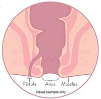
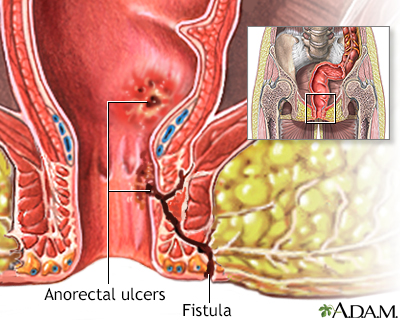

|膀胱
|膀胱是泌尿系统中一个极为重要的肌性器官，其功能为贮尿和排尿。 +
膀胱也会发生恶性肿瘤，不得不手术切除。*膀胱全切除后，患者只能采用尿流改道, 或重建膀胱的方式, 来解决排尿问题。无论是什么方式，患者都需要持续佩戴尿袋，而且造口周围的皮肤很容易发生炎症、溃疡等并发症。*

|===

对于其他脏器来说，如果要切除就会非常影响生存了，比如心脏、肝脏、肺脏等。

*其实，人类医学技术远没有想象中的高超。我们只是在对人体功能稍有理解之后，做出了权衡利弊之后的判断而已。* +
**我们并不能真正治愈疾病，只能在疾病和功能之间做个艰难的选择。**比如对于某些骨肉瘤患者来说，如果不锯掉腿，肿瘤就无法治愈. 我们在死亡和运动之间极其
艰难地选择了后者。 *人体的每一个器官都如此宝贵、无可取代，切莫等到失去之时才后悔莫及。*

倘若基因检测技术, 发展到**我们一出生就会拿到一张基因名片，上面把每个人的基因优势和缺陷写得一清二楚，这是不是会丢失掉人的平等性，让人类一出生就被贴上三六九等的标签呢？**

- 比如飞行员职业，航空公司普遍对身体素质的要求比较严苛。**哪个单位都不想要一个患癌症概率高的员工，所以携带癌症易感基因的人可能会面临, 即使目前身体健康, 却依旧找不到工作的情况。**
- **受影响最大的莫过于医疗保险行业。基因发病率不同，保费还会一视同仁吗？**
- 有犯罪倾向基因的人, 哪怕他没有犯罪, 也会不受待见.
- 《黑镜》（Black Mirror）中, 军人看到有基因缺陷的人群，就会把他们毫不留情地消灭掉。想让后代拥有更好的基因, 这种做法, 似乎让法西斯的理论(制造优秀种族)又复活了。

一般来说，羊通常可以存活11~12年，很多人猜测克隆出来的动物可能会出现早衰现象。但事实并非如此。在多莉之后，科学家还克隆了许多只它的兄弟姐妹。其他的羊都经历了正常的生老病死，年龄也和正常的绵羊无异。

现代医学看似厉害，但其实除了感冒，大部分疾病都不能完全治好。 +
我们是发明了各种先进仪器，给重症患者用上呼吸机，气管上插上管，用上升压药，猛推强心剂，心跳没了也可以电击回来，用几个通道输血输液，但这只能让患者一时半会儿死不了而已。

但现实是很悲哀的。我们对太多的疾病束手无策了，如癌症、心脑血管疾病、自身免疫疾病、糖尿病、颈椎病、白癜风，甚至连牛皮癣也是不治之症。对了，*其实我们连青春痘
都治不好。* +
目前**在肿瘤研究方面，我们能做的就是把患者的生存期延长几个月，好的也就几年而已。**

**下一次的医学进步, 一定是方法学上的进步。就像人类必须要有显微镜才能知道细菌的
存在，**必须要有X射线才能了解腹中的情况。

一种新技术被发明之后，很多人都会过来“蹭热度”，如纳米医学、量子医学等。但很遗憾，这些大部分都是无效的。

愚昧的医学方法 -- 现在有许多产品贴着磁疗的标签，如磁疗枕、磁疗仪、磁疗鞋垫等。

*"磁共振"是强磁场，金属物品千万不能带进检查室。*

外科医生，就是一双灵巧的手加上一把锋利的手术刀，所以外科医生也被称为“一把刀”。*把患病的地方切除, 成为当时治愈疾病的最好方法。* 也不要以为现代的手术多么先进和微创，*现在有很多手术, 连医生自己都不知道到底是否真的"利大于弊"。* 医学和其他学科一样，从来都是在不断变化的，永远没有绝对的对与错.

切除患者"结肠"的手术，此后患者再也不会便秘，但变成了每日腹泻。

现代的研究已经证实，**酒不仅没有保健作用，长期饮酒还会引起多种疾病。所谓的暖身，只是让你的热量更快地消耗掉而已；**而所谓的精神放松，只是对大脑的一种麻醉。

一项新技术被发明出来后，很多人都会过来“蹭热度”，如纳米医学、量子医学等。

