= 心脏_冠状动脉搭桥手术
:toc: left
:toclevels: 3
:sectnums:

'''

== 冠状动脉搭桥手术

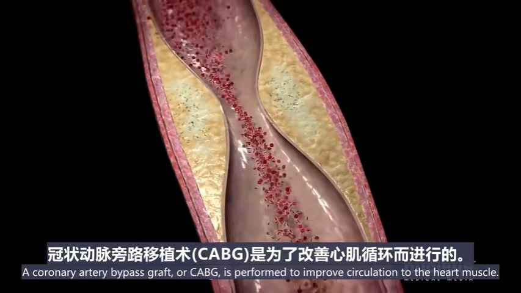

冠状动脉旁路移植术(CABG), 是为了改善心肌循环而进行的。 +

在手术前, 会执行静脉注射药物, 来帮助你放松。 +
该手术是在全身麻醉下进行的. 一根呼吸管, 将通过你的嘴插入你的喉咙, 来帮助你呼吸。将在您的膀胱内放置导尿管, 排出您的尿液。冠状动脉搭桥手术, 通常需要三到六个小时。

在传统的搭桥手术中, 你的外科医生首先在胸骨或胸骨上的皮肤上做一个切口。

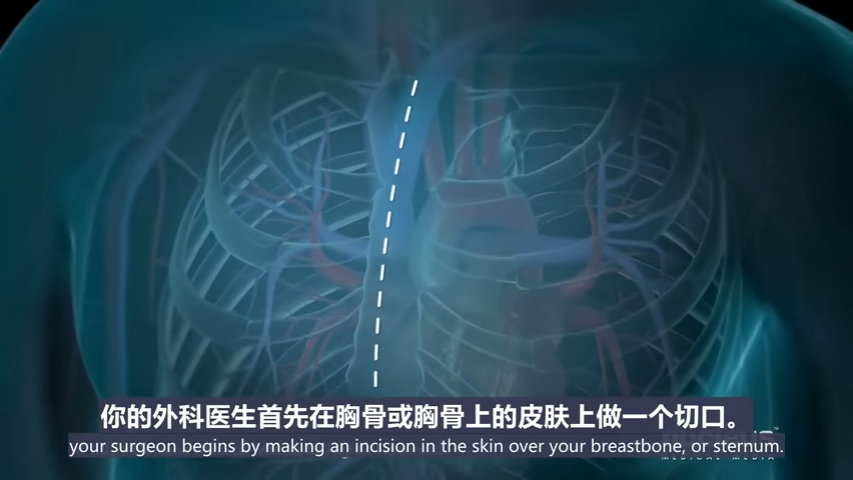
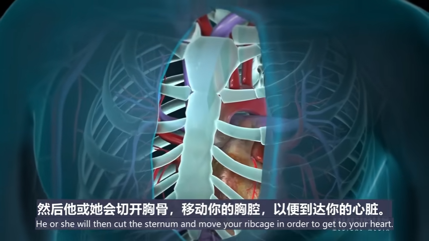
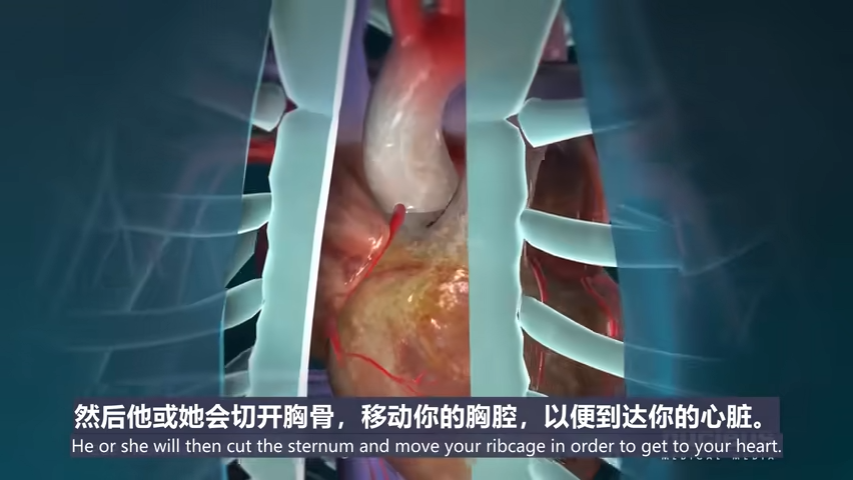

==== 若使用"心肺机"来做手术

在整个过程中, 你的循环系统, 可能会连接到"体外循环泵"或"心肺机"。在手术过程中，这台机器可能暂时执行你的心脏和肺的功能.

通常可以使用不同的血管进行移植:

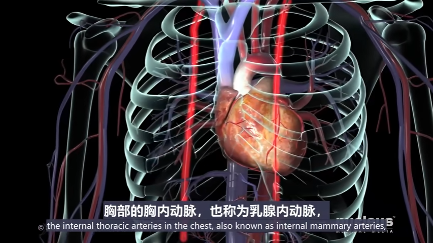
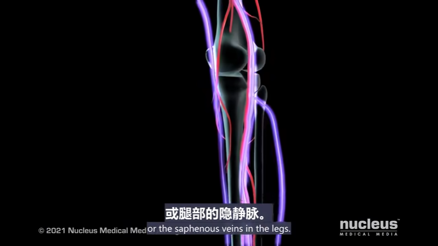

对于胸内动脉移植，外科医生会让上端, 连接锁骨下动脉; 并将下端, 从胸壁转移到冠状动脉，刚好在堵塞的地方。

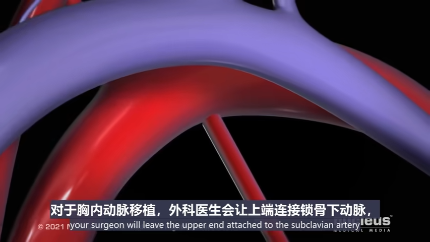
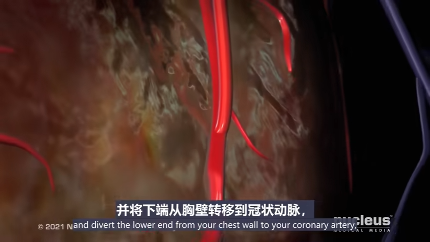

对于隐静脉移植物，你的外科医生会将一端缝合到主动脉上, 另一端缝合到狭窄的动脉上，就在阻塞处的上方。

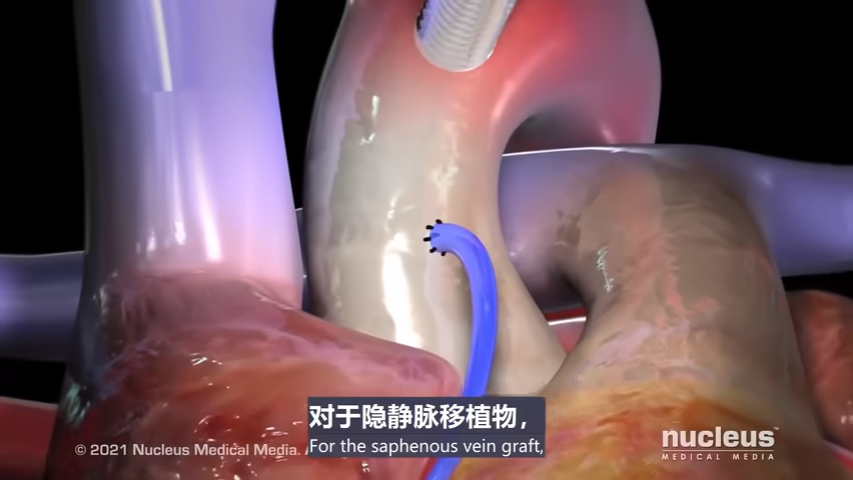
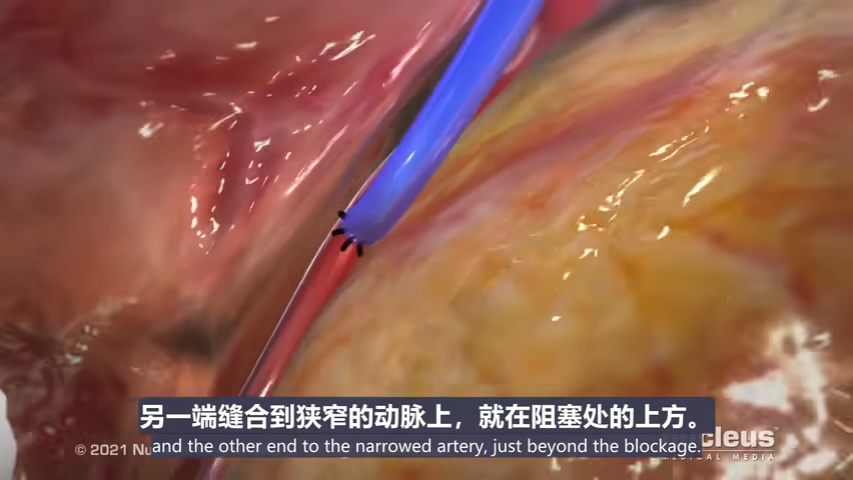

当移植物安全就位后, 你的外科医生可能会使用电信号来恢复心跳, 并在心脏上安装一个临时起搏器。一旦你的心脏恢复正常跳动, 手术即结束, 胸骨被合上. 一根临时引流管将穿过皮肤,置于切口下方。

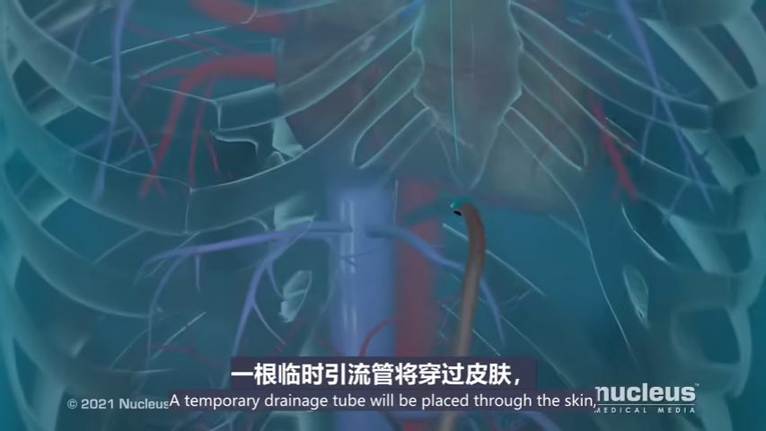
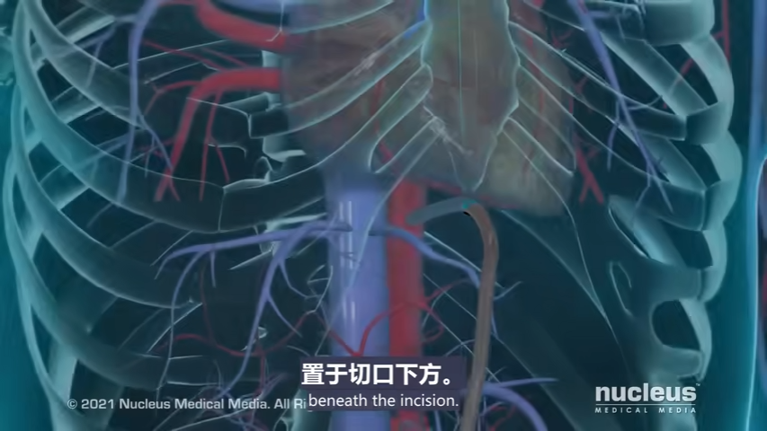

==== 若不使用"心肺机"来做手术

心脏就会继续跳动, 这可能被称为"非体外循环搭桥手术"或"微创手术"。

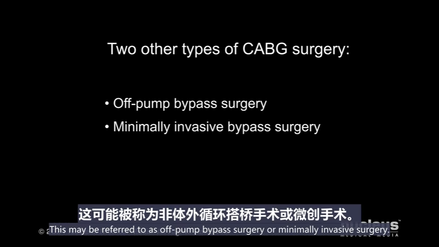
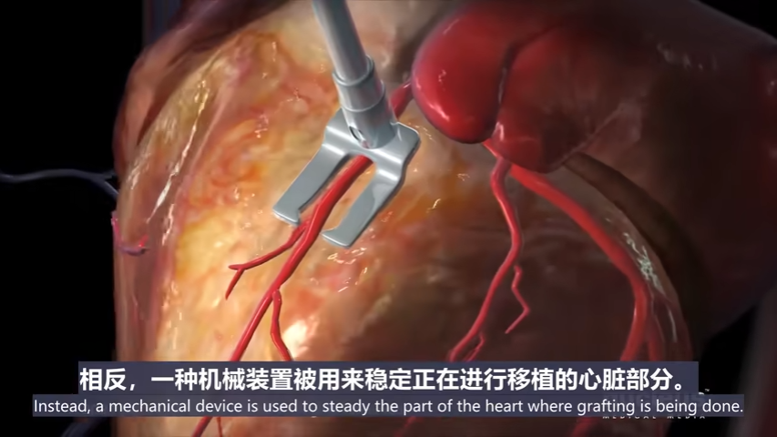
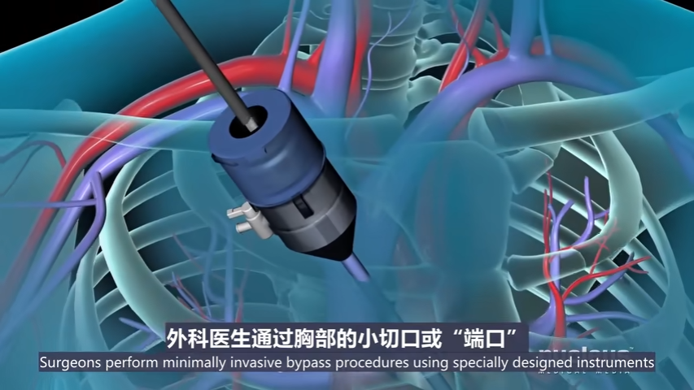

手术后，你将被送往重症监护室。我们会仔细监测你的心脏活动。如有必要，起搏导线将用于暂时控制你的心率。胸管将留在原位, 以排出胸腔内多余的血液和空气。一旦你可以自己呼吸，你的呼吸管将被移除并换上氧气面罩。膀胱导尿管将留在原位。在接下来的三到四天里，当你从手术中恢复的时候, 所有的这些装置都会被逐渐移除。

'''

