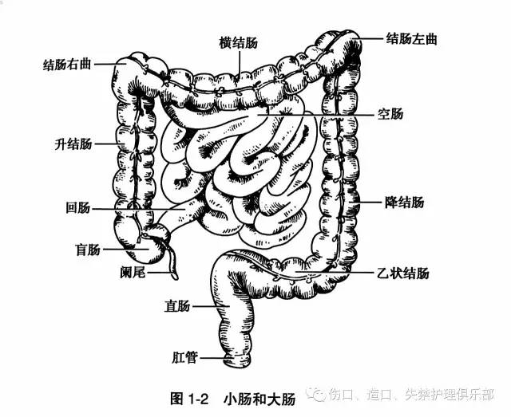
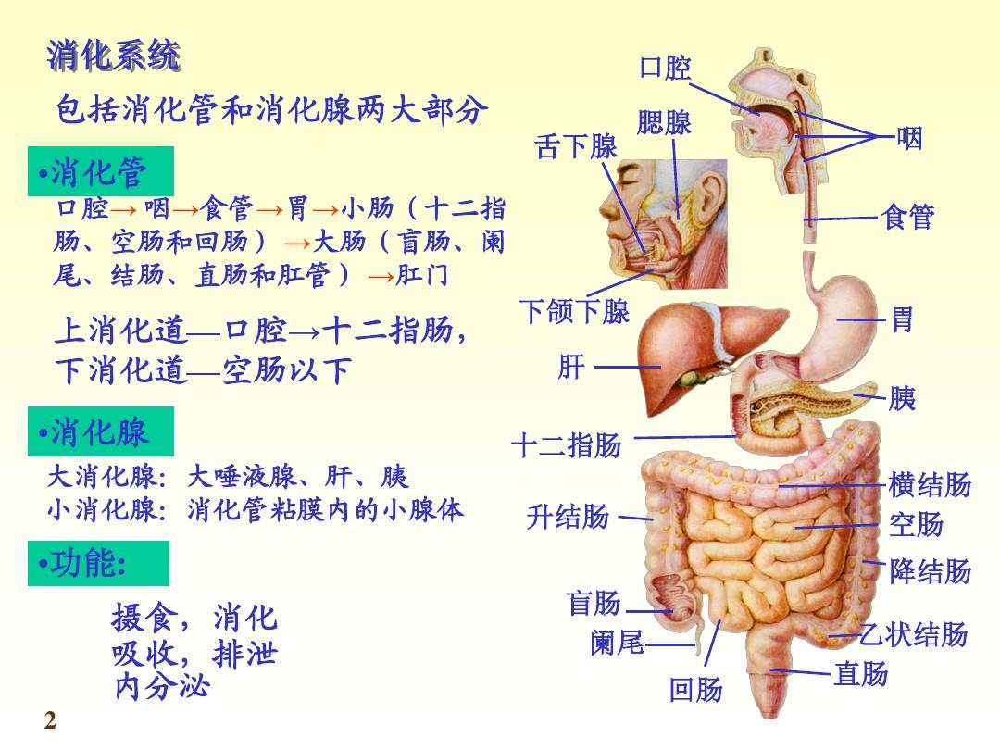
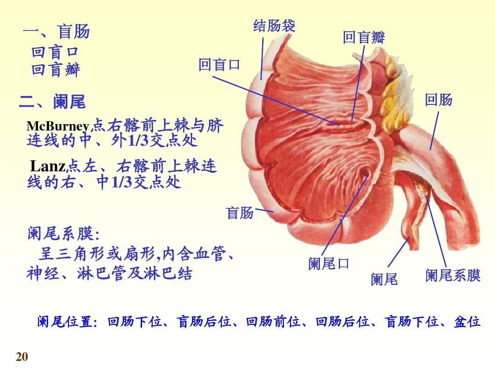
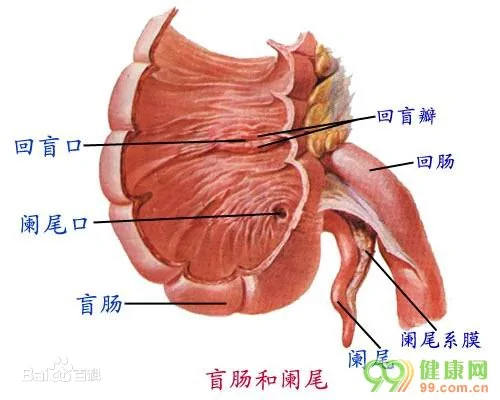

= 消化系统/ 大肠
:toc: left
:toclevels: 3
:sectnums:

'''

== 大肠

大肠的粘膜, 无绒毛. +
大肠, 全长约 1.5m, 全程围绕于"空肠","回肠"的周围.

因大多数可吸收的物质, 已经被小肠所吸收. 大肠内含有多种细菌, 这些细菌产生的酶, 能分解食物残渣; 产生沼气, 氨气等有毒成分; 也能抑制某些病原菌的生长.

大肠能将食物残渣的水分进一步吸收; 也能产生粘液, 润滑大便.

== 大肠的起始端:  盲肠 cecum，caecum

盲肠, 是小肠和大肠交界处连接的盲囊，属大肠的一部分，也是大肠的起始部，形如囊状袋. 在人体位于腹腔右下部的腹膜内.

==== 阑尾

盲肠向上延续为升结肠，下部有一孔通阑尾.  +

盲肠是大肠起始段的袋状部分。因其远端闭塞不通，故称盲肠。 +
在盲肠远端伸出一小管，称为"阑尾"。因其管腔细小，容易阻塞而发炎，为"阑尾炎"，俗称"盲肠炎"。

==== 迴盲瓣

同"迴腸"交接区的内壁, 有"迴盲瓣"，可阻止小肠内容物过快流入大肠, 并有防止大肠内含物倒流的作用。

'''

== 结肠

'''

== 直肠

未被小肠或大肠吸收的物质, 会留在直肠中, 并通过肛门排出体外.

'''
