= 消化系统 / 小肠
:toc: left
:toclevels: 3
:sectnums:

'''

小肠由三部分组成, 分别为: 十二指肠, 空肠, 回肠.

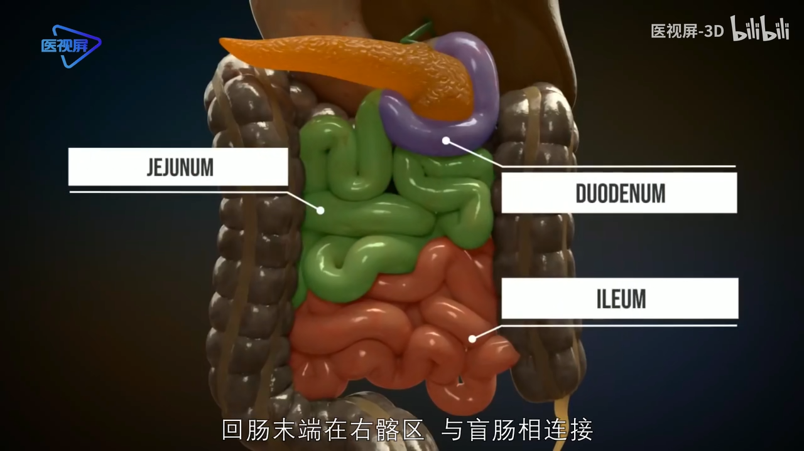
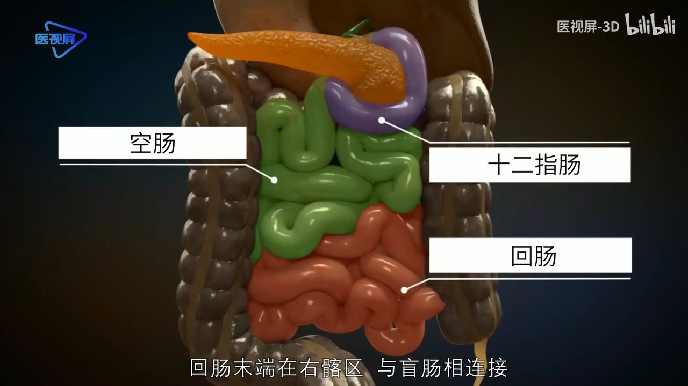

[.small]
[options="autowidth" cols="1a,1a"]
|===
|Header 1 |Header 2

|环形皱襞bì
|十二指肠和空肠粘膜, 均有"环形皱襞bì", 以增加与食物的接触表面. 其由粘膜和部分粘膜下层, 共同向肠腔内突起形成, 长约1cm.

|绒毛
|皱襞上有大量绒毛, 长0.5-1mm. +
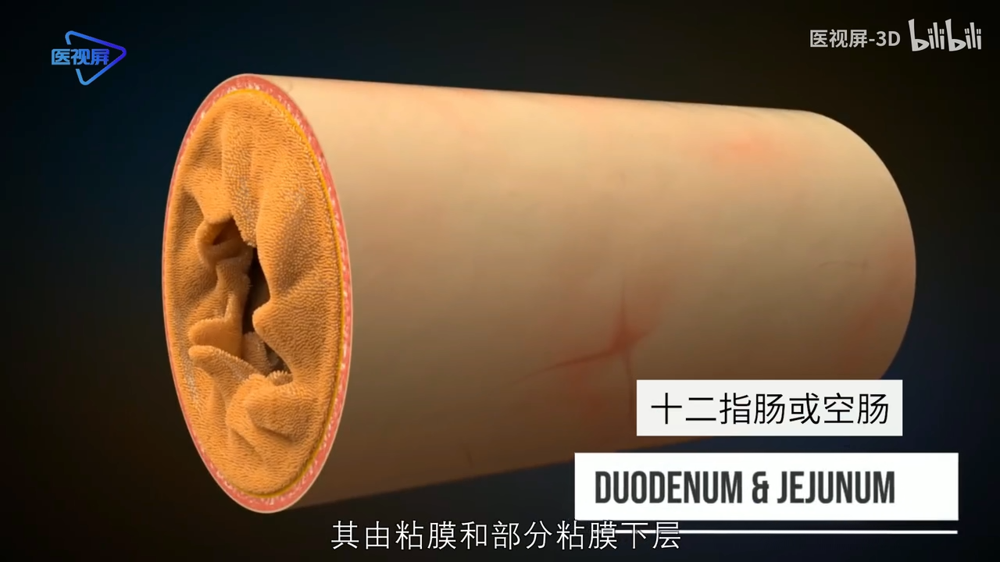 +
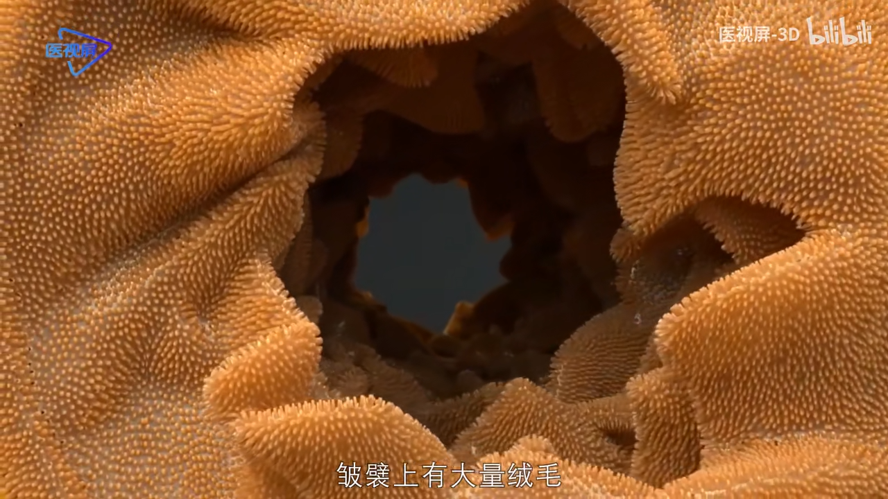 +

|
|绒毛的外表面是一层"柱状上皮细胞". +
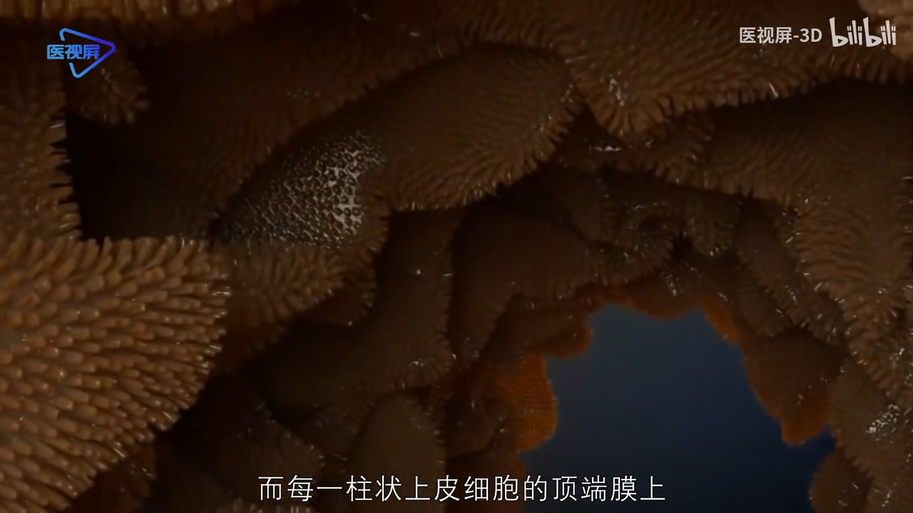

|微绒毛
|而每一"柱状上皮细胞"的顶端膜上, 约有1700条"微绒毛". +
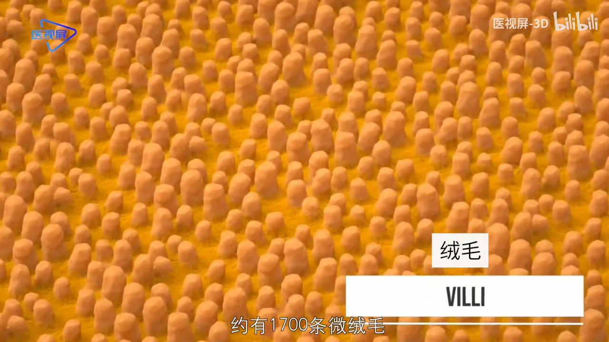

小肠绒毛内部, 含有丰富的毛细血管, 毛细淋巴管, 平滑肌和神经纤维网等结构. +
示例中的绿色营养物质, 通过绒毛"柱状上皮细胞"的顶端膜, 进入细胞. 再通过细胞基地侧膜, 进入到毛细血管中.

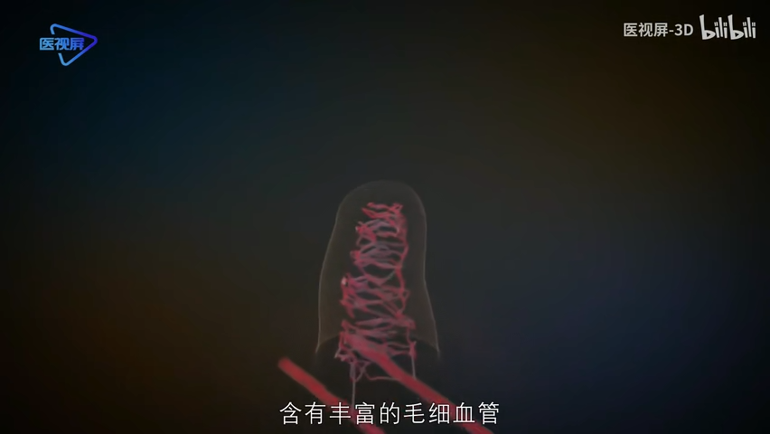
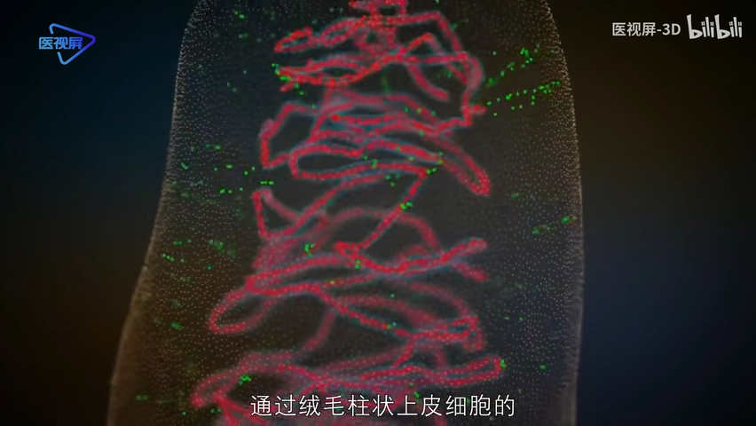
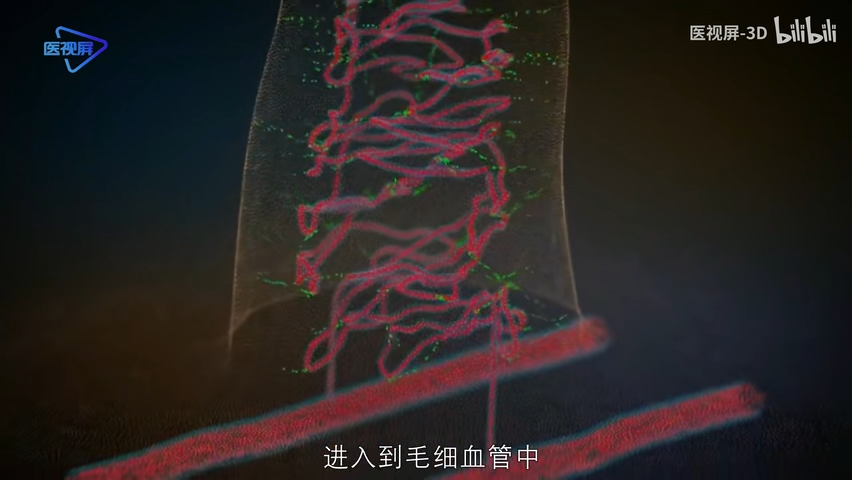

由于皱襞, 绒毛, 和微绒毛的存在, 最终使小肠的吸收面积, 增加约600倍, 可达200-250 ㎡.
|===

'''

== 十二指肠

== 空肠

== 回肠

小肠的最后一部分是回肠. "回肠"末端在"右髂qià区"、与"盲肠"相连接.

小肠的紧张性收缩, 使小肠保持一定的形状和位置. "分节运动"是小肠特有的运动形式, 表现为食糜所在肠道的环形肌, 以一定的间隔交替收缩, 把食糜分割成许多节段, 使食糜和消化液充分混合, 与肠壁紧密接触, 有利于消化和吸收.

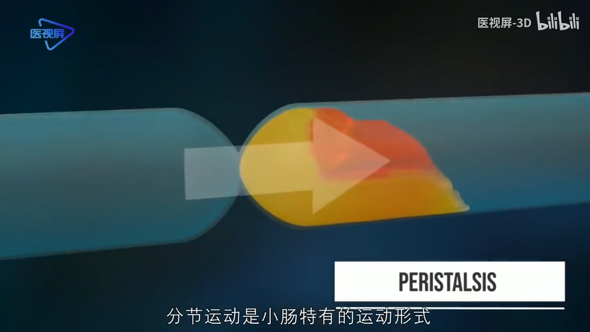
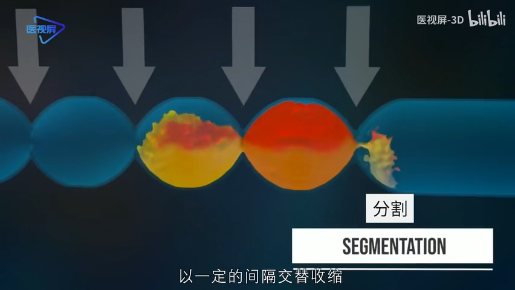

