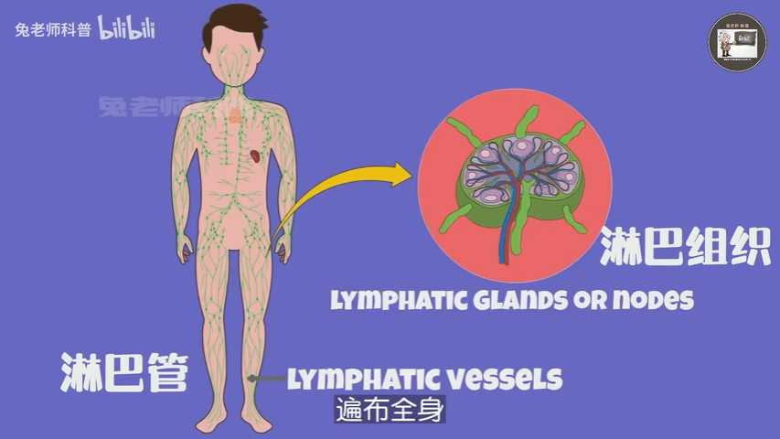
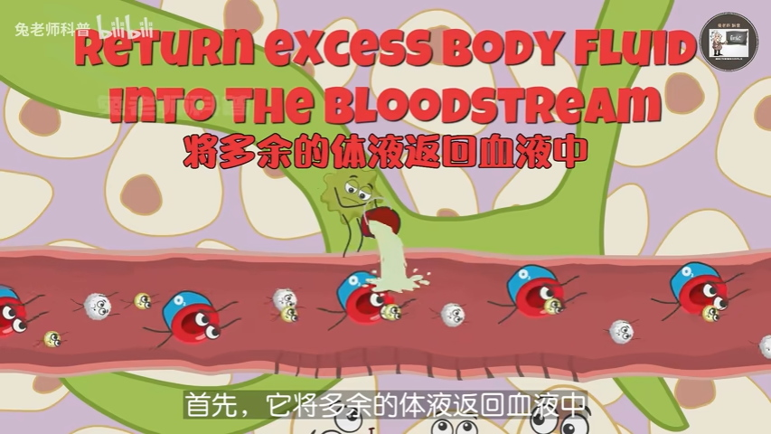
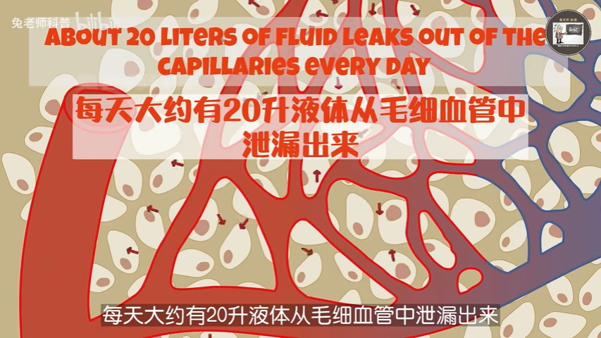

= 淋巴系统 lymphatic system
:toc: left
:toclevels: 3
:sectnums:

'''

== lymphatic system

https://zh.wikipedia.org/wiki/%E6%B7%8B%E5%B7%B4%E7%B3%BB%E7%B5%B1

淋巴网络系统包含这几个部分: 淋巴管 + 淋巴组织 + 淋巴器官(如脾脏, 胸腺)

它有三个方面的作用:

[.small]
[options="autowidth" cols="1a,1a"]
|===
|Header 1 |Header 2

|1.它将多余的体液, 返回血液中 +

|*由于毛细血管渗漏, 血液会流失一定的体液.* 因此, 每天会大约有20升液体从毛细血管中泄漏出来. 这些液体主要含有水、营养物质、气体、离子和蛋白质. *这20升液体中, 通常只有17升会被毛细血管的静脉端重新吸收.  剩下的3升, 会被淋巴系统重新沉积到血液循环系统中. 这对我们的身体非常重要, 因为* : +

1. 它可以防止液体导致细胞膨胀或受损.*
2. 而且**如果液体重新进入循环系统的速度, 与离开的速度不一样, 血液就会变稠, 影响循环系统运输氧气和营养物质的能力.**
3. 此外, 这种液体中含有"人体需要清除的废物分子和毒素" .

|2.淋巴系统帮助免疫系统, 捕捉任何入侵的细菌
|细菌可以悄悄地隐藏在您的细胞中, 并通过淋巴管渗透进入您的身体, 这时淋巴结成为了免疫检查点. 其中免疫细胞如"巨噬细胞"、"树突细胞"和"淋巴细胞"(如"B细胞"和"T细胞"), 会对淋巴中的细菌和毒素进行清除.

比如当您喉咙感染时, 细菌和白细胞会积聚在喉咙的"淋巴结"中, 导致它们肿胀. 这些肿胀的腺体会阻塞您的喉咙, 导致吞咽困难甚至疼痛. 这也是为什么医生经常检查喉咙是否肿胀, 以确定您是否感染.

|3.淋巴系统在"吸收消化脂肪"方面, 也发挥着重要作用
|消化的脂肪覆盖在蛋白质和盐中, 有助于它们溶解在水中. 然而, 这也使得脂肪团太大而无法进入毛细血管. 相反，脂肪通过大淋巴管进入, 然后脂肪团被转移到"胸导管"的静脉中, 进入血液系统.
|===

若没有健康的淋巴系统, 你的血液会变得粘稠, 你的免疫系统会受损, 而且你将无法满足身体的营养需求.

'''
