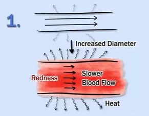
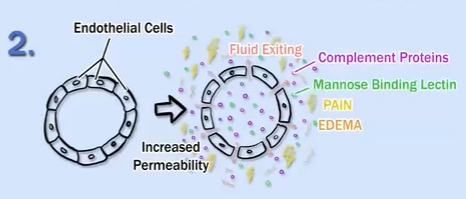
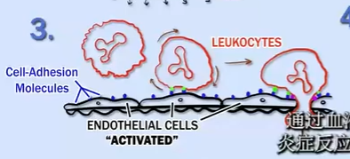
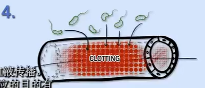
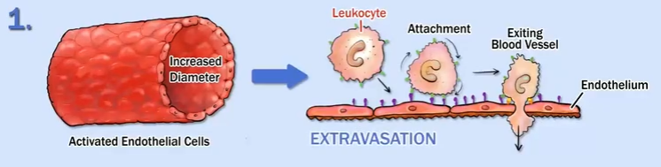
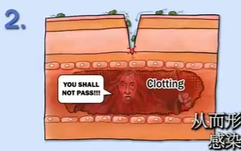
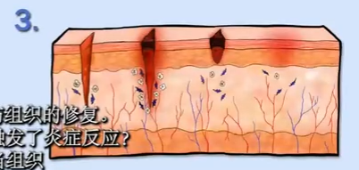

= 炎症
:toc: left
:toclevels: 3
:sectnums:
//:stylesheet: myAdocCss.css

'''

炎症反应, 在感染或受伤后数小时内开始，其特征是感染或损伤部位的"水肿"或"肿胀"，"发热"。发红和疼痛。
这些特征, 反映了局部血管的四种变化:

[.small]
[ cols="3a,2a"]
|===
|Header 1 |Header 2

|1.炎症时的发热和发红, 是"血管直径"增加的结果.
*血管直径的增加, 也会导致血流减漫.*
|

|2.** 血管通透性也有增加.** 排列在血管壁上的"内皮细胞", 通常紧紧地挤在一起, 但在炎症期间, 它们之间会出现间隙一**这导致血液中的液体流出, 并积聚在局部组织中, 从而导致水肿和疼痛.** 液体含有"血浆蛋白", 如"补体蛋白"和"甘露糖结合凝集素", 有助于抵御病原体.
|

|3.排列在**血管壁上的"内皮细胞", 在炎症过程中被"激活". 也就是说, 内皮细胞表达促进"循环白细胞"(也称为"白细胞")**结合的细胞粘附分子.
|

|4.*感染部位的"微血管"有"凝血", 防止"病原体"通过血液传播.*
|
|===

炎症反应的目的有三个:

[.small]
[options="autowidth" cols="1a,1a"]
|===
|Header 1 |Header 2

|1.让身体保护自已免受入侵的微生物. *血管直径的增加, 以及活化的内皮细胞, 导致"白细胞"能够附着在内皮上, 然后迁移到它们可以攻击"病原体"的组织中.* +
"白细胞离开血流, 并进入组织"的这一过程, 称为"外渗".
|

|2.*诱导局部血液凝固,* 从而形成物理屏障, *防止感染扩散到血液中.*
|

|3.促进受伤组织的修复.
|
|===

但是**是什么触发了"炎症反应"? 当组织受到物理损伤, 或当"病原体"被"巨噬细胞"识别, 并随后被其他"白细胞"识别时, 就会建立"炎症"状态. 这些情况诱导多种引起"炎症反应"的"炎症介质"的释放.**

"巨噬细胞"和"中性粒细胞", 分泌"前列腺素"、"白三烯"和"血小板活化因子"(PAF), 它们是"炎症"的脂质介质. 由于它们是由降解的"膜磷脂"制成的, 因此生产速度很快.

然后, "巨噬细胞"分泌"细胞因子", 这些"细胞因子"是"免疫系统细胞"释放的影响其他细胞的物质.

一种细胞因子是"趋化因子", 其充当化学引诱剂. "趋化因子"引起定向趋化性, 即细胞或细胞部分在对应于物质浓度增加 或减少的梯度的方向上的运动. 在趋化因子的情况下, 它们引导吞 噬细胞

29
00:02:49,333 --> 00:02:54,082
Concentration in a direction corresponding to a of Chemokines gradient of increasing or decreasing 向趋化因子的来源移动, 这是需要它们的地方.
concentration of a substance

30
00:02:54,083 --> 00:02:59,874
现在我想指出两种对炎症反应很重要的细胞因子是 C5a 和肿瘤坏死 因子

31
00:02:59,875 --> 00:03:13,707
-a或 TNF-a. 补体片段 C5a在炎症反应中起多种重要作用. 例如
, 它刺激呼吸或氧化爆发, 即快速释放活性

32
00:03:13,708 --> 00:03:24,082
氧. 同时它吸引中性粒细胞和单核细胞. 因此, 它实质上是在他们 到达时为战斗做好准备. 它还增加血管通透性, 增加

33
00:03:24,083 --> 00:03:29,916
NEUTROPHIL MONOCYTE 内皮上粘附分子的表达, 并导致局部肥大细胞释放

34
00:03:29,917 --> 00:03:42,374
N有炎症分子组胺和 MNFGY的颗粒. TNF4 G也是+种重要的细胞因 子, 在检测到病原体后由巨噬细胞迅速产生, 是一种有效的

35
00:03:42,375 --> 00:03:44,374
NEUTROPHIL MONOCYTE MAST CELL 内皮细胞激活剂. 内皮细胞的激活是

36
00:03:44,375 --> 00:03:47,082
内皮细胞激活剂. 内皮细胞的激活是
Patni o gens

37
00:03:47,083 --> 00:03:53,707
炎症反应的核心. 巨噬细胞产生的细胞因子, 尤其是 TNF-a, 会导 致内皮
Pathogens

38
00:03:53,708 --> 00:03:57,791
细胞在巨噬细胞检测到病原体后的几分钟内迅速将含有 P -选择素的

39
00:03:57,792 --> 00:04:17,166
P-选择素现在出现在局部内皮细胞的表面
atf to ger rs

40
00:04:17,167 --> 00:04:24,082
内皮细胞

41
00:04:24,083 --> 00:04:31,082
王要表达 E-选择素.
P-选择素到达细胞表面后不久, 合成编码 E-选 择素的m RNA Pathogens

42
00:04:36,708 --> 00:04:41,874
于中性粒细胞表面的硫酸化唾液酸-Lewis X相互作用. 一旦炎症开始, 中性粒细胞就会
Pat no gens

43
00:04:41,875 --> 00:04:46,041
组成第一波细胞, 穿过 血管壁进入发炎的组织.

44
00:04:46,042 --> 00:04:51,666
此后, 单核细胞穿过血管壁并分化为组织巨噬细胞.

45
00:04:51,667 --> 00:04:57,582
在炎症的后期, 其他白细茹嗜酸性粒细胞和淋巴细胞也

46
00:04:57,583 --> 00:05:03,041
进入感染部位. 通常, 白细胞在血流最快的小血管中心行进

47
00:05:03,042 --> 00:05:08,374
然而, 在发炎的组织串 较慢的血流允许

48
00:05:08,500 --> 00:05:12,957
白细胞大量与血管内皮细胞相互作用

49
00:05:13,167 --> 00:05:18,874
此外, 血管损伤会触发两种酶级联反应一 激肽级联反应

50
00:05:18,875 --> 00:05:21,457
和凝血级联反应. 激肽系统由血浆蛋白酶组成.

51
00:05:21,458 --> 00:05:35,791
De grad lation Activation 和凝血级联反应. 激肽系统由血浆蛋白酶组成.

52
00:05:35,792 --> 00:05:40,416
这种级联反应的最终结果是产生 几种炎症介质, 包括

53
00:05:40,417 --> 00:05:49,416
PERMEABILITY 缓激肽, 一种增加血管通透性并引起疼痛的血管活性肽, 疼痛

54
00:05:49,417 --> 00:05:53,124
De grad lation PER ME ABILTY 让你意识到问题所在, 并让你固定身体的那个部位

55
00:05:53,125 --> 00:05:58,291
Degradation PERMEABILITY 帮助防止感染扩散. 凝血系统是另一种蛋白酶级联反应

56
00:05:58,292 --> 00:06:08,291
Pro Hh rom bin
hrom bin Factor ) 其活化导致形成纤维蛋白凝块.
→ Fibrin FIBRIN STABLE CLOT

57
00:06:08,292 --> 00:06:17,499
其活化导致形成纤维蛋白凝块.

