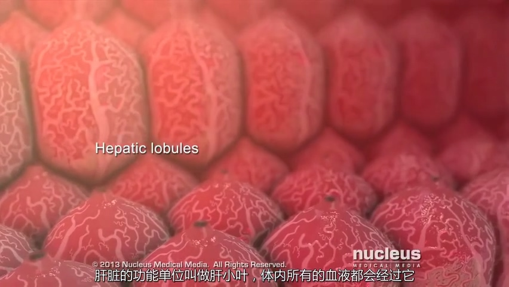
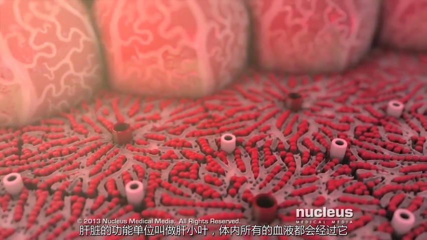
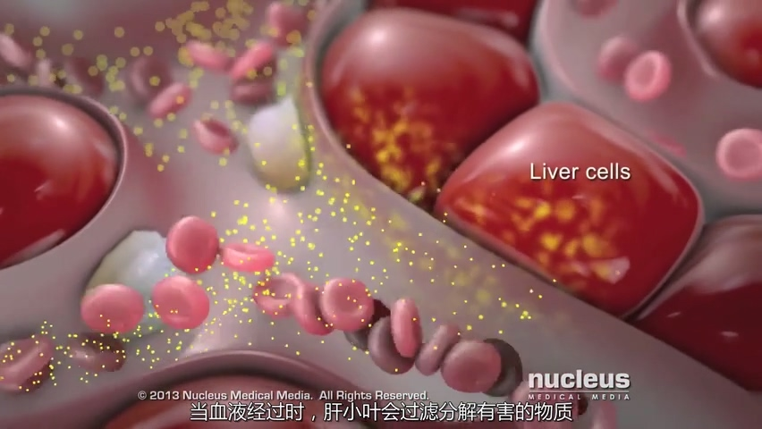
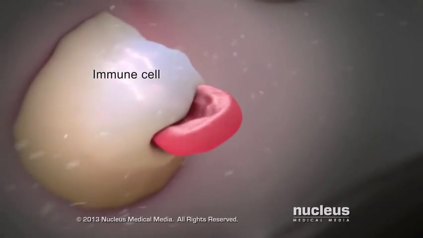
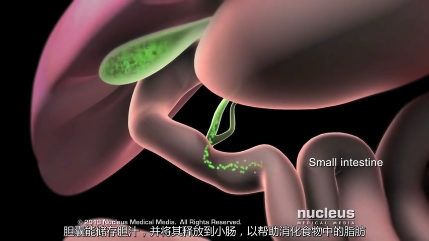
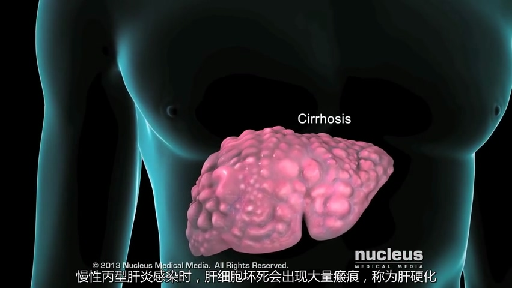

= 肝炎
:toc: left
:toclevels: 3
:sectnums:
:stylesheet: myAdocCss.css

'''

== 丙型肝炎

[.small]
[options="autowidth" cols="1a,1a"]
|===
|Header 1 |Header 2

|肝功能, 及肝小叶
|肝脏是体内最大的器官, 它有许多重要的功能. +
*肝脏的功能单位, 叫做"肝小叶"，体内所有的血液都会经过它.* +

*当血液经过时, "肝小叶"会过滤分解有害的物质. 清除"细菌", 以及破坏"衰老的红细胞".* 形成抗疑血因子(肝素). +

进餐后, 肝脏会储存营养物质, 并在需要的时候给机体供能.

*肝脏还会产生"胆汁".* +
*胆囊能储存胆汁，并将其释放到小肠,以帮助消化食物中的"脂肪".* +

|丙型肝炎病毒 -> 肝硬化
|当肝脏感染了"*丙肝病毒*"时，即称为"C型肝炎"（或"丙型肝炎").

*丙型肝炎病毒, 主要通过血液或其他体液传播(同乙肝类似).* 比如: +
- 分享个人卫生用品, 如使用被感染者的剃刀或牙刷 +
- 直接接触感染者的血液或体液 +
- 母婴传播 +
- 与病毒感染者发生性关系  +
- 与感染者共用注射器  +

在"丙型肝炎"感染初期, 或急性期, *"丙肝病毒"会进肝脏, 并侵入"肝脏细胞".*
病毒侵入肝脏细胞后, 并进行自身复制. *在复制过程中, 病毒遗传物质会发生突变，从而产生新的病毒株.*  +

作为应答,*机体免疫细胞, 会攻击"病毒"和"被病毒感染的肝细胞". 结果,这些肝细胞会发炎, 然后死亡.*   +
*在坏死和受感染的肝细胞周围，瘢痕（假小叶）形成，肝脏正常功能丧失.* +
image:img/肝炎/0006.jpg[,40%]

*"慢性丙型肝炎"感染时，肝细胞坏死会出现大量瘢痕，称为"肝硬化". 这将限制血液流动，导致肝脏永久性收缩和硬化.* +

疫苗中的"减毒活病毒"，可以训练免疫系统识别和攻击"丙肝病毒". *然而, 丙肝病毒频繁的突变, 使疫苗中可能未包含的突变病毒株*. 因此,无法使用有效的"丙肝病毒疫苗", 来预防丙肝病毒.

感染丙肝时, 免疫系统可能会把体内所有的病毒都清除掉, *然而, 大多数感染病毒的人, 都会发展为"慢性丙型肝炎".*  +
*"慢性丙肝"时，免疫系统无法完全清除病毒.* 此时, 医生可能会用联合抗病毒药物, 使用"利巴韦林"和"注射干扰素"(一种增强免疫系统的药物). 这些药物同时使用时, 对丙型肝炎是有效的.

如果是实在严重的慢性丙肝，医生可能建议"肝移植".
|===

