= 肝癌
:toc: left
:toclevels: 3
:sectnums:
:stylesheet: myAdocCss.css

'''

[.small]
[options="autowidth" cols="1a,1a"]
|===
|Header 1 |Header 2

|肝的病变
|也就是从: "肝炎 -> 肝硬化 -> 肝癌" 的发展过程. +
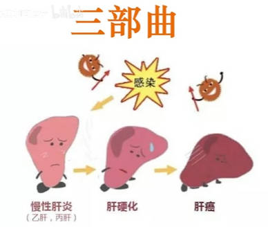

|肝的功能
|它就像是一个门卫, 来把守着机体的一些营养物质, 以及有毒物质的代谢. *我们消化的东西都会经过肝这个门卫 , 有用的留下, 有害的去除, 再被组织器官吸收.*  +

|脂肪肝
|酒精是有害物质, 如果酒精到达肝脏, 肝就会把它给去除掉. **如果酒精太多了, 肝细胞一直996的工作, 便会造成肝内"脂肪"堆积, 形成"脂肪肝".** "脂肪肝"是没有明显的症状的.  +
-> 如果不再喝酒, 让肝细胞能够好好休息, "脂肪肝"是可以被修复的.  +
-> 但如果继续喝酒, 肝细胞没完没了的工作, 就会使肝脏受损, 产生炎症, 肝细胞会"变性", 甚至会坏死. +

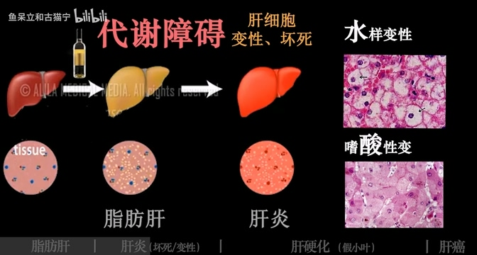

"肝细胞"的"变性"有两种, 分别是由于"水"和"酸"代谢发生障碍, 引起的"肝细胞水肿"和"嗜酸性变".
在这两种变性的基础上, 肝细胞会分别产生"溶解性坏死"和"嗜酸性坏死". +
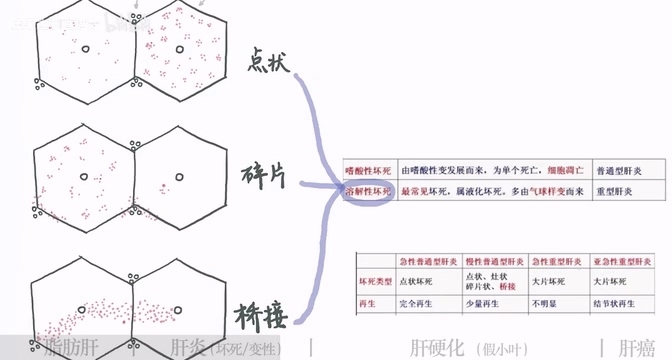

溶解性坏死: +
"溶解性坏死"也会根据坏死的形状, 分为点状、碎片状、桥接, 以及大片坏死. 当然坏死的部位越小, 对应的肝炎也就越轻, 所以**对于重型肝炎, 肝细胞的坏死都是大片大片的.** +
值得注意的是, "桥接坏死"是"慢性肝炎"所特有的. +

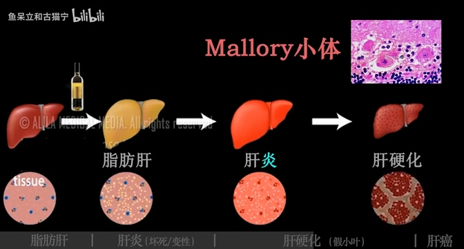

|肝硬化
|好在**肝脏是有一定的再生能力**, 所以对于"急性普通型肝炎", 肝细胞是可以完全再生的.  +

*但如果肝细胞的损伤太厉害了,* 就像我们摔倒划破了皮, 这伤口太大了, *就会留下一道疤, 这疤痕其实就是"纤维组织增生"的结果,* 就好比妈妈在衣服上打的补丁一样. *如果这"肝细胞"反复的坏死, 补丁打的到处都是, 就会形成"肝硬化".*  +
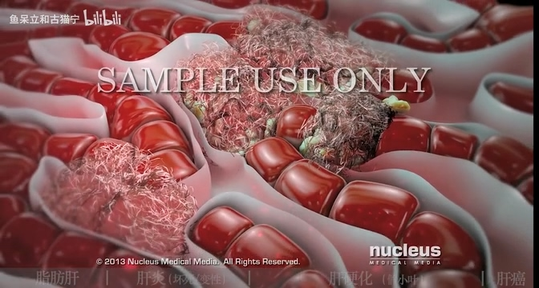

*由于纤维组织打的补丁多了, 原本大片的"肝小叶", 就会被"像绳子一样的纤维组织"分割, 形成大小不等的"肝细胞团块", 我们称其为"假小叶".*  +
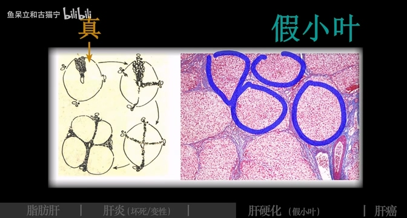

**这"真假"又是如何区别的呢, 相对于原有的"肝小叶", "假小叶"中肝细胞排列紊乱, 位于中间的"中央静脉"要么没了, 要么多了, 要么偏离了位置. ** +
由于麻绳的随机分割, 有的假小叶中还可以看到"门管区", 又由于是炎症导致的"肝硬化", 所以可以看到"炎症细胞"的存在. +
"酒精性肝硬化"中, 还可以看到 "Mallory小体".

*导致"肝硬化"的原因, 除了可以是"酒精", 还可以是"病毒性肝炎",* 譬如我们常说的"乙肝".

|门脉性肝硬化
|**肝是血流丰富的组织, 肠道、脾脏中的血流, 大部分会经过"门静脉"进入肝脏, 回流到心脏中.**  +
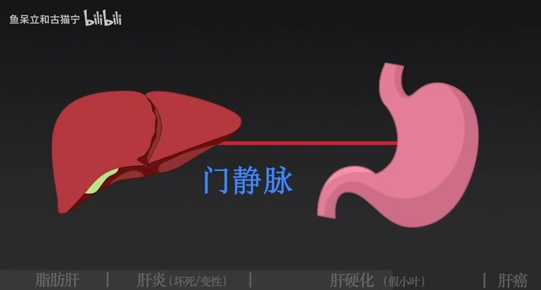

*但在"门脉性肝硬化"时, 肝脏无法行使正常的功能, 就像一块石头堵住了回流的静脉. 水管的一头被堵住了, 另一头的水不就跑不出来了吗? 因此在"门脉性肝硬化"中, 我们常常可以看到"腹水, 脾肿大, 胃肠道淤血"等等.*  +
由于"肝脏"是"凝血酶"和"激素"的代谢场所, 所以**肝硬化的患者常常会伴有"出血, 蜘蛛痣, 肝掌"等症状.** +
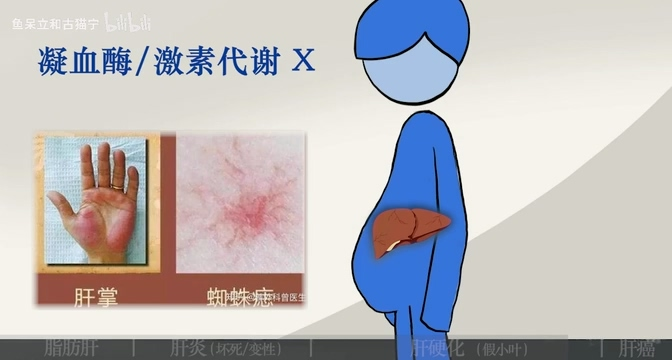

在我国, "病毒性肝炎"是引起"门脉性肝硬化"的主要原因.

|坏死后性肝硬化
|*除了最常见的"门脉性肝硬化", 还有"坏死后性"和"继发胆汁性肝硬化".*  +
*其中"坏死后性"特别恶劣, 它是导致三部曲中最后一步"肝癌"的重要原因. 从"坏死后肝硬化"到"肝癌", 大约需要7年的时间.*  +
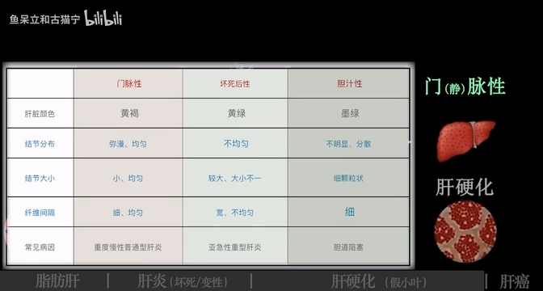
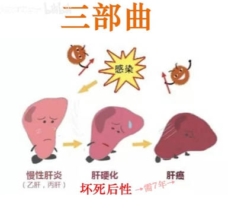

*因为肝脏的血液循环十分丰富, 肝癌非常容易发生转移. 最容易发生的是"肝内转移", 也就是自己转移给自己. 当然它也会通过"淋巴、肝静脉"等向"肝外"转移.* +
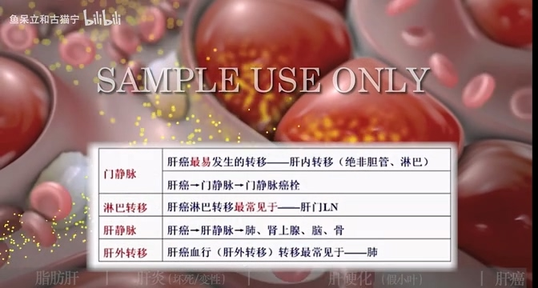
|===

'''

