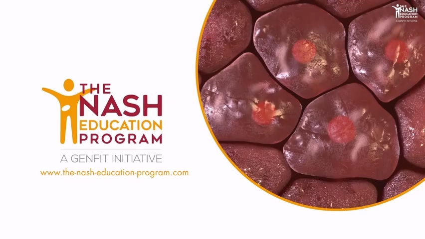
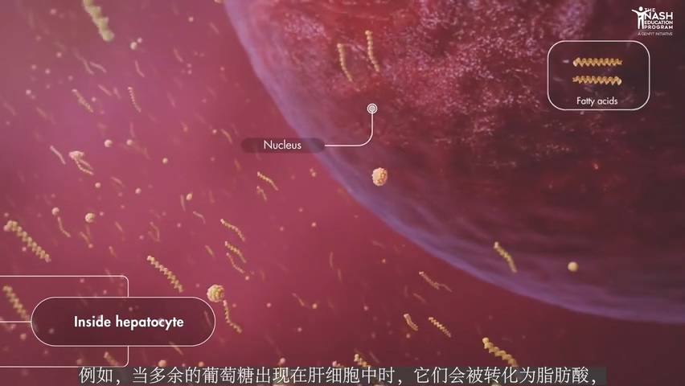
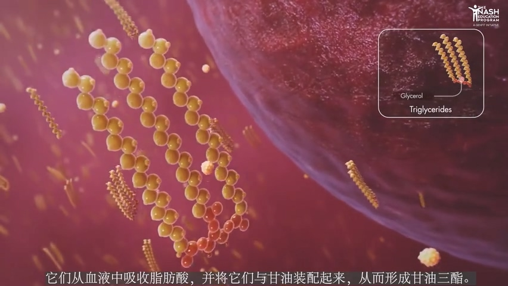
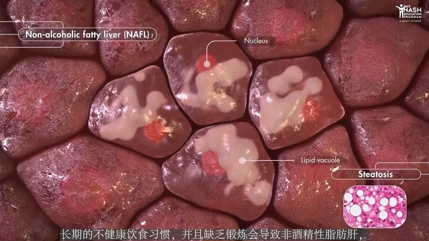
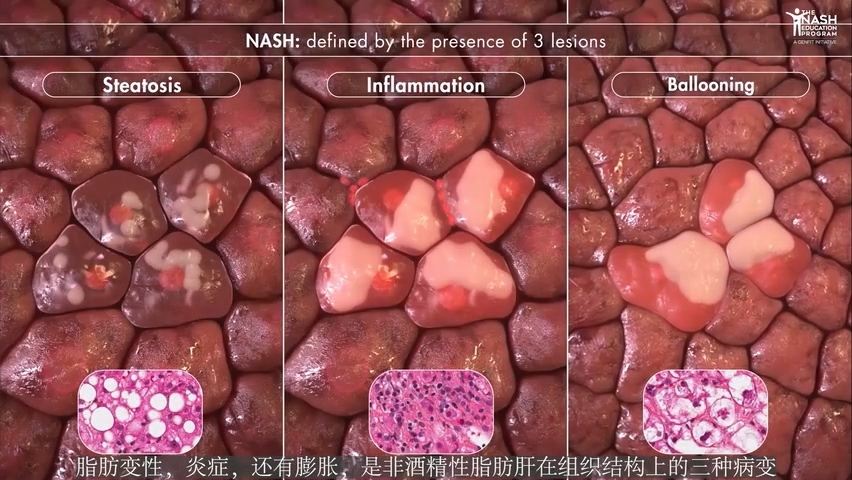
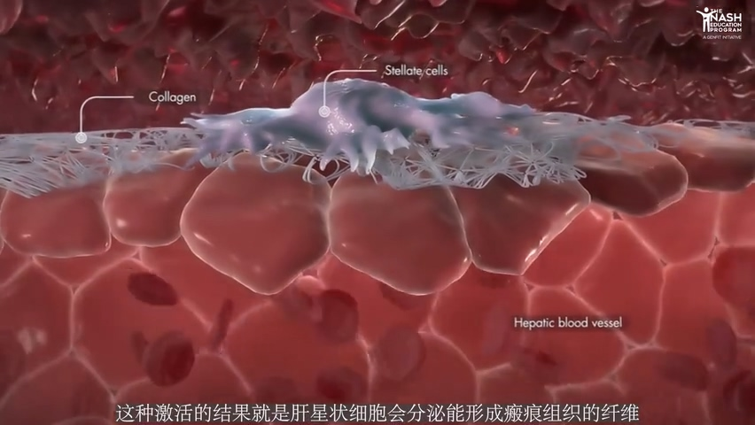

= 肝硬化
:toc: left
:toclevels: 3
:sectnums:
:stylesheet: myAdocCss.css

'''

== 肝硬化

[.small]
[options="autowidth" cols="1a,1a"]
|===
|Header 1 |Header 2

|肝脏功能
|"肝脏"承担着许多重要的功能, 包括由"特定肝细胞"完成的"营养代谢".  +
例如, *当多余的"葡萄糖"出现在肝细胞中时, 它们会被转化为"脂肪酸",* 我们称之为"从头合成". +

*肝细胞同样也是"脂质代谢"的主要调控者: 它们从血液中吸收"脂肪酸"，并将它们与"甘油"装配起来，从而形成"甘油三酯"。* +

|脂肪肝
|*长期的不健康饮食习惯, 并且缺乏锻炼, 会导致"非酒精性脂肪肝", 或者是"非酒精性脂肪肝", 并伴有"孤立性脂肪变性", 这是一种不正常的肝细胞脂肪积累.* +

|非酒精性脂肪肝
|*患有相关代谢紊乱疾病, 像胰岛素抵抗, II 型糖尿病, 还有肥胖症的人, 尤其有高风险发展成为一种叫做"非酒精性脂肪肝"的病理状态, 即 NASH.* +

*在患有"非酒精性脂肪肝"的人体内, "肝内稳态"由于"有毒的脂质"积累, 而受损. 某些肠道中的细菌产物, 也能渗透进肝脏中, 从而激发免疫反应. 这会引起肝组织的局部炎症.* +
image:img/肝硬化/0005.jpg[,40%]

这种病理环境, 会促使肝细胞受损, 并导致其变成膨胀状态.  +
*脂肪变性, 炎症, 还有膨胀, 是"非酒精性脂肪肝"在组织结构上的三种病变.*  +

**肝细胞受损, 细胞凋亡, 炎症, 会导致能激活"肝星状细胞"的"信号分子"释放. 这种激活的结果就是: "肝星状细胞"会分泌能形成"瘢痕组织"的"纤维", 从而导致"肝纤维化". ** +

*"非酒精性脂肪肝"会演化成为"肝硬化"或者是"肝癌".*  +

*但它不仅仅是单纯的肝脏疾病: 它还能增加危及生命的"心血管疾病"风险, 这与"非酒精性脂肪肝"患者内促进"动脉粥样硬化"的"血脂"有关.*  +
全球范围内, 相当大比例的成年人, 受"非酒精性脂肪肝"的影响, 与"糖尿病"和"肥胖症"发病率的增长密不可分. +
到了2020 年, 据预测, "非酒精性脂肪肝"将成为"肝移植"的主要原因.
|===

'''
