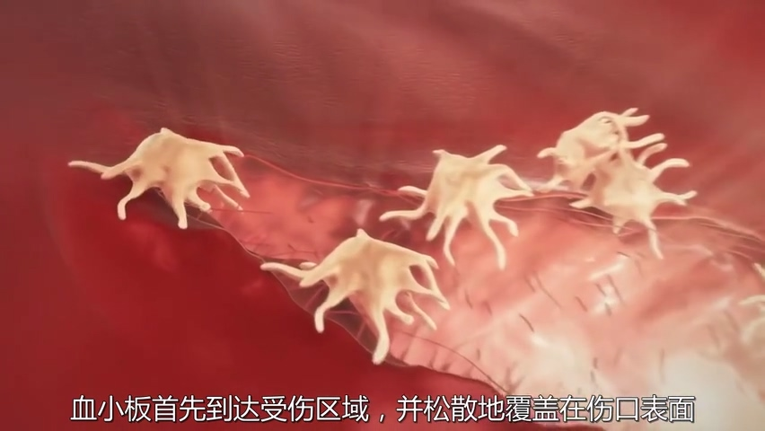
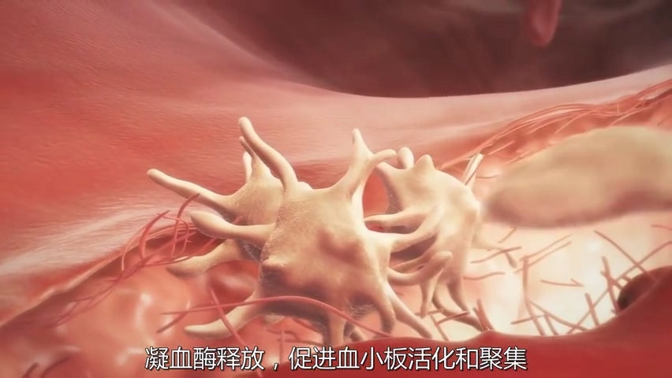
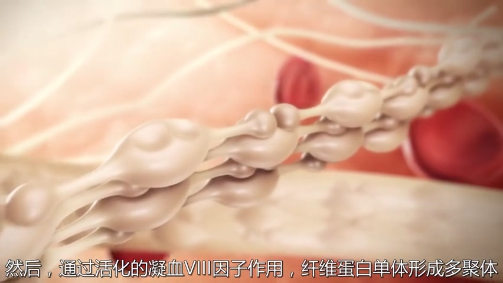
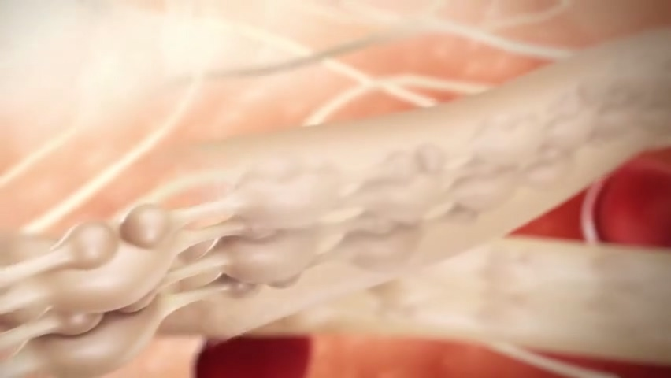
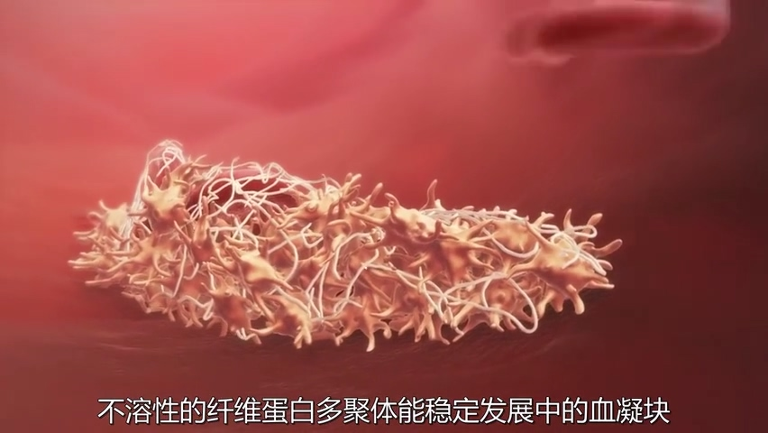
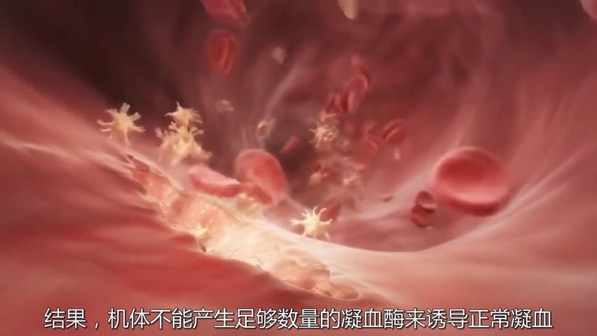
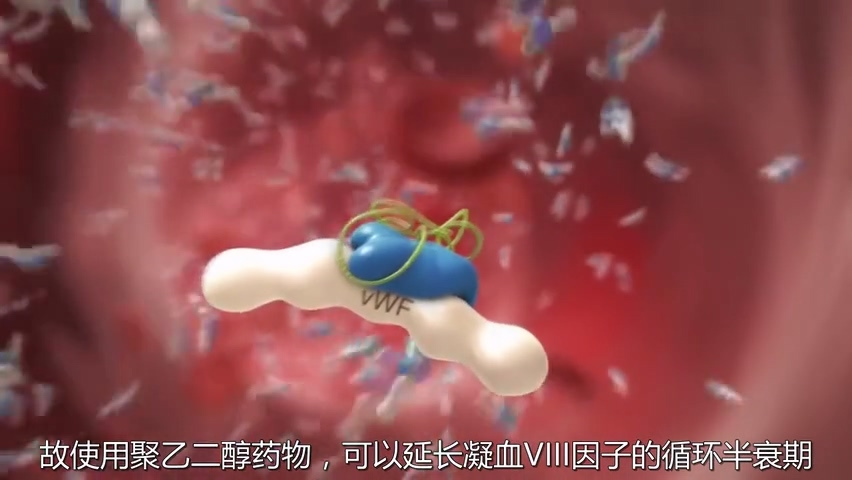

= 血液_凝血与血友病
:toc: left
:toclevels: 3
:sectnums:
:stylesheet: myAdocCss.css

'''

== 血友病

凝血, 涉及到"血小板"和"凝血因子"的相互作用.   +
-> "血小板"首先到达受伤区域, 并松散地覆盖在伤口表面.  +
-> *"凝血酶"释放, 促进血小板活化和聚集*.  +

在血小板表面, "凝血因子"也被激活. 通过活化的"凝血V因子"和"X因子"的诱导, "凝血酶原"激活为"凝血酶".  +
最后, "凝血酶"将"纤维蛋白原"转化为"纤维蛋白".  +

然后, *通过活化的"凝血V3因子"作用, 纤维蛋白"单体"形成"多聚体".* +
*不溶性的"纤维蛋白多聚体", 能稳定发展中的"血凝块".*

*在"血友病"患者中, 凝血过程中的某些阶段被破坏, 结果, 机体不能产生足够数量的"凝血酶"来诱导正常"凝血".* +

*A型血友病, 是"凝血V3因子"的B区蛋白异常( B型是 IX 因子).* 这种蛋白是一种有特异性的"聚乙二醇"( PEG ). +
故使用聚乙二醇药物, 可以延长"凝血V3因子"的循环半衰期. 这样, 血友病患者的凝血功能, 将得以恢复. +
image:img/血友病/0007.jpg[,40%]

'''
