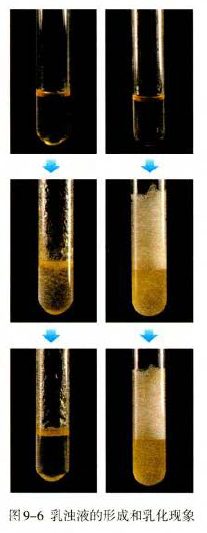
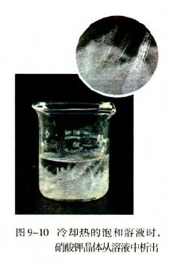
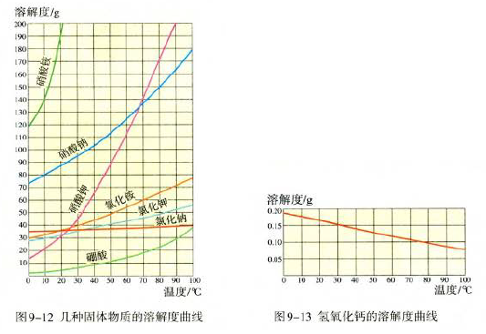
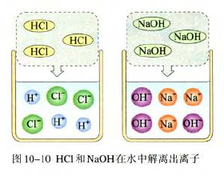
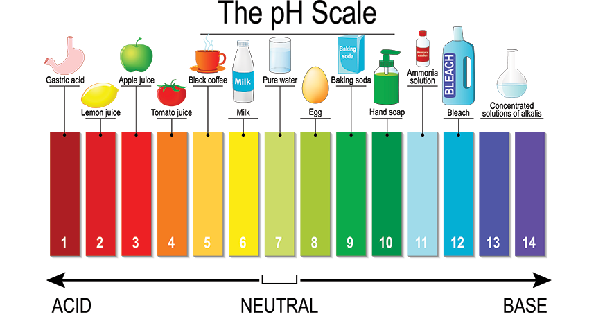
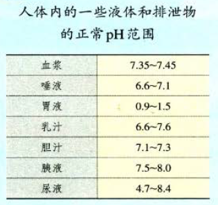

= 化学基础 001
:toc: left
:toclevels: 3
:sectnums:
//:stylesheet: myAdocCss.css

'''

== 金属

==== 合金

金属材料包括: 纯金属, 以及它们的"合金"。

[.small]
[options="autowidth" cols="1a,1a"]
|===
|Header 1 |Header 2

|金属
|金属有一些共同的物理性质:  +
- 能导电  +
- 能导热  +
- 有延展性, 能压成薄片, 可以拉成丝  +
- 能够弯曲  +

image:/img/0037.png[,70%]

|合金
|如果在金属中, 加热熔合某些金属或非金属，就可以制得具有金属特征的"合金"。
合金的很多性能, 与组成它们的纯金属不同. **"合金"的强度和硬度, 一般比组成它们的"纯金属"更高，抗腐蚀性能等也更好，因此，合金具有更广泛的用途。**日常使用的金属材料,大多数属于"合金"。 +
尽管目前已制得的"纯金属"只有90余种，但由这些纯金属按一定组成和质量比, 制得的合金, 已达几千种。 +
|===

[.small]
[options="autowidth" cols="1a,1a"]
|===
|Header 1 |Header 2

|钛, 钛合金
|被认为是重要金属材料. 它们具有很多优良的性能，如熔点高、密度小, 可塑性好、易于加工、机械性能好等。  +
尤其是钛和钛合金的抗腐蚀性能非常好, 其"抗腐蚀性能"远优于不锈钢。

|形状记忆合金
|
|===

'''

==== 金属处理

[.small]
[options="autowidth" cols="1a,1a"]
|===
|Header 1 |Header 2

|淬火
|

|回火
|
|===

'''

==== 金属与"氧气"的反应

实验表明, **大多数金属都能与"氧气"发生反应(发生关系)，但反应的难易和剧烈程度是不同的。**

[.small]
[options="autowidth" cols="1a,1a"]
|===
|Header 1 |Header 2

|镁、铝等在常温下, 就能与氧气反应。
|- 镁、铝等在常温下, 就能与氧气反应。*铝在空气中与氧气反应, 其表面生成一层致密的"氧化铝" latexmath:[Al_2O_3 ]薄膜, 从而阻止铝进一步氧化. 因此, 铝具有很好的抗腐蚀性能。* +
latexmath:[ 4\underset{铝}{\underbrace{Al}}+3O_2=2\underset{氧化铝}{\underbrace{Al_2O_3}}]

|铁、铜等在"常温"下, 几乎不与"氧气"反应. 但在"高温时"能与氧气反应。
|

|金
|*“真金不怕火炼”说明, "金"即使在高温时, 也不与氧气反应。*
|===

从上述实验事实可以看出: 镁、铝比较活泼, 铁、铜次之，金最不活泼。

'''

==== 金属与"盐酸、稀硫酸"的反应 -> 金属的"活动性"

很多金属不仅能与"氧气"反应, 而且还能与"盐酸"或"稀硫酸"反应。 *金属与"盐酸"或"稀硫酸"能否反应, 可反映金属的"活动性"。*

image:/img/0038.png[,35%] +

image:/img/0039.svg[,60%] +

上面这几个反应, 都是**由一种"单质"与一种"化合物"反应,生成另一种"单质"和另一种"化合物"。这就叫做"#置换反应#"(就是交换女朋友. 原先b和c是情侣关系, 现在b把c甩了, 去和a成情侣关系)。** +
由上述探究可以得出, *镁、锌、铁的"金属活动性"比铜的强，它们能"置换出"盐酸或稀硫酸中的"氢"。*

三、金属活动性顺序

把铁钉放在"硫酸铜"溶液中, 即: 铁 + 硫酸铜 => 能把后者中的"铜"独立解放(即置换)出来!  *这说明铁的"金属活动性"比铜的强, 即铁的"吸引他人的能力"(抢人的能力), 比"铜"强, 能把"铜"踢出去. 这也是比较"金属活动性"的依据之一。*

常见金属在溶液中的"活动性"顺序是: +
(强) --- (弱): +
K > Ca > Na > Mg > Al > Zn > Fe > Sn > Pb > (H) > Cu > Hg > Ag > Pt > Au

在金属活动性顺序里 :

- 金属的位置越靠前,它的"活动性"就越强;
- 位于前面的金属, 能把位于后面的金属, 从它们化合物的溶液里置换(*解放独立*)出来。
- 位于"氢"前面的金属, 能置换出盐酸、稀硫酸中的"氢"; (这是明摆着的, *因为H前面的金属元素, 活动性更强, 有能力"解放独立"出排在它们后面的元素.*) +

'''

== 地球上的金属的利用

*地球上的金属, 大多数都以"化合物"的形式存在.* 只有少数很不活泼的金属(如金、银)有"单质"形式存在. +
正因为金属大多以"化合物"的形式存在, 所以人类为了得到金属, 只能采取从矿石中来"提炼出"它们. +

image:/img/0040.png[,50%]

==== 炼(出)铁

炼铁的方法是: 让氧化铁(stem:[Fe_2O_3 ]), 去与一氧化碳(CO)进行反应, 前者中的"铁(Fe)"就能被独立解放出来. +

stem:[\underset{\text{氧化铁}}{\underbrace{Fe_2O_3}}+3CO=\underset{\text{把铁独立解放出来了}}{\underbrace{2Fe}}+3CO_2]

[.my1]
.案例
====
image:/img/0046.png[,]
====

'''

==== 地球上对金属资源的保护

一方面，人类要向自然界索取大量的金属矿物资源, 来提炼出金属. 另一方面, 现在世界上每年因腐蚀而报废的金属设备, 却相当于年产量的20%~40%, 造成大量浪费。所以如何防止金属腐蚀, 已成为我们研究的重大问题。

[.small]
[options="autowidth" cols="1a,1a"]
|===
|Header 1 |Header 2

|铁
|铁为什么会生锈? 因为铁与空气中的氧气、水等反应, 会生成铁锈.

|稀土(属于金属, 只不过在地球上储量很少)
|稀土是储量较少的一类金属的统称. 不可再生.

|===

'''

== 溶液

[.small]
[options="autowidth" cols="1a,1a"]
|===
|Header 1 |Header 2

|溶剂 (如: 水)
|能溶解其他物质的物质, 叫做"溶剂".

- "水"能溶解很多种物质,是一种最常用的溶剂。 +
- "汽油、酒精"等也可以作溶剂, 如汽油能溶解"油脂", 酒精能溶解"碘", 等等。

|溶质 (如: 食盐, 蔗糖)
|被溶解的物质叫做溶质。

|溶液 (如: 盐水, 糖水)
|一种或几种物质分散到另一种物质里,形成均一的、稳定的混合物，叫做"溶液"。 +
如, 蔗糖放进水中后, 溶解成"蔗糖溶液". +
"溶液"是由"溶质"和"溶剂"组成的。
|===

同一种物质, 在不同"溶剂"中的"溶解性"是不同的. 反过来说, 不同的物质在同一"溶剂"中的"溶解性"也是不同的。 如:
[.small]
[options="autowidth" cols="1a,1a,1a"]
|===
|是否能溶于 → |水|汽油

|碘
|×
|√

|高锰酸钾
|√
|×
|===

.溶质(被溶解的物质) 可以是固体,也可以是液体或气体。
如果两种液体互相溶解时,一般把"量多的一种"叫做"溶剂", "量少的一种"叫做"溶质"。如果其中有一种是水,一般把水做溶剂。如, 乙醇可以作为为溶质, 水为溶剂。

'''

==== 物质在"溶解"过程中, 通常会伴随着"吸热"或"放热"现象

**物质在溶解时, 常常会使溶液的温度发生改变。**这说明**物质在溶解过程中, 通常伴随着"热量"的变化: 有些物质在溶解时会出现"吸热"现象，有些物质在溶解时会出现"放热"现象。**

'''

==== 乳浊液 → 是"不溶于水的小液滴"和"水"形成的混合物 (如"植物油"和"水"的混合物)

这种"乳浊液"(如图9-6左)不稳定, 经过静置, 植物油逐渐浮起来, 又分为上下两层.

为了增强"乳浊液"的稳定性, 我们可以想办法将其"乳化", 见下.

==== 乳化 -> 油,水 不再分层的现象

但如果将"洗涤剂"加入"乳浊液"中, 此时情况就有不同了。虽然植物油并没有溶解在水中, 但形成的"乳浊液"却能够比较"稳定地"存在,液体不再分为两层(如图9-6右)。原因是, *洗涤剂能使植物油在水中分散成无数细小的液滴, 而不聚集成大的油珠, 从而使油和水不再分层, 所形成的"乳浊液"稳定性增强。这种现象称为"乳化"。*  +
**"乳化"后形成的细小液滴, 能随着水流动. 因此, 洗碗时, 洗涤剂就能够洗干净油腻的餐具. **

'''

==== 悬浊液

将少量泥土放入水中搅拌, 得到一种浑浊的液体, 里悬浮着很多不溶于水的固体小颗粒。这种液体就是"悬浊液"。 +
悬浊液不稳定, 静置一段时间后，其中的固体小颗粒会沉降下来.

总结: +
*在"溶液"、"乳浊液"和"悬浊液"中，分散在液体中的粒子大小是不同的:*

[.small]
[options="autowidth" cols="1a,1a,1a"]
|===
|Header 1 |溶质粒子的直径 | 例子

|溶液
|latexmath:[ < 1 nm]
|

|乳浊液
| latexmath:[ > 100 nm]
|- 粉刷墙壁用的"乳胶漆", 是"乳浊液"。

|悬浊液
|latexmath:[ > 100 nm]
|- 用X射线检查肠胃病时，让病的"钡餐", 就是"硫酸钡"的"悬浊液"。
|===

'''

==== 溶解度 -> 溶液的"饱和"与"不饱和"

把盐(溶质), 溶解到水(溶剂)里: +

[.small]
[options="autowidth" cols="1a,1a"]

|===
|Header 1 |Header 2

|-> 不饱和溶液
|当盐还能溶解时, 即还能继续溶解的溶液, 叫做这种溶质的"不饱和溶液"。

|-> 饱和溶液
|当盐不能继续溶解时, 所得到的溶液, 叫做这种溶质的"饱和溶液". +
(*按这个意思理解, 工作上的"饱和", 就是让你从早忙到晚的工作量程度, 一刻都不得闲. 那么, 公司老板的工作"报不饱和"呢?*)
|===

室温下, "硝酸钾"的饱和溶液, 在温度升高时, 又会变回"不饱和溶液", 因而能继续溶解硝酸钾。 +
因此, *"温度"是个重要的变量, 所以只有指明“在一定量溶剂里”和“在一定温度下”，溶液的“饱和”和“不饱和”, 才有确定的意义。*

继续, 当热的硝酸钾溶液冷却以后, 烧杯底部会出现了固体。这是因为**在冷却过程中,硝酸钾"不饱和溶液"变成了"饱和溶液", 过多的硝酸钾会从溶液中以"晶体"的形式析出, 这一过程就叫做"结晶"**（如图9-10)。 +

[.small]
[options="autowidth" cols="1a,1a"]
|===
|Header 1 |Header 2

|溶解度
|在室温下, 比如20 mL水中, 所能溶解的氯化钠或硝酸钾的质量都有一个最大值, 这个最大质量, 就是形成它的"饱和溶液"时所能溶解的质量。 这说明:  *在"一定温度"下, 在"一定量溶剂"里溶质的溶解量, 是有一定限度的。化学上用"溶解度"表示这种溶解的限度。*

|固体的溶解度
|表示在一定温度下, 某固态物质**在 100g溶剂里,** 达到"饱和状态"时所溶解的质量。 +
如果不指明"溶剂", 通常所说的"溶解度"是指物质在"水里"的溶解度。

- 如, 在20 ℃时, 100g 水里最多能溶解 36g氯化钠(这时溶液达到"饱和状态").  +
我们就说在20 ℃时．氯化钠在水里的溶解度是 36g.

|溶解度曲线
|可以表示物质在"不同温度时"的溶解度变化. +

从上图我们可以看出:

- 多数"固体物质"的"溶解度", 随温度的升高而增大(即呈"正比关系"). 如硝酸钾、氯化铵等.
- 少数"固体物质"的"溶解度", 受温度变化的影响很小. 如氯化钠.
- 极少数固体物质的溶解度, 与温度呈"反比关系". 如氢氧化钙。

|气体的溶解度
|由于称量气体的"质量"比较困难, 所以气体的溶解度, 常用"体积"来表示。 +
通常用的**"气体的溶解度",是指: 在①"压强"为 101 kPa, 和 ②"一定温度"时，该气体在"1体积水里"溶解, 达到"饱和状态"时的 该气体的体积.**

- 在压强为101 kPa, 和温度为0℃时, 氮气在 "1体积"水里, 最多能溶解 0.024 体积的氮气. 因此, 在0℃时, 氮气的溶解度为 0.024.
|===

'''

==== latexmath:[ 溶质的质量分数 = \frac{溶质的质量} {溶液的质量} × 100\%]

[.my1]
.案例
====
image:/img/0051.png[,65%]
====

[.my1]
.案例
====
image:/img/0052.png[,64%]
====

'''

==== latexmath:[ 溶质的体积分数 = \frac{溶质的体积} {溶液的体积} × 100\%]

除"质量分数"以外，人们有时也用"体积分数"来表示"溶液的浓度"。  +

- 例如，用作消毒剂的医用酒精中, 乙醇的"体积分数"为75%，就是指: 每100"体积"的医用酒精中, 含75"体积"的乙醇。

'''

== 酸和碱

==== 常见的酸

[.small]
[options="autowidth" cols="1a,1a"]
|===
|Header 1 |Header 2

|latexmath:[ HCl] 盐酸
|- 人体胃液中含有"盐酸", 可帮助消化.

- latexmath:[ \underset{铁锈}{\underbrace{Fe_2O_3}}+6\underset{盐酸}{\underbrace{HCl}}=2FeCl_3+3H_2O]

|latexmath:[ H_2SO_4] 硫酸
|- *浓硫酸有"吸水性"*, 在实验室中常用它做"干燥剂". +
浓硫酸有强烈的腐蚀性, **因为它能夺取**纸张、木材、布料、皮肤**（都由含碳、氢、氧等元素的化合物组成)里的水分 (即, 浓硫酸能将这些物质中的氢、氧元素, 按"水的组成比"脱去，这种作用通常叫做"脱水作用"), 生成黑色的炭。**所以,使用浓硫酸时应十分小心。

- latexmath:[ \underset{铁锈}{\underbrace{Fe_2O_3}}+3\underset{硫酸}{\underbrace{H_2SO_4}}=Fe_2\left( SO_4 \right) _3+3H_2O]   <- 将"水分子"单独弄出来了, 将物体"脱水"了.

- 想将浓硫酸稀释时, 必须是将浓硫酸缓慢注入水中, 而不能相反操作, *决不能将水注入浓硫酸中. 因为水的密度较小, 水会浮在浓硫酸上面，溶解时放出的热能使水立刻沸腾，使硫酸液滴向四周飞溅，这是非常危险的!*

image:/img/0053.png[,]

|latexmath:[ HNO_3] 硝酸
|

|latexmath:[ CH_3COOH] 醋酸
|食醋中, 含有"醋酸".
|===

'''

==== 常见的碱

[.small]
[options="autowidth" cols="1a,1a"]
|===
|Header 1 |Header 2

|氢氧化钠 latexmath:[NaOH] (俗称: 火碱, 烧碱)
|- 具有强烈的腐蚀性. 如果不慎沾到皮肤上, 要用大量的水冲洗, 再涂上硼酸溶液。
- 氢氧化钠曝露在空气中, *容易吸收水分，使表面潮湿, 并逐渐溶解，这种现象叫做"潮解"* 。因此, 氢氧化钠可用作某些气体的干燥剂 (因为它把其他物体身上的水分, 都吸收了)。
- 氢氧化钠, *能与"油脂"起反应, 所以可用它来去除油污.* 如炉具清洁剂中就含有氢氧化钠.

- latexmath:[ 2\underset{氢氧化钠}{\underbrace{NaOH}}+CO_2=Na_2CO_3+H_2O] +
氢氧化钠如果直接暴露在空气中, 会发生上面的化学反应(和空气中的二氧化碳), 所以"氢氧化钠"必须密封保存。

|氢氧化钙 latexmath:[ Ca(OH)_2] (俗称: 熟石灰, 消石灰)
|- 能微溶于水,其水溶液俗称"石灰水". 当"石灰水"中存在较多未溶解的"熟石灰"时,就称为"石灰乳"或"石灰浆"。 建筑上用"熟石灰"与沙子混合来砌砖, 用"石灰浆"来粉刷墙壁.
- 用"生石灰"(CaO)与"水"反应, 就能得到"氢氧化钙". 化学方程式是: latexmath:[\underset{生石灰}{\underbrace{CaO}}+H_2O=\underset{氢氧化钙(即熟石灰)}{\underbrace{Ca\left( OH \right) _2}} ]

|氢氧化钾 latexmath:[ KOH]
|

|氨水 latexmath:[ NH_3·H_2O]
|
|===

==== "酸"有一些相似的化学性质; 同样, "碱"也有一些相似的化学性质

蒸馏水和乙醇不会导电，**而盐酸、硫酸、"氢氧化钠溶液"和"氢氧化钙溶液"却能导电。这说明, 在后者这些中, 存在带电的粒子。**

其实:
[.small]
[options="autowidth" cols="1a,1a"]
|===
|Header 1 |在水中会解离出 ↓

|latexmath:[ HCl]
|latexmath:[ H^+] 和 latexmath:[ Cl^-]

|latexmath:[ H_2SO_4]
|latexmath:[ H^+] 和 latexmath:[ SO_4^{2-}]

|latexmath:[ NaOH]
| latexmath:[ OH^-] 和 latexmath:[ Na^+]

|latexmath:[Ca(OH)_2]
|latexmath:[ OH^-] 和 latexmath:[ Ca^{2+}]
|===

[.small]
[options="autowidth" cols="1a,1a"]
|===
|Header 1 |Header 2

|酸根离子(阴离子)
|实际上，像盐酸、硫酸这样的"酸", 在水溶液中, 都能解离出 latexmath:[ H^+] 和"酸根离子". +

**"酸根离子"是"酸"电离时, 产生的"阴离子"。** +
常见的酸根离子有：latexmath:[ NO3^-]（硝酸根）, latexmath:[ SO_4^{2-}]（硫酸根）, latexmath:[ CO_3^{2-}]（碳酸根），latexmath:[ HCO_3^-]（碳酸氢根），latexmath:[ MnO_4^-]（高锰酸根），latexmath:[ Cl^-] （氯离子）等。*是构成"盐和酸"的基本成分。*

|金属离子(阳离子)
|像"氢氧化钠"、"氢氧化钙"这样的**"碱",在水溶液中都能解离出"金属离子"和latexmath:[ OH^-],**即在不同的"碱溶液"中都含有 latexmath:[ OH^-],所以,碱也有一些相似的性质。

*"金属离子"是一类由金属元素（"铵根离子"除外）失去电子, 而形成的"阳离子".*
|===

[.small]
[options="autowidth" cols="1a,1a"]
|===
|"酸"有一些相似的化学性质 ↓|"碱"有一些相似的化学性质 ↓

|酸能与多种"活泼金属"反应，生成氢气.
|

|酸能与某些"金属氧化物"反应，生成水。
|碱能与某些"非金属氧化物"反应，生成水。

|酸溶液中都含有 latexmath:[ H^+]
|碱溶液中都含有 latexmath:[ OH^-]

|酸有腐蚀性
|碱有腐蚀性
|===

'''

==== "酸 + 碱" => 能生成 "盐+水".  ← 这个就是"中和反应"

[.small]
[options="autowidth" cols="1a,1a"]
|===
|Header 1 |Header 2

|中和反应
|如: +

- latexmath:[ \underset{氢氧化钠\ \left( 碱 \right)}{\underbrace{NaOH}}+\underset{盐酸}{\underbrace{HCl}}=\underset{氯化钠}{\underbrace{NaCl}}+H_2O]

- latexmath:[ \underset{氢氧化钙\ \left( 碱 \right)}{\underbrace{Ca\left( OH \right) _2}}+2\underset{盐酸}{\underbrace{HCl}}=\underset{氯化钙}{\underbrace{CaCl_2}}+2H_2O]

- latexmath:[ \underset{氢氧化钠\ \left( 碱 \right)}{2\underbrace{NaOH}}+\underset{硫酸}{\underbrace{H_2SO_4}}=\underset{硫酸钠}{\underbrace{Na_2SO_4}}+2H_2O]

中和反应: *"酸与碱"作用, 生成"盐和水"的反应,叫做"中和反应"。*

|盐
|可以发现, 上述反应中生成的(等号右边的第一列, 即) 氯化钠、氯化钙, 和硫酸钠, *都是由"金属离子(阳离子)"和"酸根离子(阴离子)"构成的. 我们把这样的化合物叫做"盐"。* +
*"盐"在水溶液中, 能解离出"金属离子(阳离子)"和"酸根离子(阴离子)"。*
|===

."中和反应"在生活中的运用:

- 农作物生长, 对于土壤的"酸碱性"有一定的要求。酸雨会令土壤"酸性"增强, 不利于农作物生长, 于是人们将熟石灰(碱)加入土壤, 以中和其酸性。
- 蚊虫叮咬人后, 在人的皮肤内分泌出"蚁酸", 如果涂一些含有"碱性"物质的溶液, 就可减轻痛痒。
- 人的胃液里含有适量"盐酸"，可以帮助消化。但如果胃酸过多, 医生可能会开出含有"碱性"物质的药物, 以中和过多的胃酸。

'''

==== 溶液"酸碱度"的表示法 -- pH (范围 0-14)

image:img/0056.jpg[,45%]

ph位置记忆: 左酸, 右碱. +
[.small]
[options="autowidth" cols="1a,1a,1a"]
|===
|ph<7 |ph=7 |ph>7

|酸性
|中性
|碱性
|===

- *健康人的体液, 必须维持在一定的"酸碱度"范围内. 胃液的 pH在 0.9~1.5. 如果出现异常, 则可能导致疾病。*
- 正常雨水的 pH≈5.6, *我们把 pH<5.6的降雨, 称为"酸雨"。* 酸雨对农作物以及建筑等不利.
- 农作物一般适宜在pH=7, 或接近7的土壤中生长. 在 pH<4 的"酸性"土壤, 或 pH>8 的"碱性"土壤中, 一般不适于种植。
- 在化工生产中,许多反应, 都必须在一定pH的溶液里, 才能进行

'''

61

