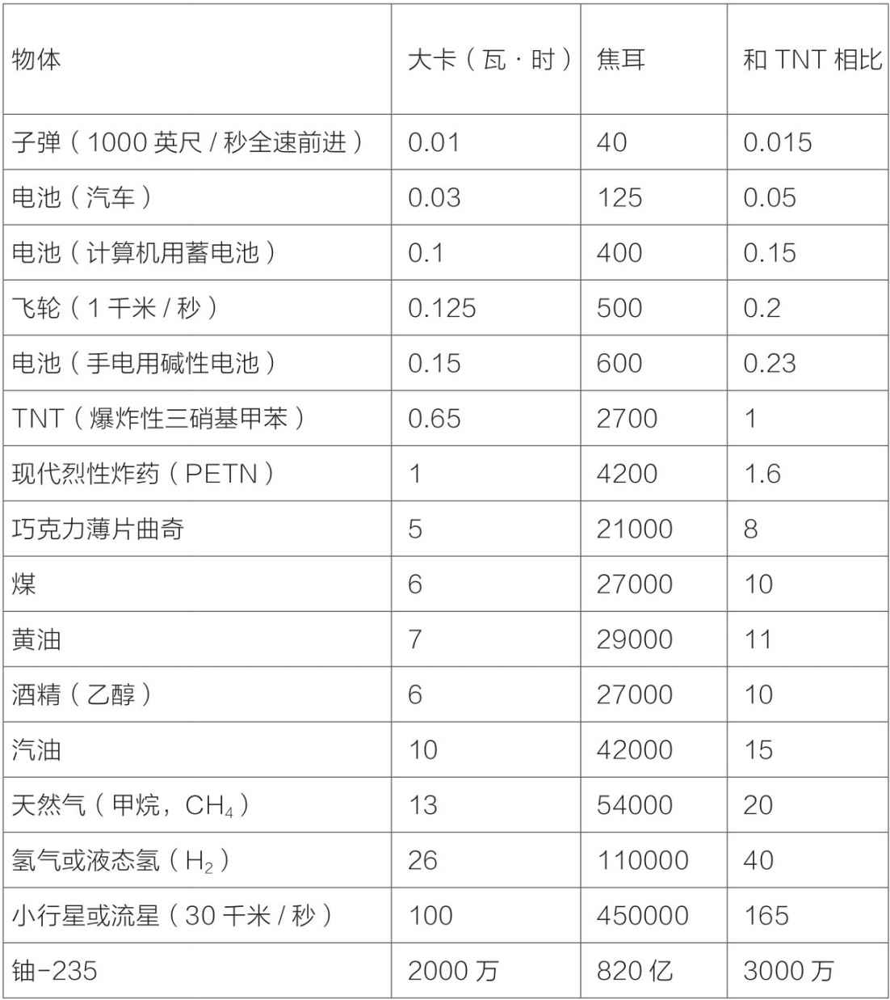
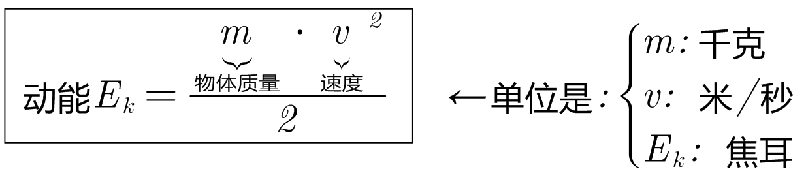
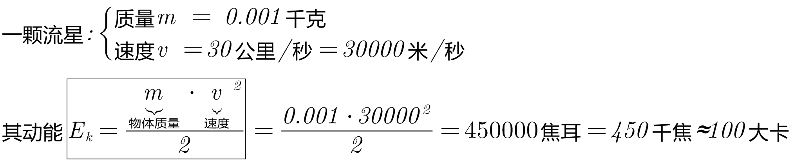
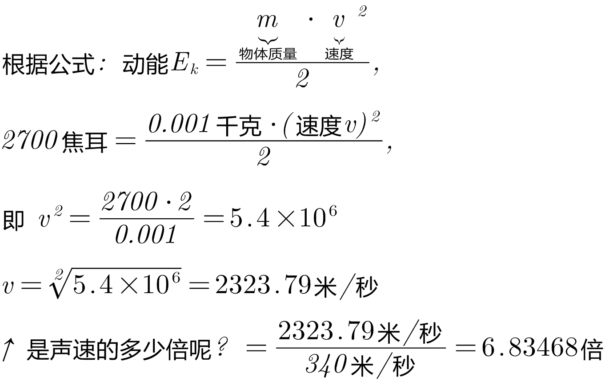

= 能量,功率,爆炸
:sectnums:
:toclevels: 3
:toc: left
''''

== 爆炸

爆炸发生的原理: 能量 -> 热 -> 物质汽化 -> 产生压力 -> 爆炸

当处于存储状态的大量能量，突然在有限的空间中转化为热时，爆炸就发生了.

在这里，能量的最初形式并没有严格的限制:

- 它可以是动能（由运动产生），就像小行星携带的能量.
- 或者化学能，就像三硝基甲苯（TNT）所蕴含的能量。

*爆炸释放的热使物质汽化，成为温度极高的气体。这样的气体具有巨大的压力*——也就是说，它给周围所有物质都施加了很大的力。没有东西能抵御如此强大的力，所以气体能迅速膨胀并把所有邻近的物体都推开。从能量到热的快速转化，才是大部分爆炸的真正原理。

在爆炸中真正带来伤害的是飞散的碎片.

.标题
====
汽车的安全气囊, 会在你的头撞到挡风玻璃前打开，过程只需要1/1000秒。如何才能如此迅速地给气球充气呢？答案就是：通过爆炸。安全气囊中含有50—200克名为“叠氮化钠”的爆炸物, 其分子中包含1个钠原子和3个氮原子，化学式为 stem:[Na N_3]。当叠氮化钠被电脉冲触发时，它就会分解成金属钠和氮气。这个过程中释放的气体充满了气球。
====

'''

== 功 (work)

如果一个物体受到力的作用，并在力的方向上发生了一段位移，我们就说这个力对物体做了"功".

- 功(work)的大小 = 力的大小 × 力在其作用方向上移动的距离

功，也叫机械功。如果一个物体受到力的作用，并在力的方向上发生了一段位移，我们就说这个力对物体做了功。

功是物理学中表示"力对位移的累积"的物理量。

'''

== 能量 (energy) 的定义

.能量的定义:

- 是一种做功的能力。
- 任何能被转化成热的东西

=== 衡量"能量"的几种单位

度量"能量"的最简单方法, 就是把能量转化成热，然后看这部分热, 能把水温升高几度。

其实，大卡的原始定义就是这么来的：

- 1大卡: 是1"千克"水升高1℃所需要的能量。1大卡中约有4200焦耳。
- 1卡路里: 是1"克"水升高1℃所需的能量。

- 1克: 是1立方厘米水的重量

- 1磅: 是454克

几种不同的能衡量"能量"的单位:
[options="autowidth"  cols="1a,1a"]
|===
|Header 1 |Header 2

|大卡 Cal
|它就是节食减肥中著名的"食物卡路里". +
一听可口可乐, 大约含有150大卡的能量.

- 1大卡 ≈ 4200焦耳

|卡路里(即小卡) calorie
|食物中的1大卡(Cal), 等于物理中的1000个卡路里(小卡 calorie). 物理学家喜欢把衡量食物热量的卡路里称为“千(小)卡".  +
欧洲、亚洲的食品标签上经常标有千卡，但是美国不一样。所以 *1大卡=1000卡=1千卡*

- 1Cal = 1000calorie
- 1大卡=1000小卡=1千卡

|瓦·时 (W·h)
|我的笔记本电池标注的容量是60瓦·时。 +

- *1瓦·时 ≈ 1大卡*
- 1瓦·时 ≈  3600焦耳

|千瓦·时 (kW·h) (也叫"度")
|我们从电力公司买电的单位, 就是kW·h（也叫度）。这就是你家电表测量的单位。

- *如果你在1小时内, 持续获得1000瓦特，这过程中传递的能量就是"1千瓦·时".*
- 1千瓦·时=1000 瓦·时
- 1千瓦·时 ≈  360万焦耳

|焦耳 (J)
|
|===

=== 能量的存储形式

所有能量都是能量，无论名字叫什么.

[options="autowidth"]
|===
|Header 1 |Header 2

|动能:
|飞行的子弹或小行星的能量, 被称为运动能量, 或动能。

|储能 / 势能:
|如, 存储在被压缩的弹簧中的能量.  +
势能是一种被储藏起来的能量，就像被储藏起来的食物仍是食物.

|核能:
|*核能也是一种被储藏起来的能量，它把原子核的各个部分融为一体. 当原子核破裂时，这种能量就会被释放出来。*

|引力能 (gravitational energy):
|当物体处于较高的高度时, 就会具有"引力能". 当物体下落时，这种能量就会转化为"动能".

|热:
|物体中的热, 也是能量的一种形式。所有这些能量都可以用大卡或焦耳来度量. +
在微观层面, 热是由分子振动产生的动能. +

*普通物体的热中蕴含着巨大的能量。遗憾的是，通常我们没有办法把这些能量提取出来做有用"功"。*
|===

=== 能量守恒定律 (热力学第一定律)

能量守恒定律(Law of conservation of energy):

- 能量既不会凭空产生，也不会凭空消失，它只会从一种形式转化为另一种形式，或者从一个物体转移到其它物体，而能量的总量保持不变。
- 也可以表述为：一个系统的总能量的改变, 只能等于传入或者传出该系统的能量的多少。总能量为系统的机械能、内能（热能）及除机械能和内能以外的任何形式能量的总和。 如果一个系统处于孤立环境，即不可能有能量或质量传入或传出系统。对于此情形，能量守恒定律表述为：“孤立系统的总能量保持不变。”

.标题
====
根据热力学第一定律可以设想: 要制造一种机器，它既不靠外界供给能量，本身也不减少能量，却不断地对外做功而不消耗能量。人们把这种假想的机器称为第一类永动机。因为对外界做功就必须消耗能量，不消耗能量就无法对外界做功，因此第一定律也可以表达为“第一类永动机是不可能造成的”。
====

*热力学第一定律指出，任何看似消失的能量都没有真的消失，通常只是转化成了热。*

.标题
====
当TNT或火药中的"化学能", 突然转化为"热能"时，产生的气体温度极高，这些气体迅速膨胀, 并把子弹推出枪管。
接着，气体失去了一部分能量（冷却了下来），这部分能量成为子弹的动能。

当一颗子弹击中目标并停下后，一部分"动能", 转移到了被击中的物体上（将其撕裂），余下的则转化成"热能"。（目标和子弹在彼此碰撞时, 都会变得更热一些。）

值得一提的是，*把所有这些能量加起来，总量是相同的。*"化学能"虽然被转化为"热能"和"动能"，但是开枪产生的大卡（或焦耳）, 与储存在火药中的能量, 是等量的。这就是物理中“能量守恒”的含义。
====

这是物理学中最有用的定律之一，对需要进行物理和工程计算的人来说尤为宝贵。使用这个原理，物理学家可以计算出子弹离枪时的速度，我们则能够计算出物体跌落时的速度。

**把化学能变成热很简单，可是要把它转化回来就很难了。**当有人告诉你要节约能源时，他所说的意思其实是“节约有用的能源”。*最有用的能量是"化学能"（比如汽油的能量）以及"势能"（比如即将经过水坝并用来发电的水携带的能量）。最没用的能量形式就是"热能"*，尽管有一些（但不是全部）热能可以被转化为有用的形式。

**由于能量是守恒的，所以整个能源产业, 实际上从来没有生产或生成过能量. 而只是把能量, 从一种形式转化为另一种形式. 然后再把这种形式的能量, 从一个地点搬运到另一个地点。**虽然如此，但是大家还是习惯于把这个过程称为“发电”。

.标题
====
能量最初的来源, 可能是化学品（油、天然气或煤）或者核物质（铀）。在发电厂中，能量被转化为热，而热会使水沸腾，从而产生热压缩蒸汽。膨胀的蒸汽会推动一系列名为“涡轮”的叶片。这些叶片会转动发电机的曲柄。这些设备会把机械的旋转运动, 转化为电流，也就是在金属中流动的电子。

电能的主要优势在于: 它能轻轻松松地传输到几千千米以外，只要有金属缆线，就能通到你家。

在一家发电厂中，不是所有的燃料能量都被转化成了电，事实上，约2/3的能量转化成了热，并就此流失。这是因为蒸汽没有完全冷却，而且很多热量都被释放到了周围环境中。有时这些热量被用来为周围的建筑供暖。在这种情况下，发电厂就是在“热电联产”，同时生产电力和有用的热。
====

'''

== 功率 (power) = 能量/时间

功率（power）的定义是: 每秒使用的能量. 它是指"能量释放的速率".

- 功率 = 能量/时间

在日常用法中，"功率"和"能量"这两个词经常可以相互替换。但是当准确地使用这些词时，我们可以说，TNT的价值就在于: **虽然每克的能量, 比巧克力薄片曲奇小，但是它具有更大的"功率"（因为它能把有限的能量, 在几百万分之一秒的时间内, 转化成热）。**当然，TNT不能长时间地输出这样的功率，因为它的能量会用尽。

功率是能量转移的速率。当1克TNT, 在百万分之一秒内释放了0.651大卡时，其功率记为651000大卡/秒。

虽然功率可以用"大卡/秒"来度量，但是另外两种单位更常用: 瓦特（1焦耳/秒）和马力。

==== 功率的单位: 瓦特 W

瓦特的定义是每秒1焦耳.

- 1W=1瓦特 watt =1焦耳/秒
- 1kW=1千瓦(kW) kilowatt=1000焦耳/秒

千瓦（kilowatt）经常被缩写为kW，W之所以大写是因为瓦特是一个人的名字，但是瓦特（watt）通常都不用大写首字母。 +
同样的逻辑也被应用在了千焦（kilojoule）上，它的缩写为kJ。

==== 功率的单位: 马力 horsepower，hp

原始定义是一匹马一般能输出的功率，即马每秒钟做的功。

- 1马力=0.18大卡/秒
-  1马力≈746瓦特

通常汽车能输出50—400马力。

'''

== 能源

=== 汽油

每克汽油所含的能量明显高于曲奇、黄油、酒精或煤炭。这也是汽油能成为燃料的原因。

汽油通过与氧气结合, 来释放能量（转化为热），所以它必须与空气充分混合。燃烧发生在汽缸中. 燃烧释放的能量推动活塞, 这就是推动汽车车轮的动力。所以, 内“燃”机也可以被看成一台内“爆”机。车内的消声器的作用, 就是确保车里的爆炸声能够减弱。

但是, *汽油的能量只有20%用在了车轮上，剩下的80%则以发热的形式浪费掉了。*

=== 氢

每克氢气的化学能, 比汽油高1.6倍. 即氢气的能量相当于汽油的2.6倍.

氢经济的主要技术难题在于: 氢气的密度很小。即使在液化之后，它的密度也只有0.071克/平方厘米，是汽油密度的1/10. 另外，氢气的能量相当于汽油的2.6倍，约等于3倍。把这些都考虑进来，我们就会发现，*液态氢只能存储同等体积汽油所含能量的0.071×2.6=0.18倍，大概是1/5。*

不过, 氢燃料的使用效率比汽油要高.

记住：液态氢的能量约为：

- 同等重量汽油的3倍
- 同等体积汽油的1/5

液态氢的储存是十分危险的，因为在加热情况下, 它的体积能扩大1000倍。

液态氢应用的一个技术难点在于， 它的沸点是-423 ℉（-253℃）。这就意味着它必须用特制的保温瓶（准确名称是杜瓦瓶 Dewars）来运输。如若不然，就得让氢气和别的物质产生物理或化学反应，结合成室温下便于运输的产物.

杜瓦瓶（Dewars）也叫保温瓶，是储藏液态气体、低温研究, 和晶体元件保护的一种容器。

==== 单纯的氢气, 或液态氢, 并不存在于自然环境中

水和化石燃料（碳氢化合物）中有很多氢，但是没有“自由”的氢，也就是氢分子H2. +
要得到"氢", 我们只能自己造，也就是从水或碳氢化合物中, 人为释放出氢.

氢气只有两种获取方式:

[options="autowidth"]
|===
|Header 1 |Header 2

|方法1: 电解水
|

|方法2: 让化石燃料（甲烷或煤）和水, 发生反应，从而产生氢气和一氧化碳。
|甲烷的化学式是CH4，它的分子中含有1个碳原子和4个氢原子。把甲烷和水加热到高温时，甲烷中的氢就释放出来，同时还会产生二氧化碳。但是, 二氧化碳是一种污染物.
|===

=== 铀

每1克铀-235, 可以释放出相当于等量汽油200万倍的能量.

对同等重量的燃料来说，核反应能释放出约为化学反应（食物反应）几百万倍的能量。

=== 钚

钚原子（与"铀-235"类似的放射元素"钚-239"）是另一种能释放如此巨大能量的原子。

=== 阳光和太阳能 = 1千瓦/平方米

阳光可以输出的功率, 约为1千瓦/平方米。

阳光, 所有这些能量, 都以光的形式存在。当光照在物体表面时，有一些会被反射走（这就是你能看见它的原因），而另一些则被转化成了热（使表面变热）。

*一块便宜的太阳能电池，只能转化15%的功率，也就是每平方米的功率约为150瓦。剩下的能量被转化成"热", 或者被反射走了。*  +
**更贵的太阳能电池（比如人造卫星上用的那种）的效率约为40%，**可以将每平方米太阳能转换为400瓦电。

.标题
====
假设你家每平方米的地板上, 都放着一个1千瓦的钨丝灯泡，那么你家会像阳光普照时一样明亮吗？注意: 瓦特不是亮度单位，而是每秒传输能量的单位。在阳光中，所有能量都以光这种形式存在。但对电灯泡来说，大部分能量都变成了热。
====

=== 风力

地球表面的各个部分, 在吸收太阳能时受热不均，就产生风。归根结底，风能的来源还是太阳能，因为正是温度的差异驱动了风。

风力发电设备更常用的名字是"风力涡轮机".

=== 动能 kinetic energy

物体由于运动而具有的能量，称为物体的"动能". +

化学能的大小通常必须通过测量（而非计算）得到，而动能则不同. 动能有个简单的方程：

\begin{align}
E = \frac{1} {2}  m  v^2
\end{align}

速度v的单位必须是米/秒，而质量m的单位是千克，这样能量E的单位就是焦耳了。

*从公式可知, 物体的"动能E", 与其"质量m"成正比, 与其"速度v"成正比.* +
或换言之: 质量相同的物体，运动速度越大，它的动能越大; 运动速度相同的物体，质量越大，具有的动能就越大.

- "动能E"和"物体的质量m"成正比: 以相同速度行驶时，一辆重2吨的车的动能，是一辆重1吨车的2倍。
- *物体的动能, 和其"速度v的平方"成正比: 如果你把车速提至2倍，你就会获得原来4倍(=1 * 2^2)的动能。* 如果速度达到3倍，动能就会达到9倍(= 1* 3^2)。

.标题
====

====

.标题
====
一克质量的石头, 要移动得多快，它的"动能"才能赶上同等质量TNT的化学能？ +
1克TNT炸药的能量是2700焦耳。

====

.标题
====
灭绝恐龙的那颗陨石的动能, 能量全都转变成了热，而热造成了巨大的爆炸。

====

动能具有瞬时性，在某一时刻，物体具有一定的速度，也具有一定的动能，动能是状态量.

动能方程, 和爱因斯坦著名的质能方程 stem:[ E=m c^2 ]  有些类似。在质能方程中，c是真空中的光速.

109
