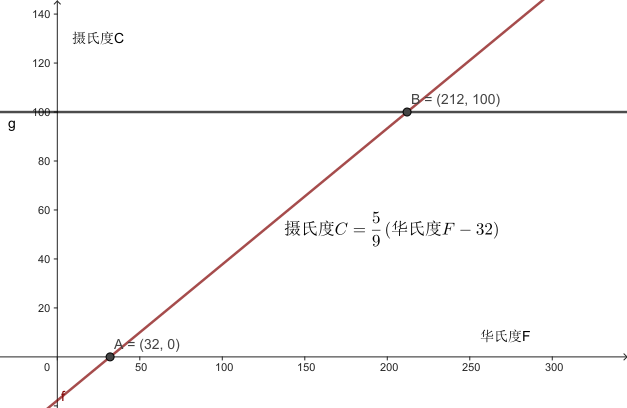
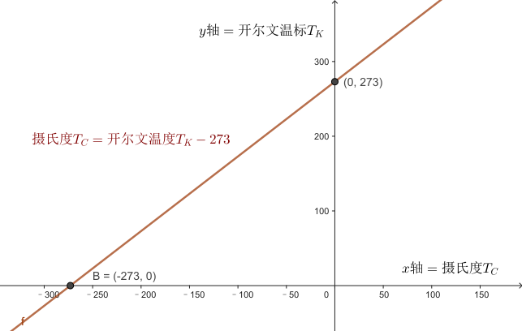
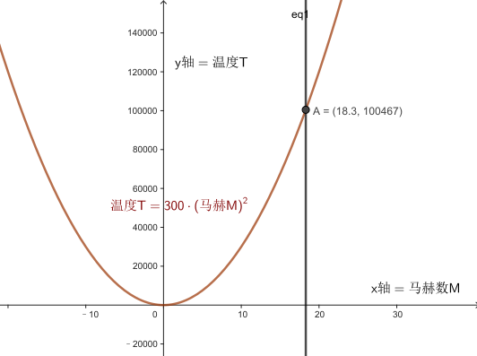
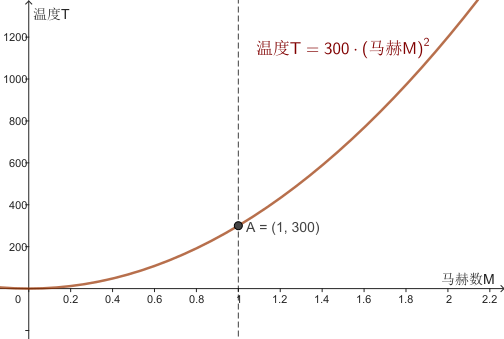
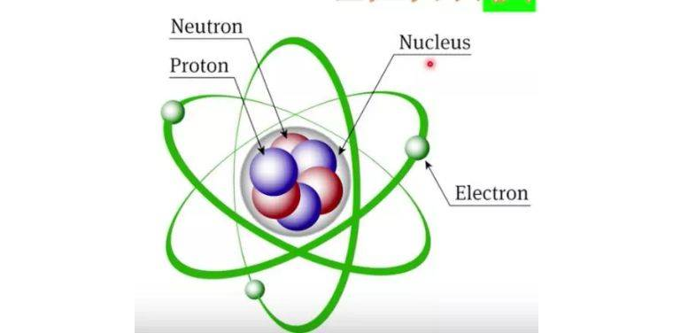

= 原子, 热
:sectnums:
:toclevels: 3
:toc: left

''''

== 热: 源自分子/原子的震动

搓你的手, 你的手感觉更暖和了, 你把动能（运动能量）转化成了热。事实上，*热就是动能，分子产生的动能。你的手之所以感觉更温暖，就是因为揉搓后分子来回振动的速度比之前更快了。这就是热的本质：原子和分子速度很快而幅度极小的振动。*

所有物质都是由原子组成的，而原子只有约92种 (元素周期表 Periodic table of elements 中所列). 到2007年为止，总共有118种元素被发现，其中94种是存在于地球上。

**为什么要说“约”？有一些已知元素具有放射性，会发生衰变，所以在自然界中非常稀有，甚至无法持续存在。**其中有两种是锝（原子序数43）和钚（原子序数94）。

**元素周期表中的每个原子都带有一个数字，叫作"原子序数"。该数字代表原子中的质子数，（通常来说）也是原子中的电子数。** 氢的原子序数是1，氦的原子序数是2，碳是6，氧是8，而铀是92。

**任何材料中的分子都在不停地振动。振动越剧烈，材料就越热。**当你把手放在一起揉搓时，你使手内部的分子振动得更快了。有多快？*这种振动的速度常常接近声速.* 但是这些粒子（至少在固体中）不会跑得很远。它们会撞上自己的邻居再弹回来。 所以虽然它们移动得的确很快，但是像环形跑道上的跑步者一样，总体来看它们的位置并没有改变。

==== 原子的直径

典型原子的直径约为 stem:[10^{-8}]厘米stem:[=10^{-4}]微米。

- 如果你沿着一根人类头发的切面直径（通常为25微米）从一头走到另一头，你将会遇到12.5万个原子。
- 一个红血球的直径（8微米）上, 可以并排放40000个原子。
- 有一些分子非常大（比如DNA），足以被显微镜观察到，但是这种分子中的单个原子，还是无法被人分辨出来。

==== 布朗运动 Brownian Motion, Brownian movement

虽然你看不到原子，但是你可以看到它们的振动, 对微小而可见的粒子造成的影响。在显微镜下，你可以看到小块浮尘（直径1微米）在自由移动。这种现象被称为布朗运动。 **会出现这种现象，是因为浮尘的分子被包围在其周围的空气分子撞击。**如果灰尘足够小的话，这种撞击最终不会达到平衡。

布朗运动, 是指悬浮在"液体"或"气体"中的微粒, 所做的永不停息的无规则运动。作布朗运动的微粒的直径, 一般为stem:[ 10^(-5)]~stem:[10^(-3)]厘米. 这些小的微粒处于液体或气体中时，由于液体分子的热运动，**微粒受到来自各个方向液体"分子"的碰撞，**因此微粒的运动不断地改变方向, 而使微粒出现不规则的运动。

*布朗运动的剧烈程度, 随着流体的温度升高而增加。*

==== 热使电子持续运动

收音机在换台时经常会发出滋滋声。老式电视机屏幕上会显示雪花的跳动白点。雪花和嘶嘶声都是同一种东西造成的：在你的电子设备里上窜下跳的电子。**热使得这些电子持续运动，**当没有其他信号时，你就能看到（或听到）它们移动了。虽然它们不是分子，但是也有振动的能量。

降低温度可以减少这样的噪声，而高灵敏电子设备需要经过冷却, 才能降低嘶嘶声和雪花。但是冷却过度会让设备停止工作. 因为晶体管工作时, 需要借助电子在室温下拥有的动能. 没有这种动能，电子就被困住了，而电流就无法流动。

现在，我们已经把热描述成了分子（有时也是电子）的动能.

== 声速

*分子的速度和声速极其相近*，这是巧合吗？不是—— *声音在空气中的传播, 就是通过分子彼此之间的撞击完成的。所以声速是由分子运动的速度决定的。声音在气体中的传播速度不会比气体分子更快。就好比接力棒赛跑的最终速度, 不会比单人跑到终点更快!*

在固体中，声音行进的速度比在空气中快，因为固体分子之间的接触相对更紧密。它们不必移动, 就能把力传给下一个分子。

**组成本书的大部分分子的速度, 都是声速，但是这些分子的移动方向却是随机的。**假设我让所有分子都朝一个方向移动。那么本书就会以声速（760英里/时）移动，但是能量总和不会变化。

我们没什么好办法能改变振动的方向，让所有分子一起移动。

== 光速

普通计算机, 只需要约十亿分之一秒（1纳秒或1ns）的时间就能完成一次计算。在这十亿分之一秒的时间里，光只能传播约1英尺（30厘米）.

== 熵 entropy

当动能转变成热时，我们可以将这个过程, 视为"连贯而规律的运动"转变成"随机运动"。分子能量从最开始的“整齐有序”（所有分子沿着相同方向移动）变为“无序”。无序的程度可以被量化，而这个值被命名为熵（entropy）。当一个物体受热时，它的熵（分子运动的随机性）就增加了。

== 温度

*温度, 就是对隐藏的分子动能的度量。 “隐藏的分子动能”，指通常无法观察到的快速（声速）而微观（就移动距离而言）的振动所承载的能量.*

*当分子的平均振动能量增大时，温度就升高了.* 我们之所以要说平均，是因为在任何时刻，某些分子都可能会比其他分子运动得更快，而有一些则会偏慢. *如果两个物体的温度相同，它们分子的振动动能就是相同的.*

*假设有两个棒状物体，一个由铁制成，一个由铜制成，它们的"温度"相同。那么，总体来看，它们的分子"动能"肯定是相同的。那铁分子和铜分子的平均速度是相同的吗？答案是不，铁分子更轻，平均来说振动得更快。*

原因是: 根据动能公式: stem:[ E=1/2 mv^2]。铜和铁的分子质量m不同。所以要想"动能E"相同，(质量m大的)较重的铜分子的"速度v"必然要更小.

*所以记住：温度相同时，较轻的分子, 比较重的分子移动得更快（平均而言）.*

==== 热力学第零定律 : 彼此接触的两个物体, 趋向于达到相同温度.

**把热的铁质物体, 放到冷的铜质物体上。由于互相接触，铁中的快分子现在撞上了铜中的慢分子。铁分子失去了能量，而铜分子获得了能量。铁的温度下降了，铜的温度则上升了。只有当温度相同时，能量的传递才会停止。热的“流动”其实是在分享动能。**温度较高的材料将热（动能）传给温度较低的材料。*这种流动只有在两种材料温度相同时才会停止。*

这就意味着如果你把一堆东西放进同一个房间，然后等待，最终所有东西都会达到相同温度。

**当两个物体相接触时，接触面（表面分子的碰撞）使它们分享了"动能"。"热力学第零定律"指出，较热的物体（平均分子"动能"更大）会失去一部分"动能"，而较冷的物体会获得一部分"动能"。最终它们会达到相同温度。**但是这并不是立刻发生的。此外，不同材料的分享热的速率也不同。所以我们说不同材料是以不同速率“导热”的。

.标题
====
一个房间里的所有物品都应该达到相同的温度。但是如果你拿起一个玻璃杯，它给人的感觉比塑料杯要更冷。为什么会
这样？如果两个物体都在房间里，它们的温度就是相同的，不是吗？没错，*塑料杯和玻璃杯的温度确实相同。但是塑料和玻璃的"传热速率"不一样。*

**当你触碰玻璃杯时，它会迅速把你体内的热传导走，所以你指尖的温度会下降。你的神经感知到的不是玻璃杯的温度，而是你皮肤的温度。当你触碰塑料杯时，热并没有很快被传导走，所以你的皮肤没有降温那么多。你错误地认为玻璃比塑料更冷，其实它们的温度相同。**但是，玻璃杯能比塑料杯更快地冷却你的皮肤。
====

.标题
====
氢是宇宙中最充足的元素。组成太阳的原子中90%都是氢原子，对大体积行星如木星和土星来说也是如此。但是在地球的大气中，氢气几乎是完全不存在的。为什么？我们的氢哪儿去了？

答案就藏在"热力学第零定律"中。地球曾经有很多氢，但是散失到太空中去了。**地球大气中的氢气, 会达到与氮气和氧气相同的温度，所以氢分子平均拥有与这些气体相同的"动能"。但是根据动能公式, 因为氢是最轻的元素（它的原子质量是氧的1/16），所以氢分子的速度必然更快。** "动能E"相同的情况下, "质量m"和"速度v"的平方成反比。氢气质量小, 所以速度大，氢分子的速度肯定是氧分子的4倍。这么高的平均速度足以使氢气像火箭一样逃离地球！

氢分子的平均速度不足以使它们逃离，但是某些氢分子的速度远高于平均值，而我们丢失的就是这些氢分子。我们也因为同样的原因丢失了一些氮分子和氧分子。但是因为它们的平均速度比氢分子慢得多，所以它们的流失量可以忽略不计。

而太阳和木星的引力比地球大得多，所以它们留住了氢。地球之所以丢失了氢气是因为我们的引力太弱了。
====

.标题
====
恒星很热，而太空中的分子很冷。根据"热力学第零定律", 最后宇宙中的一切最终会达到相同温度。通过跟踪记录所有
物体的温度，我们可以计算出最终的温度是多少。如果忽略宇宙的膨胀，那么宇宙的平均温度将会达到–270℃。因为宇宙正在膨胀，所以最终温度可能会更低。
====

==== 温标

人们之所以能制作出示数统一的温度计，或多或少是因为（正如"第零定律"所说的）无论温度计的材料是什么都没关系。

有两种常用的温标： 华氏温标, 和百分温标。

[options="autowidth"]
|===
|Header 1 |Header 2

|华氏温标 Fahrenheit : ℉
|其发明者德国人华伦海特 Gabriel Daniel Fahrenheit 发现液体金属水银, 比酒精更适宜制造温度计. 所以他以水银为测温介质，发明了玻璃水银温度计.

选取氯化铵和冰水的混合物的冰点温度, 为温度计的零度，人体温度为温度计的100度(超过100度就是发烧了)。在标准大气压下，冰的熔点为32℉，水的沸点为212℉. 中间有180等分，每等分为华氏1度，记作“1℉”。

|百分温标 Centigrade,  +
即 摄氏度 Celsius : ℃
|
|===

==== 绝对零度 -> 开尔文温标下的"动能"公式: stem:[ E = 2 \cdot 10^{-23} \cdot T_k]

如果分子真的停下来，**"动能"为零时**会怎样？如果分子的一切运动都停止，**我们就说材料温度处于“绝对零度”。**此时温度为 –273℃= –459℉。

借由这个事实，我们可以定义一种新的温标，即"绝对温标"或"开尔文温标".

开尔文温标非常好用，因为它能简化公式。比如，*如果我们使用开尔文温标，那么每个分子的"平均动能E", 就可以用一个非常简单的公式来表示：*
\begin{align}
\boxed{
E = 2 \cdot 10^{-23} \cdot T_k
}
\end{align}

- stem:[T_K] 是开尔文温标（开尔文度）。
- 公式中的常数 stem:[ 2×10^{-23}], 之所以这么小, 就是因为原子非常小。

这个公式关注的是单个分子的能量。知晓粒子的"动能"值, 并不重要。重要的是了解粒子的速度 (约等于声速).

*这个公式告诉我们: 如果温度 stem:[T_K] 翻倍了（在开尔文温标下），那么动能也就翻倍了。 这意味着, 温度就是隐藏的动能。*

*这个公式最引人注目的一点在于，它不依赖于材料。"热力学第零定律"再次显现。*

从"开尔文温标", 转到"摄氏温标", 你只需减去273即可:

\begin{align}
\boxed{
T_C=T_K –273
}
\end{align}

所以, stem:[T_K=273] 和 stem:[T_C=0] 是同一温度。即 273K=0℃。

==== 马赫法则 -> stem:[ 开尔文温度T= 300(马赫M)^2]

航天飞机进入地球大气层时, 会产生大量的热。其"动能"非常大，所以在降落前，飞机必须甩掉这些能量。 根据动能公式:stem:[ E = \frac{1} {2}  m  v^2], 要计算物体的单位能量，我们要知道它的速度。

航天飞机的速度: 它能在1.5小时, 绕地球一圈, 地球周长是 40075.017 km, 所以航天飞机的速度就是:
\begin{align}
距离/时间= 40075.017\text{公里/}\left( 1.5\text{小时}\cdot 3600\text{秒} \right) =7.4213km/\text{秒}
\end{align}

相当于声速的:  stem:[ 7.4213\text{公里/0.34公里(声速)}=21.8274\text{倍}]

如果航天飞机的所有"动能", 都转化成了飞机自身的热，那么它的"温度", 可以用"马赫法则"来计算得到:

\begin{align}
\boxed{
马赫法则: 开尔文温度T= 300(马赫M)^2
}
\end{align}

- M代表马赫. 马赫数1, 即一倍音速. 马赫数是"飞行的速度"和"当时飞行的音速"之比值，大于1表示比音速快，小于1是比音速慢。

根据"马赫法则"公式,  哥伦比亚号航天飞机返回大气层时，在火焰中裂成了碎片, 假设它解体时, 速度是声速的18.3倍, 即18.3马赫。 那么它此时的温度就是 10万多度, T=100000K，即太阳表面温度的17倍。这就是航
天飞机的碎片如此耀眼的原因.

假设一个物体（比如流星，或者太阳的内部）的温度达到了100000℃，那么它的开尔文温度是多少？答案是100273K。看起来和100000非常接近，区别只有0.27%。于是就有了这个有用的规则：当温度真的很高时，用℃表示的温度, 就约等于用K表示的温度。

根据公式, 还可知  : 在1马赫速度时, 温度为300K.

根据"动能公式" stem:[ E = \frac{1} {2}  m  v^2], 如果速度v增大至18.3倍，动能E 就增加至 stem:[ 18.3^2] 倍 ≈335倍。这就意味着你把温度提高到原来的335 倍， 从300K 升到335×300K=100000K。

换句话说，如果你以马赫数 M=18.3 的速度移动，然后把你的"动能"转化成热，你的温度就会达到 stem:[ T=300M^2] 。这个公式可以用在任意马赫数M上，最后得出的温度单位是开尔文。

'''

== 温度上升时, 原子会推开彼此. 即, 物体会膨胀 (热胀冷缩)

*当固体中的原子升温时（即原子运动得更快/速度增加/动能增加时），它们会趋于推开彼此。* 大
多数固体在受热时会膨胀: *温度升高1℃,会让很多物质扩张1/1000 到 1/10万。*

.标题
====
纽约的 Verrazano-Narrows Bridge 海峡大桥, 跨度是4260英尺，当温度从20℉变为92℉时（纽约的典型季节性变化），桥的长度就会增长约2英尺. (1英尺 = 0.3048 m)

温度变化, 还会改变桥的形状。悬索在寒冷的冬天会变短(热胀冷缩)，所以悬架中部的高度, 在冬天会比在夏天高12英尺.
====

.标题
====
人行道水泥通常都铺在边长5英尺（60英寸）的方砖之间的凹槽里。如果有1℃的温度变化，方砖的边长会改变百万分之三十五. 如果没有凹槽，混凝土就会被挤压，甚至弯曲，导致随机出现的裂缝。小凹槽是铺水泥的人留下的，可以为膨胀预留空间，防止材料碎裂。
====

.标题
====
已经固定住的大块水泥, 或混凝土, 如果暴露在温度多变的环境中，就会产生裂缝. 所以对于防洪大坝来说, 你不能用实打实的混凝土防洪堤, 把城市包住，因为当温度变化时，这些堤坝就会出现裂缝。你需要用独立的混凝土块来构建堤坝，中间留有间隙。这些间隙的填充物必须能实现"滑动接合"（sliding joints），或是弹性材料。但如果做得不好，这些连接位置, 也会成为整个防洪堤最薄弱的一环。
====

这种膨胀, 说明分子之间并不是毫无缝隙地紧密相连. **在膨胀的同时，分子间的引力也降低了。这就是为什么热金属没有冷金属强度高。**正是升高的温度弱化了这些金属柱子，导致了世贸中心的倒塌。

.标题
====
如果你在烤箱中加热一只玻璃锅，再把它放在冷水中，锅就会出现裂缝甚至碎开。*玻璃之所以破裂，是因为它的外部 冷却得比内部更快，所以内外的尺寸产生了差异, 于是玻璃就会弯曲*. 玻璃是易碎的，所以它就破裂了。

为什么玻璃最开始在烤箱中加热时, 不会开裂？原因是，**如果缓慢地加热，热就会穿透玻璃，让所有部分的温度几乎相同。**玻璃内部和外部温差所导致的不均匀的膨胀，才是玻璃破裂的真正原因。
====

.标题
====
打不开玻璃罐头上的盖子，是一个生活中很常见的问题. 把盖子放进热水中几秒时间。盖子会膨胀，虽然程度很小，但通常足以使它变松. **不过, 这只有在盖子的金属材质, 比玻璃膨胀程度更大的情况下, 这种做法才适用. 也就是
盖子的材质的膨胀系数更大，**或者盖子会比玻璃更热时。
====

.标题
====
地球温度上升, 导致海平面升高. 这种升高的来源, 不仅仅是因为冰会融化, 而且也因为海水也会膨胀很多。

**每升高1 ℃, 水的体积就会膨胀 stem:[ 2×10^{-4}]。**每升高 2.5 ℃, 就会造成 stem:[ 2.5×(2×10^{-4})] 即 = 0.0005倍 的膨胀。海洋的平均深度约为12000英尺。当海洋膨胀后，就会升高0.0005，即约6英尺(=182.88cm = 1.82米)。
====

.标题
====
SR-71“黑鸟”侦察机速度极快, 其空气的摩擦会把外表面温度加热到了1000℃以上, 对机身造成的热膨胀会非常大. 如果机翼是用普通方法制造的话, 就会破裂。

工程师采用让飞机配件之间保持松散, 来解决这个问题 —— 这和为混凝土预留空隙非常相似。严丝合缝的连接状态只有在金属膨胀（达到高速）后才会出现。不过, 这种做法也会同时带来一个麻烦的问题：在外表面得到充分加热之前，松散的配件会使飞机泄露燃料。
====

==== 温度计

**大部分温度计, 利用(热胀冷缩) 即微小的膨胀来测量温度。**

[options="autowidth"]
|===
|Header 1 |Header 2

|酒精/水银 温度计
|当温度升高时，液体膨胀并向管子上部移动。管子表面的标记代表了温度。

在真实的温度计中，小球（容纳大部分液体）的直径, 要比管子的直径大得多。请注意，**如果玻璃和液体的膨胀系数一样，那么温度计就无法工作了。**

**温度计里用的是比玻璃膨胀系数大得多的液体（比如水银和酒精）。**染成红色的酒精之所以常用，就是因为它的膨胀率特别高。

玻璃球中的大量液体在膨胀后无处可去（因为玻璃容器并没有同步膨胀），只能流向管子。*管子内部通常都有一段真空，所以空气压力不会阻碍液体流动。*

|双金属片 温度计
|*另一类温度计, 利用了不同金属的不同膨胀量。如果你把两根不同类型的金属条绑在一起，就得到了一个双金属片。
因为一边比另一边膨胀得更多，所以双金属片会弯曲。* 弯曲的金属可以拉动细轴，移动指示温度的指针。使用双金属片的温度计, 通常作为烤箱温度计, 或出现在老式恒温器中。

|数字温度计
|还有第三种温度计，称为"数字温度计"（通常在医学中使用）。这种温度计利用了"某些材料的电气性质, 在温度改变时, 会起变化"的特点。带有电池的小电路, 可以测量这些变化.

|===

==== 阴影中的温度 VS 阳光下的温度

**如果你把温度计直接放在阳光下，染红酒精吸收的阳光比透明的空气多，温度计就会比空气热。**当然，根据"热力学第零定律", 热还是会从温度计流向空气. 但是如果阳光一直都照在温度计上，温度计就会一直比空气热。**所以阳光下的温度计无法测量空气温度。**

另外，阴凉处的空气温度, 通常都和阳光下的相同。所以，如果你想知道阳光下空气的温度，去阴凉处测量就可以了。

*其他物体如果放在阳光下会怎么样？也会比空气更热。* 在热沙滩上行走, 或者触摸被暴晒的汽车, 你就知道了。因为这些物体都很容易吸收阳光，所以它们通常都比空气热。

事实上，阳光下的同一物体的温度, 甚至也是没有定论的，因为**物体的表面（暴露在阳光下）通常会比内部更热。**

==== 并非所有的东西, 都是遇冷收缩的

**冷水（低于4℃≈39℉但没有结冰）遇冷时就会膨胀。水在冻成冰之后会膨胀得更多。**这是一种奇怪的性质，之所以发生这种现象，是因为即使在液体状态时，水分子就开始排列成特定的微小结构了。

如果水没有这种奇特性质，地球上的生命可能都无法持久。**在海洋和湖泊中，一旦水温低于4℃，冰冻的水就会膨胀，由于密度较低，这些水会浮在顶部。**当这些水结冰之后，膨胀得就更多了，*所以冰层就会在海洋和湖泊的表面形成。这些冰和冷水层隔开了下面的水，并防止其变得更冷。*

*如果冷水比温水密度高，那么在冬季，表层的冷水就会沉入底部，温水则会上升到顶部，而在顶部接触冷空气后, 温水的温度也会下降 (循环整个操作, 这最终会导致上下所有的水层都结冰了)。如果水在结冰时收缩(密度增加)，冰就会沉到底部。有人推测，在这种情况下，整个海洋最后会达到冰点然后变成冰块，而水中的一切生命都会冻死。*

'''

== 等离子态 plasma

等离子态, 常被视为是除去固、液、气外，物质存在的第四态。

在低温下，物质的分子振动很弱，分子趋于以一种固定的形态聚集在一起，我们称之为固态。

**当物质变得更热时，分子运动增加到能够削弱"与邻近分子之间连结"的程度。**分子仍然在一起，但是它们现在
可以从彼此身边滑过。当它们达到这个临界点时，我们就说它们达到了液态。 +
**这种变化最突出的一点就是: 它发生得十分突然。**水在31℉时是固态，而在33℉时就是液态。这种从固态到液态的改变, 被称为"相变"。

**我们持续加热水，分子振动就会加剧，**但是直到温度达到212℉（100℃）之前，滑动的分子仍然聚集在一起。正好到212℉时，**振动最终足以克服分子间的引力，分子就彼此分离了。**这就是沸腾现象，*而逃逸的分子现在就成了气态。*

**甚至，在低于212℉时，一些水分子就具有了足以逃离的能量。之所以有这种情况, 是因为不是所有分子都具有相同的能量，有的会振动得快一些，有的则慢一些。稍快的那些就是能逃离的分子。**当发生这种情况时，有的分子会离开液体表面，而留下的分子则是那些比较慢也比较冷的。**这就是蒸发。**现在你该明白为什么蒸发会让液体变冷了 ——因为更热的分子逃走了。

*当温度进一步升高时，分子间的碰撞, 足以使它们分裂成单独的原子。如果原子本身已经分裂，那么电子就会从原子表面被撞落，我们把这种气态称为"等离子体"。"等离子体"只包含带负电荷的电子。剩下的原子碎片具有净正电荷，被称为"离子"。*"等离子体"不具有净电荷，因为它是带负电的"电子", 和带正电的"离子"的混合体。

image:img/0009.jpg[,]

原子由带正电的原子核, 和围绕它的、带负电的电子构成。**当被加热到足够高的温度或其他原因，外层电子摆脱原子核的束缚成为自由电子，**就像下课后的学生跑到操场上随意玩耍一样。**电子离开原子核，这个过程就叫做“电离”。**这时，物质就变成了由带正电的原子核, 和带负电的电子组成的、一团均匀的“浆糊”，因此人们戏称它为离子浆，这些离子浆中, 正负电荷总量相等，因此它是近似电中性的，所以就叫"等离子体"。也就是说: 等离子体由离子、电子, 以及未电离的中性粒子的集合组成，整体呈中性的物质状态。

离子 （英語：Ion）是指原子或分子失去或得到一个或几个电子而形成的带电荷的粒子。得失电子的过程称为电离.

等离子体，其实是宇宙中一种常见的物质，在太阳、恒星、闪电中都存在等离子体，它占了整个宇宙的99%。在地球上，等离子体物质远比固体、液体、气体物质少。但在宇宙中，等离子体是物质存在的主要形式.

**火，就是我们所说的"等离子态"。如果气体足够热，碰撞就会把电子从原子上撞落，其结果就是等离子体。烛火中就有等离子体，**发光灯泡中的气体也是等离子体，太阳的表面有等离子体，闪电中的大部分物质都是等离子态的。

==== 理想气体定律 (温度 vs 气压): stem:[ 气压P = 常数 \cdot 温度T_k]

*气体压力的定义是，气体施加在1平方米上的力。*

\begin{align}
\boxed{
气压P = 常数 \cdot 温度T_k
}
\end{align}

这个方程是“理想气体定律”的一部分。之所以称它是“理想”的，是因为它无法绝对准确地算出大多数气体的气压值，但是该定律仍是一种不错的近似法。

**这个公式说明: 如果绝对温度 stem:[ T_k] 翻倍，气体压力P 也会翻倍。**如果你把绝对温度升高至167倍（比如TNT的例子），压力就会提高至167倍。*这就是为什么热气体会施加如此大的压力。*

100
