= 物理
:sectnums:
:toclevels: 3
:toc: left
''''

== 摆的等时性

*摆的等时性 : 无论摆动的幅度大还是小, 完成一次摆动的时间是一样的.* +
各种机械摆钟, 就是根据这个原理制作的.

摆绳越长, 往复摆动一次的时间(即周期), 也就越长.

'''

== 质量 mass

*质量: 物体所含物质的多少, 叫做"质量" mass,* 公式中就用其首字母 m 来表示.

质量的单位是:

- 1 t 吨 = 1000kg
- 1 kg 千克(即公斤)
- 1 g 可 = 1000 mg
- 1 mg 毫克

地球的质量 = stem:[ 5.97237✕10^{24}] kg +
太阳的质量 = stem:[1.9891×10^{30}] kg

称质量的工具: 秤

质量无关"物态": 一块冰融化成水, 其质量不会改变.  +
质量也无关"所处的位置": 一个东西在地球上, 或带到太空里, 其质量不会改变. +
即: 物体的质量, 不随它的物态, 位置而改变.

'''

== 密度 density -> stem:[ 密度ρ = \frac{质量m} {体积V}]

同一种物体, 体积越大, 质量越大.

密度 density : 由某种物质组成的物体的"质量", 与它"体积"之比, 就是这种物体的"密度". 公式就是:
\begin{align}
\boxed{
密度ρ = \frac{质量m} {体积V}
}
\end{align}

*这个公式就是说: "密度"在数值上, 等于"物体单位体积的质量".*

密度ρ的单位, 是由"质量的单位" 和 "体积的单位" 共同组成的. 即, 密度的基本单位就是: stem:[ kg//m^3] (千克/立方米), 或 stem:[ g // cm^3] (克/立方厘米).

这两个密度单位的关系是:
\begin{align}
1 g / cm^3 = 1 \cdot 10^3 kg/m^3
\end{align}
1 克/立方厘米(克每立方厘米) = 1000 千克/立方米(千克每立方米)

常见的一些固体的密度:

- 水 : 1g/cm³,  10³kg/m³（t=4℃）
- 海水 : 密度一般在1.02～1.07 g/cm³之间
- 冰 :  0.92 g/cm³
- 空气: stem:[ 1.29 kg //m^3]

.标题
====
某花岗岩, 长14.7m, 宽2.9m, 高1.0m, 那么其质量是多少?

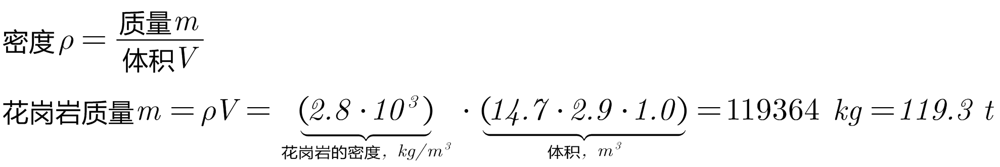
====

物体的质量m = 密度ρ × 体积V

从密度公式 stem:[ ρ = \frac{质量m} {体积V} ] 中, 还可知: 当温度上升时, 物体的体积V (分母部分) 会加大, 而其质量m (分子部分) 不变, 则其密度会变小. (分母变大, 分数值就变小). *所以, 温度能改变物质的密度.*

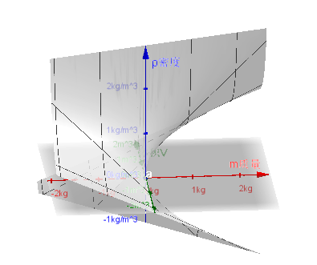

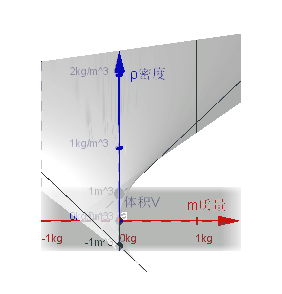

.标题
====
空气因受热, 体积会膨胀，密度就变小, 而上升。热空气上升后，冷空气就从四面八方流过来, 从而形成风。
====

一般来说, 同种物质温度越高, 密度会变得越小. 这遵从"热胀冷缩"规律. 但是水比较特殊, **水在4C时密度最大。**温度高于4C时，随着温度的升高,水的密度越来越小; 温度低于4C时，随着温度的降低，水的密度也越来越小。水凝固成冰时体积变大,密度变小。

.标题
====
冬天, 水管内的水如果结了冰, 就会把水管冻裂. 原因是: 冰的密度, 比水的密度小. 根据密度公式: stem:[ ρ = \frac{质量m} {体积V} ], 分子(质量m)不变, 密度ρ变小, 则体积V会加大. (分母越大, 分数值越小). 所以水结冰后, 体积会变大, 从而会把水管胀裂.
====

密度公式, 也能帮我们判断某个物体是什么材料做成的.  就是求出它的密度, 然后去密度表上查, 看这个密度最接近属于哪个物质的?

**不过, 不同物质的密度, 也有可能是相同的。**例如,酒精和煤油都是液体,它们的密度都是 stem:[ 0.8×10 kg^3 //m^3]. 这就只能通过气味来区分它们了。因此, 要准确地鉴别物质, 常常需要多种方法并用。

不同的材料, 具有不同的物理性质。除密度不同外，材料的导电性、磁性、弹性、硬度、延展性等, 也往往各不相同。

现代文明的三大支柱就是: 信息, 能源, 材料。

'''

== 力

力, 用符号 F 表示. +
力的单位, 是 newton(牛顿), 符号是 N. 托起两个鸡蛋所用的力大约是1N。

力的三要素是: 力的大小, 方向, 作用点.

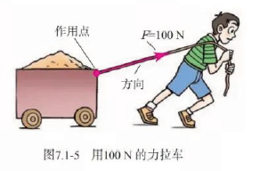

一个物体对另一个物体施力时，另一个物体也同时对它施加力的作用。也就是说，物体间力的作用是"相互"的。

==== 弹力

我们在压尺子、拉橡皮筋时，感受到它们对手有力的作用。**物体由于发生弹性形变而产生的力, 叫做弹力( elastic force )。**

放在桌面上的水杯 (桌面因而受到形变), 受到桌面对它的支持力，支持力是弹力; +
桌面受到水杯的压力，压力也是弹力。

==== 材料的力学性能, 包括:  弹性, 塑性, 脆性,韧性等

材料的力学性能: 是指材料受力时的变形行为, 及其抵抗破坏的能力, 通常包括弹性与塑性、脆性与韧性等。无论是何种材料，一般受力时都要发生形变。有的会发生"弹性形变"，有的会发生"塑性形变"。不同材料发生弹性形变、塑性形变的难易程度不同。

[options="autowidth"]
|===
|Header 1 |Header 2

|弹性变形 (可逆变形)
|弹性变形为"可逆变形". 物体受外力作用时，就会产生变形，如果将外力去除后，物体能够完全恢复它原来的形状和尺寸，这种变形称为"弹性变形"。

|塑性变形 (不可逆变形)
|塑性变形为"不可逆变形", 物体受载超过"弹性变形"范围之后, 将发生永久的变形. 即卸除载荷后将出现不可恢复的变形.  +
材料在外力作用下产生形变，而在外力去除后，弹性变形部分消失，不能恢复而保留下来的的那部分变形, 即为"塑性变形"。

|脆性
|有些材料当受力达到一定值时，会发生突然断裂，且无明显的塑性形变，这种性质叫做"脆性"。例如，轻轻一掰，饼干就会变成碎片。
|===

==== stem:[ 重力 gravity = g \cdot 质量m]

由于地球的吸引, 而使物体受到的力, 叫做重力(gravity)，通常用字母G表示。

物体所受的重力G, 跟它的质量m 成正比。 即:
\begin{align}
重力与质量的比值g = \frac{重力G} {质量m}
\end{align}

也即:
\begin{align}
\boxed{
重力G = 质量m \cdot 它们的比值g
}
\end{align}

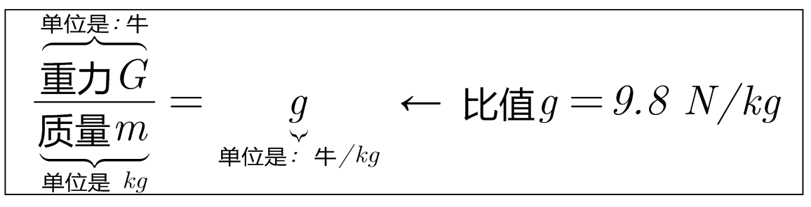

粗略计算时, g可取 10 N/kg.

.标题
====
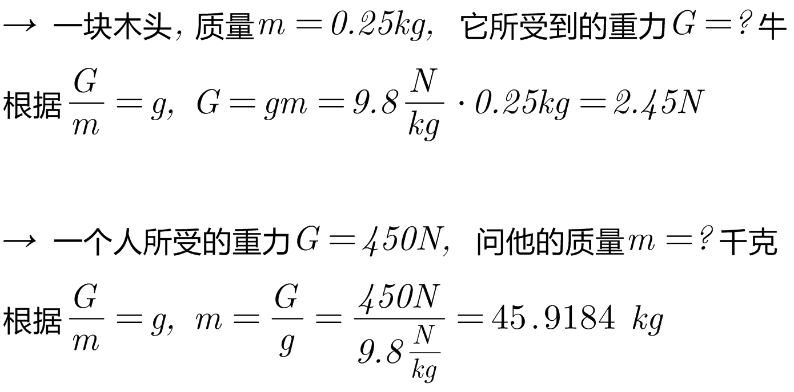
====

'''

== stem:[ 压强 pressure = = \frac{压力F} {物体的受力面积S}]

物体所受的"压力的大小"与"受力面积"之比, 叫做压强(pressure)。

\begin{align}
\boxed{
压强p = \frac{压力F} {物体的受力面积S}
}
\end{align}

**"压强"在数值上等于物体单位面积所受的压力。**压强越大，压力产生的效果越明显。

在国际单位制中，力的单位是牛，面积的单位是平方米，*压强的单位则是"牛/每平方米"，它有一个专用名称叫做 帕斯卡(pascal)，简称帕，符号是Pa。*

.标题
====
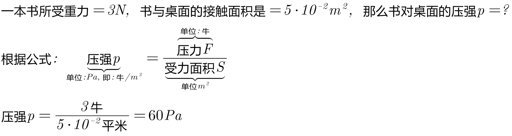
====

根据压强公式, 就可以知道: 要想增大"压强p", 有两种方法: +
1.缩小分母值, 即缩小"受力面积S". +
2.增大分子值, 即加大"压力F".

==== 液体的压强:  stem:[ 液体压强p = 密度ρ \cdot g(即 9.8 N//kg) \cdot 深度h]

由于液体具有流动性,液体内向各个方向都有压强。

液体内部压强的大小, 具有这样的特点:

- 在液体内部的同一深度，向各个方向的压强都相等; *深度越深，压强越大。*
- 液体内部压强的大小, 还跟液体的密度有关, *在深度相同时,液体的密度越大，压强越大。*

要想得到液面下某处的压强,可以设想 在该处有一个水平放置的“平面”。**这个平面以上的液柱对平面的压力, 等于液柱所受的重力,所以计算出液柱所受的重力, 是解决问题的关键。**

下图中,设液柱的高度为h，平面的面积为S。

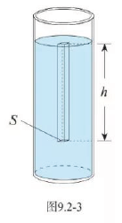

该平面上方的液, 柱对平面的压力就是:

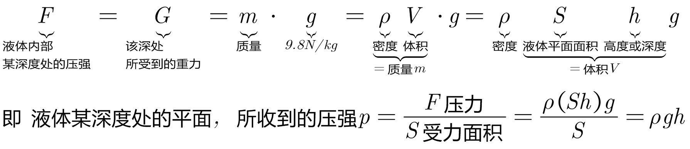

即: 深度为h 处的液体的压强是:

\begin{align}
\boxed{
液体压强p = 密度ρ \cdot g(即 9.8 N/kg) \cdot 深度h
}
\end{align}

.标题
====
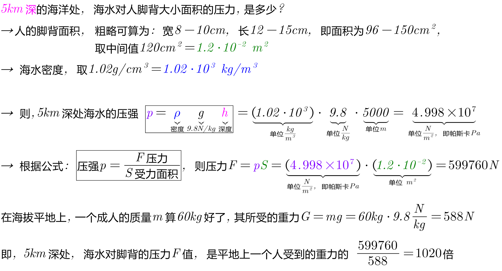
====

*注意: 利用公式 "stem:[ 水的压强p = 密度ρ \cdot g \cdot 深度h ]" 计算的时候，"密度ρ" 的单位一定要用 stem:[ kg //m^3] , "液体深度h" 的单位要用 m, 计算出的"压强p"的单位 才是Pa.*

==== 连通器

上端开口、下端连通的容器, 叫做"连通器"。如图9.2-5，*连通器里的同种液体不流动时,各容器中的液面高度总是相同的。*

生活中的连通器有:

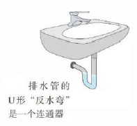

三峡大坝, 上下游的水位差可高达100多米, 那么如何运送上下游的船? 就是使用了"连通器"的原理.

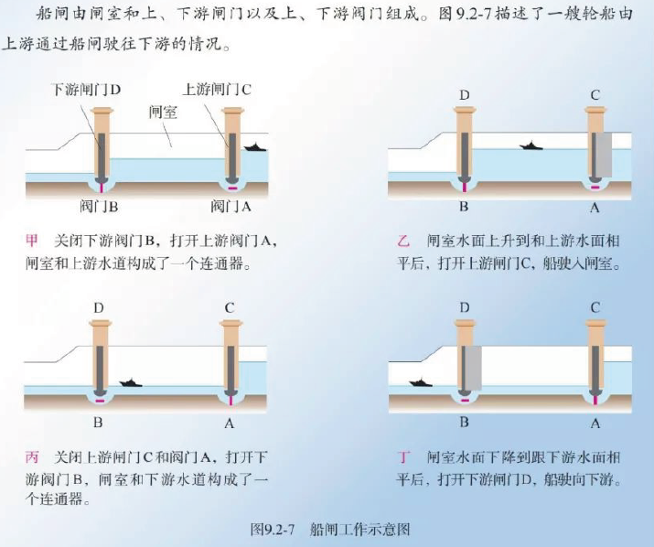

==== 大气压强

大气压强, 简称为大气压(atmosphere), 或气压。*注意:大气压是"大气压强"的简称,不是"大气压力"的简称.*

大气压产生的原因: 由于大气受到重力的作用而产生. +
大气压的方向: 同液体一样, 大气朝向各个方向都有压强的。

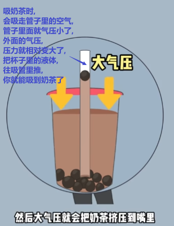

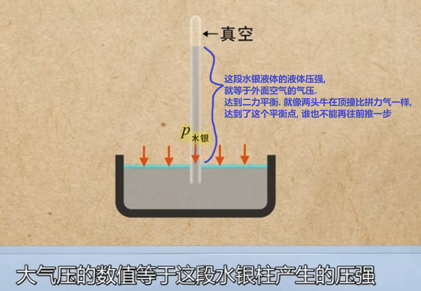

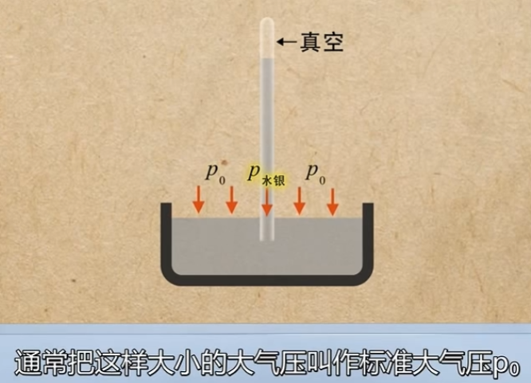

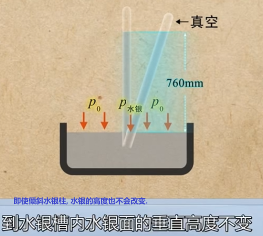

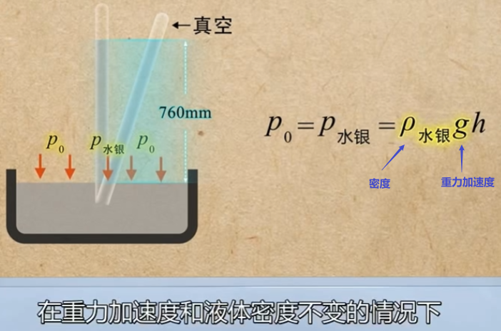

水银柱产生的压力 stem:[p_{水银} = 标准大气压 p_0], 根据压力公式 p=ρgh, 在水银密度ρ不变, 重力加速度g=9.8N/kg, 标准大气压stem:[p_0] 这三个变量都不变的情况下, 显然水银柱的高度h 就不会改变.

同时这样说明, 某液体或气体深处的压力的大小, 跟其质量m的多少无关. 即使水银柱倾斜过来, 水银柱中水银的体积增加, 质量m增加, 它的压力p也不会改变.

*注意:只有在水银柱上部的空间是"真空"时, 水银柱的压强才跟大气压强相等. 如果水银柱上方不是真空, 而是混有空气, 则这段空间的气体, 也会对水银柱产生压强.* 这种情况下, 就是这个压强与水银柱产生的压强之和, 才等于大气压强.

管内水银柱的高度, 只随外界大气压的变化而变化, 而和管子的粗细、倾斜角度、管的长度, 及将玻璃管提起还是下压等因素无关. 只与水银柱的竖直高度有关.

**注意: 大气的密度是变化的, 在地面附近, 空气的密度较大, 随高度的增加, 空气的密度越来越小. **

所以, 在地表的大气压下, 压得水银柱高度为760 mm. 反过来说, 我们就把这样大小的大气压, 叫做"标准大气压"stem:[p_0].

\begin{align*}
标准大气压 p_0 = ρgh=
\end{align*}

.标题
====
马德堡半球实验: 马德堡市市长, 将两个直径为30多厘米的空心铜半球紧贴在一起,用抽气机抽出球内的空气，然后让马向相反的方向拉两个半球。直到两边的马各增加到好几匹时，才把半球拉开。

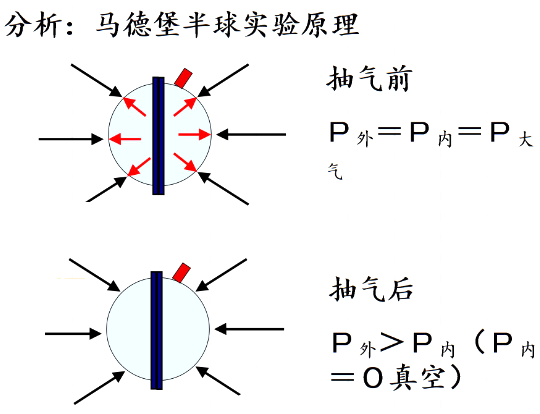
====

image::img/0044.pdf[width=300, height=200]

image::img/0044.pdf[page=1]

43
