= 结构思考法 (立体式思维)
:toc:

---

== 一切的起源是什么? -- "问题"本身. 问题是永恒的.

*问题是永恒的存在. 现在的问题, 是由以前的决策造成的后果, 或是当下环境变化造成的.*

SCQA框架模型:

- Situation :  是你面临的当下情景(环境, 处境).
- Complication : 是你此时遇到的问题, 冲突.
- Question : 是你对你面临的问题, 提出的疑问.
- Answer : 是你的回答（解决方案）.

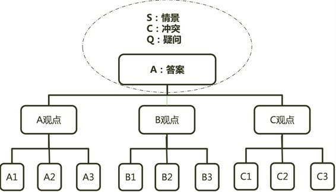

在对问题进入具体讨论之前, 作为引子, 前序, 我们可以通过调整SCQA这四个要素的顺序，来突出不同要素的重要性:

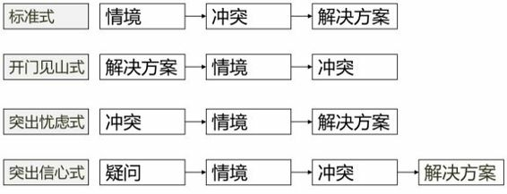

比如: Q—S—C—A :  +
(Q提出问题)养老问题如何解决? -> (S背景环境)中国老龄化严重, 经济失去动力... -> (C面临的冲突,问题)养老金耗尽, 养老资源不足, 65岁退休前失业问题, 生活成本高昂问题, 少子化问题 -> (A解决方案)...

---

== 结构思考法的整体结构是怎样的? -> 纵向:按"因果"推导 ; 横向:按"逻辑"分类

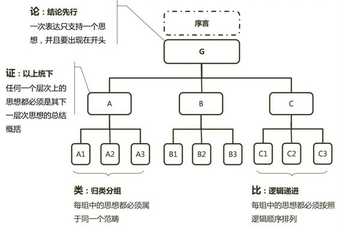

我们看书, 或对接收到的信息, 进行"结构化"时, 可以按三个步骤来进行:

1. 第一步：识别信息中的 1.事实、2.观点(包括 2-1理由 及2-2结论)。 +
"观点类"的信息中, 要区分开哪些是 2-2"结论"、哪些是支撑结论的 2-1"理由"。
2. 第二步：找到"事实"与"观点"的逻辑对应关系，并画出结构图。
3. 第三步：在每一层级上, 都用一句话(一句结论)总结出其下级的所有内容(即, 将该分支下的全部"子结论", 用"父结论"来总结出来)。

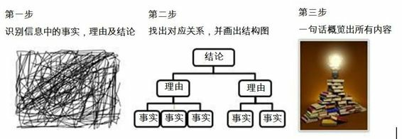

从这个三层金字塔结构, 就可以看出: +
要判断顶层的 "3结论"是否为真(是否合理), 就看它下面两层的根基柱子是否牢靠: +
-> 看他提供的 "1事实与数据"是否真实? +
-> 这些 "1事实与数据", 是否可以得出相应的 "2理由"? +
-> 这些 "2相应的理由", 是否可以得出最终顶层的 "3结论"。

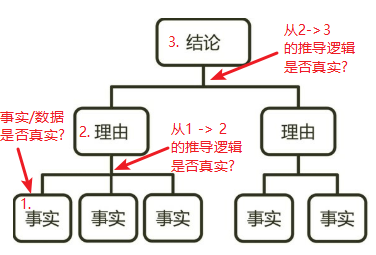

---

== 1. 纵向结构上

====  "纵向结构上"的关键点是什么? -> 无论哪一层级, 每一组的观点(结论), 都必须是其底层级观点(结论)的总结. <- 没有总结, 就不知道你引用这些数据事实的的目的和价值观倾向是什么?

注意在结构思考法的要求下, *所有的主题必须是个"结论"!*

假设你说: "对于营销方案, '如何做'的答案是4P". 但是4P本身不是结论. *没有结论就仅仅是个框架。单纯看到框架, 依然是不知道你到底想拿它表达什么观点倾向的。*

如下图, 就仅仅是框架

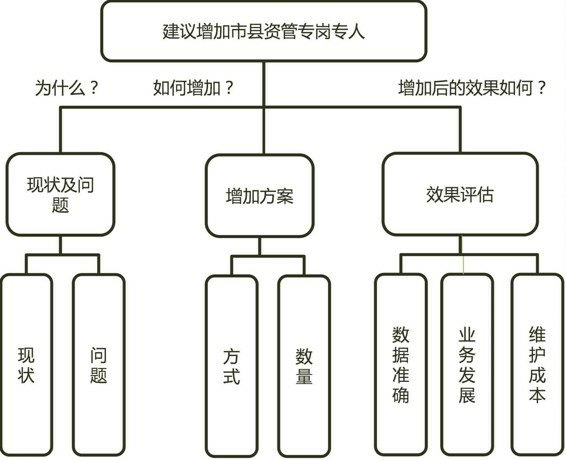

每个方框中, 必须是结论才行! 所以我们要改成 :

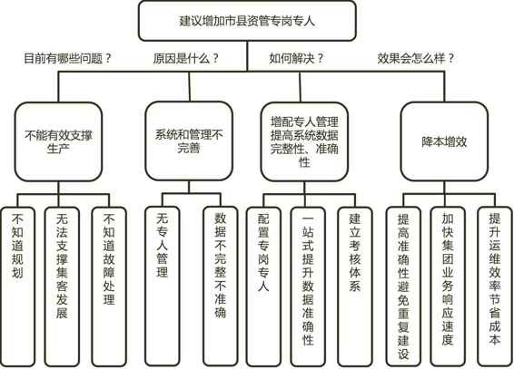

- 很多ppt的标题, 都犯有"没有结论"的错误.  +
如《2006—2015年中国互联网支付规模》 这个信息的结论是什么呢?  +
你可以改成《2006—2015年中国互联网支付规模逐年增长》,《2015将突破✕✕✕亿元》,《从2006到2015年将增加✕✕✕倍》. +
**同样的数据放在这里，必须得加上结论才有意义，而这个结论其实它没有标准答案，取决于你拿这些数据到底想要表达什么, 你的目的是什么。**这页PPT你觉得它想表达什么呢？跟客户说ISPE生命周期, 你觉得这个举动的目的是什么呢? +
*反过来看, 使用数据却不表达该数据意味着什么, 是什么结论, 那么就会让信息接收者, 需要猜我们的结论*, 这很可能会让他产生解读上的歧义.

- 领导想知道的是结论，而小张给的全部都是数据和事实.

- 他对我说：“老师，我之前做的根本不能叫分析报告，应该叫数据统计图。” +
因为这个模板是公司总部给的，每个月都要按照模板来填数据，具体这些数据交上去用来做什么, 他自己也不知道，所以也没法儿给出结论。换句话说，*没有目标的报告,就无从给出结论. 因为没有目标,所以也就没有任何立场，没有任何立场,它充其量只能被称为数据统计表而已。*

- A问: "为什么要将小户型作为首期产品推出呢？" ,  +
B说: "主要是以下几点原因: 第一，来电客户多数关注小户型；第二，访客户大多偏好小户型, 第三，缴纳诚意金客户以小户型为主...."  +
*这里, B的问题是一盘散沙.  没有把这n点原因, 总结出一个跟高层次的统领的结论.*  换言之, A必须等着B把所有的点都说完，才能知道他到底想要表达什么.   +
那么本例, 统领所有原因点的结论是什么呢? 可以概括为“小户型客户蓄客量充足”.

你写在每一层及主题上的"结论", 这个结论是有目的性的 -- 即你选择该结论, 是因为它能助推"你想要实现的目标"的. 所以你的目标不同, 你所提炼出的结论(用于主题的话)也是不同的. +
所以, 你的结论中, 需要带有给人"利益性"的话语, 动词.

- 你做一个别墅项目的客户推介会, 那么你的主题(结论) 就要写成 “xx别墅，是你投资的最佳选择”.  而不要只写为"xx别墅介绍".

用广告语的逻辑, 来设计加强你的"结论"的力度 :

- "积分贷"产品介绍 -> 要改成 :  "积分贷"实现多方共赢 -> 进一步用广告语包装 : 小积分"贷"动大优惠
- xx公司战略规划报告 -> 要改成:  改革创新, 降本增效, 提升经营业绩

---

==== 如何得出每层的结论? -> 多问"为什么", 向链条一样, 一层层往背后溯源原因

只有答案是"结论", 才符合“结论先行”和“以上统下”这两条标准的要求。

- 第一，每个层级都需要是结论，即每一个答案的本身就是一个结论，不能是“xx的介绍”、“xx特点的优劣势分析”。
- 第二，*以下撑上，就是下层的"结论", 用来回答上层"结论"的原因。*

如何得出每层的结论? 可以从两个方向来得出:

[cols="1,3a"]
|===
|方法 |Header 2

|1. "从下层往上层"推导出来.
|即, 从底层的结论, 来推导总结出上一层的总括结论.

如:

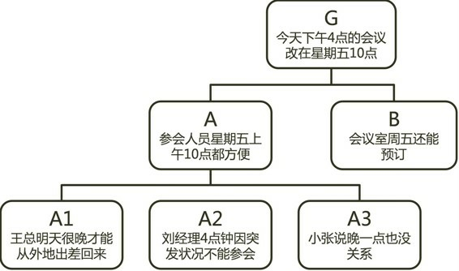

-> G叫作中心思想， +
-> A和B叫作支撑中心思想的理由， +
-> A1、A2、A3叫作支撑理由的子理由。 +
它是从下到上逐级支撑.

其实, 自下而上, 和自上而下, 只是观察的角度不同而已. 本例反过来看, 其实也像是"自上而下"的表达方式 --首先从结论开始，然后阐述理由，最后再阐述支撑理由的事实和依据。

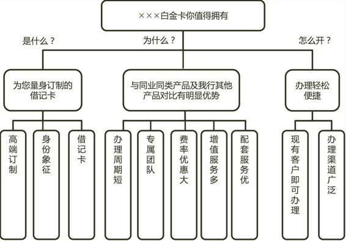

|2. "从上层往下层"追溯.
|即, 不断问"为什么", 深入每一层背后原因.

找"原因"的时候, 要多问"为什么?". 凡事多问为什么, 可以帮助我们层层递进的分析问题，像剥洋葱一样，一层一层上溯，最后得到最核心的原因。

对你在第一层次引出的问题(或结论), 你必须在下一层次(第二层次)做出回答. +
同时这个第二层次的回答(结论), 听众仍有疑问, 你又要在下一层(第三层)来做出回答。 +
直到对方到某一层的结论不再有疑问了。至此你就可以离开金字塔结构的第一个分支，返回跟顶层处的结论层,  继续回答由那些结论引出的其他疑问。

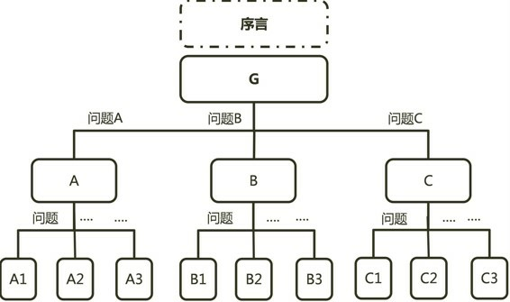

|===

---

==== 每层都是"结论"的优点有哪些? -> 1. 能立刻把你的观点倾向(结论)说清楚.

结构思考法, 可以在最短的时间内把问题讲清楚。

- 如果老板只给5秒钟，说结论就可以了；
- 如果老板给了30秒钟，可以说到第二级；
- 如果老板给了1分钟, 可以说到第三级；

所以结构思考法，无论对方给你多少时间, 你都可以把问题说得清楚全面，只是深入程度不同而已。

---

==== 每层都是"结论"的优点有哪些? -> 2. 问题与解决方案能一一对应, 不混乱, 不遗漏

如果不用结构化的方式, 就会经常犯这种错误:
....
A说:"我发现...的问题，具体包含1、2、3、4点."
B说:"你有什么改进建议吗？"
A说:"我有五大改进措施..."
....

A这样说会造成什么情况?  1.这五个措施跟他提的四个问题, 你很难知道哪个措施解决的是哪个问题. 或者 2.那些问题是不是都被解决了?(而没遗漏)。

因此, 解决方法就是 -- 完全遵循结构化的方式 :  既然提出4个现象(即"问题")，就要分析这4个问题对应的"原因"，最后给出与这4个原因所对应的"解决方案".  即问题、原因、解决方案, 要一一对应。

---

== 2. 横向结构上: 每组各个观点互不重叠, 且按一定的逻辑顺序.

==== 为什么要分类? -> 因为人脑短期记忆容量有限, 只能记5±2个点.

人的短期记忆, 只能记住 5±2 个数量内容。更容易记住的是3个.

通过分3-5个点这种有意识的训练，其实也是在加强你的分类能力.

---

==== 横向结构上, 各元素的分组原则是什么? -> MECE（Mutually Exclusive Collectively Exhaustive）原则: 相互独立、完全穷尽.

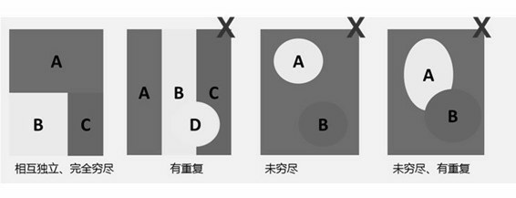

例: +
如何能够将200ml的水装进100ml的杯子里？ +
换个方式想: 为什么200ml水倒进杯子里水会流出来？

我们链式一层层递进思考原因: +
杯子小 -> 1. 超出的水就流出来. <- 2. 因为地球有重力, 所以导致第1点结果. <- 3. 因为水是液体, 所以导致前面第2点结果 (固体体积即使超过杯子, 也不会流出来).

所以水之所以会流出来, 无外乎这三类原因: 1.杯子容量、2.外部物理环境、3.水的物理特性本身. +
这三个维度就可以理解为分析这个问题的一个"结构". 因此解决办法, 就可以从这三个维度下手. 比如, 从第三个维度 -- 把液体变为固体冻成冰, 就行了.

这就符合MECE原则，相互独立、完全穷尽。

---

==== MECE原则 的子集 -> 2✕2矩阵

你可以创建属于自己的2✕2矩阵:  +
按照20/80法则，任何事情和问题都可以找出2个或几个最核心的要素，每个要素又可以找出对应的两难困境。 +
这种两难困境至少可以被归纳为8种类型:  理智与情感、内与外、成本与效益、产品与市场、变化与稳定、了解与不了解、竞争的优先次序、内容与流程。

如, 时间管理矩阵:

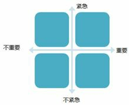

意愿能力矩阵:

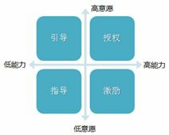

---

==== 横向结构上, 各元素的排列顺序可以按什么逻辑 -> 演绎 | 归纳(包括, 5W2H原则)

横向结构上: 每组各个观点互不重叠, 且按一定的逻辑顺序. 各元素的逻辑递进:

[cols="1,3a"]
|===
|Header 1 |Header 2

|演绎
|比如 : 原因 -> 结果(现状困境) -> 解决方案

|归纳
|分类方式可以: 按发展的时间步骤顺序; 按重要性高低(先重要, 后次要); 按你自己的逻辑结构分组顺序
|===

为了确保问题不被遗漏，用5W2H原则:

- What：是什么？做什么？目的是什么？
- Why：为什么？为什么这样做？理由是什么？原因是什么？
- Who：谁来做？谁来负责？由谁来承担？谁来完成？
- When：什么时候开始做？什么时候完成？最佳时机是什么时候？
- Where：何处？在哪儿做？从哪儿入手做？

- How：如何做？怎么去做？从哪儿入手做？
- How much：做多少？完成量是多少？合格率是多少？费用是多少？

也可以用简化版的 2W1H（What、Why、How）

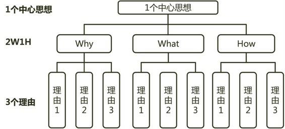

---

== 3. 模型思维

各个学科里面都有各种模型，包含了方法、步骤、工具等。这些都是经过前人提炼、抽象出来的帮助我们审视世界的“结构”, "工具".

- 你在考虑竞争战略时，能否想到波特的"五力模型"等?
- 你在考虑市场营销时, 能够想到菲利普·科特勒的各种模型等?

---

