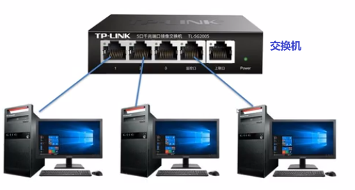
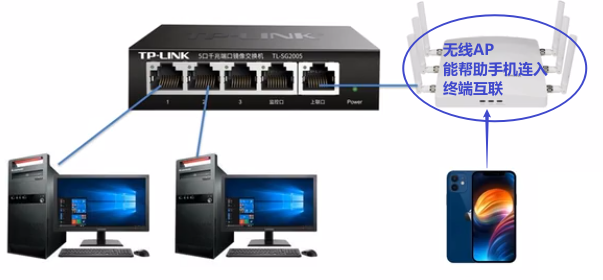
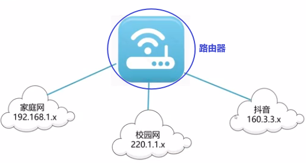
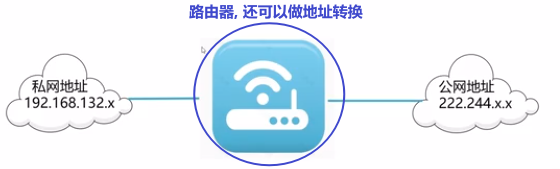

= 基本网络设备
:toc: left
:toclevels: 3
:sectnums:

'''

== 交换机

用于不同电脑(包括手机)间,互联功能的实现, 是"交换机". +

'''

== 路由器

功能:
[.small]
[options="autowidth" cols="1a,1a"]
|===
|Header 1 |Header 2

|要在不同的网段之间, 进行互联, 就要借助"路由器".
|

|路由器, 还可以做"地址转换".
|NAT: 网络地址转换技术，*可以将大量私网地址，转换成1个公网地址。从而实现很多内部用户, 共用1个公网地址来访问Internet，起到节省IP地址的作用.*

|===

'''

== 防火墙

[.small]
[options="autowidth" cols="1a,1a"]
|===
|Header 1 |Header 2

|只能保护一台电脑的, 叫"个人防火墙". 基本是以"软件"形式存在的.
|

|同时能保护企业网络(内网)中的所有电脑的, 叫"企业防火墙", 是以"硬件"形式存在的.
|
|===

'''

https://www.bilibili.com/video/BV1Lu4y1f799?p=7&vd_source=52c6cb2c1143f8e222795afbab2ab1b5
