= 货币金融学 /米什金
:toc: left
:toclevels: 3
:sectnums:

'''

== 经济数据来源的网站

[.small]
[options="autowidth"]
|===
|Header 1 |网站

|代表"长期利率"的最适当的指标, 是"10年期美国政府债券的利率"。
|https://www.federalreserve.gov/releases/h15/

|提供代表性利率、汇率等经济指标的历史数据，并发布最新的日、周、月、季度和年度数据。 +
提供美联储的一般信息、货币政策、银行体系、研究活动和经济数据。
|https://www.federalreserve.gov/data.htm

|提供不同时期各种股票指数的历史图表。
|https://stockcharts.com/freecharts/historical/

|提供了计算美元1913年以来购买力变动的计算器。
|https://www.bls.gov/data/inflation_calculator.htm

|===

== 总览

[.small]
[options="autowidth" cols="1a,1a"]
|===
|Header 1 |Header 2

|证券 (security，又称金融工具):
|是对发行人未来收入与资产（ asset，金融索取权或隶属于所有权的财产权）的索取权。

|债券(bond):
|是债务证券，它承诺在一个特定的时间段中, 进行定期支付。 +
**由于债券市场可以帮助政府和企业, 筹集到所需要的资金，所以它是决定"利率"的场所.**

|利率 interest rate:
|利率不仅影响消费者支出与储蓄的意愿，还影响企业的投资决策，因此利率对经济有重要影响. +
高利率 →  励个人增加储蓄以赚取更多利息收入 → 因此就减少消费. +
高利率 →  提高融资成本 → 降低企业投资意愿, 对就业不利.

**由于不同利率的运动有统一的趋势，经济学家通常将各种利率糅合在一起，统称为“利率”。**

然而，如图1.1所示，*不同种类债券的利率差别很大.*

-  3个月期国库券利率的波动, 要大于其他利率，但总的来说，其平均水平最低;
- Baa级（中等质量)企业债券利率的平均水平, 要高于其他种类.

20世纪70年代它们之间的差距变大，90年代收窄，21世纪初短暂变大后再次收窄。2007年夏天之后则开始迅速扩大。

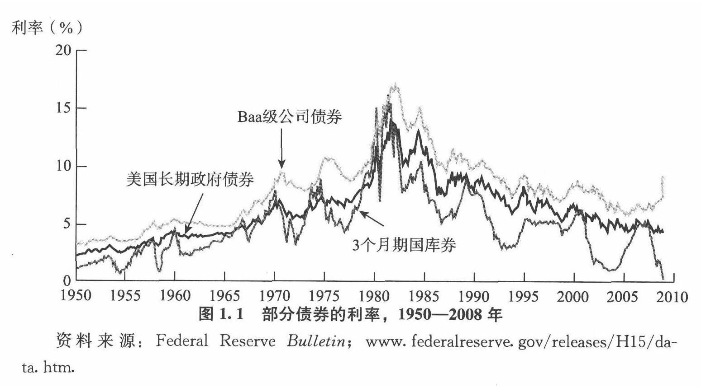

|股票:
|一家企业股票价格高, 意味着它可以筹集到更多的资金, 用于购置生产设施和设备。

|金融危机:
|所谓金融危机，是指金融市场出现混乱，并伴随着资产价格的暴跌, 以及众多金融机构和非金融企业的破产。

|"货币"与"经济周期"的关系:
|为什么美国经济会扩张与收缩? 很多实证分析表明，货币在经济周期(business cycles，即"经济总产出"的上升和下降运动）形成的过程中, 扮演了十分重要的角色。

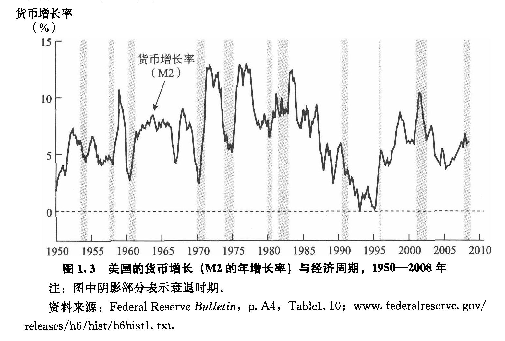

|"货币"与"利率"的关系
|"货币"与其他很多因素一起，在"利率"波动过程中扮演着重要的角色。20世纪60—70年代，长期政府债券的利率, 随"货币增长率"的上升而上升。然而，1980年之后，"货币增长率"与"利率"之间的关系就不那么清晰了。

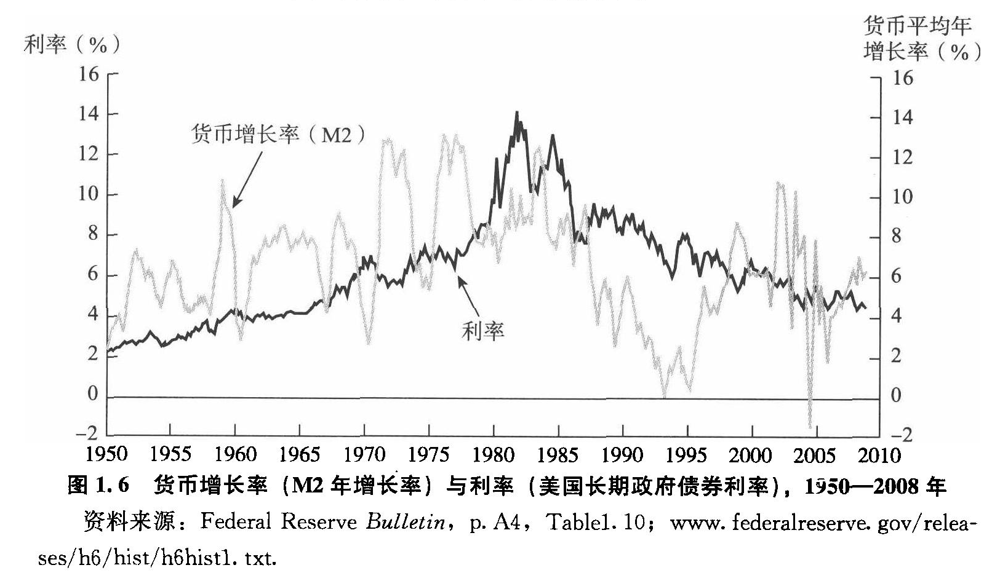

|货币政策:
|由于货币可以影响许多对于"社会福利水平"至关重要的变量，因此，世界上所有的政治家和政策制定者, 都十分关注**"货币政策"（monetary policy)的实施，即对"货币"和"利率"的管理。**

|财政政策:
|**财政政策（ fiscal policy）是有关"政府支出"和"税收"的决策。**

.预算赤字( budgetdeficit）:
是指在一个特定的时间段（通常是一年)中，**"政府支出"超过"税收收入"的差额.** +
政府必须通过借款, 来弥补"预算赤字". +
"预算赤字"可能引发金融危机.

.预算盈余:
当"税收收入"超过"政府支出"时，就会出现"预算盈余"(budget surplus)。

如何处理"预算赤字"和"预算盈余"是国会的一个重要议题，近年来更屡屡成为总统和国会之间激烈争论的焦点.

|汇率:
|- 美元贬值, 购买能力下降, 就意味着美国人买外国商品时, 要花费更多的美元. 即外国商品变得更加昂贵了. -> 会降低美国人购买外国商品的欲望, 而增加对本国商品的消费. +
例如, 美元汇率走强期间, 外国购买美国的钢材就要花更多当地货币(用他们国家的货币来换取美元), 所以外国对美国钢材的需求大降, 美国钢材的出口急剧下滑.

- 反之, 美元升值, 购买能力上升, → 会让美国货在国外市场上(用外国货币计算时)变得更贵, 会抑制国外消费者的购买.

|===

为了帮助学生理解和应用这个统一的分析框架，本书构建了一些简单的模型。其中，**在模型的建立过程中，一些变量被假定为不变，**模型推导的每一步都详细列出。*在运用这些模型解释各种现象的过程中，通常的方法是假定其他变量不变，集中考察某一变量的变动。*

[.small]
[options="autowidth"]
|===
|Header 1 |决定的经济指标

|债券市场
|→ 利率

|外汇市场
|→ 汇率

|股票市场
|→ 投资
|===

== 总产出(GDP 国内生产总值) = 总收入

[.small]
[options="autowidth"]
|===
|Header 1 |Header 2

|总产出 (GDP)
|.GDP (gross domestic product) :
是指一个国家在"一年中"所生产的所有最终产品和服务的市场价值. 注意, 这个指标不包括下面两类内容: +
① 对"过去"所生产的产品的购买. 股票或债券的购买也是如此. 因为这些产品和服务, 并非"当年"的产出, 而是以前年份中的产出. +
② 中间产品. 因为"最终产品"的价值中, 已经包含了这些"中间产品"的价值. 如果再将中间产品计算在内, 就会造成重复统计。

|总收入（aggregate income）
|是指在一年中, 生产要素（factors of production，土地、劳动力和资本）在生产产品和服务的过程中, 所获得的全部收入。
|===

**"总收入"与"总产出"被认为是相等的。**这是因为，对最终产品和服务的"支付", 必然会作为"收入", 返回到生产要素所有者手中. 例如，如果经济社会的"总产出"为10万亿美元，那么该经济社会的"收入"的总规模（总收入）也是10万亿美元。

== "名义GDP" VS "实际GDP"

[.small]
[options="autowidth"]
|===
|Header 1 |Header 2

|名义GDP
|*在计算GDP数值时, 如果你以"现行价格水平"来计算, 其结果就称为"名义GDP".* 这个指标是具有"含水量"的. 因为它是会被通货膨胀扭曲的. 比如, 如果所有的价格都上升了一倍，则即使产品和服务的实际产出保持不变，名"义GDP" 也会上升一倍。

|实际GDP
|所以, 更可靠的经济产出指标是**"实际GDP". 它是以某一年作为"基年"(一般是2000年), 用该"基年"时的产品价格, 来算后来每一年的GDP值.** 这样, 实际GDP的值, 就只衡量产品和服务的"数量"，而不反应"物价"的变动. 因为物价被永远固定在了"基年"的物价上.

本教材中在讨论"总产出"和"总收入"时, 通常就都指实际变量(例如，实际GDP) 。
|===

== 对"物价总水平"的衡量 : ①消费者物价指数, ②PCE平减指数,  ③GDP平减指数

物价总水平: 为经济社会中, "平均价格"的指标. 一般包括三种:

[.small]
[options="autowidth"]
|===
|Header 1 |Header 2

|GDP 平减指数 (GDP deflator)
|latexmath:[GDP平减指数 = \frac{名义GDP} {实际GDP}]  ←*这个其实就是"名义GDP"的含水量. 衡量的是通胀情况.*

比如, 2010年时, 名义GDP是10万亿美元. 实际GDP(以2000年的价格水平为基数)为9万亿美元. 则: +
latexmath:[ GDP平减指数 = \frac{10万亿美元} {9万亿美元}=1.11] +

*这个数值也就是说: 自2000年以来，物价平均上涨了11%.*

通常, *物价水平的指标, 用"物价指数"的形式表示，它将基年的物价水平(比如2000年为基年)表示为100 。这样, 2010年的"GDP平减指数"就是111.*

|个人消费支出平减指数(PCE deflator)
|latexmath:[PCE deflator = \frac{名义个人消费支出} {实际个人消费支出}]

|消费者物价指数(consumer price index, CPI)
|通过给一个典型的城市家庭所购买的一揽子产品和服务定价，可以得到消费者物价指数。 +
如果在一年中，这一揽子产品和服务的支出由500 美元, 上升到600 美元，"消费者物价指数CPI" 就上涨了20% 。 +
*CPI, 同样是以基年为100 的物价指数来表示的。*
|===

*衡量"物价总水平"的这三个指标: ①消费者物价指数, ②PCE平减指数, 与 ③GDP平减指数, 都可以将"名义变量"转化为"实际变量"。* 方法公式是: +
latexmath:[ 实际变量 = \frac{名义变量} {物价指数}]

== 增长率 & 通货膨胀率

[.small]
[options="autowidth"]
|===
|Header 1 |Header 2

|增长率
|latexmath:[ \text{增长率}=\frac{\overset{\text{表现在}}{\overbrace{x_t}}-\overset{\text{表一年前}}{\overbrace{x_{t-1}}}}{x_{t-1}}\cdot 100]

例如, 实际GDP, 在2010年时是9万亿美元, 2011年时是9.5万亿美元. 则: +
latexmath:[2011\text{年}GDP\text{增长率}=\frac{2011\text{年时的实际}GDP-2010\text{年时的实际}GDP}{2010\text{年时的实际}GDP}\cdot 100=\frac{9.5-9}{9}=5.6\% ]

|通货膨胀率
|通货膨胀率: 被定义为"物价总水平"的增长率。 +
如, 如果 "GDP平减指数" 从2010 年的111, 上升到2011年的113 ，则利用"GDP平减指数"这个指标所计算出的通货膨胀率, 就为: latexmath:[ \text{通胀率}=\frac{113-111}{111}\cdot 100=1.8018]

对于"不满1年"的增长率, 如何计算? 通常会将其转化为"年度化"的数据, 即假定其增长率保持不变，将其转化为1 年期的增长率.  +
比如, 第1季度， GDP增长了 0.5%，那么1年期的增长率, 大致就 =4×0.5%=2%. +
其实用"复利"计算的精确值是: latexmath:[ 1+\left( 1+0.005 \right) ^4=2.02015]
|===

== 金融市场

缺钱的一方(比如公司), 在借入钱时, 可以选择: +
→ 发行债券: 即承诺在一个规定的期间内, 定期还钱给放贷者. +
→ 发行股票: 即将公司利润和资产的股份, 出售给放贷者.

[.small]
[options="autowidth"  cols="1a,1a"]
|===
|Header 1 |Header 2

|发行债券
|- 债务的期限 maturity: +
短期 short-term (<1年), +
中期 intermediate-term (1-10年), +
长期 long-term (≥10年).

|发行股票 equity
|- 股权工具承诺: 持有者按份额, 享有公司的净收益(扣除费用和税款后的收人)和资产。 +
如果你拥有一家公司发行的100 万普通股中的一股，你就拥有了该公司一百万分之一的净收益, 和一百万分之一的资产。
- 由于这种工具没有到期日，因此被视为"长期证券"。
- 不利之处: *股权持有者是"剩余索取人". 也就是说，公司在还钱时, 会优先向所有的"债权人"还钱, 之后才轮到给你股东还钱*.
- 有利之处: 股东可以随着公司的做大而享受升值. 而债权人就没这好处了, 只能拿到固定的还钱额.
- 20世纪90年代以来，美国股票市场总价值, 随着股票价格的变化, 在4 万亿美元~20 万亿美元之间波动. 2022年时, 大约25万亿美元.

|===

==== 一级市场 & 二级市场

[.small]
[options="autowidth" cols="1a,1a"]
|===
|Header 1 |Header 2

|一级市场
|- 是借入钱的人, 卖出证券给"最初放贷人"的地方.

|二级市场
|- 是给"已经发行过了的证券", 做交易的地方.

- 二级市场能带来两个作用: +
① 能给发行的债券, 带来更好的流动性. +
② *债券在二级市场上的价格, 反向决定了投资者在一级市场上购买证券的价格. 一级市场上的价格, 不会高于二级市场上对该证券预期的价格, 否则投资者就会(在一级市场上)高买,(在二级市场上)低卖, 而亏本.* +
反过来, 在二级市场上, 证券价格越高，借入款的人在一级市场上销售出他们证券的价格, 就能越高.
|===

==== 货币市场 & 资本市场

[.small]
[options="autowidth" cols="1a,1a"]
|===
|Header 1 |Header 2

|货币市场 (money market)
|- 交易短期债务工具 (通常原始期限为1 年以下)
- 交易更为广泛，因而更具流动性.
- 短期证券价格的波动性, 要小于长期证券，因此是更加安全的投资方式。所以，企业与银行通常将其临时性的盈余资金, 投放于货币市场，以赚取收益.

|资本市场 (capìtal market)
|- 交易长期债务工具 (通常原始期限在1 年或1 年以上) 与股权工具.
- "股票"与"长期债券"等资本市场的证券, 通常被保险公司、养老基金等金融中介机构所持有.
|===

==== 货币市场上的工具

货币市场上交易的债务工具, 由于期限较短，价格波动水平不大，投资风险较低。*因此这一市场上的一些金融工具的发展速度, 远远超过其他金融工具。*

"货币市场"上的主要工具包括:

[.small]
[options="autowidth"  cols="1a,1a,1a"]
|===
|Header 1 |发行机构(即借入钱的人)|

|美国国库券(United States Treasury Bills)
|联邦政府
|- 目的是帮助联邦政府筹资.
- 美国政府所发行的短期债务工具的期限分别为: 1个月, 3个月, 6个月.
- 国库券到期日支付的金额是固定的，是不付息的。
- 但**国库券是按其面值折价发行的，**也就是说, 国库券卖给投资者的初始价格, 低于到期日所支付的固定金额。 +
例如， 2010 年5 月，你可能会以9000 美元的价格, 买入6个月期国库券. 2010年11月, 这些国库券清偿的
价格会是10000 美元。
- 美国国库券由于交易十分活跃，因而是"流动性"最好的货币市场工具。并且由于几乎不存在违约风险，美国国库券又是最为安全的货币市场工具。美国国库券的发行人是联邦政府，联邦政府可以通过"征税"或者"发行货币"的方式偿还债务，因而，是不可能违约的。

|可转让存单 (negotiable bank certificates of deposit)
|银行
|- *存单: 是银行向储户发行的债务工具.* 银行据此每年支付固定金额的利息，并在到期日, 按照储户初始购买的价格予以清偿。
- 可转让存单, 是在二级市场上出售的存单。
- **"可转让存单"是商业银行十分重要的资金来源，**持有人通常是企业、货币市场基金、信托机构与政府机构。

|商业票据 (commercial paper)
|大银行, 大公司
|- 商业票据是大银行或者微软、通用汽车等著名企业发行的**短期债务工具。**

|回购协议 (repurchase agreements)
|银行
|- 是一种短期贷款 (期限通常在两周之内)
- *借款人用国库券, 作为抵押品来借入钱.* 如果借款人不清偿贷款，作为抵押品的国库券, 将归贷款人所有。

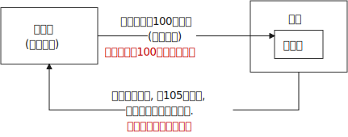

"回购协议"目前是银行(借入)资金的重要来源。这一市场上最重要的贷款人(放贷人), 是大型企业。

|联邦基金(federal funds , fed funds)
|银行
|- 是银行之间的互相贷款. *因为有些银行在美联储的存款余额, 无法达到监管者的要求, 所以它可以向别的银行借入这类贷款*，这个市场, 就叫"联邦基金市场".
- *这种借款所产生的利息, 就叫"联邦基金利率" federal funds rate. 该利率可以反映"银行贷款市场"与"货币政策"的松紧状况:*  +
→ 如果"联邦基金利率"较高，说明银行资金头寸比较紧张; +
→ 如果"联邦基金利率"较低，说明银行的信贷需求较少。

|===

==== 货币市场利率

《华尔街日报》每天在"货币与投资"版的"货币利率"栏目下，都会公布很多金融工具的利率。 其中有 4个利率, 是媒体经常讨论的热点:

[.small]
[options="autowidth"]
|===
|Header 1 |Header 2

|优惠利率 (prime rate) :
|是"企业"从"银行"借入款项的成本.

|联邦基金利率 (federal funds rate) :
|是银行之间, 借款的成本. 即"联邦基金市场"上"隔夜贷款"的利率.

|国库券利率 (Treasury bill rate) :
|美国国库券的利率，能代表"利率"水平变动的总体状况。

|伦敦银行间同业拆借利率 (Libor rate) :
|伦敦市场上, 银行间"美元存款利率"的平均水平。
|===

== 资本市场

==== 资本市场工具

资本市场工具: 是**期限超过一年**的债权工具和股权工具。 +
*资本市场工具价格的波动性, 远远大于货币市场工具，因而投资风险较高。*

[.small]
[options="autowidth" cols="1a,1a,1a,1a,1a,1a,1a"]
|===
|Header 1 |借入钱的人 |借入钱的用途 |放贷人 | 借款期限 | 还款方式(即放贷人能获得的收益) |规模和流动性

|股票 stocks
|公司
|
|
|
|是对公司"净收入"和"资产"的索取权。
|- 每年新发行的股票规模都不大，不到股票市场流通价值的1%。
- 个人所持有的股票大约为50% ，其他股票都被养老基金、互助基金, 和保险公司所持有。

|抵押贷款 mortgages
|家庭或企业
|用于购置房屋、土地, 或者其他建筑物. 这些建筑物或者土地, 即为贷款的抵押品。
| - 有三家政府机构, 运用债券所得购买(即投资于)抵押贷款，从而为抵押贷款市场提供资金(即借此赚取投资本息)。 这三家机构是:  +
→ 联邦国民抵押贷款协会 Federal National Mortgage Association, FNMA ，又称为房利美. Fannie Mae +
→ 政府国民抵押贷款协会 Government National Mortgage Association, GNMA ，又称为吉利美，
Ginnie Mae +
→ 联邦住宅贷款抵押公司 Federal Home Loan Mortgage Corporation,
FHLMC ，又称为房地美， Freddie Mac

- 大部分商业和农场抵押贷款, 是由商业银行和人寿保险公司发放(投资)的。
|
|
|在美国，"抵押贷款市场"是最大的债务市场，居民抵押贷款(用于购置居民住宅)的余额, 是商业与农场抵押贷款的 4倍。

|企业债券
|信用评级非常高的企业
|
|人寿保险公司，养老基金与家庭
|长期债券
|- 通常每年向持有者支付两次利息，债券到期时按面值清偿。
- 可转换债券 : 一些企业债券的持有者, 在到期日之前, 随时可以将其转换为一定数量的股票，这类企业债券被称
为"可转换债券"。如果股票升值幅度足够大，可转换债券的价值也会上升. 如果人们预期该企业能达到这种情况, 则与普通债券相比，"可转换债券"对潜在购买者的吸引力更大. 当然, *随着"可转换债券"的购买价格上升, 发行人可以相应减少利息支付.*
|- 由某个特定的公司发行的"可转换债券", 其"流动性"不如美国政府债券等其他证券。
- 金融市场上流通的"企业债券"的余额, 不到股票的1/5 。虽然"企业债券市场"的规模远不及股票市场，但**每年新发行的企业债券, 远远超过新发行的股票。因此，对于公司的融资决策而言，企业债券市场的走势, 比股票市场更为重要。**

|美国政府证券 U.S. government securities
|美国财政部
|为了弥补联邦政府财政赤字, 而借入钱.
|美联储、银行、家庭, 与外国投资者
|长期债务
|
|在美国，"美国政府证券"是交易最为广泛的债券(每天的交易量一般都超过1000 亿美元) ，因而是**流动性最好**的资本市场工具。

|美国政府机构证券 U.S. government agency securities
|政府国民抵押贷款协会、联邦农业信贷银行, 田纳西河谷管理局等政府机构
|为抵押贷款、农业信贷, 或者发电设备等项目筹资.
|
|长期债券
|许多这类证券, 是由联邦政府担保的。它们的运作方式和持有者, 与"美国政府债券"类似。
|

|州和地方政府债券 state and local government bonds, 又称"市政债券" municipal bonds
|由州和地方政府发行
|为建设学校、公路, 或者其他大型项目筹资
|商业银行的所得税税率比较高，因此是这类证券最大的购买者，市场占有率超过50% 。 +
适用高所得税税率的富人也是十分重要的持有者， +
紧随其后的是保险公司。
|长期债务
|利息可以免缴"联邦所得税"，通常也可以免缴"发行所在州的税目"。
|

|消费者贷款和银行商业贷款 consumer and bank commercial loans
|消费者和企业
|
|银行, 财务公司
|
|
|

|===

《华尔街日报》每天在"货币与投资"版的"债券、利率与收益率" Bond, Rate  & Yields 栏目下, 都会公布许多资本市场工具的利率。其中有5个资本市场工具的利率, 是媒体经常讨论的热点:

[.small]
[options="autowidth" cols="1a,1a"]
|===
|Header 1 |Header 2

|30 年期抵押贷款利率 30-year mortgage :
|由联邦房屋管理局担保的、金额不足41. 7 万美元的, 30 年期固定利率, 居民抵押贷款的利率。

|大额抵押贷款利率 jumbo mortgage :
|向优质客户发放的、金额超过41. 7 万美元的, 30 年期固定利率, 居民抵押贷款的利率。

|5 年可调整利率抵押贷款利率 five-year adjustable mortgage, ARMs :
|向优质客户发放的, 居民抵押贷款**前五年固定的利率， 5年之后利率可以调整。**

|新车贷款 new-car loans:
|4 年期固定利率新车贷款的利率。

|10 年期国债利率 10-year Treasury :
|期限为10 年的美国"国债"的利率。
|===

== 金融市场的国际化

现在, 美国的银行和公司, 更愿意从国际资本市场上筹集所需的资金, 而不愿在美国发放企业债券. 原因是: 之前美国企业被曝光了一系列会计丑闻, 导致国会加强审计监管. 而美国企业遵守这些新法规的成本非常高. 但美国企业如果选择在美国以外的金融市场发行证券，就可以避免这些成本。

== 金融中介机构带来的利益和坏处

.利益:

[.small]
[options="autowidth"]
|===
|Header 1 |Header 2

|降低客户的交易成本
|金融机构的规模经济, 可以降低你的交易成本

|增加客户的资产多样性
|帮助个人实现"资产的多样化"，从而降低了他们所可能遭受的风险。**多样化( diversification) 包括投资于收益变动方向不一致的一系列资产，即资产组合(portfolio) ，进而将总体风险降低到单个资产的风险之下。**(多样化是"*不要将所有的鸡蛋放在一个篮子里*"的另外一种表述。) +
金融中介机构实现这个过程的方式是，将聚集起来的资产组合(打包), 转化为一种新的资产，并将其出售给不同的个人。

|增强流动性
|提供更好的"流动性服务" liquidity services

|资产转换
|金融中介机构所设计和提供的资产品种的风险, 在投资者所能承受的范围之内，然后, 金融中介机构用销售这些资产所获取的资金, 去购买风险大得多的资产。这也是金融中介机构的利润。这个风险分担的过程, 有时也被称
为"资产转换" asset transformation.
|===

.负面作用:

[.small]
[options="autowidth" cols="1a,1a"]
|===
|Header 1 |Header 2

|信息不对称 asymmetric information
|- 逆向选择 adverse selection : 最还不起借款的人, 往往会最积极地寻求贷款.
- 道德风险 moral hazard : 借入钱的人, 去从事不利于放贷人的事情 (比如借入了钱, 却去赌博), 这导致前者最终无法还贷.
|===

== 流动性 liquidity

**流动性 liquidity : 即某一资产, 转化为交易媒介(比如现金)的便利程度和速度。**货币是流动性最高的资产，因为它无须转化为他物, 就可以直接用于购买行为。而其他资产在转化为货币的过程中, 都要支付交易成本 (比如,你想将房产转化为现金, 即出售房屋，可能就必须支付给经纪人佣金, 和向政府缴税)。

在"恶性通货膨胀"时期, 随着交易成本的上扬，我们可以预料到 : 经济社会的总产出将急剧下降。

== 货币总量 monetary aggregate

货币供给, 用什么来计量它呢? 美联储曾数次修改其货币计量方法，最终确定了这个指标 -- 货币总量 monetary aggregate.

.M1 :
美联储公布的最狭义的货币指标, 是 *M1. 它包括流动性最强的资产*，即通货、支票账户存款, 与旅行者支票. *这些资产可以直接作为交易媒介，因此显然属于货币。*

.M2 :
*在 M1 的基础上，货币总量 M2 增加了一些流动性不及 M1 的资产*: 能够签发支票的一些资产 (货币市场存款账户, 和货币市场共同基金份额) ，以及其他能以较小成本迅速转化为现金的资产 (储蓄存款、小额定期存款)。

这两个标准的"货币增长率"走势, 并不完全一致.

== 现值

因为有利息, 或通货膨胀的存在, **一年后你收入的1美元的价值, 不如你现在收入的1美元值钱。**由此就产生了这个概念: "现值" present value (或"现期贴现值" present discounted value).

本金是100美元, 年利率是10%, 则:

- 第1年后, 你的本息收入是 = latexmath:[ 100\left( 1+10\% \right) =110] 元
- 第2年后, 你的本息收入是 = latexmath:[ 100\left( 1+10\% \right) \left( 1+10\% \right) =100\left( 1+10\% \right) ^2=121] 元
- 第n年后, 你的本息收入是 latexmath:[\boxed{= 100\left( 1+\text{利息}i \right) ^{n\text{年}}}]

从下面的时间轴中我们可以看到，今天发放100 美元贷款, 在每年末可以获得的金额:

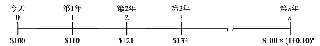

*这个时间轴可以立即告诉我们 : 今天的 100 美元, 与 1 年后的 110 美元是等价的.* 或者说，今天的 100美元相当于2 年后的 121美元、3年后的 133美元, 或 n年后的 latexmath:[ 100\left( 1+0.1 \right) ^n] 美元。这

**这个时间轴还意味着，我们可以从未来的收益, 倒推来算现在的价值。** 例如，3 年后的133 美元，即 latexmath:[ 100\left( 1+i \right) ^3],  相当于今天的 100 美元. 即:

\begin{align*}
\begin{matrix}
\boxed{
	\text{本金现值}\cdot \left( 1+0.1 \right) ^3=133 \\
	\text{本金现值}=\frac{133}{\left( 1+0.1 \right) ^3}=99.9249\text{元}\\
}
\end{matrix}
\end{align*}

*上面这个, 就是计算"未来的收入"在今天的价值，这个过程被称为对"未来值"的"贴现" (discounting the future) 回"今天值"。* 即: latexmath:[ \boxed{\text{现值}PV=\frac{\text{未来值}CF}{\left( 1+\text{利率}i \right) ^{n\text{年}}}}]

.标题
====
[.small]
[options="autowidth" cols="1a,1a"]
|===
|Header 1 |Header 2

|利率 i
|15%

|本金现值PV
|=?

|期限n
|2年

|未来值CF
|$250
|===

latexmath:[ \text{现值}PV=\frac{\text{未来值}CF}{\left( 1+\text{利率}i \right) ^{n\text{年}}}=\frac{$250}{\left( 1+15\% \right) ^2}= $189.036 ]

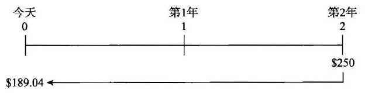

====

==== excel中, 计算"未来值"和"现值" 的公式

[.small]
[options="autowidth" cols="1a,1a"]
|===
|Header 1 |Header 2

|计算"未来值": FV（rate,nper,pmt,pv,tvpe)
|FV函数是基于固定利率及等额分期付款方式计算某项投资在未来的某个日期的价值，即未来值的函数。

- rate:利率，年利率，月利率（根据要计算的定）
- nper：总投资期，月期，年期
- pmt:投资或贷款各期支付的金额。（每一期）
- pv:期初价值（省略为0）
- type:付款的时间类型（1为期初，0为期末付款）

注：rate和nper的单位必须统一，即月利率对应月投资期

|求现值 : PV（rate,nper,pmt,fv,type）
|Pv函数用来计算某项投资的现值现值就是未来各期年金现在价值的总和，如果投资回收的当前价值大于投资的价值，则这项投资是有收益的。

rate:利率，年利率，月利率（根据要计算的定）

nper：总投资期，月期，年期

pmt:投资或贷款各期支付的金额。（每一期）

pv:未来值（投资的未来指或者最后一次收支后希望得到的现金余额）

type:付款的（时间）类型（1为期初，0为期末付款）

注：单位必须统一，即月利率对应月投资期

|求每期付款额 PMT（rate,nper,pv,fv,type）
|Pmc函数是基于固定利率及等额分期付款方式，根据贷款利率,定期付款和贷款金额返回投资或贷款的每期付款额。

rate:利率，年利率，月利率（根据要计算的定）

nper：总投资期，月期，年期

pv:现值（本金）

fv：未来的收益值

type:付款的时间类型（1为期初，0为期末付款）

注：rate和nper的单位必须统一，即月利率对应月投资期

|贷款方案计算
|等额本金还款：还款期内把贷款数总额等分，每月偿还同等数额的本金和剩余贷款在该月所产生的利息。

等额本息还款：把贷款中的本金总额与利息总额相加，然后平均分摊到还款期限的每个月中。

（一）等额本息分期还款计算

PPMT（rate,per,nper,pv,fv,type）

PPMt函数是基于固定利率及等额分期付款方式，返回投资在某一给定期间内的本金偿还额。

参数per适用于计算其本金数额的期数，必须介于1到nper之间。

FVSCHEDULE（principal,schedule）

Fvschedule函数用于计算某项投资在变动利率或可调利率下的未来值。

注：参数principal为投资或贷款的期初价值参数，schedule为例，绿树组通常为变动利率单元格区域。

（二）等额本息还款期数计算

Nper（rate,pmt,pv,fv,type）

NPER函数指定定期定额支付，且利率固定的年金总期数。

rate:利率，年利率，月利率（根据要计算的定）

pmt:投资或贷款各期支付的金额。（每一期）

pv:现值

fv:未来值

type:还款的类型（省略为期末付款）

（三）贷款利率计算

Rate

Rate函数用于计算投资或贷款的各期利率可以计算，连续分期，等额投资或贷款的利率也可以计算一次性偿还的投资或贷款利率。

Rate（nper,pmt,pv,fv,type,guess）

nper：还款期限（期数）

pmt:各期支付的金额。（每一期）

pv:现值

fv:未来值

type:还款的时间类型（省略为期末还款）

guess:预期的利率（如果省略，则该值为10%）

注：rate和nper的单位必须统一，即月利率对应月投资期
|===

.标题
====
你中奖2000万美元, 在未来20年中, 每年给你100万美元. 问, 这笔钱最终的"现值"是多少?

====

根据偿付时间安排的不同，可以分成4种:

[.small]
[options="autowidth" cols="1a,1a,1a,1a,1a,1a"]
|===
|Header 1 |第1年还 |第2年还 | ... |最后一年还| 例如

|1.普通贷款 simple loan
|
|
|
| 直接归还本金和利息
|对企业发放的商业贷款

|2.固定支付贷款 fixed-payment loan  +
/ 分期偿还贷款 fully amortized
loan
|归还一部分固定金额的本息
|归还一部分固定金额的本息
|...
|归还一部分固定金额的本息
|例如，如果你借款的金额为1 000 美元，"固定支付贷款"可能要求你在25 年中，每年偿还126 美元。 +

"分期贷款"(例如汽车贷款)与"抵押贷款", 通常都属于这种类型。

|3.息票债券 coupon bond
|归还当期利息
|归还当期利息
|...
|归还事先规定的最终金额(债券面值， face value, par value)
|例如，10 年期面值为1 000 美元的息票债券，可能每年向持有人支付100 美元的息票利息 ("息票利率"就等于100 美元/1 000 美元=0.10 ，或10% )，到期日时再向持有人偿还1000 美元的面值。(债券的面值通常都为1 000 美元的倍数。)

美国联邦政府发行的"长期国债"与"中期国债", 以及"企业债券", 都属于"息票债券"。

|4.贴现发行债券 discount bond;  +
又称零息债券， zero-coupon bond
|
|
|
|
|这种债券的购买价格, 低于其面值(贴现发行) ，到期时按照面值偿付 (中间的差值即支付给你的利息)。与息票债券不同，贴现发行债券没有任何利息，发行人只需偿还债券面值。 +
例如，面值为1000 美元的贴现发行债券, 可能只需900 美元就可以买到， 1 年后, 债券持有人将会被偿付1 000 美元
的面值。

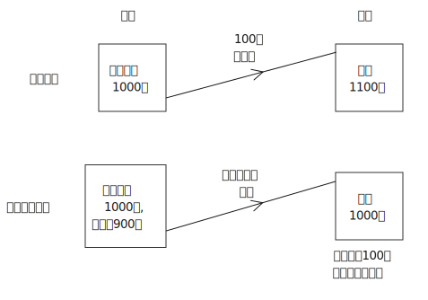

美国联邦政府"国库券"、"储蓄债券"与"长期零息债券", 都属于"贴现发行债券"。
|===

总结:

- "普通贷款"与"贴现发行债券", 仅在到期日偿付.
- "固定支付贷款(分期偿还贷款)"与"息票债券", 则在到期日前定期清偿。

**如何判断上面哪种方式能够向投资人(放贷者)提供更多的收入(投资回报率)? 就要借助"现值"的工具.**

== 到期收益率 YTM

计算利息率的方式有很多, 最重要的是"到期收益率" yield to maturity. 到期收益率（YTM）是指在债券持有至到期的情况下, 预期的总（年化）回报。

我们来分别计算上面4种放贷方式的"到期收益率"值.

==== "普通贷款"的"到期收益率"

放贷人放出100美元, 要求借入钱的人 1年后归还110美元. 对放贷人来说, 这笔贷款的"到期收益率"是多少? +
根据 :  latexmath:[ \text{现值}PV\cdot \left( 1+\text{利率}i \right) ^{n\text{年}}=\text{未来值}CF]

则有:
\begin{align*}
\begin{matrix}
	\left( 1+\text{利率}i \right) ^{n\text{年}}=\frac{\text{未来值}CF}{\text{现值}PV}\\
	1+\text{利率}i=\sqrt[^{n\text{年}}]{\frac{\text{未来值}CF}{\text{现值}PV}}\\
	\text{利率}i=\sqrt[^{n\text{年}}]{\frac{\text{未来值}CF}{\text{现值}PV}}-1\\
	i=\sqrt[1]{\frac{110}{100}}-1=0.1=10\%\\
\end{matrix}
\end{align*}

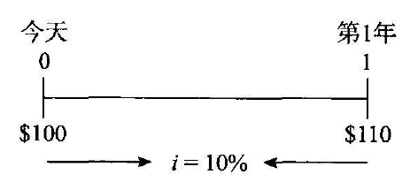

对于普通贷款而言，"单利率"就等于"到期收益率"。i 既表示"单利率"，又表示"到期收益率"。

'''

==== "固定支付贷款"的"到期收益率"

这种贷款在整个期限内的每个阶段, 要偿付相同的金额。以"固定利率抵押贷款"为例，借款人每月向银行偿付固定的金额，到期日时即可全部清偿。 +
由于固定支付贷款, 涉及的不止是一次支付的款项，因此其现值, 应当等于"所有未来支付的现值"之和.

如, 你作为放贷人(即你是投资者)现在投资 1 000 美元(借出去1000美元)，在未来的25 年中每年能回收126美元 (即借入钱的人, 每年归还你126美元)。那么你这笔投资的"到期收益率"是多少呢? **换言之, 我们先来算一算, 你"未来25年回收回来的钱的总数"的现值, 有没有大于你现在投资的这1000元? 如果大于, 则你就有净收益, 你的投资回报率就是正数的.**

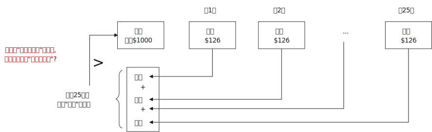

但要算你未来回报的现值, 是否大于你现在的投资额, 就必须现知道利率才行, 而利率现在却是未知数, 反而是我们要求的. 所以, *我们就让未来的现值, 等于现在的投资额, 来算当你不赚不亏时, 你这笔投资的利率是多少了.*

latexmath:[ \$1000=1000\cdot \frac{\$126}{\left( 1+i \right) ^1}+\frac{\$126}{\left( 1+i \right) ^2} + ... + \frac{\$126}{\left( 1+i \right) ^{25}}]

所以, 我们就总结出这个公式了 : 对于任何固定支付贷款，有 :

latexmath:[\boxed{
\text{当前投资}LV=\frac{\text{每年固定的收回}FP}{\left( 1+i \right) ^1} +\frac{FP}{\left( 1+i \right) ^2} + ... + \frac{FP}{\left( 1+i \right) ^n}
} ]

只要求出这个公式中的 "利率i", 就是你这笔投资的"投资回报率" (到期收益率).

.标题
====
例如，你是借入钱的人, 借入1000美元, 25年期贷款, 年偿付额为85.81 美元. 则你可以算出, 对于放贷款给你的投资人来说, 他的"到期收益率"是 (用 excel 的 rate() 函数来算计) :

RATE(nper, pmt, pv, [fv], [type], [guess]) +
前三个必备参数是:

- nper : 你还款的期数. 比如你贷款了25年.
- *pmt : 你各期要支付出去的金额, 从你(还款人)的财务角度来说, 钱从你口袋中归还出去(流出去), 就是个负数.* 比如你每年要还款 85.81美元.
- pv : 你借入的钱的现值. 比如你一开始借入了 1000美元.

即: #利率 = RATE(还款期数, 每期要还的钱数, 贷款总额)#

则, 这笔钱的利率就是 =RATE(25, -85.81, 1000) = 0.07 , 即 7%.
====

.标题
====
你从银行借入10万元, 贷款利率是7%, 20年还贷完.  则每年要还多少钱?

**每年要还的钱, 就是求出下面公式中的 FP 即可 (注意: 下面的公式, 是站在投资人的立场, 而不是站在借入钱的人的立场. 所以下面公式中的FP, 是投资人每期可以收回的钱数额): ** +

latexmath:[ \text{当前投资}LV=\frac{\text{每年固定的收回}FP}{\left( 1+i \right) ^1}+\frac{FP}{\left( 1+i \right) ^2}+...+\frac{FP}{\left( 1+i \right) ^n}]

latexmath:[ \$10\text{万}=\frac{FP}{\left( 1+0.07 \right) ^1}+\frac{FP}{\left( 1+0.07 \right) ^2} + ... + \frac{FP}{\left( 1+0.07 \right) ^{20}}]

在excel中, 我们要用 pmt()函数来做, 可以算出"等额本息贷款"的"每期还款额". +
PMT(rate, nper, pv, [fv], [type])  ← 注意, 这个函数, 是站在"借入钱的人"的角度来看的. +
即: #每期要还的钱 = PMT(每期利率, 贷款期数, 贷款额 )#

=PMT(0.07, 20, 100000)= $9439.29

所以对于本例, 每年固定偿付额(FP) 是 9 439.29 美元。
====

'''

==== "息票债券"的"到期收益率"

面值为 1 000 美元、还有 10年到期、每年"息票利息"为100 美元(即是 10% 的息票利率)的债券，其"现值"计算方法如下:

\begin{align*}
 \underset{\text{债券的现价}}{\underbrace{\text{现值}P}}=\frac{\$100}{\left( 1+i \right) ^1}+\frac{\$100}{\left( 1+i \right) ^2}\ +\ ...\ +\frac{\$100}{\left( 1+i \right) ^{10}} +\frac{\$1000}{\left( 1+i \right) ^{10}}\
\end{align*}

更一般地，对于任何息票债券, 其现值P 的公式即:

\begin{align*}
\boxed{
\underset{\text{债券的现价}}{\underbrace{\text{现值}P}}=\frac{\text{每年的息票利息}C}{\left( 1+i \right) ^1}+\frac{C}{\left( 1+i \right) ^2}\ +\ ...\ +\frac{C}{\left( 1+i \right) ^n} +\frac{\text{债券的面值}F}{\left( 1+i \right) ^n}\
}
\end{align*}

其中 :

- P 为债券的现价
- C 为每年的息票利息
- F 为债券的面值
- n 为距到期日的年数

*其实, 这个债券的现值公式, 就相当于 : 你(作为投资人) 将 1000 美元存入银行账户，利率为10% ，那么你每年都可以取出100 美元的利息，第 10年末, 你的账户余额依然有1 000 美元的本金 (你每年提取的只是当年的全部利息部分, 而没动本金, 本金额永远躺在你的账户中)。*

用excel 来做的话, 求 P, 要用 PV(rate, nper, pmt, [fv], [type]) 函数 :

即: #未来收益的现值 = PV(每期利率, 还款期数, 每期的还款金额, fv在最后一次付款后希望得到的现金余额)#

.标题
====
面值为 1 000 美元、还有10 年到期、每年息票利息为100 美元(即 是 10% 的息票利
率)的债券，该债券的"现值"是多少? (答案是 889.2美元)
====

从这个债券的现值公式中,
\begin{align*}
\boxed{
\underset{\text{债券的现价}}{\underbrace{\text{现值}P}}=\frac{\text{每年的息票利息}C}{\left( 1+i \right) ^1}+\frac{C}{\left( 1+i \right) ^2}\ +\ ...\ +\frac{C}{\left( 1+i \right) ^n} +\frac{\text{债券的面值}F}{\left( 1+i \right) ^n}\
}
\end{align*}

我们可以发现这些规律 :

[.small]
[options="autowidth" cols="1a,1a"]
|===
|Header 1 |Header 2

|1."到期收益率 i" 与 "债券的现值价格 P" 负向相关.
|- *当 "到期收益率i" 上升时，即每一个分母变大, 则分数值(即现值P) 必定变小. 即, "收益率i" 与 "债券的现值P" 是反向变化关系 (负向相关).* 到"期收益率"表示的利率的上升, 就意味着"债券当前价格"的下跌.  +
*你还可以这样更直观的理解: 利率越高, 则未来的息票利息, 与最终偿付的款项, 它们所"折现"回现在的价值 (即现值) 就越少. 因此，债券的现在价格(现值) 必然就更低。*

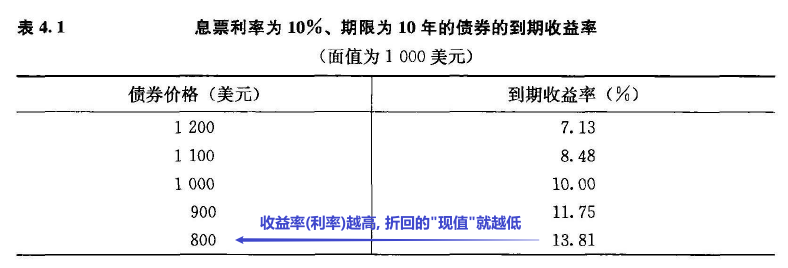

|2.当债券的现值价格P, 低于其面值时，就意味着其"到期收益率 i" 是高于"息票的利率"。
|正因为对方给你的实际收益率 i, 高于明面上写的息票利率, 所以, 对方必须压低债券的现值价格, 才能保证他不多付给你利息额.

比如, 债券现值100元, 息票利息 10%, 他付给你的就是 latexmath:[ 100 \cdot 10\% = 10 ] 元利息. +
如果"收到收益率i" 大于 "息票利息(10%)", 变成12% 了, 则对方为了不增加自己的付息额, 必须将债券的现值压低成 83.33元, 才能保持支付给你的利息额依然在10元.

\begin{align*}
\begin{matrix}
	p \cdot 12\%= $10\\
	p =\frac{10}{12\%}= $83.3333\\
\end{matrix}
\end{align*}

|3.如果"息票债券的现值价格 P"等于其面值，则就意味着其"到期收益率 i" 就等于"息票利率" 的。
|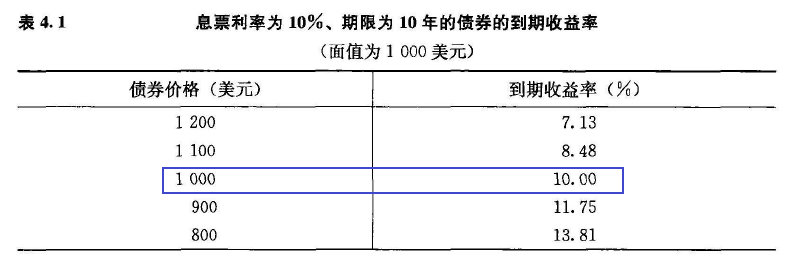

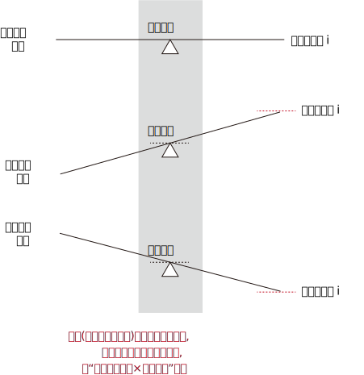
|===

'''

==== 永续债券 perpetuity

即借入钱的人, 永远只支付给你每期利息, 而不归还你"你放贷给他的本金". 换个角度理解, 就相当于你把钱永远存在银行, 永远拿利息, 而不提取出本金一样.

对于这种"永续债券"的"现值价格"计算, 可以用下面的公式:
latexmath:[ \boxed{
\text{价格现值}P_c=\frac{\text{年息票利息}C}{\text{到期收益率}i_c}
}]

.标题
====
上面这个公式的数学推导, 是这样的:

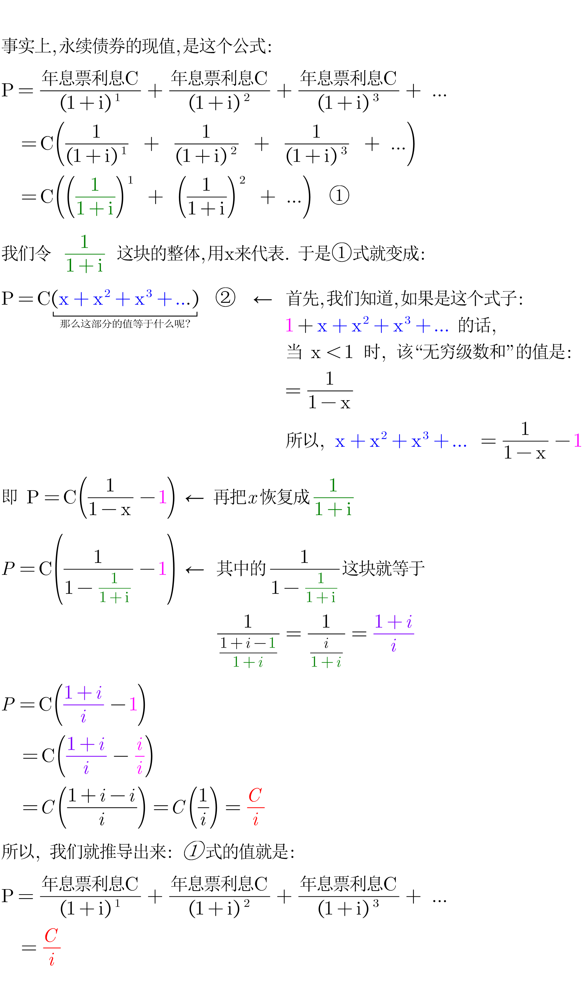
====

例如, 某永续债券, 永远是每年支付 100 美元的利息，利率是10% ，那么它的现值价格P 就是 latexmath:[ =\frac{\$100}{10\%}=\$1000]

同样, 你从公式中就能发现: 当分母 latexmath:[ i_c] 变大时, 分数值 latexmath:[ P_c] 就会变小 (即债券价格的现值就会下跌).

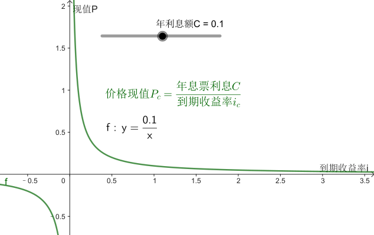

实际上, 我们可以将这个公式变换成 : latexmath:[ \boxed{\text{到期收益率}i_c=\frac{\text{年息票利息}C}{\text{价格现值}P_c}}]

.标题
====
如果"永续债券"的价格为2000 美元，永久地每年支付100 美元利息，它的到期收益率i 是多少?

根据它的现值计算公式 :    +
latexmath:[ \text{到期收益率}i_c=\frac{\text{年息票利息}C}{\text{价格现值}P_c}=\frac{\$100}{\$2000}=0.05=5\%]

====

这个公式: latexmath:[ P=\frac{\text{年息票利息C}}{\left( 1+\text{i} \right) ^1} + \frac{\text{年息票利息C}}{\left( 1+\text{i} \right) ^2} + \frac{\text{年息票利息C}}{\left( 1+\text{i} \right) ^3}+\ ... =\frac{C}{i}] +
不仅可以计算"永续债券"的"到期收益率"，而且还可以近似地计算 很长时间才能到期的"息票债券"的"到期收益率"。因为如果"息票债券"还有很长时间到期 (譬如说20 年或者更长) ，则未来20 多年以后的现金流 (本金?), "折现"成今天的价值, 就很低了, 它们的现值, 就与"永续债券"的现值十分相像了.

'''

==== "贴现发行债券"的"到期收益率"

其计算类似于普通贷款。

例如, 某面值1000美元的美国国库券, 现在卖出价格是900美元,  1年期, 到期后美国政府会偿付你 其1000美元的面值. 这个国库券的"到期收益率"是多少?

\begin{align*}
	900\cdot \left( 1+i \right) ^1=1000\\
	1+i=\frac{1000}{900}\\
	i=\frac{10}{9}-1=0.111111
\end{align*}

即 到期收益率i = 11.11%

更一般地，对于任何 1年期的贴现发行债券，其到期收益率都可以写成 :
latexmath:[ i = \frac{F-P} {P}] +
其中， F 为贴现发行债券的"面值"; P 为贴现发行债券的"现价"。

'''

== 回报率 return rate = 本金盈亏率 + 利息盈亏率

任何债券投资的回报率 : +
latexmath:[\boxed{回报率 =\frac{债券价格的正负变动盈亏+利息收入}{最初你购买该债券时的价格}}]

比如, 面值为1000 美元、息票利率为10% 、购买价格为1000 美元、持有1 年后以1200 美元出售的息票债券, 其回报率是 : +
latexmath:[ =\dfrac{\overset{1200-1000=200}{\overbrace{债券价格的正负变动盈亏}}+\overset{1000\cdot 10\%=100}{\overbrace{利息收入}}}{最\underset{=1000}{\underbrace{初你购买该债券时的价格}}}=\frac{200+100}{1000}=0.3]

这个例子说明, *你从债券上得到的"回报率", 并不一定等于该债券的"到期收益率"。因为"回报率"还算入了你"本金"的盈亏程度.*

用公式表示就是: 从"时间t" 到"时间 t+1" ，持有一种债券的"回报率"可以表示为 : +
latexmath:[ \boxed{
\underset{从时间\ t\ 到\ t-1,\ 你得到的回报率}{\underbrace{回报率\text{R}}}=\frac{\left( \overset{时间\ t+1\ 时的债券价格}{\overbrace{P_{t+1}}}-\overset{时间\ t\ 时的债券价格}{\overbrace{P_t}} \right) +\overset{息票利息}{\overbrace{C}}}{P_t}
}]

上面的公式, 可以拆分成下面这两块: +
stem:[R=\underset{这块整体,\ 就是\ i_c}{\underbrace{\frac{P_{t+1}-P_t}{P_t}}}+\underset{这块整体,是g\}{\underbrace{\frac{C}{P_t}}}]

其中 :

- latexmath:[ \frac{P_{t+1}-P_t}{P_t}] 这块, 即你卖出该债券时, 相比于你最初买入它时, 该债券价格的盈亏程度. 相当于你先买房, n年后卖房时, 你的房产有没有升值还是贬值? 这块内容也叫"资本利得率 rate of capital gain".
- latexmath:[ \frac{C}{P_t}] 这块内容就是"当期收益率i". 即"息票利息"除以"你最初购买该债券时, 该债券的价格".

即: latexmath:[ R = i_c + g]  ← 这个公式表明, *债券的回报率 Return, 等于"当期收益率 latexmath:[ i_c]" 与"资本利得率g" 之和。*

所以, 对于有些债券而言，虽然"当期收益率" latexmath:[ i_c] 可以很准确地度量"到期收益率 i"，但"回报率"仍然可能与"利率"存在很大的差别。尤其是当债券价格剧烈波动时 (会引起较大的资本利得或损失). +
举个例子, 你买个房子, 用来出租, 虽然每月租金收入上可以稳定, 但你n年后卖出这套房时, 如果房价下跌, 你依然会遭遇房价(相当于本金)上的损失.

*利率的上升, 就意味着债券回报率的下降. 因为利率的上升, 会使债券的"现值"价格下降, 这意味着你"本金"的损失(房价下跌了, 你买的股票股价下跌了). 你之后再卖出它时, 就会有本金损失.* 如果你不卖出这些债券, 你的损失就属于"账面损失". 但依然属于损失，因为如果你当初不购买这些债券，而是将钱存放在银行，那么你现在就能以较低的价格, 购进比先前多得多的债券。

.标题
====
从下表中, 我们可以看到: 还有30 年到期的债券，当利率从10%上升到20% 时，资本损失(即本金损失, 房价损失, 股价损失) 会高达49.7% 。这个 损失太大了，它已经超过了"当期收益率"10% ，因而导致了 -39.7% 的负回报率(损失)

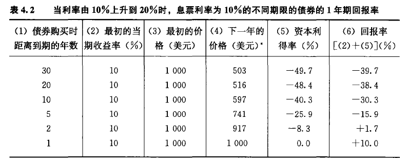
====

==== 利率风险, 导致"长期债券"的投资风险相当大.

*期限越长的债券，其价格波动, 受"利率"影响的程度就越大。 所以, "长期债券"的价格和回报率的波动性, 比"短期债券"大。* 对于距离"到期日"还有20年以上的债券，每年价格与回报率的波动幅度, 在 -20%~+20% 之间的情况, 十分常见。

利率的变动, 导致长期债券的投资风险相当大。因此, 我们用专门的术语一一"利率风险" interest rate risk 来描述它. 控制"利率风险", 是金融机构的经理和投资者, 经常需要关注的事情。

'''

== 实际利率  & 名义利率

==== 名义利率 = 实际利率 + 通胀率

[.small]
[options="autowidth" cols="1a,1a"]
|===
|Header 1 |Header 2

|名义利率 nominal interest rate
|没有考虑"通货膨胀"因素

|实际利率 real interest rate (事前) :
|该利率根据"**预期**物价水平"的变动(即"通货膨胀")做出调整，因此能够更准确地反映真实借款成本。 因此更准确地讲，应当称之为"事前实际利率" ex ante real interest rate.  +
当经济学家谈及"实际"利率时，往往指的是这种"实际利率"。

|实际利率 (事后) ex post real interest rate :
|根据**实际**价格水平变动, 调整的利率, 称为"事后实际利率". 它表示"事后"以"不变价"来衡量的投资者的效益。
|===

.标题
====
ante /ˈæntɪ/ +
-> 来自拉丁语ante("before")

1.N-SING In card games such as poker, the ante is the sum of money staked by the players before the cards are dealt. (扑克等牌类游戏中的) 底注

2.PHRASE If you *up the ante* or *raise the ante*, you increase your demands when you are in dispute or fighting for something. (在争斗中) 加高要求

- Whenever they reached their goal, they *upped the ante*, setting increasingly complex challenges for themselves.  每当他们达到了目标，他们就加高要求，为他们自己设置越来越复杂的挑战。
====

实际利率, 由"费雪 Fisher 方程式"给出 : 名义利率 i = 实际利率 latexmath:[ i_r] + 预期通货膨胀率 latexmath:[ π^e ].  即 :
\begin{align*}
\boxed{
\begin{matrix}
	名义利率\ i\ =\ 实际利率\ i_r+\ 预期通货膨胀率\ \pi ^e\\
	实际利率\ i_r=名义利率\ i\ -\ 预期通货膨胀率\ \pi ^e\\
\end{matrix}
}
\end{align*}

"费雪方程式"更为准确的表述, 其实是:   +
latexmath:[名利\ i\ =\ \left( 实利\ i_r\ +\ 通胀\ \pi ^e \right) \ +\ \left( 实利\ i_r×通胀\ \pi ^e \right)  ]

比如, 你是银行老板, 你放贷了1年期, 利率为 i=5% 的贷款, 但你预期这1年中, 通胀率(latexmath:[ π^e])会有3%. 则你年末得到的实际收益率(latexmath:[ i_r]), 其实就只是 5% - 3%=2%.

如果在 1年中，名义利率为8% ，预期的通货膨胀率为10% ，则实际利率是多少? 8% - 10% = -2%

所以, 通胀能抵消掉"借入钱的人"的还款压力. +
所以, 实际利率反映了真实的借款成本，只有实际利率, 才是反映"借款动力"和"贷款动力"的良好的指示器。

注意: 美国的大部分收入都需要先缴税. 比如你在债券上赚了10%, 但美国税法规定利息收入的30%要上缴. 所以你税后实际得到的, 只有 10% - (10% × 30%上缴) = 10% - 3%  = 7% . 如果此时还有5%的通胀存在的话, 你实际得到收益率, 只有 : 7%税后名义收益率 - 5%通胀率= 2%实际收益率. +
所以, "税后实际利率"可以表示为 : latexmath:[ \boxed{
税后的实利 \ i_r=i \left( 1-所得税税率r \right) -预期通货膨胀率\ \pi ^e }]

*因为有缴税的存在, 所以,"税后实际利率" 总是低于"费雪方程式定义的实际利率".*

指数化证券, 它们的利息与本金支付, 会随物价水平变动而调整，所以这些债券的利率直接反映了实际利率。这样, 从非指数化债券的"名义利率"中, 扣除指数化债券的利率(实际利率)，就可以知道"预期通货膨胀率"了.  +
例如， 2009 年2 月27 日， 10 年期"国债"的利率为3.02% ，而10 年期"保值贴补债券"的利率为2.06% 。*两个利率之间的差额 0.96% 就反映了之后10年的"预期通货膨胀率"。*  +
许多商业银行和投资银行, 都**根据这些债券的利率，定期公布美国的"预期通货膨胀率"。**

==== 名义利率和实际利率, 通常不是同向变动的。

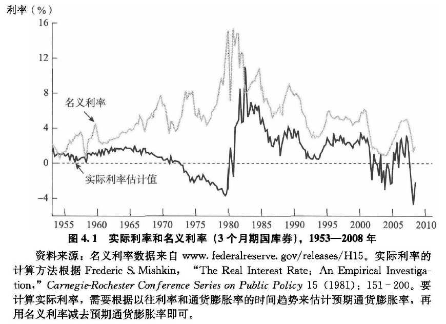

对与任何投资, 你肯定会关注以下几点:
[.small]
[options="autowidth" cols="1a,1a"]
|===
|Header 1 |Header 2

|"预期回报率"高低如何?
|比如, 某投资A, 其回报率有一半的概率是能达到15%, 有一半的概率是只有5%. 则其预期回报率(你可以将其理解为平均回报率) 就是 : latexmath:[ =0.5\cdot 15\%+0.5\cdot 5\%=0.1], 即 10%.

|"风险"大小的稳定性如何?
|比如, *上面的例子, 投资A的预期回报率虽然是10%, 但这是长期中才能达到这个值(大数定律 : 在试验不变的条件下，重复试验多次，随机事件的频率近似于它的概率), 而短期中就并不稳定. 即回报率具有不确定性. +
如果有另一个投资B, 它能保证你有安全的10%固定回报率. 那显然投资B的风险低于A的风险.*

|"流动性"高低如何?
|一种资产以较低成本转化为现金的速度, 就是"流动性". +
如果交易该资产的市场, 具有广度和深度，即市场中有很多卖方和买方，这种资产就具备了流动性。
|===

== 债券需求曲线 demand curve

在其他经济变量(例如收入、其他资产的预期回报率、风险和流动性)不变的情况下，债券的"预期回报率"越高，其需求数量也就越大。*在其他变量不变的情况下，债券的价格越低，其需求数量就越大。*

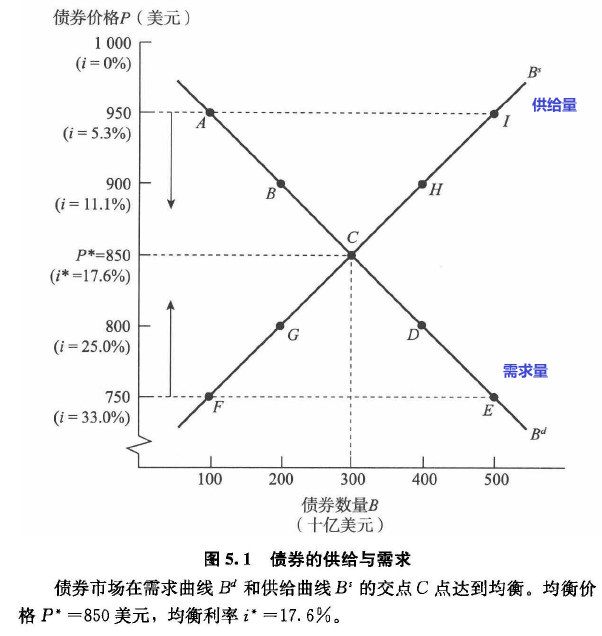

上图:
[.small]
[options="autowidth" cols="1a,1a"]
|===
|Header 1 |Header 2

|供给曲线
|- F 点表明，当债券价格为750 美元(利率为33.3%) 时，债券的供给数量为1000亿美元。
- 如果债券价格上升到800 美元，此时对应着较低的利率25% ，由于**低利率意味着通过发行债券来筹资的成本降低，企业会更愿意通过发行债券, 来借入更多的资金，于是，债券的供给数量达到一个较高的水平**，即2 000 亿美元(G 点)。
- 更高的价格 850美元 对应着更低的利率17.6% ，导致债券供给数量进一步增至3000亿美元(C 点)。
- 当债券价格高达900 美元甚至950 美元时，债券供给数量也继续增加(H 点和I 点)。

*连接上述点的 B'曲线，即为债券的"供给曲线". 它与其他供给曲线一样，是向上倾斜的，表明在其他条件不变的情况下，随着债券价格的上升，供给数量也随之增加。*

|需求曲线
|应当注意的是，我们的分析表明**"需求曲线"是向下倾斜的，但这并不意味着它是一条直线。**为了分析简便，我们将"需求曲线"和"供给曲线"都绘制为直线。
|===

在经济学中，在给定价格上，当人们愿意购买(需求)的数量, 与人们愿意出售
(供给)的数量相等时，就实现了"市场均衡"(market equilibrium) 。在债券市场上，
当债券的供给数量, 与债券的需求数量相等时，就实现了市场均衡，即 : latexmath:[ B^d = B^s].

在上图 5.1 中，"市场均衡"出现在 C点. 此时，债券的供给曲线与需求曲线相交，该点代表的债券价格为 850美元(利率为17.6%) ，债券数量为3 000 亿美元。 +
*在价格 latexmath:[P^* =850] 美元处，债券需求数量与供给数量相等，因此这一价格被称为"均衡价格", 或"市场出清价格".  +
同样，对应于该价格的利率 latexmath:[ i^* =17.6\%] 被称为"均衡利率", 或"市场出清利率"。*

[.small]
[options="autowidth" cols="1a,1a"]
|===
|债券价格 > 均衡价格 时 |债券价格 < 均衡价格 时

|我们可以观察图 5.1 中"债券价格"高于"均衡价格"时的情况 : 当债券价格被定得过高时，比如说 950 美元， I点所表示的债券供给数量, 远远大于 A点所表示的债券需求数量。债券"供给量"超过其"需求量"的情况, 被称为"超额供给" (excess supply) 。**由于人们希望出售的债券数量, 大于人们愿意购买的数量，所以债券价格将会下跌。** 这就是图5.1 中在950 美元的价格水平上标有向下箭头的原因。 +
只要债券价格高于均衡价格，债券市场的"超额供给"就仍然存在，价格也就会继续下降。*这个过程直到债券价格, 达到其 850美元的均衡水平时才会停止，此时，债券的超额供给已经消失。*
|下面我们来分析"债券价格"低于其"均衡水平"的情况。如果债券价格被定得过低，比如说 750美元， E 点所代表的需求数量, 大于F 点代表的供给数量。这种情况被称为"*超额需求*"(excess demand) 。现在，人们希望购买的债券数量, 超过了他们愿意出售的数量，**从而推动债券价格上升。**这就是图5.1 中在750 美元的价格水平上, 标有向上箭头的原因。*只有当价格上升到 850美元的均衡水平时，对债券的"超额需求"才会消失，价格也停止其向上运动的趋势。*
|===

可见，**"均衡价格"的概念非常有用，它揭示了市场将会稳定于何处。**由于在图5.1 中，**纵轴上的每个价格都对应着特定的利率值，所以该图还反映了利率有向17.6% 的均衡利率运动的趋势。** +
→ 当利率低于其均衡水平时，比如在5.3% 处，债券的价格高于均衡价格，就会存在债券的"超额供给"现象，导致债券的价格下跌，从而推动利率向其均衡水平上升。 +
→ 同样，当利率高于其均衡水平，比如在33.3% 处，就会存在债券的"超额需求"现象，导致债券的价格上升，从而推动利率 返回到其均衡水平17.6% 。

图5.1 是传统意义上的供求图(模型)，**纵轴表示价格，横轴表示数量。由于纵轴上还表示了与价格对应的"债券利率"，故该图也反映了"均衡利率"，为我们探讨利率决定理论, 提供了模型.*

这里我们所进行的分析, 有一个重要特征: 即**供给和需求, 通常指的是资产的"存量"(给定时点上的数量) ，而非"流量"。**用于理解金融市场行为的"资产市场方法" asset market approach, 强调"*决定资产价格的是资产存量，而非流量*"，目前，这是经济学家所使用的主要方法，*原因在于使用"流量"概念进行正确分析, 是十分困难的，尤其在面临"通货膨胀"的情况下更是如此。*

下面，*我们将利用"债券的供求"理论, 来分析"利率"变动的原因。*

*注意: 下面两个动作, 即"沿着曲线移动", 与 "曲线自身整体位移", 是不同的.*

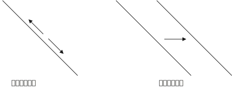

[.small]
[options="autowidth" cols="1a,1a"]
|===
|Header 1 |原因

|沿着曲线移动 :
|**由"债券价格"(或"利率")的变动, 引起**的需求(或供给)量的变化, 即为"沿需求(或供给)曲线移动". +
例如，在图5.1 中，当我们从 A点移到 B点, 再到 C点时，需求量的变动, 就为"沿需求曲线移动"。

|曲线自身整体位移 :
|在每一给定的"债券价格"(或"利率")水平上，*由债券价格和利率以外的"其他因素"(比如, "预期通货膨胀率"和"财富"等变量的变动) 的变化, 所引起的需求量的变动，即为"需求曲线的位移"。* 当任何一种"其他因素"发生变化，引起需求或供给曲线的位移，*就会形成一个新的"均衡利率"水平。*
|===

'''

==== 债券"需求曲线"的"位移"

有4个因素, 会引起债券需求曲线的"位移" :

1. 民众手里的财富。
2. 债券相对于其他替代性资产的"预期回报率"。
3. 债券相对于其他替代性资产的"风险"。
4. 债券相对于其他替代性资产的"流动性"。

[.small]
[options="autowidth" cols="1a,1a,1a,1a"]
|===
|变量 |变量的变动 |在任一给定债券价格上, 需求量的变动 |需求曲线的位移

|民众手里的财富
|↑ +
民众手里财富的增加, 会导致对债券的"需求量"增加. 令需求曲线整体向右"位移". +

另一个因素是公众的"储蓄偏好":

- 储蓄增加, 债券需求曲线会"向右位移".
- 储蓄减少, 对债券的需求量会下降, 债券需求曲线就"向左位移".

|↑
|

|预期利率
|↑

- 对于1 年期贴现发行债券, 与1年的持有期，该债券的"预期回报率"与"债券利率"相等，因此只有当前的利率水平会影响预期回报率。
- *如果债券的"到期期限"长于1 年，该债券的"预期回报率", 就会与"债券利率"产生差异。* 例如，我们在表4.2 中已经看到，长期债券的"利率", 从10%上升到20% ，会导致债券价格大幅下跌, 与负回报率的出现。 +
*因此, 如果你认为利率在未来会上升, 这就会降低你长期债券的"预期回报率"，减少对该债券的需求，引起需求曲线"向左位移"。*

|↓
|

|预期通货膨胀率
|↑ +
"预期通货膨胀率"的变化, 会影响住宅等有形资产(又称为不动产)的预期回报率，进而影响对债券的需求。(因为房产和债券是竞争性投资品种).

- 高通胀 -> 导致央行提高利率(来抑制通胀) ->  市场利率越高，债券价格越低.
- 高通胀 -> 对固定票息率的债券来说，未来现金流是固定的。高通胀会侵蚀债券未来现金流的购买力。 -> 导致债券的吸引力下降.
- 高通胀 -> 由于**作为"固定收益"产品的债券**吸引力下降，人们往往会将投资转移到回报更高，更加耐通胀的市场上，包括股票，贵金属等. -> 导致债券的吸引力下降.

|↓
|

|债券相对于其他资产的"风险"
|↑
|↓
|

|债券相对于其他资产的"流动性"
|↑
|↑
|

|===

上表中仅讨论了各种变量"上升"时的情况。变量"下降"对需求量的影响方向, 则与上表图中的情况正好相反。

'''

==== 债券"供给曲线"的"位移"

下面的因素, 会引起债券"供给曲线"的位移 :

1. 各种投资机会的"预期盈利性"。
2. 预期通货膨胀率。
3. 政府预算。

[.small]
[options="autowidth" cols="1a,1a,1a,1a"]
|===
|变量 |变量的变动 |在任一给定债券价格上, 供给量的变动 |供给曲线的位移

|投资的盈利性
|↑

- *经济扩张阶段, 企业盈利增加, 就越有动力扩大厂房, 增加投资, 于是对"用债券来筹资"的需求增大, 债券供给就增多. 债券的供给曲线*, 就整体向右位移. +
- 反之, 经济衰退阶段, 企业缺乏市场中的盈利机会, 投资厂房的需求就下降, 债券供给就减少, 推动债券"供给曲线"整体"向左位移"。
|↑
|

|预期通货膨胀率
|↑

名义利率 - 预期通货膨胀率 = 实际利率.  +
*而"实际利率"是衡量"真实借款成本"的较好指标。 上面的公式就意味着 : 期通货膨胀率上升，借款的真实成本(实际利率)就会下降. 所以, 企业借入钱的动力就会更强, 于是债券供给数量就会增加.* 债券"供给曲线"就整体"向右位移".
|↑
|

|政府赤字
|↑

- 政府支出与收入之间的差额，即政府赤字。当政府赤字非常大时，美国财政部就会发行债券来筹资. 于是推动债券的"供给曲线"向右位移.
- 反之, 当政府盈余时, 就不太需要借入钱了, 就会减少债券供给量，推动供给曲线向左位移。

|↑
|

|===

==== 费雪效应 : 预期通胀上升 -> 债券需求下降 -> 债券价格下跌 -> 利率上升

现在, 供需曲线双方的"促进变量"都有了, 我们就可以来分析"均衡利率"的变化过程了。

首先, 应当牢记以下两点:

1. 当你分析某一经济变量变动的影响时，应当记住: 我们假定所有其他经济变量不变，也就是说，我们运用了"其余情况均相同"的假定。
2. 应当记住 : *"利率"与"债券价格"是负向相关的. 所以, 当"债券均衡价格"上升时，"均衡利率"是下降的。反之，如果"债券均衡价格"下降，则"均衡利率"上升。*

.标题
====
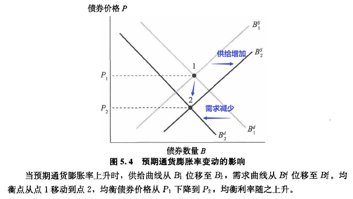

上图, 预期通胀上升时:

- 企业融资成本降低 -> 借入钱的动力增加 -> 债券供给增加 -> 债券"供给曲线"向右位移.
- 债券收益被通胀缩水, 并且债券相对于其他竞争性投资品(如房产)的预期回报率下降 -> 民众对债券的需求减少 -> 债券"需求曲线"向左位移.
- 所以"供需曲线的焦点", 就从 1 变动到 2 点. *"均衡债券价格"从 P1 下降到 P2. 由于"债券价格"与"利率"是负向相关的，这意味着"均衡利率"的上升。*

注意, 上图中, 虽然 点1 与 点2 所代表的"均衡债券数量"画得是相同的。但**现实中, 当"预期通货膨胀率"上升时，债券的"均衡数量"可能是增加的，也可能是减少的，这依赖于供给曲线与需求曲线位移的幅度。**
====

所以, 我们就得到这个结论: 预期通货膨胀率上升 -> 企业债券供给会增多, 但民众在债券上收益率会下降,因而需求减少 -> *债券价格下跌 -> 利率上升.  这个结论, 就是"费雪效应" Fisher effect.*

下图5.5 表明了 *3个月期"国库券利率", 总是与"预期通货膨胀率"一起变动的*，证明了这个预测的准确性。因此，很多经济学家都认为，*如果要达到"降低利率"的目的，就应当将"通货膨胀率"控制在较低的水平上。*

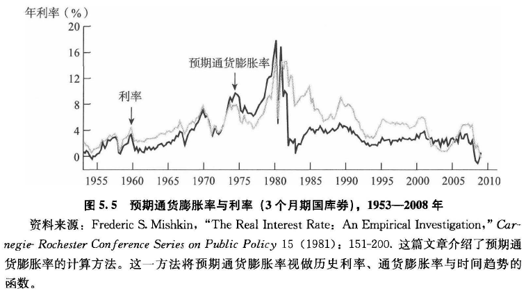

==== 经济上升期, 对利率的影响 -> 经济好, 利率高. 经济差, 利率低.

- 供给方: 经济上升期 -> 企业盈利增加 -> 企业投资意愿增加 -> 债券供给增加 -> 债券供给曲线向右位移.
- 需求方: 经济上升期 -> 民众财富增加 -> 对债券的需求增加 -> 债券需求曲线向右位移.
- 新的均衡点, 从1点 变到2点.  +
→ **下图中, 我们画的是"供给"的位移幅度, 大于"需求"的位移幅度, 所以债券的"均衡价格"是下降的 (利率与其成反向变化关系).** +
-> **但如果反过来, 是"需求"的位移幅度, 大于"供给"的话, 债券的"均衡价格"就会上升了.** +
**所以, 新的"均衡利率"可能上升，也可能下降，这取决于供给曲线与需求曲线位移幅度的大小比较。** +
不过**现实中, 经济扩张, 往往导致利率升高. **

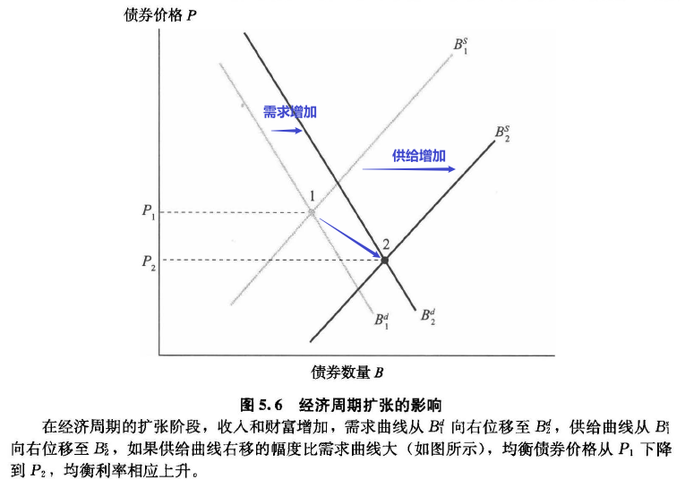

下图5.7 描绘了1951-2008年间美国 3个月期国库券利率的运动，并用阴影部分代表了经济周期的衰退阶段。正如你所看到的，**经济周期扩张阶段,利率上升; 经济周期衰退阶段,利率下降.** 这同供求图所表示的完全一致。

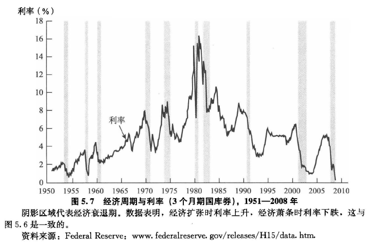

.标题
====
90年代时, 日本经济衰退, 并且通货紧缩 (通胀率为负). 日本有过其"6个月期国库券的利率"略低于零的情况.

原因是:

- 需求方: 通货紧缩 -> 房产投资的预期回报率下降，债券的相对预期回报率上升 -> 对债券需求增加 -> 债券需求曲线向右位移.
- 供给方: 通货紧缩 -> 实际利率升高 -> 企业还债压力增大 -> 债券供给就减少 -> 债券供给曲线向左位移.
- 即 : 债券需求增加, 但供给减少, 供不应求 -> 债券价格上升 -> 利率降低.

====

102
