= 高考
:toc: left
:toclevels: 3
:sectnums:

'''

== 不同的专业, 成功的概率不一样!

- 选错专业, 则白白耽误青春。(而**青春不再来. 错过特定年龄, 就是错过特定机会的窗口期.**)

- 说三百六十行，行行出状元。可问题在于(*不同的专业, 成功的概率不一样!*)，有的专业毕业100人，状元只有1到2个，20%的学生勉强就业，剩余的80%非常难办。而有的专业，毕业100人，状元有5到10个，80%
的学生都找到了不错的工作。

== 大学实力排名

中国教育部每年都会针对各个大学、各个专业进行学科评估，并会出版成册.

其实，中国大多数专业排名靠前的学校，全是一些“985”，甚至清华、北大。问题在于大多数人都考不上。所以，不管什么专业，我(张雪峰)可能只会推荐一所“985”院校，甚至一所都不推荐，推荐的大多数是普通“211工程”大学，或者非“211工程”大学。

本书并不涉及艺体生报考方法和技巧. 报考大原则，艺体生跟文化生是一样的，但是艺体生属于"提前批招生"，报考方法与普通高考招生还是有很大差别的。

==== Project 211

即面向21世纪，重点建设100所左右的高等学校, 和一批重点学科。1995年启动。 截止2024年时, 有116所.

==== Project 985

为建设具有"世界先进水平"的一流大学. +
1998年5月4日，江泽民说: "我国要有若干所具有世界先进水平的一流大学。” +
首批“985工程”建设高校共9所（即：九校联盟, C9）

截止2024年时, 985 有39所.

image:/img/985.png[,100%]

==== Double First-Class Initiative 世界一流大学, 和一流学科 (简称“双一流”)

是继“211工程”“985工程”之后的又一国家战略. **主要是因为随着“211”“985”工程的实施，使得一些没有入围的学校, 获得的资源和生源质量受到影响，有高校“阶层固化”的倾向. **因此2017年，国家开始实施“双一流”建设工程, 范围比“211”,“985”更大，学校数量有所增加。

以前的211、985工程，都是侧重学校整体水平。“双一流大学”的评定侧重于"优势学科"或"特色专业"建设。

从实行来看，双一流概念推行差强人意.

- 双一流本来是未来打破人们的固有观念, 就是不再给大学排名了，而是说要给学科扶持. 但是人们根深蒂固的还是接受大学的排名： 因为**只有不是985，也不是211的学校，才强调自己是"双一流"。**

- 双一流扩容这么多，现在的"双一流"已经包含了所有的985/211，第二批直接摊大饼，一百四十多所学校全是双一流，这么水的名单没什么含金量, 反而会强化985/211在大家心中的地位。

== 自主招生 (现已取消)

目前中国大多数“985”, “211”高校，都采取自主招生，并且"自主招生"比例在逐年增加。而硬考，通过分数去上好大学的人数正在减少。所以，如果是高一、高二，或者初中生及其家长读者，尽量注意提早安排孩子进行"自主招生"考试，努力获得自主招生考试资格。

注意: 这一政策现已经取消. 在2020年起，不再组织开展高校自主招生工作，并在部分一流大学建设高校, 开展基础学科招生改革试点（也称"强基计划"）。

== 一本, 二本

一本二本三本, 仅仅是"录取批次"的缩写。

- 同一所学校, 可能在不同的省份招生批次不同，在A省是一本招生，在B省是二本招生.
- 同一所学校, 不同的专业招生批次也可能不同，某个学校有些专业是一本招生，有些专业是二本招生.

== 以前是"阶梯志愿"，现在是"平行志愿"

很多年前，当还没有"平行志愿"的时候，"第一志愿"很重要，因为学校会看你在填报志愿的时候，是否将他们学校作为首要选择。

比如你"第一志愿"填清华，"第二志愿"填北大，当你分数不够清华的时候，档案进入北大，但北大见你首选是想选清华，第二志愿才是他，那么他可能会选比你分数低几分但"第一志愿"填北大的学生。

但是，在"平行志愿"中不存在是否是第一志愿的问题。**平行志愿中，你的档案是由电脑系统投递的，你所报的学校不会看到你把他们学校排在了第几名，即使你把某大学排在了第四名，当你前三个都没被提档，档案落到该大学的时候，你和那些把这所学校排在第一个的学生是一个待遇，**因为在那个学校的界面上，根本不会显示你把他们学校排在了第几名。

先解释"投档分数线"：这个分数线考生是不知道的，这是学校根据今年一本线、二本线、以及填报本学校的人数等确定的。

*比如说这所大学预计招100个学生，如果这所学校说明他的招生比例是1:1.2，即他会将填报本所学校的、分数排名前120的学生档案, 提进自己学校，那么这第120名学生的分数, 就是他今年的"投档分数线"。*

举个例子说明一下"平行志愿"的流程：假设考生分数620分。

1）假设A大学投档线580，那么你的档案肯定能进入A大学，其他BCD学校就不用考虑了。

2）*假设A大学投档线619，那么首先要看这个学校"招生比例"，有的学校在提档的时候, 会提120%，那么该考生620的分数, 很可能处在多余的那20个之中，最后很有可能会被刷掉。*

除非报这个学校的学生里，619和620分的人数多余20个，然后根据各科成绩比较后，你的名次仍排在前100以内，那你就不会被刷掉。

3）**你没能达到A大学的投档线，系统会自动把你的档案放到B栏，假如你够了B大学的投档线，那么你的档案被B大学提走，**流程同1）2）；假如你不够B大学的投档线，那么自动进入到C栏，依次类推。

被刷掉的几种可能：*一旦被学校提档，而提档后你又不满足此学校的要求，那么你被刷掉后, 将没有机会再参与此"平行志愿"流程，直接进入下一批次的志愿填报。*

1）*有的学校提档120%，你正好落在了多余的20%里，会被刷掉，进入下一批次。*

2）在报专业上，你是否选择"调剂"。**假如你报了这所学校的五个专业，结果因为分数比同报这五个专业的人都差，那么这五个专业你是都没希望的，假如你也没有选择同意学校"调剂"，那么你就被刷掉了，**然后进入下一批次志愿填报。

3）你报的这四个学校，每一个的投档线你都没够上，那你就直接进入下一批次了。

平行志愿在一个投档时间段内, 可以填几个志愿。这几个志愿没有主次之分，都是一志愿，所以叫平行志愿。

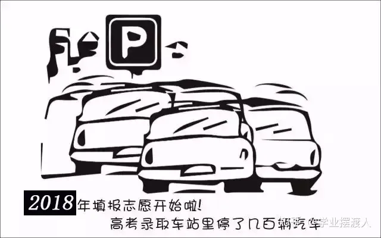

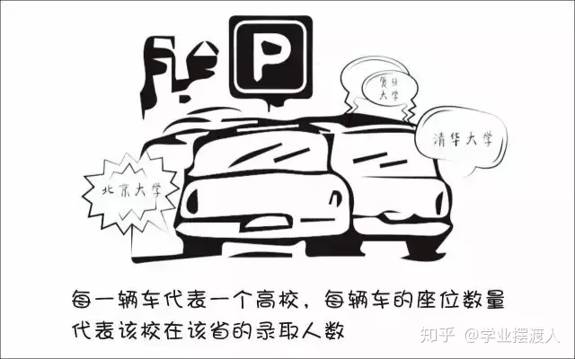

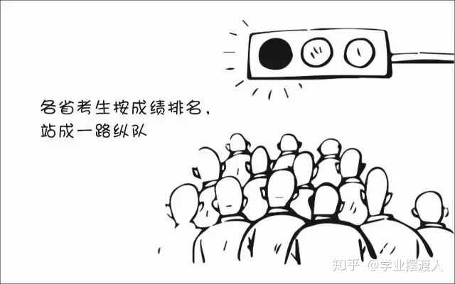

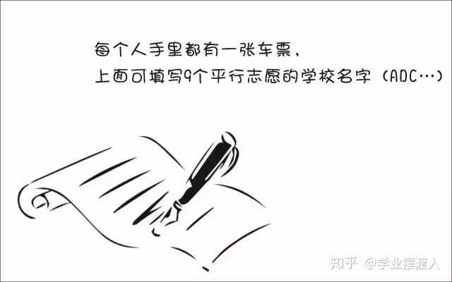

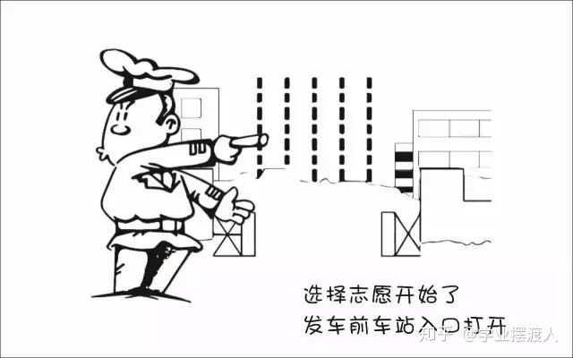

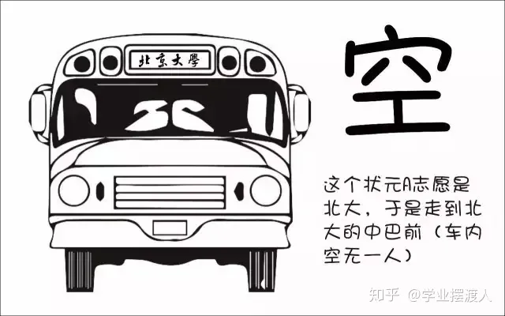

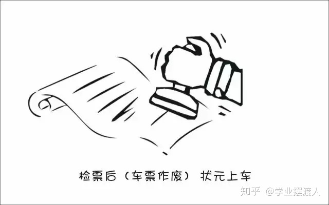

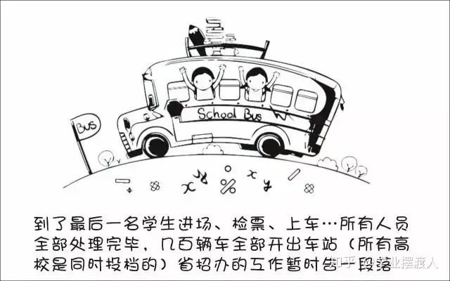

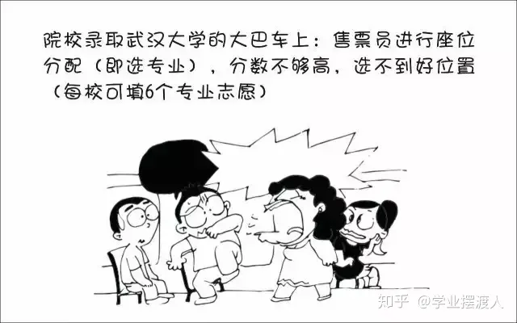

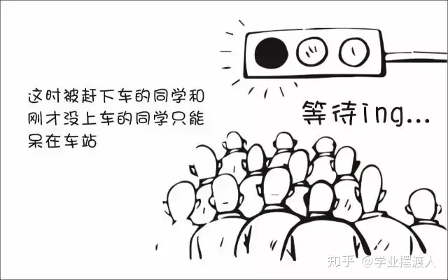

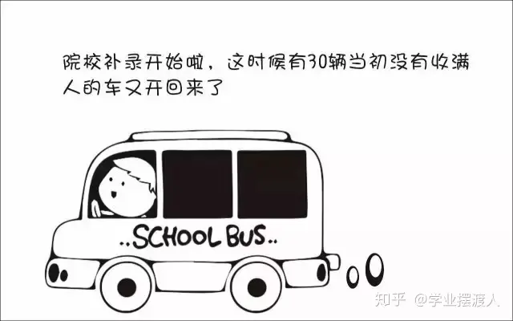

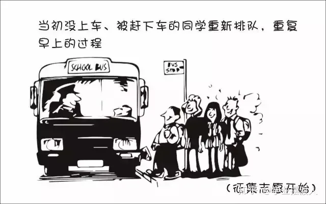

"顺序志愿"是每辆车开到不同的车站，考生拿着自己的第一志愿去对应的车站上车。如果没上去，那就明年再来。"平行志愿"就是所有的车都到一个车站，考生按照自己的志愿顺序一辆辆的看，哪里有空位就上.

平行志愿是只投一次挡的, 如果你a志愿没过a校的投档线, 那会跳到b志愿. 但如果a志愿过了投档线, 但你的选的专业全没过, 且没服从调剂, 那就会被直接"退档".

平行志愿的录取规则有三个特点：分数优先、遵循志愿、一次投档机会

我们用停车场的例子来阐释说明。假设高校录取工作, 是各个高校开着大巴车来省里接学生，每个学校的大巴车座位数, 就是该校在该省的计划招生人数，各个大巴车的座位数（学校的计划招生人数）都不尽相同。

1、分数优先、遵循志愿

平行志愿的录取规则下，该省所有考生, 按照分数"从高到低（位次）"在停车场外排队，分数最高的排在第一位，分数次高的排在第二位……以此类推。排在前面的人, 享有优先进入停车场的权力。这个停车场的检票员就是我们的省招办。

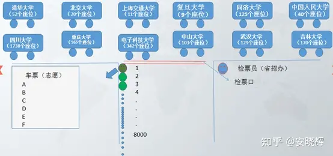

投档时，排在第一名的状元, 首先进入停车场，假如他/她第一志愿填报的是清华，那就直接上清华这辆车，因为清华这辆车现在是空的，所以他/她可以随便坐，那么第一名的投档过程就结束了。

紧接着，第二名进入停车场。如果他/她的第一志愿也是清华，那就上清华这辆车，清华的车上还有空位，那么第二名也可以挑自己喜欢的座位坐下，则第二名的投档结束；如果第二名的第一志愿不是清华，而是北大，他/她可以直接上北大的车，因为北大的车此时还是空的，所以他/她可以随便坐，投档也就结束了。

……

如果轮到第九十名考生进入停车场，他/她的第一志愿是清华，结果走到清华的车上一看，52个座位全坐满了，上不去；再看第二志愿是：北大，于是又到北大的车上去看，北大的20个座位也坐也满了；那就接着查看第三志愿：上海交通大学，发现上交的车上还有空位，于是上了上交的车。则该考生的投档也结束了。

上面的这个过程就体现了分数优先、遵循志愿的特点。*分数优先其实也可以理解为位次(选位权力)优先：谁的位置靠前谁先进场*；遵循志愿：*进场后按照考生的志愿填报(的学校)顺序, 逐个检查是否有上车机会*（一旦上了某辆车，就不再查看后面的志愿了）。

2、一次投档机会

继续沿用上面的例子来讲解一下平行志愿的“只有一次投档机会”。

假如第一百八十名考生的第一志愿是同济大学，*走到同济大学的车上一看还有空位, 就上车了。常规来讲，该考生的投档到此就结束了。但是上车以后才发现他/她喜欢的座位（自己填报的专业）都被占了，而剩余的座位（专业）都是他/她不能接受的，最关键的是他/她在填报志愿时，没有勾选【服从调剂】。因此该考生就只能从同济的车上下来并直接退出停车场——也就是说考生的档案被同济大学给退了回来（退档）。与此同时，该批次里填报的剩下的志愿也都作废了。*

考生只能等"征集志愿"，或者是等到下一批次重新参与排名进行投档（前提是考生在下一个批次填报了志愿）。一旦被某高校退档，同一批次里填报的剩余志愿作废，*这就是平行志愿的“只有一次投档机会”。*

**不服从"调剂", 是被退档的最常见原因，**此外还有一个主要原因是**考生的体检结果不符合所报考院校或专业对身体条件的要求。**因此填报志愿时，一定要关注所报院校或专业对身体条件有哪些特定要求。

二、如何填报平行志愿

平行志愿填报时要注意：院校之间要拉开梯度。

**填报的排在前面的院校, 如果没有提走考生的档案，那说明一个事实：考生的分数低于该院校的"提档分数线"。**此时，*假如后面填报院校的分数线, 没有和前面的学校拉开差距，那么很有可能也不会被提档。*

*所以, 当我们填写平行志愿时，要注意拉开梯度*（录取分数线的差>5分），*关键的原则就是：冲一冲，稳一稳，保一保。*

1、为什么要冲、稳、保

冲一冲

**考生可以报考"预估投档线"比自己的分数持略高的大学，冲的是院校层级。万一这些高校今年投档线下降，考生就能投档进去，**这样就能实现分数利益最大化的目标；*如果无法投档，也不用担心，后面还有稳、保的机会。*

稳一稳

**这些学校的"预估投档线", 比考生的分数略低，**这样不仅投档成功的可能性很大，而且拥有一定的专业选择空间。*即使其今年投档线突然大幅上涨，后续还有保底学校的机会。*

保一保

万一前面报考的“稳”的院校, 今年大幅度提升"投档线"，考生可能会失手。为了应对这种情况，*在“保”的时候，所选院校的预估投档线, 要明显低于考生的分数，这样就能兜底，保证考生不滑档（不至于滑到下一个批次去）。*

2、冲稳保要注意哪些问题

“冲”要注意的问题

因为所选的“冲”大学的预估提档分数线, 是略高于考生分数的，**如果考生有幸被“冲”大学录走，大概率也是被低分专业录取，**所以选择“冲”大学时，*一定要查看该校的该低分段专业, 考生的接受度是否高。*

同时要关注院校专业较少的, 且专业满意度高的院校，因为这样的院校不管是被哪个专业录取，考生的满意度都比较好。

也可以关注招生人数较少的，**招生人数少, 分数波动可能就比较大，**考生被录取的机会就比较大。

再者就是招生人数有明显增加的；往年过热、今年偏冷的；这些院校都可以考虑作为冲的备选院校。

最后，*在冲院校填专业时，一定要有“主动调剂”的意识。意思是在低分段的那些不喜欢的专业里, 主动选择两个自己相对可以接受的——因为考生大概率会被低分专业录取，如果只填自己喜欢的专业，很有可能会被调剂到自己根本无法接受的低分专业，与其这样，不如主动填报一两个个人相对能接受的低分专业。这样万一被录走，不至于被分配到一个令自己非常痛苦的专业去。*

“稳”要注意的问题

**大部分考生都是被“稳”大学录取的，所以填报“稳”大学时，顺序很重要。**未必一定要把高分学校放前面，低分学校放后面。如果考生有心仪的学校，但是录取分数线相对其它“稳”大学较低，这时完全可以把自己心仪的学校放前面。假设考生填报了3所“稳”大学，分数都够，那哪个放在前面，就会被哪个录走。所以，如果考生有非常心仪的大学，建议把该大学的顺序往前放。

报稳大学时，要关注那些专业满意度较高、满意专业的分数均匀分布、低分专业接受度较高的院校。

当分数差距在3~5分之间时，专业的满意度更重要。有些家庭会非常注意“分尽其用”，不希望考生的分数有任何浪费。但实际上，*如果两个院校的录取分数线差在3~5分，院校的层级并不会有明显差别，这个时候专业的满意度是更为重要的因素。*

“保”要注意的问题

保大学要保证考生能读到自己满意的专业，刚好这个专业还是大学的热门专业、所以**要注意填"保"的大学时，高分专业的满意度要比较高，而且满意的专业均匀分布。**

要注意招生人数是只增不减的，比如去年招200人，今年只招50人，这样的大学最好不要拿来保。

**要选那些历年表现比较稳定，没有太大波动的院校作为保的院校。**

*另外就是本省院校优先，因为本省院校通常在省内的招生人数都比较多。*

把握好了"冲、稳、保"原则，基本上就能保证考生不会明显浪费分数、能够读到相对满意的专业、不退档、不滑档。

【概念解释】

*退档：档案已被高校提走，但因为一些特殊原因，例如：不服从调剂、身体不合格等，档案又被高校退回。*

**滑档：档案压根没有被所属批次的院校提走，直接滑到了下一个批次。**举个例子，*考生的分数是妥妥的一本院校，但因为填报不合理，所填院校的提档分数线都明显高于考生的分数，导致考生没有被任何一本院校录取。只能滑到二本批次，再次参与投档。*

所谓平行志愿就是同一批次考生可以同时填报多所学校，而且这些院校之间是平行关系。平行志愿遵循分数优先，志愿顺序的原则进行投档录取。但是**同一批次只有一次投档机会。**

什么是分数优先？

其实投档时候会根据考生分数从高到低进行排序，比如A考生考了590分，第一志愿报了X院校，B考生考了600，第二志愿同样报了X院校。

其实**计算机会根据分数优先的原则，首先检索到B考生，根据志愿顺序的原则，优先看B考生第一志愿，如果第一志愿可以投档，直接将B考生档案投放到第一志愿院校的招生办。但是如果第一志愿低于该学校的投档线，接着看B考生的第二志愿，以此类推。**

*什么是志愿顺序？*

同样举个例子说明，*比如A考生考的非常好，可以上清华。但是报志愿时候阴差阳错，第一志愿报的哈工大，第二志愿报的清华。那么A考生根据"志愿顺序"原则, 最终只会被哈工大录取。** 其实**这里涉及到志愿顺序问题，一般建议大家还是遵从冲一冲，保一保，和稳一稳的原则。**但是为了防止被退档，同样切记：

切忌盲目冲一冲，平行志愿中第一志愿同样很重要。

2.什么是大类招生？

最近今年的许多学校, 都开始采取"大类招生"的招生策略，**所谓"大类招生"其实是高校将相同、相近学科门类，同院系或是不同院系的专业合并，按一个大类招生。所以其实考生志愿填报的时候, 是填报的大类, 而不是具体专业，一般会在一年后进行再次分流。**

举个例子：比如土木、建筑、交通可以一起归为"土建类"。

**不同学校的划分标准不同，**具体可以关注自己所填报院校的具体情况。

*大类招生其实有利有弊*，具体也要因人而异：

优点是：

1）**大类招生, 本质上是给了你又一次选择专业的机会。**高考生大多对于专业其实不够了解，不知道专业具体做什么，以后就业可能去哪里。大类招生之后，你可以根据自己一年对大类下的专业的了解，更加明确自己所学的专业。

2）*大类招生也给你弥补高考分数机会。有些考生可能有自己喜欢的专业，比如建筑，但是高考有些发挥失常，本来按着之前的专业填报, 是没有机会去建筑专业的。但是大类招生后就有可能进入土建类大类，然后经过一年努力，大二分流后进入心仪的建筑专业。*

缺点是：

1）**大类的专业不均衡，高考高分考生不一定能选到自己心仪专业。**其实这也不能算缺点，但是确实有一些高考高分考生按原本的专业招生本能稳稳当当去自己心仪专业，**大类招生后大二分流可能并不能去到喜欢最心仪的专业。**所以也算一次提醒，让自己进入大学也要踏踏实实学习，不能以为到了大学就完全放松自己。

那大类招生是分流通常是按着什么分流呢？

其实不同院校不太一样，但是通常而言是按着大一的成绩。大一通常是上的基础类课程，会根据大一成绩排名和自己志愿选择具体专业。

3.什么是投档比？学校的投档比是不是1:1？

划重点：投档比非常重要，报志愿前一定要问清楚所填报院校的投档比。

顺序志愿投档比例高一点，如1:1.2，平行志愿下很多院校都改成了1:1。但是仍有部分院校可能不是，所以一定要问清楚所报学校的投档比。

1）如果投档比不是1:1

假如一所学校的投档比是1:1.05，而院校只招收100名学生的情况下调走105人的档案，再从高到低排名，分数最低的五人又会被退档。一旦退档，平行志愿下只能等待下一批次。

为什么会有这种情况，从学校角度是为了更好保证招生计划。*假如院校按照1:1的话，今年招100个人，投档100个人，但是如果有不符合要求的，意味着今年招生计划没有完成。*

但是对于学生投档比杀伤力真的太大了，一定要了解清楚。

2）如果投档比是1:1

假如一所学校的投档比是1:1，而院校只招收100名学生的情况下只会调走100人的档案。所以此时只要服从调剂，就不会被退档。

但是如果坚持不服从调剂，还未达到自己所报专业志愿的分数线，还是会被退档，这也是平行志愿下比较大的风险。

4.什么是专业级差？学校有没有专业级差

划重点：专业级差同样非常重要，报志愿前一定要问清楚所填报院校有没有专业级差。

那什么专业级差呢？

*专业志愿之间, 设有专业分数级差，根据第一志愿进行分数排序，优先录取第一志愿考生，一志愿投档未成功会扣去级差分, 进入二志愿的投档序列，以此类推*......

举个例子详细介绍：

*专业级差是321的话，假设2020年A考生考了590分，但是没有被第一志愿成功录取，那么在录取第二专业的时候，是按照587（590-3）分来算的。同理可推，录取第三专业的时候，就是按照585（590-3-2）的总分来进行排名录取。*

*所以一旦所报院校有专业级差，专业顺序也变得非常重要。*

所以填报志愿前所需了解的到底有哪些？
了解完这些基础知识，我在给大家总结一下，在填报志愿前，针对自己想去的院校，一定要问清楚以下几个问题：

1.请问贵校投档比是多少呢？是1:1?

2.请问贵校有专业级差？

3.请问贵校是大类招生？招生计划多少呢？

如果投档比不是1:1，一定要谨慎再谨慎。

*如果存在专业级差，一定要把自己喜欢的并且觉得稳妥的专业放前面。*

在了解这些基础知识后，再根据自己的分数和排名，对比心仪院校过去几年的分数和排名，合理填报自己的志愿。

具体的如果想转专业等问题可以针对性咨询贵校的招生办的老师。

Part 2 常见的高考志愿填报问题？

1.报志愿应该看分数还是看排名？

*毫无疑问看排名。分数可能会根据每年题目难易程度变化很大，但是每个高校招生计划一般变化不大，所以报志愿时所报院校前几年省内排名非常重要。*

2.是否要服从调剂？不服从有什么后果？

*服从专业调剂，就是同意高校把自己调剂到自己在志愿中没有填报的其他专业；不服从专业调剂，只想去自己填报的专业，那么如果自己选择的专业已招满，则会被退档*

是否服从调剂一直是许多考生心头痛。*服从调剂怕自己被调到自己不喜欢的专业，不服从调剂怕自己被退档。*

*其实要不要服从专业调剂, 从本质上涉及到高考填报志愿另一个问题：院校优先还是专业优先。*

这主要看个人成绩定位、专业兴趣等因素，取决于考生到底最看重的是什么。起码单纯从风险角度来看，服从专业调剂的风险会低一点，在平行志愿下，绝大多数985院校都是投档比1:1，**服从调剂起码不会被退档，**去不了自己想去的专业大一还有转专业的机会。如果坚持不服从调剂，心理必须有足够把握可以去所填报专业的其中之一，风险会大一些。

3.什么情况下可能会被退档？

每年总会出现出现退档情况，如何在志愿填报中避免退档呢？这里介绍常见的被退档的几种情况：

1)投档比不是1:1，导致一些边缘的考生脱档。

2)投档比是1:1，*不服从调剂情况下，未达到所填报专业的分数线导致退档。*

3)身体条件不符合所报院校或专业标准导致退档

4)所报专业相关科目成绩偏低，*许多高校招生, 不仅要求总分达到录取分数线，并且对所报专业相关科目的成绩也有一定的要求。*

一般情况下，前两种情况多一些，后两者只是部分学校需要，在填报志愿时这些高校都会说明，考生在填报时候要特别注意是否满足身体条件或者单科成绩条件。

能去985尽量去985（除非特别偏远的），能去211尽量去211，因为这很可能是你以后就业进去许多企业的门槛。
好的大学到底会带来什么？更好的资源，无论是师资力量，实验室配置，校友资源等等。更优质的人脉，大学一定程度上决定了你以后的社交圈子；更好的学习氛围：我不否认有人能做到出淤泥而不染，但是一个身边人都把努力当作成常态，一个很多人打游戏，刷综艺的环境哪一个更有助你的成长呢？人都是群居动物，你接触的都是什么人你就很容易变成什么人。

近几年许多省份陆续开始新高考

新旧高考的区别，其实主要区别就以下两个：

第一：**志愿填报上：以学校为导向转变为以专业为导向。旧高考是简单的 6 个平行志愿，每个学校下面 6 个专业。这意思是先选学校再选专业。新高考变成了 80 个甚至高达 96 个的志愿填报。一个"学校+专业"是一个志愿，学校和专业的地位平齐啦。**全国 14 个省份里边用"专业+院校"模式填报的省份，一共有 5 个分别是辽宁省、浙江省、山东省、河北省和重庆市，浙江省可以填写的志愿个数是 80 个，山东，河北和重庆都是 96 个，辽宁省则有 112 个志愿。

第二：**新高考下没有了「单纯」的文理分科，换来的是 20 多种不同方式的科目组合。**不同填报科目可能会影响志愿填报，比如**有些专业只有选择了"物理"的人可以填报。**

因为以上两个区别，所以新高考下志愿填报分为两种方式，具体要参考自己省份：

第一种方式，无调剂的填报方法，叫做"专业+院校"，一个"专业+院校"是一个填报志愿。*旧高考下是以一个学校为一个单位，在学校里面的所有专业你都可以报，如果分不够你报的专业，进行校内调剂。现在这些省份是"专业+院校"为一个单位来进行报考，不在是以学校为导向的志愿填报。*

第二种方式，组内调剂填报方法，叫做"院校+专业组"。一个学校内会招一大堆专业，*一大堆专业根据选科要求来分成各个组别。*

举个例子：**对以往的志愿填报来说，一个学校只有一个分数线，也只有一个代码。"院校+专业组"这是模式下，第一次出现多个代码多个分数线，我们可以反复的填写一个高校的多个专业组，也就是说，我们可以第一志愿填南大，第二志愿填南大，第三志愿志愿填南大都可，**具体也要看专业组的选考科目要求。

因为**这些区别其实加剧高考志愿填报难度，**其是对于像江苏这些第二年新高考的地方，*报志愿有些困难的核心原因在于你没有以前的数据，不知道如何去参考。*

但是其实**新高考下会增大不确定性，因为传统高考下由于多年的数据累计，高校的招生人数不会大变，所以其实你什么样的名次就会上什么样学校。**

新高考下我认为主要存在两个难点：

第一：新高考下没有了「单纯」的文理分科，你不确定自己的理科排名。所以你报志愿的时候很难用以前的数据判断。
第二：其实**传统高考下许多人报志愿会抱着学校优先，**我蒙一下这个学校好专业，**去不了这个学校好专业大不了我服从调剂。所以这一定程度上是提高了一些好学校不好专业的专业排名的。**但是如何新高考下，专业和学校一样重要，许多学生可能就不会这么报。不确定性很大。
那新高考下，如何填报志愿，我给大家一步一步讲解我的建议：

但是其实如何你们已经不是第一年新高考啦，志愿填报和旧高考就差不多，毕竟有前几年的数据了。但是如何你们是第一年新高考，比如江苏，这其实就是小白鼠比较麻烦。

我看知乎有人说，你让江苏去参考山东，其实这个是不太靠谱的。其实每个学校在每个省的招生量和学校的知名度分数线都差的很多，对照别的省意义真的不大。

那应该咋做呢？

假设你是考生，你拿到自己分数和排名。

第一步：依旧对照着以往三年数据，看你排名附近有哪些学校，同时要具体到看这个学校的专业排名。比如南京大学的物理学是 600 名，新高考下专业的排名非常重要；但是对于一些压线专业要做好新高考下可能排名更低的准备，这可能也是许多人捡漏的机会。新高考下你的区间跨度可能要更大一些点，志愿梯度也更多一点，毕竟其实你的志愿也多。好好利用每一个志愿。

但是这个很难说，大家都想捡漏，说不定反而由捡漏变为内卷了。

第二步：根据你的喜好，排除一些你一定不想去的学校。比如你不想去某些城市等。在排除一些你不想去的专业，新高考下其实你是有更多选择自己专业的机会的。

第三步：**结合学校专业城市，有梯度的选择填报。比如你是 2000 名，你可以选择 1000-3500 名之间填报的。每 500 名区间内填报 8-10 个志愿。**新高考下由于志愿很多，跨度大小可以稍微大一点，但是依旧是看你的求稳程度。

第四步：在填报志愿前，针对自己想去的院校，依旧一定要问清楚以下几个问题：

请问贵校投档比是多少呢？是 1:1?
请问贵校有专业级差？
请问贵校是大类招生？招生计划多少呢？
如果投档比不是 1:1，一定要谨慎再谨慎。

如果存在专业级差，一定要把自己喜欢的并且觉得稳妥的专业放前面。

新高考下其实应该没有专业级差，但是多插一句嘴问一下也没啥。

*因为新高考下依旧有服从调剂选项，一定问清楚可能服从到什么专业。*

第五步：**多问问招生办的老师，他们其实是最懂得志愿填报的人。**其实了解到这一步你已经基本能够知道自己想去的学校，起码不会亏分数报志愿。

新高考下其实志愿填报更考验技术，捡漏的机会更多，当然如果报的太激进脱档概率也会变大。

平行志愿，投档线，调剂，退档，征集志愿

假设湖南考生小王考了588分，省排名19200。

填了以下的志愿:

中南大学投档线618分。服从调剂

(专业选择略)

吉林大学投档线612分。服从调剂

(专业选择略)

湘潭大学投档线576分。不服从调剂

(湘潭大学专业选择:

1.计算机科学与技术 最低录取分592分，

2.软件工程 最低录取分数591分

3.数学(因为湘潭大学数学进了双一流瞬间被拔高到了)最低录取分数600分

4.法学 最低录取分数591分

5.没填

6.没填

南昌大学投档线573分。不服从调剂。

(专业选择略)

好了，*很明显，小王的分数首先被湘潭大学接收入档，他选了四个专业，分数没有一个可以录取的。*

这个时候，重点来了，*他没有选择服从调剂专业，所以被退档了。*

*他是不会被接下来的南昌大学接收档案的，为什么？*

1.投档线，*假设湘潭大学湖南招生计划是300个人，那么湘潭大学就会收到300份分数档案，分数最低的那位同学就是投档线。*

2.与湘潭大学同一批次院校, 都是被互联网同一时间同时发放了考生档案，大家都能及时录人，即使没录满，有像小王这样没有填写专业调剂的同学，也不会向下调剂，为了防止信息混乱，直接退档了。这就是一次投档原则。

那么如果小王选择了专业调剂又会怎样呢？

他就一定会被湘潭大学录取，只是专业大概率是生化环材机，别问我怎么知道的，哈哈。

还有一种情况，叫做滑档，*滑档是什么意思呢？就是假设小王在同一批次报了6所院校，他都没达到录取分数线，没有一个学校可以投档，这就是滑档。*

*无论是退档还是滑档，都只能参加这个批次院校的"征集志愿"填报，如果征集志愿还没有被录取，ok，小王只能参加下一批次，即本科二批的填报。*

*征集志愿：出现划档，退档的情况空出来的名额。*

但是，这里要注意，*由于新高考很多省份取消了一批和二批，这个时候小王就比较惨了，只能去报专科。*

新高考96个志愿：

这里要提一下新高考96个志愿，很多同学很迷茫，我来解释一下，以小红同学志愿填报举例:

假设小红同学 考了627分

华中科技大学 电子信息工程 投档线642分

华中科技大学 管理科学与工程 投档线639分

武汉大学 法学 投档线632分

中南大学 电子科学与技术 投档线626分

中南大学 电气工程 投档线623分

。

。

等等

好了，这里我们就能很直观的看到，小红就被中南大学电子科学与技术提走了，是不是比过去老高考填志愿容易理解？

这是由于计算机志愿填报系统性能的优化和计算机算力加强的结果。超级计算机能在志愿投档那一瞬间完成分配。

比如中南大学电子科学与技术招30个人，那么这个626分投档线就是最低分。

**新高考志愿**是真的很爽，**您如果坚定想去某一个专业是可以达到的。但是也有不少学校是写的计算机类，自动化类，工科组，这个就比较麻烦，**依然涉及到调剂问题，*比如在电子组里参杂一个微电子与固体电子学，这个方向有不少课程涉及材料而不是数字IC，这就需要斟酌报不报这个组了。*

二，什么是提前批？

**高考提前批是最先开始招生的高考批次，**

二，提前批填报规则有哪些？

1.提前批填报没有被录取, 不会影响之后批次录取

2.提前批每个省填报方式和学校个数有区别

多数省份录取规则是有序志愿，我来解释一下有序志愿，假设小强同学填报了提前批:

第一志愿:上海外国语大学

第二志愿:1)国际关系学院

2)社科院

那么小强的分数档就会直接进入到上海外国语大学排队，没录上进入第二志愿排队。实际上，第二志愿大概率已经录满，就没有了机会。简而言之，提前批，第一志愿最重要。

3.不要填错位置

**提前批大分类有文理类，艺术类，体育类，文理类中又有公安类，司法类，军事类，国防生，公费师范类，免费医学，小语种类，航海或空乘，每个省份分类还有区别，五花八门，**总之一定要慎重仔细填报，找到自己所选，不要搞错位置。

三，提前批主要院校分类？

1.试验班

比如南开大学理科试验班，吉林大学唐敖庆试验班，白求恩一，二，三院，哈尔滨工业大学工科试验班(生命科学挑战班)，复旦大学技术科学试验班等等，各类院校试验班。西安交大钱学森实验班。中山大学冯•诺伊曼实验班。

**试验班最大的优势有三点，1)保研率高。2)师资丰富，有专门的导师带。3)学风较好，人数不多**凝聚力强。

*试验班缺点:部分试验班把天坑专业放到了提前批，这些专业就业并不理想。*

2.*特种行业院校*

*这样的院校一般情况讲的是这五所，北京电子科技学院（属中央办公厅），外交学院(属外交部)，国际关系学院(属教育部，实属ga部)，上海海关学院(属海关总署)，中国消防救援学院(属应急管理部)。*

以北京电子科技学院为例:

**毕业生由学校组织统一参加国考，国考单独录用，不参与排名。**说的直白一点，就是只要不太瞎搞，你大概率就能成为中央直属单位公务员，能不能考入机要部门就看您的造化了，就业问题不大。

**这几个院校的部分专业在进入体制内有明显的优势，**具体的在下面这篇文章中展现:

作为农村的孩子，学什么专业最现实？
1.2 万赞同 · 172 评论回答

3.香港地区高校

**香港地区高校目前在提前批里招生的有三所院校，分别是香港中文大学，香港中文大学(深圳)，香港城市大学。
**

港中文，录取人数300人，录取要求:

考生报考的外语语种必须为英语，以150分为标准满分计算，自费生的英语成绩须达120分或以上；奖学金生则须达130分或以上。

本校只录取以香港中文大学为第一院校志愿的考生，不参与征求志愿及不考虑参考。

劣势:费用比较高

保证金：450 港币学费：145，000 港币/年校园宿舍住宿费：约 12，000 港币其他杂费、生活费：30，000 港币/年。

优势:英文授课为主，统计留港率16%，海外进修率35%，毕业可留港12个月找工作。

港城大，录取人数220人

录取要求与港中文一致，费用4年在80万人民币左右，前两年有宿舍住，后两年就不一定有了。

港城大的招生说自己有6城的同学可以留港，我持保守态度，据我观察港中文的数据比较真实。

港中深在广东，浙江，上海，山东，福建，江苏录取方式采用综合评估，高考6成，高中组织校测3成，学业考试城市1成。

而在其他省份包括以上六省采用提前批形式，也要英语120以上。港中深依然是留学大头，64%的同学去往(境)海外留学。理工科达到了85%。

4.军事院校

2022年军事院校招生已经发布，目前参加本科招生的为27所军事院校，以北京为例:

其他的大家还可以关注军队的官媒:

2022年军校招生计划，来了！
​mp.weixin.qq.com/s/s27rD-6Gnz737jMe4zT8LA

**军事院校经过多次改革，**目前已经大幅度改善了就业分配机制，以综合成绩评价毕业生分配地区，相对于以前还是公平一些了，这对打算从戎的同学来说是好消息。

这里可以提供一些彩蛋，比如第四军医大学在四个省有口腔医学八年制招生，总有家庭条件一般的同学问我又想学医又怕学制长家里供不起，这就是最好的选择之一，大家都知道我对家庭条件一般的同学是无条件照顾的，你吃了这么多苦，考了这么高分数不该浪费。此外，*打算报考国防科技大学的同学，我个人更推荐未来分配非指，因为保研率高，全国都没这么高的院校，达到了7成以上。*

**对于打算报军校同学，最大的缺点是确实不能经常回家，成家也有一定压力，**最大的优点，特别是对于分数不算特别高，没有到985以上，身体条件达标，家庭条件很一般的同学，这是您跨越阶级最好的道路，特别是**女生(虽然招的很少)。**

5.警校

**警校分为部署警校和省属警校，**名单请自查，我只说重点:

1)2022年警校入警改革，从过去的查三代，变成了查两代。但需要注意的是，目前没有消息称警察招录时不用查三代。

2)*目前警校本科的同学就业以公安类联考录用为主，入警率高达9成以上。*

3)*省属警校的同学基本上要回生源地就业，省属警校优势在于回单位就业时发现都是自己校友。*

部署高校每年会有一些部分单位直接参加招聘。部署警校的同学有10%可以参加跨省警招调剂岗位。部署院校可考的特殊预留岗更多，也可增加跨省就业机会。部署高校的学术能力很不错，对于有深造兴趣又打算入警的同学是比较好的选择，想当警校大学老师，显然从部署起步是很不错的。学术水平竞争比地方高校小很多。

此外部分政法院校也开设了公安专业，但跟公安类联考关系不大，也就是说学了入警难度比较大。

但政法类院校，如中国政法大学侦查学也有自己的用途，懂侦查学和法学交叉方向，就业也算是比较吃香。在学术方向也会有比较好的前景，比如西南政法大学刑事科学技术。

6.飞行技术类

第一类是中国民用航空招飞，目前有且仅有二十所航空高校在中国民航招飞系统注册:

也就是说除了以上这二十所，其他普通院校都是山寨货。需要注意的是，民用航空系统在疫情下出现了招收飞行员人数订单下滑的现象。比如就在前几天，安阳工学院发布了文件:

由于昆明航空和中原龙浩航空持续亏损，所以调整招飞计划为6人。由于2020年后出现了部分航空公司亏损至无法经营，许多同学进入学校后拿不到订单，现在已经有所好转。

建议:密切关注本省招飞计划院校合作的航空公司，与经营不善的公司联系紧密的高校慎重报考。

第二类，军队飞行员本应当放入军校里的，但我还是想说一下。军队招飞通过了初选，复选，定选三个流程，定选之后，医学选拔，心理选拔，一本线合格，才能投档。

而提前批录取只是最后一个关卡，即达到本省的统招一本线，所以这里就不多说了。明年的考生，如果身体棒，视力好，在今年9月就要开始准备。

7.小语种院校

小语种院校，这里比较出名的就是北外和上外，因为疫情的影响，最近小语种就业是比较一般的，特别是各类驻外工作暂停，导致就业行业不好。

但随着疫情的变化，我认为这种局势会逐渐消失，语言这个东西是文化和经济的桥梁，我非常推荐小语种院校就读的同学辅修一些学科来提高您的就业竞争力。毕竟您很可能具备天然的全球化和跨国就业的优势，差的却是技能。

并且小语种越小众越容易考编，像广西民族大学的柬埔寨语每年都有公务员岗位可考，报名的人都难凑齐，但其他专业已经挤疯。

8.综合素质评价类院校

这里主要说的就是之前提到的港中深，昆山杜克，上海纽约大学，深圳北理莫斯科大学，南方科技大学，北京外国语大学。

很多同学对这个北京外国语大学的综合评价感兴趣，我就以它为例，它是为了“一代一路”发展而提倡的综合考评。就在前天6月18日组织了远程面试。

这个综合评价如果过了，一般会比统招的分数低上15-60分不等。比如四川今年理工类综合评价最低分就比统招低50分。

这种项目的要求有高中成绩，比如您需要在高中排名前10%，语言类排名前5%，或者各类奖项，雅思托福高分，文体类比赛奖项。北外的综评可以说是各类考生综评中最复杂的。

录取要求是70%的高考成绩+30%的校园测评，其中包括能力考试和体育测试两部分。

能力测试包括面试和外语口试，体测可选50米跑，1000米(女子是800米)，立定跳远，游泳。

也就是说，这一类院校需要有钱的中产阶层以上的家庭特别关注。它比较贴近于我常说的谷爱凌路线。

9.公费师范生院校

第一类，提前批部属公费师范生这两年是越来越火了，原因无他，现在有大量教育部六大硕士都觉得编制越来越难考了，搞编制，在我国的教育体系里就是头等大事。说的难听一点，双减之后只有编制=教师。

公费师范生就是发编制的，一人一份，但要回生源地工作不少于六年。

部属公费师范生能回城市教书，并且发达地区更占优势，因为浙江，广东发达城市的中小学及乡镇老师比省属大学老师收入高也不是什么秘密。虽然降薪了，但还是高，那么发达城市，比如杭州，深圳，广州这些地区的公费师范生是比较划得来的。

第二类就是省属公费师范生，这个，我以广东省为例，省属就比较苦了，以粤东，粤西，粤北为主，除了特殊教育分的都是乡镇，所以很多同学不愿意报，不想回乡镇。

但我实话实说哈，如果您分数刚好合适，结合自己的考试能力，深入的了解一下现在教师招聘有多卷，我觉得是有好处的。现在已经出现了广东很多师范类学生考乡镇都很卷的情况，穷乡僻壤一个岗位都二十几个人报。慎重！

10.航海技术类

这一类大家都比较陌生，有以下院校开设了航海技术类大学:

排名不分先后，其实呢，我不太想说本科提前批的航海技术院校，因为真正愿意去的同学确实不多。多数本科同学反馈态度就是上船就废了.....

但相对来说，我个人认为对于专科分数不是太高的同学，如果能在专科提前批低分搞到航海技术也是不错的选择。一个很简单的原因，好就业，真打算上船就业率是百分之百，缺点是，寂寞，空虚.....

11.国家免费医学生

教育部办公厅发布了今年农村订单定向免费本科医学生招生计划（通常简称为国家免费医学生），全国招生总人数5918个，涉及23个省、市、自治区，此项目有中央财政支持。

国家免费医学生招生计划是面对中西部省份的农村户籍高考生，而单独设立的招生类型，实行单列志愿、单设批次、单独划线，只招收农村生源，在本科提前批次报考和录取。

优点:学业免费，解决编制

缺陷:多数免费订单生需要回到生源地乡镇工作6年，收入一般。

建议:适用于分数不高，达不到现在暴涨的医学录取线，又特别想学医学的农村同学，相比于城市，乡镇卫生院的工作不能算很辛苦。

四，结语

大家应该也注意到了，提前批的角度是比较刁钻的，当前糟糕的就业环境，我认为大家不得不重视提前批这些剑走偏锋，不走寻常路的选择。

特别是对于家庭条件一般的同学来说，您本身和家庭没有太强抗风险能力的情况下，有一个这样的选择无异于拿到安身立命之本。

我是一言难尽，知乎50万粉丝教育答主，一名大学老师，为您的志愿填报保驾护航:

建议大家收藏:

首先了解下高考远程录取的步骤：

第一步，学生填完志愿；第二步，省考试院将信息采集；第三步，*在给高校投档之前，考试院要和高校联系进校模拟投档，就是根据高校的招生计划，按照100%等几个比例，让高校了解报考学生的数据*（当然高校看不到具体学生的信息），高校如果觉得生源不错，分挺高的话，**结合招生计划完成情况，决定是按照100%投档还是扩大比例（就是要不要多招几个人），然后和考试院确定比例，那么最后一名就是调档线；**第三步，**考试院根据调档线，将上线的报考的学生档案投到高校，**高校阅档录取，进档的考生分数高的优先选择专业；第四步，考试院录检审核录取结果。

根据录取规则和流程，你如果被调档后，就不能再将你的档案投递给其他学校了，如果你的分数低，你填报的志愿都选不上，你还填报了不服从调剂，学校是没办法给你安排专业的，只能给你退档，退档了就只能去读下一个批次了。个人认为，能读好一点学校的就读好一点学校吧，大不了好好学习，谋求后面转专业，滑到下一个批次的话太可惜了，对你以后的就业有很大影响。现在很多学校也都是为了学生考虑，很多都是只要你体检合格、同意调剂，都不会退档的。

有些同学想着后面去征集志愿，但是你要知道，征集志愿录取的分数不一定比正常录取低，很有可能是有些高分的考生滑档下来之后填报的，所以我们也进场碰到征集志愿的发那个数高于正常录取的分数。

== 最低投档线

每一个院校+专业组的"最低投档线"，都不是事先划定的，而是在投档结束后自然形成的。

== 滑档

== 征集志愿

*每个学校每年都有计划的招生名额，第一次投档后，有的名额没用完，遂进行又一轮招生*，比如我是胡建的考生，以下图片是我省本一批的第一次征集志愿，（部分哦，不是全部）也就是本一批第一次投档剩下的，也就是说征集志愿能录多少人是事先安排好的，当然啦，也有第二次征集啦，那么专业范围就更少啦

考生填报完志愿后，紧接着就是录取环节，*在高考录取的过程中，由于上线生源不足等种种原因，某些批次的某些高校如果出现招生计划未完成，或者是追加招生计划的情况，这时将会进行征集志愿。*

另外，还有部分院校征集志愿后生源仍不足，经省教育考试院批准会进行降分录取。

也就是说，没有被录取的考生不用过于担心，只要时刻关注省教育考试院网站发布的征集志愿信息，积极参与征集志愿填报，就会有很大的可能被录取。

== 专业组

== 大类招生

今年，985高校中山大学在江西断档了。

往年录取需要2000以内的排名，今年直接掉到7000开外。

这让一些人意难平。

高分进来的觉得自己亏了，原以为分不够的同学遗憾没有捡漏。

*究其原因，主要是中山大学搞了一个"大类招生"的政策。一个好专业，带几个差专业。*

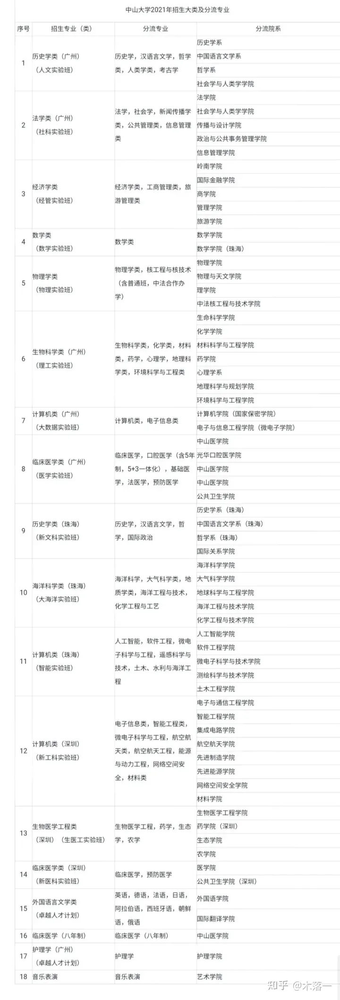

计算机专业和土木工程绑在一起，当你录取进大类的时候，你都不确定自己是进计算机还是土木工程。

*大一就必须卷，只有在成绩在前15%才能优先选择专业。所以很有可能高分进去，原本想读计算机，结果进了土木工程。* 因为这个风险，报考的同学就把中山大学给排除了。于是，它断档了。本来想靠计算机骗一波高分，结果高分全跑路.

只能说，低分进来的同学捡了一个985的牌子，但很有可能进了一个天坑专业难以跳脱。

高考前15%的考生大一绩点只要求前50%，真正的高分考生不用担心，高分保护一定会有。高考不在前15%的考生，绩点才要求前15%。而且这只是第一志愿优先选择权，大类里如果有多个“好”专业，即使不满足上述条件还是可能到理想专业去的。

专业分流:简单点说就是大一下学期分专业，不是转专业啊！别弄混了。如果不懂的话可以去问问度娘。

唉！别问了，我再说明白点。

*你考大学的时候不是要选专业吗？但你选的这个专业只是一个大类，基本每个大学生都是。然后你学习这个大类一年，最后学校根据你这一年的学习成绩, 给你分配到这个专业下面的具体的专业。*

但我要说明一点就是，*你的专业并不是学校（应该是学院）给你选的，而是你自己填表，填自己想去那个专业，如果你成绩好，你可以优先选，成绩差的只能选别人剩下的。*

我拿我自己举个例子，我高考报考《环境科学与工程类》专业，这是一个大类。他下面有两个分支专业《环境工程》简称环工和《环境生态工程》没有简称，哈哈。

然后你读一年，也就是**大一下学期期末的时候开始分专业**（好像是每个学校都这样，清北不知道）。

**好的大家肯定是要去抢的，但狼多肉少啊，**我们就两个专业，个个都想要去环工（环工比较好，毕业就业率高，生态的话基本上毕业就失业。有夸张的成分，既然学校开这个专业，肯定是有社会需求的，好了，不了这。只要记住环工比生态好就行了。）

怎么分呢？成绩，成绩是最公平的。说到这，这就和高考填志愿一样，基本一模一样。

再分之前，你先填志愿，要去那个专业。这样有什么好处呢？假如环工和生态各招40，假如大家填志愿的时候都很平均，一边都是40个，那这个时候就不管分数了，人都齐了，我tm要分数干嘛。

但如果假如大家环工选了60个，大家觉得环工好，一起去报，结果只有20个人报生态。这不行啊，我环工本来只收40个人，但现在我多了，生态少了。怎么办？把多余的20个人赶到（调剂）生态，那赶哪20个人呢？这时候成绩就有用了。成绩差的那20个一边去。

**所以大一好好学习的重要性就体现在这一方面，你可以随便选专业，根据自己的兴趣，而不是被调剂。**

不少人都发现高校专业和就业匹配脱节的现状，为了改变这一情况，也**让大学生有多一次选择机会，不少高校开始实行大类招生。**
大类招生，就是把相近的专业放在一起，让学生学习一样的基础课，**学生对学科基础有简单的了解之后，再选择细化的专业，**例如说学生报考工商管理类，里面包含工商管理，人力资源，市场营销等多个专业，前期学生无需选择，后面根据自己的学习情况，再决定发展方向。

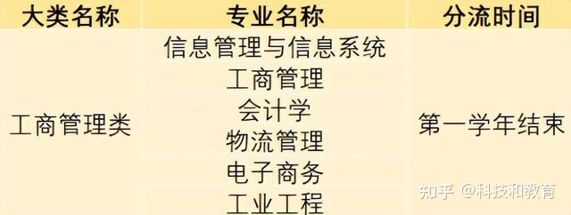

大类招生对学生有一定好处，一定程度上减少了考生报考的盲目性，**让学生在短时间内决定未来几十年的发展方向很难，不少大学生录取之后才了解专业学的是什么，也发现了自己不喜欢，大类招生可以避免这种情况发生，**学生有更充裕的时间思考未来。

可部分学校的设置却让学生踩了坑。通常来讲，大类招生下只包含一个学科，且专业相近，*但不少学校为了解决本校的冷门专业，开始动歪脑筋，把一些报考人数少，热度低的冷门专业打包进大类里面，或者在热门学科类别里，放一些容易误导的专业。*

例如说计算机类是近些年的大热，相关专业报考热度高，冲着这个报考计算机类，可细看之下才发现，*计算机类里竟然还包括了土木、水利、材料这样的冷门专业，学生抱着学计算机进去的，未来却改行土木，这堪称诈骗。*

还有些大类招生更绝，临床医学类很受欢迎吧？想当医生的学生会考虑这个类别，可法医学和预防医学专业也在这个类别下，听起来都是学医，未来却不能考执业医师资格证，换句话说就是不能行医，这和学生的理想相去甚远。

*高校的这种玩法，无非是想解决本校冷门专业的招生现状，但是不能拿学生的前途来背锅*，学生考进这样的大类，为了后期能分到想要的专业，得拼命学习内卷，**大类招生的专业分流堪称第二次高考，**给学生带来不小的压力。

*大类招生的出现, 导致学生从大一入学开始就面临着激烈竞争，学生们为了分流到好专业，必须尽快脱颖而出.*

== 分数是否达标的自我评估

填报的注意事项和小技巧：

1）那句冲一冲、稳一稳、保一保、垫一垫：

**"冲"的意思是: A志愿填一个分数稍微高，对你的分数来说，名气稍微大一些的学校。**当然既然你想冲，那你要找你有机会报的上的学校。

**比如你研究发现, A学校往年几次投档线, 比你的分数稍高几分或者持平，你可以试着报一下，**但你要确认他的招生比例（120%或100%），**这样做是有一定风险的。即使报进去，你可能还会面临"调剂"的问题，若调剂的专业不好，你还要做好转专业的准备。**当然也有偶然，比如A校分数一直高，大家都怕冒险没敢报，结果因为报的人少，它的投档线低了很多。所以你要是想冲，那么你要做好被刷掉的准备。

稳：就是你报B学校，没有浪费你的分数，而且这个学校对于你的分数来说算是不错，而且根据往年的分析，你基本可以报进去。

保、垫的意思你也可以体会了，用来以防万一。

2）关于"投档线"估计：这个你们学校会发这个的参考书吧？*上面都注明了前几年每所学校的最低录取分数线。不要只看它们是多少分，要看"录取分数线"与"批次分数线"的差值！*

比如, 2010年本一线560，A学校分数线590 (即590-560=30分). 2011年本一线572，A校分数线600 (即600-572=28分). 今年本一线540，你考了585，不要因为A学校这两年分数线都在增加, 你就觉得没希望，*要看差值*，30、28，*根据A学校发展分析它今年可能也在30分左右，而你超本一线45分，道理上你也是可以报的。*

3）报专业也是这个道理，要看这个专业在学校的排名情况分析。

有这种书卖，专门为了报志愿弄的，每个学校每年的录取分数线是多少，甚至有它每个专业的录取分数线是多少，超过本一、本二线多少，特别详细，可以很大程度上减少你的风险。

4）当你想冒险的时候，一定要研究好这个学校的招生比例！**关于专业是否调剂，你也要打探一下欲报学校的转专业情况，是否好转。**如果你不服从调剂，后果就是降到下一批次. 但如果服从调剂，只是转专业很难，那也是个问题，这都是你要权衡的问题。

5）看清你报的学校、专业有什么具体要求，比如某专业人家要求有口试成绩，结果你都木有去考口试，那就肯定没门。还有什么男女、身高要求等等。

我选好了大学和心仪的专业，我怎么知道自己的分数能不能达到目标专业的分数线呢？

方法1: 按每年"录取分数"和"投档分数"的"差", 进行预测（很多高考咨询机构都这样）

方法2: 按照"录取分数"与"投档线"的"比例", 进行预测（称为"出档系数"）

方法3: 找前几年的"高考各类分数段人数统计表", 然后，去目标学校的网站，把这几年的各专业详细分数线找出来. 根据分数段统计表和专业分数，估计该专业的大概需要的全省排名，然后对照自己的排名，得出结论.

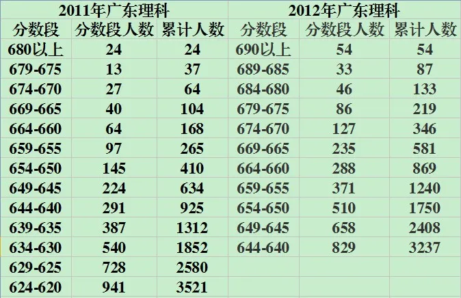

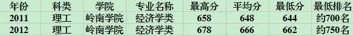

== 专业集合

选专业时要注意两个事项：

①如果发现专业里写着XX类(括号里一大串东西)，注意它应该是几个专业的集合，一般大一上基础课，大二会细分专业.但是也有不少例外，需要提前了解清楚。

②对于有多个校区的大学（貌似现在很多大学都是这样），注意不同的专业会在不同的校区上课，而且有相当一部分的专业是以后要迁校区的！！！这些要提前了解清楚。

== 投档比例

好多高校投档比例为105%，120%，甚至135%，是故意让某一部分人退档，考不上大学吗？

一般情况下，高校实际录取数大于计划人数。比如计划招100人，实际投档105人，如果没有问题，这105人全招，假如有三个体检不合格或者是不服从调剂，就会退档三人，实际招102。**如果1比1投档，一旦有体检不合格或者不服从调剂发生退档，就会人招不满。**所以一般是1.05比1投档.

没有特殊理由，进档不退，如果无特殊理由只是因为超过招生计划退档，一是你本省考试院不会同意，二是退档后果对考生来说极其严重，如果有高校敢这样干，造成后续无人敢报，影响自己生源。所以现在的高考平行志愿下，服从调剂，体检合格，进档不退.

根据省厅规定，一律不得超过120%。所以135%是不可能的。

辽宁省设置一轮预投档，要求院校调整调档比例，确保考生都能上学。正式调档后，院校退档必须有明确合理的理由。

一般比较好的大学都会在招生公告上写明进档不退，就是只要你达到了该学校的投档线，档案被该学校收走，并且服从分配，**除非有特殊原因（比如疾病），否则原则上不允许退档（这也是不少高校实际招生人数和计划招生人数有很大差距的原因）。**当然可能也有例外，不过是否退档的问题招生公告上一定有提及。

== 专业级差

**每个学校可选的专业绝不是一个,比如广东就是6个，那么这么多专业按什么原则进行录取呢？**首先顺序一定是从1到6，但问题也来了，这样会不会有失公平，让相对高分的同学霸占相对低分的同学的专业呢？**所以就出了"专业级差"这个东东。比如某大学的专业级差是2-1-1-1-1,假如该同学高考成绩640，录取到第一专业时参考的分数是640，录取到第二专业时参考的分数就是638，录取到第三专业时参考的分数是637，以此类推。**

== 新高考

变之前高中的“文理分科”政策、给学生们未来的发展提供更多的可能性，2014 年教育部发布高考综合改革文件，把之前只能在“理综（物理、化学、生物）”和“文综（地理、历史、政治）”之中二选一的政策，改为在6门科目（物理、化学、生物、地理、历史、政治）中任意选择3科参加高考。改革之后的政策为：

①语文、数学、外语3门科目为高考必考科目，每科满分 150分；

②数学不再分为文科数学和理科数学；

③物理、化学、生物、地理、历史、政治6门科目中，任意选择3门作为选考科目参加高考，每科满分100分。

科目	变化	分值
语文	无变化	150分
数学	不分文理	150分
外语	听力、笔试各考两次	150分
物理、化学、生物
历史、地理、政治	任选3科	100分/科
因此这项改革也被大家称为“6选3”，或者“3+3（3门必考+3门选考）”。

新高考“3+3”模式中衍生出了“3+1+2”的模式，

专家提出在选考学科中，将物理、历史作为必选科目，学生必须至少选择其中一门报考，这等于给偏文、偏理的考生一个选择的自由。同时，对物理、历史两门限选科目计120分，采用原始分计分。

“3”，指语文、数学、外语三门必考科目；

“1”，指物理、历史两门限选科目；

“2”，指在化学、生物、政治、地理以及除了必选一门以外的科目中任选2门。

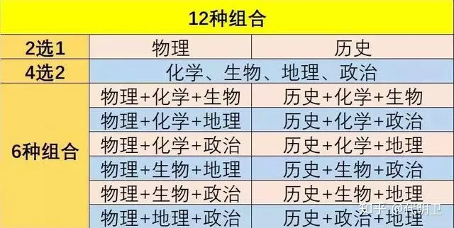

*原来“6选3”选科的20种组合 latexmath:[ C_{6}^{3}=20]，锐减成为12种组合* latexmath:[ C_{4}^{2}\cdot 2=12]，物理、历史分道扬镳。对于高一的学生和家长来说，由20种选择变成12种选择，难度显著降低，但是根据已经实行新高考改革省份的经验来看，12种组合全部开班的可能性几乎为零，因此在进行预选科的时候，避免成为小众选科组合而被迫重新选择，就显得尤为重要了！

*在新高考改革背景下，选科其实就是把高三的高考志愿选择提前到高一来考虑了。因为高校录取专业将与选考科目密切相关，现在选科就需要考虑未来就读的专业。*

选择科目要注意目标大学的目标专业类对高中所选科目的具体要求，这种要求大概分为下面几种：有3 门科目要求、有2 门科目要求、有1 门科目要求、不限制选考科目。

以下收集了所有新高考改革相关的选科数据，为大家整理了3+1+2模式12种选科组合可报专业、不可报专业的的简要信息，以供高一学生和家长在预选科时进行参考。

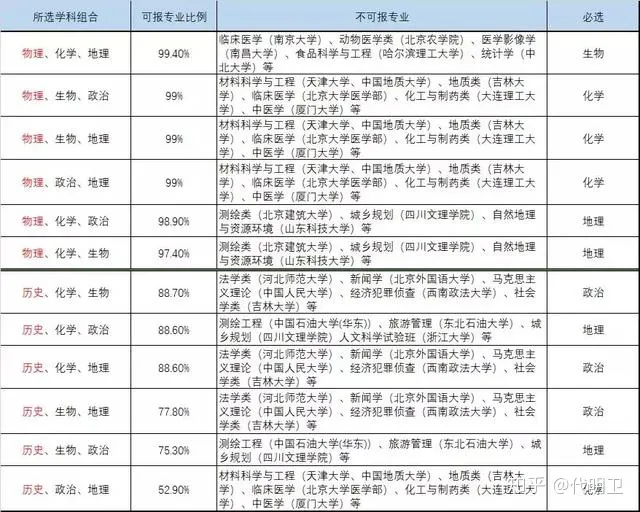

从以上数据不难看出，物理、化学、地理三科的组合，将来大学里99.4％的专业都可以报考，但是**如果选择政治、历史、地理三门科目的组合，可以填报的专业只有52.9%。**其他的学科组合可以填报的专业基本都在80%以上，

“3+1+2”选考模式的，“3”就是语数外三科主科，“1”就是物理或者历史二选一，“2”的话就是政治，地理，化学，生物中选择两科。所以选择物理或者选择历史都各有6种组合。

'''

== 转专业

很多高校在大一或者大二结束的时候，会给一部分学生转专业的机会。然而，各大高校都或多或少会对学生设置一些门槛，这些门槛或高或低。*如果你想大学转专业，志愿填报时一定要提前看一下你报考学校转专业的门槛！不仅转出有门槛，转入也是有门槛的！*

- 低门槛: 比如不挂科，或者成绩排名在多少名以内等。
- 高门槛  : 比如要求很好的成绩（如成绩在本专业前五名），还会严格限制转专业的人数，严格限制热门专业的人数。
- 不让转 : "艺术类"专业和"非艺术类"专业是无法互转的，很多学校还规定, "文科类"的专业不能转到"理工类、医学类"专业。

== 基础学科招生改革试点 (强基计划)

2020年起开展的招生改革工作，主要选拔"基础学科"拔尖的学生，聚焦高端芯片与软件、智能科技、新材料、先进制造和国家安全等关键领域.

