= Vensim 系统动力学软件
:sectnums:
:toclevels: 3
:toc: left
---

== Vensim

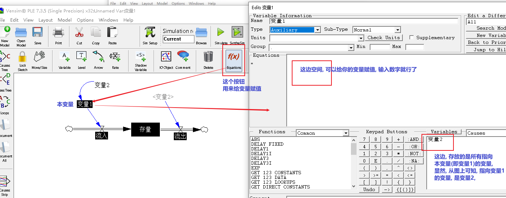

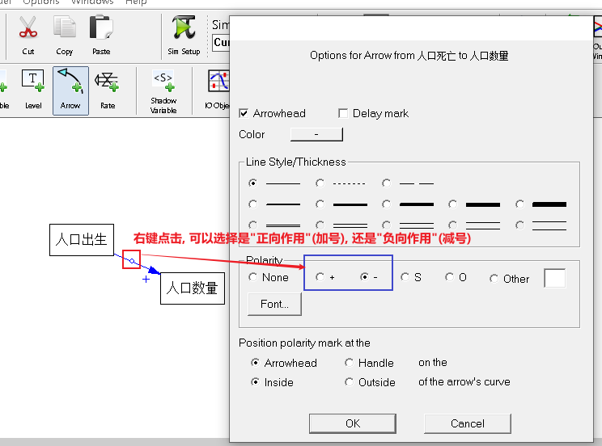

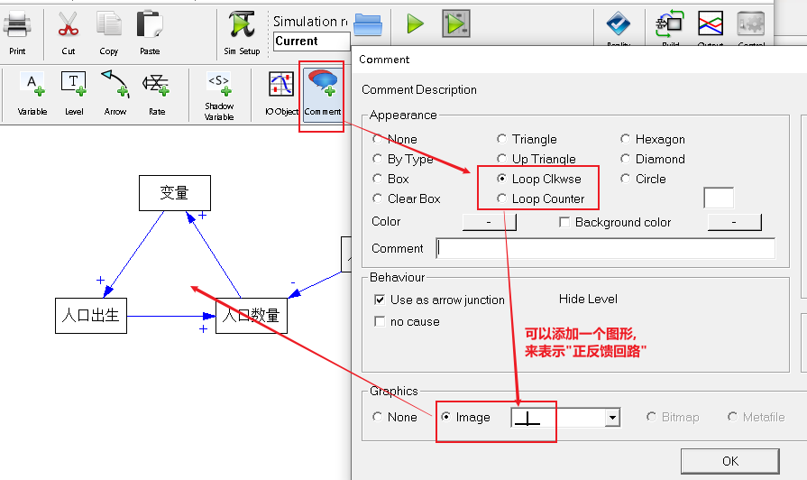

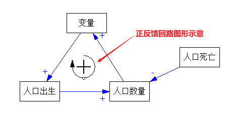

== 建立模型

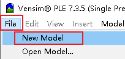

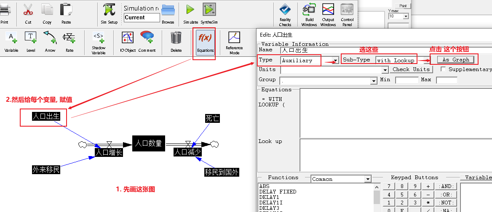

注意: 上图还需添加一个 time变量, 然后再来给里面的其他变量赋值(按 f(x)按钮)

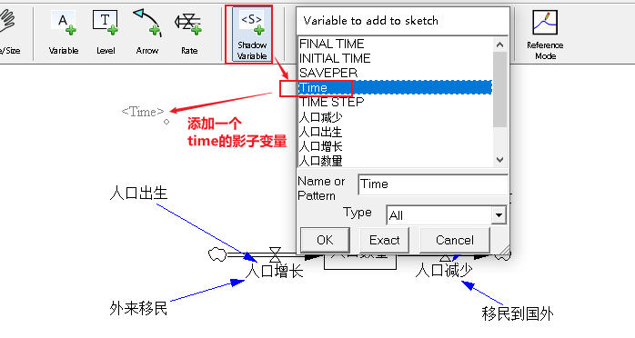

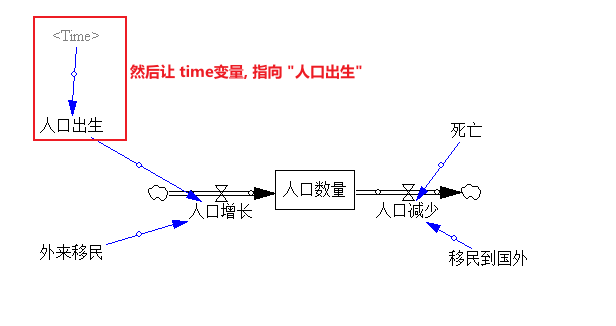

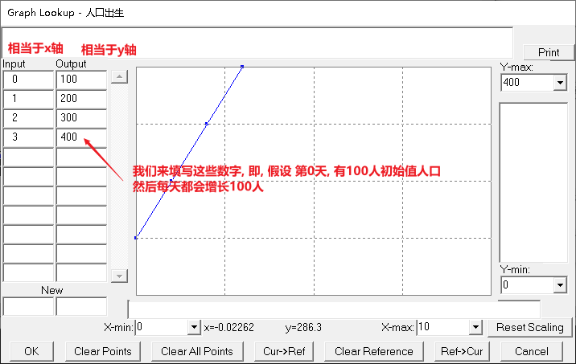

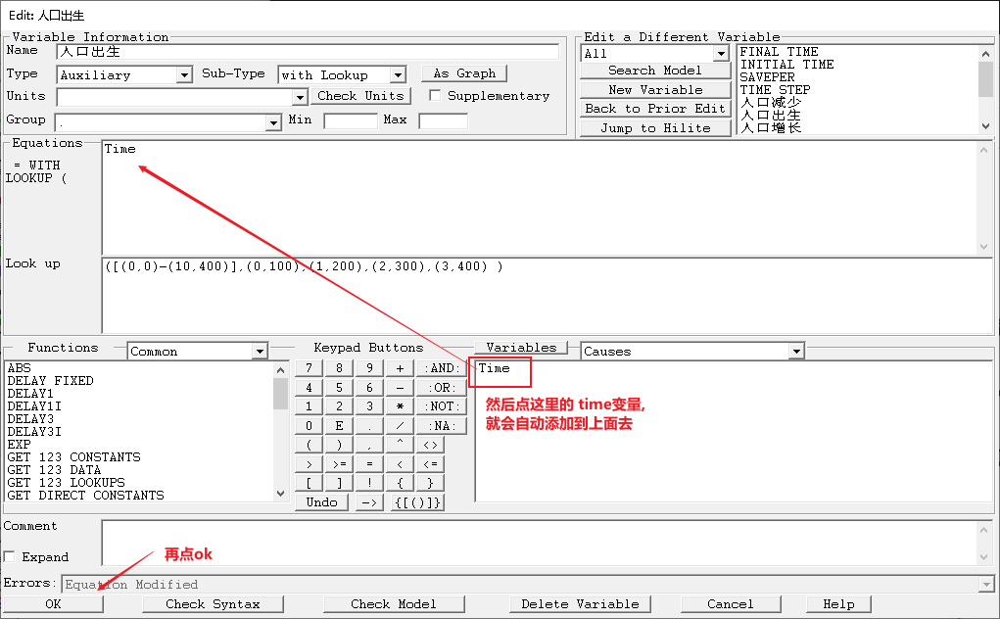

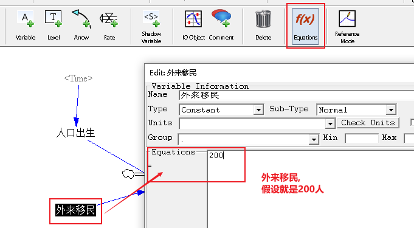

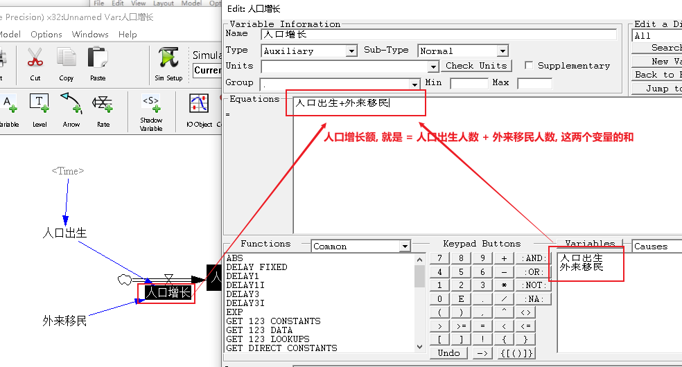

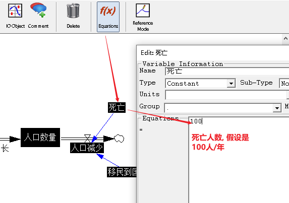

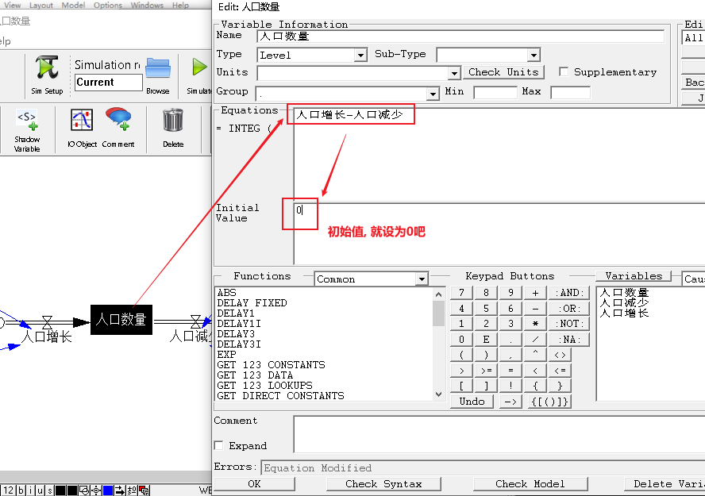

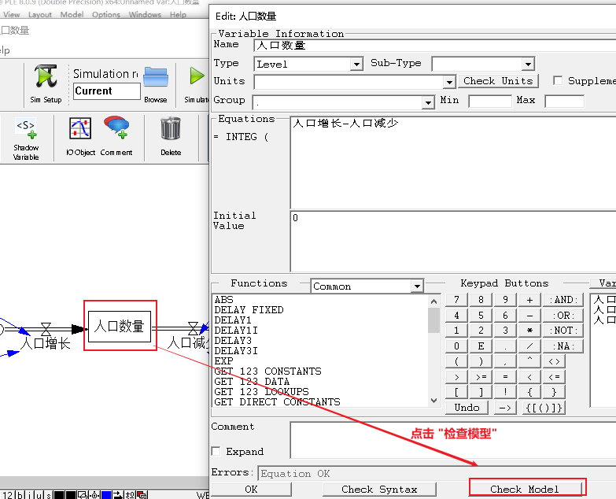

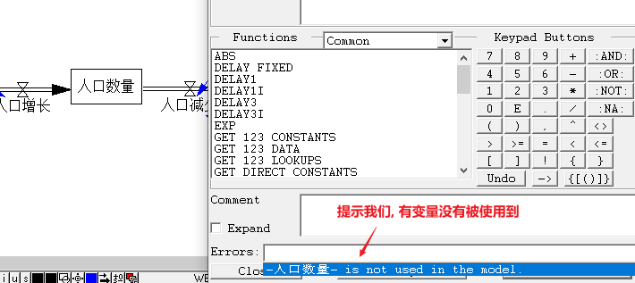

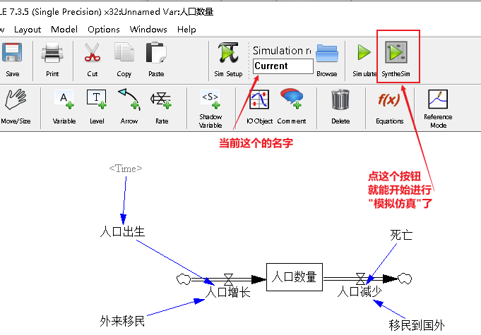

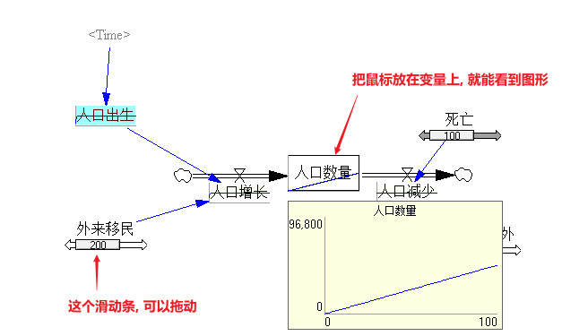

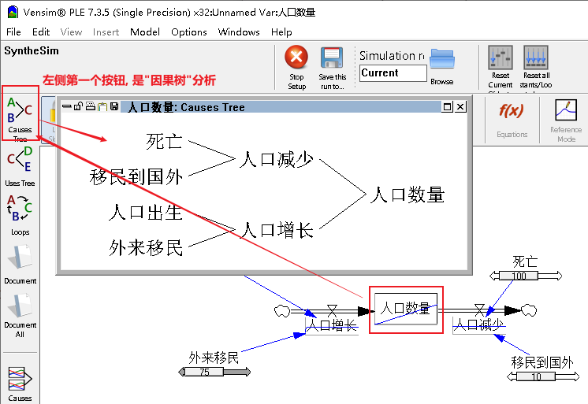

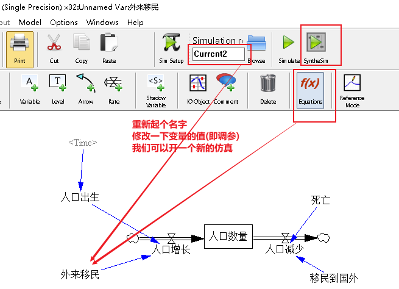

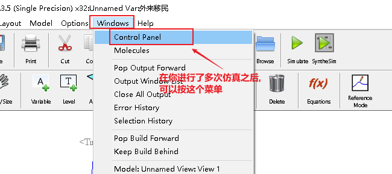

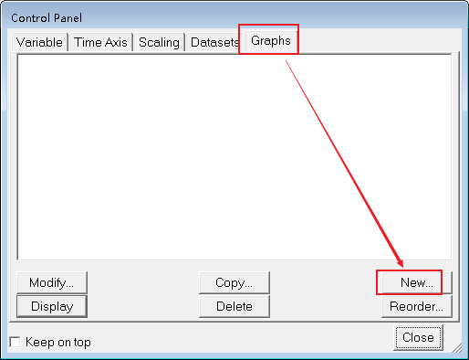

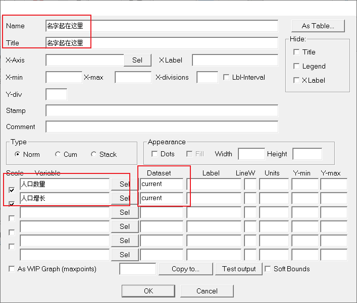

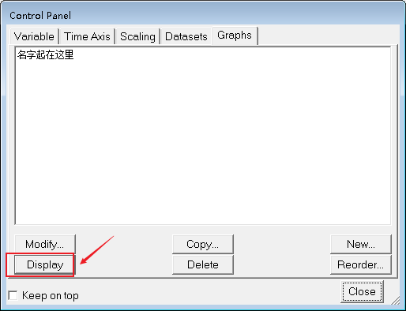

image:img/025.png[,]

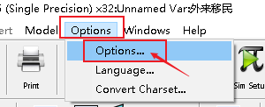

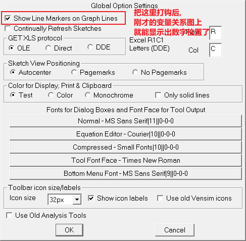

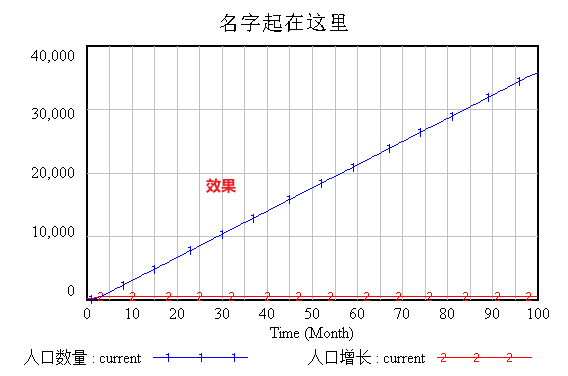

== 给变量赋值时, 时间单位

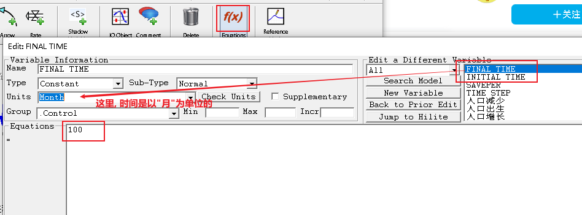

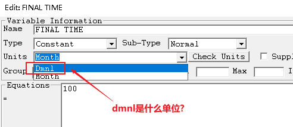

Dmnl 是"无量纲化单位"，就是消除了单位的影响，比如统计学的标准化后的均值和方差, 就是消除了量纲单位的影响. +
dimensionless。无量纲单位。比如比值，指数等无单位。

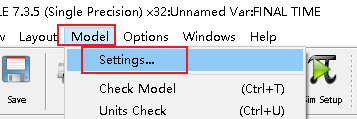

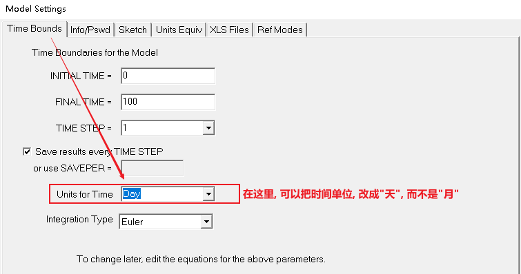

image:img/033.png[,]

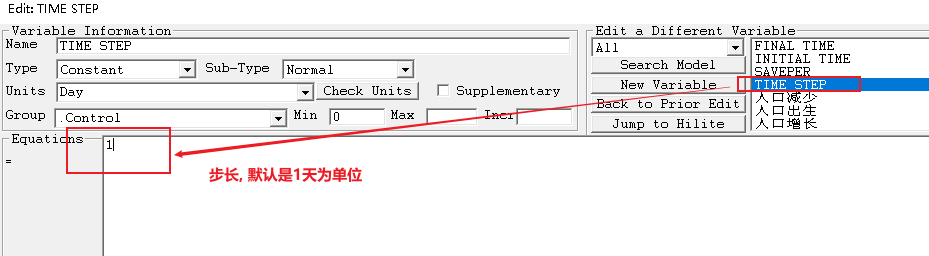

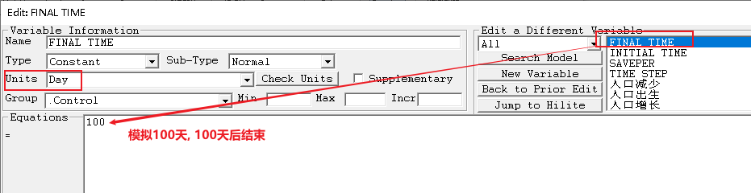

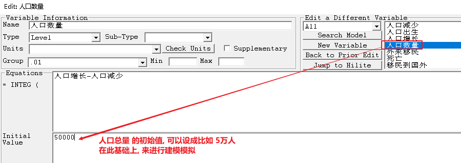

image:img/037.png[,]

image:img/038.png[,]

image:img/039.png[,]

image:img/040.png[,]

image:img/041.png[,]

image:img/042.png[,]

image:img/043.png[,]

image:img/044.png[,]

image:img/045.png[,]

image:img/046.png[,]

image:img/047.png[,]

image:img/048.png[,]

image:img/049.png[,]

image:img/050.png[,]

image:img/051.png[,]

image:img/052.png[,]

image:img/053.png[,]

